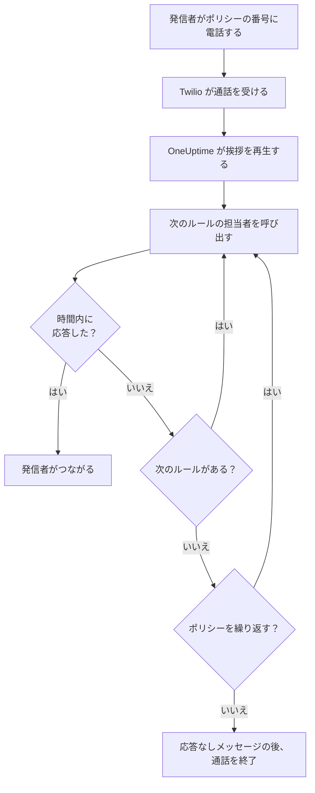
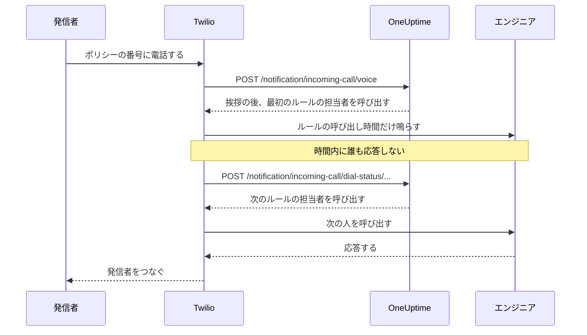

# 着信ポリシー

着信ポリシーは、オンコール担当者につながる電話番号をチームに提供します。誰かがその番号に電話をかけると、OneUptime はポリシーのエスカレーションルールに登録された人を誰かが応答するまで順番に呼び出し、発信者をつなぎます。番号と通話は、お使いの Twilio アカウントで動作します。

:::cards
- [ポリシーを設定する](#ポリシーを設定する): Twilio アカウントからテスト通話まで、7 つの手順で。
- [通話のルーティング](#通話のルーティング): 誰をどれだけ呼び出し、発信者に何が聞こえるか。
- [不在着信](#不在着信): 誰に通知され、ワークフローでどう対応するか。
- [トラブルシューティング](#トラブルシューティング): 通話が届かない、またはエンジニアにつながらない場合。
:::

## 始める前に

| 必要なもの | 理由 |
| --- | --- |
| Twilio アカウントと、その Account SID と Auth Token | ポリシーの番号と通話はこのアカウントで動作し、Twilio はこのアカウントに料金を請求します。 |
| OneUptime Cloud の **Growth** プラン | プロジェクトが独自の Twilio 設定を持つために必要です。 |
| セルフホストの場合、Twilio から到達できる OneUptime サーバー | Twilio はすべての通話を `https://<your host>/notification/incoming-call/voice` に送ります。 |
| プロジェクトで **SMS** がオンになっていること | 各エンジニアの番号は、SMS で送られるコードで確認します。 |
| 各エンジニアの確認済みの番号 | ルールが呼び出すのは、プロジェクトで着信用の番号を追加して確認した人だけです。 |

## ポリシーを設定する

:::steps
### Twilio アカウントを追加する

**プロジェクト設定** > **通知** > **通知設定** に移動します。 **Twilio 設定** カードで **Twilio 設定を作成** をクリックし、フォームに入力します。

- **名前** と **説明**: アカウントの用途。たとえば「サポート窓口」。
- **Twilio アカウント SID**: Twilio Console から取得します。 `AC` で始まります。
- **Twilio 認証トークン**: Twilio Console から取得します。
- **Twilio プライマリ電話番号**: そのアカウントの番号で、アカウントが送る SMS と通話に使います。
- **Twilio セカンダリ電話番号**: 任意です。その国の受信者に対して、プライマリの代わりに送信する番号です。
- **プロジェクトのデフォルトに設定**: プロジェクトで最初の Twilio 設定ではオンになっており、プロジェクトのメンバーへの SMS と通話もこのアカウントを通じて送られます。このアカウントを着信専用にする場合はオフにしてください。

### ポリシーを作成する

**オンコール** > **着信ポリシー** に移動し、 **着信ポリシーを作成** をクリックします。「サポート窓口」のような **名前** と、必要に応じて **説明** と **ラベル** を入力します。その後、一覧からポリシーを開きます。

### Twilio アカウントを選ぶ

ポリシーの **概要** には、3 つの番号付き手順がある **セットアップ** カードが表示されます。最初の手順で **選択** をクリックし、 **Twilio 設定** でアカウントを選んで **保存** をクリックします。

### 電話番号を追加する

2 つ目の手順で **電話番号を追加** をクリックします。Twilio アカウントにすでにある番号を使うには **既存の電話番号を使用** を、新しい番号を取得するには **新しい電話番号を予約** を選びます。OneUptime が番号の向き先を自分自身に設定するため、Twilio で設定する必要はありません。 [電話番号](#電話番号) を参照してください。

### エスカレーションルールを追加する

3 つ目の手順で **ルールを管理** をクリックします。呼び出すオンコールスケジュールまたは人ごとに、呼び出す順番でルールを追加します。 [エスカレーションルール](#エスカレーションルール) を参照してください。

### 各エンジニアの番号を確認する

ルールが呼び出す可能性のある全員が、着信用の自分の番号を追加して確認します。 [エンジニアの電話番号](#エンジニアの電話番号) を参照してください。

### 番号に電話をかける

3 つの手順がすべて完了すると、カードは **電話番号と Twilio の設定** に変わります。任意の電話から番号に電話をかけ、ポリシーの **通話ログ** を開いて、誰が呼び出されたかを確認します。
:::

## 通話のルーティング

1. Twilio が通話を OneUptime に送り、OneUptime がポリシーの **挨拶メッセージ** を読み上げます。
2. OneUptime は最初のエスカレーションルールが指定する人を呼び出します。その人本人か、その時点でルールのオンコールスケジュールのオンコール担当者で、ユーザーオーバーライドも反映されます。呼び出される人の電話には、ポリシーの番号が発信元として表示されます。
3. ルールの **呼び出し時間** 内に応答すると発信者がつながり、通話ログに応答者が記録されます。
4. 応答がなければ、発信者には "Connecting you to the next available engineer." が聞こえ、次のルールの担当者が呼び出されます。
5. 最後のルールの後、 **誰も応答しない場合にポリシーを繰り返す** がオンなら、 **ポリシーの繰り返し回数** で指定した回数だけ最初のルールからやり直します。そうでなければ、発信者には **応答なしメッセージ** が聞こえ、通話は終了します。

その時点で呼び出せる人がいないルールは、誰も呼び出さずにスキップされます。スケジュールにオンコール担当者がいない、その人がこのプロジェクトで着信用の確認済み番号を持っていない、またはプロジェクトのメンバーではなくなった場合です。どのルールにも呼び出せる人がいないと、発信者には **対応者不在時のメッセージ** が聞こえます。無効なポリシーは、すべての通話に "Sorry, this service is currently disabled." と応答して切ります。

OneUptime は、すべてのリクエストで Twilio の署名を Twilio 設定の Auth Token で検証し、検証できないリクエストは拒否します。

> [!TIP]
> ポリシーの番号を「サポート窓口」のような連絡先として電話に保存しておくと、転送された通話がかかってきたときにすぐわかります。

## エスカレーションルール

エスカレーションルールは、誰かがポリシーの番号に電話をかけたときに、一覧の上から順に誰を呼び出すかを決めます。ポリシーを開き、サイドメニューで **エスカレーションルール** を選んで **エスカレーションルールを追加** をクリックします。ルールは短い 1 つの手順です。

- **呼び出す相手**: オンコールスケジュールまたは 1 人のユーザー。スケジュールの場合は、通話が届いた時点でそのスケジュールのオンコール担当者を呼び出します。ユーザーはプロジェクトのメンバーです。
- **呼び出し時間（秒）**: 次のルールに移るまで電話を鳴らす時間です。初期値は 20 秒で、Twilio は 5〜600 を受け付けます。
- **名前** と **説明** は任意で、 **その他の項目** の下にあります。名前のないルールは、一覧での位置によって **Level 1** 、 **Level 2** と表示されます。

ルールは一覧の上から順に呼び出され、新しいルールは末尾に追加されます。順序を変えるには、ルールの左上にあるハンドルをドラッグします。キーボードでは、ハンドルにフォーカスを移してスペースキーを押し、矢印キーで移動してから、もう一度スペースキーを押します。

> [!WARNING]
> **留守番電話に注意**: **呼び出し時間** は、応答のない通話をその人の電話が留守番電話に回すまでの時間より短くしてください。留守番電話が先に応答すると、発信者は留守番電話につながり、通話は次のルールに進みません。Twilio は呼び出しのたびに独自に数秒を追加します。新しいルールが 20 秒から始まるのはこのためです。既定値が 30 秒だったときに追加したルールは 30 秒のままです。その通話が留守番電話になる場合は、それらのルールの **呼び出し時間** を短くしてください。

たとえば、2 つのローテーションを試してからリーダーを呼び出す 3 つのルール:

| レベル | 呼び出す相手 | 呼び出し時間 |
| --- | --- | --- |
| Level 1 | プライマリのオンコールスケジュール | 20 秒 |
| Level 2 | セカンダリのオンコールスケジュール | 20 秒 |
| Level 3 | エンジニアリングリード（1 人） | 20 秒 |

## 電話番号

ポリシーには複数の番号を設定でき、どの番号も同じルールを呼び出します。各番号は 1 つのポリシーに属します。番号はポリシーの **概要** の **電話番号を追加** で追加します。

:::tabs
@tab 手持ちの番号を使う
1. **電話番号を追加** をクリックしてから **既存の電話番号を使用** をクリックします。OneUptime がポリシーの Twilio アカウントの番号を一覧表示します。
2. 番号の横の **選択** をクリックしてから **番号を割り当てる** をクリックします。

すでに通話をどこかに送っている番号には "Currently has a webhook configured" と表示されます。割り当てると、その番号の通話は OneUptime に送られるようになります。
@tab 新しい番号を予約する
1. **電話番号を追加** をクリックしてから、 **新しい電話番号を予約** と **番号を検索** をクリックします。
2. **国** を選びます。必要に応じて **市外局番（任意）** （例: 415）や、番号に含めたい数字を **含む（任意）** に入力します。 **検索** をクリックすると、最大 10 件の市内番号が一覧表示されます。
3. 番号の横の **予約** をクリックし、 **予約** で確定します。Twilio が番号の料金を Twilio アカウントに請求します。
:::

OneUptime は番号の音声 webhook を `https://<your host>/notification/incoming-call/voice` に設定します。セルフホストでは `HOST` と `HTTP_PROTOCOL` から組み立てられます。ポリシーを別の Twilio アカウントに移すには、先に番号を解放してください。アカウントを変更できるのは、ポリシーに番号がないときだけです。

番号を解放するには、番号の横の **解放** をクリックし、 **番号を解放** で確定します。

> [!CAUTION]
> 番号を解放すると、 **既存の電話番号を使用** で持ち込んだ番号であっても Twilio に返却され、再び取得できない場合があります。ポリシー、またはポリシーが使う Twilio 設定を削除した場合も、その番号は解放されます。

## エンジニアの電話番号

ルールは、その人がこのプロジェクトで着信用に確認した番号に電話をかけ、番号がない人はスキップします。各自が自分の番号を追加します。

:::steps
1. **ユーザー設定** > **着信ポリシー** > **着信用の電話番号** を開きます。 **着信ポリシー** はサイドメニューのセクションで、最初は折りたたまれています。
2. **着信ルーティング用の電話番号** カードで **着信ルーティング用の電話番号を追加** をクリックし、 `+15551234567` のように国番号付きで番号を入力します。
3. OneUptime がその番号に SMS で送る 6 桁のコードを **確認コード** に入力し、 **確認** をクリックします。 **Send a new code** で新しいコードが送られます。
:::

確認済みの番号は、プロジェクトごとに 1 人 1 つまでです。変更するには、先に古い番号を削除します。これらの番号は、オンコールの呼び出しに使われる **通知方法** の電話番号とは別のものです。

着信用の番号は SMS で確認するため、先にプロジェクトで **SMS** をオンにしておく必要があります。 **プロジェクト設定 > 通知 > 通知設定** の **通知チャネル** カードでこれをオンにできるのは、プロジェクトのオーナー、 **Billing Admin** 、または **Manage Billing** を持つ人です。

## 音声メッセージとポリシーの設定

ポリシーを開き、サイドメニューの **詳細** の下にある **設定** を選びます。 **音声メッセージ** カードの **メッセージを編集** で発信者に聞こえる内容を、 **ポリシー設定** カードの **ポリシーの設定を編集** でそれ以外を変更します。

| 設定 | 内容 | 新しいポリシーの値 |
| --- | --- | --- |
| **挨拶メッセージ** | 通話に応答したとき、最初の人を呼び出す前に読み上げます。 | "Please wait while we connect you to the on-call engineer." |
| **応答なしメッセージ** | すべてのルールを試しても誰も応答しなかったときに読み上げます。 | "No one is available. Please try again later." |
| **対応者不在時のメッセージ** | どのルールにも呼び出せる人がいないときに読み上げます。 | "We are sorry, but no on-call engineer is currently available. Please try again later or contact support." |
| **有効** | 無効なポリシーはすべての通話を断ります。 | オン |
| **誰も応答しない場合にポリシーを繰り返す** | 最後のルールの後、最初のルールからやり直します。 | オフ |
| **ポリシーの繰り返し回数** | やり直す回数。 | 1 |

Twilio はメッセージを音声合成で読み上げるため、聞こえてほしいとおりに書いてください。

## 通話ログ

すべての通話は、ポリシーのサイドメニューの **ログ** の下にある **通話ログ** ページに表示されます。 **発信者** 、 **発信先の番号** 、 **ステータス** 、応答した人（ **応答者** ）、 **期間** 、開始した日時（ **開始日時** ）です。通話の **タイムラインを表示** をクリックすると、 **通話のタイムライン** が表示されます。呼び出されたすべての人、使われた番号、各試行の結果です。

| ステータス | 起きたこと |
| --- | --- |
| **開始済み** 、 **エスカレーション済み** | 通話はまだ進行中です。着信して電話が鳴っているか、後のルールに移ったところです。 |
| **完了** | 誰かが応答し、発信者がつながりました。 |
| **応答なし** | すべてのエスカレーションルールを試しましたが、誰も応答しませんでした。発信者には **応答なしメッセージ** が聞こえました。 |
| **発信者が電話を切りました** | エンジニアの電話が鳴っている間に、発信者が電話を切りました。 |
| **失敗** | 誰も呼び出せませんでした。どのエスカレーションルールにも、着信用の確認済み番号を持つオンコールのユーザーがいなかったか（発信者には **対応者不在時のメッセージ** が聞こえました）、ポリシーが無効になっています。 |

## 不在着信

誰にもつながらずに終わった通話は不在着信です。ステータスは **応答なし** 、 **発信者が電話を切りました** 、 **失敗** のいずれかです。

### 通知される人

通話が不在着信になると、OneUptime はポリシーの所有者に通知します。ポリシーの **所有者** ページで追加したユーザーと、追加したチームのメンバーです。ポリシーに所有者がいない場合は、代わりにプロジェクトのオーナーに通知されます。

通知には、誰が電話をかけたか、どの番号にかけたか、なぜ誰も応答しなかったか、誰を呼び出し、各試行がどう終わったかが含まれます。通話ログの該当する通話へのリンクも含まれます。

所有者には既定でメールが届きます。各自が **ユーザー設定** > **通知設定** の **オンコール** > **着信ポリシー** > **不在着信** で、ほかのチャネル（SMS、電話、プッシュなど）を選ぶか、オフにできます。

### ワークフローで不在着信に対応する

着信の通話ログは、ワークフローのトリガーとして使えます。

- **On Create Incoming Call Log** は、通話が届いたときに実行されます。
- **On Update Incoming Call Log** は、通話の進行に合わせて実行されます。 **Ended At** を設定する更新が通話の終了です。

不在着信にだけ対応するには（Slack や Microsoft Teams に投稿したり、チケットを作成したりする場合など）:

:::steps
1. **On Update Incoming Call Log** トリガーを追加します。 **Listen on** を **Ended At** に設定し、 **Status** 、 **Caller Phone Number** 、 **Routing Phone Number** など、使いたいフィールドを選びます。
2. **If / Else** ステップを追加します。トリガーの **Status** を、比較 **is not equal to** と `Completed` で確認します。
3. 自分のステップを **Yes** ポートにつなぎます。
:::

ワークフローは **Find One** と **Find Many** で通話ログを読み取れますが、作成や変更はできません。

## 電話番号を追加、解放できる人

ポリシーの電話番号には、ポリシー自体と同じロールが適用されます。

- **番号の検索** - 予約する番号を Twilio で探すこと、または Twilio アカウントにすでにある番号を一覧表示すること - には、着信ポリシーを読み取る権限と、通話と SMS の設定を読み取る権限が必要です。そのどちらかを通じて Twilio アカウントを読み取るからです。 **Project Owner** 、 **Project Admin** 、 **Project Member** 、 **Viewer** 、 **Settings Admin** 、 **Settings Member** 、 **Settings Viewer** は両方を持っています。カスタムロールでは **Read Incoming Call Policy** と **Read Call and SMS** です。
- **番号の予約、既存の番号の使用、番号の解放** には、着信ポリシーを編集する権限が必要です。 **Project Owner** 、 **Project Admin** 、 **Project Member** 、 **Settings Admin** 、 **Settings Member** 、またはカスタムロールの **Edit Incoming Call Policy** です。これらの操作で変わるのは、編集できるポリシーの番号です。一部のラベルに限定されたロールでは、それらのラベルが付いたポリシーです。

これらの権限のいずれかに対するラベルなしのチームのブロックは、その権限を取り除きます。それ以外の人には、 **電話番号を追加** と **解放** がロックされた状態でページに残り、ツールチップに必要な権限が表示されます。API は、必要な権限を伝える文でリクエストを拒否します: "Looking up phone numbers needs permission to read incoming call policies and call and SMS settings." または "Adding or releasing a phone number needs permission to edit incoming call policies." 番号の予約料金は OneUptime の残高ではなく自分の Twilio アカウントに請求されるため、請求の権限は不要です。

## API または Terraform でポリシーを作成する

| リソース | API ルート |
| --- | --- |
| 着信ポリシー | `/api/incoming-call-policy` |
| そのエスカレーションルール | `/api/incoming-call-policy-escalation-rule` |
| その電話番号（読み取り専用） | `/api/incoming-call-policy-phone-number` |
| 通話ログ（読み取り専用） | `/api/incoming-call-log` |

`escalateAfterSeconds` なしで API から作成したルールは 20 秒間呼び出します。 `escalate_after_seconds` なしで Terraform が作成するルールも同じです。

### エスカレーションルールの設定

| 設定 | API フィールド | 保持する内容 |
| --- | --- | --- |
| 呼び出す相手 | `onCallDutyPolicyScheduleId` または `userId` | どちらか一方で、両方は不可。オンコール担当者を呼び出すスケジュール、またはユーザー。 |
| 呼び出し時間（秒） | `escalateAfterSeconds` | 通話が次に進むまで電話を鳴らす時間（既定値: 20、5〜600）。 |
| 名前と説明 | `name` 、 `description` | 任意。名前のないルールは、一覧での位置によって Level 1、Level 2 などと表示されます。 |
| 順序 | `order` | 一覧内でのルールの位置。ルールは上から順に呼び出されます。順序のない新しいルールは末尾に追加されます。 |

## トラブルシューティング

:::details 通話が OneUptime に届かない
- Twilio Console で番号を開きます。 **A call comes in** は、HTTP POST の webhook `https://<your host>/notification/incoming-call/voice` である必要があります。OneUptime は番号の追加時に `HOST` と `HTTP_PROTOCOL` からこれを設定します。その後これらが変わった場合は、Twilio で webhook を修正してください。
- セルフホストの OneUptime には、インターネットから https で到達できる必要があります。Twilio Console の番号の通話ログと Twilio の **Debugger** で、OneUptime の応答を確認できます。
- `403` の応答は、リクエストの署名を検証できなかったことを意味します。Twilio 設定にアカウントの現在の **Twilio 認証トークン** が入っていること、そして OneUptime の手前のプロキシが Twilio が呼び出したホストとスキーム（ `X-Forwarded-Host` と `X-Forwarded-Proto` ）を渡していることを確認してください。
:::

:::details 通話には応答するが、誰も呼び出されない
通話ログには **失敗** と表示されます。ポリシーが **有効** であること、各ルールのオンコールスケジュールに現在オンコール担当者がいること、ルールが呼び出す人がこのプロジェクトの **ユーザー設定** > **着信ポリシー** > **着信用の電話番号** に確認済みの番号を持っていることを確認してください。ルールはプロジェクトのメンバーしか呼び出しません。
:::

:::details 通話が留守番電話になる
エンジニアの留守番電話になる場合は、ルールの **呼び出し時間** を、その人の電話が留守番電話に切り替わるまでの時間より短くしてください。留守番電話の応答も応答とみなされ、通話はそこで止まります。
:::

:::details 新しい番号を予約できない
多くの国で、Twilio は市内番号を販売する前に承認済みの regulatory bundle を必要とし、番号によっては Twilio の残高がプラスである必要があります。Twilio Console でそれを設定するか、そこで番号を取得して **既存の電話番号を使用** で追加してください。
:::

:::details ポリシーの Twilio アカウントを変更できない
アカウントを変更できるのは、ポリシーに電話番号がないときだけです。ページには "Remove all phone numbers to change" と表示されます。番号を解放すると Twilio に返却されるため、先に移行を計画してください。
:::

:::details エンジニアの番号の確認コードが届かない
プロジェクトで SMS がオンになっている必要があります。OneUptime Cloud では、独自のデフォルトの Twilio 設定がないプロジェクトは、SMS の料金を自分の残高から支払います。残高は 1 USD を超えている必要があります。コードが届くまで 1 分ほどかかることがあります。 **Send a new code** をクリックすると別のコードが送られます。 **プロジェクト設定** > **通知** > **通知ログ** でその経過を確認できます。
:::

## 次のステップ

:::cards
- [エスカレーションルール](/docs/on-call/escalation-rules): オンコールポリシーがレベルごとに人を呼び出す仕組み。
- [オンコールスケジュール](/docs/on-call/schedules): ルールが呼び出すローテーションを作成します。
- [ワークフロー](/docs/workflows/index): 不在着信に対応します。チャネルに投稿したり、チケットを作成したりできます。
- [Twilio SMS・音声連携](/docs/self-hosted/twilio-integration): セルフホストのインストール用に Twilio を設定します。
:::
