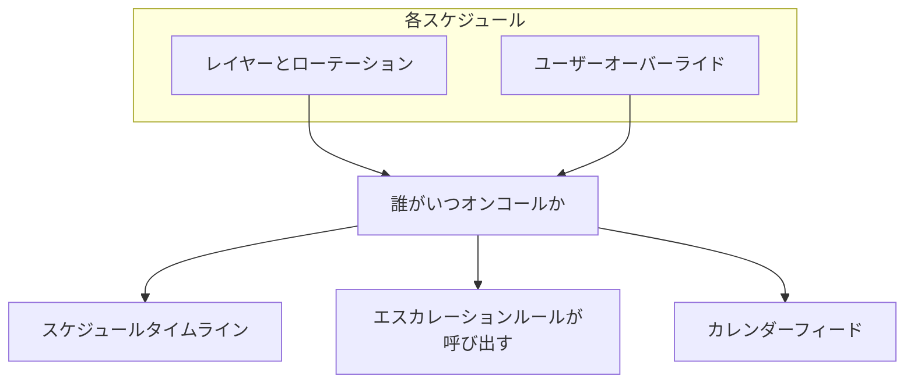

# スケジュールタイムライン

スケジュールタイムラインは、プロジェクトのすべてのオンコールスケジュールを 1 つの週または月のグリッドに表示します。行がスケジュール、列が日です。各スケジュールを開かなくても、「今週、自分のチームや組織全体で誰がオンコールか」がわかります。

タイムライン上のシフトは、ユーザーオーバーライドを含め、OneUptime が人を呼び出すときに使うシフトそのものです。タイムライン、エスカレーションルール、カレンダーフィードは、すべて同じ場所からシフトを読み取ります。

## タイムラインを開く

- **オンコール** > **スケジュールタイムライン** には、表示できるすべてのスケジュールが所有チームごとにまとめて表示されます。 **オンコールスケジュール** の **タイムライン表示** ボタンでも同じページが開きます。
- **チーム** > チーム > **オンコールスケジュール** には、そのチームが所有するスケジュールだけが表示されます。

チームがスケジュールの **所有者** ページに登録されていれば、そのチームがスケジュールを所有しています。所有チームのないスケジュールは **所有者チームなし** にまとめられます。 **チームでグループ化** をオフにすると、すべてのスケジュールが名前順の 1 つの一覧で表示されます。

## グリッドの見方

| グリッド上の表示 | 意味 |
| --- | --- |
| バー | シフト。誰がいつからいつまでオンコールか。同じ人はどのスケジュールでも同じ色です。 |
| 薄いバー | 過去のシフト。 |
| **⇄** の付いたバー | オーバーライド。誰かがシフトを代わっています。その下の細い帯には、シフトを代わってもらった人が取り消し線付きで表示されます。 |
| 斜線の入った琥珀色のブロック | カバレッジの空白。誰もオンコールではありません。そのスケジュールへエスカレーションするアラートは、そのとき誰も呼び出しません。 |
| 赤い線 | 現在。 |
| スケジュール名の下の行 | 現在のオンコール担当者、または **現在オンコールの担当者はいません** 。 |

バーや空白にポインターを合わせるか、キーボードで移動すると、詳細が表示されます。

グリッドの下の **今週のオンコール** （月表示では **今月のオンコール** ）には、期間中にオンコールになる全員が表示されます。名前にポインターを合わせると、その人がどれだけの時間、いくつのスケジュールでオンコールかがわかります。

## 期間とタイムゾーンを変更する

- **週** と **月** を切り替え、矢印で移動し、 **今日** で戻ります。
- 時刻は自分のタイムゾーンで表示されます。タイムゾーンボタンで開く **タイムラインを表示するタイムゾーン** では、誰がいつオンコールかを変えずに、タイムラインを別のタイムゾーンで表示できます。各スケジュールは引き続き自分のタイムゾーンで引き継ぎます。
- タイムラインは過去 180 日から今後 365 日までを対象とします。

> [!NOTE]
> 過去のシフトは各スケジュールの現在の設定から計算し直されるため、現在設定されているとおりのローテーションが表示されます。これは当時実際に呼び出された人と異なる場合があります。実際にオンコールだった時間には、 **オンコール** > **レポート** > **ユーザーのオンコール時間** を使ってください。

## スケジュールや人を探す

- **検索** は、スケジュール名、チーム名、オンコールの担当者に一致します。
- チームフィルターで、表示を 1 つのチームまたは **自分のチーム** に絞り込めます。 **自分が含まれるスケジュール** は、自分が含まれるスケジュールだけを残します。
- グリッドの上の **現在オンコールの担当者なし** または **今週カバレッジの空白あり** （月表示では **今月カバレッジの空白あり** ）をクリックすると、該当するスケジュールだけが表示されます。もう一度クリックするとすべて表示されます。
- グリッドの下の人、またはその人のバーをクリックすると、その人のシフトがすべてハイライトされます。 **ハイライトを解除** で元に戻し、 **フィルターをクリア** で検索とフィルターをリセットします。

## 誰に何が見えるか

| 対象 | ルール |
| --- | --- |
| 権限 | **オンコールスケジュール** と同じ権限とラベル制限に加えて、スケジュールのレイヤーを読み取る権限。 |
| オーバーライド | オーバーライドが誰のシフトを代わっているかは、ユーザーオーバーライドを読み取れる人にだけ表示されます。それ以外の人にも、誰が呼び出されるかは表示されます。 |
| スケジュールの数 | 一度に最大 250 件のスケジュールを名前順に表示します。チームの **オンコールスケジュール** ページでは、そのチームが所有するスケジュールに絞り込まれます。 |
| プラン | OneUptime Cloud では、オンコールスケジュールと同じく、タイムラインには **Growth** プランが必要です。 |

## 次のステップ

:::cards
- [オンコールスケジュール](/docs/on-call/schedules): 交代で担当する人、レイヤー、オンコールの時間帯を設定します。
- [カレンダーフィード](/docs/on-call/calendar-feeds): シフトを Google カレンダー、Outlook、Apple カレンダーに表示します。
- [エスカレーションルール](/docs/on-call/escalation-rules): オンコールポリシーの各レベルが誰を呼び出すかを決めます。
:::
