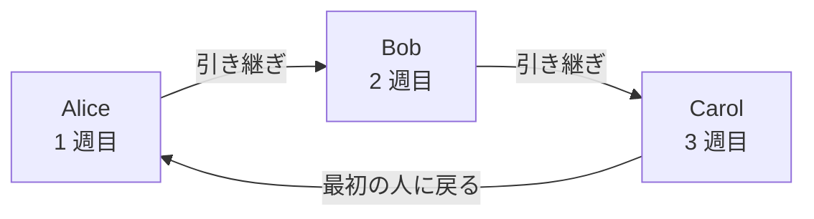
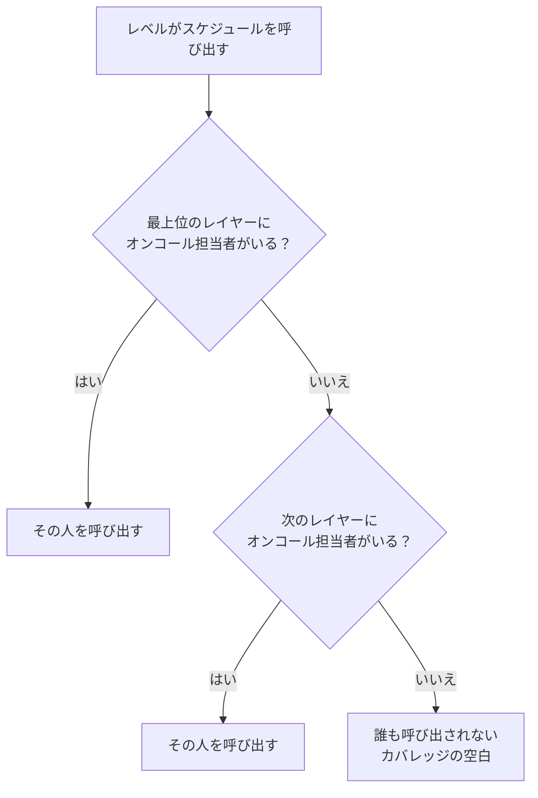

# オンコールスケジュール

オンコールスケジュールは、どの時点で誰がオンコールかを決めます。スケジュールでは人が交代で担当します。それぞれが一定期間オンコールを務め、次の人が引き継ぎます。スケジュールをオンコールポリシーのエスカレーションルールに追加すると、そのレベルが実行されたときに、ポリシーはそのスケジュールのオンコール担当者を呼び出します。

> [!NOTE]
> OneUptime Cloud では、オンコールスケジュールは **Growth** プラン以上で使えます。プロジェクトに残っているスケジュールは、Growth の試用期間が終わったりプランが下がったりした後も、それを指定しているエスカレーションルールを通じて担当者を呼び出し続けます。そのため **Growth** 未満では、 **オンコールスケジュール** ページにプランの注記が表示され、その下にまだ設定されているスケジュールが表示されます。そこで削除できます。スケジュールの作成や変更には **Growth** が必要です。

:::cards
- [交代で担当する人](#交代で担当する人): 最初のローテーションを持つスケジュールを作成します。
- [レイヤー](#レイヤー): ローテーションを重ね、オンコールの時間帯を制限し、予備の担当を追加します。
- [API と Terraform](#api-または-terraform-でスケジュールを作成する): スケジュールとローテーションをコードとして作成します。
:::

## 交代で担当する人

**オンコールスケジュール** ページでスケジュールを作成すると、フォームは **名前** と **誰が交代で担当しますか？** を尋ねます。選んだ人がスケジュールの最初のレイヤー **Layer 1** になり、24 時間体制でオンコールを担当します。

:::steps
1. **オンコール** > **オンコールスケジュール** に移動し、 **オンコールスケジュールを作成** をクリックします。
2. **名前** を入力します。
3. **誰が交代で担当しますか？** で **ユーザーを追加** をクリックし、交代する順に人を選びます。
4. 必要に応じて **その他の項目** を開き、1 回の担当期間、タイムゾーン、説明、ラベルを変更します。
5. **オンコールスケジュールを作成** をクリックします。作成したスケジュールはその **レイヤー** ページで開き、そこでローテーションを変更したりレイヤーを追加したりできます。
:::

担当者は 1 人ずつ交代し、スケジュールを作成するとすぐに最初の人がオンコールになります。



**誰が交代で担当しますか？** は省略できます。空のままにすると、スケジュールはレイヤーなしで作成されます。その **レイヤー** ページでレイヤーを追加するまで、誰もオンコールになりません。この質問は、レイヤーを追加できる人にだけ表示されます。

それ以外の項目はすべて **その他の項目** の下にあり、開くまでは折りたたまれています。

| 項目 | 内容 |
| --- | --- |
| **1 回の担当期間** | **1 日** 、 **1 週間** 、 **2 週間** 、 **1 か月** のいずれかで、変更しなければ **1 週間** です。誰かが交代で担当するようになると尋ねられます。各人がその期間オンコールを務め、スケジュールを作成した時刻に次の人が引き継ぎます。 |
| **タイムゾーン** | 引き継ぎ時刻とオンコールの時間帯を保持するタイムゾーン。初期値は自分のタイムゾーンです。 |
| **説明** | スケジュールに関するメモ。 |
| **ラベル** | スケジュールを探したりグループ化したりするためのラベル。 |

誰かが交代で担当し、 **その他の項目** で何も変更していない間は、折りたたまれた見出しにこれから起きることが表示されます。各人が 1 週間オンコールを務め、次の人が引き継ぎます。

## レイヤー

スケジュールのローテーションは、その **レイヤー** ページにあるレイヤーで構成されます。レイヤーは上から順に読まれ、オンコール担当者がいる最も上のレイヤーが呼び出します。そのため、メインのローテーションを上に、予備の担当をその下に置きます。



**レイヤーを追加** は、最初のレイヤーと同じように始まるレイヤーを追加します。今からオンコールが始まり、各人が 1 週間ずつ、24 時間体制で担当します。レイヤーを展開すると、人を追加したり、開始時刻、引き継ぎの頻度、最初の引き継ぎ時刻、オンコールの時間帯を変更したりできます。

| 項目 | 設定内容 |
| --- | --- |
| **レイヤー名** | レイヤーが担当する範囲。たとえば「平日のプライマリ」。 |
| **ローテーションの開始** | レイヤーのローテーションが始まる日時。 |
| **ローテーションの間隔** | オンコールがレイヤー内の次の人に移る頻度。 |
| **最初の引き継ぎ時刻** | 次の人への最初の引き継ぎ。開始時点またはそれ以降です。以降の引き継ぎはローテーションの間隔ごとに行われます。 |
| **制限** | レイヤーがオンコールを担当する時間帯。スケジュールのタイムゾーンで **制限なし** 、 **1 日の特定の時刻** 、 **1 週間の特定の時刻** のいずれかです。その時間帯の外では下のレイヤーが引き継ぎます。 |

どのレイヤーを先にするかを変えるには、レイヤーのメニューで **レイヤーを上へ移動（優先度を上げる）** または **レイヤーを下へ移動（優先度を下げる）** を使います。

各人はどこでも同じ色を保つので、ひと目で追えます。各レイヤー、最終的なスケジュールとそのオーバーライド、そして **スケジュールタイムライン** でも同じ色です。

## API または Terraform でスケジュールを作成する

オンコールスケジュールは `/api/on-call-duty-policy-schedule` リソースです。そのレイヤーとレイヤー内の人は `/api/on-call-duty-schedule-layer` と `/api/on-call-duty-schedule-layer-user` リソースです。

- `miscDataProps` に `firstLayerUsers` （交代する順に並べたユーザー ID のリスト）を含めてスケジュールを作成すると、ダッシュボードと同じく最初のレイヤーが作成されます。今からオンコールが始まり、24 時間体制の **Layer 1** です。 `firstLayerRotation` は 1 回の担当期間を `{"_type": "Recurring", "value": {"intervalType": "Week", "intervalCount": 1}}` のようなローテーションで指定します。省略すると 1 週間です。すべてのユーザーがプロジェクトのメンバーで、呼び出し元にレイヤーを作成する権限が必要です。そうでなければスケジュールは作成されません。
- これらなしで作成したスケジュールには、従来どおりレイヤーがありません。Terraform のスケジュールリソースはこれらを送りません。
- `rotation` なしで作成したレイヤーは、これまでどおり毎日引き継ぎます。

```bash
curl -X POST https://oneuptime.com/api/on-call-duty-policy-schedule \
  -H "apikey: $ONEUPTIME_API_KEY" \
  -H "Content-Type: application/json" \
  -d '{
    "data": {
      "projectId": "<project-id>",
      "name": "Primary on-call",
      "timezone": "Europe/Berlin"
    },
    "miscDataProps": {
      "firstLayerUsers": ["<user-id-1>", "<user-id-2>", "<user-id-3>"],
      "firstLayerRotation": {"_type": "Recurring", "value": {"intervalType": "Week", "intervalCount": 1}}
    }
  }'
```

## 次のステップ

:::cards
- [エスカレーションルール](/docs/on-call/escalation-rules): オンコールポリシーのレベルからこのスケジュールを呼び出します。
- [スケジュールタイムライン](/docs/on-call/schedule-timeline): すべてのスケジュールをカバレッジの空白とともに並べて確認します。
- [カレンダーフィード](/docs/on-call/calendar-feeds): シフトを Google カレンダー、Outlook、Apple カレンダーに表示します。
:::
