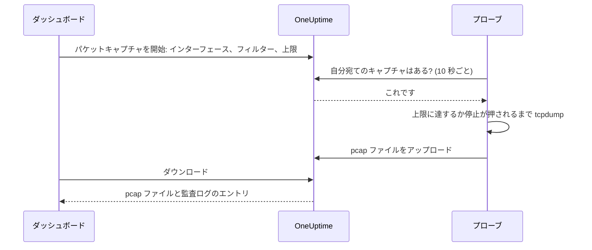

# パケットキャプチャ

プローブが見ているトラフィックをダッシュボードから直接キャプチャし、ファイルを Wireshark で開けます。プローブはトラブルシューティング対象のネットワークにすでに置かれているので、VPN を開く必要も、踏み台サーバーにログインする必要もありません。

キャプチャは、プローブを運用する人がオンにするまで、どのプローブでもオフです。また、キャプチャはプロジェクト専用のプローブでのみ実行されます。

:::cards
- [仕組み](#仕組み): 「パケットキャプチャを開始」から Wireshark で開くファイルまで。
- [パケットキャプチャをオンにする](#パケットキャプチャをオンにする): プローブを運用する人が Docker、Docker Compose、Kubernetes で設定する内容。
- [キャプチャを開始する](#キャプチャを開始する): インターフェースを選び、必要なものに絞り込み、ファイルをダウンロードします。
- [リファレンス](#リファレンス): 上限、フィルター、権限、監査ログ、ファイルの保存期間。
- [トラブルシューティング](#トラブルシューティング): 失敗したキャプチャのメッセージの意味。
:::

## 仕組み



1. **開始。** キャプチャの開始を許可された人が、プローブのインターフェース、フィルター、上限を選び、**キャプチャを開始** をクリックします。OneUptime はキャプチャを保存する前に、フィルターと上限がプローブの許可する範囲内かを確認します。
2. **取得。** プローブは、モニターを問い合わせるのと同じように、10 秒ごとに OneUptime に作業を問い合わせます。キャプチャを受け取ると `tcpdump` を開始します。
3. **キャプチャ。** キャプチャは、期間、パケット数の上限、ファイルサイズのうち最初に達した上限で停止します。**停止** を押すと早めに終了し、それまでにキャプチャした内容は残ります。
4. **アップロード。** プローブが pcap ファイルをアップロードします。OneUptime はそれをプロジェクトの非公開ファイルとして保存します。
5. **ダウンロード。** キャプチャに **完了** と **ダウンロード** ボタンが表示されます。ファイルは Wireshark、tcpdump、その他 pcap ファイルを読めるツールで開けます。

## 始める前に

- **プロジェクト専用のプローブ。** グローバルプローブは他のプロジェクトのトラフィックも扱うため、キャプチャは行いません。専用のプローブのインストール方法は [カスタム プローブ](/docs/probe/custom-probe) を参照してください。
- **このリリース以降のプローブ。** 古いプローブは、どこでキャプチャできるかを報告しません。
- **適切な権限。** キャプチャの開始と停止には **Start Packet Capture**、ファイルのダウンロードには **Download Packet Capture** が必要です。プロジェクトのオーナーと管理者は両方を持っています。[権限](#権限) を参照してください。
- **プローブに届かないトラフィックにはミラーポート。** プローブが見えるのは、自身のホストのインターフェース上のトラフィックだけです。他の機器間のトラフィックをキャプチャするには、それらのスイッチポートを (SPAN で) プローブのホストの空きインターフェースにミラーリングします。

## パケットキャプチャをオンにする

キャプチャは、プローブを運用する人がプローブの実行環境でオンにします。ダッシュボードからはオンにできない設計です。プローブには次の 3 つが必要です。

| 設定 | 理由 |
| --- | --- |
| `PROBE_PACKET_CAPTURE_ENABLED=true` | キャプチャをオンにします。それ以外の値、または未設定ならオフのままです。 |
| ホストネットワーク | プローブがホスト自身のインターフェースとミラーポートを見られるようにします。これがないと、プローブにはコンテナのネットワークしか見えません。 |
| `NET_RAW` ケーパビリティ | tcpdump がキャプチャできるようにします。Docker はデフォルトで付与します。Kubernetes の Pod Security の restricted 標準では外されるので、追加してください。 |

:::tabs
@tab Docker
```bash
docker run --name oneuptime-probe --network host \
  --cap-add NET_RAW \
  -e PROBE_KEY=<probe-key> \
  -e PROBE_ID=<probe-id> \
  -e ONEUPTIME_URL=https://oneuptime.com \
  -e PROBE_PACKET_CAPTURE_ENABLED=true \
  -d oneuptime/probe:release
```
@tab Docker Compose
```yaml
services:
  oneuptime-probe:
    image: oneuptime/probe:release
    container_name: oneuptime-probe
    network_mode: host
    cap_add:
      - NET_RAW
    environment:
      - PROBE_KEY=<probe-key>
      - PROBE_ID=<probe-id>
      - ONEUPTIME_URL=https://oneuptime.com
      - PROBE_PACKET_CAPTURE_ENABLED=true
    restart: always
```
@tab Kubernetes
```yaml
apiVersion: apps/v1
kind: Deployment
metadata:
  name: oneuptime-probe
spec:
  selector:
    matchLabels:
      app: oneuptime-probe
  template:
    metadata:
      labels:
        app: oneuptime-probe
    spec:
      hostNetwork: true
      dnsPolicy: ClusterFirstWithHostNet
      containers:
        - name: oneuptime-probe
          image: oneuptime/probe:release
          securityContext:
            capabilities:
              add: ["NET_RAW"]
          env:
            - name: PROBE_KEY
              value: "<probe-key>"
            - name: PROBE_ID
              value: "<probe-id>"
            - name: ONEUPTIME_URL
              value: "https://oneuptime.com"
            - name: PROBE_PACKET_CAPTURE_ENABLED
              value: "true"
```
:::

プローブが起動すると、ログに `Packet capture is on: captures of up to 30 minutes and 25 MB can be started on this probe from the dashboard.` と出力されます。1 分以内に、ダッシュボードのプローブのページに **パケットキャプチャを開始** が表示されます。

すべてのプローブが守る上限より低い上限をこのプローブに設定するには、次のいずれかを追加します。

| 変数 | デフォルト | 内容 |
| --- | --- | --- |
| `PROBE_PACKET_CAPTURE_MAX_DURATION_IN_SECONDS` | `1800` | このプローブが実行する最長のキャプチャ。5 から 1800 秒。 |
| `PROBE_PACKET_CAPTURE_MAX_FILE_SIZE_IN_MB` | `25` | このプローブが作成する最大のキャプチャファイル。1 から 25 MB。 |

> [!NOTE]
> セルフホストの OneUptime に Docker Compose や Helm チャートで付属するプローブはグローバルプローブなので、キャプチャは行いません。キャプチャしたいネットワークでカスタムプローブを実行してください。

## キャプチャを開始する

:::steps
### プローブまたはデバイスを開く

**モニター → 設定 → プローブ** を開いてプローブをクリックします。その **パケットキャプチャ** カードにキャプチャの一覧が表示されます。または、ネットワークデバイスを開いて **トラフィック** ページに移動します。そこでのキャプチャはデバイス自身のプローブで実行され、デバイスのアドレスで絞り込んだ状態で始まります。

### 「パケットキャプチャを開始」をクリックする

フォームは、キャプチャを開始する前に、キャプチャに何が含まれるかを示します。ネットワーク上を流れるパスワード、トークン、個人データはファイルに残ります。

### インターフェースを選ぶ

**すべてのインターフェース (any)** は、プローブのすべてのインターフェースでキャプチャします。ミラーリングされたトラフィックをキャプチャするときは、スイッチがトラフィックをミラーリングしている先のインターフェースを選びます。

### 対象のパケットを選ぶ

**ホストまたはネットワーク**、**ポート**、**プロトコル** を入力してキャプチャを絞り込むか、空のままにしてすべてのパケットを残します。フォームには、入力から作られるフィルター (例: `host 10.0.0.5 and tcp port 443`) が表示されます。独自のフィルターを書くには **代わりに BPF フィルターを書く** をクリックします。

### 上限を確認する

**その他の項目** には **期間**、**パケット数の上限**、**ファイルサイズの上限 (MB)** があります。その要約に、キャプチャがいつ停止するかが表示されます: `1 分、100,000 パケット、10 MB のいずれかに先に達した時点で停止します。`

### 「キャプチャを開始」をクリックする

キャプチャは、プローブが受け取るまで **保留中**、その後は進み具合とともに **実行中** と表示されます。早めに終了するには **停止** をクリックします。
:::

キャプチャが **完了** と表示されたら、**ダウンロード** をクリックし、`.pcap` ファイルを Wireshark で開きます。**すべてのインターフェース (any)** でのキャプチャは Linux cooked capture で、Wireshark は他のキャプチャと同じように読み込めます。

## リファレンス

### 上限

| 上限 | デフォルト | 範囲 |
| --- | --- | --- |
| 期間 | 1 分 | 5 秒から 30 分 |
| パケット数の上限 | 100,000 | 1 から 1,000,000 |
| ファイルサイズの上限 | 10 MB | 1 から 25 MB |

- キャプチャは最初に達した上限で停止します。サイズの上限に達したファイルは最後の完全なパケットの後で切り詰められるので、常に開けます。
- 1 つのプローブが同時に実行するキャプチャは最大 2 件です。
- プローブが 5 分以内に受け取らなかったキャプチャは失敗し、その旨が表示されます。
- プローブは、すべてのキャプチャをこれらの上限と、プローブ自身のより低い上限であらためて制限します。

### フィルター

フォームの項目から [BPF フィルター](https://www.tcpdump.org/manpages/pcap-filter.7.html) が作られます。tcpdump と Wireshark のキャプチャフィルター言語です。

| ホストまたはネットワーク | ポート | プロトコル | フィルター |
| --- | --- | --- | --- |
| `10.0.0.5` | | すべてのプロトコル | `host 10.0.0.5` |
| `10.0.0.0/24` | `443` | TCP | `net 10.0.0.0/24 and tcp port 443` |
| | `5060` | UDP | `udp port 5060` |
| | `8000-8080` | すべてのプロトコル | `portrange 8000-8080` |
| `10.0.0.5` | | ICMP | `host 10.0.0.5 and (icmp or icmp6)` |

自分で書くフィルターは 500 文字以内の 1 行で、英字、数字、スペース、`. : / ( ) [ ] ! & | < > = + - * % ^ _` で構成します。OneUptime は保存前にそれを確認し、tcpdump がプローブ上でコンパイルします。プローブはそれを 1 つの引数として tcpdump に渡し、シェルは決して経由しません。

### 権限

| 権限 | できること | デフォルトで持っているロール |
| --- | --- | --- |
| **Start Packet Capture** | キャプチャの開始と停止 | Project Owner, Project Admin |
| **Download Packet Capture** | キャプチャファイルのダウンロード | Project Owner, Project Admin |
| **Delete Packet Capture** | キャプチャとそのファイルの削除 | Project Owner, Project Admin |
| **Read Packet Capture** | キャプチャの閲覧: いつ、どのプローブで、どのフィルターで実行されたか | Project Owner, Project Admin, Project Member, Viewer |

チームに **Start Packet Capture** または **Download Packet Capture** を付与するには、**設定 → チーム** でチームを開き、その **権限** ページで権限を追加します。[権限](/docs/permissions/index) を参照してください。

### 監査ログとプライバシー

- キャプチャの開始は、監査ログに **Packet Capture** の **Create** として記録され、削除は **Delete** として記録されます。ダウンロードはそれぞれ **Download** として、誰がどのキャプチャをダウンロードしたかとともに記録されます。
- ファイルはプロジェクトの非公開ファイルです。ファイルを渡すのは、**Download Packet Capture** を持つ人が使う **ダウンロード** ボタンだけです。
- キャプチャとそのファイルは開始から 7 日後に削除されます。キャプチャを削除すると、そのファイルもすぐに削除されます。

## トラブルシューティング

:::details 「このプローブではパケットキャプチャがオフです」
プローブが `PROBE_PACKET_CAPTURE_ENABLED=true` なしで実行されています。[パケットキャプチャをオンにする](#パケットキャプチャをオンにする) の設定でプローブを再起動してください。
:::

:::details "The probe is not allowed to capture packets on eth0"
tcpdump がインターフェースを開けませんでした。プローブのコンテナに `NET_RAW` ケーパビリティを付与してください。Docker では `--cap-add NET_RAW`、Docker Compose では `cap_add`、Kubernetes では `securityContext.capabilities.add` を使います。
:::

:::details "The interface does not exist on the probe"
プローブが最後に報告した後でインターフェースがなくなったか、プローブがホストネットワークなしで実行されていてコンテナのインターフェースしか見えていません。ホストネットワークで実行してから、インターフェースを選び直してください。
:::

:::details "tcpdump could not use the filter"
tcpdump がフィルターをコンパイルできませんでした。メッセージには `syntax error` など tcpdump 自身の言葉が含まれます。[pcap-filter のマニュアル](https://www.tcpdump.org/manpages/pcap-filter.7.html) でフィルターを確認してください。
:::

:::details "The probe did not pick up this capture within 5 minutes"
プローブが切断されているか、キャプチャの開始後にプローブでパケットキャプチャがオフにされました。プローブの **接続ステータス** とログを確認してください。
:::

:::details 「フィルターに一致するパケットはありませんでした。」
キャプチャは実行されましたが、インターフェース上でフィルターに一致するものはありませんでした。トラフィックがこのインターフェースを通っているか確認してください。他の機器間のトラフィックは、ミラーポート経由でしかプローブに届きません。
:::

:::details "This probe is already running 2 packet captures"
1 つのプローブが同時に実行するキャプチャは 2 件です。どれかが終わるのを待つか、1 件停止してから、もう一度開始してください。
:::

## 次のステップ

:::cards
- [カスタム プローブ](/docs/probe/custom-probe): キャプチャしたいネットワークにプローブをインストールします。
- [ネットワークデバイス モニター](/docs/monitor/network-device-monitor): トラフィックをキャプチャするデバイスを監視します。
- [権限](/docs/permissions/index): チームにパケットキャプチャの権限を付与します。
:::
