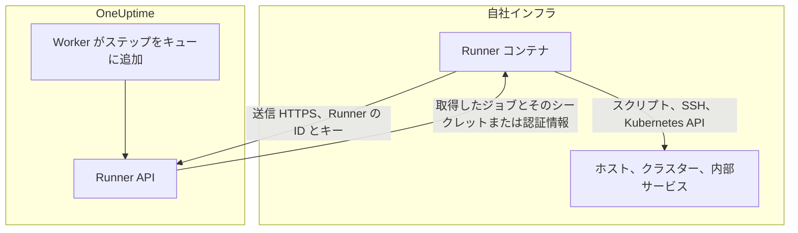
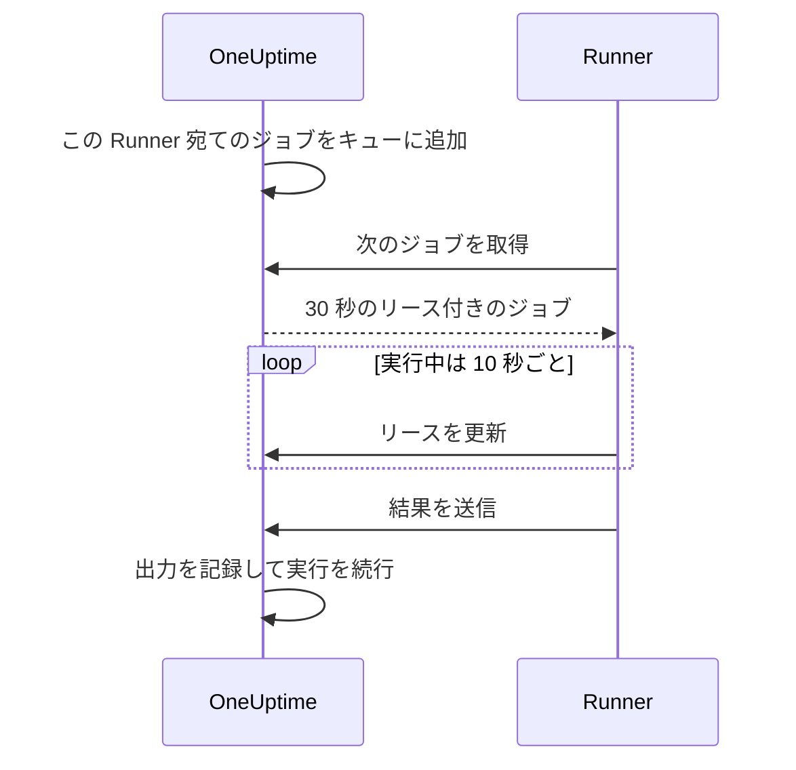

# Runbook エージェント

**Runbook エージェント** （ダッシュボードでの名前は **Runner** ）は、Runbook の JavaScript、Bash、SSH、Kubernetes のステップを **自社インフラで** 実行する、小さなセルフホストのプロセスです。OneUptime Worker がスクリプトを実行することはありません。Worker はスクリプトをキューに入れ、ステップの作成者が選んだ Runner が各ジョブを取得して実行し、結果を返します。このページは Runner をインストールして運用する人のためのものです。

:::cards
- [Runner をインストールする](#runner-をインストールする): ダッシュボードから接続済みのコンテナまで 5 ステップ。
- [ステップに Runner を指定する](#ステップに-runner-を指定する): ステップを、それを実行する Runner に結び付けます。
- [タイムアウト](#タイムアウト): 取得のタイムアウトと実行タイムアウト、その関係。
- [環境変数](#環境変数): コンテナが起動時に読むもの。
:::

## 仕組み



1. OneUptime で Runner を作成します。OneUptime がその ID と秘密キーを生成します。
2. 自社インフラのホストで、その ID、キー、OneUptime の URL を指定して Runner コンテナを実行します。
3. Runner は 5 秒ごとに OneUptime に作業を問い合わせ、60 秒ごとに稼働中であることを報告します。
4. JavaScript、Bash、SSH、Kubernetes のステップを書くときに、ドロップダウンから Runner を選びます。ステップはその Runner に結び付けられます。
5. ステップが実行されると、Worker は `targetAgentId` をその Runner にしたジョブをキューに入れます。それを取得できるのはその Runner だけです。
6. Runner はジョブをローカルで実行し（Bash は `bash -c <script>`、JavaScript は `isolated-vm` サンドボックス、SSH と Kubernetes はステップの認証情報を使った SSH 接続またはクラスターの API サーバーの呼び出し）、結果を記録して返します。Worker はその結果で Runbook を再開します。

Runner に必要なのは、OneUptime インスタンスへの **送信 HTTPS** だけです。受信接続は受け付けません。

Runner が持っているのは自身の ID とキーだけです。それ以外はすべて、取得したジョブとともに受け取ります。割り当てられた [Runbook のシークレット](/docs/runbooks/credentials#スクリプト用のシークレット) が埋め込まれたスクリプト、または SSH や Kubernetes のステップが指定する [認証情報](/docs/runbooks/credentials) です。そのため、Runner のキーを持つ人は誰でもその Runner として振る舞えます。キーは、その Runner に割り当てた認証情報と同じように扱ってください。

## スクリプトを Runner で実行する理由

OneUptime Worker でスクリプトを実行することには 2 つの問題がありました。

- **信頼境界。** Runbook を書ける人なら誰でも、Worker が到達できるすべてにアクセスできる状態で Worker 上でコードを実行できました。
- **到達範囲。** 役に立つステップのほとんどは、OneUptime ではなく _自社の_ インフラに対して働きます（「このサービスを再起動する」「社内データベースでレコードを調べる」）。

Runner を使うと、これらのステップは自分が管理するホストで実行され、そのホストに何を許可するかを自分で決められます。HTTP リクエストと AI のステップは自社ネットワークのものを必要としないため、引き続き Worker で実行されます。

## 始める前に

- 自社インフラ内の **Docker が動くホスト** 。HTTPS で OneUptime の URL に到達でき、ステップが操作するシステムにも到達できる必要があります。
- **Runner を作成できるロール。** Project Owner、Project Admin、Project Member、Runbook Admin が作成できます。セットアップコマンドに含まれる Runner のキーを見られるのは、Project Owner、Project Admin、Runbook Admin だけです。

## Runner をインストールする

### 1. エージェントのレコードを作成する

**Runbook → Runner** に移動して、新しいエージェントを作成します。 **Runnerを作成** をクリックし、2 つのステップを入力します。

| 項目 | ステップ | メモ |
| --- | --- | --- |
| **名前** | **Runner** | わかりやすい名前で、通常は動作場所と到達できる範囲を表します（例: `prod-eu-west-1`）。ステップを書くときに選ぶのはこの名前です。 |
| **説明** | **Runner** | 任意。このホストが何に到達できるかを 1 文で。 |
| **ラベル** | **Runner** （ **その他の項目** の中） | 任意。 |
| **Runbook を実行** | **機能** | 既定でオン。この Runner が Runbook のステップを取得できるようにします。 |
| **AI コード修正を実行** | **機能** | 既定でオフ。AI によるコード修正のプルリクエストを開けるようにします。[Fix Tasks](/docs/ai/ai-agent) を参照してください。 |
| **AI 修復コマンドを実行** | **機能** | 既定でオフ。AI による自動修復が、この Runner でポリシーで確認されたコマンドを実行できるようにします。SSH の認証情報を持つ Runner でこれをオンにするには、Runbook の認証情報を読む権限が必要です。[OneUptime AI のコマンドを実行する Runner](/docs/runbooks/credentials#oneuptime-ai-のコマンドを実行する-runner) を参照してください。 |

Runner は機能の変更を次のハートビートで取り込むため、再起動は不要です。

### 2. インストールコマンドをコピーする

Runner の行で **セットアップ手順を表示** をクリックします。 **Runner のセットアップ** ダイアログに、この Runner の ID とキーがすでに含まれた `docker run` コマンドが表示されます。同じコマンドは、Runner 自身のページの **セットアップ手順** にもあります。

キーを読めるのは Project Owner、Project Admin、Runbook Admin だけです。それ以外の人には、コマンドの代わりに「この Runner のキーを表示する権限がありません」と表示されます。

### 3. 自社インフラのホストで実行する

次のことができる自社環境のホストでコマンドを実行します。

- HTTPS で OneUptime インスタンスに到達できる。
- ステップに必要なこと（SSH でほかのホストに到達する、クラスターの API サーバーを呼び出す、データベースと通信するなど）ができる。

```bash
docker run --name oneuptime-runner --restart unless-stopped \
  -e ONEUPTIME_RUNNER_ID=<runner-id> \
  -e ONEUPTIME_RUNNER_KEY=<runner-key> \
  -e ONEUPTIME_URL=https://oneuptime.yourdomain.com \
  -d oneuptime/runner:release
```

### 4. エージェントが接続されたことを確認する

**Runbook → Runner** に戻ります。コンテナの起動から 1 分以内に、Runner の **ステータス** が **接続済み** になり、 **最終確認** が新しくなるはずです。Runner 自身のページでは、 **Runner のステータス** カードに **Runner のバージョン** と **ホスト** が表示されます。 **未接続** や **切断済み** のままの場合は、[トラブルシューティング](#トラブルシューティング) を参照してください。

### 5. エージェントを最新に保つ

エージェントが OneUptime より古いバージョンで動いていると、そのページの **Runner のバージョン** の横に警告マークが表示されます。それを選ぶとアップグレード方法が表示されます。新しいイメージを取得してコンテナを削除し、ステップ 2 のインストールコマンドを再実行します。Kubernetes エージェントのチャートがインストールしたエージェントは、代わりにチャートでアップグレードします。

```bash
docker pull oneuptime/runner:release
docker rm -f oneuptime-runner
```

## ステップに Runner を指定する

:::steps
### Runner で実行するステップを追加する

Runbook の **ステップ** に、JavaScript、Bash、SSH、Kubernetes のいずれかのステップを追加します。

### Runner を選ぶ

ステップの **Runner** ドロップダウンには、プロジェクト内のすべての Runner と、それぞれが接続されているかどうかが表示されます。プロジェクトにまだ Runner がない場合は、ステップがその旨を表示し、 **Runbook › Runner** を案内します。

### ステップを保存する

**ステップを保存** をクリックします。実行がそのステップに達すると、Worker はその Runner の ID 宛てにジョブをキューに入れ、それを取得できるのはその Runner だけです。
:::

Bash は `bash -c` で実行されます。JavaScript は Runner 上の `isolated-vm` サンドボックスで、ファイルシステムやプロセスにアクセスせずに実行されます。`axios` で公開の HTTP API を呼び出せますが、プライベートネットワーク上のアドレスは呼び出せません。SSH と Kubernetes のステップは、ステップが指定する [認証情報](/docs/runbooks/credentials) を使い、その認証情報は同じ Runner に割り当てられている必要があります。

Runner が複数必要ですか？ それぞれを作成し、各ステップに適切な Runner を指定します。冗長性のためには、追加の Runner を動かしてステップを分散するか、ステップがもう一方の Runner を指す予備の Runbook を用意します。

## 運用メモ

### タイムアウト

Runner で実行されるすべてのステップに、2 つのタイムアウトが適用されます。

| タイムアウト | 既定値 | 制御する内容 |
| --- | --- | --- |
| **取得のタイムアウト** | 2 分 | Worker が、選んだ Runner によるジョブの取得を待つ時間です。Runner が時間内に取得しないと、ステップはタイムアウトで失敗し、Runbook は続行します（ **失敗時に続行** によっては停止します）。 |
| **実行タイムアウト** | 30 秒 | Runner がステップを停止するまで実行させる時間です。Bash には `SIGKILL` が送られ、JavaScript のサンドボックスは破棄されます。 |

どちらもステップごとに設定できます。 **Runbook › 対象の Runbook › ステップ** を開き、ステップを展開して、その設定で **実行タイムアウト** と **取得のタイムアウト** （秒）を指定します。既定値を使うには空のままにします。どちらも 1 秒から 1 時間まで指定でき、範囲外の値はステップの実行時に範囲内に収められます。

Worker の待機時間の合計は `claim timeout + execution timeout + a few seconds` です。ステップに合った値を選んでください。

取得のタイムアウトを短くするときに覚えておくことが 2 つあります。

- Runner はポーリングの周期（`ONEUPTIME_RUNNER_POLL_INTERVAL_MS`、既定では 5 秒）で作業を問い合わせます。1 周期より短い取得のタイムアウトは、まったく正常な Runner がジョブを見る前に期限切れになることがあり、その場合はオフラインの Runner と同じメッセージでステップが失敗します。
- Runner は既定で一度に 1 つのジョブを実行します（`ONEUPTIME_RUNNER_CONCURRENCY`）。長いステップがそれを占有している間、同じ Runner を指すほかのステップは、それぞれの取得のタイムアウトが切れるまで待ちます。実行タイムアウトを数分に引き上げる場合は、その Runner を共有するステップの取得のタイムアウトも同じように引き上げるか、別の Runner を割り当ててください。

### リースとハートビート



Runner はジョブを取得すると、短いリース（既定では 30 秒）を受け取ります。ステップの実行中、Runner は 10 秒ごとにリースを更新します。スクリプトの途中で Runner が停止したりネットワークを失ったりするとリースが期限切れになり、Worker はいつまでも待つ代わりにジョブを `TimedOut` にします。

リースが期限切れになっても Bash のサブプロセスは自動ではキャンセル **されません** （JavaScript のサンドボックスも、終わるなら最後まで実行されます）。ただし Worker はそれを待つのをやめ、別の取得が引き継いだ後は Runner は結果を送信できません。ちょうど 1 回だけ実行されることが重要なら、スクリプトは安全に再実行できるように設計してください。

### ステップの途中で OneUptime Worker が再起動した場合

Runbook の実行は最初から最後まで 1 つの Worker で動くため、デプロイやクラッシュによってステップの途中で中断されることがあります。その後に何が起きるかは、実行が再び取得されるかどうかで決まります。

- **再開される場合。** 実行を取得した Worker は、ステップがすでに作成したジョブを見つけて **それに再接続します** 。Runner にスクリプトのコピーをもう 1 つ送る代わりに、そのジョブを待ちます。Runner がすでに終えていれば、記録された結果がそのまま使われます。ステップが Runner に送られるのは、1 回の実行につき最大 1 回です。
- **再開されない場合。** 実行が再び取得されなければ、現在のステップの取得と実行の時間枠を過ぎたときにクリーンアップが `Failed` にし、そのステップの名前を含むメッセージを残します。実行が `Running` のまま止まることはありません。

わからないのは、Worker が消える前にスクリプトがどこまで進んだかだけです。実行中だったステップは、部分的に実行された可能性があるという注記付きで失敗として報告されます。Runbook を再実行する前に、対象のシステムを確認してください。

### オンラインのエージェントがない

ステップの実行時に選んだ Runner がオフラインだと、ジョブは取得のタイムアウトが過ぎるまで `Pending` で待ち、その後ステップは「No runbook agent picked up this step before the wait window expired.」で失敗します。本番で Runbook を実行する前に、 **Runner** ページで対応範囲を確認してください。

### 出力の上限

stdout と stderr は合わせてステップごとに **50 KB** までです。それより長い出力はマーカー付きで切り詰められます。完全なログが必要な場合は、スクリプトからログストアやオブジェクトストアに書き込み、`echo` で URL を出力します。

### キャンセル

実行ページまたは API から Runbook の実行をキャンセルすると、`Pending`、`Claimed`、`Running` のジョブはすべてすぐに `Cancelled` になります。すでにスクリプトを実行中の Runner は作業を最後まで行いますが、サーバーは結果を受け付けず、Runbook の後続のステップは送られません。

### 同時実行

各 Runner は既定で一度に 1 つのジョブを実行します。増やすにはコンテナで `ONEUPTIME_RUNNER_CONCURRENCY` を設定しますが、Runner はそのホストで動くほかのすべてとホストを共有することに注意してください。

## 環境変数

Runner は起動時に次の変数を読みます。

| 変数 | 必須 | 既定値 | メモ |
| --- | --- | --- | --- |
| `ONEUPTIME_URL` | はい | — | OneUptime インスタンスのベース URL です（例: `https://oneuptime.yourdomain.com`）。 |
| `ONEUPTIME_RUNNER_ID` | はい | — | セットアップコマンドに含まれる Runner の ID です。 |
| `ONEUPTIME_RUNNER_KEY` | はい | — | セットアップコマンドに含まれる Runner の秘密キーです。 |
| `ONEUPTIME_RUNNER_POLL_INTERVAL_MS` | いいえ | `5000` | Runner が新しいジョブを問い合わせる間隔です。`1000` 未満の値は既定値に戻ります。 |
| `ONEUPTIME_RUNNER_HEARTBEAT_INTERVAL_MS` | いいえ | `60000` | Runner が稼働中であることを報告する間隔です。`5000` 未満の値は既定値に戻ります。 |
| `ONEUPTIME_RUNNER_JOB_HEARTBEAT_INTERVAL_MS` | いいえ | `10000` | Runner が実行中のジョブのリースを更新する間隔です。`1000` 未満の値は既定値に戻ります。 |
| `ONEUPTIME_RUNNER_CONCURRENCY` | いいえ | `1` | この Runner での同時ジョブの最大数です。 |
| `ONEUPTIME_RUNNER_ENABLE_RUNBOOKS` | いいえ | — | `false` にすると、ダッシュボードの設定にかかわらず、この Runner は Runbook のステップの取得をやめます。この変数は機能をオフにすることしかできません。 |
| `ONEUPTIME_RUNNER_ENABLE_CODE_FIXES` | いいえ | — | `false` にすると、ダッシュボードの設定にかかわらず、この Runner は AI によるコード修正の取得をやめます。 |
| `ONEUPTIME_RUNNER_ENABLE_AI_COMMANDS` | いいえ | — | `false` にすると、ダッシュボードの設定にかかわらず、この Runner は AI 修復コマンドの実行をやめます。 |

## エージェントのキーをローテーションする

キーが漏洩したらリセットします。古いキーはすぐに使えなくなります。

:::steps
### キーをリセットする

**Runbook → Runner** から Runner を開き、 **Runner のキーをリセット** をクリックして確認します。新しいキーを受け取るまで、Runner は接続できなくなります。

### 新しいキーでコンテナを実行する

Runner の **セットアップ手順** から新しいコマンドをコピーし、古いコンテナを削除して、同じホストで新しいコマンドを実行します。

```bash
docker rm -f oneuptime-runner
```

### 再接続を確認する

**Runbook → Runner** で、Runner の **ステータス** が 1 分以内に **接続済み** に戻ります。
:::

## 権限

エージェントの管理は、既存の Runbooks 権限グループにあります。

- `CreateRunner`、`EditRunner`、`DeleteRunner`、`ReadRunner` — エージェントのレコードを管理します。
- `RunbookAdmin`、`RunbookMember`、`RunbookViewer`（ロール） — `RunbookAdmin` は Runbook、そのルール、それを実行する Runner を構築し、Runbook を実行します。`RunbookMember` は Runbook とその実行を開いて Runbook を実行します（実行を開始し、ステップを完了またはスキップし、実行をキャンセルします）が、Runbook や Runner の作成、変更、削除はしません。`RunbookViewer` は Runbook とその実行を読むだけで、何も実行しません。`RunbookAdmin` は上記の詳細な権限をすべてまとめたものです。

Runbook をトリガーする（つまりステップを Runner に送る）には、Runbook を実行するロール（`ProjectOwner`、`ProjectAdmin`、`ProjectMember`、`RunbookAdmin`、`RunbookMember`）か `CreateRunbookExecution` が必要です。実行の完了、スキップ、キャンセルには `EditRunbookExecution` も使えます。ロールが実行できるのは、その範囲が届く Runbook だけです。

Runner のキーを読めるのは、Project Owner、Project Admin、Runbook Admin だけです。

## エージェント向け API

参考までに、Runner は `/runner-ingest` の下にマウントされた次のエンドポイントを使います。統合前のパス `/runbook-agent-ingest` も、まだ再デプロイされていないエージェントのために引き続き提供されるため、サーバーをアップグレードしても壊れません。認証には、JSON 本文（`agentId` と `agentKey`）またはヘッダー `x-agent-id` と `x-agent-key` で Runner の ID とキーを使います。

| エンドポイント | 目的 |
| --- | --- |
| `POST /heartbeat` | 生存確認です。Runner の最終確認時刻、バージョン、ホスト情報を更新し、プロジェクトが与えた機能を返します。 |
| `POST /claim-next-job` | この Runner の ID 宛ての `Pending` のジョブのうち最も古いものをアトミックに取得します。することがなければ `{ job: null }` を返します。 |
| `POST /job/:jobId/heartbeat` | ジョブのリースを更新します。リースが期限切れの場合やジョブが終了している場合は 404 を返します。 |
| `POST /job/:jobId/result` | 最終結果を送信します。リースがすでに移っている場合は無視されます。 |
| `POST /disconnect` | 正常なシャットダウン時にサインオフします。 |

手動で呼び出す必要はありません。同梱の Runner が呼び出します。ここに記載しているのは、当社のエージェントが合わない制約がある場合に独自のエージェントを作れるようにするためです。

## トラブルシューティング

:::details Runner が未接続または切断済みのまま
- `docker logs oneuptime-runner` でコンテナのログを確認し、認証やネットワークのエラーを探します。
- たとえば `curl` で、ホストが OneUptime の URL に到達できることを確認します。
- ID とキーが空白なしでコピーされていること、`ONEUPTIME_URL` が OneUptime を開くときのアドレスであることを確認します。

**未接続** は、Runner が一度も報告していないことを意味します。 **切断済み** は、報告したことはあるものの、直近 5 分間は報告していないことを意味します。
:::

:::details ステップが「No runbook agent picked up this step before the wait window expired.」で失敗する
ステップの Runner が取得のタイムアウト内にジョブを取得しませんでした。Runner が **接続済み** であること、その Runner で **Runbook を実行** がオンになっていること、長いステップで占有されていないことを確認してください。`ONEUPTIME_RUNNER_CONCURRENCY` を引き上げない限り、Runner は一度に 1 つのジョブを実行します。ポーリング間隔より短い取得のタイムアウトも同じように失敗します。
:::

:::details ステップが「The runbook agent stopped responding while this step was running.」で失敗する
Runner はジョブを取得した後、リースの更新をやめました。クラッシュ、再起動、ネットワークの切断のいずれかです。Runner がオンラインであることを確認し、Runbook を再実行する前に対象のシステムを確認してください。
:::

:::details Runner のログに「No capability is enabled」と出る
この Runner ではすべての機能がオフになっています。OneUptime の Runner のページで **Runbook を実行** をオンにします。Runner は次のハートビートで変更を取り込みます。
:::

## 次のステップ

:::cards
- [Runbook を作成する](/docs/runbooks/authoring): Runner で実行されるステップを書きます。
- [Runbook の認証情報](/docs/runbooks/credentials): SSH と Kubernetes のステップに管理されたアクセス権を与えます。
- [Runbook の設定と安全性](/docs/runbooks/configuration): 上限、権限、堅牢化。
:::
