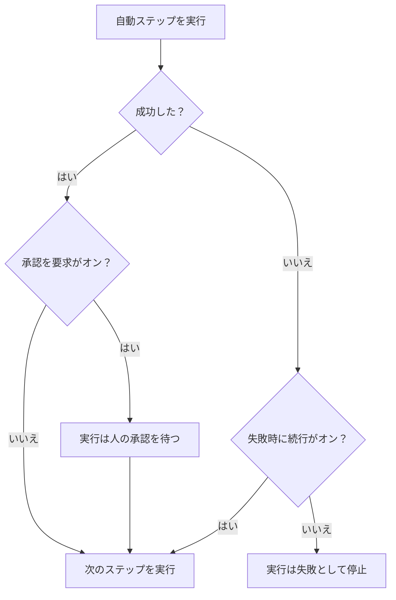

# Runbook を作成する

Runbook は、その **ステップ** ページでステップの順序付きリストとして書きます。このページでは、Runbook の作成方法、7 種類のステップそれぞれの設定方法、失敗と承認が実行の流れをどう変えるかを説明します。

:::cards
- [Runbook の作成](#runbook-の作成): 空の Runbook から保存済みのステップまで。
- [ステップの種類](#ステップの種類): Manual、JavaScript、HTTP request、Bash、SSH、Kubernetes、AI。
- [失敗時の処理と承認](#失敗時の処理と承認): ステップが失敗または成功したときに何が起きるか。
- [実例](#実例): 5 ステップのデータベースフェイルオーバー。
:::

## 始める前に

- **Runbook を書けるロール。** Project Owner、Project Admin、Runbook Admin は Runbook を作成し、そのステップを保存できます。詳細な権限の場合は **Create Runbook** と **Edit Runbook** が必要です。[権限](/docs/runbooks/configuration#権限) を参照してください。
- **JavaScript、Bash、SSH、Kubernetes のステップ用の Runner。** これらのステップは自社インフラの [Runner](/docs/runbooks/agents) で実行され、OneUptime Worker では実行されません。先にインストールしてください。
- **SSH と Kubernetes のステップ用の認証情報と、それを読む権限。** [Runbook の認証情報](/docs/runbooks/credentials) を参照してください。ステップが認証情報を指定できるのは、Runbook の認証情報を読む権限がある場合だけです。Project Owner、Project Admin、または **Read Runbook Credential** が必要で、Runbook Admin には含まれません。
- **AI ステップ用の LLM プロバイダー。** [LLM プロバイダー](/docs/ai/llm-provider) を参照してください。

## Runbook の作成

:::steps
### Runbook を開く

**製品 → Runbook** を開きます。Runbook は **ダッシュボードと自動化** グループにあります。

### 新しい Runbook を作成する

**Runbookを作成** をクリックし、 **名前** と、必要に応じて Runbook の用途を示す **説明** を入力します。 **その他の項目** には、既定でオンの **有効** スイッチと **ラベル** があります。新しい Runbook が一覧に表示されたら、開きます。

### ステップを追加する

**ステップ** に移動します。 **Runbook を開始** で最初のステップの種類を選びます。最後のステップの下では、 **ステップをさらに追加** が同じ 7 種類を表示します。各ステップは **タイトル** 、 **説明** （Markdown、対応者に表示されます）、その種類の設定とともに開きます。Runbook にステップが 1 つあると、カード上部の **ステップを追加** で Manual ステップが追加されます。

### ステップを並べる

ステップは **順番に** 実行されます。順序を変えるには、ステップの見出しの左にあるハンドルをドラッグします。キーボードでは、ハンドルにフォーカスして Space を押し、矢印キーでステップを移動し、もう一度 Space を押します。

### ステップを保存する

**ステップを保存** をクリックします。保存するまで、エディターには **未保存の変更** と表示されます。保存すると **保存しました** と表示され、Runbook を [実行](/docs/runbooks/running) できる状態になります。
:::

## ステップの構成

各ステップには次の項目があります。

| 項目 | 目的 |
| --- | --- |
| **タイトル** | ステップ一覧と各実行に表示される短いラベルです。 |
| **説明** | 対応者向けの任意のコンテキストで、Markdown で書きます。Manual ステップでは、担当者が読む指示になります。 |
| **失敗時に続行** | 自動ステップのみ。オンにすると、ステップが失敗しても実行は止まらず、次のステップが実行されます。 |
| **承認を要求** | 自動ステップのみ。オンにすると、Runbook はこのステップの後で一時停止し、次のステップを実行する前に人の承認を待ちます。スイッチの名前は **次のステップを実行する前に承認を要求** です。 |
| 種類ごとの設定 | スクリプト、URL、Runner、認証情報、プロンプトです。[ステップの種類](#ステップの種類) を参照してください。 |

## ステップの種類

| 種類 | 実行場所 | 必要なもの |
| --- | --- | --- |
| [Manual](#manual) | 人 | なし |
| [JavaScript](#javascript) | Runner | Runner |
| [HTTP request](#http-request) | OneUptime Worker | なし |
| [Bash](#bash) | Runner | Runner |
| [SSH](#ssh) | Runner | Runner と SSH の認証情報 |
| [Kubernetes](#kubernetes) | Runner | Runner と Kubernetes の認証情報 |
| [AI](#ai) | OneUptime Worker | LLM プロバイダー |

### Manual

人のためのチェックリスト項目です。実行は Manual ステップに達すると一時停止し、誰かが **完了にする** または **スキップ** をクリックするまで `WaitingForManualStep` （ **あなたの対応待ち** ）のままです。人を待っている実行がタイムアウトすることはありません。

人にしか確認や操作ができないことに使います。「ロードバランサーのダッシュボードで、トラフィックがセカンダリリージョンに切り替わったことを確認する。」

### JavaScript

自社インフラの [Runbook エージェント](/docs/runbooks/agents) 上の `isolated-vm` サンドボックスで実行される JavaScript です。OneUptime Worker では実行されません。

| 項目 | 内容 | 既定値 |
| --- | --- | --- |
| **Runner** | ステップを実行する Runner です。ジョブを取得できるのはこの Runner だけです。 | — |
| **スクリプト** | 実行する JavaScript です。値を記録するには `return` で返します。`console.log` の各行も記録されます。エラーがスローされるとステップは失敗します。 | — |
| **実行タイムアウト** | Runner がサンドボックスを破棄するまでにスニペットを実行させる時間です。 | 30 秒 |
| **取得のタイムアウト** | Worker が Runner によるジョブの取得を待つ時間です。 | 2 分 |

```javascript
const start = Date.now();
// ... your logic ...
console.log("replica lag checked");
return { durationMs: Date.now() - start };
```

サンドボックスのメモリは 128 MB で、ファイルシステムやプロセスにはアクセスできません。`axios` で HTTP リクエストを送れますが、宛先はパブリックアドレスに限られます。プライベートネットワーク、Runner 自身のホスト、クラウドのメタデータエンドポイントへのリクエストは拒否されます。自社ネットワーク内のサービスに到達するには、`curl` を使う [Bash](#bash) ステップを使います。

### HTTP request

OneUptime Worker が行う送信 HTTP 呼び出しです。Runner は不要です。

| 項目 | 内容 | 既定値 |
| --- | --- | --- |
| **メソッド** | `GET`、`POST`、`PUT`、`PATCH`、`DELETE`、`HEAD`。 | `GET` |
| **URL** | 呼び出すエンドポイントです。 | 空 |
| **ヘッダー（JSON）** | `{ "Authorization": "Bearer ..." }` のような JSON オブジェクトです。有効な JSON でないヘッダーはステップを失敗させます。 | なし |
| **本文** | JSON として解析できれば JSON として、できなければテキストとして送信されます。 | なし |
| **リクエストのタイムアウト** | ステップが失敗するまでエンドポイントの応答を待つ時間です。 | 30 秒 |

ステップは `2xx` または `3xx` の応答で成功し、それ以外ではエラー `HTTP <status>` で失敗します。リダイレクトはたどりません。応答のステータス、ヘッダー、本文は最大 50 KB まで記録されます。

> [!NOTE]
> Worker は、クラウドのメタデータエンドポイントのようなループバックやリンクローカルのアドレスを決して呼び出しません。OneUptime Cloud ではパブリックアドレスだけを呼び出します。セルフホストの OneUptime は、`DATA_SOURCE_BLOCK_PRIVATE_ADDRESSES` が `true` でない限り、プライベートネットワークにも到達します。OneUptime Cloud から自社ネットワーク内のサービスを呼び出すには、`curl` を使う [Bash](#bash) ステップを使います。

用途: PagerDuty のインシデントを開く、Slack の Webhook に投稿する、クラウドプロバイダーや自社の公開 API を呼び出す。

### Bash

自社インフラの [Runbook エージェント](/docs/runbooks/agents) 上で `bash -c <script>` で実行される bash スクリプトです。Bash が OneUptime Worker で実行されることはありません。

| 項目 | 内容 | 既定値 |
| --- | --- | --- |
| **Runner** | ステップを実行する Runner です。ジョブを取得できるのはこの Runner だけです。 | — |
| **Bash スクリプト** | スクリプトです。出力（stdout と stderr）は最大 50 KB まで記録され、0 以外の終了コードでステップは失敗します。 | — |
| **実行タイムアウト** | Runner が `SIGKILL` で終了させるまでにスクリプトを実行させる時間です。正当な理由で数分かかるステップでは引き上げます。 | 30 秒 |
| **取得のタイムアウト** | Worker が Runner によるジョブの取得を待つ時間です。 | 2 分 |

スクリプトは Runner のコンテナで、そのイメージに含まれるツール（`curl`、`wget`、`ssh` クライアントなど）と、実行中のホストのネットワークアクセスを使って実行されます。たとえば、自社ネットワークからしか到達できないサービスを確認するには次のようにします。

```bash
set -euo pipefail
HTTP_CODE=$(curl -s -o /tmp/resp.txt -w "%{http_code}" "http://payments.internal:8080/health")
echo "HTTP $HTTP_CODE"
cat /tmp/resp.txt
if [[ "$HTTP_CODE" != "200" ]]; then
  echo "Health check failed"
  exit 1
fi
```

実行がこのステップに達したときに選んだ Runner がオフラインだと、ステップは **取得のタイムアウト** （既定では 2 分）まで待ってからタイムアウトで失敗します。Bash ステップに頼る前に、 **Runbook → Runner** でエージェントを追加してください。

> [!TIP]
> パスワードやトークンをスクリプトに書かないでください。Runbook のシークレットとして保存し、Bash または JavaScript のスクリプトに `{{runbookSecrets.NAME}}` と書きます。Runner は値が埋め込まれたスクリプトを受け取ります。[スクリプト用のシークレット](/docs/runbooks/credentials#スクリプト用のシークレット) を参照してください。

### SSH

Runner が SSH で到達できるホストで 1 つのコマンドを実行します。Bash ステップでの `ssh host cmd` とは異なり、アクセスには Runner のディスク上の秘密鍵ではなく、管理された [認証情報](/docs/runbooks/credentials) を使います。認証情報は保存時に暗号化され、特定の Runner に割り当てられ、API から読み戻すことはできません。

| 項目 | 内容 |
| --- | --- |
| **Runner** | 接続を開く Runner です。ネットワーク経由でホストに到達できる必要があります。 |
| **認証情報** | ホスト、ポート、ユーザー、鍵またはパスワードを持つ SSH の認証情報です。選んだ Runner に割り当てられている必要があります。割り当てられていないと、誤ったアクセス権で実行される代わりにステップが失敗します。 |
| **コマンド** | 認証情報のユーザーとしてリモートホストで実行されます。出力は最大 50 KB まで記録され、0 以外の終了コードでステップは失敗します。 |
| **実行タイムアウト** | 接続、認証、コマンドの実行をまとめて対象にするため、応答しないコマンドがステップを開いたままにすることはありません。既定値は 30 秒です。 |
| **取得のタイムアウト** | Worker が Runner によるジョブの取得を待つ時間です。既定値は 2 分です。 |

### Kubernetes

クラスター内のワークロードを再起動またはスケールします。アクションは意図的に限定されています。任意のオブジェクトを変更できるステップはクラスター管理者のシェルと同じであり、このステップの種類は、よくある修復を自動修復で使えるほど安全にするために存在します。

| 項目 | 内容 |
| --- | --- |
| **Runner** | クラスターの API サーバーを呼び出す Runner です。API サーバーに到達できる必要があります。 |
| **認証情報** | Kubernetes の認証情報です。API サーバーの URL、サービスアカウントトークン、クラスターの CA を持ちます。そのサービスアカウントは、Runbook に必要なことだけを許可するロールにバインドしてください。 |
| **アクション** | **ワークロードを再起動** は Pod テンプレートを変更し、`kubectl rollout restart` と同じようにコントローラーに Pod を作り直させます。 **ワークロードをスケール** はレプリカ数を設定します。 |
| **ワークロードの種類** | **デプロイメント** 、 **StatefulSet** 、 **DaemonSet** のいずれかです。 |
| **Namespace** と **ワークロード名** | 操作の対象となるワークロードです。 |
| **レプリカ** | スケールのときだけ使います。0 も指定できます。ワークロードを空にすることも正当な修復です。DaemonSet はノードごとに 1 つの Pod を実行するためスケールできません。代わりに再起動してください。 |
| **実行タイムアウト** | Runner が API サーバーによる変更の受け入れを待つ時間です。既定値は 30 秒です。 |
| **取得のタイムアウト** | Worker が Runner によるジョブの取得を待つ時間です。既定値は 2 分です。 |

API サーバーが変更を拒否すると、そのサーバー自身のメッセージがステップに表示されるため、権限エラーからどのロールバインディングを広げればよいかがわかります。

### AI

実行の途中で、AI に分析、要約、判断を依頼します。応答は実行におけるステップの出力になります。AI ステップは OneUptime Worker で実行され、Runner は不要です。

| 項目 | 内容 |
| --- | --- |
| **プロンプト** | AI にしてほしいことです。例:「前のステップの出力を確認し、修復を続けても安全かどうかを答えてください。」 |
| **LLM プロバイダー** | 任意です。 **プロジェクトのデフォルト** はプロジェクトの既定のプロバイダーを使います。ネットワーク外に出してはいけないデータ用のセルフホストモデルなど、特定のモデルが必要なステップではプロバイダーを固定します。[LLM プロバイダー](/docs/ai/llm-provider) を参照してください。 |
| **前のステップのコンテキストを含める** | オンにすると、AI はこのステップより前に実行されたステップのすべて（タイトル、種類、ステータス、出力、エラーメッセージ）を参照します。各ステップの出力は最大 4,000 文字まで渡されます。 |
| **トリガーのコンテキストを含める** | オンにすると、AI は実行を開始したもの、つまり関連付けられたインシデント、アラート、定期メンテナンスイベント（説明、重大度、現在の状態、影響を受けるモニター、根本原因、状態のタイムライン、公開メモ）、または Runbook を手動で実行した人を参照します。 |

AI ステップと **承認を要求** を組み合わせると、人をループに残せます。AI が分析し、人が応答を読んで承認し、その後で初めて次の（修復を行う）ステップが実行されます。

**AI が決して見ないもの。** AI ステップの応答は実行のステップ出力として保存され、実行は Runbook の閲覧権限を持つ全員が読めます。これはインシデントより広い範囲です。そのため、トリガーのコンテキストには **非公開の内部メモ** と **Slack と Microsoft Teams のチャンネルメッセージ** は含まれません。前のステップの出力はシークレット（トークン、鍵、認証情報）がないかスキャンされ、モデルに送る前にマスクされます。インシデントの説明に貼り付けたスクリーンショットのような埋め込み画像や長いエンコード済みデータも除外され、代わりに短い注記が入ります。

AI ステップはほかの AI 機能と同じように計測され、課金されます。プロンプトがない、プロジェクトで AI 機能がオフになっている、利用できる LLM プロバイダーがない、固定したプロバイダーがプロジェクトで利用できなくなった、のいずれかの場合、ステップは理由を示すメッセージで失敗します。残りの Runbook を引き続き実行したい場合は **失敗時に続行** をオンにします。

## 失敗時の処理と承認



既定では、ステップが失敗すると実行は止まり、そのステップのエラーを理由として `Failed` になります。 **失敗時に続行** をオンにすると、失敗は記録され、次のステップが実行されます。「この 3 つを試してから通知する」タイプの Runbook に向いています。 **承認を要求** はステップが成功した後に適用されます。誰かが **承認して続行** または **スキップ** をクリックするまで、実行はそのステップで待ちます。

## 保存と編集

ステップへの変更は **ステップを保存** をクリックしたときに反映されます。各実行は開始時に取ったスナップショットで動くため、進行中の実行は開始時のステップのままで、編集によって過去の実行の履歴が書き換わることはありません。

## 実例

「DB primary unreachable」用の Runbook:

| # | 種類 | 内容 |
| --- | --- | --- |
| 1 | JavaScript | 構成サービスから現在のプライマリホストを取得してログに記録する。 |
| 2 | Manual | 「セカンダリのレプリケーション遅延が 5 秒未満であることを確認する。」 |
| 3 | HTTP request | フェイルオーバーオーケストレーターの API への `POST`。 |
| 4 | Manual | 「書き込みが新しいプライマリに向かっていることを確認する。」 |
| 5 | HTTP request | Slack の Webhook への解除メッセージの `POST`。 |

対応者は、ステップ 1 の実行を見て、ステップ 2 にチェックを入れ、ステップ 3 の実行を見て、ステップ 4 にチェックを入れ、実行はステップ 5 で終わります。各ステップの出力はポストモーテム用に記録されます。

## 次のステップ

:::cards
- [Runbook を実行する](/docs/runbooks/running): 実行を開始し、ステップを完了、承認、スキップします。
- [Runbook ルール](/docs/runbooks/rules): 一致するインシデントでこの Runbook を自動で開始します。
- [Runbook エージェント](/docs/runbooks/agents): スクリプトのステップに必要な Runner をインストールします。
- [Runbook の認証情報](/docs/runbooks/credentials): SSH と Kubernetes のステップに管理されたアクセス権を与えます。
:::
