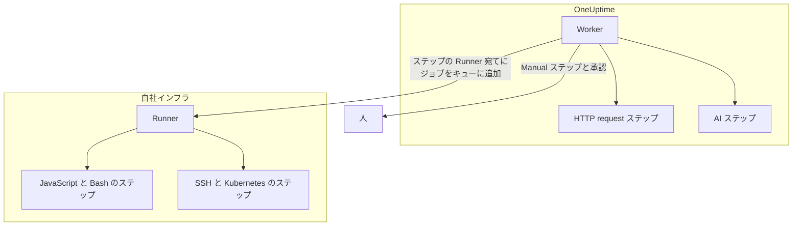

# Runbook の設定と安全性

運用担当者とセキュリティレビュー担当者のためのリファレンスです。各種類のステップがどこで実行されるか、ステップに適用される上限とタイムアウト、誰が何をできるか、Runbook がどのように堅牢化されているかを説明します。

:::cards
- [各ステップの種類の実行場所](#各ステップの種類の実行場所): Worker、Runner、または人。
- [出力の上限とタイムアウト](#出力の上限とタイムアウト): ステップに適用されるすべての上限。
- [権限](#権限): 詳細な権限、3 つの Runbook ロール、ロールが届く Runbook。
- [堅牢化に関する注意](#堅牢化に関する注意): サンドボックス、ネットワークアクセス、Runner の認証。
:::

## 各ステップの種類の実行場所

| ステップの種類 | 実行場所 | 方法 |
| --- | --- | --- |
| Manual | 人 | 誰かがステップを完了またはスキップするまで実行が待ちます。 |
| JavaScript | Runner | `isolated-vm` サンドボックス内。 |
| HTTP request | OneUptime Worker | 送信 HTTP 呼び出し。 |
| Bash | Runner | `bash -c <script>`。 |
| SSH | Runner | [認証情報](/docs/runbooks/credentials) を使った SSH 接続。 |
| Kubernetes | Runner | 認証情報を使ったクラスターの API サーバーの呼び出し。 |
| AI | OneUptime Worker | プロジェクトの LLM プロバイダーの呼び出し。 |

## Runner のステップが送られる仕組み

JavaScript、Bash、SSH、Kubernetes のステップは **OneUptime Worker では決して実行されません** 。これらはジョブとして特定の [Runbook エージェント](/docs/runbooks/agents) に送られます。これは自社インフラのホストにインストールする小さなプロセスです。

送信のモデル:

1. Runbook のステップの作成者が、ステップを書くときにドロップダウンから Runner を選びます。
2. ステップが実行されると、Worker は `RunnerJob` に、`targetAgentId` をその Runner の ID に、ステータスを `Pending` にした行を挿入します。
3. その Runner（その Runner だけ）がジョブをアトミックに取得し、ローカルで実行して（Bash は `bash -c <script>`、JavaScript は `isolated-vm` サンドボックス、SSH と Kubernetes はステップの認証情報を使用）、結果を返します。
4. Worker はその結果で Runbook を再開します。

`RUNBOOK_BASH_ENABLED` 環境フラグはもうありません。これらのステップがデプロイで動くかどうかは、プロジェクトに **Runbook を実行** がオンの接続済み Runner があるかどうかだけで決まります。

## 出力の上限とタイムアウト

| 上限 | 値 | 対象 |
| --- | --- | --- |
| ステップごとの出力 | **50 KB**。それより長い出力はマーカー付きで切り詰められます。 | すべての自動ステップ |
| 実行タイムアウト | 既定で **30 秒** | JavaScript、Bash、SSH、Kubernetes のステップ |
| リクエストのタイムアウト | 既定で **30 秒** | HTTP request ステップ |
| 取得のタイムアウト | 既定で **2 分**。Worker が、選んだ Runner によるジョブの取得を待ってから失敗にするまでの時間 | JavaScript、Bash、SSH、Kubernetes のステップ |
| タイムアウトの範囲 | **1 秒から 1 時間** | すべてのタイムアウト |
| 人を待つ時間 | 上限なし | Manual ステップと承認 |

タイムアウトは Runbook の **ステップ** ページでステップごとに設定します。既定値のままにするには項目を空にします。範囲外の値はステップの実行時に範囲内に収められるため、設定の打ち間違いでタイムアウトが無効になったり、Worker の枠が無期限に占有されたりすることはありません。

## 権限

Runbook の権限は `Runbook` 権限グループにあります。

- `CreateRunbook`、`EditRunbook`、`DeleteRunbook`、`ReadRunbook` — Runbook のテンプレートを管理します。
- `CreateRunbookExecution`、`EditRunbookExecution`、`DeleteRunbookExecution`、`ReadRunbookExecution` — 実行を開始、チェック、削除、閲覧します。
- `CreateRunbookRule`、`EditRunbookRule`、`DeleteRunbookRule`、`ReadRunbookRule` — 自動トリガーのルールを管理します。
- `CreateRunner`、`EditRunner`、`DeleteRunner`、`ReadRunner` — 自社インフラでステップを実行する Runner を管理します。（Runner への名前変更前は `*RunbookAgent` という名前でした。既存の付与は移行済みなので、割り当て直す必要はありません。）
- `RunbookAdmin`、`RunbookMember`、`RunbookViewer`（ロール） — `RunbookAdmin` は Runbook、そのルール、それを実行する Runner を構築し、Runbook を実行します。`RunbookMember` は Runbook とその実行を開いて Runbook を実行します（実行を開始し、ステップを完了またはスキップし、実行をキャンセルします）が、Runbook や Runner の作成、変更、削除はしません。`RunbookViewer` は Runbook とその実行を読むだけで、何も実行しません。`RunbookAdmin` は上記の詳細な権限をすべてまとめたものです。

ロールが実行できるのは、その範囲が届く Runbook です。一部のラベルに限定した `RunbookMember`、`RunbookAdmin`、`ProjectMember` の付与は、それらのラベルを持つ Runbook の実行を開始して進めます。 **Owned** に限定した付与は、そのチームが所有する Runbook の実行を開始して進めます。チームがラベルをブロックすると、それらの Runbook はそのチームの対象から外れます。`CreateRunbookExecution` と `EditRunbookExecution` はラベルを持たない実行に関する権限なので、プロジェクト内のすべての Runbook に届きます。Runbook を開始する修復提案の承認も同じように確認されます。

認証情報とシークレットは `RunbookAdmin` の対象外です。それらを管理するには、`ProjectOwner` または `ProjectAdmin`、あるいは `CreateRunbookCredential`、`EditRunbookCredential`、`DeleteRunbookCredential`、`ReadRunbookCredential` と `CreateRunbookSecret`、`EditRunbookSecret`、`DeleteRunbookSecret`、`ReadRunbookSecret` の権限が必要です。[Runbook の認証情報](/docs/runbooks/credentials) を参照してください。

**Runbook → 設定** にある所有者ルールとラベルルールも `RunbookAdmin` の対象外です。それらを管理するには、`ProjectOwner` または `ProjectAdmin`、あるいは `CreateRunbookOwnerRule` と `CreateRunbookLabelRule` の権限と、それぞれの編集、削除、閲覧の権限が必要です。

ロールと詳細な権限の組み合わせ方については、[ユーザー、チーム、権限](/docs/permissions/index) を参照してください。

## キューと Worker

Runbook の実行は `Runbook` BullMQ キューで動きます。各 Worker プロセスは最大 25 件の実行を同時に処理します。この数はコードで固定されており、環境変数では設定しません。

Manual ステップが API でチェックされると、実行は次のステップから続けるために再びキューに入ります。Worker が再び取得するまで `Scheduled` で待ち、キューに入った実行が待機を理由に失敗することはありません。

## 堅牢化に関する注意

- **JavaScript、Bash、SSH、Kubernetes** は、OneUptime Worker ではなく、自分で管理する Runner のホストで実行されます。JavaScript は 128 MB のメモリを持つ独立した `isolated-vm` のアイソレートで実行され、Runner のファイルシステムやプロセスにはアクセスできません。`axios` で HTTP リクエストを送れますが、プライベートネットワーク、ループバック、リンクローカルのアドレスへのリクエストは拒否されます。Bash は `bash -c` で実行され、タイムアウトは Runner で適用されます。
- **HTTP ステップ** は寛容なステータス検証を使うため、4xx や 5xx の応答は例外として投げられるのではなく失敗したステップとして記録され、記録された出力には相手側が実際に返した内容が反映されます。リダイレクトはたどりません。Worker は、クラウドのメタデータエンドポイントのようなループバックやリンクローカルのアドレスを決して呼び出しません。OneUptime Cloud ではプライベートネットワークのアドレスも拒否し、セルフホストの OneUptime は `DATA_SOURCE_BLOCK_PRIVATE_ADDRESSES=true` のときに拒否します。
- **AI ステップ** は、インシデントの非公開メモや Slack と Microsoft Teams のメッセージを決して参照しません。前のステップの出力はシークレットがないかスキャンされ、モデルに届く前にマスクされます。埋め込み画像と長いエンコード済みデータはプロンプトから除外されます。[AI](/docs/runbooks/authoring#ai) を参照してください。
- **Runner の認証** は ID と秘密キーで行い、それらは Runner コンテナに環境変数として設定します。サーバー側では、Runner の正式な ID は、提示された ID とキーに対応するデータベースの行から得られます。キーが漏洩していても、クライアントが別の Runner になりすますことはできません。
- **認証情報とシークレット** は保存時に暗号化され、API から返されることはなく、割り当てられた Runner がステップを取得したときにだけその Runner に渡されます。

## データベースのテーブル

| テーブル | 内容 |
| --- | --- |
| `Runbook` | テンプレート。名前、slug、説明、`isEnabled`、ラベル、JSON 形式のステップ。 |
| `RunbookExecution` | 実行ごとに 1 行。null 許容の外部キー `incidentId`、`alertId`、`scheduledMaintenanceId` と、ステップと各ステップの状態のスナップショットである JSON 配列 `stepExecutions` を持ちます。 |
| `RunbookRule` | 自動トリガーのルール。判別子 `triggerEntityType`（Incident、Alert、ScheduledMaintenance）、開始する Runbook との多対多の関係、そして一致の対象（JSON 列 `criteria`（条件）と、モニター、インシデントの重大度、アラートの重大度、ラベル、モニターのラベルへの多対多のリンク、タイトル、説明、モニター名、モニターの説明のパターン）を持ちます。 |
| `Runner` | インストールした Runner ごとに 1 行。名前、秘密キー、`lastAlive`、`connectionStatus`、ホスト情報、機能。 |
| `RunnerJob` | Runner に送ったステップごとに 1 行。`targetAgentId`（ステップの作成者が選んだ Runner）、ステップの種類、スクリプトまたはペイロード、ステータス（`Pending` → `Claimed` → `Running` → `Succeeded`、`Failed`、`TimedOut`、`Cancelled`）、取得の期限、リース、出力、終了コード。 |
| `RunbookCredential` | SSH と Kubernetes の認証情報。シークレット項目は暗号化され、割り当て先の Runner も保持します。 |
| `RunbookSecret` | 暗号化された Runbook のシークレットと、それを受け取れる Runner。 |

## 運用のヒント

- **ステップで選ぶ Runner が正常であることを確認してください。** 冗長性が必要なら、2 台目の Runner を動かしてステップを分散するか、もう一方の Runner を対象にした予備の Runbook を用意します。
- **大きなデータではなく URL を記録してください。** ステップの出力が数 KB を超える場合は、オブジェクトストレージやログ基盤に書き込み、URL を返します。
- **冪等性が重要です。** HTTP request や AI のステップは、ステップの途中で Worker が再起動して実行が再開されると、もう一度実行されます。Runner のステップは 1 回の実行につき最大 1 回しか送られませんが、失敗前にスクリプトが部分的に実行されていることがあり、Runbook を再実行することもあります。再試行しても安全なステップを設計してください。

## 次のステップ

:::cards
- [Runbook エージェント](/docs/runbooks/agents): Runner のインストール、運用、トラブルシューティング。
- [Runbook の認証情報](/docs/runbooks/credentials): 管理された SSH と Kubernetes のアクセス権と、スクリプト用のシークレット。
- [ユーザー、チーム、権限](/docs/permissions/index): ロール、ラベル、チームが誰が何を実行するかをどう決めるか。
:::
