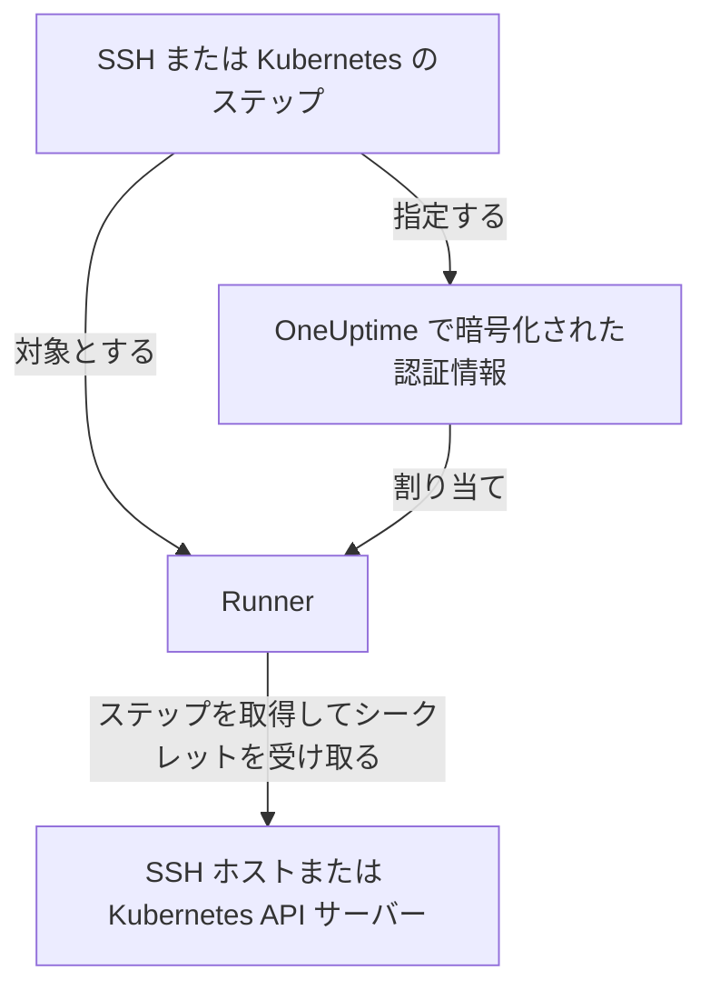

# Runbook の認証情報

認証情報は、Runbook が Runner 自身のホスト **以外** のもの、つまり SSH でアクセスするサーバーや Kubernetes クラスターに到達するための手段です。認証情報がなければ、「サービスを再起動する」にはシェルスクリプトを書き、鍵や kubeconfig を Runner のホストに手作業で置くことになり、それは OneUptime の管理外のディスクに残ります。認証情報は同じアクセス権を管理されたオブジェクトにしたものです。保存時に暗号化され、特定の Runner に割り当てられ、ステップから名前で参照されます。

**Runbook → Runner → 認証情報** で管理します。

:::cards
- [認証情報を作成する](#認証情報を作成する): アクセス権と、それを使える Runner。
- [相手側での最小権限](#相手側での最小権限): 鍵やトークンでできることを制限します。
- [スクリプト用のシークレット](#スクリプト用のシークレット): Bash や JavaScript のスクリプトにパスワードやトークンを渡します。
:::

## 認証情報の使われ方



SSH または Kubernetes のステップは、認証情報と Runner を指定します。その Runner がステップを取得すると、OneUptime は認証情報がその Runner に割り当てられていることを確認し、シークレットを復号して、その取得への応答の中でだけ渡します。シークレットがジョブに保存されることはなく、API から読むこともできません。

## 始める前に

- **認証情報を管理できるロール。** Project Owner と Project Admin、または **Create Runbook Credential** 権限を持つ人です。Runbook Admin ロールには含まれません。OneUptime AI のコマンドを実行する Runner に SSH の認証情報を割り当てるには、 **Read Runbook Credential** も必要です。[OneUptime AI のコマンドを実行する Runner](#oneuptime-ai-のコマンドを実行する-runner) を参照してください。
- **認証情報を含むプラン。** OneUptime Cloud では、Runbook の認証情報には **Growth** 以上のプランが必要です。
- ネットワーク経由でホストまたはクラスターの API サーバーに到達できる **[Runner](/docs/runbooks/agents)** 。

## 認証情報を作成する

:::steps
### 認証情報を開く

**Runbook → Runner → 認証情報** を開き、 **Runbook の認証情報を作成** をクリックします。

### 名前を付けて種類を選ぶ

**認証情報** ステップで、 **名前** （例: `prod-cluster`）、任意の **説明** 、 **種類** （ **SSH** または **Kubernetes** ）を入力します。種類は後から変更できないため、変える場合は新しい認証情報を作成します。

### アクセス権を入力する

:::tabs
@tab SSH
**SSH ホスト** で **ホスト名** 、 **ポート** （空なら 22）、 **ユーザー名** を入力します。 **SSH 認証** では、 **秘密鍵（PEM）** と、あれば **秘密鍵のパスフレーズ** を貼り付けるか、鍵でアクセスできないホストには **パスワード** を入力します。選べる場合は鍵が最適です。
@tab Kubernetes
**Kubernetes** で **API サーバー URL** （例: `https://10.0.0.1:6443`）、 **サービスアカウントトークン** 、 **CA 証明書（PEM）** を入力し、Runner が API サーバーを検証できるようにします。CA を空にするのは、Runner がすでに信頼している証明書を API サーバーが提示する場合だけにしてください。
:::

### Runner に割り当てる

**Runner** ステップで、この認証情報を使える Runner を選び、 **Runbook の認証情報を作成** をクリックします。どの Runner にも割り当てられていない認証情報は、どのステップでも使えません。

### ステップで使う

[SSH または Kubernetes のステップ](/docs/runbooks/authoring#ステップの種類) で、それらの Runner のいずれかを選び、 **認証情報** で認証情報を選びます。ステップには自分と同じ種類の認証情報だけが表示されます。認証情報を指定するステップを保存するには、Runbook の認証情報を読む権限が必要です。
:::

## 保存される内容

| 種類 | 項目 |
| --- | --- |
| SSH | ホスト名、ポート（既定は 22）、ユーザー名、および PEM 形式の秘密鍵（任意のパスフレーズ付き）またはパスワード。 |
| Kubernetes | API サーバーの URL、サービスアカウントトークン、クラスターの CA 証明書。 |

## シークレットの値は書き込み専用

秘密鍵、パスフレーズ、パスワード、サービスアカウントトークンは保存時に暗号化され、API は **決して返しません** 。ダッシュボードにも、ワークフローにも、エクスポートにも返しません。表では認証情報が *何であるか* はわかりますが、その中身が表示されることはありません。

そのため、シークレットの値には「表示」はなく「置き換え」だけがあります。値を入力し直すことがローテーションの方法です。元の値を失った場合は、対象のシステムで新しい鍵を発行し、認証情報を更新します。

## 認証情報を Runner に割り当てる

認証情報を使えるのは割り当てた Runner だけで、ステップはそのいずれかを指定する必要があります。ステップの Runner に割り当てられていない認証情報をステップが指定すると、 **ステップは実行されずに失敗します** 。何もせずに黙っている Runner は、うまくいった Runner とまったく同じに見えるからです。

割り当てはアクセスの境界なので、狭く保ってください。1 つのクラスターを再起動するだけの Runner に、データベースホストの SSH 鍵は必要ありません。

### OneUptime AI のコマンドを実行する Runner

**AI 修復コマンドを実行** がオンの Runner では、OneUptime AI がその Runner で実行するコマンドのために、Runner に割り当てられた SSH の認証情報の中から選びます。そのため、どちらを先に保存する場合でも、SSH の認証情報がそのような Runner に届くのは、Runbook の認証情報を読める人（ **Read Runbook Credential** 、または Project Owner か Project Admin）を通したときだけです。

- **認証情報を割り当てる。** そのような Runner を含む SSH の認証情報を作成する、またはそのような Runner を認証情報に追加するには、その権限が必要です。権限がないと保存は拒否され、Runner の名前が示されます。AI 修復コマンドを実行しない Runner に認証情報を割り当てるか、権限を持つ人に割り当てを依頼してください。
- **スイッチをオンにする。** SSH の認証情報を持つ Runner で **AI 修復コマンドを実行** をオンにするには、同じ権限が必要です。

認証情報から Runner を外すこと、認証情報をすでに持っている Runner のまま保存すること、Kubernetes の認証情報には、それ以上の権限は不要です。OneUptime AI の kubectl コマンドは、そのクラスターに結び付けられた認証情報で実行されるからです。その権限を持たない人による認証情報の割り当てとスイッチのオンは、プロジェクト内で 1 件ずつ保存されるため、2 つが一緒にチェックを通過することはありません。別の保存の最中に来た保存はそれを待ち、時間がかかりすぎると *Try again in a moment* で拒否されます。もう一度保存してください。

ワークフローのステップは Project Admin として動作しますが、Project Admin の Runbook の認証情報の読み取りを借りることはありません。ステップがその権限を持つのは、ワークフローのステップを最後に保存した人がそれを持っている場合だけです。[ワークフローのステップができること](/docs/workflows/configuration#ワークフローのステップができること) を参照してください。

## 相手側での最小権限

OneUptime は、認証情報が対象のシステムで何をできるかを制限できません。それは対象のシステムの役割であり、行う価値があります。

- **SSH** — パスワードより鍵を優先し、ユーザーには必要なコマンドだけを与え（実用的な場合は強制コマンドや制限付きシェル）、管理者の個人の鍵は使い回さないでください。
- **Kubernetes** — サービスアカウントを、Runbook が触れるワークロードに対してだけ、それらが動く Namespace でだけ `patch` を許可する Role にバインドします。 **ワークロードを再起動** はワークロード自体を変更し、 **ワークロードをスケール** はその `scale` サブリソースを変更します。それ以上は必要ありません。

たとえば、1 つの Deployment の再起動とスケールだけができるサービスアカウントは次のとおりです。

```yaml title="oneuptime-runbooks-rbac.yaml"
apiVersion: v1
kind: ServiceAccount
metadata:
  name: oneuptime-runbooks
  namespace: checkout
---
apiVersion: rbac.authorization.k8s.io/v1
kind: Role
metadata:
  name: oneuptime-runbooks
  namespace: checkout
rules:
  # Restart workload: patches the Deployment's pod template.
  - apiGroups: ["apps"]
    resources: ["deployments"]
    resourceNames: ["checkout-api"]
    verbs: ["patch"]
  # Scale workload: patches the Deployment's scale subresource.
  - apiGroups: ["apps"]
    resources: ["deployments/scale"]
    resourceNames: ["checkout-api"]
    verbs: ["patch"]
---
apiVersion: rbac.authorization.k8s.io/v1
kind: RoleBinding
metadata:
  name: oneuptime-runbooks
  namespace: checkout
subjects:
  - kind: ServiceAccount
    name: oneuptime-runbooks
    namespace: checkout
roleRef:
  apiGroup: rbac.authorization.k8s.io
  kind: Role
  name: oneuptime-runbooks
```

StatefulSet や DaemonSet の場合は、代わりに `statefulsets` や `daemonsets` を使います。DaemonSet はスケールできないため、`scale` のルールは不要です。

## スクリプト用のシークレット

Bash と JavaScript のステップには **認証情報** 項目がありません。パスワード、トークン、API キーを Runbook に書かずにスクリプトに渡すには、 **Runbook のシークレット** として保存します。シークレットは **Runbook → 設定 → シークレット** で、Project Owner と Project Admin、または **Create Runbook Secret** 権限を持つ人が管理します。

:::steps
### シークレットを作成する

**Runbook のシークレットを作成** をクリックします。 **シークレット** ステップで、 **名前** （英字、数字、ハイフン、アンダースコア）、任意の **説明** 、 **シークレットの値** を入力します。 **アクセス** ステップで、 **このシークレットにアクセスできる Runbook エージェント** から Runner を選びます。

### スクリプトで使う

値を入れたい場所に `{{runbookSecrets.NAME}}` と書きます。

```bash
curl -s -X POST \
  -H "Authorization: Bearer {{runbookSecrets.CDN_API_TOKEN}}" \
  "https://api.cdn.example.com/v1/purge"
```

シークレットが割り当てられた Runner がステップを取得すると、値が埋め込まれたスクリプトを受け取ります。
:::

認証情報のシークレット項目と同じく、シークレットの値は保存時に暗号化され、API から返されることはありません。 **シークレット値を更新** で置き換えます。OneUptime Cloud では、Runbook のシークレットにも **Growth** 以上のプランが必要です。

| | 認証情報 | Runbook のシークレット |
| --- | --- | --- |
| 使うもの | SSH と Kubernetes のステップ | Bash と JavaScript のスクリプト |
| 中身 | ホストとその鍵、またはクラスターの URL とトークン | 任意の単一の値 |
| 管理場所 | **Runbook → Runner → 認証情報** | **Runbook → 設定 → シークレット** |
| Runner に届くとき | それを指定するステップの取得への応答の中で | 取得したステップのスクリプトに埋め込まれて |
| API から読み戻せるもの | シークレットではない項目だけ | 値は決して読めない |

## 閲覧できる人

認証情報の作成、編集、削除には Runbook の認証情報の権限（または Project Owner/Admin）が必要です。認証情報を読んでも、表示されるのはシークレットではない項目だけです。

Runner の **エージェントキー** は、その Runner に割り当てた認証情報と同等であることに注意してください。キーを持つものは何でも、その Runner として作業を取得し、認証情報を受け取れます。そのため、エージェントキーを読めるのは Project Owner、Project Admin、Runbook Admin だけです。認証情報そのものと同じように扱ってください。

## 次のステップ

:::cards
- [Runbook を作成する](/docs/runbooks/authoring): 認証情報を使う SSH と Kubernetes のステップを書きます。
- [Runbook エージェント](/docs/runbooks/agents): 認証情報を割り当てる Runner をインストールします。
- [Runbook の設定と安全性](/docs/runbooks/configuration): Runbook スタック全体の権限と堅牢化。
:::
