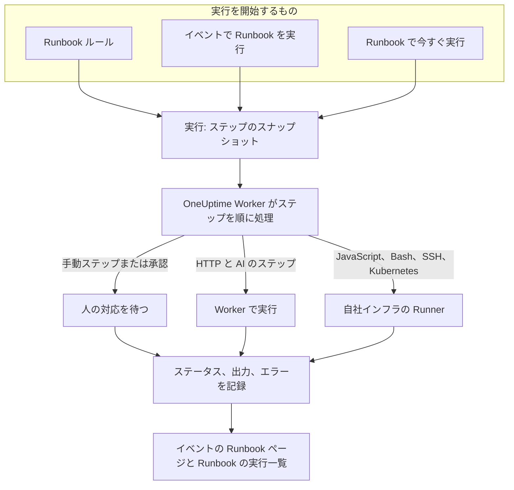

# Runbook 概要

Runbook は再利用できる対応手順です。インシデント、アラート、定期メンテナンスイベントに対して実行する、手動ステップと自動ステップの順序付きリストです。「次は何をすればいい？」というやり取りを、オンコール担当者なら誰でも午前 3 時にたどれるチェックリストに変え、スクリプト、API 呼び出し、承認はあらかじめ書かれています。Runbook は、インシデントに対応するオンコールエンジニアと、その対応を自動化するプラットフォームチームのためのものです。

:::cards
- [Runbook を作成する](/docs/runbooks/authoring): Runbook を作成し、そのステップを書きます。
- [Runbook ルール](/docs/runbooks/rules): 新しいインシデント、アラート、メンテナンスイベントで Runbook を開始します。
- [Runbook を実行する](/docs/runbooks/running): 実行を開始し、ステップを完了・承認し、キャンセルします。
- [Runbook エージェント](/docs/runbooks/agents): 自社インフラでスクリプトを実行する Runner をインストールします。
:::

## Runbook の実行の流れ



Runbook を実行するたびに **実行** が作成されます。開始時に Runbook のステップがコピーされ、OneUptime はそれを順に処理します。Manual ステップや承認が必要なステップは、誰かが対応するまで実行を一時停止します。

HTTP と AI のステップは OneUptime Worker で実行されます。JavaScript、Bash、SSH、Kubernetes のステップは自社インフラにインストールした [Runner](/docs/runbooks/agents) で実行されるため、スクリプトが OneUptime のサーバーで実行されることはありません。各ステップのステータス、出力、エラーメッセージは実行に記録され、実行は対象のインシデント、アラート、イベントに残ります。

## 主な概念

| 概念 | 意味 |
| --- | --- |
| **Runbook** | テンプレートです。名前の付いた再利用可能な手順で、ステップの順序付きリストと **この Runbook を実行** スイッチを持ちます。 |
| **ステップ** | Runbook の 1 項目です。種類（Manual、JavaScript、HTTP request、Bash、SSH、Kubernetes、AI）、タイトル、説明、種類ごとの設定を持ちます。 |
| **Runbook ルール** | 条件（モニター、重大度、ラベル、モニターのラベル、タイトル、説明）を満たすインシデント、アラート、定期メンテナンスイベントに、1 つ以上の Runbook を自動で関連付けるルールです。 |
| **実行** | Runbook の 1 回の実行です。ルールが発火したとき、誰かがイベントで **Runbook を実行** をクリックしたとき、または Runbook 自体で **今すぐ実行** をクリックしたときに作成されます。ステップのスナップショットと、各ステップのステータスと出力を保持します。 |
| **スナップショット** | 各実行に保存される、Runbook のステップの固定されたコピーです。後から Runbook を編集しても、過去の実行の履歴は書き換わりません。 |
| **Runner** | 自社インフラのホストで動かす小さなエージェントです。自分を指定した JavaScript、Bash、SSH、Kubernetes のステップを実行します。Runbook エージェントとも呼ばれます。 |
| **認証情報** | SSH と Kubernetes のステップが使う、管理された SSH または Kubernetes のアクセス権です。保存時に暗号化され、割り当てた Runner にだけ渡されます。 |
| **シークレット** | Bash や JavaScript のスクリプトが `{{runbookSecrets.NAME}}` として使う、API トークンなどの単一の値です。保存時に暗号化され、割り当てた Runner にだけ渡されます。 |

## ステップの種類

各ステップに合う種類を選びます。[Runbook を作成する](/docs/runbooks/authoring) で各種類の設定を説明しています。

| ステップの種類 | 実行場所 | 使う場面 | 例 |
| --- | --- | --- | --- |
| **Manual** | 人 | OneUptime にはできない確認、判断、操作を人が行う必要がある。 | 「トラフィックがセカンダリリージョンに切り替わったことを確認する。」 |
| **JavaScript** | Runner | サンドボックスで小さく限定された計算が必要。 | レプリカの遅延を計算し、続行するかどうかを決める。 |
| **HTTP request** | OneUptime Worker | 既存の API（クラウドプロバイダー、PagerDuty、Slack の Webhook、自社サービス）を呼び出す。 | フェイルオーバーオーケストレーターへの `POST`。 |
| **Bash** | Runner | 自社インフラでシェルコマンドが必要。 | `kubectl rollout restart` や復旧スクリプトを実行する。 |
| **SSH** | Runner | 管理された SSH の認証情報で、リモートホストで 1 つのコマンドを実行する必要がある。 | Web サーバーでサービスを再起動する。 |
| **Kubernetes** | Runner | Deployment、StatefulSet、DaemonSet を再起動またはスケールする必要がある。 | `production` の `checkout-api` を再起動する。 |
| **AI** | OneUptime Worker | 実行の途中で、プロジェクトの LLM プロバイダーによる分析、要約、判断がほしい。 | 「上の診断結果を確認してください。フェイルオーバーしても安全ですか？」 |

1 つの Runbook にすべてを混在させられます。人による確認と自動化と AI の分析を織り交ぜられることが Runbook の強みです。

## 実行を開始するもの

| 方法 | 場所 | 実行の関連付け先 |
| --- | --- | --- |
| Runbook ルール | **インシデント**、**アラート**、**定期メンテナンス** → **ルール** → **Runbook ルール** | 新しいインシデント、アラート、イベント |
| **Runbook を実行** | インシデント、アラート、定期メンテナンスイベントの **Runbook** ページ | そのイベント |
| **今すぐ実行** | Runbook の **概要** ページ | なし（その場限りの実行） |
| 自動修復ルール | [AI SRE](/docs/ai/ai-sre) を参照 | インシデントまたはアラート |

**設定** ページで **この Runbook を実行** スイッチがオフになっている Runbook は、どの方法でも開始されません。すでに開始した実行は続行します。

## ダッシュボードでの Runbook の場所

Runbook は **製品** の **ダッシュボードと自動化** グループにあります。

| ページ | そこで行うこと |
| --- | --- |
| **製品 → Runbook** | Runbook を一覧、作成、表示します。 |
| Runbook の **ステップ** | ステップを書いて並べ替え、 **ステップを保存** を選びます。 |
| Runbook の **概要** | 最新の実行と結果を確認し、 **今すぐ実行** をクリックします。 |
| Runbook の **実行** | この Runbook のすべての実行を、ステータスや開始日で絞り込んで表示します。 |
| Runbook の **所有者** | 担当する人とチームを追加します。 |
| Runbook の **設定** | Runbook を削除せずに **この Runbook を実行** をオフにします。 |
| **Runbook → 実行** | プロジェクト内のすべての Runbook のすべての実行です。 |
| **Runbook → Runner** と **Runbook → Runner → 認証情報** | [Runner](/docs/runbooks/agents) をインストールし、[認証情報](/docs/runbooks/credentials) を管理します。 |
| **Runbook → 設定** | スクリプト用の [シークレット](/docs/runbooks/credentials#スクリプト用のシークレット) と、新しい Runbook に所有者とラベルを追加する **所有者ルール** と **ラベルルール** を管理します。 |
| **インシデント / アラート / 定期メンテナンス → ルール → Runbook ルール** | Runbook を自動で開始するルールを作成します。 |
| インシデント、アラート、メンテナンスイベント → **Runbook** | 関連付けられた実行を確認し、 **Runbook を実行** をクリックして新しく開始します。 |

## 実例

タイトルに「db-primary」を含むインシデントごとに、5 ステップのデータベースフェイルオーバー Runbook を開始したいとします。

:::steps
### Runbook を作成する

**Runbook** で **Runbookを作成** をクリックし、「DB primary failover」と名前を付けます。開いて **ステップ** に移動し、次のステップを追加して **ステップを保存** をクリックします。

| # | 種類 | タイトル |
| --- | --- | --- |
| 1 | JavaScript | フェイルオーバー前のレプリカ遅延を記録する |
| 2 | Manual | DBA ダッシュボードでレプリカが正常であることを確認する |
| 3 | HTTP request | フェイルオーバーオーケストレーターへの `POST` |
| 4 | Manual | 書き込みが新しいプライマリに向かっていることを確認する |
| 5 | HTTP request | Slack の `#db-incidents` に解除通知を送る |

### ルールを追加する

**インシデント → ルール → Runbook ルール** で、条件 1 つと開始する Runbook を指定したルールを作成します。

```text
Conditions:  Incident Title starts with db-primary
Runbooks:    [DB primary failover]
```

### 実行させる

モニターがインシデント `INC-4821 · db-primary connection timeout` を開きます。ルールが一致し、実行が始まります。

- ステップ 1（JavaScript）は、そのステップ用に選んだ Runner で実行されます。`{ lagMs: 412 }` のような戻り値が記録されます。
- ステップ 2（Manual）で実行が一時停止し、 **あなたの対応待ち** と表示されます。オンコール担当者がダッシュボードを確認して **完了にする** をクリックします。
- ステップ 3（HTTP request）が実行され、`POST` のレスポンスが記録されます。
- ステップ 4（Manual）で、誰かが完了するまで実行が再び一時停止します。
- ステップ 5（HTTP request）が実行され、実行は **完了** になります。

### 振り返る

実行はインシデントの **Runbook** ページに残ります。ポストモーテムを書くとき、各ステップの出力、エラー、所要時間をワンクリックで確認できます。
:::

## よくある使い方

- **データベースのフェイルオーバー**: JavaScript で状態を記録し、オンコールの DBA にレプリカの正常性を確認してもらい（Manual）、オーケストレーターを呼び出し（HTTP request）、DNS を確認し（Manual）、解除通知を送ります（HTTP request）。
- **キャッシュのパージ**: HTTP リクエストを 1 回送り、続いて Manual ステップで「キャッシュヒット率が回復していることを確認する」。
- **顧客に影響するインシデント**: Manual で「ステータスページに更新を投稿する」、HTTP リクエストでサポートチームに通知、JavaScript で影響を受けたアカウントの一覧を取得します。
- **定期メンテナンス前の事前確認**: メトリクスのスナップショットを取り、関係者と変更時間帯を確認し（Manual）、ロードバランサーでメンテナンスモードを有効にします（HTTP request）。
- **診断してから修正**: Bash ステップで診断情報を集め、 **承認を要求** を付けた AI ステップがそれを読んで修正を提案し、人が承認して初めて Kubernetes ステップがワークロードを再起動します。
- **常に実行する衛生管理**: 条件のないルールで、インシデントごとにシステムの状態をポストモーテム用に記録します。

## Runbook と OneUptime のほかの機能との関係

- **モニター** がインシデントとアラートを開き、 **Runbook ルール** がそれを Runbook の実行に変えます。検知、トリガー、対応、記録です。
- **[オンコールポリシー](/docs/on-call/schedules)** は誰を呼び出すかを決めます。Runbook は、その人が起きてから何をするかを決めます。
- Slack や Microsoft Teams などの **[ワークスペース接続](/docs/workspace-connections/slack)** は、更新を投稿する HTTP リクエストステップの自然な送り先です。
- **[ステータスページ](/docs/status-pages/index)** は、顧客向け Runbook の Manual ステップとして更新されることがよくあります。

## 次のステップ

:::cards
- [Runbook を作成する](/docs/runbooks/authoring): 最初の Runbook とそのステップを作成します。
- [Runbook エージェント](/docs/runbooks/agents): JavaScript、Bash、SSH、Kubernetes のステップを書く前に Runner をインストールします。
- [Runbook ルール](/docs/runbooks/rules): インシデントが作成されたときに Runbook を自動で開始します。
- [Runbook の設定と安全性](/docs/runbooks/configuration): 上限、タイムアウト、権限、堅牢化。
:::
