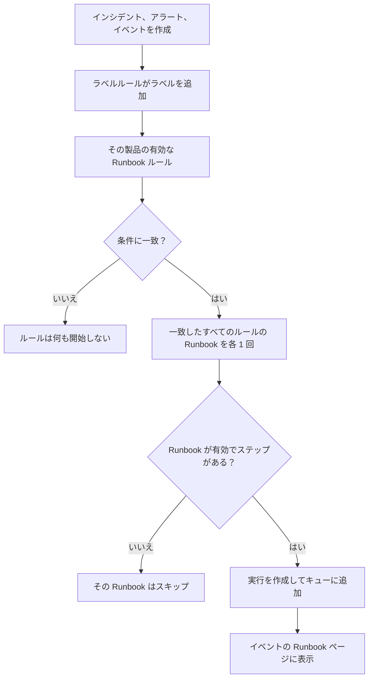

# Runbook ルール

Runbook ルールは、 **インシデント** 、 **アラート** 、 **定期メンテナンスイベント** が作成されたときに Runbook を自動で開始します。障害の最中に誰かが実行を思い出す必要はありません。各製品には、その **ルール** メニューに専用のルールページがあります。

- インシデント → ルール → **Runbook ルール**
- アラート → ルール → **Runbook ルール**
- 定期メンテナンス → ルール → **Runbook ルール**

3 つのページはどれも同じ種類のルールを編集し、それぞれの製品のルールだけを表示します。

:::cards
- [Runbook ルールを作成する](#runbook-ルールを作成する): 名前、条件、開始する Runbook の 4 ステップ。
- [条件](#条件): ルールで使えるすべての基準と演算子。
- [一致の仕組み](#一致の仕組み): 複数のルール、モニターの条件、ラベルルール。
- [例](#例): コピーして使える 3 つのルール。
:::

## ルールが Runbook を開始する仕組み



ルールが発火すると、指定された各 Runbook について次のことが起きます。

1. Runbook が読み込まれます。
2. そのステップが **スナップショット** として新しい Runbook の実行にコピーされます。
3. 実行が Runbook ワーカーのキューに追加されます。
4. 実行が元のエンティティに関連付けられます。インシデント、アラート、定期メンテナンスイベントの **Runbook** ページと、Runbook の **実行** 一覧に表示されます。

ルールが開始したかどうかにかかわらず、すべての実行は **Runbook → 実行** で、ステータス、Runbook、開始日で絞り込んで確認できます。

## 始める前に

- **実行できる Runbook。** 少なくとも 1 つのステップがあり、 **設定** ページで **この Runbook を実行** がオンになっている必要があります。[Runbook を作成する](/docs/runbooks/authoring) を参照してください。
- **ルールを管理する権限。** Project Owner、Project Admin、Runbook Admin は Runbook ルールを作成できます。 **Create Runbook Rule** 権限を持つ人も作成できます。

## Runbook ルールを作成する

:::steps
### Runbook ルールを開く

**インシデント** 、 **アラート** 、 **定期メンテナンス** のいずれかで **ルール → Runbook ルール** を開き、 **Runbook ルールを作成** をクリックします。

### ルールに名前を付ける

**基本情報** で **名前** （例:「データベースのインシデントで DB フェイルオーバーを開始」）と、必要に応じて **説明** を入力します。

### 条件を追加する

**一致条件** で **条件を追加** をクリックし、基準と演算子を選んで値を入力または選択します。必要に応じて条件を追加し、 **すべてに一致** または **いずれかに一致** を選びます。この種類の新しいイベントすべてで Runbook を開始するには、条件を追加しません。

### Runbook を選ぶ

**Runbook** で 1 つ以上の **開始する Runbook** を選び、 **Runbook ルールを作成** をクリックします。ルールは作成されるとすぐに有効になり、一覧に **有効** のステータスで表示されます。
:::

## ルールの構成

| 項目 | 目的 |
| --- | --- |
| **名前** | ルールの短くわかりやすいラベルです。 |
| **説明** | チームメンバー向けの任意のコンテキストです。 |
| **有効** | 新しいルールではオンです。ルールの編集フォームでオフにすると、削除せずに一時停止できます。 |
| **条件** | **一致条件** ステップで指定する、ルールが一致する対象です。空にすると、その種類のすべてのイベントに一致します。 |
| **開始する Runbook** | ルールが発火したときに開始する 1 つ以上の Runbook です。 |

## 条件

各条件は、インシデント、アラート、定期メンテナンスイベントの 1 つの属性を、指定した値と比較します。Runbook ルールは、その製品のほかのルールと同じ基準を提供します。インシデントの Runbook ルールは、インシデントのプライバシールールやオンコールルールと同じものに一致します。

| 基準 | 確認する内容 |
| --- | --- |
| **モニター** | インシデントや定期メンテナンスイベントが影響するモニター、またはアラートを発生させたモニター。 |
| **インシデントの重大度** / **アラートの重大度** | インシデントまたはアラートの重大度。定期メンテナンスイベントには重大度がないため、そのルールでは提供されません。 |
| **インシデントのラベル** / **アラートラベル** / **イベントラベル** | インシデント、アラート、イベント自体のラベル。作成時にラベルルールが追加したものも含みます。 |
| **モニターラベル** | そのモニターのラベル。モニターに `production` や `staging` のラベルを付けると、1 つの環境だけで Runbook を実行できます。 |
| **インシデントタイトル** / **アラートタイトル** / **イベントのタイトル** | タイトル。 |
| **インシデントの説明** / **アラートの説明** | 説明（イベントでは基準の名前は **イベントの説明** です）。 |
| **モニター名** / **モニターの説明** | そのモニターの名前または説明。 |

各条件で演算子を選びます。

- リスト型の基準（ **モニター** 、重大度、ラベル）では、選んだ値に対して **いずれかを含む** 、 **すべてを含む** 、 **いずれも含まない** を使います。
- テキスト型の基準では、 **含む** （新しい条件の初期値）、 **含まない** 、 **等しい** 、 **等しくない** 、 **で始まる** 、 **で終わる** 、または大文字と小文字を区別しない正規表現や `*` ワイルドカード用の **パターンに一致** / **パターンに一致しない** を使います。テキストの比較では大文字と小文字は区別されません。

条件が 2 つ以上ある場合は、 **すべてに一致** （すべての条件が真）または **いずれかに一致** （少なくとも 1 つが真）を選びます。

## 一致の仕組み

- 条件のないルールは、その種類のすべてのイベントに適用されます（グローバルな「常に実行」ルール）。
- 1 つのイベントに複数のルールが一致することがあります。一致したルールはすべて発火し、それらの Runbook の和集合が実行されます。各 Runbook はそれぞれの実行を持ち、一致した 2 つのルールが同じ Runbook を指定していても 1 回だけ実行されます。
- モニターの条件は 1 つのモニターずつ確認されます。 **すべてに一致** の場合、「 **モニター名** が `api` を含む」と「 **モニターラベル** が _Production_ のいずれかを含む」には、両方を満たす 1 つのモニターが必要で、それぞれを満たす別々のモニターではありません。
- Runbook ルールはラベルルールの後に実行されるため、ラベルルールが新しいインシデント、アラート、イベントに付けたラベルで Runbook を開始できます。
- 作成時点で解決済みのインシデントやアラートは Runbook を開始しません。記録される前に終わっていたからです。[確認済みまたは解決済みの状態で宣言されたインシデント](/docs/incidents/declaring-incidents#確認済みまたは解決済みの状態で宣言されたインシデント) を参照してください。
- 別の製品の重大度に対する条件（たとえばインシデントのルールでの **アラートの重大度** ）は決して真にならないため、API は保存を拒否します。
- ルールはイベントの作成時に 1 回だけ評価されます。後からインシデントのタイトル、重大度、ラベルを編集しても、ルールは再度発火しません。

## 例

### データベースのインシデントで DB フェイルオーバー

```text
Name:        Start DB failover for DB incidents
Trigger:     Incident
Conditions:  Incident Title matches pattern (?:^|\b)(db|database|postgres|mysql|mongo)
Runbooks:    [DB failover playbook, Notify DBA team]
```

タイトルに「db」「database」「postgres」などを含むインシデントが作成されるたびに、Runbook の実行が 2 つ作成されます。

### 本番環境の重大なインシデントのみ

```text
Name:        Flush the CDN cache for critical production incidents
Trigger:     Incident
Conditions:  Match all
             Monitor Labels has any of Production
             Incident Severities has any of Critical
Runbooks:    [Flush CDN cache]
```

_Production_ ラベルの付いたモニターの重大なインシデントで実行され、staging では何も実行されません。

### 常に実行する衛生管理ルール

```text
Name:        Always-run pre-flight check
Trigger:     Incident
Conditions:  (none)
Runbooks:    [Capture pre-incident state]
```

すべてのインシデントで発火します。システムの状態、メトリクスなどのスナップショットをポストモーテム用に記録するのに便利です。

## 無効な Runbook

ルールが無効な Runbook（Runbook の **設定** ページで **この Runbook を実行** がオフ、`isEnabled = false`）を指定している場合、ルールは一致しますが、Runbook の実行はスキップされます。再開するにはスイッチをオンに戻します。ステップのない Runbook も同じようにスキップされます。

## ルールをテストする

本番でルールを信頼する前に、ルールの条件を満たすテスト用のインシデント（またはアラート）を作成し、その **Runbook** ページに期待どおりの Runbook が表示されることを確認します。

> [!NOTE]
> Runbook ルールは新しいイベントにだけ作用します。ラベルルールや所有者ルールとは異なり、[既存のレコードに対して実行する](/docs/configuration/run-rules-now) ことはできません。すでに終わったインシデントの Runbook を開始してしまうためです。

## トラブルシューティング

:::details ルールは一致したが Runbook が実行されなかった
次の順に確認します。

- ルールが **有効** になっている。
- 各 Runbook の **設定** ページで **この Runbook を実行** がオンになっていて、保存済みのステップが 1 つ以上ある。
- インシデントやアラートが、作成時点で解決済みではなかった。
- Runbook の実行が単に待機しているだけではない。イベントの **Runbook** ページから開いてください。Manual ステップや承認では **あなたの対応待ち** と表示されます。
:::

:::details ルールがまったく一致しない
ルールは作成時点のイベントを、その時点でラベルルールが追加したラベルとともに評価します。後から変更されたラベル、重大度、タイトルは考慮されません。条件が複数ある場合は **すべてに一致** と **いずれかに一致** を確認し、モニターの条件はすべて同じ 1 つのモニターに当てはまる必要があることを思い出してください。
:::

:::details API が「can only be used by」でルールを拒否する
重大度の基準は 1 つの製品に属します。インシデントのルールでの **アラートの重大度** や、アラートのルールでの **インシデントの重大度** は決して一致しないため、ルールは「Alert Severities can only be used by alert runbook rules.」のようなメッセージで拒否されます。その条件を削除してください。ダッシュボードは各製品自身の基準だけを提供します。
:::

## 次のステップ

:::cards
- [Runbook を実行する](/docs/runbooks/running): ルールが実行を開始したときに対応者に表示される内容。
- [Runbook を作成する](/docs/runbooks/authoring): ルールが開始する Runbook を書きます。
- [インシデントを宣言する](/docs/incidents/declaring-incidents): インシデントがどのように作成され、いつルールがそれを評価するか。
:::
