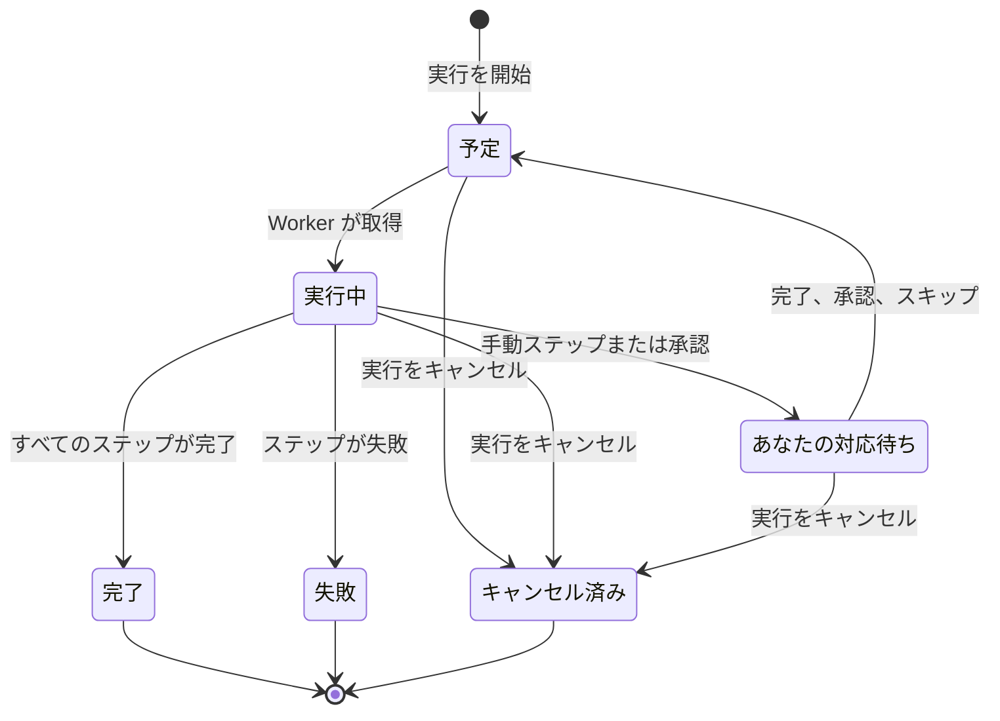

# Runbook を実行する

Runbook を実行するたびに **実行** が作成されます。実行は Runbook のステップのスナップショットで、順番に処理され、各ステップのステータスと出力が記録されます。このページは、インシデントに対応し、実行を開始して先へ進める人のためのものです。実行の開始方法、実行ページに表示される内容、ステップの完了、承認、スキップ、キャンセルの方法を説明します。

:::cards
- [実行を開始する](#実行を開始する): インシデント、アラート、イベントから、または Runbook 自体から。
- [実行ビュー](#実行ビュー): 実行中に各ステップに表示される内容。
- [ステップの完了、承認、スキップ](#ステップの完了承認スキップ): どのステップがいつ判断を受け付けるか。
- [トラブルシューティング](#トラブルシューティング): 開始しない、または終わらない実行。
:::

## 実行の進み方

新しい実行は、Worker が取得して **実行中** にするまで **予定** です。Manual ステップ、または承認が必要なステップの後で **あなたの対応待ち** として一時停止し、誰かが対応するとすぐにキューに戻ります。人を待っている実行がタイムアウトすることはありません。実行は **完了** 、 **失敗** 、 **キャンセル済み** のいずれかで終わります。

## 実行を開始する

Runbook の実行は次の 3 つの方法で作成されます。

1. **ルールによる自動開始**: 一致するインシデント、アラート、定期メンテナンスイベントが作成されると、[Runbook ルール](/docs/runbooks/rules) が実行を開始します。自動修復ルールも実行を開始できます。[AI SRE](/docs/ai/ai-sre) を参照してください。
2. **イベントからの手動開始**: インシデント、アラート、定期メンテナンスイベントで **Runbook を実行** をクリックします。実行はそのイベントに関連付けられます。
3. **Runbook のページからの手動開始**: Runbook の **概要** ページで **今すぐ実行** をクリックします。この実行はインシデント、アラート、定期メンテナンスイベントのどれにも関連付けられません。

手動で開始するには:

:::tabs
@tab イベントから
1. インシデント、アラート、定期メンテナンスイベントを開き、その **Runbook** ページに移動します。
2. **Runbook を実行** をクリックします。 **Runbook を実行** ダイアログに、プロジェクトの有効な Runbook が一覧表示されます。
3. Runbook の横の **実行** をクリックします。実行がイベントの一覧に表示されるので、 **表示** をクリックして開きます。
@tab Runbook から
1. **Runbook** から Runbook を開きます。
2. その **概要** で **今すぐ実行** をクリックします。
3. 実行ページが開きます。
:::

実行を開始するには、Project Owner、Project Admin、Project Member、Runbook Admin、Runbook Member のいずれか、または **Create Runbook Execution** 権限が必要です。Runbook Viewer と Viewer には、 **今すぐ実行** が理由付きでロックされて表示されます。[権限](/docs/runbooks/configuration#権限) を参照してください。

## 実行ビュー

実行を開くと、そのチェックリストが表示されます。ページ上部には実行の **ステータス** 、 **進捗** （全ステップのうち終わったステップ）、 **開始** （開始日時）、 **トリガー元** （何が開始したか）が表示されます。各ステップには次の内容が表示されます。

- **ステータスバッジ** — 保留中、実行中、あなたの対応待ち、完了、スキップ済み、失敗、キャンセル済み。
- **タイトルと説明** — 実行の開始時に Runbook からコピーされたもの。
- **出力** （折りたたみ可能） — stdout、戻り値、HTTP レスポンス、または AI の応答。
- ステップが失敗した場合は **エラーメッセージ** 。
- 実行が待っているステップでは、 **完了にする** （Manual ステップ）または **承認して続行** （ **承認を要求** が付いたステップ）と **スキップ** 。
- 実行が一時停止している間、承認が不要な後続の自動ステップには **スキップ** 。

実行が進行している間、ページは 30 秒ごとに自動で更新されます。最新の状態をすぐに見るには **更新** をクリックします。

## ステップの完了、承認、スキップ

実行を先に進めるために完了、承認、スキップできるのは、実行が待っているステップだけです。Manual ステップや **承認を要求** が付いたステップは、実行がそこに達するまでチェックもスキップもできません。これらの役割は実行を止めることなので、実行がそこにあるとき（承認の場合は、ステップが実行され、その出力を確認できるとき）にだけ判断を受け付けます。

実行が一時停止している間は、承認が不要な後続の自動ステップをスキップして、実行が再開したときに実行されないようにすることもできます。実行は、あなたを待っているステップで一時停止したままです。ステップの実行中はスキップできません。実行が一時停止するまで待つか、キャンセルしてください。各ステップには、誰が完了またはスキップしたかが記録されます。

| ステップ | 完了または承認 | スキップ |
| --- | --- | --- |
| 実行が待っているステップ | はい | はい |
| **承認を要求** が付いていない後続の自動ステップ | いいえ | はい（実行の一時停止中） |
| 後続の Manual ステップ、または **承認を要求** が付いたステップ | いいえ | いいえ |
| ステップの実行中のすべてのステップ | いいえ | いいえ |

完了、承認、スキップ、キャンセルには、実行の開始と同じロール、または **Edit Runbook Execution** 権限が必要です。

## 手動ステップと自動ステップを組み合わせる

典型的な流れ:

| # | ステップ | 何が起きるか |
| --- | --- | --- |
| 1 | Bash: システムの状態を記録する | 実行が始まるとすぐに、その Runner で実行されます。 |
| 2 | Manual:「ステータスページのバナーで顧客に知らせる。」 | 誰かが **完了にする** をクリックするまで実行が一時停止します。 |
| 3 | HTTP request: PagerDuty で DBA を呼び出す | Worker で実行されます。 |
| 4 | Manual:「セカンダリデータベースがプライマリになったことを確認する。」 | 実行が再び一時停止します。 |
| 5 | HTTP request: Slack の Webhook に解除通知を送る | 実行され、実行は **完了** になります。 |

ステップ 2 と 4 は、誰かがチェックするまで実行を一時停止します。ステップ 1、3、5 は自動で実行されます。全体が 1 つの実行、1 つのタイムライン、1 つの信頼できる情報源です。

## 実行のキャンセル

実行ページで **実行をキャンセル** をクリックします。ステータスは `Cancelled` になり、後続のステップは開始されません。すでに実行中のステップは中断されませんが、その結果は記録されず、ステップは `Cancelled` のままです。Runner を待っているジョブはキャンセルされます。すでにスクリプトを実行している Runner は最後まで実行しますが、結果は受け付けられません。

## 出力の上限

暴走したスクリプトでデータベースが膨らまないよう、ステップごとの出力は **50 KB** に制限されています。それより長い出力はマーカー付きで切り詰められます。もっと大きな成果物が必要な場合は、スクリプトからオブジェクトストレージやログシステムに書き込み、URL を出力してください。

## Runbook を再実行する

実行は一度きりの変更できない記録です。もう一度実行するには、終了した実行で **再実行** をクリックするか、Runbook で **今すぐ実行** をクリックします。どちらも Runbook の現在のステップから新しい実行を作成し、どのイベントにも関連付けません。インシデントで再実行するには、インシデントの **Runbook** ページで **Runbook を実行** を使います。元の実行は監査証跡としてそのまま残ります。

## 過去の実行を探す

| 場所 | 表示される内容 |
| --- | --- |
| Runbook の **実行** | その Runbook のすべての実行。ステータスと開始日のフィルター、 **トリガー元** 列があります。 |
| **Runbook → 実行** | プロジェクト内のすべての Runbook のすべての実行。 |
| インシデント、アラート、イベントの **Runbook** ページ | それに関連付けられた実行。実行があれば、イベントの概要にも表示されます。 |

## トラブルシューティング

:::details 今すぐ実行がロックされている
あなたのロールは Runbook を読めますが実行はできません。ボタンには「このプロジェクトで Runbook の実行を開始する権限がありません。」と表示されます。Runbook Member または **Create Runbook Execution** 権限を依頼してください。
:::

:::details 実行の開始が「Runbook is disabled」または「Runbook has no steps to run」で失敗する
Runbook の **設定** ページで **この Runbook を実行** スイッチがオフになっているか、保存済みのステップがありません。スイッチをオンにするかステップを追加し、 **ステップを保存** をクリックします。
:::

:::details Runner または認証情報がないためにステップが失敗した
メッセージはたとえば「Bash step is missing a Runner. Pick one under Runbooks → Runners.」です。ステップが **Runner** なしで保存されたか、SSH または Kubernetes のステップが **認証情報** なしで保存されました。Runbook の **ステップ** を開き、足りないものを選んで **ステップを保存** をクリックし、Runbook を再実行します。
:::

:::details どの Runbook エージェントもステップを取得しなかったために失敗した
メッセージは「No runbook agent picked up this step before the wait window expired.」です。ステップの Runner が取得のタイムアウト内にジョブを取得しませんでした。 **Runbook → Runner** で、Runner が **接続済み** で **Runbook を実行** がオンになっていることを確認してください。[Runbook エージェント](/docs/runbooks/agents#トラブルシューティング) を参照してください。
:::

:::details 実行が何時間も待っている
人を待っている実行がタイムアウトすることはありません。実行を開いて **あなたの対応待ち** と表示されているステップで対応するか、 **実行をキャンセル** をクリックします。
:::

:::details ステップが部分的に実行された可能性があると表示される
ステップを実行していた OneUptime Worker が再起動したか応答しなくなったため、実行は止まったままにならず失敗として記録されました。Runbook を再実行する前に、対象のシステムを確認してください。
:::

## 次のステップ

:::cards
- [Runbook を作成する](/docs/runbooks/authoring): 人が判断すべき箇所に Manual ステップと承認を追加します。
- [Runbook ルール](/docs/runbooks/rules): 新しいインシデントで実行を自動で開始します。
- [Runbook エージェント](/docs/runbooks/agents): ステップに必要な Runner をオンラインに保ちます。
:::
