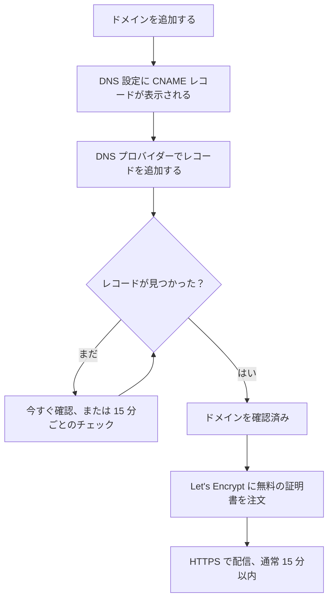

# ステータス ページのブランディングとドメイン

ステータスページは、顧客が目にする唯一の OneUptime の画面です。だからこそ自社らしい見た目にし、`status.yourcompany.com` のような自社のドメインに置くべきです。このページでは **ブランディング** ページをカードごとに説明し、そのあとページを自社のドメインに置きます。ドメインを追加し、DNS レコードを 1 つ追加すれば、無料の SSL 証明書は自動で付いてきます。

:::cards
- [ブランディング ページ](#ブランディング-ページ): ロゴ、タイトル、ファビコン、リンク、フッター、色、言語。
- [カスタム HTML、CSS、JavaScript](#カスタム-htmlcssjavascript): 組み込みの設定でカバーできないもの。
- [カスタムドメイン](#カスタムドメイン): 無料の証明書付きの、自社のホスト名。
- [ステータス列](#ドメインのステータス列の読み方): 各ドメインが HTTPS までのどこにいるか。
:::

## 各ブランディング設定の場所

ステータスページを開くと、サイドメニューの **ブランディング** セクションに 3 つの項目があります。

| ページ | そこで設定するもの |
| ---- | ------------------ |
| **ブランディング** | ロゴとカバー画像、ページのタイトルと説明、ファビコン、ヘッダーリンク、概要ページの説明、著作権の行、フッターリンク。**その他の設定** に折りたたまれているもの: 履歴チャートの色、言語、検索エンジンによるインデックス登録。 |
| **カスタムドメイン** | 自社のドメイン、その DNS レコード、無料の SSL 証明書。 |
| **HTML、CSS、JavaScript** | ヘッダー HTML、フッター HTML、カスタム CSS、カスタム JavaScript。 |

ブランディングに見える 3 つのものは、見た目ではなくページに何を表示するかを決めるため、代わりに **ステータスページ → 対象のページ → 詳細 → 詳細設定**（`{id}/settings`）にあります。全体の稼働率、稼働率に不利に数えるモニターステータス、「Powered by OneUptime」の行です。3 つとも、そこにある **ステータスページに表示する内容** カードの行です。

以前のブランディングは、**基本のブランディング**、**ヘッダー**、**フッター**、**概要ページ**、**言語** という別々の画面に分かれていました。その古いアドレス（`{id}/header-style`、`{id}/footer-style`、`{id}/overview-page-branding`、`{id}/languages`）は今では **ブランディング** ページを開くため、古いブックマークやリンクも引き続き使えます。

## ブランディング ページ

**ステータスページ → 対象のページ → ブランディング → ブランディング**（`{id}/branding`）。各カードは個別に保存されます。ロゴ、タイトル、ファビコンのあと、カードはステータスページを上から順にたどります。ヘッダーのリンク、概要の最上部のテキスト、そしてフッターです。変更する人が少ないものは、一番下の **その他の設定** に折りたたまれています。

### ロゴとカバー画像

最初のカード **ロゴとカバー画像** には **画像を編集** ボタンがあり、2 つのステップを開きます。

| ステップ | 項目 |
| ---- | ------ |
| **ロゴ** | ロゴのアップロード（プレースホルダーは `Upload logo`）と **ロゴの代替テキスト**（プレースホルダーは `Logo of My Company`）。代替テキストを空にすると、代わりにステータスページのタイトルが使われます。 |
| **カバー画像** | ヘッダーの背後にある横長のバナー用のアップロード **カバー**（プレースホルダーは `Upload cover image`）と、**カバー画像の代替テキスト**。カバーが純粋な装飾なら代替テキストは空にします。 |

ロゴ、カバー画像、ファビコンは、ステータスページ自身のプロジェクトにアップロードされたファイルです。これは、ダッシュボード、API、Terraform、ワークフローのどこから保存しても、そのたびにチェックされます。別のプロジェクトでアップロードされたファイルは、もう存在しないファイルと同じ言葉で拒否されます: "The logo's file could not be found. Upload the logo again."、"The cover image's file could not be found. Upload the cover image again."、または "The favicon's file could not be found. Upload the favicon again." ページから画像をもう一度アップロードすれば直ります。

ステータスページに表示されるのは、自分のプロジェクトの画像だけです。表示できない画像は、最初からなかったかのように省かれます。ダッシュボード、API、Terraform もページの画像を同じように読み、別のプロジェクトの画像は画像なしとして返されます。ページが送るメール（購読者宛て、およびプライベートユーザーへのサインイン関連のメール）でも同じで、ページが表示できないロゴは壊れた画像として表示されるのではなく省かれます。

### タイトル、説明、ファビコン

- **タイトルと説明**: カードには、これが SEO にも使われると書かれています。**編集** で **ページタイトル**（プレースホルダーは `Please enter page title here.`）と **ページの説明** が開きます。検索エンジンやリンクのプレビューに表示されるため、チームではなく顧客に向けて書いてください。
- **ファビコン**: **ファビコンを編集** で **ファビコン** のアップロードが開きます。ブラウザーのタブに表示される小さなアイコンです。

### ヘッダーリンク

**ヘッダーリンク** の表には、自社の Web サイト、ドキュメント、サポートポータルなど、ステータスページのヘッダーにあるリンクが入ります。各リンクには **タイトル** と **リンク**（URL。プレースホルダーは `https://link.com`）があり、ドラッグで並べ替えます。リンクがないときは、表に **このステータスページのステータスヘッダーリンクはありません** と表示され、その下に **ステータスページのヘッダーリンクを作成** があります。

### 概要ページの説明

**概要ページの説明** は、ステータスページの概要で、お知らせ、全体のステータス、リソースより上に最初に表示されるものです。**説明を編集** で markdown の項目が開きます。このページが何を対象にしているか、サポートはどこに求めればよいかといった、文脈を伝える 1 文に使ってください。中に入れた画像は、ページのすべての訪問者に表示されます。

### フッター

- **著作権情報**: **著作権表示を編集** で、プレースホルダーが `Acme, Inc.` の項目 **著作権情報** が 1 つ開きます。
- **フッターリンク**: ヘッダーリンクと同じ **タイトル** と **リンク** の組で、ドラッグで並べ替えます。リンクがないときは「このステータスページのステータスフッターリンクはありません。」と表示されます。

ヘッダーリンクはナビゲーション用、フッターリンクは法的情報、プライバシー、利用規約などの細則用です。

### その他の設定

ページの最後のセクションは、中身を変更する人がほとんどいないため **その他の設定** に折りたたまれています。折りたたまれた状態では、見出しに 4 つのセクション（**デフォルトのバーの色**、**バーの色のルール**、**言語**、**検索エンジンによるインデックス登録** ）が示され、新しいステータスページの初期状態と異なるものがそれぞれ表示されます。すべてのページが最初に使う緑以外のデフォルトのバーの色、何らかのバーの色のルール、英語以外のデフォルト言語、短くした言語リスト、オフにした検索エンジンによるインデックス登録です。クリックすると開きます。1 枚のカードに 4 つのセクションが縦に並び、それぞれに独自のタイトルとボタンがあり、区切り線で分かれています。

**履歴チャートの色。** これがステータスページで唯一の組み込みの色設定です。

- **履歴チャートのデフォルトのバーの色**: **デフォルトのバーの色を編集** で **デフォルトのバーの色** のピッカーが開きます。新しいステータスページはすべて緑から始まります。バーの色のルールがある場合は、どのルールにも一致しない日の色にもなります。ページにデータがない日は、常に灰色で描かれます。
- **履歴チャートのバーの色のルール**: ドラッグで並べ替えるルールの順序付きの表です。各ルールには **稼働率（%）が次の値以上のとき** と **その場合はこのバーの色を使用** があり、表の列は `When Uptime Percent >=` と `Then, Bar Color is` です。新しいルールの色は、他のルールがまだ使っていない色があらかじめ選ばれています。代わりに好きな色を選んでください。順序が重要なので、評価してほしい順にルールを並べます。ルールがない場合、各日のバーはその日の最も低いモニターステータスの色になります。

チャートが何日分を対象にするかはここでは設定しません。それは **詳細 → 詳細設定** の **ステータスページに表示する内容** カードにある **稼働率履歴** で、1 日から 90 日です。どのモニターステータスをダウンとして数えるかは、そのカードの同じ行の **ダウンタイムとしてカウント** です。

**言語。** **言語** セクションでは、訪問者がページのフッターで使う言語の切り替えを設定します。**言語を編集** で 2 つの項目が開きます。

| 項目 | 役割 |
| ----- | ------------ |
| **デフォルト言語** | 初めての訪問者に表示される言語。各言語をその言語自身と英語で示すリスト（`Deutsch (German)`）から選びます。デフォルトは英語で、訪問者はいつでもフッターから切り替えられます。 |
| **有効な言語** | 複数選択。プレースホルダーは `All languages`。空にするとサポートされるすべての言語が提供され、いくつか選ぶとフッターにはそれだけが表示されます。 |

OneUptime には 17 の言語があります: 英語、ドイツ語、フランス語、スペイン語、イタリア語、ポルトガル語、オランダ語、デンマーク語、ノルウェー語、スウェーデン語、ロシア語、日本語、韓国語、中国語（簡体字）、中国語（繁体字）、ヒンディー語、ペルシア語。

**検索エンジンによるインデックス登録。** 1 つのスイッチ **検索エンジンによるこのステータスページのインデックス登録を許可** で、Google、Bing などの検索エンジンがページを掲載してよいかを決めます。デフォルトはオンです。**編集** ボタンはなく、スイッチは切り替えた瞬間に保存されます。オフにすると、ページは `noindex, nofollow`（robots メタタグと `X-Robots-Tag` ヘッダー）付きで配信されます。リンクを知っている人は引き続き開けます。すでにインデックス登録済みのページが検索エンジンから消えるまでには数週間かかることがあります。

> [!TIP]
> ページが社内専用のときや、まだ準備中のときは **検索エンジンによるこのステータスページのインデックス登録を許可** をオフにしてください。作りかけのページがブランド名の検索結果に出始めるのを防げます。

## 稼働率とダウンタイムのステータス

どちらも、**ステータスページ → 対象のページ → 詳細 → 詳細設定**（`{id}/settings`）の **ステータスページに表示する内容** カードの **稼働率履歴** の行にあります。**編集** ボタンはなく、どちらも変更した瞬間に保存されます。

- **全体の稼働率を表示**: スイッチで、デフォルトはオフです。オンの間は、隣の **精度** で稼働率の小数点以下の桁数を選びます: `99%`、`99.9%`、`99.99%`（デフォルト）、`99.999%`。OneUptime Cloud では、稼働率をオンにするには **Scale** プランが必要です。精度はどのプランでも変更できます。
- **ダウンタイムとしてカウント**: このページで時間が稼働率に不利に数えられるモニターステータスで、色付きのチップで表示されます。たとえば、低下のステータスを稼働率に不利に数えるかどうかをここで決めます。少なくとも 1 つのステータスは選ばれたままになります。

以前はこれらは独立した 2 枚のカード **全体の稼働率** と **ダウンタイムとして扱うモニターステータス** で、それぞれ **編集** ボタンの奥にありました。カードの残りについては [ページに表示する内容を選ぶ](/docs/status-pages/index#ページに表示する内容を選ぶ) を参照してください。

## カスタム HTML、CSS、JavaScript

**ステータスページ → 対象のページ → ブランディング → HTML、CSS、JavaScript**（`{id}/custom-code`）には 4 枚のカードがあり、それぞれ個別に編集され、ステータスページの列に保存されます。

| カード | 列 | 内容 |
| ---- | ------ | ------------- |
| **ヘッダー HTML** | `headerHTML` | ページのヘッダーに追加する HTML（プレースホルダーは `Insert Custom HTML here.`）。 |
| **フッター HTML** | `footerHTML` | ページのフッターに追加する HTML。 |
| **カスタム CSS** | `customCSS` | ページ全体のスタイル（プレースホルダーは `Insert Custom CSS here.`）。 |
| **カスタム JavaScript** | `customJavaScript` | ページが実行するスクリプト（プレースホルダーは `Insert Custom JavaScript here.`）。 |

> [!IMPORTANT]
> カスタム HTML、CSS、JavaScript は、確認済みのカスタムドメインでのみ配信されます。デフォルトのアドレス `/status-page/:id` では無効です。そのアドレスは、OneUptime にサインインしているオリジンと同じだからです。

OneUptime Cloud では、これらのいずれかを追加または変更するには **Growth** プランが必要です。空にするのはどのプランでもできるため、トライアル中に追加したカスタムコードはいつでも削除できます。

**テーマの選択はありません。** OneUptime のステータスページには、テーマやブランドカラーの設定がありません。組み込みの色設定は、どこを探しても **ブランディング** ページの **その他の設定** にある **デフォルトのバーの色** と履歴チャートのバーの色のルールだけです。フォント、背景色、アクセントカラー、レイアウトの調整は、すべて **カスタム CSS** で行います。「ブランドカラー」の項目を探していたなら、答えはこうです。そのような項目はなく、このボックスがその方法です。

> [!WARNING]
> カスタム JavaScript は訪問者のブラウザーで実行されます。それも、何かが壊れていると思ったときにこそ開かれるページでです。小さく保ち、読み込むものはできるだけ自分でホストし、頼る前にテストしてください。

## カスタムドメイン

デフォルトでは、ステータスページはその **概要** 画面にあるプレビュー URL でアクセスできます。自社のホスト名に置くには、**ステータスページ → 対象のページ → ブランディング → カスタムドメイン**（`{id}/domains`）に移動します。

**カスタムドメイン** カードに手順が書かれています。各ドメインの CNAME レコードを、インストールのステータスページ用 CNAME レコードに向けると、OneUptime がドメインの SSL 証明書を発行し、更新してくれます。何も設定していないときは、表に **カスタムドメインが見つかりません** と表示され、その下に **ステータスページのドメインを作成** があります。表には **ドメイン** と **ステータス** の 2 列があり、**ドメイン**、**CNAME が有効**、**SSL プロビジョニング済み** のフィルターがあります。

ページを自社のドメインに置く手順は 3 つで、あなたが行うのは最初の 2 つだけです。

1. **ドメインを追加する**: サブドメインと、確認済みのドメインの 1 つ。
2. **その CNAME レコードを追加する**: DNS プロバイダーで追加します。ドメインを追加するとすぐ、**DNS 設定** ダイアログにレコードが表示されます。
3. **無料の SSL 証明書は自動で発行されます**: レコードが見つかるとすぐに発行されます。押すボタンはありません。



### 始める前に

- **親ドメインが確認済みである必要があります。** **ドメイン** のドロップダウンには、**プロジェクト設定 → ドメイン** で確認済みのドメインだけが表示されます。そこでは TXT レコードでドメインの所有を証明します。項目の横にある **ドメインを追加** のリンクで、そのページが新しいタブで開きます。
- **インストールにはステータスページ用の CNAME レコードが必要です。** OneUptime Cloud にはあります。セルフホストのインストールでは、OneUptime サーバーを指すホスト名（A レコード）を設定し、Let's Encrypt がチェックするポート 80 でサーバーが応答するようにします。これがないと、カードと **DNS 設定** ダイアログにはレコードの代わりに "Custom Domains not enabled for this OneUptime installation" と表示されます。

:::tabs
@tab Docker Compose
```ini title="config.env"
STATUS_PAGE_CNAME_RECORD=oneuptime.yourcompany.com
```
@tab Kubernetes
```yaml title="values.yaml"
statusPage:
  cnameRecord: oneuptime.yourcompany.com
```
:::

### ドメインを追加する

:::steps
#### ステータスページのドメインを作成 を開く

**カスタムドメイン** で **ステータスページのドメインを作成** をクリックします。ダイアログは 1 ページです。

#### サブドメインを入力する

**サブドメイン**（プレースホルダーは `status (leave blank for root)`）には、ホスト名全体ではなく `status` のようなラベルだけを入力します。ルート（apex）ドメインを使うには、空のままにするか `@` を入力します。

#### ドメインを選ぶ

**ドメイン**（プレースホルダーは `Select domain`）で、確認済みのドメインの 1 つを選びます。確認していないドメインは拒否されるため、一覧に表示されません。

#### 無料の証明書を使うか、自分の証明書をアップロードする

**その他の項目** は折りたたまれていて、見出しにドメインが使う証明書が示されます:「このドメインの無料 SSL 証明書を発行し、自動的に更新します。」自分の証明書を使う場合にだけ開きます。**カスタム証明書をアップロード** をオンにし、PEM 形式で **証明書** と **証明書の秘密鍵** を貼り付けます。そうすると両方が必須になります。

#### ドメインを作成する

**ステータスページのドメインを作成** をクリックします。ダイアログが閉じ、追加するレコードが入った新しいドメインの **DNS 設定** が開きます。
:::

ドメインの完全な名前は追加した時点で固定されるため、**編集** で変えられるのは証明書だけです。別のサブドメインを使うには、そのドメインを追加して古いドメインを削除します。

### DNS 設定と確認

**DNS 設定** ダイアログには、DNS プロバイダーで追加するレコードが 1 行に 1 項目ずつ、それぞれコピーボタン付きで表示されます。

| 項目 | 入力する内容 |
| ----- | ------------- |
| **種類** | `CNAME` |
| **名前** | 追加したドメインの完全な名前。たとえば `status.yourcompany.com` |
| **値** | インストールのステータスページ用 CNAME レコード |

> [!NOTE]
> サブドメインのないルートドメインの場合、ダイアログに注意書きが加わります。多くの DNS プロバイダーでは、そこに CNAME レコードを置けません。代わりに、プロバイダーの ALIAS、ANAME、または CNAME フラット化のレコードを同じ値で使ってください。

OneUptime は未確認のドメインを 15 分ごとにチェックし、あなたが戻ってくるかどうかに関係なく、レコードが有効になりしだい確認します。すぐにチェックするには **今すぐ確認** をクリックします。

- **レコードがまだ見つかりません。** ダイアログは開いたままで、どのレコードを探したかを示します。新しい DNS レコードが見えるようになるまでには時間がかかることがあります。あとでもう一度 **今すぐ確認** をクリックするか、15 分ごとのチェックに任せてください。
- **レコードが見つかりました。** ダイアログに「CNAME レコードが確認されました。」と、証明書が次にどうなるかが表示されます。無料の証明書はその時点で注文されます。

ドメインが確認され、証明書が用意されるまで、その行には同じダイアログを開く **DNS 設定** 操作があります。証明書の注文が失敗し続けている、または証明書が期限切れになった確認済みのドメインでは、そこの **今すぐ確認** で再び注文し、前回の注文が失敗した理由を表示します。注文は 1 ドメインにつき 15 分に最大 1 回で、その間も OneUptime は自分で再試行し続けます。

### SSL 証明書

すべてのカスタムドメインに Let's Encrypt の無料の証明書が付き、自動で発行・更新されます。クリックする必要はありません。

- **今すぐ確認** は、レコードが見つかった瞬間に証明書を注文します。そのあとダイアログに、証明書は通常 15 分以内に有効になると表示されます。
- 15 分ごとのチェックがドメインを確認すると、同じチェックの中でドメインの証明書を注文します。
- 更新は、証明書の期限が切れるかなり前に自動で行われます。証明書の更新中に DNS が一時的に応答しなくても、証明書は配信され続け、あとの試行で更新されます。DNS のチェックが失敗しても、まだ有効な証明書が削除されることはありません。

新しい証明書は発行から 15 分以内に配信されます。ドメインに応答するサーバーへ証明書が書き出される頻度がそれだからです。ステータス列が _通常_ 15 分以内と言うのは、多くのドメインが同時に待っているときは数件ずつ処理されるためです。

OneUptime の証明書はすべて 1 つの共有 Let's Encrypt アカウントで注文されます。Let's Encrypt は、1 つのアカウントが短時間に出せる新規注文の数と、同じドメインの注文が失敗できる回数を制限しています。OneUptime はすべての注文（新しいドメイン、**今すぐ確認**、再発行、更新）を合わせてその制限内に収め、更新を常に優先します。そのため、新しいドメインが大量に来ても、既存のドメインをオンラインに保つ更新が遅れることはありません。

注文が失敗すると、ドメインのステータス列にそれが表示され、その下の行に理由が出ます。**DNS 設定** の **今すぐ確認** でも表示されます。OneUptime は自分で再試行し続け、連続して失敗するたびに少し長く待つため、注文が失敗し続けるドメインが、他のすべてのドメインに必要な注文を使い切ることはありません。よくある原因は、ドメインに `letsencrypt.org` を許可しない CAA レコードがあることと、セルフホストのインストールで Let's Encrypt がポート 80 でサーバーに到達できないことです。セルフホストのインストールでは、詳細はワーカーのログにあります。原因を直したら、**今すぐ確認** をクリックしてすぐに再注文します。注文は 1 ドメインにつき 15 分に最大 1 回で、その間にクリックすると前回の注文の結果が表示されます。

**その他の項目** で自分の証明書をアップロードした場合は、保存から 15 分以内に OneUptime がその証明書を配信します。期限が切れる前に、ドメインを編集して後継の証明書をアップロードしてください。

### 証明書を再発行する

普段は自動更新で足りますが、今すぐまったく新しい証明書がほしいこともあります。保持したくない秘密鍵、自社のスキャナーが気に入らない証明書、上流で変更されたドメインなどです。ドメインに無料の証明書が注文されると、その行に **SSL を再発行** 操作が表示されます。

そのダイアログ **このステータスページの SSL 証明書を再発行** は、Let's Encrypt にドメインの新しい証明書を求め、配信中の証明書をそれに置き換えます。その間もステータスページは既存の証明書でオンラインのままで、新しい証明書は 15 分以内に配信されます。注文するには **SSL 証明書を再発行** をクリックします。

> [!NOTE]
> ドメインの再発行は 24 時間に 1 回だけです。Let's Encrypt は同じドメインを発行できる頻度を制限しており、OneUptime の証明書はすべて、他のすべての人のページをオンラインに保つ自動更新も含めて、1 つの共有アカウントで注文されます。その期間内は、ダイアログは注文する代わりに残り時間を表示します。その時点でドメインの証明書が注文中の場合や、インストールの Let's Encrypt の注文がいったん上限に達している場合は、ダイアログにそう表示され、何も注文されず、そのクリックは再発行として数えられません。

アップロードした証明書を使っているドメインには、この操作は表示されません。再発行する Let's Encrypt の証明書がないため、代わりにドメインを編集して新しい証明書をアップロードしてください。ドメインの最初の証明書が注文される前にも表示されません。最初の注文は、CNAME レコードが確認されると自動で行われます。

同じボタンは、同じ 24 時間の制限付きで、**ダッシュボード → 対象のダッシュボード → ブランディング → カスタムドメイン** のダッシュボードのカスタムドメインにもあり、ステータスページのカスタムドメインと同じように動きます。[共有と公開ダッシュボード](/docs/dashboards/sharing#カスタムドメイン) を参照してください。

### ドメインのステータス列の読み方

**ステータス** 列は、各ドメインが HTTPS までのどこにいるかを 7 つの状態のいずれかで示します。注文が失敗した場合は、その下の行に理由があります。

| ステータス列の表示 | 意味 |
| --------------------------- | ------------- |
| DNS 待ち: CNAME レコードを追加してください。 | CNAME レコードがまだ見つかりません。**DNS 設定** を開いてレコードを確認し、DNS プロバイダーで追加してから、**今すぐ確認** をクリックするか 15 分ごとのチェックを待ちます。 |
| 無料の証明書を発行しています。通常 15 分以内に完了します。 | レコードは確認済みで、証明書の注文または書き出しの最中です。何もする必要はありません。 |
| 無料の証明書をまだ発行できていません。引き続き試行します。 | レコードは確認済みですが、証明書の注文がその下の行の理由で失敗しました。原因を直し、**DNS 設定** を開いて **今すぐ確認** をクリックすると、すぐに再注文します。 |
| 証明書の有効期限が切れています。引き続き更新を試行します。 | 更新が失敗したため、ドメインの証明書が期限切れになりました。**DNS 設定** を開いて **今すぐ確認** をクリックすると、すぐに更新を試し、理由を確認できます。 |
| 証明書は発行済みで、自動的に更新されます。 | 完了です。ドメインは HTTPS で証明書を配信し、OneUptime がそれを更新します。 |
| 証明書は発行済みですが、更新に失敗しました。引き続き試行します。 | ドメインはまだ有効な証明書を配信していますが、前回の更新がその下の行の理由で失敗しました。OneUptime は証明書の期限が切れるかなり前に再試行します。 |
| アップロード済みの証明書を使用しています。 | レコードは確認済みで、ドメインはアップロードした証明書で配信されています。 |

:::details レコードを追加してからずっと「DNS 待ち」のまま
レコードの名前が `status.yourcompany.com` のような完全なドメインになっているか、値がインストールの CNAME レコードと完全に一致しているかを確認してください。ルートドメインでは、ALIAS、ANAME、またはフラット化した CNAME レコードを使います。そのあと **DNS 設定** で **今すぐ確認** をクリックします。
:::

:::details ステータス列に、無料の証明書を発行できなかったと表示される
ドメインに `letsencrypt.org` を含まない CAA レコードがないか探し、セルフホストのインストールではサーバーがポート 80 で応答するかを確認してください。原因を直したら、**DNS 設定** で **今すぐ確認** をクリックして再注文します。
:::

### 確認と再発行ができる人

**今すぐ確認**、ドメインの証明書の注文、**SSL を再発行** はドメインを変更するため、ドメインを編集する権限が必要です。**Edit Status Page Domain**、またはそれを含むロール（Project Owner、Project Admin、Project Member、Status Page Admin、Status Page Member）です。

Viewer や Status Page Viewer のようにドメインを読むことしかできない人も、**ステータス** 列と **DNS 設定** の追加するレコードは見られます。その人にとって **今すぐ確認** と **SSL を再発行** はロックされていて、必要な権限が表示されます。いずれにしても、OneUptime はすべてのドメインのチェックと証明書の注文を自分で続けます。

API キーも同じです。ステータスページのドメインを読むことしかできないキーは、`/status-page-domain` の `verify-cname`、`order-ssl`、`reissue-ssl` を呼び出せません。必要なら **Read Status Page Domain** と **Edit Status Page Domain** を付与してください。

## Powered by OneUptime

「Powered by OneUptime」の行はブランディングの設定ではありません。**ステータスページ → 対象のページ → 詳細 → 詳細設定**（`{id}/settings`）の **ステータスページに表示する内容** カードの最後のスイッチ、 **「Powered By OneUptime」ブランディングを表示** で、デフォルトはオンです。オフにすると行が非表示になり、すぐに保存されます。OneUptime Cloud では、非表示にするには **Scale** プランが必要です。

## 次のステップ

:::cards
- [ステータス ページ 概要](/docs/status-pages/index): ページに表示されるものと、見られる人。
- [ステータス ページのリソースとグループ](/docs/status-pages/resources-and-groups): 訪問者が実際にページで見るものを選びます。
- [購読者とお知らせ](/docs/status-pages/subscribers): ロゴを載せ、自社ドメインにリンクするメール。
- [公開 API](/docs/status-pages/public-api): 自社ドメインでも、ページを JSON で読み取ります。
:::
