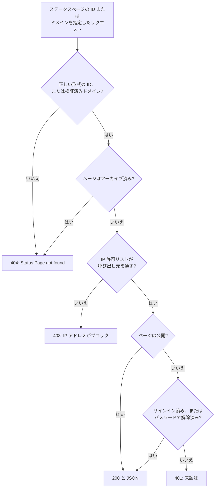

# 公開 API

すべてのステータスページは、読み取り専用の小さな JSON エンドポイント群に応答します。概要、稼働率、インシデント、エピソード、計画メンテナンスのイベント、お知らせです。これらはステータスページ自体が読み込むエンドポイントなので、訪問者が見るものとまったく同じものを返し、公開ページなら API キーは不要です。自分のアプリ、チャットボット、壁掛けディスプレイにステータスを表示するのに使えます。

:::cards
- [エンドポイント](#エンドポイント): ページが表示するものごとに 1 つのエンドポイント。
- [概要を読む](#概要を読む): 1 回のリクエストでページ全体を取得します (curl、Node.js、Python)。
- [期間を指定した稼働率](#期間を指定した稼働率): リソースとグループごとの稼働率 (最大 90 日)。
- [エラー](#エラー): 各ステータスコードの意味。
:::

## リクエストへの応答のしかた

各リクエストは、ステータスページをその ID またはカスタムドメインのいずれかで指定します。OneUptime はページを見つけ、訪問者に適用されるのと同じアクセスルールを適用して、JSON で応答します。



非公開のページは、そのページにサインインしたブラウザーか、パスワードでロックを解除したブラウザーにしか応答しません。API はページと同じセッションを読み取ります。スクリプトからは公開ページを使ってください。[ページを見られる人を制限する](/docs/status-pages/index#ページを見られる人を制限する) を参照してください。

形式は正しいものの、どのステータスページにも該当しない ID は、非公開ページと同じ経路をたどり、`401` が返されます。公開ページが `401` を返す場合は ID を確認してください。

## 始める前に

- **ステータスページの ID。** ダッシュボードでページを開きます (**ステータスページ → すべてのステータスページ** からそのページへ)。その **概要** の **ステータスページの詳細** カードに **ステータスページ ID** が表示されます。
- **ベース URL。** 以下のエンドポイントはすべて `/status-page-api` の下にあります。

| ページの稼働場所 | ベース URL |
| ------------------- | -------- |
| OneUptime Cloud | `https://oneuptime.com/status-page-api` |
| セルフホストの OneUptime | `https://<your-oneuptime-host>/status-page-api` |
| ページのカスタムドメイン | `https://status.example.com/status-page-api` |

以下のパスに `{statusPageIdOrDomain}` とある箇所には、ページの ID か、検証済みのカスタムドメイン (`status.example.com` など) のいずれかを指定できます。稼働率のエンドポイントは ID だけを受け付けます。

## エンドポイント

| エンドポイント | メソッド | 返すもの |
| -------- | ------- | ------- |
| `/overview/{statusPageIdOrDomain}` | `GET`、`POST` | 概要に表示されるすべて: 全体のステータス、リソースとグループ、進行中のインシデントとエピソード、計画メンテナンス、表示中のお知らせ、稼働率バーの元データ。 |
| `/uptime/{statusPageId}` | `POST` | 指定期間の、リソースごととグループごとの稼働率。 |
| `/incidents/{statusPageIdOrDomain}` | `GET`、`POST` | ページが一覧に載せるインシデントと、その公開メモと状態の変化。 |
| `/incidents/{statusPageIdOrDomain}/{incidentId}` | `POST` | 1 件のインシデント。 |
| `/episodes/{statusPageIdOrDomain}` | `POST` | ページが一覧に載せるインシデントのエピソード。 |
| `/episodes/{statusPageIdOrDomain}/{episodeId}` | `POST` | 1 件のエピソード。 |
| `/scheduled-maintenance-events/{statusPageIdOrDomain}` | `GET`、`POST` | ページが一覧に載せる計画メンテナンスのイベントと、その公開メモと状態の変化。 |
| `/scheduled-maintenance-events/{statusPageIdOrDomain}/{scheduledMaintenanceId}` | `POST` | 1 件の計画メンテナンスのイベント。 |
| `/announcements/{statusPageIdOrDomain}` | `GET`、`POST` | ページが一覧に載せるお知らせ。 |
| `/announcements/{statusPageIdOrDomain}/{announcementId}` | `POST` | 1 件のお知らせ。 |

エンドポイントは、**ステータスページに表示する内容** カードにあるページ自身の設定に従います ([ページに表示する内容を選ぶ](/docs/status-pages/index#ページに表示する内容を選ぶ) を参照)。

- オフにした一覧は、そのエンドポイントを拒否します。たとえば `Incidents are not enabled on this status page.` が返されます。
- 各一覧は、その **過去 … 日間を表示** の設定 (既定は 14) の分だけさかのぼります。インシデントの一覧には、まだ解決していないすべてのインシデントも含まれ、計画メンテナンスの一覧には、これから始まるイベントと進行中のイベントがすべて含まれます。
- ID を指定すると、インシデント、エピソード、イベント、お知らせは古さに関係なく返されるので、古いものへのリンクも使い続けられます。ページにまったく表示されないもの (たとえばページにないモニターのインシデント) は空の一覧として返り、エピソードの場合は `404` になります。

**ページが返すインシデント。** インシデントのエンドポイントは、ページのモニターのインシデントから、ほかのステータスページに限定されたものを除き、さらにページがそのページに限定されたインシデントだけを表示する設定なら、このページに限定されていないインシデントもすべて除いたものを返します ([対象者ごとのステータス ページ](/docs/status-pages/one-status-page-per-audience) を参照)。インシデントがどのページに限定されているかは、応答には一切含まれません。

## 概要を読む

概要は、ページ全体を 1 回で取得するリクエストです。ステータスページが描画するのと同じデータで、古くても 15 秒前のものです。

:::tabs
@tab curl
```bash
curl https://oneuptime.com/status-page-api/overview/YOUR_STATUS_PAGE_ID
```
@tab Node.js
```javascript title="status.mjs"
// Node.js 18 or later: fetch is built in. Run with `node status.mjs`.
const statusPageId = "YOUR_STATUS_PAGE_ID";

const response = await fetch(
  `https://oneuptime.com/status-page-api/overview/${statusPageId}`,
);
const body = await response.json();

if (!response.ok) {
  throw new Error(`${response.status}: ${body.error}`);
}

console.log(body.overallStatus?.name); // "Operational"
```
@tab Python
```python title="status.py"
# Python 3, standard library only. Run with `python3 status.py`.
import json
import urllib.request

STATUS_PAGE_ID = "YOUR_STATUS_PAGE_ID"
url = f"https://oneuptime.com/status-page-api/overview/{STATUS_PAGE_ID}"

with urllib.request.urlopen(url, timeout=10) as response:
    overview = json.load(response)

print((overview.get("overallStatus") or {}).get("name"))  # Operational
```
:::

全体のステータスは、ページ上のモニターとモニターグループの現在のステータスのうち最も悪いもの、つまり優先度が最も高いものです。モニターのステータスは次のようになります。

```json
{
  "_id": "cc80b385-4190-42a3-ae8b-9b391e90d79f",
  "name": "Operational",
  "color": { "_type": "Color", "value": "#2ab57d" },
  "isOperationalState": true,
  "priority": 1
}
```

### 概要が返すもの

| キー | 内容 |
| --- | ------------- |
| `overallStatus` | ページ全体のステータス。上と同じモニターのステータスで、ページに何もない場合は `null`。 |
| `statusPage` | ページの公開設定: タイトル、説明、ブランディング、表示する内容。 |
| `statusPageResources` | 各リソース: 表示名、説明、グループ、モニターまたはモニターグループ、表示オプション。 |
| `resourceGroups` | グループ。入れ子のグループには `parentStatusPageGroupId` が付きます。 |
| `monitorStatuses` | プロジェクトのすべてのモニターのステータス。優先度の低いものから高いものの順。 |
| `monitorGroupCurrentStatuses`、`monitorsInGroup` | ページ上の各モニターグループの現在のステータスと、そのグループ内のモニター。 |
| `monitorStatusTimelines`、`uptimeDailyAggregate`、`monitorGroupMergedDowntime`、`statusPageHistoryChartBarColorRules` | 稼働率バーを描く元データと、ページのバーの色ルール。 |
| `activeIncidents`、`incidentPublicNotes`、`incidentStateTimelines`、`incidentStates` | ページが表示する未解決のインシデント、その公開メモと状態の変化、そしてプロジェクトのインシデントの状態。 |
| `timelineIncidents` | 稼働率バーの期間内のインシデント (解決済みを含む)。バーのツールチップ用です。 |
| `activeEpisodes`、`episodePublicNotes`、`episodeStateTimelines` | インシデントのエピソードについての同じもの。 |
| `scheduledMaintenanceEvents`、`scheduledMaintenanceEventsPublicNotes`、`scheduledMaintenanceStateTimelines`、`scheduledMaintenanceStates` | これから始まる、または進行中の計画メンテナンスのイベントと、その公開メモと状態の変化。 |
| `activeAnnouncements` | いま表示中のお知らせ: 開始済みで、まだ終了していないもの。 |

## 期間を指定した稼働率

`POST /uptime/{statusPageId}` は、2 つの日付の間の、ページ上の各リソースとグループの稼働率を返します。どちらの日付も省略できます。

| フィールド | 既定値 | 補足 |
| ----- | ------- | ----- |
| `startDate` | 14 日前 | ISO 8601 の日時。 |
| `endDate` | 現在 | `startDate` より前にはできません。期間は最大 90 日です。 |

:::tabs
@tab curl
```bash
curl -X POST https://oneuptime.com/status-page-api/uptime/YOUR_STATUS_PAGE_ID \
  -H "Content-Type: application/json" \
  -d '{"startDate": "2026-09-01T00:00:00Z", "endDate": "2026-09-30T23:59:59Z"}'
```
@tab Node.js
```javascript title="uptime.mjs"
// Node.js 18 or later. Run with `node uptime.mjs`.
const statusPageId = "YOUR_STATUS_PAGE_ID";

const response = await fetch(
  `https://oneuptime.com/status-page-api/uptime/${statusPageId}`,
  {
    method: "POST",
    headers: { "Content-Type": "application/json" },
    body: JSON.stringify({
      startDate: "2026-09-01T00:00:00Z",
      endDate: "2026-09-30T23:59:59Z",
    }),
  },
);
const uptime = await response.json();

for (const group of uptime.groupUptimes) {
  console.log(group.statusPageGroupName, group.uptimePercent);
}
```
@tab Python
```python title="uptime.py"
# Python 3, standard library only. Run with `python3 uptime.py`.
import json
import urllib.request

STATUS_PAGE_ID = "YOUR_STATUS_PAGE_ID"

request = urllib.request.Request(
    f"https://oneuptime.com/status-page-api/uptime/{STATUS_PAGE_ID}",
    data=json.dumps(
        {"startDate": "2026-09-01T00:00:00Z", "endDate": "2026-09-30T23:59:59Z"}
    ).encode(),
    headers={"Content-Type": "application/json"},
    method="POST",
)

with urllib.request.urlopen(request, timeout=10) as response:
    uptime = json.load(response)

for group in uptime["groupUptimes"]:
    print(group["statusPageGroupName"], group["uptimePercent"])
```
:::

応答:

```json
{
  "statusPageResourceUptimes": [
    {
      "statusPageResourceId": {
        "_type": "ObjectID",
        "value": "cfffa3c3-fdf3-4cd7-9585-d6d408a14663"
      },
      "uptimePercent": 99.98,
      "statusPageResourceName": "Checkout API",
      "currentStatus": {
        "_id": "cc80b385-4190-42a3-ae8b-9b391e90d79f",
        "name": "Operational",
        "color": { "_type": "Color", "value": "#2ab57d" },
        "isOperationalState": true,
        "priority": 1
      }
    }
  ],
  "groupUptimes": [
    {
      "statusPageGroupId": {
        "_type": "ObjectID",
        "value": "df7632c4-c5c0-453c-88bf-9ee3d68d45f2"
      },
      "parentStatusPageGroupId": null,
      "uptimePercent": 99.98,
      "statusPageResourceUptimes": [
        {
          "statusPageResourceId": {
            "_type": "ObjectID",
            "value": "8175534f-aa77-456c-ad5b-b8e7b85876aa"
          },
          "uptimePercent": 99.98,
          "statusPageResourceName": "Web app",
          "currentStatus": {
            "_id": "cc80b385-4190-42a3-ae8b-9b391e90d79f",
            "name": "Operational",
            "color": { "_type": "Color", "value": "#2ab57d" },
            "isOperationalState": true,
            "priority": 1
          }
        }
      ],
      "statusPageGroupName": "Web",
      "currentStatus": {
        "_id": "cc80b385-4190-42a3-ae8b-9b391e90d79f",
        "name": "Operational",
        "color": { "_type": "Color", "value": "#2ab57d" },
        "isOperationalState": true,
        "priority": 1
      }
    }
  ],
  "startDate": "2026-09-01T00:00:00.000Z",
  "endDate": "2026-09-30T23:59:59.000Z"
}
```

| キー | 内容 |
| --- | ------------- |
| `statusPageResourceUptimes` | どのグループにも属さないリソース。訪問者がページの上部で見るものです。 |
| `groupUptimes` | グループごとに 1 件。グループの `uptimePercent` と `currentStatus` は、入れ子のグループを含め、その下のすべてのリソースを対象にします。グループの `statusPageResourceUptimes` は、そのグループの直下にあるリソースだけを列挙します。ツリーは `parentStatusPageGroupId` で組み立て直します。 |
| `uptimePercent` | リソースまたはグループ自身の精度で丸めた値。リソースやグループが稼働率を表示しない場合は `null`。 |
| `currentStatus` | リソースやグループが現在のステータスを表示しない場合は `null`。 |

モニターのステータスが、ページの **ダウンタイムとしてカウント** のステータスのいずれかである時間は、ダウンタイムとして数えられます。

## インシデント、エピソード、メンテナンス、お知らせ

一覧のエンドポイントは `POST` だけでなく `GET` にも応答します。単一項目のエンドポイントとエピソードのエンドポイントは `POST` に応答します。

:::tabs
@tab curl
```bash
# The incidents the page lists
curl https://oneuptime.com/status-page-api/incidents/YOUR_STATUS_PAGE_ID

# One scheduled maintenance event
curl -X POST https://oneuptime.com/status-page-api/scheduled-maintenance-events/YOUR_STATUS_PAGE_ID/EVENT_ID
```
@tab Node.js
```javascript title="incidents.mjs"
// Node.js 18 or later. Run with `node incidents.mjs`.
const statusPageId = "YOUR_STATUS_PAGE_ID";

const response = await fetch(
  `https://oneuptime.com/status-page-api/incidents/${statusPageId}`,
);
const { incidents } = await response.json();

for (const incident of incidents) {
  console.log(incident.title, incident.currentIncidentState?.name);
}
```
@tab Python
```python title="incidents.py"
# Python 3, standard library only. Run with `python3 incidents.py`.
import json
import urllib.request

STATUS_PAGE_ID = "YOUR_STATUS_PAGE_ID"
url = f"https://oneuptime.com/status-page-api/incidents/{STATUS_PAGE_ID}"

with urllib.request.urlopen(url, timeout=10) as response:
    incidents = json.load(response)["incidents"]

for incident in incidents:
    print(incident["title"], (incident.get("currentIncidentState") or {}).get("name"))
```
:::

| エンドポイント | 応答のキー |
| -------- | -------------------- |
| インシデント | `incidents`、`incidentPublicNotes`、`incidentStateTimelines`、`incidentStates`、`statusPageResources`、`monitorsInGroup` |
| エピソード | `episodes`、`episodePublicNotes`、`episodeStateTimelines`、`incidentStates`、`statusPageResources`、`monitorsInGroup` |
| 計画メンテナンスのイベント | `scheduledMaintenanceEvents`、`scheduledMaintenanceEventsPublicNotes`、`scheduledMaintenanceStateTimelines`、`scheduledMaintenanceStates`、`statusPageResources`、`monitorsInGroup` |
| お知らせ | `announcements`、`statusPageResources`、`monitorsInGroup` |

単一項目のリクエストは同じキーで応答し、その 1 件のレコードが入ります。

## エラー

エラーは、ステータスコードと理由を示す JSON の本文で応答します。

```json
{ "error": "You can only get uptime for 90 days. Please select a date range within 90 days." }
```

| ステータス | 発生する場合 |
| ------ | ---- |
| `400` | オフにした一覧など、ページが表示しないものを求めた場合、または稼働率の期間が 90 日を超えるか、開始より前に終わる場合。 |
| `401` | ページが非公開で、リクエストにサインイン済みのセッションもパスワードもない場合。形式は正しいもののどのステータスページにも該当しない ID にも `401` が返されます。 |
| `403` | ページの IP 許可リストに呼び出し元のアドレスが含まれていない場合。 |
| `404` | ID の形式が正しくない、一致する検証済みのカスタムドメインがない、またはページがアーカイブ済みの場合。ページが表示しないエピソードにも `404` が返されます。 |

## ステータスページを読むほかの方法

- **RSS。** すべてのステータスページは `/rss` を提供します。インシデント、お知らせ、計画メンテナンスのイベントのフィードです。[埋め込みバッジと RSS フィード](/docs/status-pages/index#埋め込みバッジと-rss-フィード) を参照してください。
- **llms.txt。** `/rss` と並んで、すべてのステータスページが `/llms.txt` を提供します。AI エージェントに RSS フィードと概要の JSON の場所を示すものです。
- **MCP。** AI エージェントは、OneUptime の MCP サーバー (`https://oneuptime.com/mcp`) を通じて、API キーなしでページを読めます。ページの ID またはドメインを `statusPageIdOrDomain` として渡します。既定でオンになっており、ページのサイドメニューの **AI → MCP** にある **MCP サーバーを有効化** でオフにできます。[MCP サーバー](/docs/ai/mcp-server) を参照してください。
- **REST API。** ステータスページ、リソース、購読者、お知らせを作成または変更するには、API キーを使って [OneUptime API](/docs/api-reference/api-reference) を使用します。

## 次のステップ

:::cards
- [ステータス ページ 概要](/docs/status-pages/index): ステータスページが表示する内容と、それを見られる人。
- [ステータス ページのリソースとグループ](/docs/status-pages/resources-and-groups): これらのエンドポイントが返すリソースとグループ。
- [対象者ごとのステータス ページ](/docs/status-pages/one-status-page-per-audience): あるページには載るインシデントが、別のページには載らない理由。
- [ステータス ページのブランディングとドメイン](/docs/status-pages/branding-and-domains): ページとこれらのエンドポイントを独自ドメインで提供します。
:::
