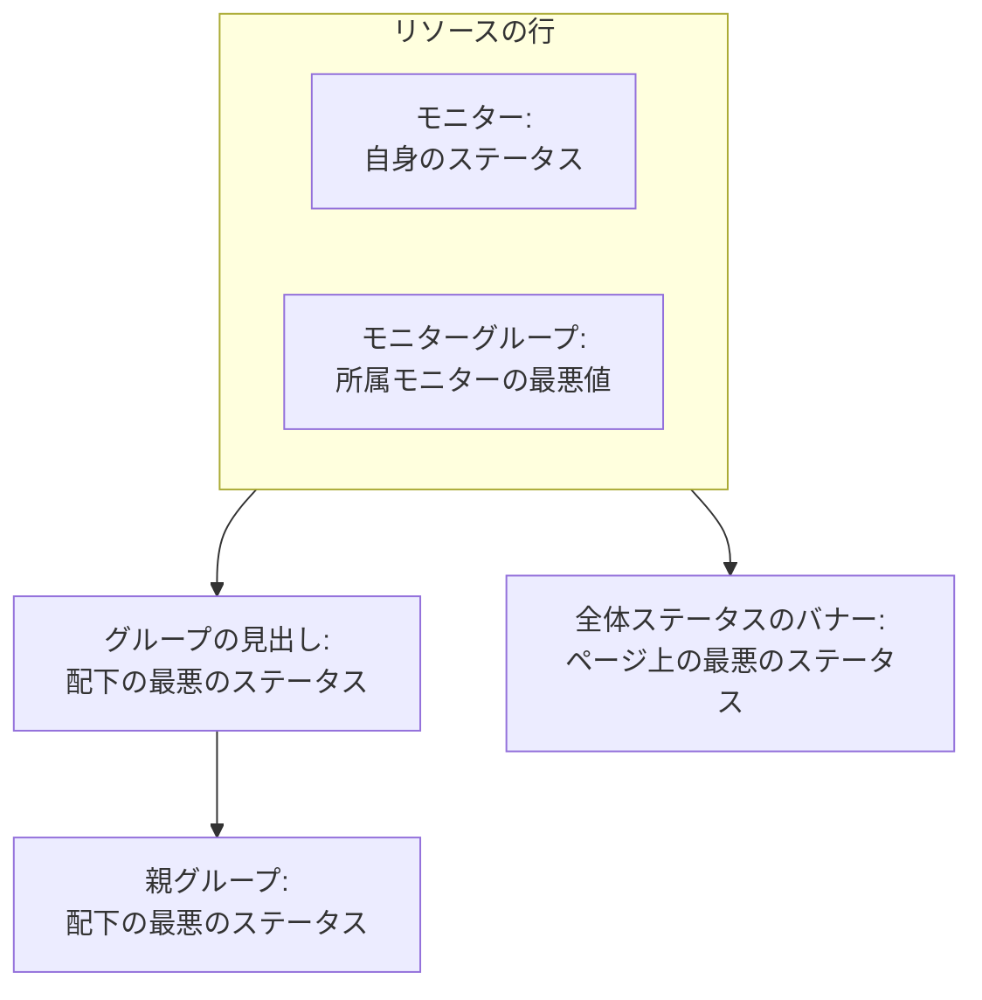

# ステータス ページのリソースとグループ

リソースは、ステータスページの 1 行です。モニターまたはモニターグループに、顧客にわかる名前、現在のステータス、必要なら稼働率と履歴を付けたものです。グループはリソースをまとめるセクションで、40 個のモニターがあるページも、終わりのない 1 つのリストではなく「API」「Web アプリ」「データパイプライン」として読めるようになります。どちらも 1 つの画面で作ります。ステータスページを開き、サイドメニューで **リソース** を選びます。

:::cards
- [モニターを追加する](#モニターを追加する): 訪問者が読む名前で、モニターをページに置きます。
- [グループ](#グループ): ページをセクションに分け、入れ子にします。
- [モニタールール](#モニタールールでモニターを自動追加する): 一致するモニターをルールに自動で追加させます。
- [CSV からグループをインポートする](#csv-からグループをインポートする): 深い階層を一度に作ります。
:::

訪問者はこれらの行を見て「自分の問題か、向こうの問題か」を判断します。そのため、顧客が製品を呼ぶときの名前を付けてください。`prod-checkout-lb-healthcheck-us-east-1` ではなく **Checkout API** です。

## ステータスがページを上っていくしくみ

各行は、そのモニターの現在のステータスを表示します。その上の各レベルは、下にあるすべてのもののうち最も悪いステータスを表示します。最も悪いステータスとは、プロジェクトのモニターステータスの中で優先度が最も高いものです。

リソースが決めるのは、行の色だけではありません。

- **アーカイブ済みのモニターは表示されません。** アーカイブ済みのモニターはもうチェックされないため、最後のステータスで止まっています。ページはその止まったステータスを最新のように見せるのではなく、その行を省きます（モニターグループのステータスからも除きます）。行は残っているので、モニターのアーカイブを解除するとすぐに戻ります。
- **ページに表示するインシデントはリソースで決まります。** インシデントのモニターのいずれかが、直接またはモニターグループ経由でページのリソースになっていると、インシデントはここに表示され、ページの購読者にも通知されます。同じモニターを複数のページに置くと、インシデントが一部のページに限定されていない限り、そのインシデントはすべてのページに届きます。[対象者ごとのステータス ページ](/docs/status-pages/one-status-page-per-audience) を参照してください。
- **モニターグループの行は、所属するすべてのモニターを表します。購読者にとっても同じです。** 購読者がリソースを選べるページでは、モニターグループを購読した人は、グループ内のどのモニターのインシデント、計画メンテナンス、お知らせについても、そのモニターを選んだのと同じように通知を受けます。[購読者とお知らせ](/docs/status-pages/subscribers#購読者にリソースとイベントタイプを選ばせる) を参照してください。

## リソース画面

この項目は、モニターグループが有効なプロジェクトでは **リソース**、それ以外では **モニター** という名前です。同じ画面です。以前はグループに専用のページがあり、古いアドレス `/groups` は今ではこの画面を開きます。

画面は 2 つに分かれています。

| 部分 | 内容 |
| ---- | ------------- |
| **グループナビゲーター**（左） | ページのすべてのグループをツリーで表示します。上に **グループを検索...** ボックス、下に `3 groups · 12 resources` のような件数があります。長いリストの最後には **M 件中さらに N 件表示** ボタンがあります。 |
| **ページの先頭** | ナビゲーターの最初の行です。グループに属さないリソースで、訪問者がすべてのグループより上に最初に目にします。グループのないページでは、右側のペインのタイトルは代わりに **すべてのリソース** になります。 |
| **リソースペイン**（右） | 選んだグループのリソース。見出しには **グループを編集**、メインの **モニターを追加** ボタン、**その他のアクション** メニューがあります。 |
| カードの見出し | **新しいグループ** と、**CSV からグループをインポート** と **更新** がある 3 点メニュー。 |

**空の状態が次にすることを教えてくれます。** 空のグループには **ここにはまだモニターがありません** と、**モニターを追加**、**まとめて追加**、そしてページにグループが 1 つもない間だけ **グループを作成** が表示されます。何も一致しない検索では **検索に一致するリソースはありません** と表示されます。

## モニターを追加する

:::steps
### 行を置く場所を選ぶ

グループナビゲーターで、リソースが属するグループを選びます。グループに属さない行にするには **ページの先頭** を選びます。

### モニターを追加 をクリックする

**Add a monitor to {group}** ダイアログが開きます。1 ページだけのダイアログです。

### モニターを選ぶ

**モニター**（プレースホルダー **モニターを選択** ）で選びます。訪問者が読むテキストである **表示名** にはモニター名が入り、自分で名前を入力するまでは別のモニターを選ぶとそれに追随します。表示名はモニター自体の名前とは別に保存されるため、ここで名前を変えても監視には何も影響しません。

### 必要なら表示オプションを設定する

**その他の項目** は折りたたまれています。中には **説明**（行の下に表示される任意の markdown。サービスが実際に何をするのかを 1 文で説明するのに向いています。中の画像はすべての訪問者に表示されます）と [表示オプション](#リソースの表示オプション) があります。閉じたままにすると、リソースにはそれらのデフォルトが使われます。

### リソースを保存する

**モニターを追加** をクリックします。行がグループとステータスページに表示されます。
:::

グリッドのグループでは、ダイアログは **その他の項目** の上で、モニターを置く行と列も尋ねます。[リストレイアウトとグリッドレイアウト](#リストレイアウトとグリッドレイアウト) を参照してください。

> [!TIP]
> 複数のチェックを 1 行で表示するには、モニターグループを追加します。**モニターグループ** のスイッチがオン（**プロジェクト設定** > **詳細** > **機能フラグ**。切り替えるとすぐ保存されます）のとき、ドロップダウンの下に **代わりにモニターグループを追加してください。** というリンクが表示されます。クリックすると **モニター** が **モニターグループ**（**モニターグループを選択** ）に変わり、**代わりにモニターを追加してください。** で元に戻ります。

### まとめて追加する

**まとめて追加**（**その他のアクション** メニューの **複数のモニターを追加** も同じ）は **複数のモニターを追加** を開きます。こちらも 1 ページで、**モニター** の複数選択と、同じく折りたたまれた **その他の項目** があり、その表示オプションは選んだすべてのモニターに適用されます。各リソースの表示名と説明はモニターから取られ、**モニターを追加** ですべて追加されます。新しいページを用意する最も速い方法です。

複数選択には **ラベル** タブがあります。ラベルをクリックすると、そのラベルを持つすべてのモニターが一度に選ばれます。

### 同じラベルで 2 回追加しても安全

ステータスページにモニターが載るのは 1 回だけです。追加はべき等なので、いくつかの新しいモニターにラベルを付けたあとに同じラベルを再び選んでも、追加されるのは新しいモニターだけです。すでにページにあるモニターは、付けた表示名やオプションのまま、まったく変わりません。

まとめて追加の最後の概要にもそう表示されます。追加されたモニターは **追加済み** の下に、すでにあったモニターは **Already Added** の下に並びます。失敗として報告されるものはなく、それらについては何も書き込まれません。

同じルールは、リソースが作成されるあらゆる場所に当てはまります。1 件ずつの追加フォームからすでにページにあるモニターを追加したり、編集フォームから既存のリソースをそのモニターに向けたりすると、*"This monitor is already added to this status page"* で拒否されます。既存のリソースが別のグループにある場合も同じです。訪問者にはモニターが 2 回見えてしまうからです。モニターを別のグループに表示するには、すでにあるリソースを削除し、表示したい場所に追加します。

## リソースの表示オプション

**その他の項目** セクションは、1 件ずつの追加フォームとまとめて追加のダイアログで同じです。どちらでも最初は折りたたまれていて、**リソースを編集** でも同じです。そこでは、折りたたまれた見出しに、デフォルトから変わっている項目が表示されます。ここの設定はすべてリソースごとです。同じグループの 2 つの行を別々に設定できます。

| 項目 | デフォルト | 役割 |
| ----- | ------- | ------------ |
| **ツールチップ**（`displayTooltip`） | 空 | ステータスページのリソースの横にツールチップとして表示されます。「米国と EU のお客様」のように範囲を示すのに使います。 |
| **現在のリソースステータスを表示**（`showCurrentStatus`） | オン | 稼働中、低下、オフラインなどの現在のステータスを行の横に表示します。 |
| **稼働率を表示**（`showUptimePercent`） | オフ | リソースの横に稼働率を表示します。 |
| **稼働率の精度を選択**（`uptimePercentPrecision`） | 小数点以下 1 桁 | **稼働率を表示** がオンのときに表示され、その場合は必須です。 |
| **ステータス履歴チャートを表示**（`showStatusHistoryChart`） | オン | リソースの稼働率履歴を日ごとのバーで表示します。 |

**表示名**（`displayName`）と **説明**（`displayDescription`）も表示専用です。モニター自体は変わりません。

## 稼働率と履歴チャート

**稼働率を表示** と **ステータス履歴チャートを表示** は、どちらもページ全体の 1 つの設定を読みます。対象とする日数です。それは **ステータスページ → 対象のページ → 詳細 → 詳細設定** の **ステータスページに表示する内容** カードにある **稼働率履歴** です。1 日から 90 日まで指定でき、デフォルトは 90 日です。つまり、スイッチはリソースごとにオンにし、期間はページ全体で一度だけ設定します。

**精度は判断の問題です。** **稼働率の精度を選択** には `99% (No Decimal)`、`99.9% (One Decimal)`、`99.99% (Two Decimal)`、`99.999% (Three Decimal)` があります。桁が多いほど正確に見え、3 桁目について議論を招きます。スリーナインの SLA を公開しているなら、それに合わせ、それ以上にはしないでください。

グループにもこれらのスイッチの独自のコピーがあるため（下記参照）、グループで集計した稼働率を表示しつつ、中のモニターでは表示しない、またはその逆もできます。

履歴チャートのバーの色は **ブランディング** ページの **その他の設定** で、どのモニターステータスを「ダウン」として数えるかは **詳細設定** の **ステータスページに表示する内容** カードにある **ダウンタイムとしてカウント** で設定します。どちらも [ステータス ページのブランディングとドメイン](/docs/status-pages/branding-and-domains) で説明しています。

## グループ

ほとんどのグループは名前だけで十分です。

:::steps
### 新しいグループ をクリックする

**新しいステータスページグループを作成** が開きます。2 つの項目と、折りたたまれた 2 つのセクションがあります。

### グループに名前を付ける

**グループ名** を入力します。訪問者が見るセクションの見出しです。

### 別のグループに属するなら入れ子にする

**親グループ** を選ぶか、**親グループなし（最上位）** のままにします。グループのメニューの **サブグループを追加** を使うと、ここが自動で入力されます。

### グループを作成する

**ステータスページグループを作成** をクリックします。グループがナビゲーターに表示され、モニターを入れられる状態になります。
:::

2 つの項目は **グループ名**（`name`）と **親グループ**（`parentStatusPageGroupId`）です。折りたたまれた 2 つのセクションに残りのすべてがあります。

- **レイアウト**: 折りたたまれた見出しに **リスト** または **グリッド** と表示されます。**表示モード** とグリッドの軸（[リストレイアウトとグリッドレイアウト](#リストレイアウトとグリッドレイアウト) を参照）があり、グリッドのグループでは自動で開きます。
- **その他の項目**: リソースのオプションのグループ版です。
  - **グループの説明**（`description`）: 見出しの下に表示される任意の markdown。中の画像はすべての訪問者に表示されます。
  - **デフォルトでステータスページに展開する**（`isExpandedByDefault`）: デフォルトはオン。訪問者に対してセクションを開いた状態で始めるか、折りたたんだ状態で始めるかを決めます。
  - **現在のグループステータスを表示**（`showCurrentStatus`）: デフォルトはオン。グループの見出しの横にステータスを表示します。
  - **稼働率を表示**（`showUptimePercent`）: デフォルトはオフ。オンにすると **稼働率の精度を選択** が表示されます。

グループを変更するには、ペインの見出しの **グループを編集** か、ナビゲーターの行メニューの **グループを編集** を使います。**ステータスページグループを編集** が開き、**変更を保存** ボタンがあります。ペインの見出しには、オンになっている設定（**グリッド**、**デフォルトで折りたたむ**、**稼働率 %** ）がチップとして表示されるため、フォームを開かなくてもグループの設定がわかります。

### グループを管理する

| 場所 | 操作 |
| ----- | ------- |
| ナビゲーターの行メニュー | **グループを編集**、**上へ移動**、**下へ移動**、**ID を表示**、**グループを削除** |
| ペインの **その他のアクション** メニュー | **このグループを編集**、**サブグループを追加**、**グループを上へ移動**、**グループを下へ移動**、**グループ ID を表示**、**更新**、**このグループを削除** |

名前なしで保存したグループは **無題のグループ** と表示されます。何か入力するつもりだったというよいサインです。

## グループを入れ子にする

グループは入れ子にできます。子グループで **親グループ** を設定するか、ナビゲーターで **このグループ内にサブグループを追加** を使います。フォームのヘルプテキストは、想定している構造（事業部門 › 地域 › 市場のようなもの）を説明しており、各レベルは配下のすべてのステータスと稼働率をまとめて表示します。

グループに子がある場合、リソースペインには各子グループに直接移動できる **サブグループ** のチップが並ぶため、ナビゲーターに戻らずに階層をたどれます。

入れ子が役立つのは大きなページです。製品の中に地域があるホスティング事業者や、事業部門の中に市場がある小売業者などです。モニターが 12 個のページなら、平らな 1 レベルのほうが親切です。

## リストレイアウトとグリッドレイアウト

グループフォームの **レイアウト** セクションでグループの **表示モード**（`viewMode`）を設定し、ステータスページでのグループの表示方法を変えます。

| したいこと | 選ぶもの |
| --------------- | ---- |
| サービスをシンプルな縦のリストで 1 行に 1 つ表示する | **リスト**（デフォルト） |
| 同じサービスを複数の地域やテナントにわたってマトリックスで表示する | **グリッド** |

**グリッド** を選ぶと、さらに 4 つの項目が表示されます。

| 項目 | 入力する内容 |
| ----- | ------------- |
| **行軸ラベル** | 行の次元の名前。プレースホルダーは `Service`。 |
| **行軸の値** | 行。**Add Row** で 1 つずつ追加します（プレースホルダーは `e.g. Auth`）。 |
| **列軸のラベル** | 列の次元。プレースホルダーは `Region`。 |
| **列軸の値** | 列。**Add Column** で追加します（プレースホルダーは `e.g. US-East`）。 |

グリッドのグループの各モニターはセルに入るため、**モニターを追加** とまとめて追加のダイアログは、モニターと一緒に行と列を、あなたの軸ラベルを使って尋ねます。

> [!IMPORTANT]
> モニターを追加する前に軸を設定してください。行も列もないグリッドのグループには、モニターを置く場所がまだないという通知と、グループのフォームを **レイアウト** セクションで開く **グリッドをセットアップ** ボタンが表示され、設定するまでそのグループの **モニターを追加** ボタンは表示されません。

## 訪問者に見せる順序

順序はアルファベット順ではなく、あなたが決めます。

| 対象 | 並べ替え方 |
| ---- | ----------------- |
| グループ内のリソース | 行をドラッグします。ペインにも **行をドラッグして、訪問者に表示される順序を変更します** と表示されます。 |
| グループ同士 | ナビゲーターの行メニューの **上へ移動** / **下へ移動**、または **その他のアクション** の **グループを上へ移動** / **グループを下へ移動**。 |
| グループに属さないリソース | **ページの先頭** にあり、常にすべてのグループより上に表示されます。誰もが最初に確認するものをここに置きます。 |

**ドラッグできない 2 つのケース。** **Search in {group}...** ボックスで検索すると並べ替えはオフになります（ペインに `N of M shown · drag to reorder is off while filtering` と表示されます）。まず検索をクリアしてください。また、グリッドのグループはドラッグでは並べ替えられません。モニターの位置は行と列で決まるからです。

最もよく問い合わせのあるサービスを一番上に置いてください。障害中にページに来た訪問者は、たいてい最初の画面で読むのをやめます。

## モニタールールでモニターを自動追加する

モニタールールは、モニターをページに自動で追加します。モニターを一度記述すれば、一致するすべてのモニターが選んだグループに入ります。ルールは、リソース画面の隣の **リソース → モニタールール** にあります。

:::steps
### モニタールール を開く

ステータスページを開き、サイドメニューの **リソース** セクションで **モニタールール** を選び、**ステータスページのモニタールールを作成** をクリックします。

### ルールに名前を付ける

**基本情報** で **名前** を入力します。**有効** はデフォルトでオンです。

### 一致させるモニターを指定する

**一致条件** で、**モニターラベル**（いずれかのラベルを持つモニターが一致）、**モニター名**、**モニターの説明** の少なくとも 1 つを入力します。モニターは、入力したすべての条件を満たす必要があります。2 つのパターンには、大文字と小文字を区別しない正規表現（`^api-.*`）またはワイルドカード `*`（`*checkout*`）を使えます。`.*` はすべてのモニターに一致します。

### グループを選ぶ

**グループ** で **モニターをグループに追加** を選ぶか、空のままにしてモニターをグループなしで追加します。続いてリソースと同じ表示オプションがあります。ルールでは **稼働率を表示** が最初からオンです。

### ルールを保存する

ルールはすぐに既存のすべてのモニターに対して実行され、リストの **モニターの追加先** に、モニターを追加するグループが表示されます。
:::

その後は、モニターが作成されたとき、またはラベル、名前、説明が変わったときに、そのモニターに対してルールが再び実行されます。ルールが削除するのは自分が追加したリソースだけです。ルールをオフにしたり削除したりするとそれらはページから外れますが、手動で追加したモニターには一切触れません。すでにページにあるモニターが 2 回追加されることはありません。

## CSV からグループをインポートする

深い階層を手作業で作るのは面倒です。カードの見出しの 3 点メニューにある **CSV からグループをインポート** で、**CSV からグループをインポート** ダイアログが開きます。

:::steps
### テンプレートをダウンロードする

**CSV テンプレートをダウンロード** をクリックして `status-page-groups-template.csv` を取得します。

### 記入する

1 行に 1 グループです。必須は `name` だけで、列は下に一覧しています。

### アップロードしてプレビューする

**CSV ファイルを選択** をクリックしてファイルを選び、**インポートをプレビュー** で、何かが書き込まれる前に作成される内容を確認します。

### インポートする

インポートを実行します。**インポート結果** の表に、すべての行が理由とともに **作成日時**、**失敗**、**スキップ済み** として表示されるため、問題のある行が黙って消えることはありません。
:::

| 列 | 設定するもの |
| ------ | ------------ |
| `name` | グループ名。必須。 |
| `parentName` | このグループを入れ子にするグループの名前。 |
| `description` | グループの説明。 |
| `isExpandedByDefault` | 訪問者に対してセクションを開いた状態で始めるかどうか。 |
| `showCurrentStatus` | グループの見出しの横にステータスを表示するかどうか。 |
| `showUptimePercent` | グループの横に稼働率を表示するかどうか。 |
| `uptimePercentPrecision` | その稼働率の小数点以下の桁数。 |
| `viewMode` | `List` または `Grid`。 |
| `rowAxisLabel` | グリッドのグループの行の次元の名前。 |
| `rowAxisValues` | グリッドのグループの行の値。 |
| `columnAxisLabel` | グリッドのグループの列の次元の名前。 |
| `columnAxisValues` | グリッドのグループの列の値。 |

インポートで作成されるのはグループで、リソースではありません。そのあと **モニターを追加**、**まとめて追加**、またはモニタールールでモニターを追加します。

## トラブルシューティング

:::details "This monitor is already added to this status page"
ページには、グループをまたいでも各モニターが 1 回だけ載ります。そのモニターにはすでにリソースがあり、別のグループにあるか、モニタールールで追加されたのかもしれません。ナビゲーターで検索してそのリソースを削除し、表示したい場所にモニターを追加してください。
:::

:::details 追加したモニターがステータスページに表示されない
モニターがアーカイブされていないか確認してください。アーカイブ済みのモニターの行は、アーカイブを解除するまで省かれます。グループも確認してください。折りたたんだ状態で始まるように設定されたグループ（**デフォルトでステータスページに展開する** がオフ）は、訪問者が開くまで行を隠します。
:::

:::details グリッドのグループに モニターを追加 ボタンがない
グリッドにまだ行も列もありません。**グリッドをセットアップ** をクリックし、**レイアウト** セクションで軸の値を追加すると、**モニターを追加** が戻ります。
:::

:::details 行をドラッグできない
**Search in {group}...** ボックスをクリアしてください。ペインが絞り込まれている間は並べ替えがオフです。グリッドのグループはドラッグでは並べ替えられません。
:::

## 次のステップ

:::cards
- [ステータス ページのブランディングとドメイン](/docs/status-pages/branding-and-domains): ロゴ、ファビコン、履歴チャートの色、独自ドメイン。
- [購読者とお知らせ](/docs/status-pages/subscribers): これらのリソースが変化したときに誰に通知されるか。
- [対象者ごとのステータス ページ](/docs/status-pages/one-status-page-per-audience): 多くのページに同じモニターを置き、一部のページにだけ届くインシデントを作る。
- [公開 API](/docs/status-pages/public-api): リソース、グループ、稼働率を JSON で読み取ります。
:::
