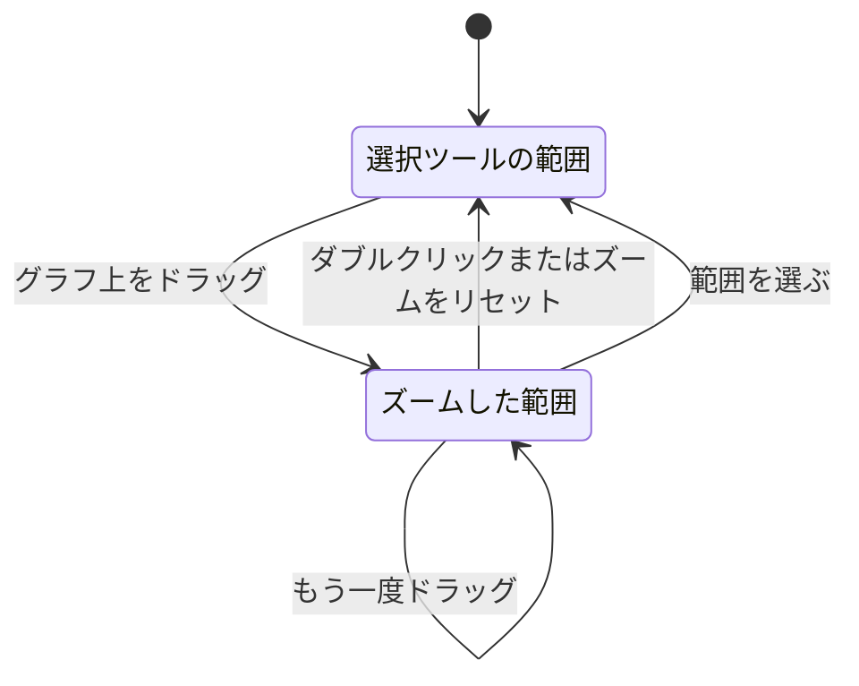

# 時間範囲にズームインする

グラフの上をドラッグするとページ全体がその瞬間にズームし、ダブルクリックすると元に戻ります。このページでは、操作方法、ズームの動作、どのグラフが何をズームするかを説明します。

:::cards
- [ズームインと元に戻す操作](#ズームインと元に戻す操作): 2 つの操作と、ズームをリセットするボタン。
- [ズームの動作](#ズームの動作): 入れ子のズーム、自動更新、クリックとドラッグ。
- [使える場所](#使える場所): ドラッグで時間範囲が変わるページとグラフ。
- [ズームしないグラフ](#ズームしないグラフ): ストリップ、ゲージ、スパークライン。
:::

## ズームインと元に戻す操作

OneUptime の時系列グラフは、どれも時間範囲の選択ツールを兼ねています。グラフに気になるスパイクがあれば、選択ツールを開いて日付を入力する必要はありません。

:::steps
1. 任意のグラフで **スパイクの上をドラッグします**。ページの時間範囲が、ドラッグした範囲に切り替わります。時間範囲の選択ツールで選んだときとまったく同じです。ページの時間範囲から計算されるすべてのグラフ、タイル、表がその範囲で再取得されるので、すべてで同じ瞬間を確認できます。
2. 元に戻すには **任意のグラフをダブルクリックします**。ページはズームを始める前の時間範囲に戻ります。
:::

現在の状態を表示するパネルは、自分で範囲を選んだときと同じく「現在」のままです。インベントリの件数、ヘルス、リソースを最も消費しているもの、最近の警告、未解決のインシデントとアラート、ダッシュボードのライブリストがこれにあたります。

ズーム中は、ページの時間範囲の選択ツールの横に **ズームをリセット** ボタンが表示されます。ダブルクリックと同じ働きをし、キーボードやタッチスクリーンで元に戻すための手段です。

## ズームの動作

- **好きなだけ深くズームでき、1 回のリセットで一番外まで戻ります。** 「過去 1 時間」から 10 分、さらに 1 分へと絞り込んだあとでも、1 回のダブルクリック (または **ズームをリセット**) で 1 段階ずつではなく 1 時間全体に戻ります。
- **どのグラフでも、どのズームでもリセットできます。** CPU のグラフでドラッグし、メモリのグラフでダブルクリックしてもかまいません。ズームしているのはグラフではなくページです。
- **自分で範囲を選ぶと、やり直しになります。** 選択ツールでプリセットやカスタム範囲を選ぶと新しい起点になり、ズームは終了して **ズームをリセット** は消えます。
- **ズームした範囲は固定です。** 「過去 30 分」は時計とともに進みますが、ズームは固定の範囲なので、自動更新がオンでも進みません。再び進めるにはズームをリセットしてください。
- **ズームが現在時刻を越えることはありません。** グラフの最新のバケットは通常まだ埋まっている途中です。そこで終わるドラッグは現在時刻で切り取られます。
- **マウスはグラフの外で離してもかまいません**。ドラッグは有効です。
- **元に戻すのに、グラフの読み込みを待つ必要はありません。** ズームした直後、グラフがまだドラッグした範囲を取得している間や、その範囲が空だったときでも、グラフをダブルクリックすればすぐにズームがリセットされます。
- **ズームしていないページでのダブルクリックは何もしません。**

### クリックとドラッグ

- **折れ線、面、棒グラフでは、単なるクリックはズームになりません。** ほとんどのグラフがこれにあたります。メトリクスカードとメトリクスエクスプローラー、リソースの概要、SLO、モニター、ダッシュボード上のすべてのグラフです。ズームするのは複数のバケットにまたがるドラッグだけなので、点、棒、凡例項目のクリックはこれまでどおりに動作します。ズーム中は、グラフの描画領域でのクリックが少し遅れて反映されます。リセットのためのダブルクリックと区別するためです。ログの Insights のエラーパターンのタイムラインと、例外の Occurrence Trend も、ドラッグでしかズームしません。
- **エクスプローラーのボリュームグラフでは、棒を 1 本クリックするとその棒にズームします。** ログ、トレース、例外、セキュリティイベントの各エクスプローラーのボリュームグラフと、ログとトレースの分析グラフは、ドラッグした範囲の棒、またはクリックした 1 本の棒にズームします。これらのグラフには **クリックまたはドラッグで拡大** と表示されます。

### グラフ上のヒント

ズームできるグラフの多くは、描画領域の上に操作方法を表示します。**ドラッグで拡大** または **クリックまたはドラッグで拡大** です。ズーム中は **ダブルクリックでリセット** という案内も加わります。メトリクスカード、メトリクスエクスプローラー、エクスプローラーのボリュームグラフは常にヒントを表示します。リソースの概要や SLO のグラフカード、一部のダッシュボードウィジェットでは、カードにポインターを合わせたときや Tab キーでフォーカスしたときだけ表示されます。

## 使える場所

ズームすると、次の場所ではページ全体の時間範囲が変わります。

- リソースの概要とその Insights ページ: Kubernetes クラスター、Docker、Podman、Docker Swarm のホスト、ホストとそのプロセス、サービスと systemd ユニット、VMware、Proxmox、Ceph、ストレージアレイ、データベース、クラウドリソース、サーバーレス関数
- サービスと RUM アプリケーション
- ネットワークデバイスのメトリクスとトラフィック
- メトリクスカード (リソースのメトリクスタブやモニターのメトリクスを含む)
- メトリクスエクスプローラー
- SLO の履歴グラフ
- ログの Insights。エラーパターンの「発生時刻」タイムラインも含みます。そのパネルはページの選択ツールを覆うため、独自の **ズームをリセット** を持っています
- ログ、トレース、例外、セキュリティイベントのボリュームグラフと、ログとトレースの分析グラフ。これらは属しているエクスプローラーの時間範囲を変えます
- [ダッシュボード](/docs/dashboards/authoring)。ドラッグするとダッシュボード全体の時間範囲が変わります

独自の範囲を持つグラフは、その範囲だけをズームし、ページ上のほかのものは一切変えません。モニターのフォームにあるメトリクスのプレビュー (モニターは自身のローリングウィンドウで評価を続けます)、例外の Occurrence Trend、ポップアップや調査パネルで開いたグラフ、AI チャットの回答に含まれるグラフがこれにあたります。それらをダブルクリックするか、その **ズームをリセット** ボタンを押すと、元の範囲に戻ります。

インシデント、アラート、エピソードのページにあるテレメトリのスナップショットも、独自の範囲を持ちます。そのグラフ (メトリクスのグラフ、またはスナップショットが表示している場合はログ、トレース、例外のボリュームグラフ) をドラッグするとスナップショット全体がズームし、メトリクス、ログ、トレース、例外の各タブがドラッグした区間を表示します。スナップショットのバッジの横にある **ズームをリセット** か、そのグラフのダブルクリックで、スナップショットの範囲が元に戻ります。

## ズームしないグラフ

一部の可視化は、ドラッグできる時間軸がない、ドラッグするには小さすぎる、または常に独自の固定範囲を表示するため、ズームしません。

- 稼働履歴のストリップ (1 日 1 本の棒)。1 日より細かい単位は表示できません
- 割合や比率のバー、ゲージ、プログレスバー
- フレームグラフ、サービスマップ、フロー図
- メトリクス一覧の小さなトレンドのスパークライン。クリックするとメトリクスが開くので、開いてズームできるグラフを表示してください
- 独自の固定範囲を持つ小さなスパークライン。たとえばネットワークデバイスの過去 1 時間の往復時間です。その **メトリクスを開く** リンクから、ズームできるグラフに移動できます

## 次のステップ

:::cards
- [ダッシュボードを作成する](/docs/dashboards/authoring): ズームはダッシュボードのすべてのグラフで使えます。
- [検索構文](/docs/telemetry/search-syntax): 瞬間を見つけたら、エクスプローラーを絞り込みます。
- [メトリクス モニター](/docs/monitor/metrics-monitor): 見ていたメトリクスでアラートを出します。
:::
