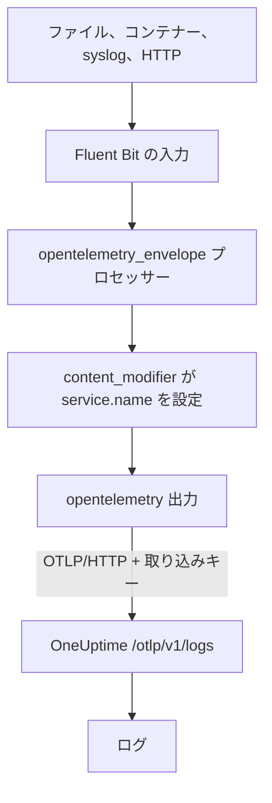

# Fluent Bit

[Fluent Bit](https://docs.fluentbit.io/manual) は、ファイル、systemd、コンテナー、syslog、HTTP など多くのソースからログを集める軽量なエージェントです。その [OpenTelemetry 出力](https://docs.fluentbit.io/manual/pipeline/outputs/opentelemetry) が集めたデータを OneUptime の OpenTelemetry (OTLP) エンドポイントに送り、ログは **製品 → ログ** で検索できるようになります。

:::cards
- [Fluent Bit を構成する](#fluent-bit-を構成する): OpenTelemetry 出力を追加し、サービスに名前を付けます。
- [完全な例](#完全な例): そのまま使い始められる構成ファイル全体。
- [セルフホストの OneUptime](#セルフホストの-oneuptime): Fluent Bit を自分のインスタンスに向けます。
:::

## 仕組み



Fluent Bit は各レコードを OpenTelemetry のエンベロープで包み、`service.name` のようなリソース属性を持てるようにします。次に OpenTelemetry 出力が、`x-oneuptime-token` ヘッダーに取り込みキーを入れて、レコードを OneUptime に送ります。OneUptime はそれらを `service.name` が示すサービスに保存し、最初に送信されたときにそのサービスを作成します。

## 始める前に

- **Fluent Bit をインストールする**: [インストールガイド](https://docs.fluentbit.io/manual/installation/getting-started-with-fluent-bit) を参照してください。このページの構成は Fluent Bit の YAML 形式と `opentelemetry_envelope` プロセッサーを使うので、最新のリリースを使ってください。
- **OneUptime プロジェクト。** OneUptime Cloud では、テレメトリは取り込んだ GB 単位で課金されます ([料金](https://oneuptime.com/pricing) を参照)。また Free プランのプロジェクトは、テレメトリを送る前に支払い方法を登録する必要があります。
- **テレメトリ取り込みキー。** まだない場合は次の手順で作成します。

:::steps
### 取り込みキーを開く

**製品 → プロジェクト設定** に移動し、サイドメニューで **テレメトリと APM** を開いて **取り込みキー** を選びます。


### キーを作成する

**取り込みキーを作成** をクリックします。ダイアログにはキーの名前が入力済みで、**サーバー** (アプリケーションや Collector が送信に使う種類のキー) が選ばれているので、そのまま **取り込みキーを作成** をクリックして作成するか、先に名前を変更します。

### シークレットをコピーする

新しいキーは専用のページで開きます。その **シークレットキー** をコピーしてください。これが下の構成の `YOUR_TELEMETRY_INGESTION_TOKEN` です。


:::

## Fluent Bit を構成する

Fluent Bit は、`/etc/fluent-bit/fluent-bit.yaml` などのファイルから YAML の構成を読み込みます。

:::steps
### OpenTelemetry 出力を追加する

OneUptime に送る `opentelemetry` 出力を追加します。レコードを手元で確認したい場合は、テストの間 `stdout` 出力を残しておきます。

```yaml title="fluent-bit.yaml"
pipeline:
  outputs:
    - name: stdout
      match: "*"
    - name: opentelemetry
      match: "*"
      host: "oneuptime.com"
      port: 443
      metrics_uri: "/otlp/v1/metrics"
      logs_uri: "/otlp/v1/logs"
      traces_uri: "/otlp/v1/traces"
      tls: On
      header:
        - x-oneuptime-token YOUR_TELEMETRY_INGESTION_TOKEN
```

### ログを OpenTelemetry のエンベロープで包み、サービスに名前を付ける

各入力に `opentelemetry_envelope` プロセッサーを追加し、その後に `service.name` を設定する `content_modifier` を続けます。`YOUR_SERVICE_NAME` は、OneUptime でログを表示したい名前に置き換えます。

```yaml title="fluent-bit.yaml"
pipeline:
  inputs:
    - name: tail # or any other input
      path: /var/log/my-app/*.log

      processors:
        logs:
          - name: opentelemetry_envelope

          - name: content_modifier
            context: otel_resource_attributes
            action: upsert
            key: service.name
            value: YOUR_SERVICE_NAME
```

### Fluent Bit を再起動する

Fluent Bit サービスを再起動するか、`fluent-bit -c /etc/fluent-bit/fluent-bit.yaml` で起動します。数秒後にはログが **製品 → ログ** に表示され、サービスが **製品 → サービス** に並びます。
:::

## 完全な例

この構成は、ポート `8888` で HTTP 経由のログを受け取り、OneUptime に転送します。

```yaml title="fluent-bit.yaml"
service:
  flush: 1
  log_level: info

pipeline:
  inputs:
    - name: http
      listen: 0.0.0.0
      port: 8888

      processors:
        logs:
          - name: opentelemetry_envelope

          - name: content_modifier
            context: otel_resource_attributes
            action: upsert
            key: service.name
            value: YOUR_SERVICE_NAME

  outputs:
    - name: stdout
      match: "*"
    - name: opentelemetry
      match: "*"
      host: "oneuptime.com"
      port: 443
      metrics_uri: "/otlp/v1/metrics"
      logs_uri: "/otlp/v1/logs"
      traces_uri: "/otlp/v1/traces"
      tls: On
      header:
        - x-oneuptime-token YOUR_TELEMETRY_INGESTION_TOKEN
```

`http` 入力は必要な入力に置き換えてください (たとえばログファイルなら `tail`、ジャーナルなら `systemd`)。どの入力にも 2 つのプロセッサーを残します。

## セルフホストの OneUptime

`host` を OneUptime インスタンスのホストに設定します。HTTPS ではなく通常の HTTP で提供している場合は、`port` も待ち受けポート (通常は `80`) に設定し、`tls` を削除します。

```yaml title="fluent-bit.yaml"
pipeline:
  outputs:
    - name: stdout
      match: "*"
    - name: opentelemetry
      match: "*"
      host: "your-oneuptime-instance.com"
      port: 80
      metrics_uri: "/otlp/v1/metrics"
      logs_uri: "/otlp/v1/logs"
      traces_uri: "/otlp/v1/traces"
      header:
        - x-oneuptime-token YOUR_TELEMETRY_INGESTION_TOKEN
```

## トラブルシューティング

:::details Fluent Bit が OpenTelemetry 出力から `401` を記録する
取り込みキーがない、不明、または期限切れです。`header` の行を確認してください。`x-oneuptime-token`、空白 1 つ、そしてキーの **シークレットキー** の順です。
:::

:::details Fluent Bit が `402` または `422` を記録する
`402`: OneUptime Cloud で、プロジェクトが Free プランで支払い方法がありません。**プロジェクト設定 → 請求と請求書 → 請求** で追加してください。`422`: キーが無効化されているか、ブラウザーキーです。キーの設定で **有効** をオンに戻すか、**サーバー** キーを作成してください。
:::

:::details ログが想定外のサービスで届く
サービスは `service.name` で決まります。すべての入力に `opentelemetry_envelope` プロセッサーがあり、その後にそれを設定する `content_modifier` が続いていることを確認してください。
:::

:::details 何も届かず、Fluent Bit が接続エラーを記録する
HTTPS エンドポイントに対して `tls: On` と `port: 443` が設定されていること、そして Fluent Bit を実行しているホストからそのポートで OneUptime のホストに到達できることを確認してください。
:::

構成についてご質問やサポートが必要な場合は、support@oneuptime.com までご連絡ください。

## 次のステップ

:::cards
- [ログパイプライン](/docs/telemetry/log-pipelines): Fluent Bit が送るログを解析し、情報を付け加えます。
- [検索構文](/docs/telemetry/search-syntax): ログのエクスプローラーでログを探します。
- [OpenTelemetry](/docs/telemetry/open-telemetry): すべてのテレメトリのエンドポイント、キー、制限。
- [Fluentd](/docs/telemetry/fluentd): 代わりに Fluentd を使います。
:::
