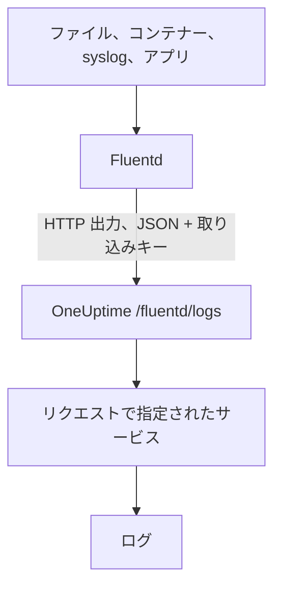

# Fluentd

[Fluentd](https://www.fluentd.org/) は、ファイル、コンテナー、syslog、アプリケーションなど [多くのソース](https://www.fluentd.org/datasources) からログを集めます。組み込みの [HTTP 出力](https://docs.fluentd.org/output/http) がそれらを OneUptime の Fluentd エンドポイントに送り、ログは **製品 → ログ** で検索できるようになります。

:::cards
- [Fluentd を構成する](#fluentd-を構成する): OneUptime を指す HTTP 出力を追加します。
- [レコードの読み取り方](#レコードの読み取り方): どのフィールドがメッセージ、重大度、属性になるか。
- [セルフホストの OneUptime](#セルフホストの-oneuptime): Fluentd を自分のインスタンスに向けます。
:::

## 仕組み



Fluentd はレコードを JSON でまとめて送ります。取り込みキーは `x-oneuptime-token` ヘッダーに、サービス名は `x-oneuptime-service-name` に入れます。OneUptime は各レコードをそのサービスのログにし、最初に送信されたときにサービスを作成します。

## 始める前に

- **Fluentd をインストールする**: [インストールガイド](https://docs.fluentd.org/installation) を参照してください。
- **OneUptime プロジェクト。** OneUptime Cloud では、テレメトリは取り込んだ GB 単位で課金されます ([料金](https://oneuptime.com/pricing) を参照)。また Free プランのプロジェクトは、テレメトリを送る前に支払い方法を登録する必要があります。
- **テレメトリ取り込みキー。** まだない場合は次の手順で作成します。

:::steps
### 取り込みキーを開く

**製品 → プロジェクト設定** に移動し、サイドメニューで **テレメトリと APM** を開いて **取り込みキー** を選びます。


### キーを作成する

**取り込みキーを作成** をクリックします。ダイアログにはキーの名前が入力済みで、**サーバー** (アプリケーションや Collector が送信に使う種類のキー) が選ばれているので、そのまま **取り込みキーを作成** をクリックして作成するか、先に名前を変更します。

### シークレットをコピーする

新しいキーは専用のページで開きます。その **シークレットキー** をコピーしてください。これが下の構成の `YOUR_SERVICE_TOKEN` です。


:::

## Fluentd を構成する

Fluentd の構成ファイルは通常 `/etc/fluent/fluentd.conf` です。古い td-agent パッケージでは `/etc/td-agent/td-agent.conf` です。

:::steps
### HTTP 出力を追加する

レコードを OneUptime に送る `<match>` セクションを追加します。`YOUR_SERVICE_TOKEN` は取り込みキーに、`YOUR_SERVICE_NAME` はログを表示したい名前 (どんな名前でもかまいません) に置き換えます。

```text title="fluentd.conf"
# Match all patterns
<match **>
  @type http

  endpoint https://oneuptime.com/fluentd/logs
  open_timeout 2

  headers {"x-oneuptime-token":"YOUR_SERVICE_TOKEN", "x-oneuptime-service-name":"YOUR_SERVICE_NAME"}

  content_type application/json
  json_array true

  <format>
    @type json
  </format>
  <buffer>
    flush_interval 10s
    chunk_limit_size 900k
  </buffer>
</match>
```

`json_array true` はバッファーのチャンクごとに 1 つの JSON 配列として送り、`flush_interval 10s` は 10 秒ごとにバッファーを送ります。`chunk_limit_size 900k` は各リクエストを、このエンドポイントで OneUptime が受け付ける上限の 1 MB 未満に保ちます。

### Fluentd を再起動する

新しい出力を読み込むように、Fluentd サービスを再起動します。

### ログが届くことを確認する

次のフラッシュから数秒後に、ログが **製品 → ログ** に表示されます。サービスは **製品 → サービス** に並びます。まだ存在しなかった場合は、OneUptime が作成します。
:::

## 完全な例

この構成は、ポート `24224` で Fluentd の forward プロトコルを使ってレコードを受け取り、すべて OneUptime に送ります。

```text title="fluentd.conf"
####
## Source descriptions:
##

## built-in TCP input
## @see https://docs.fluentd.org/input/forward
<source>
  @type forward
  port 24224
  bind 0.0.0.0
</source>

<match **>
  @type http

  endpoint https://oneuptime.com/fluentd/logs
  open_timeout 2

  headers {"x-oneuptime-token":"YOUR_SERVICE_TOKEN", "x-oneuptime-service-name":"YOUR_SERVICE_NAME"}

  content_type application/json
  json_array true

  <format>
    @type json
  </format>
  <buffer>
    flush_interval 10s
    chunk_limit_size 900k
  </buffer>
</match>
```

異なるソースを異なるサービスとして送るには、タグごとに `<match>` セクションを 1 つずつ使い、それぞれに独自の `x-oneuptime-service-name` を設定します。

## レコードの読み取り方

OneUptime は各レコードから次のフィールドを読み取ります。

| ログのフィールド | レコードの次のフィールドのうち最初にあるものから読み取る | 補足 |
| --- | --- | --- |
| 本文 | `message`、`log`、`msg`、`body`、`text` | ログの行。どれもないレコードは、全体が JSON として保存されます。 |
| 重大度 | `level`、`severity`、`loglevel`、`log_level`、`priority`、`severityText`、`severity_text` | `trace`、`debug`、`info`、`notice`、`warn`、`error`、`critical`、`fatal` などの名前 (大文字・小文字は問いません)。それ以外の値は `Unspecified` として保存されます。 |
| トレース ID | `trace_id`、`traceId`、`traceid` | ログをそのトレースに結び付けます。 |
| スパン ID | `span_id`、`spanId`、`spanid` | ログをそのスパンに結び付けます。 |
| サービス | `x-oneuptime-service-name` ヘッダー | ヘッダーがない場合は `Fluentd`。 |
| 時刻 | — | OneUptime がレコードを受け取った時刻。 |

ほかのフィールドはすべて、`fluentd.` にフィールド名を続けた名前の属性になり、検索や絞り込みに使えます。たとえば `container_name` フィールドは、ログのエクスプローラーでは `@fluentd.container_name` です。入れ子のオブジェクトは `fluentd.kubernetes.pod_name` のようにドットでつないで平坦化され、リストは JSON として保存されます。

Fluentd のログも、ほかのログと同じように [ログパイプライン](/docs/telemetry/log-pipelines)、ドロップフィルター、スクラブルールを通ります。

## セルフホストの OneUptime

`endpoint` の `https://oneuptime.com` を OneUptime インスタンスの URL に置き換えます: `http(s)://YOUR_ONEUPTIME_HOST/fluentd/logs`。

## トラブルシューティング

:::details Fluentd が HTTP 出力から `401` を記録する
取り込みキーがない、不明、または期限切れです。`headers` の `x-oneuptime-token` の値を確認してください。
:::

:::details Fluentd が `402` または `422` を記録する
`402`: OneUptime Cloud で、プロジェクトが Free プランで支払い方法がありません。**プロジェクト設定 → 請求と請求書 → 請求** で追加してください。`422`: キーが無効化されているか、ブラウザーキーです。キーの設定で **有効** をオンに戻すか、**サーバー** キーを作成してください。
:::

:::details Fluentd が `413` を記録する
リクエストが、このエンドポイントで OneUptime が受け付ける上限の 1 MB を超えています。上の設定と同じように、`<buffer>` セクションに `chunk_limit_size 900k` を設定してください。
:::

:::details ログが `Fluentd` サービスで届く
`x-oneuptime-service-name` ヘッダーがありません。各 `<match>` セクションの `headers` に追加してください。
:::

:::details ログの本文にレコード全体が JSON で表示される
OneUptime は本文を `message`、`log`、`msg`、`body`、`text` のうちレコードに最初にあるものから取り、どれもない場合はレコード全体を保存します。ログの行を持つフィールドの名前を、たとえば Fluentd の `record_transformer` フィルターでこれらのいずれかに変更してください。
:::

構成についてご質問やサポートが必要な場合は、support@oneuptime.com までご連絡ください。

## 次のステップ

:::cards
- [ログパイプライン](/docs/telemetry/log-pipelines): Fluentd が送るログを解析し、情報を付け加えます。
- [検索構文](/docs/telemetry/search-syntax): ログのエクスプローラーでログを探します。
- [Fluent Bit](/docs/telemetry/fluentbit): OpenTelemetry で送る、より軽量なエージェント。
- [ログ モニター](/docs/monitor/logs-monitor): 一致するログが現れたらアラートを出します。
:::
