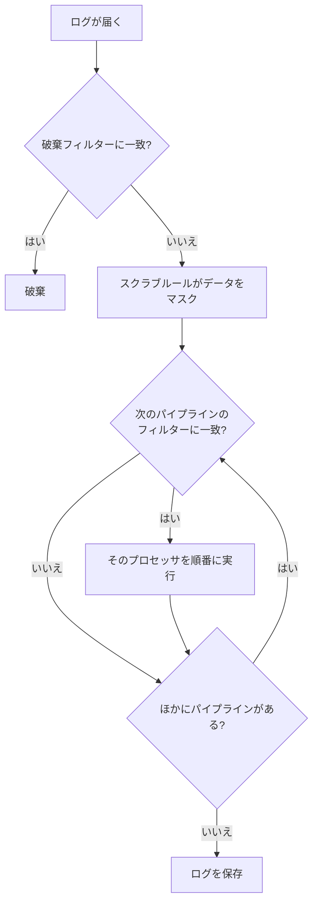

# ログパイプライン

ログパイプラインは、OneUptime がログを取り込むとき、保存する前にログを変換します。パイプラインには、どのログに適用するかを決める **フィルター** と、それらのログを 1 つずつ変更する順序付きの **プロセッサ** のリストがあります。メッセージからフィールドを取り出す、重大度を直す、属性の名前を変える、ログにカテゴリを付ける、といった処理です。

パイプラインは **ログ → 設定 → パイプライン** にあります。

:::cards
- [パイプラインの実行のしくみ](#パイプラインの実行のしくみ): 取り込みのどこでパイプラインが動き、どの順番で実行されるか。
- [パイプラインを作成する](#パイプラインを作成する): 対象のログを選び、プロセッサを追加します。
- [Key=Value Parser](#keyvalue-parser): ファイアウォールや logfmt の行を属性に変えます。
- [例: Sophos XGS ファイアウォール](#例-sophos-xgs-ファイアウォール): ファイアウォールの syslog を最初から最後まで解析します。
:::

## パイプラインの実行のしくみ

パイプラインは、OneUptime が取り込むすべてのログ (OpenTelemetry のログ、syslog、Fluentd のいずれも) に対して、破棄フィルターとスクラブルールのあと、ログが保存される前に実行されます。



- **パイプラインは順番に実行されます**。順番はリストの並びで、行をドラッグして変更します。パイプラインはフィルターに一致したログだけを処理し、フィルターが一致したパイプラインは最初の 1 つだけでなくすべて実行されます。
- **プロセッサも順番に実行されます**。各プロセッサは直前のプロセッサの結果を受け取るため、パーサーは、それが取り出したフィールドを読むプロセッサより前に置く必要があります。後のパイプラインのフィルターも、前のパイプラインが変更した内容を参照します。
- **処理は取り込み時に行われます。** パイプラインを変更すると、その後に届くログに約 1 分以内に反映されます。すでに保存されたログは再処理されません。
- **プロセッサがログを破棄したり空にしたりすることはありません。** パーサーが読めない行は、そのまま通過します。ログを破棄するには **ログ → 設定 → 破棄フィルター** を使います。
- **有効なパイプラインとプロセッサだけが実行されます。** 各ページでオフにすると、設定を失わずに一時停止できます。

## プロセッサの種類一覧

| プロセッサ | 内容 |
| --- | --- |
| Grok パーサー | 名前付きパターンを使って、形が決まった行 (nginx のアクセスログの行など) からフィールドを取り出します。 |
| Key=Value Parser | `key=value` のペアが並ぶ行 (Sophos XGS、Fortinet、logfmt) を、順番に関係なく属性に分割します。 |
| 重大度リマッパー | 属性にある `warn` のような生のレベルを、ログの標準の重大度に対応付けます。 |
| 属性リマッパー | 属性の名前を変更またはコピーします。例: `src_ip` を `source_ip` に。 |
| カテゴリプロセッサ | フィルターに一致したログにカテゴリ名を付けます。例: 「Payment Error」。 |

## 始める前に

- OneUptime に届いているログ。[OpenTelemetry](/docs/telemetry/open-telemetry)、[syslog](/docs/telemetry/syslog)、[Fluentd](/docs/telemetry/fluentd)、またはプローブ経由です。
- パイプラインを変更する権限。プロジェクトのオーナーと管理者は持っています。それ以外のユーザーには **Create Log Pipeline** と **Create Log Pipeline Processor** の権限が必要です。

## パイプラインを作成する

:::steps
### 新しいパイプラインを作る

**ログ → 設定 → パイプライン** を開き、**ログパイプラインを作成** をクリックします。*ファイアウォールのログを解析* のような **名前** を付けて作成すると、パイプラインのページが開きます。

### 適用するログを選ぶ

**フィルター条件** で **編集** をクリックし、**重大度**、**ログ本文**、**サービス ID**、またはカスタム属性に条件を追加します。条件を **すべての条件** または **いずれかの条件** で結び、**変更を保存** をクリックします。条件のないパイプラインは、すべてのログに適用されます。

### プロセッサを追加する

**プロセッサ** で **プロセッサを追加** をクリックし、**プロセッサ名** を入力して **プロセッサの種類** を選び、設定を入力します。Grok パーサーと Key=Value パーサーにはテスターがあり、サンプル行を貼り付けると何が取り出されるかを確認できます。**プロセッサを作成** をクリックします。

### 順序を整える

プロセッサをドラッグして実行順を変更します。**パイプライン** の一覧でも同じようにパイプラインをドラッグします。新しいログは約 1 分以内に処理されます。
:::

### フィルター条件

各条件はフィールドを値と比較します。ビルダーの裏では、フィルターは `severityText = 'Error' AND body LIKE 'timeout'` のようなクエリで、**クエリをプレビュー** で確認できます。

| 演算子 | クエリでの表記 | 備考 |
| --- | --- | --- |
| と等しい | `=` | 完全一致で、大文字と小文字を区別します。 |
| と等しくない | `!=` | 完全一致で、大文字と小文字を区別します。 |
| を含む | `LIKE` | 大文字と小文字を区別しません。値の中の `%` はワイルドカードです。 |
| 次のいずれか | `IN` | カンマ区切りの完全一致の値のリストです。 |

重大度の値は `Fatal`、`Error`、`Warning`、`Information`、`Debug`、`Trace`、`Unspecified` です。そのため `severityText = 'Error'` は一致しますが、`'ERROR'` が一致することはありません。カスタム属性は `attributes.<key>` と書きます。例: `attributes.networkDevice.name = 'hq-firewall'`。

## Key=Value Parser

ファイアウォールなどのネットワーク機器は、各イベントを `key=value` のペアが並んだ 1 行として記録します。行にどのフィールドがどの順番で含まれるかはイベントによって異なるため、1 つの grok パターンでは表現できません。Key=Value Parser はパターンを必要としません。行を順に読み、見つけたペアを順番に関係なくすべてログの属性にします。属性になれば、検索や絞り込みができ、[ログ モニター](/docs/monitor/logs-monitor) で使えます。さらに [グループ化](/docs/monitor/logs-monitor#グループごとのアラートgroup-by) を使えば、トンネル、インターフェース、ユーザーごとに 1 回ずつアラートを出せます。

### 設定

| 設定 | 既定値 | 説明 |
| --- | --- | --- |
| ソースフィールド | `body` | 解析するフィールド。ログメッセージなら `body`、属性なら `attributes.raw_line` などです。 |
| ターゲットのプレフィックス | なし | 取り出したキーの名前空間です。`sophos` を指定すると、`con_name` は `sophos.con_name` として保存されます。プレフィックスが `.`、`_`、`-`、`:` で終わっていない場合は区切り文字が追加されます。 |
| Pair Delimiter | 任意の空白 | ペアとペアを区切る文字です。Sophos、Fortinet、logfmt では空のままにし、ほかの形式では `,`、`;`、`\|` を指定します。 |
| Key-Value Delimiter | `=` | キーと値を区切る文字です。例: `status:up` なら `:`。 |
| 競合時に上書き | オフ | ログがすでに持っている属性をキーで置き換えてよいかどうかです。既定ではオフです。キーは行そのものから来るため、オンにすると、送信元の機器など取り込み時に設定された属性を行が書き換えてしまう可能性があります。 |

2 つの区切り文字は互いに異なり、一方が他方を含まず、クォートやバックスラッシュを含まない必要があります。どちらも最大 8 文字です。プロセッサのフォームは保存前にこれを確認し、テスターの **Test With a Sample Line** は、サンプル行から生成される属性を正確に表示します。

### 解析ルール

- **クォートで囲んだ値** は、スペースや区切り文字を保ちます。`message="IPSec Connection HQ-Branch1 terminated"` は 1 つの値です。ダブルクォートとシングルクォートのどちらも使え、値の中の `\"` は文字どおりのクォートです。閉じられないクォート (syslog のサイズ制限で途中で切れた行) は、行末まで続きます。
- **クォートなしの値** は次のペア区切り文字までなので、`url=https://example.com/?a=b` は `=` を保ちます。
- **空の値** (`key=` と `key=""`) は空文字列として保存されます。
- **値は常にテキストです。** `latency=11` は、型を指定しない grok のキャプチャと同じく `"11"` として保存されます。
- **キー** は英字かアンダースコアで始まり、英字、数字、`. _ - @` を含みます。最初のペアより前のテキスト (RFC 3164 の syslog ヘッダーなど) や、区切り文字のない単語は読み飛ばされます。最初のキーに付いた syslog の優先度 (`<30>device_name="SFW"`) は取り除かれ、キーは残ります。
- **繰り返されたキーは最初の値を保ちます**。2 回目以降は無視されます。
- **上限:** 32 KiB を超える行は解析されません。1 行から取り出すペアは最大 100 個で、256 文字を超えるキーは読み飛ばされ、4,096 文字を超える値は切り詰められます。

### 例: Sophos XGS ファイアウォール

Sophos XGS ファイアウォールが [プローブ](/docs/monitor/network-device-monitor) に syslog を送ると、各メッセージはネットワークデバイスのログとして保存され、syslog メッセージが本文になります。これを解析するには、次のようにします。

:::steps
#### ファイアウォール用のパイプラインを作る

**ログ → 設定 → パイプライン** を開いてパイプラインを作成します。ファイアウォールのログに一致するフィルターを設定します。たとえば、カスタム属性 `networkDevice.name` が `hq-firewall` と等しい (`attributes.networkDevice.name = 'hq-firewall'`)、またはすべての Sophos の行に一致させるなら **ログ本文** が `log_component=` を含む、です。

#### パーサーを追加する

パイプラインを開いて **プロセッサを追加** をクリックします。**Key=Value Parser** を選び、**ソースフィールド** は `body` のままにして、**ターゲットのプレフィックス** を `sophos` にします (任意ですが、ファイアウォールのフィールドがまとまります)。

#### テストして保存する

ファイアウォールの行を **Test With a Sample Line** に貼り付けて結果を確認し、**プロセッサを作成** をクリックします。
:::

Sophos の IPsec イベントは次のとおりです。

```text
device_name="SFW" timestamp="2024-05-02T11:03:12+0200" device_model="XGS2100" device_serial_id="X1234" log_id="010101600001" log_type="Event" log_component="IPSec" log_subtype="System" severity="Information" con_name="HQ-Branch1" src_ip="10.171.4.117" dst_ip="10.171.4.118" status="Terminated" message="IPSec Connection HQ-Branch1 between 10.171.4.117 and 10.171.4.118 for Child HQ-Branch1 terminated."
```

これは、ほかの属性とともに次の属性になります。

| 属性 | 値 |
| --- | --- |
| `sophos.log_component` | `IPSec` |
| `sophos.con_name` | `HQ-Branch1` |
| `sophos.status` | `Terminated` |
| `sophos.src_ip` | `10.171.4.117` |
| `sophos.message` | `IPSec Connection HQ-Branch1 between 10.171.4.117 and 10.171.4.118 for Child HQ-Branch1 terminated.` |

SD-WAN の SLA の行は、フィールドの種類も順番も違いますが、同じプロセッサで処理できます。

```text
log_id=158825619025 log_type="SD-WAN" log_component="SLA" profile_name="Branch-Internet" gw_name="WAN2" latency=11 jitter=2 packet_loss=0 gw_status="up" sla_status="SLA met"
```

これにより `sophos.gw_name = WAN2`、`sophos.latency = 11`、`sophos.packet_loss = 0`、`sophos.gw_status = up`、`sophos.sla_status = SLA met` が得られます。古い SFOS リリースは従来の形式 (`device="SFW" date=2017-01-31 time=18:02:03 timezone="IST" ... connectionname="Tunnel A"`) で記録しますが、同じように解析され、トンネル名は `con_name` ではなく `connectionname` に入ります。

これらの SLA の行を、ゲートウェイごとのレイテンシ、ジッター、パケットロスのメトリクスに変える方法は、[ログの記録ルール](/docs/telemetry/log-recording-rules) の例を参照してください。

### 例: Fortinet FortiGate

FortiGate のログも同じ形式です。

```text
date=2024-01-01 time=10:00:00 devname="FG100" logid="0100032001" type="event" subtype="vpn" level="notice" action="tunnel-down" vpntunnel="HQ-to-Branch2" msg="IPsec tunnel down"
```

既定の設定とプレフィックス `fortigate` で、`fortigate.devname = FG100`、`fortigate.subtype = vpn`、`fortigate.action = tunnel-down`、`fortigate.vpntunnel = HQ-to-Branch2`、`fortigate.time = 10:00:00` が得られます。時刻の値に含まれるコロンは値の一部で、区切り文字ではありません。

### トンネルごとに 1 回アラートを出す

フィールドを解析すれば、[ログ モニター](/docs/monitor/logs-monitor) で障害を数え、トンネルごとに別々のアラートを出せます。`sophos.log_component` = `IPSec` で、本文に `terminated` を含むものを絞り込み、`sophos.con_name` でグループ化します。[グループごとのアラート](/docs/monitor/logs-monitor#グループごとのアラートgroup-by) を参照してください。

## Grok パーサー

形が決まった行から構造化されたフィールドを取り出します。grok パターンは名前付き参照を持つ正規表現です。`%{IPV4:client_ip}` は「IPv4 アドレスに一致させ、`client_ip` として保存する」という意味です。パターンは行全体に一致する必要はなく、一致しない行はそのまま残ります。

| 設定 | 既定値 | 説明 |
| --- | --- | --- |
| **ソースフィールド** | `body` | 解析するフィールド。Key=Value Parser と同じです。 |
| **ターゲットのプレフィックス** | なし | 取り出したフィールドの名前空間。同じ方法で付加されます。 |
| **Grok パターン** | — | パターン。フォームに使用可能な名前付きパターンの一覧が表示されます。 |

キャプチャは、型を指定しない限りテキストとして保存されます。`%{NUMBER:status:int}` は数値として保存します。型は `int`、`long`、`float`、`double`、`boolean`、`string` です。保存する前に、**パターンをテスト** でサンプル行に対してパターンを確認してください。

| ログ本文 | パターン | 追加される属性 |
| --- | --- | --- |
| `10.0.1.5 - GET /health 200` | `%{IPV4:client_ip} - %{WORD:method} %{NOTSPACE:path} %{NUMBER:status:int}` | client_ip, method, path, status |

順番が変わる `key=value` のペアで行が構成されている場合は、代わりに Key=Value Parser を使ってください。

## 重大度リマッパー

属性から生の値を読み取り、標準の重大度に対応付けます。**ソース属性** にレベルを持つ属性 (既定は `level`) を設定し、**マッピング** を追加します。各マッピングは、`warn` のようなアプリケーションが出力する値と、Warning のような重大度を対応付けます。照合は大文字と小文字を区別しません。マッピングのない値の場合、ログの重大度は変わりません。

## 属性リマッパー

ある属性 (**ソースキー**) の値を別の属性 (**ターゲットキー**) に移します。例: `src_ip` を `source_ip` に。

| 設定 | 既定値 | 効果 |
| --- | --- | --- |
| **ソースを保持** | オフ | オフにすると属性の名前を変更し、ソースキーは削除されます。オンにするとコピーし、ソースキーを残します。 |
| **競合時に上書き** | オン | オンにすると、ターゲットがすでにあれば置き換えます。オフにするとターゲットはそのままで、リマップを行いません。 |

## カテゴリプロセッサ

ルールのリストを順番に評価し、フィルターが最初に一致したルールの名前をターゲット属性に保存します。これにより「Payment Error」のログをまとめて検索できます。**ターゲット属性** (既定は `category`) を設定し、**カテゴリルール** を追加します。各ルールは **カテゴリ名** と **ログが一致したとき** の条件で構成されます。最初に一致したルールが採用され、どれにも一致しないログはそのまま残ります。

## 次のステップ

:::cards
- [ログ モニター](/docs/monitor/logs-monitor): パイプラインが取り出した属性でアラートを出します。
- [ログの記録ルール](/docs/telemetry/log-recording-rules): 解析したログのフィールドをメトリクスに変えます。
- [Syslog](/docs/telemetry/syslog): ファイアウォールやサーバーの syslog を OneUptime に送ります。
- [検索構文](/docs/telemetry/search-syntax): ログのエクスプローラーで新しい属性を検索します。
:::
