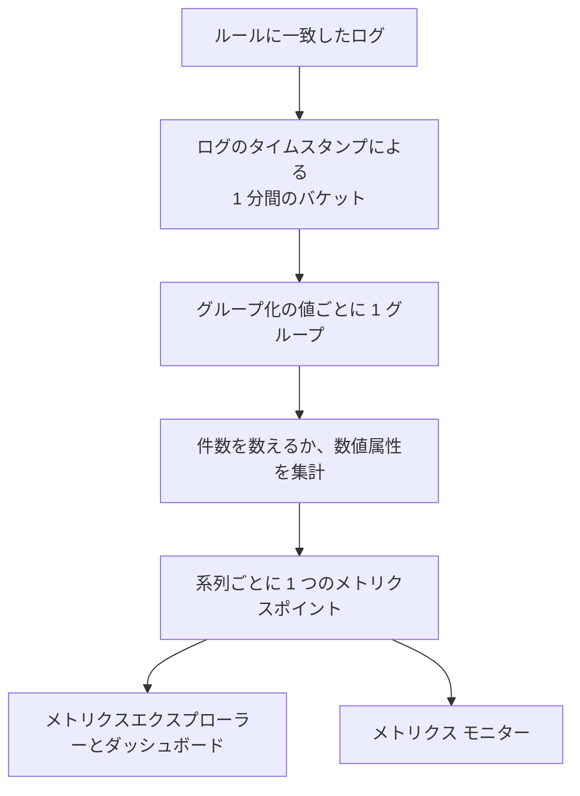
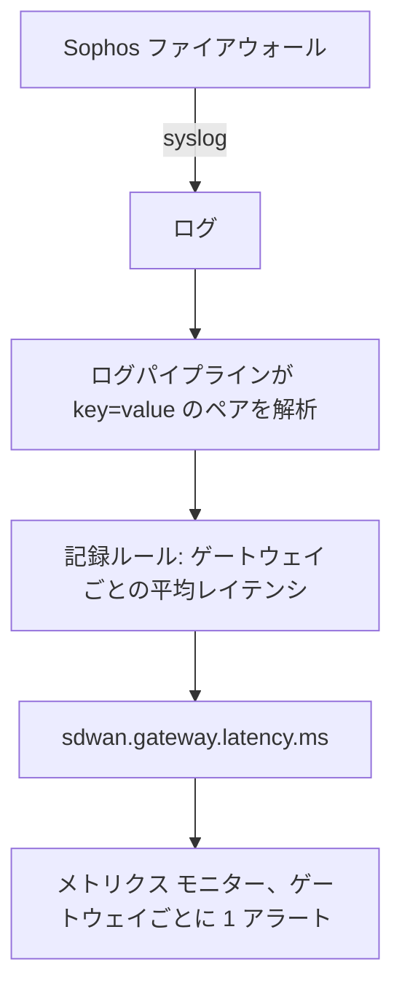

# ログの記録ルール

**Log Recording Rule** は、ログをメトリクスに変えます。毎分、フィルターに一致したログを取り出し、1 分あたり 1 つの数値をメトリクスストアに書き込みます。一致したログの件数か、それらのログが持つ数値属性の合計、平均、最小、最大、パーセンタイルです。結果を最大 5 つのログ属性で分割すれば、値ごとに 1 つの系列が得られます。ゲートウェイごと、ホストごと、顧客ごとです。

:::cards
- [ルールのしくみ](#ルールのしくみ): バケット、タイミング、追いつき、欠損。
- [ルールを作成する](#ルールを作成する): ルールエディターの各項目。
- [例: SD-WAN ゲートウェイのレイテンシ](#例-sophos-ファイアウォールからの-sd-wan-ゲートウェイのレイテンシ): ファイアウォールの syslog から、ゲートウェイごとのアラートまで。
- [権限](#権限): ルールを作成、変更、閲覧できるユーザー。
:::

## 概要

出力はふつうのメトリクスです。**メトリクスエクスプローラー** やダッシュボードでグラフにでき、**メトリクス** モニターでアラートを出せます。**グループ化** を使った系列ごとのアラートも可能です。

関心のある数値がログの中にしかない場合に、ログの記録ルールを使います。ファイアウォールの SLA サマリー、処理時間を記録するバッチジョブ、アクセスログのレスポンスサイズ、あるいは単にサービスが毎分書き出すエラーログの件数などです。

ログの記録ルールは **ログ → 設定 → 記録ルール** にあります。メトリクス用とスパン用の同様のルールは **メトリクス → 設定 → 記録ルール** と **トレース → 設定 → 記録ルール** にあります。

## ルールのしくみ



- **系列ごとに 1 分あたり 1 ポイント。** ログはタイムスタンプで 1 分間のバケットにまとめられます。各バケットは、グループ化に使う属性の値の組み合わせごとに 1 ポイントを生成します。
- **1 分が終わってから 30 秒後に計算されます。** 少し遅れて届いたログも、この短い待ち時間で本来の 1 分に含まれます。それより遅れて届いたログは数えられません。
- **欠損も二重計上もありません。** 各ルールは最後に書き込んだ 1 分を覚えています (ルール一覧に **Computed Until** として表示されます)。ワーカーの再起動などで停止した後は、最大 60 分前までさかのぼって書き込めなかった分に追いつき、同じ 1 分を二度書き込むことはありません。
- **グループ化しない件数のルールには欠損がありません。** 一致するログがない 1 分は `0` として書き込まれます。それ以外のルールは、集計するものがない 1 分には何も書き込まないため、グラフやモニターには作り出されたゼロではなく「データなし」が見えます。
- **ほかの派生メトリクスと同じように書き込まれます。** ポイントはルールの **出力メトリクス名** を名前とする Gauge のデータポイントで、グループ化の属性と `oneuptime.derived.log_rule_id` (ルールの ID) を持ちます。保持期間は、メトリクスとトレースの記録ルールのポイントと同じ 15 日です。

ルールの定義を変更すると、次に書き込む 1 分から反映されます。すでに書き込んだポイントは書き換えられません。ルールをオフにすると停止し、再びオンにすると、オフの間に書き込めなかった分に同じく最大 60 分まで追いつきます。

## ルールを作成する

:::steps
### 記録ルールを開く

**ログ → 設定 → 記録ルール** を開き、**Log Recording Ruleを作成** を選びます。

### ルールに名前を付ける

**名前** を入力します。その下の **出力メトリクス名** は、入力に合わせて名前から作られます。独自の名前を入力するには、横の **編集** を選びます。

### 対象のログと計算内容を選ぶ

**Which Logs** で、テレメトリサービス、重大度、本文のテキスト、属性フィルターを使ってルールを絞り込みます。**集計** を選び、件数以外の場合は集計する **Numeric Attribute** を選びます。

### 結果を分割して保存する

必要に応じて **グループ化** の属性と **ユニット** を追加します。エディターの下部の行を確認してから保存します。数分以内に、ルール一覧に **Computed Until** の時刻が表示されます。
:::

| 項目 | 役割 |
| --- | --- |
| 名前 | ルールが計算する内容。例: *SD-WAN gateway latency*。 |
| 出力メトリクス名 | ルールが書き込むメトリクス。名前から作られます (*SD-WAN gateway latency* なら `sd_wan_gateway_latency`)。**編集** を選べば独自の名前を入力できます。プロジェクトの記録ルールの中で一意である必要があります。 |
| Which Logs | 任意のフィルター。すべて AND で結合されます: テレメトリサービス、重大度、本文に含まれるテキスト、属性フィルター (属性が値と等しい)。 |
| 集計 | `Count of logs`、または数値属性の集計 (下記参照)。 |
| Numeric Attribute | 件数以外のすべての集計で使う、値を集計する属性。例: `latency`。 |
| グループ化 | 任意: 最大 5 つの属性キー。それらの値の組み合わせごとに 1 系列になります。 |
| ユニット | 任意: 出力メトリクスの単位。例: `ms`。メトリクスをグラフにするすべての場所で表示されます。 |
| 説明 | **その他の項目** の中: ルールの目的。 |
| 有効 | **その他の項目** の中: 既定でオン。有効なルールだけが計算されます。 |

エディターの下部の行には、ルールが書き込む内容が表示されます。例: `avg(latency) by gw_name, profile_name`。

1 つのルールで絞り込めるのは、最大 10 個の属性と 100 個のテレメトリサービスです。

### 集計の種類

| 集計 | 各 1 分のポイント |
| --- | --- |
| Count of logs | フィルターに一致したログの件数。 |
| 平均 | 数値属性の値の平均。 |
| 合計 | 属性の値の合計。 |
| 最小 | 最も小さい値。 |
| 最大 | 最も大きい値。 |
| p50 (median) | 中央値。 |
| p75 | 75 パーセンタイル。 |
| p90 | 90 パーセンタイル。 |
| p95 | 95 パーセンタイル。 |
| p99 | 99 パーセンタイル。 |

### 数値属性

数値属性の値は単純な数値でなければなりません。数値 (数値として解析された `latency=11`) としても、テキスト (`"11"`、`"11.5"`、`"1e3"`) としても受け付けます。値がない、または数値ではないログ (`"11ms"`、`"n/a"`、空文字列) は **スキップ** されます。`0` として数えられることはないため、不正なログが平均を引き下げることはありません。

### 属性キー

属性フィルターのキーは、ログエクスプローラーのフィルターと同じく、大文字と小文字を区別せずに照合されます。数値属性とグループ化のキーは、ログパイプラインが付けるプレフィックスも含めて、ログが持っているとおりに書く必要があります。キーの項目にはプロジェクトのログが持つキーが候補として表示されるので、手で入力するより一覧から選んでください。

キーには英字、数字、`. _ : / -` を使えます。

### グループ化と系列数の上限

グループ化のキーが増えるごとに、ルールが書き込む系列数は掛け算で増えます。そのため、ゲートウェイ、ホスト、顧客など、個別に見たりアラートを出したりしたい対象を識別する属性でグループ化し、リクエスト ID やクライアントの IP アドレスのようにログごとに異なる属性は避けてください。

1 つのルールが 1 分あたりに書き込む系列は最大 1,000 です。それを超えると、一致したログの多い系列が残り、その 1 分の残りは破棄されます。グループ化の属性の一部を持たないログも数えられ、その系列はその属性なしで書き込まれます。

## 例: Sophos ファイアウォールからの SD-WAN ゲートウェイのレイテンシ

SD-WAN のログを有効にした Sophos XGS ファイアウォールは、数分ごとに SD-WAN プロファイルとゲートウェイごとの SLA サマリーを送ります。

```text
log_type="SD-WAN" log_component="SLA" profile_name="Branch-Internet" gw_name="WAN2" latency=11 jitter=2 packet_loss=0 gw_status="up" sla_status="SLA met"
```

この例では、これらのサマリーをゲートウェイごとのレイテンシのメトリクスに変え、1 つのゲートウェイのレイテンシが高いままになったらアラートを出します。



:::steps
### フィールドを属性にしてログを取り込む

1. ファイアウォールの syslog を OneUptime に送ります。[Syslog](/docs/telemetry/syslog) を参照してください。
2. **ログ → 設定 → パイプライン** で、本文の `key=value` のペアをログの属性に分割するプロセッサを持つパイプラインを追加し、各サマリーが `log_type`、`log_component`、`profile_name`、`gw_name`、`latency`、`jitter`、`packet_loss` を属性として持つようにします。これは [Key=Value Parser](/docs/telemetry/log-pipelines#keyvalue-parser) で行えます。
3. **ログ** エクスプローラーを開き、SLA のログで属性名を確認します。パイプラインがプレフィックスを付ける場合は、以下ではプレフィックス付きの名前を使ってください。

### 記録ルールを作成する

**ログ → 設定 → 記録ルール** で、次のルールを作成します。

- **名前：** SD-WAN gateway latency
- **出力メトリクス名：** **編集** を選び、`sdwan.gateway.latency.ms` と入力
- **Which Logs：** 属性フィルター `log_type` = `SD-WAN` と `log_component` = `SLA`
- **集計：** 平均、**Numeric Attribute：** `latency`
- **グループ化：** `gw_name` と `profile_name`
- **ユニット：** `ms`

API、MCP、Terraform で作る場合、同じルールの **定義** は次のとおりです。

```json
{
  "filter": {
    "attributeFilters": [
      { "key": "log_type", "value": "SD-WAN" },
      { "key": "log_component", "value": "SLA" }
    ]
  },
  "aggregationType": "Avg",
  "valueAttribute": "latency",
  "groupByAttributes": ["gw_name", "profile_name"],
  "unit": "ms"
}
```

残りの 2 つの SLA の測定値については、`jitter` (`sdwan.gateway.jitter.ms`、単位 `ms`) と `packet_loss` (`sdwan.gateway.packet_loss.percent`、単位 `%`) で同じ手順を繰り返します。`gw_status` = `down` で絞り込み、`gw_name` でグループ化した **Count of logs** のルールは、ゲートウェイごとのダウンの報告件数を数えます。

数分以内に、ルール一覧に **Computed Until** の時刻が表示され、`sdwan.gateway.latency.ms` がメトリクスエクスプローラーに現れます。それを選んで `gw_name` でグループ化すると、ゲートウェイごとに 1 本のレイテンシの線が表示されます。

### 1 つのゲートウェイのレイテンシが高いままならアラートを出す

**メトリクス** モニターを作成します ([メトリクス モニター](/docs/monitor/metrics-monitor) を参照)。

1. **メトリクスクエリ：** `sdwan.gateway.latency.ms`、集計は **平均**、**グループ化** は `gw_name` と `profile_name`。
2. **ローリング時間枠：** 過去 15 分。ファイアウォールは数分ごとに報告するため、時間枠にはゲートウェイごとに複数のポイントが入ります。
3. **集計方法：** **All Values**。時間枠内のすべてのポイントがしきい値を超える必要があるため、遅いサマリーが 1 つあるだけでは誰も呼び出されません。平均値が高いときにアラートを出すなら、代わりに **平均** を使います。
4. **条件：** Metric value **Greater Than** `150` でアラートを開きます。
5. 必要に応じて、アラートのタイトルにグループ化の値を使います。例: `SD-WAN latency high on {{gw_name}} ({{profile_name}})`。

グループ化を設定すると、各ゲートウェイがそれぞれ独立した系列になります。WAN2 が遅くなると WAN2 だけのアラートが開き、WAN2 が回復すると自動的に解決します。[系列ごとのアラート](/docs/monitor/metrics-monitor#系列ごとのアラートgroup-by) を参照してください。
:::

## 知っておくと便利なこと

- **タイムスタンプはログから取ります。** ログは自身のタイムスタンプの 1 分に入ります。時計が少しでも大きくずれている機器のログは、誤った 1 分に入るか、時間枠からまったく外れてしまいます。
- **過去分は計算しません。** 新しいルールは最初の実行の直前の 1 分から始まり、それより古いログは計算されません。
- **ルールを削除すると** 停止します。すでに書き込んだポイントは、期限が切れるまで残ります。
- **記録ルールはプロジェクトのすべてのログを対象に動作します。** 出力メトリクスを読めるユーザーは、ルールのフィルターに一致したすべてのログから計算された数値を見られます。そのため、ログの記録ルールの作成と編集は、プロジェクトのオーナー、管理者、**Create / Edit Log Recording Rule** の権限を持つユーザーに限られます。

## 権限

| 権限 | 許可される操作 |
| --- | --- |
| Create Log Recording Rule | ルールの作成。 |
| Edit Log Recording Rule | ルールの変更とオフ。 |
| Delete Log Recording Rule | ルールの削除。 |
| Read Log Recording Rule | ルールとその計算内容の閲覧。 |

プロジェクトのオーナーと管理者はこれらすべてを行えます。プロジェクトのメンバー、閲覧者、テレメトリのロールはルールを閲覧できます。

## 次のステップ

:::cards
- [メトリクス モニター](/docs/monitor/metrics-monitor): ルールが書き込むメトリクスでアラートを出します。
- [ログパイプライン](/docs/telemetry/log-pipelines): ルールが集計する属性を取り出します。
- [Syslog](/docs/telemetry/syslog): ファイアウォールやサーバーのログを OneUptime に送ります。
:::
