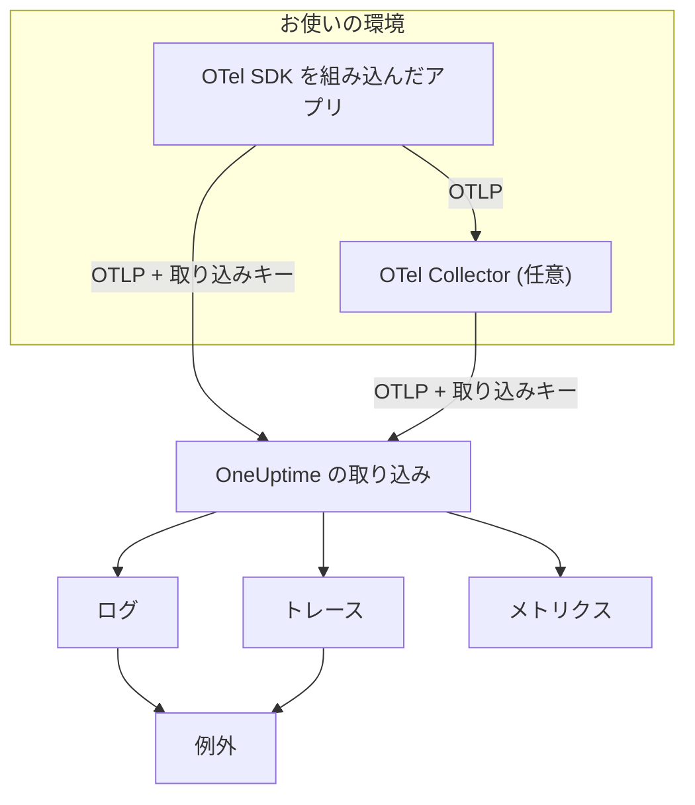

# OpenTelemetry

OneUptime は OpenTelemetry Protocol (OTLP) でログ、メトリクス、トレースを取り込みます。任意の OpenTelemetry SDK または OpenTelemetry Collector を取り込みキー付きで OneUptime に向けると、データが **ログ**、**トレース**、**メトリクス**、**例外** に表示されます。このページでは、数分でサービスからデータを送れるようにしたうえで、本番運用で必要になるエンドポイント、制限、エラーを説明します。

:::cards
- [クイックスタート](#クイックスタート): キーを作成し、4 つの環境変数を設定して SDK を追加します。
- [Collector を使う](#opentelemetry-collector-経由で送る): すでに動かしている Collector に OneUptime をエクスポーターとして追加します。
- [エンドポイントと制限](#エンドポイントと制限): URL、ポート、エンコーディング、サイズ制限、ステータスコード。
- [トラブルシューティング](#トラブルシューティング): データが届かないときに確認すること。
:::

## 仕組み

アプリケーションは OTLP を OneUptime に直接エクスポートするか、データを転送する OpenTelemetry Collector にエクスポートします。すべてのリクエストは `x-oneuptime-token` ヘッダーに取り込みキーを含み、OneUptime はこのキーでプロジェクトを特定します。



- **サービスは自動で作成されます。** リソース属性 `service.name` (`OTEL_SERVICE_NAME` で設定) が、データの属するサービスの名前になります。OneUptime は最初に送信されたときにサービスを作成し、**製品 → サービス** に表示します。
- **エラーは例外になります。** スパンの例外イベントと、ログに記録された例外は、**例外** で課題としてまとめられます。[ログからの例外](#ログからの例外)を参照してください。

## 始める前に

- 取り込みキーを作成できる OneUptime プロジェクト。プロジェクトのオーナーと管理者、および **Create Telemetry Ingestion Key** 権限を持つユーザーが作成できます。
- OpenTelemetry SDK を追加できるアプリケーション、または OpenTelemetry Collector。
- アプリケーションまたは Collector から `oneuptime.com` (またはセルフホストの OneUptime ホスト) への送信方向の HTTPS (ポート 443)。

> [!NOTE]
> OneUptime Cloud では、テレメトリは取り込んだ GB 単位で課金されます。Free プランのプロジェクトは、テレメトリを送る前に支払い方法を登録する必要があります。キーを作成するダイアログに料金が表示されます。

## クイックスタート

:::steps
### 取り込みキーを作成する

1. **製品 → プロジェクト設定** に移動します。
2. サイドメニューで **テレメトリと APM** を開き、**取り込みキー** を選びます。
3. **取り込みキーを作成** をクリックします。ダイアログには名前が入力され、アプリケーションや Collector が送信に使うキーの種類 **サーバー** が選ばれています。必要なら名前を変更し、**取り込みキーを作成** をクリックします。


新しいキーは専用のページで開きます。その **シークレットキー** をコピーしてください。これが `x-oneuptime-token` として送るトークンです。


### OpenTelemetry の環境変数を設定する

OpenTelemetry SDK はどれも同じ標準の環境変数を読むため、この手順はどの言語でも同じです。

| 環境変数 | 値 | 役割 |
| --- | --- | --- |
| `OTEL_EXPORTER_OTLP_ENDPOINT` | `https://oneuptime.com/otlp` | 送信先です。`/v1/traces`、`/v1/metrics`、`/v1/logs` は SDK が自動で付け加えます。 |
| `OTEL_EXPORTER_OTLP_HEADERS` | `x-oneuptime-token=YOUR_ONEUPTIME_INGESTION_KEY` | すべてのリクエストに取り込みキーを付けて送ります。 |
| `OTEL_EXPORTER_OTLP_PROTOCOL` | `http/protobuf` | HTTP 上の OTLP です。SDK によっては既定で gRPC を使い、別のエンドポイントに送ります。 |
| `OTEL_SERVICE_NAME` | `my-service` | OneUptime でデータが表示されるサービスです。 |

```bash
export OTEL_EXPORTER_OTLP_ENDPOINT="https://oneuptime.com/otlp"
export OTEL_EXPORTER_OTLP_HEADERS="x-oneuptime-token=YOUR_ONEUPTIME_INGESTION_KEY"
export OTEL_EXPORTER_OTLP_PROTOCOL="http/protobuf"
export OTEL_SERVICE_NAME="my-service"
```

セルフホストの場合は、`https://oneuptime.com` を OneUptime インスタンスの URL (たとえば `https://oneuptime.example.com/otlp`) に置き換えてください。例外に環境のタグを付けるには、`OTEL_RESOURCE_ATTRIBUTES` に `deployment.environment=production` も設定します。

### アプリに OpenTelemetry を追加する

言語を選んでください。どのセットアップも上の環境変数を読むので、コードにエンドポイントやキーは出てきません。

:::tabs
@tab Node.js
SDK、自動計装、OTLP/HTTP エクスポーターをインストールします。

```bash
npm install @opentelemetry/sdk-node @opentelemetry/auto-instrumentations-node \
  @opentelemetry/exporter-trace-otlp-proto @opentelemetry/exporter-metrics-otlp-proto \
  @opentelemetry/exporter-logs-otlp-proto @opentelemetry/sdk-metrics @opentelemetry/sdk-logs
```

SDK を専用のファイルで作成します。

```javascript title="instrumentation.js"
const { NodeSDK } = require("@opentelemetry/sdk-node");
const { getNodeAutoInstrumentations } = require("@opentelemetry/auto-instrumentations-node");
const { OTLPTraceExporter } = require("@opentelemetry/exporter-trace-otlp-proto");
const { OTLPMetricExporter } = require("@opentelemetry/exporter-metrics-otlp-proto");
const { OTLPLogExporter } = require("@opentelemetry/exporter-logs-otlp-proto");
const { PeriodicExportingMetricReader } = require("@opentelemetry/sdk-metrics");
const { BatchLogRecordProcessor } = require("@opentelemetry/sdk-logs");

// The exporters read OTEL_EXPORTER_OTLP_ENDPOINT and OTEL_EXPORTER_OTLP_HEADERS.
const sdk = new NodeSDK({
  traceExporter: new OTLPTraceExporter(),
  metricReader: new PeriodicExportingMetricReader({
    exporter: new OTLPMetricExporter(),
  }),
  logRecordProcessors: [new BatchLogRecordProcessor(new OTLPLogExporter())],
  instrumentations: [getNodeAutoInstrumentations()],
});

sdk.start();
```

アプリケーションのコードより先に読み込みます。

```bash
node --require ./instrumentation.js app.js
```
@tab Python
OpenTelemetry のディストリビューションとエクスポーターをインストールし、続けてアプリが使うライブラリの計装をインストールします。

```bash
pip install opentelemetry-distro opentelemetry-exporter-otlp
opentelemetry-bootstrap -a install
```

`opentelemetry-instrument` 経由でアプリを起動します。トレース、メトリクス、ログをエクスポートし、ログ用の変数によって Python の `logging` モジュールで書かれたレコードも送ります。

```bash
OTEL_PYTHON_LOGGING_AUTO_INSTRUMENTATION_ENABLED=true opentelemetry-instrument python app.py
```
@tab Go
SDK と OTLP/HTTP エクスポーターを追加します。

```bash
go get go.opentelemetry.io/otel go.opentelemetry.io/otel/sdk go.opentelemetry.io/otel/sdk/metric \
  go.opentelemetry.io/otel/exporters/otlp/otlptrace/otlptracehttp \
  go.opentelemetry.io/otel/exporters/otlp/otlpmetric/otlpmetrichttp
```

プログラムの起動時に tracer と meter のプロバイダーを作成します。

```go title="main.go"
package main

import (
	"context"
	"log"

	"go.opentelemetry.io/otel"
	"go.opentelemetry.io/otel/exporters/otlp/otlpmetric/otlpmetrichttp"
	"go.opentelemetry.io/otel/exporters/otlp/otlptrace/otlptracehttp"
	sdkmetric "go.opentelemetry.io/otel/sdk/metric"
	sdktrace "go.opentelemetry.io/otel/sdk/trace"
)

func main() {
	ctx := context.Background()

	// Both exporters read OTEL_EXPORTER_OTLP_ENDPOINT and OTEL_EXPORTER_OTLP_HEADERS.
	traceExporter, err := otlptracehttp.New(ctx)
	if err != nil {
		log.Fatal(err)
	}
	tracerProvider := sdktrace.NewTracerProvider(sdktrace.WithBatcher(traceExporter))
	defer tracerProvider.Shutdown(ctx)
	otel.SetTracerProvider(tracerProvider)

	metricExporter, err := otlpmetrichttp.New(ctx)
	if err != nil {
		log.Fatal(err)
	}
	meterProvider := sdkmetric.NewMeterProvider(
		sdkmetric.WithReader(sdkmetric.NewPeriodicReader(metricExporter)),
	)
	defer meterProvider.Shutdown(ctx)
	otel.SetMeterProvider(meterProvider)

	// Your application code.
}
```

プロバイダーは `OTEL_SERVICE_NAME` を環境から取得します。ログには `otlploghttp` を、`otelslog` などのログブリッジと組み合わせて追加します。これも同じ変数を読みます。
@tab Java
OpenTelemetry の Java エージェントをダウンロードし、アプリケーションにアタッチします。コードの変更は不要です。

```bash
curl -L -O https://github.com/open-telemetry/opentelemetry-java-instrumentation/releases/latest/download/opentelemetry-javaagent.jar
java -javaagent:opentelemetry-javaagent.jar -jar my-app.jar
```

エージェントは一般的なフレームワークとライブラリを計装し、トレース、メトリクス、Logback または Log4j で書かれたログをエクスポートします。
@tab .NET
ASP.NET Core 用の OpenTelemetry パッケージを追加します。

```bash
dotnet add package OpenTelemetry.Extensions.Hosting
dotnet add package OpenTelemetry.Exporter.OpenTelemetryProtocol
dotnet add package OpenTelemetry.Instrumentation.AspNetCore
dotnet add package OpenTelemetry.Instrumentation.Http
```

起動時に OpenTelemetry を登録します。`UseOtlpExporter()` はトレース、メトリクス、ログを送り、`OTEL_EXPORTER_OTLP_*` の変数を読みます。

```csharp title="Program.cs"
using OpenTelemetry;
using OpenTelemetry.Metrics;
using OpenTelemetry.Trace;

var builder = WebApplication.CreateBuilder(args);

builder.Services.AddOpenTelemetry()
    .WithTracing(tracing => tracing
        .AddAspNetCoreInstrumentation()
        .AddHttpClientInstrumentation())
    .WithMetrics(metrics => metrics
        .AddAspNetCoreInstrumentation()
        .AddHttpClientInstrumentation())
    .WithLogging()
    .UseOtlpExporter();

var app = builder.Build();
app.Run();
```

Serilog を使っていますか? Serilog のログを OneUptime に送る方法は [Serilog](/docs/telemetry/serilog) を参照してください。
:::

### データが届くことを確認する

OneUptime がキーを受け付けるかどうかを問い合わせます。

```bash
curl -i -H "x-oneuptime-token: YOUR_ONEUPTIME_INGESTION_KEY" \
  https://oneuptime.com/otlp/v1/validate
```

有効なキーなら `200` と `"valid": true` が返ります。それ以外の場合は `401` と、何が問題か (不明、無効、期限切れ) を示すメッセージが返ります。

次にアプリを動かし、1 分ほど使ってみます。**製品 → サービス** を開くと、`OTEL_SERVICE_NAME` で設定した名前でサービスが表示され、そのログ、トレース、メトリクス、例外を確認できます。**製品 → ログ**、**製品 → トレース**、**製品 → メトリクス** には、すべてのサービスの同じデータが表示されます。
:::

:::details SDK を使わずにテストログを送る
OTLP/HTTP は JSON も受け付けるので、`curl` でログを送れます。`severityNumber` を `9` にすると情報レベルのログになります。

```bash
curl -i https://oneuptime.com/otlp/v1/logs \
  -H "Content-Type: application/json" \
  -H "x-oneuptime-token: YOUR_ONEUPTIME_INGESTION_KEY" \
  -d '{
    "resourceLogs": [{
      "resource": {
        "attributes": [
          { "key": "service.name", "value": { "stringValue": "my-service" } }
        ]
      },
      "scopeLogs": [{
        "logRecords": [{
          "severityNumber": 9,
          "body": { "stringValue": "Hello from curl" }
        }]
      }]
    }]
  }'
```

`200` はログが受け付けられたことを意味します。数秒以内に **製品 → ログ** の `my-service` サービスに表示されます。
:::

## OpenTelemetry Collector 経由で送る

すでに Collector がある場合、データのバッチ処理・フィルタリング・付加情報の追加を 1 か所で行いたい場合、または取り込みキーをアプリケーションに持たせたくない場合は、Collector を使います。アプリは Collector にエクスポートし、OneUptime と通信するのは Collector だけです。

:::steps
### OneUptime をエクスポーターとして追加する

OneUptime を指す `otlphttp` エクスポーターを追加し、すべてのパイプラインをそこに通します。

```yaml title="otel-collector-config.yaml"
receivers:
  otlp:
    protocols:
      grpc:
        endpoint: 0.0.0.0:4317
      http:
        endpoint: 0.0.0.0:4318

processors:
  batch: {}

exporters:
  otlphttp:
    endpoint: https://oneuptime.com/otlp
    headers:
      x-oneuptime-token: YOUR_ONEUPTIME_INGESTION_KEY

service:
  pipelines:
    traces:
      receivers: [otlp]
      processors: [batch]
      exporters: [otlphttp]
    metrics:
      receivers: [otlp]
      processors: [batch]
      exporters: [otlphttp]
    logs:
      receivers: [otlp]
      processors: [batch]
      exporters: [otlphttp]
```

エクスポーターの既定値はそのままにします。gzip で圧縮した protobuf が送られ、OneUptime はどちらも受け付けます。エクスポーターに `Content-Type` ヘッダーは設定しないでください。OneUptime はこのヘッダーでデコーダーを選ぶため、protobuf のバイト列に JSON のコンテンツタイプを付けると取り込みが壊れます。

### Collector を実行する

:::tabs
@tab Docker
```bash
docker run -d --name otel-collector \
  -p 4317:4317 -p 4318:4318 \
  -v "$(pwd)/otel-collector-config.yaml:/etc/otelcol-contrib/config.yaml" \
  otel/opentelemetry-collector-contrib:latest
```
@tab Linux
```bash
otelcol-contrib --config otel-collector-config.yaml
```
:::

Collector は OTLP をポート `4317` (gRPC) と `4318` (HTTP) で待ち受けます。SDK が既定で送信するポートです。

### アプリを Collector に向ける

アプリケーションでは `OTEL_EXPORTER_OTLP_ENDPOINT` を Collector (たとえば `http://localhost:4318`) に設定し、`OTEL_EXPORTER_OTLP_HEADERS` を削除します。キーは Collector が付けます。`OTEL_SERVICE_NAME` は各アプリケーションに残しておきます。

データはクイックスタートとまったく同じように OneUptime に届きます。届かない場合は、Collector 自身のログに理由が出ます。[トラブルシューティング](#トラブルシューティング)を参照してください。
:::

すでに別のベンダーにエクスポートしていますか? 既存のエクスポーターの隣に `otlphttp` エクスポーターを追加し、各パイプラインの `exporters` に両方を並べれば、比較している間は両方に送れます。ホストのメトリクスやログファイルも収集するには、[Host OpenTelemetry Collector](/docs/telemetry/host-otel-collector) のガイドを参照してください。

## エンドポイントと制限

| 設定 | OTLP/HTTP (推奨) | OTLP/gRPC |
| --- | --- | --- |
| エンドポイント | `https://oneuptime.com/otlp` | `https://oneuptime.com:443` |
| 認証 | `x-oneuptime-token` ヘッダー | `x-oneuptime-token` メタデータ |
| エンコーディング | Protobuf (`application/x-protobuf`) または JSON (`application/json`) | Protobuf |
| 圧縮 | なし、`gzip`、`deflate`、`zstd` | なし、`gzip` |
| リクエストサイズ | `/otlp` へのリクエストあたり最大 4 MB | メッセージあたり最大 4 MB |

HTTP では、シグナルごとにエンドポイントの下に専用のパスがあります。SDK と Collector が自動で付けるので、自分で設定するのはツールが完全な URL を求める場合だけです。

| シグナル | OTLP/HTTP の URL |
| --- | --- |
| トレース | `https://oneuptime.com/otlp/v1/traces` |
| メトリクス | `https://oneuptime.com/otlp/v1/metrics` |
| ログ | `https://oneuptime.com/otlp/v1/logs` |
| プロファイル | `https://oneuptime.com/otlp/v1/profiles` |

継続的プロファイリングでは、ほとんどのプロファイラーが代わりに Pyroscope 互換のエンドポイントに送ります。[継続的プロファイリング](/docs/telemetry/profiles)を参照してください。OTLP のプロファイルをエクスポートする Collector は、エクスポーターの `profiles_endpoint` を `https://oneuptime.com/otlp/v1/profiles` に設定する必要があります。既定では、OneUptime が提供していない開発用のパスにプロファイルを送るためです。

### gRPC 上の OTLP

OneUptime は Web アプリと同じホストのポート 443 で、TLS 経由の OTLP/gRPC を提供しています。`OTEL_EXPORTER_OTLP_PROTOCOL` を `grpc` に、`OTEL_EXPORTER_OTLP_ENDPOINT` を `https://oneuptime.com:443` に設定し、同じ `x-oneuptime-token` ヘッダーを送ります。Collector では、`endpoint: oneuptime.com:443` と同じ `headers` を指定した `otlp` エクスポーターを使います。

セルフホストの環境では、gRPC が OneUptime に届くのは HTTPS 経由の場合だけです。平文 HTTP (h2c) の接続は拒否されます。インスタンスを平文 HTTP で提供している場合は OTLP/HTTP を使ってください。

キーの設定のうち 2 つは OTLP/HTTP にのみ適用されます。**1 分あたりのリクエスト数の上限** と **固定されたサービス名** です。gRPC で送られたデータは、送信時の `service.name` のままで、上限にもカウントされません。

### レスポンス

OneUptime はデータをキューに入れた時点でエクスポートに応答し、データは数秒後に表示されます。

| レスポンス | gRPC ステータス | 意味 | 対処 |
| --- | --- | --- | --- |
| `200` | `OK` | 受け付けました。 | 不要です。 |
| `401` | `UNAUTHENTICATED` | キーがない、不明、または期限切れです。 | `x-oneuptime-token` の値をキーの **シークレットキー** と照合します。 |
| `402` | `PERMISSION_DENIED` | OneUptime Cloud のみ: プロジェクトが Free プランで、支払い方法がありません。 | **プロジェクト設定 → 請求と請求書 → 請求** で追加します。 |
| `413` | — | リクエストがサイズ制限を超えています。 | バッチを小さくして送ります。 |
| `415` | — | サポートされていない `Content-Encoding` です。 | `gzip`、`deflate`、`zstd` のいずれかを使うか、圧縮しないで送ります。 |
| `422` | `PERMISSION_DENIED` | キーが無効化されているか、許可されたオリジンの外で使われたブラウザーキーです。 | キーを再び有効にするか、サーバーキーで送ります。 |
| `429` | — | キーの **1 分あたりのリクエスト数の上限** に達しました。 | まずは何もしません。エクスポーターは `Retry-After` の時間が過ぎると再試行します。繰り返し起きる場合は上限を引き上げます。 |
| `503` | `UNAVAILABLE` | OneUptime の起動中か、取り込みキューを利用できません。 | 不要です。OTLP エクスポーターは `503` を自動で再試行します。 |

`401`、`402`、`413`、`415`、`422` は OTLP エクスポーターにとって恒久的なエラーです。エクスポーターは再試行せず、バッチを破棄してエラーをログに記録します。

### 再起動とアップグレード

OneUptime の再起動中やアップグレード中は、準備ができるまでエクスポートに `503` と `Retry-After: 5` で応答し、エクスポーターはそれらを再送します。Collector のエクスポーターは既定で 5 分間再試行を続け (`retry_on_failure`)、送れなかったものを `sending_queue` に保持するので、どちらも有効のままにしてください。OneUptime がデータを受信していなかった時間が、サーバー、ホスト、その他のリソースの停止として扱われることはありません。[OneUptime がデータを受信していないとき](/docs/monitor/when-oneuptime-is-not-receiving#起動中)を参照してください。

### 取り込みキー

**プロジェクト設定 → テレメトリと APM → 取り込みキー** にある各キーのページには、次の設定があります。

| 設定 | 役割 |
| --- | --- |
| **キーの種類** | アプリケーション、Collector、エージェントには **サーバー** (既定)。Web ページに組み込むキーには **ブラウザー**。書き込み専用で、その **許可されたオリジン** からのみ受け付けます。キーの作成後は変更できません。 |
| **許可されたオリジン** | ブラウザーキーが使える Web オリジンです (例: `https://app.example.com`)。サーバーキーでは無視されます。 |
| **固定されたサービス名** | 設定すると、このキーで OTLP/HTTP 経由で送られたすべてのデータの `service.name` を置き換えます。 |
| **有効** | オフにすると、キーを削除せずに、そのキーで送られたデータの受け付けをただちに停止します。 |
| **有効期限** | この日付を過ぎるとキーは拒否されます。空欄なら期限はありません。 |
| **1 分あたりのリクエスト数の上限** | このキーを使うすべてのクライアントを合わせて、1 分あたりに受け付ける OTLP/HTTP リクエストの最大数です。空欄の場合、サーバーキーでは上限なし、ブラウザーキーでは 6,000 です。 |
| **最終使用日時** | このキーで最後にデータを受け付けた日時です。安全にローテーションや削除ができるキーを見つけるのに使います。 |

キーのページにある **シークレットキーをリセット** は、シークレットを置き換えます。古いシークレットで送信しているアプリケーションと Collector は、更新するまですべて拒否されます。

## セルフホストの OneUptime

このページの内容はすべて、セルフホストの環境でも同じように動作します。このページで `https://oneuptime.com` と書かれている箇所は、OneUptime の URL に置き換えてください。

- `OTEL_EXPORTER_OTLP_ENDPOINT` は `https://YOUR-ONEUPTIME-HOST/otlp` です。OneUptime を平文 HTTP で提供している場合は `http://YOUR-ONEUPTIME-HOST/otlp` です。
- 同梱の Ingress は `/otlp` で最大 4 MB のリクエストを受け付けます。OneUptime の前段に置くプロキシは制限がこれより低い場合があります (ingress-nginx の `proxy-body-size` は既定で 1 MB)。`/otlp` についても制限を引き上げないと、エクスポーターは `413` を受け取ります。
- `DISABLE_TELEMETRY_INGESTION=true` が設定されていると、OneUptime はすべてのエクスポートを受け付けますが、何も保存しません。セルフホストのインスタンスにデータがまったく表示されないときは、まずこれを確認してください。

## ログからの例外

OneUptime は **ログ** の中から例外を見つけ、トレースのエラーと同じ **例外** ビューにまとめます。各ログはすでにサービスまたはホストに属しているので、例外はそこに関連付けられます。ログとトレースの例外はフィンガープリントによるグループ化を共有するため、トレースとログの両方から報告されたエラーは 1 つの課題にまとまります。

ログが例外になる方法は 2 つあります。

| 検出方法 | 対象のログ | 仕組み |
| --- | --- | --- |
| **例外の属性** (推奨) | すべてのログ | OpenTelemetry の `exception.type`、`exception.message`、`exception.stacktrace` 属性を持つログレコードは、そのまま例外になります。ほとんどのロギング連携は、例外をログに記録したときにこれらを設定します (Logback と Log4j のアペンダー、Serilog、Python のロギング計装)。正確で、どの言語でも動作します。 |
| **本文中のスタックトレース** | トレース ID とスパン ID を持たないエラーと致命的なログ | OneUptime は本文の先頭 16 KB から JavaScript、Python、Java、Go、Ruby、C#/.NET、PHP のスタックトレースを探し、型、メッセージ、フレームを取り出します。スパンの中で書かれたログは、スパン自身が例外を報告するためスキップされます。 |

本文のスキャンは、Collector が読む生の stdout、journald、syslog などのプレーンテキストのログに向いています。複数行のスタックトレースは 1 つのログレコードとして届く必要があるので、Collector で複数行の結合を有効にしてください。[Host OpenTelemetry Collector](/docs/telemetry/host-otel-collector) のガイドを参照してください。

検出は既定で有効です。セルフホストの環境では、`app` サービスに `TELEMETRY_LOG_EXCEPTION_EXTRACTION_ENABLED=false` を設定するとオフになります。Helm チャートの専用ワーカーを動かしている場合は `worker` にも設定してください。

## トラブルシューティング

:::details データが表示されず、エクスポーターが `401` を記録する
キーがない、不明、または期限切れです。`OTEL_EXPORTER_OTLP_HEADERS` が `x-oneuptime-token=` の後にキーの **シークレットキー** を続けたもので、値の中に引用符や空白がないこと、そしてキーが表示中のプロジェクトのものであることを確認してください。[データが届くことを確認する](#データが届くことを確認する)の検証リクエストで、どのケースかがわかります。
:::

:::details エクスポーターが `422` を記録する
キーが無効化されているか、ブラウザーキーです。キーの設定で **有効** をオンに戻すか、**サーバー** キーを作成してください。ブラウザーキーは、許可されたオリジンのいずれかにある Web ページからしか受け付けられません。
:::

:::details エクスポーターが `402` を記録する
プロジェクトが OneUptime Cloud の Free プランで支払い方法がなく、テレメトリは使用量に応じて課金されます。**プロジェクト設定 → 請求と請求書 → 請求** で支払い方法を追加すると、エクスポートが再び受け付けられます。
:::

:::details エクスポーターが `404` を記録する
SDK が間違ったパスに送っています。`OTEL_EXPORTER_OTLP_ENDPOINT` は `/otlp` で終わり、末尾のスラッシュや `/v1/...` を付けないでください。これは SDK が付けます。`OTEL_EXPORTER_OTLP_TRACES_ENDPOINT` のようなシグナル別の変数を設定する場合は、完全な URL (たとえば `https://oneuptime.com/otlp/v1/traces`) を指定します。
:::

:::details 何も起きず、SDK が接続エラーを記録する
SDK が HTTP のエンドポイント、または `localhost` に gRPC でエクスポートしている可能性があります。`OTEL_EXPORTER_OTLP_PROTOCOL=http/protobuf` を設定するか、[gRPC 上の OTLP](#grpc-上の-otlp) で説明している gRPC のエンドポイントを使ってください。また、プロセスが実際に環境変数を読めているか確認してください。コンテナでは、シェルではなくコンテナに設定します。
:::

:::details Collector が `413` 付きで `Exporting failed` を記録する
バッチがサイズ制限を超えています。`batch` プロセッサーに `send_batch_max_size: 1000` を設定するなどして、バッチサイズを下げてください。独自のプロキシの背後でセルフホストしている場合は、そのプロキシのボディサイズの上限も確認してください。
:::

:::details データが間違ったサービスや Unknown Service に届く
サービスはリソース属性 `service.name` で決まります。各アプリケーションで `OTEL_SERVICE_NAME` を設定してください。キーに **固定されたサービス名** がある場合、そのキーによる OTLP/HTTP のエクスポートはすべて、代わりにその名前で登録されます。
:::

## 次のステップ

:::cards
- [検索構文](/docs/telemetry/search-syntax): エクスプローラーでログ、トレース、メトリクス、例外を絞り込みます。
- [ログパイプライン](/docs/telemetry/log-pipelines): 届いたログを解析し、情報を付け加えます。
- [ログモニター](/docs/monitor/logs-monitor): 一致するログが現れたらアラートを出します。
- [Host OpenTelemetry Collector](/docs/telemetry/host-otel-collector): Collector でホストのメトリクスとログファイルを収集します。
:::
