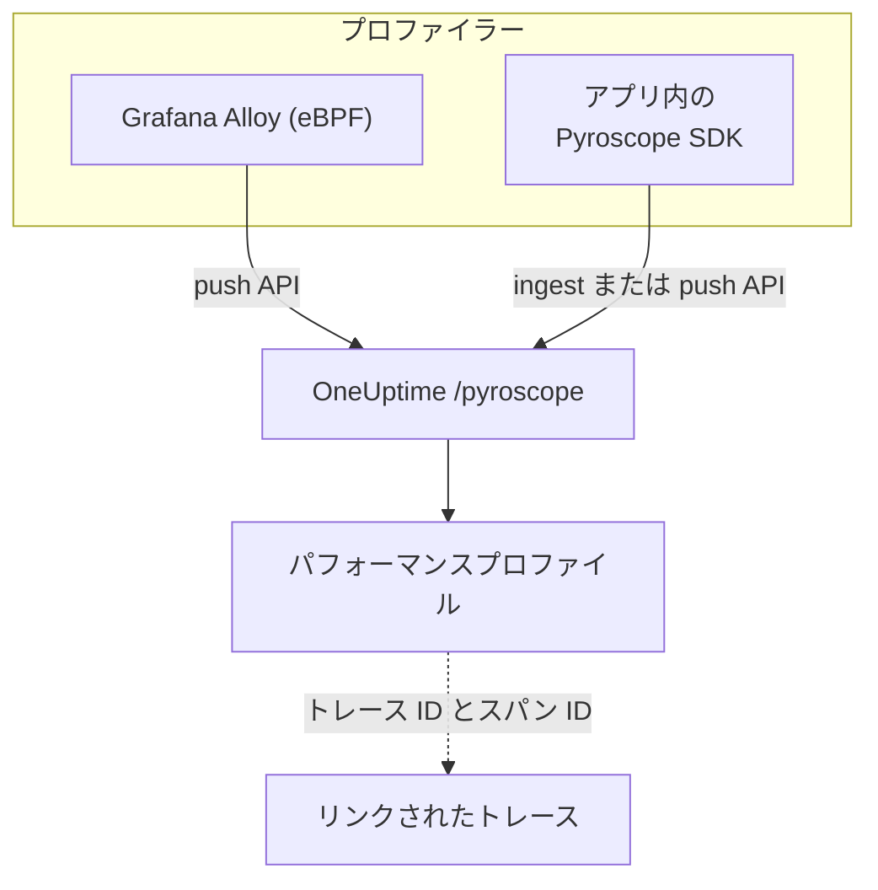

# 継続的プロファイリング

継続的プロファイリングは、アプリケーションが CPU 時間とメモリを何に使っているかを関数単位で示します。OneUptime は **Pyroscope 互換の取り込み API** を提供しているため、Pyroscope サーバーに送信できるもの (Grafana Alloy の eBPF プロファイラーや各言語の Pyroscope SDK) なら OneUptime にも送信でき、その結果をログ、メトリクス、トレースの横でフレームグラフとして確認できます。

:::cards
- [プロファイルを送る](#プロファイルを送る): eBPF を使う Grafana Alloy、またはアプリ内の Pyroscope SDK。
- [取り込みエンドポイント](#取り込みエンドポイント): ベース URL と、キーを渡す 3 つの方法。
- [動作を確認する](#動作を確認する): キー、ページ、アップロードの状態を確認します。
- [プロファイルを調べる](#oneuptime-でプロファイルを調べる): フレームグラフ、上位の関数、比較、トレースへのリンク。
:::

## しくみ

プロファイラーはプロセスをサンプリングし、数秒ごとに取り込みキーを付けて OneUptime の `/pyroscope` エンドポイントにプロファイルをアップロードします。OneUptime は各プロファイルをそれが指すサービスの下に保存し、**パフォーマンスプロファイル** にフレームグラフとして描画します。



## 始める前に

**サーバー** タイプのテレメトリ取り込みキーが必要です。まだない場合は次の手順で作成します。

:::steps
### 取り込みキーを開く

**製品 → プロジェクト設定** を開き、サイドメニューで **テレメトリと APM** を開いて **取り込みキー** を選びます。


### キーを作成する

**取り込みキーを作成** をクリックします。ダイアログではキーの名前が入力済みで、**サーバー** が選ばれています (アプリケーションやコレクターが送信に使う種類のキーです)。そのまま **取り込みキーを作成** をクリックして作成するか、先に名前を変更します。

### シークレットをコピーする

新しいキーが専用のページで開きます。**シークレットキー** をコピーしてください。これが、以下の例で `YOUR_ONEUPTIME_INGESTION_TOKEN` と呼んでいる取り込みトークンです。


:::

## 取り込みエンドポイント

| 設定 | 値 |
| --- | --- |
| ベース URL (Pyroscope サーバーのアドレス) | `https://oneuptime.com/pyroscope` |
| 認証ヘッダー | `x-oneuptime-token: YOUR_ONEUPTIME_INGESTION_TOKEN` |

クライアントはベース URL に独自のパスを付け加えます (ほとんどの Pyroscope SDK は `/ingest`、Grafana Alloy と v0.14 以降の .NET SDK は `/push.v1.PusherService/Push`)。そのため、設定するのは常にベース URL だけで、末尾のスラッシュは付けません。

OneUptime は次のいずれからでも取り込みトークンを読み取ります。クライアントが対応している方法を使ってください。

| 方法 | 使う場面 |
| --- | --- |
| `x-oneuptime-token` ヘッダー | カスタムヘッダーを追加できるクライアント。 |
| `Authorization: Bearer <token>` | `authToken` / `auth_token` オプションを持つ SDK。これが送信される形式です。 |
| HTTP Basic 認証。トークンを **パスワード** にする (ユーザー名は任意) | Basic 認証のユーザーとパスワードしか指定できないクライアント。 |

> [!NOTE]
> OneUptime をセルフホストしている場合は、`https://oneuptime.com` を自分のホストに置き換えてください。例: `https://YOUR-ONEUPTIME-HOST/pyroscope`。

## 対応しているプロファイル形式

| 形式 | 送信元 | 対応 |
| --- | --- | --- |
| pprof (バイナリの protobuf。gzip 圧縮も可) | Go、Node.js、.NET の Pyroscope SDK、Grafana Alloy | はい |
| folded / collapsed テキスト | Python、Ruby、Rust の Pyroscope SDK (既定のアップロード形式) | はい |
| JFR (Java Flight Recorder) | Pyroscope の Java エージェント | まだ未対応。Java のサービスには Grafana Alloy を使ってください |

## プロファイルを送る

Grafana Alloy はコードを変更せずにホスト上のすべてのプロセスをプロファイリングするので、最初はこれがおすすめです。Pyroscope SDK は、アプリケーションの中で動作します。

:::tabs
@tab Grafana Alloy
[Grafana Alloy](https://grafana.com/docs/alloy/latest/) は、eBPF を使って Linux ホスト上のすべてのプロセスから CPU プロファイルを収集します。アプリケーション内のエージェントもコードの変更も不要です。Go、Rust、C/C++、Java、Python、Ruby、PHP、Node.js、.NET に対応しています。

Alloy の設定を作成します。

```hcl title="alloy-config.alloy"
discovery.process "all" {
  refresh_interval = "60s"
}

discovery.relabel "alloy_profiles" {
  targets = discovery.process.all.targets

  rule {
    action       = "replace"
    source_labels = ["__meta_process_exe"]
    target_label  = "service_name"
  }
}

pyroscope.ebpf "default" {
  targets    = discovery.relabel.alloy_profiles.output
  forward_to = [pyroscope.write.oneuptime.receiver]

  collect_interval = "15s"
  sample_rate      = 97
}

pyroscope.write "oneuptime" {
  endpoint {
    url = "https://oneuptime.com/pyroscope"
    headers = {
      "x-oneuptime-token" = "YOUR_ONEUPTIME_INGESTION_TOKEN",
    }
  }
}
```

Docker で実行します。eBPF には、ホストの PID 名前空間を使う特権コンテナが必要です。

```yaml title="docker-compose.yml"
services:
  alloy:
    image: grafana/alloy:latest
    privileged: true
    pid: host
    volumes:
      - ./alloy-config.alloy:/etc/alloy/config.alloy
      - /proc:/proc:ro
      - /sys:/sys:ro
    command:
      - run
      - /etc/alloy/config.alloy
```

または、ホスト上で直接実行します。

```bash
alloy run alloy-config.alloy
```

relabel ルールにより、各プロファイルのサービス名にはプロセスの実行ファイル名が付きます。
@tab Go
Go の SDK は pprof をアップロードします。サーバーアドレスを OneUptime のベース URL に向け、取り込みトークンを認証トークンとして渡します。

```go
import "github.com/grafana/pyroscope-go"

pyroscope.Start(pyroscope.Config{
    ApplicationName: "my-service",
    ServerAddress:   "https://oneuptime.com/pyroscope",
    AuthToken:       "YOUR_ONEUPTIME_INGESTION_TOKEN",
    ProfileTypes: []pyroscope.ProfileType{
        pyroscope.ProfileCPU,
        pyroscope.ProfileAllocObjects,
        pyroscope.ProfileAllocSpace,
        pyroscope.ProfileInuseObjects,
        pyroscope.ProfileInuseSpace,
        pyroscope.ProfileGoroutines,
    },
})
```
@tab Node.js
Node.js の SDK は pprof をアップロードします。

```javascript
const Pyroscope = require("@pyroscope/nodejs");

Pyroscope.init({
  serverAddress: "https://oneuptime.com/pyroscope",
  appName: "my-service",
  authToken: "YOUR_ONEUPTIME_INGESTION_TOKEN",
});

Pyroscope.start();
```
@tab Python
Python の SDK は folded テキストをアップロードします。

```python
import pyroscope

pyroscope.configure(
    application_name="my-service",
    server_address="https://oneuptime.com/pyroscope",
    auth_token="YOUR_ONEUPTIME_INGESTION_TOKEN",
)
```
@tab .NET
Pyroscope の .NET プロファイラーはネイティブの CLR プロファイラーで、コードの変更は不要です。環境変数だけで有効にします。[pyroscope-dotnet releases](https://github.com/grafana/pyroscope-dotnet/releases) から、イメージに合ったリリース (`glibc` または Alpine 用の `musl`、`x86_64` または `aarch64`) をダウンロードし、ランタイムに読み込みます。

```dockerfile title="Dockerfile"
FROM alpine:3.20 AS pyroscope-profiler
ARG PYROSCOPE_DOTNET_VERSION=1.5.1
ADD https://github.com/grafana/pyroscope-dotnet/releases/download/pyroscope-${PYROSCOPE_DOTNET_VERSION}/pyroscope.${PYROSCOPE_DOTNET_VERSION}-glibc-x86_64.tar.gz /tmp/pyroscope.tar.gz
RUN mkdir -p /pyroscope && tar -xzf /tmp/pyroscope.tar.gz -C /pyroscope

FROM mcr.microsoft.com/dotnet/aspnet:10.0
# ... your application ...
COPY --from=pyroscope-profiler /pyroscope /pyroscope
ENV CORECLR_ENABLE_PROFILING=1
ENV CORECLR_PROFILER={BD1A650D-AC5D-4896-B64F-D6FA25D6B26A}
ENV CORECLR_PROFILER_PATH=/pyroscope/Pyroscope.Profiler.Native.so
ENV LD_PRELOAD=/pyroscope/Pyroscope.Linux.ApiWrapper.x64.so
ENV LD_LIBRARY_PATH=/pyroscope
```

次に、たとえば Kubernetes / Helm の環境で OneUptime に向けます。

```bash
PYROSCOPE_APPLICATION_NAME=my-service
PYROSCOPE_PROFILING_ENABLED=1
PYROSCOPE_SERVER_ADDRESS=https://oneuptime.com/pyroscope
PYROSCOPE_BASIC_AUTH_USER=oneuptime
PYROSCOPE_BASIC_AUTH_PASSWORD=YOUR_ONEUPTIME_INGESTION_TOKEN
```

取り込みトークンは Basic 認証のパスワードに入れます。ユーザー名は空でなければ何でもかまいませんが、両方が設定されていないとプロファイラーは認証情報をまったく送信しません。代わりにトークンをヘッダーで送るには、`PYROSCOPE_HTTP_HEADERS={"x-oneuptime-token":"YOUR_ONEUPTIME_INGESTION_TOKEN"}` を設定します。

トークンの渡し方はプロファイラーのリリースによって異なります。1.5 以降は `PYROSCOPE_AUTH_TOKEN` を無視するため、古いリリースからアップグレードしてこの設定を残していると、すべてのアップロードが `401` で拒否されます。

| pyroscope-dotnet のリリース | アップロード先 | トークンの設定 |
| --- | --- | --- |
| v0.13 以前 | `/pyroscope/ingest` | `PYROSCOPE_AUTH_TOKEN` |
| v0.14 から 1.4 | `/pyroscope/push.v1.PusherService/Push` | `PYROSCOPE_AUTH_TOKEN` |
| 1.5 以降 | `/pyroscope/push.v1.PusherService/Push` | `PYROSCOPE_BASIC_AUTH_USER=oneuptime` と `PYROSCOPE_BASIC_AUTH_PASSWORD=<token>` (両方の設定が必要)、または `PYROSCOPE_HTTP_HEADERS={"x-oneuptime-token":"<token>"}` |

1.0 より前のリリースのタグは `pyroscope-<version>` ではなく `v<version>-pyroscope` です (例: `https://github.com/grafana/pyroscope-dotnet/releases/download/v0.13.0-pyroscope/pyroscope.0.13.0-glibc-x86_64.tar.gz`)。プロファイラーの GUID とファイル名はどのリリースでも同じです。

CPU プロファイリングは既定で有効です。実時間、メモリ割り当て、例外、ロック競合のプロファイリングはオプトインで、`PYROSCOPE_PROFILING_WALLTIME_ENABLED`、`PYROSCOPE_PROFILING_ALLOCATION_ENABLED`、`PYROSCOPE_PROFILING_EXCEPTION_ENABLED`、`PYROSCOPE_PROFILING_LOCK_ENABLED` を `true` にします。静的なラベルは `PYROSCOPE_LABELS` (`key:value,key:value`) に指定します。

プロファイラーは 15 秒ごとにアップロードし、アップロードを圧縮 **しない** ため、負荷の高いサービスでは 1 回のアップロードが数 MB になることがあります。OneUptime 自身のイングレスは `/pyroscope` で最大 16 MB を受け付けます。OneUptime の前に別のプロキシ (たとえば `proxy-body-size` の既定値が 1 MB の ingress-nginx) がある場合は、そのプロキシでも `/pyroscope` のサイズ上限を引き上げてください。そうしないと、大きなアップロードは OneUptime に届く前に `413` で拒否されます。
@tab Java
Pyroscope の Java エージェントは JFR 形式でプロファイルをアップロードしますが、OneUptime はまだこの形式を取り込めません。代わりに Grafana Alloy (**Grafana Alloy** タブ) で Java のサービスをプロファイリングしてください。エージェントもコードの変更もなしに JVM の CPU プロファイルを取得できます。
:::

**Ruby** と **Rust** は Go、Node.js、Python と同じように動作します。[各言語の Pyroscope SDK](https://grafana.com/docs/pyroscope/latest/configure-client/) をインストールし、サーバーアドレスを `https://oneuptime.com/pyroscope` に設定して、取り込みトークンを認証トークンとして渡します (SDK のバージョンが Basic 認証しか提供しない場合は、Basic 認証のパスワードとして渡します)。

## 対応しているプロファイルの種類

pprof は複数のサンプルタイプを宣言できます。アップロードされた各プロファイルはそのうちの 1 つで保存されます。CPU 時間 (ナノ秒単位の `cpu`) があればそれを、なければ実時間、次に使用中のバイト数、次に割り当てられたバイト数、それもなければ最初に宣言された型を使います。どの型も保存して表示できますが、次の型には OneUptime で専用のグループ化、単位、表示名が用意されています。

| プロファイルの種類 | 表示名 | 単位 |
| --- | --- | --- |
| `cpu`、`samples` | CPU 時間 | ナノ秒 |
| `wall` | 実時間 | ナノ秒 |
| `inuse_space`、`alloc_space`、`heap` | メモリ (バイト) | バイト |
| `inuse_objects`、`alloc_objects` | メモリ (オブジェクト数) | 件数 |
| `mutex`、`contention`、`block` | ロック競合 | ナノ秒 |
| `goroutine` | Goroutines (Go) | 件数 |

それ以外 (たとえば独自のサンプルタイプ) は、元の名前のまま「その他」に表示されます。

## 動作を確認する

:::steps
### トークンを確認する

取り込みエンドポイントは、トークンがない、または無効な場合に `401` を返しますが、ほとんどのプロファイラーはそれを目に付く場所に表示しません (たとえば .NET プロファイラーは HTTP 応答を debug レベルでしか記録しません)。検証エンドポイントに直接問い合わせてください。

```bash
curl -i -H "x-oneuptime-token: YOUR_ONEUPTIME_INGESTION_TOKEN" \
  https://oneuptime.com/otlp/v1/validate
```

有効なトークンは `200` と `{"valid": true, ...}` を返し、その `keyType` は `Server` である必要があります。ブラウザー用のキーも有効ですが、プロファイルは送信できません。不明、失効、無効化、期限切れのトークンは `401` を返します。

### プロファイルのページを開く

OneUptime のダッシュボードで **製品 → パフォーマンスプロファイル** を開きます。Alloy の収集間隔 15 秒 (または SDK のアップロード間隔 10 から 15 秒) なら、エージェントの起動から 1、2 分以内に最初のプロファイルとフレームグラフが表示されます。

### サービスを確認する

プロファイルは、SDK の `application_name` / `appName` / `PYROSCOPE_APPLICATION_NAME` が示すテレメトリサービスに紐付けられます (上記の Alloy の relabel ルールでは、プロセスの実行ファイル名が使われます)。

### それでも表示されない場合はアップロードの状態を見る

.NET プロファイラーでは、アプリケーションに `DD_TRACE_DEBUG=1` を 1 分間設定します。すると、アップロードごとに `PyroscopePprofSink <status>` の行が記録されます。`200` は OneUptime が受け付けたこと、`401` はトークンの問題、`404` はたいてい `PYROSCOPE_SERVER_ADDRESS` に `/pyroscope` のサフィックスがないこと、`413` は OneUptime の前にあるプロキシがアップロードのサイズを理由に拒否したことを意味します ([プロファイルを送る](#プロファイルを送る) の **.NET** タブを参照)。OneUptime をセルフホストしている場合は、イングレス (nginx) のアクセスログにも、`/pyroscope` へのすべてのリクエストについて同じ状態が記録されます。
:::

## OneUptime でプロファイルを調べる

**製品 → パフォーマンスプロファイル** を開くと、サービス全体で時間がどこに使われているかの概要が表示され、**すべてのプロファイル** にはすべてのアップロードが一覧表示されます。分析する対象を選びます。**すべて**、**CPU 時間**、**メモリ**、**ロック**、または **実時間** や **Goroutines** のような特定の種類です。

プロファイルのページには 3 つのビューがあります。

| ビュー | 表示内容 |
| --- | --- |
| **フレームグラフ** | 各バーはコールスタック内の関数で、その幅は消費した時間やリソースに比例します。関数をクリックするとズームし、呼び出し元と呼び出し先を確認できます。 |
| **上位の関数** | プロファイル内の関数を、自身の時間または合計時間の順に並べます。**自分のコードのみ** でライブラリのフレームを隠せます。 |
| **Diff vs. baseline** | プロファイルを過去の期間 (**1 時間前との比較**、**昨日との比較**、**先週との比較**) と比べ、**最も悪化した** 関数と **最も改善した** 関数を示します。 |

**pprof をダウンロード** すると、`go tool pprof` などのローカルツールで使うためにプロファイルを保存できます。

### トレースとの関連付け

プロファイルがトレース ID とスパン ID を持っている場合 (たとえばサンプルラベルの `trace_id` / `span_id`)、遅いトレースのスパンから対応する CPU やメモリのプロファイルへ直接移動して、そのとき実行されていたコードを正確に把握できます。**リンクされたトレースを開く** は逆方向の移動です。

スパンの **プロフィール** タブには、その下にネストされたスパンに紐付いたサンプルも含まれます。プロファイラーは、リクエストの CPU 時間をリクエストのスパンそのものではなく子スパンに割り当てることが多いためです。

## データ保持

プロファイルは、プロジェクトのテレメトリの保持期間に従って保持されます。**プロジェクト設定 → テレメトリと APM → データ保持** で **デフォルトの保持期間（日数）** を設定でき、変更しない限り 15 日です。保持期間が終わると、データは自動的に削除されます。保持期間の上書きを含むプランでは、プロファイルをほかのテレメトリより長く、または短く保持したり、サービスの **設定** ページでサービスごとに保持期間を設定したりできます。

## 次のステップ

:::cards
- [プロファイル モニター](/docs/monitor/profiles-monitor): サービスが送るプロファイルの件数と種類でアラートを出します。
- [OpenTelemetry](/docs/telemetry/open-telemetry): プロファイルのリンク先となるトレースを送ります。
- [Kubernetes エージェント](/docs/telemetry/kubernetes-agent): エージェントの eBPF プロファイラーでクラスター全体をプロファイリングします。
:::
