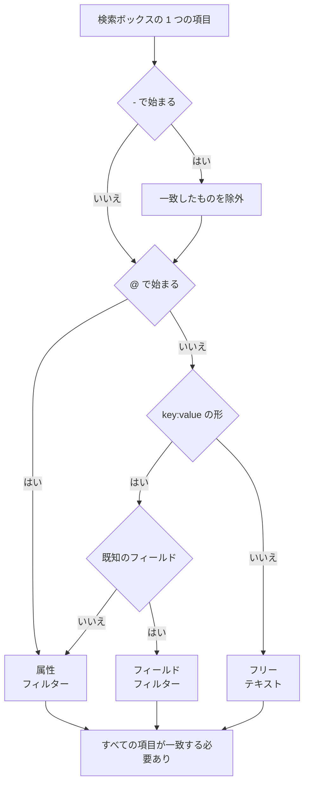

# 検索構文

ログ、トレース、メトリクス、例外の各エクスプローラーの上にある検索ボックスは、1 つのクエリ言語を使います。クエリはスペースで区切ったフィルターの並びで、**すべてのフィルターが一致する必要があります**。フィルター同士の間に暗黙の OR はありません。検索するときのリファレンスとしてこのページを使ってください。

:::cards
- [2 種類のフィルター](#2-種類のフィルター): 組み込みフィールド、属性、フリーテキスト。
- [値の一致](#値の一致): ワイルドカード、「含む」、比較、リスト。
- [除外](#除外): 先頭に `-` を付けると、どのフィルターも反転できます。
- [シグナル別のフィールド](#シグナル別のフィールド): 各エクスプローラーで絞り込める項目。
:::

## クエリの読まれ方

```text
severity:error @platform.team:a* -@http.method:GET timeout
```

これは「error レベルのログのうち、`platform.team` 属性が `a` で始まり、`http.method` 属性が `GET` ではなく、メッセージに `timeout` を含むもの」と読まれます。

| 項目 | 種類 | 一致する条件 |
| --- | --- | --- |
| `severity:error` | フィールド | ログの重大度が Error。 |
| `@platform.team:a*` | 属性 | `platform.team` 属性が `a` で始まる。 |
| `-@http.method:GET` | 除外する属性 | `http.method` 属性が `GET` 以外。 |
| `timeout` | フリーテキスト | メッセージに `timeout` を含む。 |

スペースで区切られた各項目は個別に読まれ、そのあとすべてが AND で結合されます。



## 2 種類のフィルター

| 形式 | 絞り込む対象 | 例 |
| --- | --- | --- |
| `field:value` | シグナルの組み込みフィールド | `severity:error` |
| `@attribute:value` | 行の OpenTelemetry 属性 | `@http.status_code:500` |
| 単語だけ | メッセージ (ログ)、スパン名 (トレース)、メトリクス名 (メトリクス)、例外メッセージ (例外) | `connection refused` |

キーが既知のフィールドではない `key:value` は属性として扱われるため、`k8s.pod:api-0` と `@k8s.pod:api-0` は同じ意味です。`@` を前に付けると常に「属性を探す」という意味になりますが、例外が 1 つあります。例外エクスプローラーでは、`@type:`、`@service:`、`@env:`、`@class:` は引き続きそれぞれのフィールドを絞り込みます。

たまたまコロンを含むだけのテキストはテキストのままです。`https://example.com` や `12:30` はフィルターとして読まれず、単語として検索されます。

## 値の一致

この表の書き方は、どの属性にも、ほとんどの組み込みフィールドにも使えます。値をより単純に読むフィールドは [シグナル別のフィールド](#シグナル別のフィールド) に記載しています。

| 入力 | 一致するもの |
| --- | --- |
| `@k:abc` | ちょうど `abc` |
| `@k:a*` | `a` で始まるもの: `abc`、`alpha` |
| `@k:*c` | `c` で終わるもの |
| `@k:a*c` | `a` で始まり `c` で終わる |
| `@k:a?c` | `?` はちょうど 1 文字: `abc`、`axc` は一致し、`ac` は一致しない |
| `@k:*` | 属性があり、空ではない |
| `@k:~abc` | どこかに `abc` を含む |
| `@k:!abc` | `abc` 以外すべて |
| `@k:>100` | 100 より大きい。`>=`、`<`、`<=` も使える |
| `@k:(a OR b)` | どちらかの値。`@k:[a, b]` も同じ |
| `@k:(a* OR b*)` | どちらかのパターン |

ワイルドカードと「含む」の一致は大文字と小文字を区別しません。完全一致は保存されたとおりの値と比較するため、区別します。

### スペースを含む値

値をダブルクォートで囲みます。

```text
name:"SELECT wp_options"
@k8s.container.name:"my container"
```

クォートが守るのは **スペース** で、ワイルドカードではありません。`@k:"a b*"` は引き続き `a b` で始まるものに一致します。

### `*`、`?` などの記号をそのまま使う

バックスラッシュを付けると、次の 1 文字が文字どおりの意味になります。

| 入力 | 一致するもの |
| --- | --- |
| `@k:a\*b` | ちょうど `a*b` |
| `@k:\~abc` | ちょうど `~abc` |
| `@k:\>5` | ちょうど `>5` |

`%` や `_` を含む値はエスケープ不要です。これらは常に文字どおりに扱われます。

## 除外

先頭の `-` は、上で紹介したものも含めて、どのフィルターも反転させます。

| 入力 | 一致するもの |
| --- | --- |
| `-severity:debug` | debug 以外すべて |
| `-@platform.team:a*` | `platform.team` が `a` で始まら **ない** もの。`platform.team` をまったく持たない行も含む |
| `-@k:*` | 属性がない、または空 |
| `-@k:(a OR b)` | どちらの値でもない |
| `-@k:>100` | 100 以下 |
| `-@k:~abc` | `abc` を含まない |

トレースエクスプローラーでは、`-` で除外できるのは属性だけです。`-status:error` はスパン名から探すテキストとして読まれ、何も見つかりません。代わりに、欲しい値を `status:(ok OR unset)` のように指定してください。

## シグナル別のフィールド

フィールド名は大文字と小文字を区別しません。`statusMessage:` と `statusmessage:` は同じフィールドです。

### ログ

| フィールド | 別名 | 備考 |
| --- | --- | --- |
| `severity` | `level` | `fatal`、`error`、`warning` (または `warn`)、`info` (または `information`)、`debug`、`trace`、`unspecified`。大文字小文字は問わない |
| `service` | | サービス名。省略せずに書く。大文字小文字は問わない |
| `trace` | | トレース ID |
| `span` | | スパン ID |
| `message` | `msg`、`log`、`body` | ログの行。単語だけの項目もここを検索する |

### トレース

トレースのフィールドには単純な値か `status:(ok OR unset)` のようなリストを指定でき、`duration` には `>` と `<` も使えます。ワイルドカード、`~`、`!`、先頭の `-` は、ここでは属性にしか効きません。

| フィールド | 備考 |
| --- | --- |
| `service` | サービス名 |
| `name` | スパン名。値が 1 つなら名前のどの部分にも一致する。単語だけの項目もここを検索する |
| `status` | `ok`、`error`、`unset` (unset = エラーステータスは設定されていません、OpenTelemetry のデフォルト) |
| `kind` | `server`、`client`、`producer`、`consumer`、`internal` |
| `duration` | ミリ秒: `duration:>500`、`duration:<200`、または正確な値 |
| `statusMessage` | ステータスメッセージのテキスト。値が 1 つならどの部分にも一致する |
| `hasException` | `true` または `false` |
| `trace`、`span` | ID |

### メトリクス

| フィールド | 備考 |
| --- | --- |
| `name` | メトリクス名。単純な値は名前のどの部分にも一致するため、`name:http.server` で `http.server.request.duration` が見つかる。単語だけの項目もここを検索する |
| `service` | サービス名。単純な値は名前のどの部分にも一致する |

### 例外

| フィールド | 別名 | 備考 |
| --- | --- | --- |
| `type` | `exceptionType` | 例外の種類。例: `type:TypeError` |
| `env` | `environment` | 環境。リソース属性 `deployment.environment` から取得 |
| `service` | | サービス名。単純な値は名前のどの部分にも一致する |
| `class` | `errorClass` | 誰の責任のエラーか: `code-fault`、`user-error`、`expected-denial`、`infrastructure`、`unknown` |

単語だけの項目は例外メッセージを検索します。

**セキュリティイベント** のエクスプローラーも同じ言語を使い、`severity`、`tactic`、`user` など独自のフィールドを持ちます。[セキュリティイベント](/docs/telemetry/security-events) を参照してください。

## フィルターの組み合わせ

フィルターは AND で結合されます。間に `AND` を書いてもかまいませんが、意味は変わりません。

```text
severity:error service:api          # both must hold
severity:error AND service:api      # identical
```

フィルターの **間** には OR も NOT もありません。そこに書いた `OR` と `NOT` は読み飛ばされるため、`NOT severity:debug` は `severity:debug` と同じ意味になります。除外するには先頭に `-` を付け (`-severity:debug`)、同じキーの 2 つの値のどちらかに一致させるにはリスト形式を使います。

```text
@http.method:(GET OR POST)
```

同じキーへの 2 つのフィルターは AND で結合されます。範囲や両端を持つパターンはこう書きます。

```text
@http.status_code:>=500 @http.status_code:<=599
@k:a* @k:*z
```

## チップと検索ボックス

`key:value` の項目で Enter を押すと、その項目が適用されます。たいていは結果の上にチップとして表示されます。チップは入力したとおりの値を保持するので、ワイルドカードはワイルドカードのままです。除外の `-key:value` など、チップにできない項目は検索ボックスに残り、そこから絞り込みます。ファセットのサイドバーで値をクリックすると、同じ種類のチップが値をエスケープした状態で追加されます。たまたま `*` を含む保存値は、パターンではなくその値そのもので絞り込まれます。

チップは保存したビューとページの URL に含まれるため、フィルターは再読み込み、ブックマーク、共有したリンクでも保たれます。

## 知っておくと便利なこと

- 属性の **キー** は、ワイルドカード、「含む」、前方一致、後方一致のフィルターでは大文字と小文字を区別せずに照合されます。取り込まれたのが `requestId` か `requestid` かを覚えておく必要はありません。
- `-@k:...` フィルターは、その属性を一度も持たなかった行にも一致します。`platform.team` をまったく持たない行は、当然 `a` で始まりません。
- 数値の比較は、テキストとして保存された属性値にも使えます。数値ではない値は比較を満たしません。

## 次のステップ

:::cards
- [時間範囲にズームインする](/docs/telemetry/charts-and-time-ranges): エクスプローラーを重要な瞬間に絞り込みます。
- [ログパイプライン](/docs/telemetry/log-pipelines): ログ行の一部を検索できる属性に変えます。
- [ログ モニター](/docs/monitor/logs-monitor): 検索しているログが現れたらアラートを出します。
- [OpenTelemetry](/docs/telemetry/open-telemetry): 検索対象のログ、メトリクス、トレースを送ります。
:::
