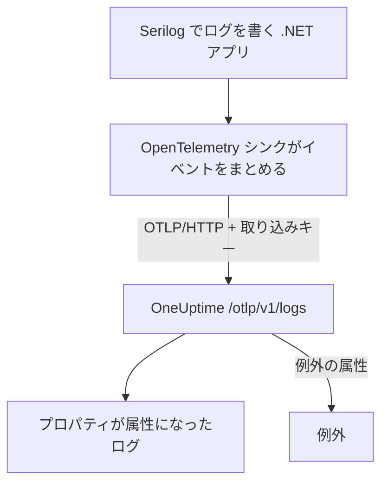

# Serilog (.NET)

[Serilog](https://serilog.net) は .NET で最も広く使われている構造化ログのライブラリです。公式の [`Serilog.Sinks.OpenTelemetry`](https://github.com/serilog/serilog-sinks-opentelemetry) シンクを使うと、アプリケーションが Serilog で記録するすべてのイベントが OpenTelemetry Protocol (OTLP) で OneUptime に送られ、構造化プロパティ、重大度、トレースとの関連付けとともに **製品 → ログ** で検索できるようになります。

OneUptime 専用のパッケージは不要です。シンクは、OneUptime がすべての OpenTelemetry データ向けに公開している同じ OTLP エンドポイントと通信します。コンソールアプリ、ワーカーサービス、ASP.NET Core アプリなど、.NET で動くものなら何でも使えます。

:::cards
- [シンクを設定する](#シンクを設定する): 2 つのパッケージをインストールし、コードまたは `appsettings.json` で構成します。
- [例外](#例外): 記録された例外は、例外の課題になります。
- [トラブルシューティング](#トラブルシューティング): ログが届かないときに確認すること。
:::

## 仕組み



シンクはログイベントをまとめて、バックグラウンドで送信します。名前付きプロパティはそれぞれログの属性になり、Serilog で記録した例外は、OneUptime が課題に変える属性を付けて届きます。

## 始める前に

- OneUptime プロジェクト。OneUptime Cloud では、テレメトリは取り込んだ GB 単位で課金されます ([料金](https://oneuptime.com/pricing) を参照)。また Free プランのプロジェクトは、テレメトリを送る前に支払い方法を登録する必要があります。
- Serilog を使っている、または使える .NET アプリケーション。
- ログを認証するためのテレメトリ取り込みキー。まだない場合は次の手順で作成します。

:::steps
### 取り込みキーを開く

**製品 → プロジェクト設定** に移動し、サイドメニューで **テレメトリと APM** を開いて **取り込みキー** を選びます。


### キーを作成する

**取り込みキーを作成** をクリックします。ダイアログにはキーの名前が入力済みで、**サーバー** (アプリケーションや Collector が送信に使う種類のキー) が選ばれているので、そのまま **取り込みキーを作成** をクリックして作成するか、先に名前を変更します。

### シークレットをコピーする

新しいキーは専用のページで開きます。その **シークレットキー** をコピーしてください。これが下の例の `YOUR_TELEMETRY_INGESTION_TOKEN` です。


:::

## OneUptime から必要なもの

| 設定 | 値 |
| ------------- | ------------------------------------------------------------ |
| OTLP エンドポイント | `https://oneuptime.com/otlp` |
| 認証ヘッダー | `x-oneuptime-token: YOUR_TELEMETRY_INGESTION_TOKEN` |
| サービス名 | サービスを表示したい名前 (例: `my-service`) |

> [!NOTE]
> OneUptime をセルフホストしていますか? `https://oneuptime.com/otlp` を `https://YOUR-ONEUPTIME-HOST/otlp` (TLS を終端していない場合は `http://...`) に置き換えてください。ほかはすべて同じです。

プロトコルを `HttpProtobuf` にすると、シンクはエンドポイントに `/v1/logs` のパスを付け加えるので、実際の送信先 URL は `https://oneuptime.com/otlp/v1/logs` になります。指定するのはベースの `/otlp` エンドポイントだけです。

## シンクを設定する

:::steps
### NuGet パッケージをインストールする

Serilog と OpenTelemetry シンクをプロジェクトに追加します。

```bash
dotnet add package Serilog
dotnet add package Serilog.Sinks.OpenTelemetry
```

`appsettings.json` からシンクを構成する場合は、`Serilog.Settings.Configuration` も追加します。ASP.NET Core アプリでは、Serilog をホストとリクエストパイプラインに組み込む `Serilog.AspNetCore` を追加します。

```bash
dotnet add package Serilog.Settings.Configuration
dotnet add package Serilog.AspNetCore
```

### シンクを構成する

シンクの送信先を OneUptime の OTLP エンドポイントにし、プロトコルを `HttpProtobuf` に設定し、取り込みトークンをヘッダーとして渡し、ログに `service.name` を付けます。構成はコード、`appsettings.json`、または ASP.NET Core のホストで行えます。

:::tabs
@tab コードで
```csharp title="Program.cs"
using Serilog;
using Serilog.Sinks.OpenTelemetry;

Log.Logger = new LoggerConfiguration()
    .MinimumLevel.Information()
    .Enrich.FromLogContext()
    .WriteTo.Console() // optional: keep local logs too
    .WriteTo.OpenTelemetry(options =>
    {
        // Base OTLP endpoint. The sink appends /v1/logs automatically.
        options.Endpoint = "https://oneuptime.com/otlp";
        options.Protocol = OtlpProtocol.HttpProtobuf;

        // Authenticate with your OneUptime telemetry ingestion token.
        options.Headers = new Dictionary<string, string>
        {
            ["x-oneuptime-token"] = "YOUR_TELEMETRY_INGESTION_TOKEN"
        };

        // Identify your service in OneUptime.
        options.ResourceAttributes = new Dictionary<string, object>
        {
            ["service.name"] = "my-service",
            ["deployment.environment"] = "production"
        };
    })
    .CreateLogger();

try
{
    Log.Information("Application starting up");
    // ... your application code ...
}
finally
{
    // Flush any buffered logs before the process exits.
    Log.CloseAndFlush();
}
```
@tab appsettings.json
シンクの設定を `appsettings.json` に書きます。

```json title="appsettings.json"
{
  "Serilog": {
    "Using": ["Serilog.Sinks.OpenTelemetry"],
    "MinimumLevel": "Information",
    "WriteTo": [
      {
        "Name": "OpenTelemetry",
        "Args": {
          "endpoint": "https://oneuptime.com/otlp",
          "protocol": "HttpProtobuf",
          "headers": {
            "x-oneuptime-token": "YOUR_TELEMETRY_INGESTION_TOKEN"
          },
          "resourceAttributes": {
            "service.name": "my-service",
            "deployment.environment": "production"
          }
        }
      }
    ]
  }
}
```

次に、構成からロガーを作成します。

```csharp title="Program.cs"
using Serilog;
using Microsoft.Extensions.Configuration;

IConfiguration configuration = new ConfigurationBuilder()
    .AddJsonFile("appsettings.json")
    .Build();

Log.Logger = new LoggerConfiguration()
    .ReadFrom.Configuration(configuration)
    .CreateLogger();
```
@tab ASP.NET Core
ASP.NET Core (.NET 6 以降の最小ホスティング) では `Serilog.AspNetCore` を使います。これで Serilog が既定のロガーを置き換え、フレームワークとリクエストのログも記録します。

```csharp title="Program.cs"
using Serilog;
using Serilog.Sinks.OpenTelemetry;

var builder = WebApplication.CreateBuilder(args);

builder.Host.UseSerilog((context, services, configuration) =>
{
    configuration
        .ReadFrom.Configuration(context.Configuration)
        .Enrich.FromLogContext()
        .WriteTo.OpenTelemetry(options =>
        {
            options.Endpoint = "https://oneuptime.com/otlp";
            options.Protocol = OtlpProtocol.HttpProtobuf;
            options.Headers = new Dictionary<string, string>
            {
                ["x-oneuptime-token"] = "YOUR_TELEMETRY_INGESTION_TOKEN"
            };
            options.ResourceAttributes = new Dictionary<string, object>
            {
                ["service.name"] = "my-service"
            };
        });
});

var app = builder.Build();

// Logs one summary event per HTTP request.
app.UseSerilogRequestLogging();

app.MapGet("/", () => "Hello World");
app.Run();
```
:::

> [!IMPORTANT]
> シンクはログイベントをまとめて非同期に送信します。アプリケーションが終了する前に必ず `Log.CloseAndFlush()` を呼ぶ (またはロガーを破棄する) ようにしてください。そうしないと、最後のログのまとまりが失われることがあります。ASP.NET Core では、正常なシャットダウン時に `Serilog.AspNetCore` がこれを行います。

> [!TIP]
> トークンはソース管理に入れないでください。環境変数やシークレットストアから読み込み、起動時に構成に渡すようにし、`appsettings.json` にコミットしないでください。

### ログを書く

Serilog はいつもどおりに使います。構造化プロパティは保たれ、OneUptime で検索できる属性になります。

```csharp
Log.Information("Order {OrderId} placed by {CustomerId} for {Amount:C}",
    orderId, customerId, amount);

Log.Warning("Payment gateway slow: {LatencyMs}ms", latencyMs);
```

名前付きプロパティ (`OrderId`、`CustomerId`、`Amount`、`LatencyMs`) はそれぞれログの属性として送られるので、**製品 → ログ** のエクスプローラーで絞り込みや検索に使えます。

### ログが届くことを確認する

アプリケーションを実行して、いくつかログイベントを書きます。数秒後には **製品 → ログ** と、**製品 → サービス** のサービスのページに表示されます。サービス名は、設定した `service.name` (`my-service`) です。構造化プロパティはフィルターとして使えます。
:::

## 例外

Serilog で例外を記録すると、シンクはログレコードに OpenTelemetry の `exception.type`、`exception.message`、`exception.stacktrace` の属性を付けます。

```csharp
try
{
    ProcessPayment();
}
catch (Exception ex)
{
    Log.Error(ex, "Failed to process payment for order {OrderId}", orderId);
}
```

OneUptime はこれらの属性を検出し、エラーをフィンガープリントごとに **例外** の課題としてまとめ、正しいサービスに紐付けます。トレースとログの両方から報告されたエラーは 1 つの課題にまとめられます。検出の仕組みは [ログからの例外](/docs/telemetry/open-telemetry#ログからの例外) を参照してください。

## トレースとの関連付け

アプリケーションがトレース用の OpenTelemetry .NET SDK でも計装されている場合、アクティブなスパンの中で出力された Serilog のイベントには、現在の `TraceId` と `SpanId` が自動的に付きます (シンクの既定の `IncludedData` に含まれています)。これにより OneUptime はログ行を、それが発生したトレースに直接結び付けられるので、ログから周囲のリクエストへ、またその逆へと移動できます。

トレースとメトリクスも送るには、[OpenTelemetry のクイックスタート](/docs/telemetry/open-telemetry#クイックスタート) の .NET の設定を参照してください。

## トラブルシューティング

:::details ログが表示されない
`x-oneuptime-token` の値を確認し、表示中のプロジェクトのものであることを確かめてください。エンドポイントが `https://oneuptime.com/otlp` であることを確認します (ベースのパスだけで、`/v1/logs` は自分で付けません)。シンクが失敗する理由を見るには、起動時に `Serilog.Debugging.SelfLog.Enable(Console.Error)` で Serilog 自身のエラー出力をオンにします。OneUptime が返したステータスコードが表示されます。
:::

:::details アプリの終了時にしかログが表示されない、または最後のログが欠ける
シャットダウン時に `Log.CloseAndFlush()` が実行されるようにしてください。シンクはイベントをまとめて送るので、フラッシュせずにプロセスが強制終了されると、バッファー内のログは失われます。
:::

:::details 401 Unauthorized で、何も取り込まれない
キーがない、不明、または期限切れです。ヘッダー名が正確に `x-oneuptime-token` で、値がキーの **シークレットキー** であることを確認してください。
:::

:::details 402 または 422 で、何も取り込まれない
`402`: OneUptime Cloud で、プロジェクトが Free プランで支払い方法がありません。**プロジェクト設定 → 請求と請求書 → 請求** で追加してください。`422`: キーが無効化されているか、ブラウザーキーです。キーの設定で **有効** をオンに戻すか、**サーバー** キーを作成してください。
:::

:::details ログが間違ったサービス名で届く
`ResourceAttributes` (コード) または `resourceAttributes` (appsettings.json) に `service.name` を設定してください。設定がないと、ログはサービスの名前ではなく、シンクが代わりに送る仮の名前で保存されます。
:::

:::details セルフホストのインスタンスへの接続エラー
プロトコルがエンドポイントのスキーム (`https://` か `http://`) と合っていること、そしてアプリケーションから OneUptime のホストに到達できることを確認してください。
:::

ご質問やサポートが必要な場合は、support@oneuptime.com までご連絡ください。

## 次のステップ

:::cards
- [OpenTelemetry](/docs/telemetry/open-telemetry): .NET からトレースとメトリクスも送ります。
- [ログパイプライン](/docs/telemetry/log-pipelines): 届いたログを解析し、情報を付け加えます。
- [ログ モニター](/docs/monitor/logs-monitor): 一致するログが現れたらアラートを出します。
- [検索構文](/docs/telemetry/search-syntax): Serilog のプロパティで絞り込みます。
:::
