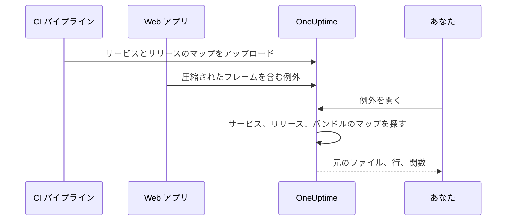

# ソースマップ

フロントエンドのビルドのソースマップを OneUptime にアップロードすると、**例外** に表示されるブラウザーの例外が、圧縮されたものではなく元のファイル名、行、関数で表示されます。このページは、すでにブラウザーのテレメトリを OneUptime に送っているフロントエンド開発者向けです。

:::cards
- [照合のしくみ](#照合のしくみ): サービス名、リリース、バンドルファイル。
- [ソースマップをアップロードする](#ソースマップをアップロードする): CI から `curl` リクエストを 1 回送るだけです。
- [上限](#上限): サイズ、件数、セルフホストでの設定。
- [解決済みのスタックトレースを見る](#解決済みのスタックトレースを見る): 解決されたフレームの表示。
:::

## 概要

本番環境のフロントエンドのバンドルは圧縮 (minify) されているため、OpenTelemetry の Web SDK で取得したブラウザーの例外は、次のようなスタックフレームで届きます。

```text
TypeError: Cannot read properties of undefined (reading 'id')
    at e.onSelect (https://app.example.com/assets/main.a8f1b2.js:1:48291)
```

ビルドのソースマップを OneUptime にアップロードすると、例外のダッシュボードがそれらのフレームを元のファイル、行、関数名に解決します。マップが `sourcesContent` 付きでビルドされていれば、元のソースコードの前後の行も表示されます。

マップは認証付きの API で OneUptime にアップロードされ、**サイトから取得されることはありません**。そのため、引き続き `hidden-source-map` (webpack) や `sourcemap: 'hidden'` (Vite / Rollup) でビルドし、`.map` ファイルをバンドルの横に公開しないようにできます (そうすべきです)。



## 照合のしくみ

ソースマップは 3 つのキーで保存されます。

| キー | 一致させる対象 |
|---|---|
| サービス名 | Web アプリがテレメトリの送信に使う OpenTelemetry のリソース属性 `service.name` |
| サービスバージョン | リソース属性 `service.version` (リリースの識別子) |
| バンドルのパス | マップの生成元になった圧縮ファイル。例: `main.a8f1b2.js` |

例外を開くと、OneUptime はその例外のサービスとリリースにアップロードされたマップを探し、各スタックフレームをファイル名でバンドルに照合し (パスの末尾が一致すれば十分で、`main.a8f1b2.js` は `https://app.example.com/assets/main.a8f1b2.js` に一致します)、圧縮された行と列をマップで解決します。解決は例外を表示したときに遅延して行われ、取り込み時には行われません。そのため、新しいリリースの最初のエラーの数分 *後* にアップロードしたマップも、さかのぼって適用されます。

## 始める前に

- **サーバー** タイプのテレメトリ取り込みキー。**プロジェクト設定 → テレメトリと APM → 取り込みキー** から作成します。[取り込みキーを作成する](/docs/telemetry/open-telemetry#取り込みキーを作成する) を参照してください。
- OpenTelemetry の Web SDK で、すでに OneUptime に例外を送っている Web アプリ。[ブラウザーのセットアップ](/docs/rum/browser-setup) を参照してください。
- ソースマップを出力するビルド。各フレームの周辺のソースを表示したい場合は、`sourcesContent` を含めます (ほとんどのバンドラーの既定値です)。

## ソースマップをアップロードする

:::steps
### テレメトリと一緒に `service.version` を送る

Web アプリは `service.version` を送る必要があり、それはマップのアップロードに使う文字列と同じでなければなりません。

```javascript
import { resourceFromAttributes } from "@opentelemetry/resources";

const resource = resourceFromAttributes({
  "service.name": "my-web-app",
  "service.version": "1.4.2", // same value you upload maps with
});
```

アップロードする `serviceVersion` とリソース属性 `service.version` が同じ文字列であれば、安定したリリース識別子なら何でもかまいません (セマンティックバージョン、git のコミット SHA、ビルド番号など)。

### 本番ビルドのたびにマップをアップロードする

CI から、取り込みキーを `x-oneuptime-token` ヘッダーに入れてアップロードします。

```bash
curl --fail -X POST "https://oneuptime.com/source-maps/v1/upload" \
  -H "x-oneuptime-token: YOUR_TELEMETRY_INGESTION_KEY" \
  -F "serviceName=my-web-app" \
  -F "serviceVersion=1.4.2" \
  -F "sourcemap=@dist/assets/main.a8f1b2.js.map" \
  -F "sourcemap=@dist/assets/vendor.9c3d4e.js.map"
```

セルフホストの場合は、`oneuptime.com` を自分の OneUptime のホストに置き換えてください。`x-oneuptime-token` ヘッダーの代わりに `Authorization: Bearer YOUR_KEY` も使えます。

### アップロードを確認する

アップロードに成功すると、保存されたマップの一覧を含む JSON 本文が返るので、CI でそれを検証できます。マップは OneUptime のサービスの **ソースマップ** ページにも一覧表示されます。
:::

一般的な CI のステップでは、ビルドが出力したすべてのマップをアップロードします。

```bash
VERSION="$(git rev-parse --short HEAD)"

find dist -name "*.js.map" -print0 | while IFS= read -r -d '' map; do
  curl --fail -X POST "https://oneuptime.com/source-maps/v1/upload" \
    -H "x-oneuptime-token: $ONEUPTIME_INGESTION_KEY" \
    -F "serviceName=my-web-app" \
    -F "serviceVersion=$VERSION" \
    -F "sourcemap=@$map"
done
```

### アップロードのルール

- アップロードした各ファイルのバンドルのパスは、ファイル名から末尾の `.map` を除いたものです。`main.a8f1b2.js.map` は `main.a8f1b2.js` になります。マップのファイル名がこの規則に従わない場合は、1 リクエストに 1 ファイルずつアップロードし、`bundlePath` フィールドを明示的に指定してください。
- 同じサービスとバージョンで同じバンドルを再アップロードすると、以前のマップが置き換えられます。CI の再試行は安全です。
- ファイルは [source map v3](https://tc39.es/ecma426/) の JSON である必要があります (最近のバンドラーはすべてこの形式を出力します。`sections` を持つインデックス付きマップにも対応しています)。
- セルフホストの運用者がテレメトリの取り込みを無効にしている (`DISABLE_TELEMETRY_INGESTION`) 場合、アップロードは空の成功応答を返し、何も保存されません。これは、このモードでのすべてのテレメトリ取り込みエンドポイントと同じ動作です。実際のアップロードは常に保存されたマップの一覧を含む JSON 本文を返すため、CI で両者を区別できます。

## 上限

`.map` ファイルは 1 つあたり最大 50 MB ですが、イングレスは **リクエスト本文全体** も 50 MB に制限しているため、大きなマップは 1 リクエストに 1 つずつアップロードしてください。1 リクエストで受け付けるファイルは最大 50 個で、1 つのリリース (サービス + バージョン) に保存できるマップは合計で最大 1,000 個です。これを超えるアップロードは、上限を示すメッセージとともに拒否されます。1 リクエストの上限を超える数のマップを出力するビルドは、単に複数のリクエストを送ってください。同じリリースへのアップロードは累積されます。

セルフホストではこれらの値を変更できます。5 つともふつうの環境変数で、Helm チャートでは `values.yaml` の `sourceMaps` で設定できます。

| `values.yaml` | 環境変数 | 既定値 |
| --- | --- | --- |
| `sourceMaps.maxMapsPerRelease` | `SOURCE_MAP_MAX_MAPS_PER_RELEASE` | `1000` |
| `sourceMaps.maxFilesPerRequest` | `SOURCE_MAP_MAX_FILES_PER_REQUEST` | `50` |
| `sourceMaps.maxFileSizeBytes` | `SOURCE_MAP_MAX_FILE_SIZE_BYTES` | `52428800` |
| `sourceMaps.maxBytesPerResolve` | `SOURCE_MAP_MAX_BYTES_PER_RESOLVE` | `536870912` |
| `sourceMaps.retentionDays` | `SOURCE_MAP_RETENTION_DAYS` | `90` |

ビルドが既定値を超える場合に引き上げるのは `maxMapsPerRelease` です。これは保存の形に関する上限にすぎません。解決にかかる負荷を制限するのはリリースのマップ数ではなく `maxBytesPerResolve` だからです。`maxFilesPerRequest` と `maxFileSizeBytes` は **下げる** ことしかできません。multipart の本文はリクエストの認証前に解析されるため、認証されていない呼び出し元にはその上にある共通の上限が適用され、より大きな値を指定しても適用されずに上限まで切り下げられます。

## 解決済みのスタックトレースを見る

ダッシュボードで **例外** の任意の例外を開きます。ソースマップで解決されたフレームには **ソースマップ適用済み** のバッジが付き、元の関数名とファイルの位置が表示されます。フレームを展開すると、圧縮された位置と並んで元のソースの抜粋 (マップに `sourcesContent` が含まれる場合) が表示されます。

サービスにアップロードしたマップは **製品 → サービス → 対象のサービス → ソースマップ** で確認、削除できます。各マップのリリース、バンドル、サイズ、アップロード日時が一覧表示されます。

## 保持期間

ソースマップはアップロードから 90 日間保持され、その後自動的に削除されます。マップが役に立つのは、そのリリースの例外がテレメトリの保持期間内にある間だけなので、この期間は、マップが読みやすくする例外よりも十分長く続きます。もう一度必要になったら、そのリリースのマップを再アップロードしてください。

## セキュリティ

- マップは認証付きのエンドポイントからアップロードされ、OneUptime のプロジェクトに保存されます。Web サイトから取得されることはないため、非公開のソースマップは非公開のままです。
- マップの生の内容 (`sourcesContent` 付きでビルドした場合は元のソースコードを含みます) を読み出せるのは、プロジェクトのオーナーと管理者、および **Read Telemetry Source Map** 権限を持つユーザーだけです。ほかのチームメンバーには、すでにアクセスできる例外について、解決済みのフレームと各クラッシュ箇所の周辺の数行だけが表示されます。
- サービスを削除すると、そのソースマップも削除されます。

## トラブルシューティング

:::details フレームが圧縮されたままになる
例外のリリースに一致するマップがありません。アプリが送る `service.version` がアップロードに使った `serviceVersion` と完全に一致しているか、`serviceName` が `service.name` と一致しているか、そのバンドルファイルのマップがアップロードされているかを確認してください。サービスの **ソースマップ** ページに、各マップのリリースとバンドルが一覧表示されます。
:::

:::details マップが大きすぎてアップロードが拒否される
1 つのマップは最大 50 MB で、リクエスト全体も同じく 50 MB までです。上の CI のループのように、大きなマップは 1 リクエストに 1 つずつアップロードしてください。
:::

## 次のステップ

:::cards
- [ブラウザーのセットアップ](/docs/rum/browser-setup): OpenTelemetry の Web SDK でブラウザーのトレースと例外を送ります。
- [例外モニター](/docs/monitor/exceptions-monitor): 新しい例外が発生したらアラートを出します。
- [OpenTelemetry](/docs/telemetry/open-telemetry): すべてのテレメトリのエンドポイント、キー、上限。
:::
