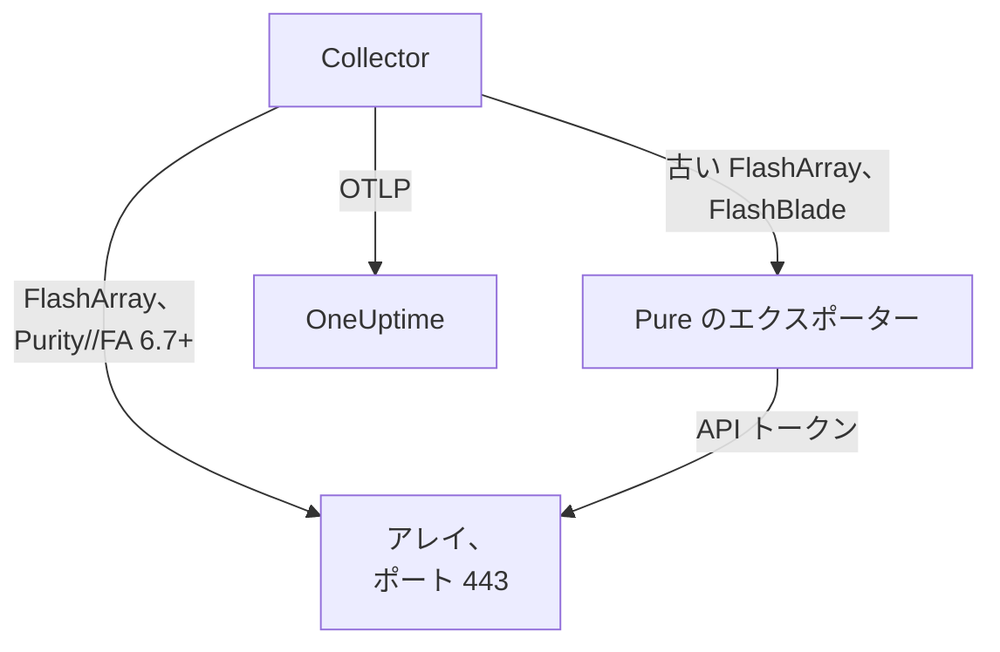

# ストレージアレイ エージェント

OneUptime の ストレージアレイ エージェントは、ストレージアレイを監視します。対象は容量とデータ削減、レイテンシ、IOPS と帯域幅、ボリューム、ホスト、ポッドとレプリケーション、ハードウェアのヘルス、ファイルシステム、バケット、クォータです。これは標準の OpenTelemetry Collector で、読み取り専用ユーザーの API トークンでアレイの OpenMetrics エンドポイントをスクレイプするか、Dell PowerScale クラスターのノードを SNMP でポーリングし、すべてのメトリクスにアレイの識別情報を付与して OneUptime に送信します。届いたデータには [ストレージアレイ モニター](/docs/monitor/storage-array-monitor) でアラートを出せます。

:::cards
- [エージェントをインストールする](#エージェントをインストールする): 読み取り専用ユーザー、続いてインストールスクリプトまたは Docker Compose。
- [Dell PowerScale](#dell-powerscale): クラスターの SNMP、全ノードのポーリング、そのページに表示されるもの。
- [エージェントが収集するもの](#エージェントが収集するもの): すべてのエンドポイントと、そこから作られるページ。
- [複数のアレイを監視する](#複数のアレイを監視する): アレイごとにエージェントを 1 つ、1 台のマシンで。
- [トラブルシューティング](#トラブルシューティング): 診断スクリプトと、よくある問題。
:::

## 仕組み

Storage Arrays は、どのベンダーでも同じように動作する製品です。対応しているのは次のとおりです:

| アレイ | `storage.system` | エージェントの読み取り方法 | Collector の設定 |
| --- | --- | --- | --- |
| **Pure Storage FlashArray**、Purity//FA 6.7 以降 | `purestorage.flasharray` | アレイ自身の OpenMetrics エンドポイント (`https://<array>/metrics/...?namespace=purefa`)。Collector の横では何も動きません | `otel-collector-config.yaml` (既定) |
| **Pure Storage FlashArray**、古い Purity//FA | `purestorage.flasharray` | Pure の FlashArray OpenMetrics エクスポーター。同じ Compose ファイルが `pure-fa-exporter` サービスとして実行します | `otel-collector-config.flasharray-exporter.yaml` |
| **Pure Storage FlashBlade** | `purestorage.flashblade` | Pure の FlashBlade OpenMetrics エクスポーター。同じ Compose ファイルが `pure-fb-exporter` サービスとして実行します | `otel-collector-config.flashblade.yaml` |
| **Dell PowerScale** (Isilon)、OneFS 8.0 以降 | `dell.powerscale` | 各ノードを SNMP で (Dell の ISILON-MIB)、Collector 自身の SNMP レシーバーで読み取ります。Collector の横では何も動きません | `otel-collector-config.powerscale.yaml` |

Pure Storage は 2026 年 2 月に社名を **Everpure** に変更しました。FlashArray、FlashBlade、Purity は名前を変えず、`purefa_*` と `purefb_*` のメトリクスも同じなので、このページの内容はどちらの名前で販売されたアレイにも当てはまります。

**Dell PowerScale** クラスターは別の方法で読み取ります。エージェントは各ノードを SNMP でポーリングし、読み取り専用コミュニティまたは SNMPv3 ユーザーを使い、API トークンは使いません。SNMP の有効化からページに表示されるものまでは [Dell PowerScale](#dell-powerscale) で説明します。以下のインストール手順は Pure Storage 用です。


```mermaid title="アレイから OneUptime へ"
flowchart TB
    collector["Collector"] -->|"FlashArray、<br/>Purity//FA 6.7+"| array["アレイ、<br/>ポート 443"]
    collector -->|"古い FlashArray、<br/>FlashBlade"| exporter["Pure のエクスポーター"]
    exporter -->|"API トークン"| array
    collector -->|"OTLP"| oneuptime["OneUptime"]
```

1 つのエージェントが監視するのは 1 つのアレイです。アレイごとにエージェントを 1 つ実行してください ([複数のアレイを監視する](#複数のアレイを監視する) を参照)。アレイは最初のデータで自身を登録します。その名前は、エージェントがすべてのメトリクスに `storage.array.name` として付与するものです。

## 始める前に

- Docker Engine 20.10 以降と Docker Compose v2 プラグイン。マシンは HTTPS (TCP 443) でアレイの管理インターフェイスに到達できる必要があります。
- アレイの管理者アカウント。組み込みの **readonly** ロールを持つユーザーと、その API トークンを作成するために使います。
- 取り込みキー。**プロジェクト設定 → テレメトリと APM → 取り込みキー** で作成し、その値をコピーします。

### エージェントを実行する場所

エージェントは HTTPS でアレイの管理インターフェイスと通信するため、Docker があり、TCP 443 で管理ネットワークへの経路を持つ任意のマシンで実行できます。監視用ホストや小さな管理用 VM です。監視対象のアレイ上に自身のストレージを置いていないマシンを選んでください。アレイが停止しても、監視まで一緒に停止してはなりません。オプションの syslog リスナーを使う場合は、アレイが syslog ポートでエージェントに到達できる必要もあります ([アレイの syslog を送信する](#オプション-アレイの-syslog-を送信する) を参照)。

## エージェントをインストールする

:::steps
### 読み取り専用ユーザーと API トークンを作成する

エージェントが行うのは読み取りだけです。管理者ではなく、組み込みの **readonly** ロールを持つ専用のユーザーと、そのユーザーの API トークンを与えてください。トークンは **有効期限なしで** 作成します。そうしないと、トークンが期限切れになった日にエージェントが停止します。

:::tabs
@tab Purity CLI
管理者として FlashArray に SSH で接続します。1 つ目のコマンドは新しいユーザーのパスワードを尋ね、2 つ目はその API トークン (UUID) を出力します:

```bash
pureadmin create --role readonly oneuptime
pureadmin create --api-token oneuptime
```
@tab FlashArray GUI
1. _Settings → Users and Policies_ を開きます (古いリリースでは _Settings → Access_)。
2. **Users** パネルの ⋮ メニューから **Create User…** を選び、ユーザー名を `oneuptime` にして readonly ロールを与えます。
3. 新しいユーザーの ⋮ メニューから **Create API Token…** を選び、 **Expires In** を空のままにして、トークンをコピーします。
@tab FlashBlade
同じ方法で、 **readonly** ロールを持つユーザーとその API トークンを作成します。FlashBlade の GUI のユーザー設定で行うか、Purity//FB の CLI で `pureadmin` を使います。ローカルユーザーのないリリースでは、グループが readonly ロールに対応付けられたディレクトリサービス (LDAP または Active Directory) のアカウントを使います。FlashBlade の API トークンは `T-` で始まります。
:::

### FlashArray が自身のメトリクスを提供しているか確認する

Pure は、ネイティブの OpenMetrics エンドポイントを **Purity//FA 6.7.0 以降** 向けに文書化しています (Pure の FlashArray エクスポーターの非推奨のお知らせには 6.6.11 以降とあります)。確かめる最も手早い方法は、エージェントを実行するマシンからアレイに問い合わせることです:

```bash
curl -k 'https://<array>/metrics/array?namespace=purefa' --header 'Authorization: Bearer <api-token>' | grep purefa_info
```

`purefa_info{...} 1` の行が出れば、アレイはメトリクスをネイティブに提供しています。既定の設定を使ってください。`404` なら提供していないので、エクスポーターの設定を使います。この設定は Collector の横で Pure のエクスポーターを実行します。Pure はこのエクスポーターを非推奨にしているので、アレイをアップグレードしたらネイティブの設定に移行してください。FlashBlade は常に Pure の FlashBlade エクスポーターを経由するため、この手順は不要です。

### エージェントをインストールして起動する

各 OneUptime は、自分のリリースのエージェントのインストールスクリプトとファイルを配布します。以下のコマンドは `https://oneuptime.com` からダウンロードするので、セルフホストの OneUptime ではこのアドレスを自分の URL に置き換えてください。インストールスクリプトはまず `install.sh` として保存されるので、実行する前に内容を読めます。

:::tabs
@tab install.sh
インストールスクリプトをダウンロードし、エージェントを置くマシンで実行します:

```bash
curl -fsSL https://oneuptime.com/install/storage-array-agent -o install.sh
bash install.sh
```

スクリプトは、これがどのアレイか (ネイティブのメトリクスを提供する FlashArray、古い Purity//FA の FlashArray、FlashBlade、または PowerScale クラスター) を尋ね、続いて OneUptime の URL、取り込みキー、アレイの名前、アレイの管理アドレス、読み取り専用ユーザーの API トークン (エコーなしで読み取ります) を尋ねます。`/opt/oneuptime-storage-array-agent` にインストールし、Compose ファイルとすべての Collector 設定をダウンロードし、対応する設定と Compose プロファイルを記した `0600` の `.env` ファイルを書き込み、Docker Compose でエージェントを起動します。各値は入力したとおりに Docker Compose 用に引用符で囲みます。再実行すると、再度尋ねる代わりに既存の `.env` の内容をすべて再利用し、編集したファイルは置き換える前に `<file>.bak.<timestamp>` として残します。
@tab Docker Compose
`docker-compose.yml` と 3 つの `otel-collector-config*.yaml` ファイルを、お使いの OneUptime から新しいフォルダーにダウンロードします:

```bash
curl -fsSLO https://oneuptime.com/install/storage-array-agent/docker-compose.yml
curl -fsSLO https://oneuptime.com/install/storage-array-agent/otel-collector-config.yaml
curl -fsSLO https://oneuptime.com/install/storage-array-agent/otel-collector-config.flasharray-exporter.yaml
curl -fsSLO https://oneuptime.com/install/storage-array-agent/otel-collector-config.flashblade.yaml
```

その横に `.env` ファイルを作成します。API トークンが入るので、`chmod 600 .env` で非公開にしてください。ネイティブのメトリクスを提供する FlashArray の場合:

```bash title=".env"
ONEUPTIME_URL=YOUR_ONEUPTIME_URL
ONEUPTIME_TELEMETRY_INGESTION_KEY=YOUR_TELEMETRY_INGESTION_TOKEN
STORAGE_ARRAY_NAME=my-storage-array
STORAGE_SYSTEM=purestorage.flasharray
STORAGE_ARRAY_COLLECTOR_CONFIG=otel-collector-config.yaml
COMPOSE_PROFILES=
PURE_FA_ENDPOINT=fa-prod-01.example.com
PURE_FA_API_TOKEN=YOUR_READ_ONLY_API_TOKEN
PURE_FB_ENDPOINT=
PURE_FB_API_TOKEN=
POWERSCALE_ENDPOINT=
POWERSCALE_SNMP_COMMUNITY=
STORAGE_ARRAY_INSECURE_SKIP_VERIFY=true
```

古い Purity//FA の FlashArray では、`STORAGE_ARRAY_COLLECTOR_CONFIG=otel-collector-config.flasharray-exporter.yaml` と `COMPOSE_PROFILES=flasharray-exporter` を設定します。FlashBlade では、`STORAGE_SYSTEM=purestorage.flashblade`、`STORAGE_ARRAY_COLLECTOR_CONFIG=otel-collector-config.flashblade.yaml`、`COMPOSE_PROFILES=flashblade` を設定し、`PURE_FB_ENDPOINT` と `PURE_FB_API_TOKEN` を入力します (`PURE_FA_*` の組の代わりに)。PowerScale クラスターの `.env` は [Dell PowerScale](#dell-powerscale) にあります。エージェントを起動します:

```bash
docker compose up -d
```
:::

### エージェントが実行中であることを確認する

```bash
docker compose ps
docker logs -f oneuptime-storage-array-agent
```

`docker compose ps` には Collector (`oneuptime-storage-array-agent`) と、エクスポーターの設定ではエクスポーター (`pure-fa-exporter` または `pure-fb-exporter`) が表示されます。Collector が起動すると、ログに次の行が表示されるはずです:

```text
Everything is ready. Begin running and processing data.
```

### OneUptime でアレイを見つける

**製品 → インフラストラクチャ → ストレージアレイ → すべてのストレージアレイ** を開きます。最初のスクレイプの後 (約 1 分)、アレイが容量、パフォーマンス、未解決のアラート、ハードウェアとともに表示されます。ボリューム、ホスト、ポッドは 2 分以内に、FlashBlade のファイルシステムとバケットは 5 分以内に、FlashArray のディレクトリは 30 分以内に続きます。アレイの **トポロジー** ページは、ホスト、ボリューム、ファイルシステム、ハードウェアを 1 つのマップに描きます。[トポロジー](/docs/telemetry/topology#リソースごとのマップを開く) を参照してください。
:::

## 環境変数

インストールスクリプトはこれらを `/opt/oneuptime-storage-array-agent/.env` に書き込みます。Docker Compose でのインストールでは、`.env` (`docker-compose.yml` の横にあるもの) から読み取ります。値を変更したら、そのフォルダーで `docker compose up -d` を実行します。

| 変数 | 必須 | 説明 |
| --- | --- | --- |
| `ONEUPTIME_URL` | はい | OneUptime の URL。`https://oneuptime.com` やセルフホストのインスタンスなど。インスタンスが HTTP のみの場合は、`http://` とそのポートを使います。 |
| `ONEUPTIME_TELEMETRY_INGESTION_KEY` | はい | **プロジェクト設定 → テレメトリと APM → 取り込みキー** で作成した取り込みキー。 |
| `STORAGE_ARRAY_NAME` | はい | OneUptime でアレイが登録される名前で、すべてのメトリクスに `storage.array.name` リソース属性として付与されます。変えないでください。あとで変更すると別のアレイとして登録されます。これがないと Collector は起動を拒否します。 |
| `STORAGE_SYSTEM` | いいえ | `storage.system` リソース属性として付与されるプラットフォーム。`purestorage.flasharray`、`purestorage.flashblade`、または `dell.powerscale` です。既定は `purestorage.flasharray` です。 |
| `STORAGE_ARRAY_COLLECTOR_CONFIG` | いいえ | 実行する同梱の Collector 設定。`otel-collector-config.yaml` (FlashArray、ネイティブ。既定)、`otel-collector-config.flasharray-exporter.yaml` (古い FlashArray)、`otel-collector-config.flashblade.yaml` (FlashBlade)、または `otel-collector-config.powerscale.yaml` (PowerScale) です。 |
| `COMPOSE_PROFILES` | いいえ | 選んだ設定がスクレイプするエクスポーターを起動します。ネイティブの FlashArray 設定では空、それ以外の設定では `flasharray-exporter` または `flashblade` です。 |
| `PURE_FA_ENDPOINT` | FlashArray | FlashArray の管理アドレス。ホスト名または IP で、`https://` は付けません。 |
| `PURE_FA_API_TOKEN` | FlashArray | readonly ロールを持つ FlashArray ユーザーの API トークン。 |
| `PURE_FB_ENDPOINT` | FlashBlade | FlashBlade の管理アドレス。ホスト名または IP で、`https://` は付けません。 |
| `PURE_FB_API_TOKEN` | FlashBlade | readonly ロールを持つ FlashBlade ユーザーの API トークン。 |
| `POWERSCALE_NODES` | PowerScale | すべてのノードのアドレス (カンマ区切り)。SmartConnect のゾーン名は使いません。インストールスクリプトはここから下記のポーリングを書き込みます。 |
| `POWERSCALE_ENDPOINT` | PowerScale | クラスター自体のヘルス、容量、クォータを読み取るときに経由するノード。`POWERSCALE_NODES` の最初のノードです。 |
| `POWERSCALE_SNMP_RECEIVERS` | PowerScale | Collector が実行するポーリング。`snmp/cluster`、`snmp/quotas`、続いて `snmp/node-1` 以降をノードごとに一つずつ。 |
| `POWERSCALE_NODE_<n>` | PowerScale | ノード `<n>` のアドレス。`1` から `252` まで。IPv6 アドレスは `[fd00::11]` のように角かっこで囲みます。 |
| `POWERSCALE_SNMP_VERSION` | いいえ | `v2c` または `v3`。既定は `v2c` です。 |
| `POWERSCALE_SNMP_COMMUNITY` | SNMP v2c | クラスターの読み取り専用コミュニティ。 |
| `POWERSCALE_SNMP_USER` | SNMPv3 | クラスターの SNMPv3 読み取り専用ユーザー。 |
| `POWERSCALE_SNMP_SECURITY_LEVEL` | いいえ | `auth_priv`、`auth_no_priv`、または `no_auth_no_priv`。既定は `auth_priv` です。 |
| `POWERSCALE_SNMP_AUTH_PROTOCOL` | いいえ | `MD5`、`SHA`、`SHA224`、`SHA256`、`SHA384`、または `SHA512` で、`isi snmp settings view` の表示どおりです。既定は `SHA` です。 |
| `POWERSCALE_SNMP_AUTH_PASSWORD` | SNMPv3 | SNMPv3 ユーザーの認証パスワード。 |
| `POWERSCALE_SNMP_PRIVACY_PROTOCOL` | いいえ | `DES`、`AES`、`AES192`、`AES256`、`AES192C`、または `AES256C`。既定は `AES` です。 |
| `POWERSCALE_SNMP_PRIVACY_PASSWORD` | SNMPv3 | SNMPv3 ユーザーのプライバシーパスワード。`auth_priv` レベルで使います。 |
| `STORAGE_ARRAY_INSECURE_SKIP_VERIFY` | いいえ | `true` はネイティブエンドポイントでアレイの自己署名証明書を受け入れ、`false` は検証します。既定は `true` です。Pure のエクスポーターはアレイの証明書を検証しないため、エクスポーターには関係しません。 |

## エージェントのスクレイプ方法

- **エンドポイントごとに専用のスクレイプジョブがあり、それぞれ必要な頻度で読み取ります**。FlashArray: `/metrics/array` は 60 秒ごと、`/metrics/volumes`、`/metrics/hosts`、`/metrics/pods` は 2 分ごと、`/metrics/directories` は 30 分ごとです。これは Pure 自身の推奨で、ディレクトリの使用量はアレイにとって算出の負荷が大きいためです。FlashBlade: `/metrics/array` は 60 秒ごと、`/metrics/filesystems` と `/metrics/objectstore` は 5 分ごとです。これも、ファイルシステムとオブジェクトストアのエンドポイントはアレイより低い頻度で読むようにという Pure の推奨に従っています。
- **各ジョブはそのシリーズに `scrape_endpoint: <endpoint>` のラベルを付けます**。各エンドポイントは `purefa_info` または `purefb_info` もエクスポートするため、OneUptime はバッチがどのファミリーの完全な一覧なのかを把握できます。こうして、削除されたボリューム、ホスト、ポッド、ファイルシステム、バケットは残り続けずにインベントリから消えます。ラベルは同梱のままにしてください。
- **ボリュームごととホストごとのレイテンシは 3 つのディメンションを残します**。各ボリュームとホストは、最大 16 の `dimension` に分けてレイテンシをエクスポートします。`metric_relabel_configs` ルールが `usec_per_read_op`、`usec_per_write_op`、`usec_per_mirrored_write_op` を残し、QoS のレート制限、キュー、SAN、サービス時間の内訳を落とします。この内訳は大きなアレイのシリーズ数を何倍にもするためです。`purefa_array_performance_latency_usec` のアレイ全体の内訳は残ります。ボリュームごとの内訳も残すには、このルールを削除します。
- **API トークンは Bearer トークンです**。ネイティブの設定はそれをアレイ自体に送ります。エクスポーターの設定は Compose ネットワーク上でのみエクスポーターに送り、エクスポーターのポートが公開されることはありません。
- **`send_batch_max_size` はありません**。OneUptime はリクエストごとに 1 回のスクレイプ全体からインベントリを再構築するため、同梱の `batch` プロセッサーはスクレイプを複数のエクスポートに分割しません。batch の設定は同梱のままにしてください。

## エージェントが収集するもの

Pure のセマンティック規約は、FlashArray のネイティブエンドポイントと両方のエクスポーターで共通です。すべての値はアレイ自身が算出するゲージ (レイテンシは操作あたりのマイクロ秒、スループットは毎秒) なので、レートを計算する必要はありません。オブジェクトは **データポイントラベル** で名前が付きます。ボリューム、ポッド、ディレクトリ、ファイルシステム、バケットは `name`、ホストは `host`、FlashArray のハードウェアは `component_name` です。エージェントが `storage.array.name` と `storage.system` のリソース属性を追加するため、OneUptime はすべてをアレイの下に整理します:

| エンドポイント | メトリクスファミリー | OneUptime がそこから作るもの |
| --- | --- | --- |
| FlashArray `/metrics/array` | `purefa_info`、`purefa_alerts_open`、`purefa_array_space_*`、`purefa_array_performance_*`、`purefa_hw_component_status`、`purefa_hw_component_temperature_celsius`、`purefa_hw_controller_info`、`purefa_drive_capacity_bytes`、`purefa_network_interface_*` | アレイの名前、Purity のバージョン、システム ID。容量、使用量、データ削減。未解決のアラート数。アレイのヘルス。**ハードウェア** ページ (コンポーネント、ドライブ、コントローラー、ネットワークインターフェイス) |
| FlashArray `/metrics/volumes` | `purefa_volume_performance_*`、`purefa_volume_space_*`、`purefa_volume_qos_*` | **ボリューム** ページ: ボリュームごとのプロビジョニングサイズと物理サイズ、データ削減、読み取りと書き込みのレイテンシ、IOPS、帯域幅 |
| FlashArray `/metrics/hosts` | `purefa_host_connectivity_info`、`purefa_host_connections_info`、`purefa_host_performance_*`、`purefa_host_space_*` | **ホスト** ページ: ホストごとの接続性 (冗長パスの有無)、接続されたボリューム、レイテンシ、IOPS、帯域幅 |
| FlashArray `/metrics/pods` | `purefa_pod_performance_*`、`purefa_pod_space_*`、`purefa_pod_replica_links_*`、`purefa_pod_mediator_status` | **レプリケーション** ページ: ActiveCluster と ActiveDR のポッド、レプリカリンクの状態と遅延 |
| FlashArray `/metrics/directories` | `purefa_directory_performance_*`、`purefa_directory_space_*` | **ディレクトリ** ページ (FlashArray File Services) |
| FlashBlade `/metrics/array` | `purefb_info`、`purefb_alerts_open`、`purefb_array_space_*`、`purefb_array_performance_*`、`purefb_hardware_health` | FlashBlade の名前、Purity のバージョン、システム ID。容量とデータ削減。未解決のアラート数。アレイのヘルス。**ハードウェア** ページ |
| FlashBlade `/metrics/filesystems` | `purefb_file_systems_space_*`、`purefb_file_systems_performance_*` | **ファイルシステム** ページ: ファイルシステムごとのプロビジョニング容量と使用容量、データ削減、レイテンシ、IOPS、帯域幅 |
| FlashBlade `/metrics/objectstore` | `purefb_buckets_space_*`、`purefb_buckets_quota_space_bytes`、`purefb_buckets_object_count`、`purefb_buckets_performance_*`、`purefb_object_store_accounts_*` | **バケット** ページ: バケットごとの容量、クォータ、オブジェクト数、パフォーマンス。アカウントごとにグループ化 |
| PowerScale `snmp/cluster` | `powerscale_cluster_*`、`powerscale_ifs_*` | クラスターの名前、OneFS のバージョン、ヘルス、ノード数。`/ifs` の容量。クラスター全体のスループット、ネットワーク、CPU |
| PowerScale `snmp/quotas` | `powerscale_quota_*` | **クォータ** ページ: 各クォータの使用量、その制限、制限にどれだけ近いか |
| PowerScale `snmp/node-<n>` | `powerscale_node_*`、`powerscale_protocol_*`、`powerscale_drive_*`、`powerscale_fan_*`、`powerscale_temperature_*`、`powerscale_power_sensor_*`、`powerscale_interface_*`、`powerscale_chassis_*` | **ノード** ページ: 各ノードのヘルス、CPU、スループット、プロトコルのパフォーマンス。**ハードウェア** ページ: そのドライブ、センサー、ポート |

**すべてのストレージアレイ** の **ヘルス** 列は、アレイの最新データにあるアレイ自身のアラートとハードウェアを読み取ります。未解決の重大なアラート、または重大、故障、欠落、異常の状態にあるハードウェアコンポーネント、ドライブ、コントローラーを報告している間は **重大**、未解決の警告アラート、または劣化や不明の状態のコンポーネントを報告している間は **警告**、それ以外は **OK**、エージェントが切断されている間は **不明** です。アレイの **概要** は次のセクションのとおり、さらに多くを判断します。モニターの条件では、アレイの属性には `resource.` の接頭辞が付き (`resource.storage.array.name`、`resource.storage.system`)、データポイントラベルは接頭辞なしのままです (`name`、`host`、`dimension`、`space`)。

## アレイのページに表示される内容

アレイの **概要** は、注意が必要なものに基づいてヘルスを **正常**、**機能低下**、**異常** のいずれかで示し、それを **対応が必要** に緊急度の高い順に、確認する場所まで 1 回の操作で行ける形で一覧表示します:

- **アレイ自体。** アレイが重大度「重大」で発生させた未解決のアラートは重大、重大度「警告」のものは確認が必要です。使用可能容量の 80% を超えると確認が必要になり、90% を超えると重大です。これは Capacity Above 80% と Capacity Above 90% のアラートが発火する水準です。平均の読み取りまたは書き込みレイテンシが 5 ms を超える FlashArray や、読み取りに 10 ms 以上かかる FlashBlade は確認が必要です。
- **ハードウェア。** アレイが重大、故障、欠落、異常と報告するコンポーネント、ドライブ、コントローラー、ネットワークインターフェースは重大です。部品を交換するまで冗長性が失われています。劣化、不明、未認識、準備未完了と報告されるものは確認が必要です。未取り付け、電源オフ、未使用の部品は一覧に表示されません。
- **ホスト。** 両方のコントローラー経由でアレイに到達できなくなったホストは確認が必要で、理由も示します。1 つのコントローラーのみ経由、経路の偏り、経路なしのいずれかです。
- **Pod。** アレイがレプリカリンクを異常と報告する Pod は重大、1 分以上遅れている Pod は確認が必要です。
- **ファイルシステム。** プロビジョニング済みサイズの空きが 10% 未満の FlashBlade のファイルシステムは確認が必要です。

**ホスト**、**レプリケーション**、**ファイルシステム** の一覧は、同じルールで各部分の状態を示し、その下に理由を表示します。ホストとファイルシステムの個別ページは、注意が必要なものと、それを監視するアレイのアラートを示し、残りを有効にする操作も 1 回で済みます。ボリュームやバケットを含むすべての部分のページは、未解決の項目を示します。エージェントが切断されている間、ヘルスは **ヘルス: 不明** になります。アレイの最後の報告はもう正しくないためです。上の各しきい値は、[ストレージアレイモニター](/docs/monitor/storage-array-monitor)に一覧があるとおり、それぞれのアラートテンプレートが発火する水準です。

## オプション — アレイの syslog を送信する

既定ではエージェントはメトリクスだけを送信するため、アレイの **ログ** ページは空のままです。アレイはアラートと監査イベントを syslog として転送します。同梱のすべての Collector 設定には、コメントアウトされた `syslog` レシーバーのペア (ポート 5514 の TCP と UDP、RFC 3164) があり、コメントアウトされた `logs` パイプラインにつながっています。このパイプラインが `storage.array.name` を付与するので、ログはアレイに届きます。

:::steps
### レシーバーを有効にする

使用している Collector 設定で、2 つの `syslog/*` レシーバーと `logs` パイプラインのコメントを外します。RFC 3164 のタイムスタンプにはタイムゾーンがありません。アレイの時計が UTC でない限り、`location` をアレイのタイムゾーンに設定してください。

### ポートを開く

`ports:` ブロック (`docker-compose.yml` 内) のコメントを外してマシンが `5514/tcp` と `5514/udp` を公開するようにし、`docker compose up -d` を実行します。マシンのファイアウォールで、アレイの管理ネットワークに対してポートを開きます。

### アレイの送信先をエージェントにする

これは読み取り専用の監視ユーザーではなく、管理者として行います。FlashArray では _Settings → System → Syslog Servers_ を開き、`udp://<agent-host>:5514` (または `tcp://<agent-host>:5514`) を追加して、テストメッセージを送信します。FlashBlade では、syslog の設定で同じ URI の syslog サーバーを追加します。どちらのアレイも `PROTOCOL://HOST:PORT` の形式を受け付け、REST API (`syslog-servers`) でも同様です。
:::

syslog レシーバーは 1 つのトランスポートでしか待ち受けないため、TCP と UDP は 2 つのレシーバーになっています。一方だけで足りる場合は、もう一方をコメントアウトしたままにします。標準の Collector イメージは syslog をそのまま読むので、カスタムイメージは不要です。

## プロジェクトラベルでアレイにタグを付ける

`oneuptime.label.` で始まるリソース属性は、ストレージアレイのプロジェクトラベルになります。`oneuptime.label.<dimension>=<value>` はラベル `<dimension>:<value>` です。使用している Collector 設定の `resource` プロセッサーに、`storage.array.name` と並べて属性を追加します:

```yaml
processors:
  resource:
    attributes:
      # ...existing attributes...
      - key: oneuptime.label.team
        value: storage
        action: upsert
      - key: oneuptime.label.env
        value: production
        action: upsert
```

Collector は起動時にしか設定を読み込みません。`docker compose restart oneuptime-storage-array-agent` を実行してください。すると、アレイに `team:storage` と `env:production` のラベルが表示されます。ラベルは大文字と小文字を区別せずに照合されるため、既存の `Production` ラベルは重複せずに再利用されます。また、OneUptime で誰かが追加したラベルをエージェントが削除することはありません。

## 複数のアレイを監視する

1 つのエージェントが読み取るのは 1 つのアレイです。同じマシンから複数を監視するには、それぞれを専用の `.env` を持つ専用のフォルダーにインストールし (例: `INSTALL_DIR=/opt/oneuptime-storage-array-agent-fa02 bash install.sh`)、それぞれに専用の `container_name` を与えます (`docker-compose.yml` 内。例: `oneuptime-storage-array-agent-fa02`)。2 つのコンテナーが同じ名前を持つことはできません。フォルダーは `-d` で診断スクリプトに渡します。

## systemd サービスとして実行する

マシンとともにエージェントを起動し、失敗時に再起動するには、その systemd ユニットをインストールします。ユニットは、インストールスクリプトが配置する `/opt/oneuptime-storage-array-agent` にエージェントがあることを前提としています:

```bash
sudo curl -fsSL https://oneuptime.com/install/storage-array-agent/systemd/oneuptime-storage-array-agent.service -o /etc/systemd/system/oneuptime-storage-array-agent.service
sudo systemctl daemon-reload
sudo systemctl enable --now oneuptime-storage-array-agent
```

## エージェントのアップグレード

エージェントは、そのファイルが固定している Collector のバージョンを **エージェントバージョン** として報告します。それがこの OneUptime のリリースが固定しているバージョンより古い場合、アレイの **概要** ページで、その横に警告マークが表示されます。マークを選択すると、これらのコマンドが表示されます。ファイルがバージョンを報告するようになる前にインストールしたエージェントは、この方法でアップグレードするまでバージョンが表示されません。

Collector のイメージは `docker-compose.yml` で固定され、その設定はその横にあるファイルなので、プルするだけではエージェントは新しくなりません。`install.sh` を再実行してください。既存の `.env` のすべての値を再利用し (何も尋ねられません)、`docker-compose.yml` と Collector 設定を更新し (編集したファイルは `<file>.bak.<timestamp>` として残ります)、エージェントを作り直すため、Collector は新しい設定を読み込みます。`/opt/oneuptime-storage-array-agent` 以外にインストールしたエージェントには、そのフォルダーの指定が必要です: `INSTALL_DIR=<folder> bash install.sh`。

```bash
curl -fsSL https://oneuptime.com/install/storage-array-agent -o install.sh
bash install.sh
```

代わりに Docker Compose でインストールした場合は、エージェントのフォルダーで Compose ファイルと Collector 設定を再度ダウンロードし (それらに加えた変更があれば、もう一度行います)、イメージをプルしてエージェントを作り直します:

```bash
curl -fsSLO https://oneuptime.com/install/storage-array-agent/docker-compose.yml
curl -fsSLO https://oneuptime.com/install/storage-array-agent/otel-collector-config.yaml
curl -fsSLO https://oneuptime.com/install/storage-array-agent/otel-collector-config.flasharray-exporter.yaml
curl -fsSLO https://oneuptime.com/install/storage-array-agent/otel-collector-config.flashblade.yaml
curl -fsSLO https://oneuptime.com/install/storage-array-agent/otel-collector-config.powerscale.yaml
docker compose pull
docker compose up -d --force-recreate
```

## エージェントのアンインストール

```bash
cd /opt/oneuptime-storage-array-agent
docker compose down
```

その後、不要になった場合はアレイで読み取り専用ユーザーとその API トークンを削除します。PowerScale の場合は、そのコミュニティまたは SNMPv3 ユーザーを削除します。

## Dell PowerScale

エージェントは Dell PowerScale (Isilon) クラスターを、Dell の ISILON-MIB から SNMP で、Collector 自身の SNMP レシーバーで読み取ります。API トークンは不要で、Collector の横では何も動きません。一つのクラスターが一つのストレージアレイで、そのノード、クォータ、ドライブ、センサー、ポートがインベントリになります。

- **各ノードはそれぞれのアドレスでポーリングされます。** ノードは自分のドライブ、センサー、ポートについてしか SNMP に応答しないため、エージェントは、エージェントから到達できるネットワーク上の各ノードのアドレスでポーリングします。SmartConnect のゾーン名は使いません。ゾーン名だと、各ポーリングがゾーンの選んだ任意のノードに渡されるためです。クラスターのノードは最大 252 台です。
- **クラスター自体のオブジェクトは、最初のノード経由で 1 回だけ読み取ります:** ヘルス、容量、スループット、CPU、ノード数を 60 秒ごとに (`snmp/cluster`)、SmartQuotas を 5 分ごとに (`snmp/quotas`)。各ノードのヘルス、CPU、プロトコルのパフォーマンス (NFS、SMB、S3、HDFS など)、ドライブ、センサー、ポートは、そのノードから 60 秒ごとに読み取ります (`snmp/node-<n>`)。
- **OneFS がテキストや別の単位で返す読み取り値** (センサーの読み取り値、0.1% 単位の CPU、ビット単位のスループット) は、送信前に Collector が数値に変換するため、どのグラフもテンプレートも単純なゲージを読み取ります。

### クラスターで SNMP を有効にする

管理者として任意のノードに SSH で接続します。OneFS は SNMP の設定をクラスター全体に適用します。クラスターがすでに別のツールのために SNMP に応答している場合は、エージェントにも同じ読み取り専用コミュニティまたは SNMPv3 ユーザーを渡し、この手順は飛ばしてください。そうでなければ、OneFS の既定の `I$ilonpublic` ではなく、独自の読み取り専用コミュニティで SNMP サービスと SNMP v2c を有効にします:

```bash
isi snmp settings modify --service yes
isi snmp settings modify --snmp-v1-v2c-access yes -c '<read-only-community>'
```

または SNMPv3 を有効にします。SNMPv3 はすべてのポーリングを認証して暗号化します。OneFS には SNMPv3 の読み取り専用ユーザーが 1 人だけいて、名前を変えるまでは `general` です。スペースを含まない 8 文字以上のパスワードを設定してください:

```bash
isi snmp settings modify --service yes
isi snmp settings modify --snmp-v3-access yes -u '<read-only-user>' --snmp-v3-password '<authentication-password>' --snmp-v3-priv-password '<privacy-password>'
```

`isi snmp settings view` は、ユーザーの認証プロトコルとプライバシープロトコルを含めて設定を表示します。エージェントのマシンからすべてのノードへの UDP 161 を許可し、`isi network interfaces list` でノードのアドレスを一覧表示します。

### PowerScale クラスターにエージェントをインストールする

PowerScale の設定でインストールスクリプトを実行します:

```bash
curl -fsSL https://oneuptime.com/install/storage-array-agent -o install.sh
STORAGE_ARRAY_COLLECTOR_CONFIG=otel-collector-config.powerscale.yaml bash install.sh
```

スクリプトは、OneUptime の URL、取り込みキー、クラスターの名前を尋ね、続いてすべてのノードのアドレス (カンマ区切り) と SNMP のバージョン、さらに読み取り専用コミュニティ、または SNMPv3 ユーザーとその 2 つのパスワードを尋ねます。いずれもエコーなしで読み取ります。プロトコルが SHA と AES 以外のユーザーには、`POWERSCALE_SNMP_AUTH_PROTOCOL` と `POWERSCALE_SNMP_PRIVACY_PROTOCOL` を `bash install.sh` の前に付ける必要があり、プライバシーなしのユーザーには `POWERSCALE_SNMP_SECURITY_LEVEL=auth_no_priv` が必要です。スクリプトはノードごとに一つのポーリングを `.env` に書き込みます:

```bash title=".env"
STORAGE_SYSTEM=dell.powerscale
STORAGE_ARRAY_COLLECTOR_CONFIG=otel-collector-config.powerscale.yaml
POWERSCALE_ENDPOINT='10.20.0.11'
POWERSCALE_SNMP_COMMUNITY='YOUR_READ_ONLY_COMMUNITY'
POWERSCALE_SNMP_VERSION='v2c'
POWERSCALE_NODES='10.20.0.11,10.20.0.12,10.20.0.13'
POWERSCALE_SNMP_RECEIVERS='[snmp/cluster, snmp/quotas, snmp/node-1, snmp/node-2, snmp/node-3]'
POWERSCALE_NODE_1='10.20.0.11'
POWERSCALE_NODE_2='10.20.0.12'
POWERSCALE_NODE_3='10.20.0.13'
```

クラスターにノードが増えたら、`POWERSCALE_NODES` にそのアドレスを追加し (`.env` 内)、`install.sh` を再実行します。ノードのポーリングが書き込まれ、エージェントが作り直されます。Docker Compose の場合は、`docker-compose.yml` と `otel-collector-config.powerscale.yaml` をダウンロードし、クイックスタートの `.env` で `STORAGE_SYSTEM`、`STORAGE_ARRAY_COLLECTOR_CONFIG`、`POWERSCALE_*` の行をこれらの行に置き換えます。`troubleshoot.sh` は、マシンに `snmpget` があれば、それで各ノードにクラスターの名前を問い合わせます。

### PowerScale のページに表示されるもの

クラスターの **概要** は、ヘルスを OneFS 自身のヘルスから取り、ノードとクォータを数え、各プロトコルのレイテンシと負荷、スループット、最も負荷の高いノード、使用容量を描画します。**ノード** には各ノードがヘルス、モデル、OneFS のバージョン、CPU、スループットとともに並び、**クォータ** には各クォータが制限のうちどれだけ使っているかとともに大きい順に並びます。**ハードウェア** には各ノードのドライブ、ファン、温度センサーと電源センサー (読み取り値付き)、ポートが並びます。容量は `/ifs` の容量で、OneFS が仮想ホットスペア用に確保している容量は使用中として数えます。書き込みには使えないためです。

### エージェントがまだ読み取らないもの

- **OneFS のイベントとストレージプール。** SNMP はどちらも運びません。どちらも OneFS API から取得するもので、OneUptime のプローブが読み取る予定です ([#11249](https://github.com/OneUptime/oneuptime/issues/11249))。それまでは、イベントを SNMP トラップとして [カスタムプローブ](/docs/probe/custom-probe) に送り、クラスターのノードを [ネットワークデバイス](/docs/monitor/network-device-monitor) としてそのプローブに追加してください。トラップは UDP 162 で届き、**SNMP トラップの受信（トラップ OID）** の条件でアラートを出せます。SNMPv3 トラップの場合は、ネットワークデバイスにクラスターの SNMPv3 ユーザーを設定します ([SNMPv3 のトラップと Inform](/docs/monitor/network-device-monitor#snmpv3-のトラップと-inform))。クラスターでチャネルを作成し、そこにアラートを送ります:

```bash
isi event channels create oneuptime snmp --host <probe-address> --community '<trap-community>' --use-snmp-trap true
isi event alerts modify <alert> --channel oneuptime
```

- **データ削減率** は OneFS が API でしか報告しないため、同じプローブで対応します。

## トラブルシューティング

:::details まず診断スクリプトを実行する
エージェントには、経路全体を確認するスクリプト [`troubleshoot.sh`](https://oneuptime.com/install/storage-array-agent/troubleshoot.sh) が付属しています。コンテナーランタイム、Collector が到達するのとまったく同じ形でのアレイのエンドポイント (ネイティブエンドポイントまたは Pure のエクスポーター。DNS、TLS、FlashArray にそもそもネイティブエンドポイントがあるか、アレイが API トークンを受け付けるか。トークンはスクリプトが stdin で curl に渡します)、すべてのメトリクスに付与されたアレイ名、トークンの形式、Collector 自身のメトリクス、そして OneUptime が取り込みキーを受け付けるかどうかを確認します。最も重要なのは最後の確認です。OneUptime は不正なキーを `401` で拒否し (無効化されたキーやブラウザーキーでは `422`)、Collector はどちらも恒久的なエラーとして扱います。バッチを破棄して `Exporting failed` のエラーを 1 つログに出すだけなので、コンテナーが正常なままだと見落としやすくなります。スクリプトはエージェントのネットワーク内から `GET <url>/otlp/v1/validate` を問い合わせて `200` (有効) または `401` (無効) を直接受け取り、古いサーバーでは `POST /fluentd/v1/logs` にフォールバックします。

```bash
curl -fsSL https://oneuptime.com/install/storage-array-agent/troubleshoot.sh -o troubleshoot.sh
bash troubleshoot.sh    # add -d <dir> if you installed outside /opt/oneuptime-storage-array-agent
```

最後に、最も可能性の高い原因を示す判定を出力します。
:::

:::details OneUptime にアレイが表示されない
1. Collector のログを確認します: `docker logs oneuptime-storage-array-agent`。`server returned HTTP status 401` はアレイが API トークンを拒否したこと、`404` は FlashArray にネイティブエンドポイントがないこと、`x509` はアレイの自己署名証明書に対して TLS 検証が有効になっていること、`no such host` または `connection refused` は `PURE_FA_ENDPOINT` または `PURE_FB_ENDPOINT` の誤り、エクスポート時の `401` は取り込みキーの誤りを意味します。
2. エージェントのネットワークからアレイに問い合わせます。Collector のイメージにはシェルも curl もないため、同じネットワーク内のコンテナーから問い合わせます: `docker run --rm --network container:oneuptime-storage-array-agent curlimages/curl -sk -H 'Authorization: Bearer <api-token>' 'https://<array>/metrics/array?namespace=purefa'` で `purefa_*` の行が出力されるはずです。
3. `STORAGE_ARRAY_NAME` が設定されているか確認します。アレイは `storage.array.name` リソース属性で見つけられ、これがないと Collector は起動を拒否します。
:::

:::details アレイが切断状態と表示される
OneUptime がアレイから 15 分間何も受信しないと、アレイは切断状態になります。OneUptime は 5 分ごとに確認し、OneUptime 自身がデータを受信していなかった時間は数えません。Collector が動作しているか (`docker compose ps`)、ログにスクレイプやエクスポートのエラーがないか、マシンがアレイと OneUptime の URL にまだ到達できるかを確認してください。次のデータが届くと、アレイは再び接続状態になります。
:::

:::details FlashArray が 404 を返す
その Purity//FA にはネイティブの OpenMetrics エンドポイントがありません。`install.sh` を再実行して古い Purity の選択肢を選ぶか、`STORAGE_ARRAY_COLLECTOR_CONFIG=otel-collector-config.flasharray-exporter.yaml` と `COMPOSE_PROFILES=flasharray-exporter` を設定して (`.env` 内)、`docker compose up -d` を実行します。アレイを Purity//FA 6.7 以降にアップグレードしたら、ネイティブの設定に戻してプロファイルを外します。
:::

:::details アレイが API トークンを拒否する
貼り付けたのがユーザーのパスワードではなく API トークンであること、ユーザーがまだ存在して readonly ロールを持っていること、トークンの有効期限が切れていないことを確認してください。新しいトークンを作成し (FlashArray では `pureadmin create --api-token oneuptime`)、それを `.env` に入れて `docker compose up -d` を実行します。Pure のエクスポーター経由の場合、拒否されたトークンは Collector のログに、エクスポーターからの HTTP `400` として現れ、その本文は `failed to login` です。
:::

:::details x509 または TLS のエラー
アレイは既定で自己署名証明書を提示し、どの Docker イメージもそれを信頼しません。`STORAGE_ARRAY_INSECURE_SKIP_VERIFY=true` を設定するか (プライベートな管理ネットワークでは実用的な選択です)、Collector のイメージが信頼する CA の証明書をアレイにインストールします。
:::

:::details pure-fa-exporter または pure-fb-exporter が名前解決できない
エクスポーターが動いていません。`COMPOSE_PROFILES` は `STORAGE_ARRAY_COLLECTOR_CONFIG` と一致している必要があります (`flasharray-exporter` は FlashArray のエクスポーター設定用、`flashblade` は FlashBlade の設定用)。`.env` を修正して `docker compose up -d` を実行すると、`docker compose ps` にエクスポーターが表示されます。
:::

:::details PowerScale のクラスターやノードから何も届かない
Collector のログに `Error scraping metrics` と `request timeout` が出る場合、名前が出ているノードはエージェントのマシンからの SNMP に応答していません。エージェントが使うバージョンの SNMP が無効になっている、コミュニティまたは SNMPv3 ユーザーがクラスターのものではない、または UDP 161 がブロックされているのいずれかです。`bash troubleshoot.sh` は `snmpget` で各ノードに問い合わせます。応答はするのに **ノード** にないノードは `POWERSCALE_NODES` に入っていません。追加して `install.sh` を再実行してください。
:::

:::details 削除したボリュームやホストがインベントリに残る
OneUptime は、エンドポイントの完全なスクレイプにオブジェクトが含まれなくなったときにそのオブジェクトを削除し、それを `scrape_endpoint` ラベルで判断します。同梱の Collector 設定を独自の設定に置き換えた場合は、そのスクレイプジョブに `scrape_endpoint` ラベルを残してください。そうしないと、オブジェクトは古くなったときにしかインベントリから消えません。
:::

:::details メトリクスが別のアレイに入る
OneUptime はストレージアレイを `storage.array.name` で登録し、エージェントはその値を `STORAGE_ARRAY_NAME` から取ります。最初のデータの後で変更すると、最初のアレイの名前が変わるのではなく、2 つ目のアレイが作成されます。
:::

:::details エージェントなしでメトリクスを送信する
エージェントは標準の Collector 設定 1 つなので、すでに運用している Collector でも同じことができます。スクレイプジョブと `resource` プロセッサーを、同梱の設定から自分の設定にコピーしてください。`storage.array.name` リソース属性が OneUptime にアレイを登録し、`service.name` / `service.instance.id` の削除がデータをサービスの下に整理されないようにします。どちらも残し、`scrape_endpoint` ラベルも残してください。
:::

## 次のステップ

:::cards
- [ストレージアレイ モニター](/docs/monitor/storage-array-monitor): アレイのアラート、容量、レイテンシ、ハードウェア、ホストのパス、レプリケーション、ファイルシステムでアラートを出します。
- [VMware エージェント](/docs/telemetry/vmware): このアレイで VMware を動かしている場合は、そのデータストアと VM も確認できます。
- [ホスト OpenTelemetry Collector](/docs/telemetry/host-otel-collector): アレイを使うマシンを OS の視点で見ます。
:::
