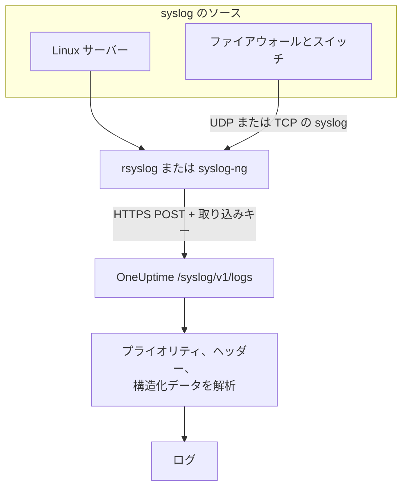

# Syslog

OneUptime は HTTPS で syslog を受け付けます。RFC 5424 または RFC 3164 のメッセージを取り込みキーとともに `/syslog/v1/logs` に送ると、それぞれが検索可能なログになり、プライオリティ、ファシリティ、重大度、ホスト、アプリケーション、構造化データが属性になります。rsyslog、syslog-ng、または HTTP リクエストを送れる任意のリレーからの転送に使えます。

:::cards
- [テストメッセージを送る](#テストメッセージを送る): `curl` のリクエスト 1 つだけ。
- [rsyslog から転送する](#rsyslog-から転送する): サーバーやリレーが受け取るものをすべて送ります。
- [解析される属性](#解析される属性): OneUptime が各メッセージから取り出すもの。
- [トラブルシューティング](#トラブルシューティング): 拒否されたリクエストと想定外のサービス。
:::

## 仕組み



OneUptime はリクエストからメッセージを読み取った時点で応答し、少し後に解析して保存します。メッセージの本文はログの本文に残り、それ以外はすべて属性になります。

> [!TIP]
> OneUptime のプローブで監視しているネットワーク機器は、リレーを使わずに UDP で syslog を直接プローブに送れます。その場合、ログは OneUptime のその機器に表示されます。[ネットワークベンダー別ガイド (Sophos、Extreme、Cambium)](/docs/monitor/network-vendor-guides) を参照してください。

## 始める前に

- **OneUptime プロジェクト**: OneUptime Cloud では、テレメトリは取り込んだ GB 単位で課金されます。また Free プランのプロジェクトは、テレメトリを送る前に支払い方法を登録する必要があります。
- **テレメトリ取り込みキー**: **製品 → プロジェクト設定 → テレメトリと APM → 取り込みキー** で **サーバー** キーを作成し、その **シークレットキー** をコピーします。これを `x-oneuptime-token` ヘッダーで送ります。
- **syslog の転送ツール**: HTTP POST リクエストを送れるツールなら何でもかまいません (たとえば `curl`、`omhttp` 経由の `rsyslog`、HTTP 宛先を使う `syslog-ng`)。
- **サービス名 (任意)**: `x-oneuptime-service-name` ヘッダーを設定すると、受信したログを特定のテレメトリサービスにまとめられます。省略した場合、OneUptime は syslog の `APP-NAME`、ホスト名、`Syslog` の順に使います。

## エンドポイント

```http
POST https://oneuptime.com/syslog/v1/logs
```

| ヘッダー | 必須 | 値 |
| --- | --- | --- |
| `x-oneuptime-token` | はい | 取り込みキー。 |
| `Content-Type` | JSON の本文では必須 | `application/json` |
| `x-oneuptime-service-name` | いいえ | ログが属するサービス。 |
| `Content-Encoding` | いいえ | 圧縮した本文なら `gzip`。 |

OneUptime をセルフホストしている場合は、`oneuptime.com` を自分のホストに置き換えます。

## リクエストの本文

`messages` 配列を持つ JSON を送ります。RFC 5424 と RFC 3164 (BSD) の両方の形式に対応しており、1 つのリクエストで混在させられます。

```json
{
  "messages": [
    "<34>1 2025-03-02T14:48:05.003Z web-01 nginx 7421 ID47 [env@32473 host=\"web-01\"] 502 on /api/login",
    "<13>Feb  5 17:32:18 db-01 postgres[2419]: connection received from 10.0.0.12"
  ]
}
```

### 対応する本文の形式

| 本文 | 送り方 |
| --- | --- |
| `messages` 配列を持つ JSON オブジェクト | `Content-Type: application/json`。推奨。 |
| メッセージの JSON 配列 | `Content-Type: application/json`。 |
| `message` を 1 つ持つ JSON オブジェクト | `Content-Type: application/json`。複数行の値は複数のメッセージとして読み取られます。 |
| 改行で区切ったメッセージ | gzip で圧縮し、`Content-Encoding: gzip` を付けて送ります。 |

gzip で圧縮していないプレーンテキストの本文は読み取られず、リクエストは `400` で拒否されます。gzip で圧縮した本文は常に改行区切りのメッセージとして読み取られるので、JSON の本文は圧縮しないでください。各リクエストは 1 MB 未満にしてください。OneUptime のイングレスは、このエンドポイントについて nginx の既定のリクエスト本文の上限を引き上げていません。

## テストメッセージを送る

```bash
curl \
  -X POST https://oneuptime.com/syslog/v1/logs \
  -H "Content-Type: application/json" \
  -H "x-oneuptime-token: YOUR_TELEMETRY_KEY" \
  -H "x-oneuptime-service-name: production-web" \
  -d '{
    "messages": [
      "<34>1 2025-03-02T14:48:05.003Z web-01 nginx 7421 ID47 [env@32473 host=\"web-01\"] 502 on /api/login"
    ]
  }'
```

`200` が返れば、メッセージは受け付けられています。**製品 → ログ** を開くと、ログが `production-web` サービスに、本文 `502 on /api/login`、重大度 `Error`、そして [解析される属性](#解析される属性) の属性付きで表示されます。

## rsyslog から転送する

rsyslog は HTTP 出力モジュール `omhttp` で OneUptime に送ります。

:::steps
### `omhttp` が使えることを確認する

下の構成は `module(load="omhttp")` でこれを読み込みます。rsyslog がモジュールを読み込めないと報告する場合は、お使いのディストリビューションで `omhttp` を提供するパッケージをインストールしてください。

### OneUptime の宛先を追加する

`/etc/rsyslog.d/oneuptime.conf` を作成します。テンプレートは各メッセージを RFC 5424 の行として組み立て直し、OneUptime が期待する JSON の本文で包みます。

```text title="/etc/rsyslog.d/oneuptime.conf"
module(load="omhttp")

template(name="OneUptimeJson" type="string"
         string="{\"messages\":[\"<%PRI%>1 %TIMESTAMP:::date-rfc3339% %HOSTNAME% %APP-NAME% %PROCID% %MSGID% - %msg:::json%\"]}")

action(
  type="omhttp"
  server="oneuptime.com"
  serverport="443"
  usehttps="on"
  restpath="syslog/v1/logs"
  httpheaders=[
    "x-oneuptime-token: YOUR_TELEMETRY_KEY",
    "x-oneuptime-service-name: rsyslog-demo"
  ]
  template="OneUptimeJson"
)
```

`restpath` には先頭のスラッシュを付けずにパスを指定します。`omhttp` は既定で JSON の `Content-Type` を送り、このテンプレートが作るのもまさにその形式です。

### 構成を確認して rsyslog を再起動する

```bash
sudo rsyslogd -N1
sudo systemctl restart rsyslog
```

`rsyslogd -N1` は rsyslog を起動せずに構成を検証します。再起動後、新しいメッセージが **製品 → ログ** の `rsyslog-demo` サービスに表示されます。
:::

このアクションは、rsyslog が扱うすべてのメッセージを転送します。ローカルのプログラム、rsyslog が読み取っている場合は systemd ジャーナル、そしてネットワークから受け取るものすべてです。

### ネットワーク機器の syslog を中継する

ファイアウォール、スイッチなどのアプライアンスは、syslog を UDP または TCP でしか送れないことがよくあります。それらを rsyslog のリレーに向け、リレーから HTTPS で転送させます。リレーの構成で、`action` の前にリスナーを追加します。

```text title="/etc/rsyslog.d/oneuptime.conf"
module(load="imudp")
input(type="imudp" port="514")
```

`x-oneuptime-service-name` を `perimeter-firewall` のような名前に設定するか、ヘッダーを削除して、各機器のログをホスト名ごとにまとめます。多くのアプライアンスはメッセージを `key=value` のペアで書きます。[Key=Value Parser](/docs/telemetry/log-pipelines#keyvalue-parser) を使うと、それらを属性に変えられます。

:::details メッセージごとに 1 リクエストではなく、まとめて送る
rsyslog はメッセージをまとめて gzip で圧縮でき、OneUptime はそれを改行区切りのメッセージとして読み取ります。テンプレートとアクションを次のものに置き換えます。

```text title="/etc/rsyslog.d/oneuptime.conf"
template(name="OneUptimeLine" type="string"
         string="<%PRI%>1 %TIMESTAMP:::date-rfc3339% %HOSTNAME% %APP-NAME% %PROCID% %MSGID% - %msg%")

action(
  type="omhttp"
  server="oneuptime.com"
  serverport="443"
  usehttps="on"
  restpath="syslog/v1/logs"
  httpheaders=["x-oneuptime-token: YOUR_TELEMETRY_KEY"]
  template="OneUptimeLine"
  batch="on"
  batch.format="newline"
  compress="on"
)
```

`compress="on"` は残してください。OneUptime は、gzip で圧縮した本文からしか改行区切りのメッセージを読み取りません。
:::

### ほかの転送ツール

- **syslog-ng**: 同じ URL、同じヘッダー、同じ JSON の本文で、その HTTP 宛先を使います。
- **Fluent Bit**: Fluent Bit の `syslog` 入力で syslog を受け取り、ほかのログと同じように転送します。[Fluent Bit](/docs/telemetry/fluentbit) を参照してください。

## 解析される属性

OneUptime は、各ログエントリに次の属性を自動的に追加します。

| 属性 | 値 | テストメッセージの場合 |
| --- | --- | --- |
| `syslog.priority` | プライオリティ、`<PRI>` | `34` |
| `syslog.facility.code`、`syslog.facility.name` | プライオリティから求めたファシリティ | `4`、`security` |
| `syslog.severity.code`、`syslog.severity.name` | プライオリティから求めた重大度 | `2`、`critical` |
| `syslog.version` | RFC 5424 のバージョン | `1` |
| `syslog.hostname` | `HOSTNAME` | `web-01` |
| `syslog.appName` | `APP-NAME`、または RFC 3164 のタグ | `nginx` |
| `syslog.processId` | `PROCID` | `7421` |
| `syslog.messageId` | `MSGID` | `ID47` |
| `syslog.structured.raw` | 送られたままの RFC 5424 の構造化データ | `[env@32473 host="web-01"]` |
| `syslog.structured.*` | 構造化データの各パラメーターを平坦化したもの | `syslog.structured.env_32473.host` = `web-01` |
| `syslog.raw` | 追跡用の元のメッセージ | 行全体 |

これらの属性は **製品 → ログ** のエクスプローラーで検索できます。たとえば `@syslog.severity.name:error` や `@syslog.hostname:web-01` です。[検索構文](/docs/telemetry/search-syntax) を参照してください。

メッセージ自体はログの本文に残ります。Sophos XGS や Fortinet FortiGate などのファイアウォールは、メッセージを `key=value` のペア (`log_component="IPSec" con_name="HQ-Branch1" status="Terminated"`) で書きます。[ログパイプライン](/docs/telemetry/log-pipelines#keyvalue-parser) に **Key=Value Parser** プロセッサーを追加すると、これらのペアも属性に変わります。

### 重大度

| syslog の重大度 | コード | OneUptime の重大度 |
| --- | --- | --- |
| Emergency、Alert | `0`、`1` | `Fatal` |
| Critical、Error | `2`、`3` | `Error` |
| Warning | `4` | `Warning` |
| Notice、Informational | `5`、`6` | `Information` |
| Debug | `7` | `Debug` |
| メッセージにプライオリティがない | — | `Unspecified` |

タイムスタンプのないメッセージは、OneUptime が受け取った時刻で保存されます。

### サービス

各ログはテレメトリサービスに保存され、そのサービスは最初に送信されたときに OneUptime が作成します。サービスは次のうち最初にあるものです。

1. `x-oneuptime-service-name` ヘッダー
2. メッセージの `APP-NAME` (またはタグ)
3. メッセージのホスト名
4. `Syslog`

## トラブルシューティング

:::details HTTP 401
キーがない、不明、または期限切れです。`x-oneuptime-token` ヘッダーに、ログを受け取るプロジェクトの取り込みキーの **シークレットキー** が入っていることを確認してください。
:::

:::details HTTP 402 または 422
`402`: OneUptime Cloud で、プロジェクトが Free プランで支払い方法がありません。**プロジェクト設定 → 請求と請求書 → 請求** で追加してください。`422`: キーが無効化されているか、ブラウザーキーです。キーの設定で **有効** をオンに戻すか、**サーバー** キーを作成してください。
:::

:::details HTTP 400、またはログが表示されない
リクエストの本文に実際に syslog の行が、`Content-Type: application/json` の JSON として含まれていることを確認してください。空の本文と、gzip で圧縮していないプレーンテキストの本文は、HTTP 400 で拒否されます。
:::

:::details HTTP 413
リクエストがイングレスの受け付けるサイズを超えています。1 リクエストあたりのメッセージ数を減らしてください。
:::

:::details ログが想定外のサービス名で届く
`x-oneuptime-service-name` を設定すると、`APP-NAME`、次にホスト名を使う既定の判定を上書きできます。
:::

## 次のステップ

:::cards
- [ログパイプライン](/docs/telemetry/log-pipelines): `key=value` 形式のメッセージを属性に変えます。
- [ログの記録ルール](/docs/telemetry/log-recording-rules): syslog の数値をメトリクスに変えます。
- [ログ モニター](/docs/monitor/logs-monitor): 一致する syslog メッセージが届いたらアラートを出します。
:::
