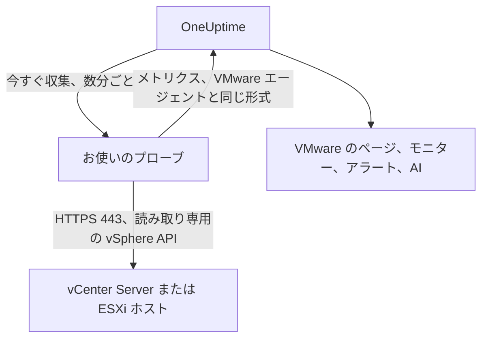

# エージェントなしの VMware

何もインストールせずに vCenter Server またはスタンドアロン ESXi ホストを監視できます。OneUptime に vCenter のアドレスと読み取り専用アカウントを入力し、vCenter に到達できるプローブを選ぶと、そのプローブが [VMware エージェント](/docs/telemetry/vmware) と同じデータを収集します。インストール、アップグレード、稼働の維持が必要なエージェントも、専用に用意するマシンもありません。

:::cards
- [始める前に](#始める前に): vCenter に到達できるプローブと、読み取り専用アカウント。
- [vCenter を接続する](#vcenter-を接続する): 4 つのフィールド、テスト、名前。
- [トラブルシューティング](#トラブルシューティング): 各メッセージの意味と解決方法。
:::

## 仕組み

プローブは数分ごとに、保存したアカウントで vCenter にログインし、インベントリ、パフォーマンスカウンター、vSAN の統計を読み取って OneUptime に送信します。データは VMware エージェントのものとまったく同じ形で届くため、すべての VMware のページ、[VMware モニター](/docs/monitor/vmware-monitor)、アラートテンプレート、OneUptime AI が同じように読み取ります。プローブは収集の間も vCenter のセッションを維持するため、vCenter のイベントログがログインで埋まることはありません。

## プローブかエージェントか

| | プローブ (このページ) | VMware エージェント |
|---|---|---|
| 実行するもの | すでに実行しているプローブ、または新しいプローブ | 専用マシン上のエージェント |
| アカウントの保管場所 | OneUptime 内で暗号化され、プローブにのみ送信 | エージェントの `.env` ファイル |
| 到達が必要な先 | プローブから TCP 443 で vCenter | エージェントから TCP 443 で vCenter |
| 最大の vCenter | 収集ごとに約 48 MiB のメトリクス | 上限なし |
| ESXi の syslog と AI エージェント | 含まれない | 含まれる |

どちらも同じデータを送信します。vCenter の **設定** ページで、いつでも一方からもう一方に切り替えられます。

## 始める前に

- **TCP 443 で vCenter に到達できるプローブ。** 通常は vCenter のネットワーク内にある [カスタムプローブ](/docs/probe/custom-probe) です。OneUptime Cloud では共有プローブが vCenter のパスワードを受け取ることはないため、独自のプローブを追加してください。セルフホストのインスタンスでは、インスタンス自身のプローブも収集できます。
- **Read-Only ロールを持つ vSphere ユーザー。** 最上位の vCenter オブジェクトで付与し、**Propagate to children** をオンにします。[読み取り専用の vSphere ユーザーを作成する](/docs/telemetry/vmware#create-the-read-only-vsphere-user) の手順に従ってください。エージェントが使うものと同じアカウントです。

> [!IMPORTANT]
> **Propagate to children** がオフだと、ユーザーはログインできても何も見えず、プローブはアカウントが vCenter のインベントリを読み取れないと報告します。

## vCenter を接続する

:::steps
### vCenter の一覧を開く
OneUptime で **VMware → すべての vCenter** を開き、**vCenter を接続** をクリックします。

### アドレスとアカウントを入力する
vSphere Client を開くアドレス (`https://vcsa.example.com` など)、ドメインを含むユーザー名 (`oneuptime@vsphere.local` など)、そのパスワードを入力します。vCenter に到達できるプローブを選択します。

### 接続をテストする
次のステップで **接続をテスト** をクリックします。プローブがログインし、アカウントが参照できる情報を読み取ってからログアウトします。結果には、見つかったデータセンター、クラスター、ホスト、仮想マシン、データストアの数が表示されます。

### vCenter の証明書を信頼する
vCenter は既定で独自の認証局の証明書を使用しており、プローブはそれを信頼していません。その場合、テストに証明書が表示されます。フィンガープリントを vCenter 自身のものと照合してから、**この証明書を信頼** をクリックします。

### 名前を付けて接続する
名前の既定値は vCenter のホスト名です。**vCenter を接続** をクリックして保存します。
:::

vCenter の **概要** に **データ収集** カードが表示されます。1 分以内に始まる最初の収集までは **確認中**、その後は **収集中** と表示され、インベントリが埋まっていきます。

## 証明書

プローブが証明書の検証を省略することはありません。すべての接続で完全な TLS ハンドシェイクを行い、そのうえで次のように扱います。

- 信頼する証明書が設定されていない場合、vCenter の証明書は、プローブのマシンが信頼する認証局が、入力したアドレスに対して発行したものでなければなりません。
- 信頼する証明書が設定されている場合、vCenter はまさにその証明書 (SHA-256 フィンガープリントで識別) を提示しなければなりません。公的に信頼された証明書であっても、それ以外は受け付けません。

フィンガープリントを確認するには、vSphere Client で **Administration → Certificates → Certificate Management** を開くか、プローブのマシンで `openssl s_client -connect vcsa.example.com:443 </dev/null | openssl x509 -noout -fingerprint -sha256` を実行します。

vCenter の証明書が更新されると、収集は **vCenter の証明書が変更されました** で停止し、新しい証明書が表示されます。vCenter の **概要** または **設定** ページでその証明書を信頼するまで、vCenter には何も送信されません。

## 保存されたパスワード

パスワードは暗号化され、書き込み専用です。誰も読み戻すことはできず、API が返すこともありません。パスワードは vCenter を収集するプローブにのみ送信され、プローブはそれをメモリ上に保持します。

保存されたパスワードは、入力時のアドレスに、入力時のプローブを経由して、入力時の証明書に対してのみ送信されます。アドレス、プローブ、信頼する証明書のいずれかを変更するとパスワードの再入力が求められるため、vCenter を編集できる人でも、パスワードを別の場所に送ることはできません。保存済みのアドレスでプローブが見つけた証明書を信頼する場合は、パスワードはそのまま維持されます。

## エージェントとプローブを切り替える

vCenter の **設定** ページを開きます。**データ収集** カードには、エージェントが送信している vCenter には **プローブで収集**、プローブが収集している vCenter には **VMware エージェントを使用** が表示されます。エージェントに切り替えると、保存されたパスワードは破棄されます。

> [!WARNING]
> プローブによる最初の収集が成功したら、VMware エージェントを停止してください。両方が動いている間は、すべてのメトリクスが 2 回届きます。

## リファレンス

| 設定 | 既定値 | 備考 |
|---|---|---|
| 収集間隔 | 2 分 | 1 ～ 60 分。大規模な vCenter は、負荷を抑えるために収集の頻度を下げてください。 |
| 同時収集数 | プローブあたり 4 | 間隔より長くかかる収集はスキップされ、積み重なることはありません。 |
| 最大の収集サイズ | 約 48 MiB | これより大きい vCenter には VMware エージェントが必要です。 |
| 接続テスト | 開始まで 90 秒 | 時間内にどのプローブも取得しなかったテストや、2 分を超えて実行されたテストは、失敗として返されます。 |

## トラブルシューティング

:::details vCenter の証明書が信頼されていません
vCenter が独自の認証局の証明書を提示しています。表示されたフィンガープリントを vCenter の証明書と照合してから、**この証明書を信頼** をクリックします。
:::

:::details vCenter がログインを拒否しました
`oneuptime@vsphere.local` のようにドメインを含む完全なユーザー名を使用し、パスワードと、アカウントがロックされていないことを確認してください。vCenter の **設定** ページの **接続を編集** で変更できます。
:::

:::details ユーザーが vCenter のインベントリを読み取れません
最上位の vCenter オブジェクトで、ユーザーに Read-Only ロールを付与し、**Propagate to children** をオンにしてください。
:::

:::details プローブに vCenter から応答がありません
プローブのネットワークから TCP 443 で vCenter に到達できません。ファイアウォールで通信を許可するか、vCenter のネットワーク内のプローブを選択してください。
:::

:::details プローブがこれを取得しませんでした
プローブがオフラインであるか、VMware 収集より古いバージョンの OneUptime を実行しています。**カスタムプローブ** の表でプローブが接続されていることを確認し、更新してください。
:::

:::details この vCenter はプローブで収集するには大きすぎます
メトリクスが、プローブ 1 回のアップロードの上限を超えています。この vCenter には [VMware エージェント](/docs/telemetry/vmware) を使用してください。
:::

## 次のステップ

:::cards
- [VMware モニター](/docs/monitor/vmware-monitor): ホスト、仮想マシン、データストア、クラスターのアラート。
- [カスタムプローブ](/docs/probe/custom-probe): vCenter のネットワーク内でプローブを実行します。
- [VMware エージェント](/docs/telemetry/vmware): 代わりにエージェントで vCenter を収集します。
:::
