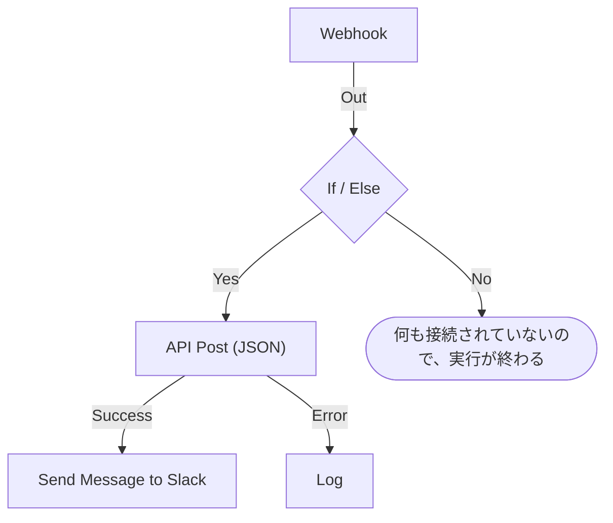

# ワークフローを作成する

ワークフローは、その **ビルダー** で組み立てます。ビルダーは、ブロックを追加し、接続し、設定を入力するキャンバスです。このページでは、ワークフローの作成方法、[ブロックの追加](#ブロックの追加)、[接続](#ブロックの接続)、[設定](#ブロックの設定)、[ブロック間での値の受け渡し](#前のブロックの値を使う)、[ワークフローのオン](#オンにする) について説明します。

ワークフローを作成するには、**ワークフロー** を開いて **ワークフローを作成** をクリックします。**ワークフローを作成** ダイアログでは、まずどこから始めるかを尋ねられ、次に名前を尋ねられます。Slack の Webhook URL のように独自の設定が必要なテンプレートは、追加のステップでそれを尋ね、ワークフロー変数として保存します。そのため、後からワークフローを編集せずに変更できます。

始め方を選びます。

- ダイアログ上部の **ゼロから作成** は、空のキャンバスを用意します。ほとんどのワークフローはここから始まります。
- **またはテンプレートから始める** には、**おすすめ** のテンプレートがいくつか表示されます。それ以外は、検索ボックスの横で **インシデント**、**モニター**、**Jira** などのカテゴリ、または **すべてのテンプレート** を選ぶか、**テンプレートを検索…** に入力します。入力したすべての単語が一致する必要があります。

テンプレートをクリックすると、その内容を確認できます。トリガー、構成するブロック、尋ねられる設定です。次に **このテンプレートを使う** をクリックするか、テンプレートをダブルクリックします。検索ボックスでは、矢印キーでテンプレートを選び、**Enter** で使用します。`/` で検索ボックスに戻ります。

ワークフローはオフの状態で作成されるため、オンにするまで何も実行されません。新しいワークフローは、設計用のキャンバスである **ビルダー** で開きます。

## キャンバス

ゼロから作成したワークフローは、**このワークフローを開始するものを選択** と書かれた点線のブロックが 1 つだけある状態で開きます。このブロックが出発点です。クリックしてトリガーを選びます。テンプレートから作成したワークフローは、ブロックがすでに配置された状態で開きます。

どのワークフローにも、上部にちょうど 1 つの **トリガー** があります。それ以外はすべて、何かを行う **コンポーネント** です。トリガーを変更するには、トリガーを削除します。点線のプレースホルダーがその場所に戻り、クリックすると別のトリガーを選べます。ブロックを削除するとその線も削除されるため、新しいトリガーを最初のブロックに接続し直してください。

変更は自動で保存されます。ツールバーのラベルがその状態を示します。変更の送信中は **保存中…**、その後は **保存しました**、うまくいかなかった場合は **保存できませんでした** と表示されます。キャンバスには保存ボタンも、別個の公開ステップもありません。

## ブロックの追加

| 追加するもの           | クリックするもの                                               | 開くパネル                    |
| ---------------------- | -------------------------------------------------------------- | ----------------------------- |
| トリガー               | 点線のプレースホルダーブロック                                 | **トリガーを追加**            |
| その他のブロック       | キャンバス上部のツールバーにある **コンポーネントを追加**       | **コンポーネントを追加**      |

どちらのパネルも、ほとんどのワークフローが使うブロックを **人気** の下に表示し、その後に残りの組み込みブロックが続きます。**OneUptime のリソース** の下で **インシデント** などのリソースをクリックすると、それで何ができるかが表示されます。**すべてのリソースを参照** ではすべてのリソースが表示されます。または検索します。`create incident` のように数語を入力すると、最も一致するものが先頭に来ます。`/` で検索ボックスに移動し、矢印キーで結果を移動し、**Enter** で強調表示されたブロックを追加します。ブロックをクリックしても追加されます。

新しいブロックはキャンバスの一番下のブロックの下に置かれ、新しいトリガーは上部の点線のブロックの位置に置かれます。新しいブロックは選択された状態になり、表示範囲の外に置かれた場合は、それが見えるところまでキャンバスがスクロールします。設定は自動では開きません。設定する準備ができたらブロックをクリックしてください。必須の設定が入力されるまで、ブロックには **クリックしてセットアップ** と表示されます。

ブロックは好きな場所にドラッグできます。ドラッグ中、キャンバスはブロックをグリッドに吸着させます。ブロックの位置は保存されるので、次の人もあなたが残したのと同じレイアウトを見ることになります。

## ブロックの構成要素

| フィールド                            | 役割                                                                                                                                                                                                                                                                                                          |
| ------------------------------------- | ------------------------------------------------------------------------------------------------------------------------------------------------------------------------------------------------------------------------------------------------------------------------------------------------------------- |
| **識別子**（**ID** の下）             | ブロックに表示される短い ID で、`log-1` のようなものです。他のブロックはこれでこのブロックを参照するため、名前を変えると、このブロックを指すすべての `{{local.components.…}}` 参照が壊れます。ブロックの見出しはコンポーネント自身の名前で、変更できません。                                             |
| **設定**                              | ブロックが仕事をするのに必要なもの — URL、Slack チャンネル、メッセージ本文など。任意のフィールドには **（任意）** と表示され、それ以外はすべて必須です。オン/オフのスイッチは常に値を持つため、どちらの表示もありません。あまり使わない設定は **その他の項目** の下に折りたたまれ、その見出しに項目名と入力済みのものが表示されます。 |
| **入力**                              | 上端の点で、前のブロックからの線がここに入ります。トリガーにはありません。トリガーより前に実行されるものはないからです。                                                                                                                                                                                       |
| **出力**                              | 下端に並ぶ点で、すぐ上にラベルがあり、ここから次のブロックへ線が出ます。多くのブロックには **Success** と **Error** の別々の出力があり、両方のケースを扱えます。                                                                                                                                              |

## ブロックの接続

あるブロックの下の点から、次のブロックの上の点までドラッグします。引いた線が、次に何が実行されるかを決めます。

- **Success** から接続すると、次のブロックは前のブロックが成功したときだけ実行されます。
- **Error** から接続すると、次のブロックは前のブロックが失敗したときだけ実行されます。
- 出力を接続しなければ、その経路はそこで終わります。

1 つの出力を複数のブロックに接続できます。すべて実行されますが、並列ではなく、1 つのキューで順番に実行されます。ブランチ間の順序に依存したり、時間的に重なることを前提にしたりしないでください。

各ブロックは 1 回の実行につき最大 1 回しか実行されません。すでに実行されたブロックへ向かう線（キャンバスを上に戻る線や、最初のブランチがそのブロックに到達した後の別のブランチからの線）は、実行をエラーで停止させるため、ワークフローがループすることはありません。

## ブロックの設定

ブロックをクリックするとダイアログで設定が開きます。または **Tab** でブロックに移動して **Enter** を押します。設定を入力して **保存** をクリックします。

各設定には、その値に合った入力欄があります。

| 設定の内容                                       | 表示されるもの                                                                 |
| ------------------------------------------------ | ------------------------------------------------------------------------------ |
| 文章: メッセージ、プロンプト、ログに残す値       | 入力に合わせて広がる欄。**Enter** で改行します。                               |
| 短い値: URL、ID、件名                           | 1 行の欄。                                                                      |
| コードまたは HTML                                | コードエディター。                                                             |
| JSON                                             | JSON エディター。                                                              |
| オンまたはオフ                                   | 名前が横に付いたスイッチ。スイッチか名前をクリックすると切り替わります。       |

ダイアログは、目的としていそうなものを開いた状態で表示されます。**Webhook** トリガーなら、その URL と **URL をコピー** ボタン、受け付けるメソッド、リクエストの例です。**手動** トリガーなら、ワークフローの開始方法です。その他のブロックは設定を開いた状態で表示されます。設定のないブロックには **設定** セクションそのものがありません。

その下には、上から順に次のものがあります。

- **ID**、**入力**、**出力** が横並びで — ブロックの識別子、どこから到達するか、その後に何が実行されるか。
- **戻り** — このブロックが後のステップに渡すデータ。各値には、それを読み取る正確な参照と、コピー用のボタンが表示されます。
- **使い方** — ブロックが何をするかを 1 文で、設定手順、コピーできる例、よくある間違い。例はあなたのワークフローから組み立てられ、メッセージにデータを差し込む箇所ではこのブロックの ID とトリガーの値を使います。**詳細を見る** でより長い説明が開き、リンクは完全なガイドへつながります。すべてのブロックにこれがあり、ダイアログ上部の **使い方** ボタンでそこへ直接移動できます。

下部には次のものがあります。

- **削除** — このブロックを削除します。先に確認があり、**Send Email (send-email-2)** のように種類と識別子でブロックを示すので、同じブロックが複数あってもどれが消えるのかが分かります。
- **このステップだけを実行** — ワークフローの残りを実行せず、このブロックだけを実行します。他のステップから読み取るはずだった値は空で届き、送信、書き込み、削除はすべて実際に行われます。ブロックより前の条件をすべて飛ばすため、ワークフローを編集できる人だけが使えます。

### 前のブロックの値を使う

ほとんどの設定では、前のブロックの値や変数を使えます。こうしてデータがブロックからブロックへ流れます。そのような設定には、末尾に **{ }** ボタンがあります。これを押すと、使える値の一覧が開きます。前の各ブロックが名前ごとに、それが返す各値（名前、内容、型）とともに表示され、その後にワークフローの変数とグローバル変数が続きます。一覧を検索し、マウスまたは矢印キーと **Enter** で選ぶと、カーソルの位置に値が挿入されます。

設定の中では、値は **Webhook › Request Body** のようなチップとして表示されます。ポインターを重ねると、それが表す参照 `{{local.components.webhook-1.returnValues.request-body}}` が表示されます。保存されるのはこの参照です。カーソルはチップを 1 回で飛び越え、**Backspace** でチップ全体が消え、コピーすると参照がコピーされます。構文を知っていれば、代わりに `{{` と入力してください。同じ一覧が設定の下に開き、入力に合わせて絞り込まれます。

- **存在することになる値だけが表示されます。** トリガーと、このブロックより前に実行されるブロックです。後で実行されるブロックには、まだ出力がありません。ブロックが接続されるまではトリガーの値だけが表示され、一覧にもそう示されます。
- **レコードはフィールドの一覧として開きます。** Find One や On Create のブロックはレコード全体を返します。それを選ぶとフィールドが表示され、ブロックの **Select Fields** が読み取るものが先頭に並びます。JSON の値やヘッダーのセットは、`title` や `alerts[0].status` のようなパスを入力するフィールドとして開きます。
- **ブロックが一度実行されると、一覧はその値の中身を把握します。** 各値には直近の実行で何が入っていたか（`"production"` や `3 fields`）が表示され、JSON の値やヘッダーのセットは、実際にあったフィールドがそれぞれの内容とともに一覧で開きます。そのため、Webhook の **Request Body** からは、パスを入力する代わりに **incident.title** を選べます。検索でもこれらのフィールドが見つかります。`title`、または `{{` とパスの先頭を入力してください。レコードのフィールドにも、入っていた内容が表示されます。フィールドは直近の実行から取られるため、後のリクエストで省かれたフィールドはその実行では空です。`Authorization` ヘッダー、トークン、パスワードのようにシークレットらしい値は、内容なしで表示されます。
- **まだリクエストを受け取っていない Webhook はそう表示します。** 値の一覧の上部に、**Copy test request** があります。これはワークフローの Webhook URL に `{"message": "Hello"}` を送る `curl` コマンドです。一覧を開いたままターミナルで実行すると、それが開始した実行が終わり次第（通常は数秒以内）、リクエストのフィールドが一覧に表示されます。ワークフローは有効になっている必要があり、そうでなければリクエストは拒否されます。このボタンは、Webhook URL を見る権限のある人にだけ表示されます。まだメールを受け取っていない Incoming Email トリガーも同じ場所でそう表示します。そのアドレスにメールを送ると、ヘッダーと添付ファイルが同じように表示されます。
- **コードエディターのツールバーには Insert value があります。** JSON では、ドキュメント内で値に必要な引用符を付け加えます。**Run Custom JavaScript** は **Arguments** を通して値を読むため、コードにピッカーはありません。
- **数値、パスワード、スイッチ、日付は独自のコントロールのまま** で、横に **{ }** があります。選んだ値がコントロールに置き換わり、**abc** で入力に戻ります。

チップは、読み取る対象が存在しないとオレンジ色になります。名前が変わったか削除されたブロック、ブロックが返さない値、後で実行されるブロック、存在しない変数などです。ツールチップにどれなのかが表示されます。参照の構文については [変数](/docs/workflows/variables) を参照してください。

## 作成中のチェック

ビルダーは、変更のたびにグラフ全体をチェックし、見つかったものをツールバーのラベルで知らせます。ラベルをクリックすると **このワークフローの問題** が開き、各問題が一覧表示され、該当するブロックへ移動できます。キャンバスでは、必須の設定がまだ空のブロックに **クリックしてセットアップ** と表示され、それ以外の問題があるブロックには角にバッジが付きます。赤はエラー、オレンジは警告です。バッジにポインターを重ねると、何が問題かを読めます。

実行が失敗するまで気付きにくい、次のような間違いを捕まえます。

- トリガーのないワークフロー
- 同じ ID を持つ 2 つのブロック、またはドットを含む ID
- 何も接続されていないブロック
- 空のままの必須設定
- 無効な JSON
- `{{ }}` 内の空白
- 存在しないステップや戻り値への参照

ただし、変数名が存在するかどうかはチェックできません。ブロックの設定ならチェックできます。存在しない変数への参照は、そこでオレンジのチップとして表示されます。それ以外の場所では、名前を変えた変数は実行のログで初めて分かります。

## 最初のワークフロー

キャンバスに慣れる一番の近道は、手動で開始する 2 ブロックのワークフローです。

:::steps
1. 点線のプレースホルダーブロックをクリックし、**トリガーを追加** パネルで **手動** をクリックします。
2. **コンポーネントを追加** をクリックし、**人気** の下にある **ログ** をクリックします。新しいブロックはトリガーの下に置かれます。トリガーの **Execute** の点を、Log ブロックの入力の点まで接続します。
3. **クリックしてセットアップ** と表示されている Log ブロックをクリックし、**Value** に `Hello from ` と入力します。**{ }** をクリックし、**手動** の下にある **JSON** をクリックします。設定には **Manual › JSON** と表示され、`{{local.components.manual-1.returnValues.value}}` が保存されます。`manual-1` は、トリガーのブロックに表示されているトリガーの **識別子** です。**保存** をクリックします。
4. ビルダーの上部で **有効** をオンにします。無効なワークフローは手動でもまったく実行できません。この手順を飛ばすと、**ワークフローを実行** がまずオンにするよう求めます。
5. **ビルダー** に戻って **ワークフローを実行** をクリックし、**JSON** フィールドに `{ "name": "Ada" }` と入力して、**ワークフローを手動で実行** をクリックし、**実行** で確定します。
6. **ワークフローの実行** パネルが自動で開き、実行を追いかけます。ログには `Value:` に続いて `Hello from { "name": "Ada" }` が表示されます。
:::

追加、接続、設定、実行、ログを読む — このサイクルが、すべてのワークフローの作り方です。

> [!TIP]
> **ワークフローを実行** に入力した JSON は、入力したとおりのテキストとして手動トリガーに届きます。その中の `name` のようなフィールドを読むには、**Text to JSON** ブロックを追加し、その **Text** にトリガーの **JSON** を入れ、そのブロックの **JSON** からフィールドを読みます: `{{local.components.text-to-json-1.returnValues.json.name}}`。

## オンにする

新しいワークフローは無効の状態で始まります。複製したワークフローやインポートしたワークフローも同様です。ワークフローがオフのあいだ、ビルダーはキャンバスの上にそのことを表示し、**ワークフローをオンにする** ボタンを出します。

**有効** スイッチは **ビルダー** の上部、**コンポーネントを追加** と **ワークフローを実行** の隣にあります。ワークフローの **概要** ページにもあり、その **ワークフローの詳細** カードが現在の状態を緑の **有効** ピルか赤の **無効** ピルで示します。切り替えるには **ワークフローを編集** をクリックし、**その他の項目** を開きます。オン/オフを切り替えられるのは、ワークフローを編集できる人だけです。それ以外の人には、スイッチが淡色表示されます。

無効なワークフローは、どのように開始されてもまったく実行できません。

| 開始の方法                                                 | ワークフローがオフのとき                                                                                                                                                                  |
| ---------------------------------------------------------- | ----------------------------------------------------------------------------------------------------------------------------------------------------------------------------------------- |
| トリガー: スケジュール、OneUptime のイベント、メール       | 無視されます。                                                                                                                                                                            |
| **ワークフローを実行** または **このステップだけを実行**   | 代わりにビルダーが **このワークフローをオンにしますか？** と尋ねます。**オンにして実行**（または **オンにしてステップを実行**）は、ワークフローをオンにしてから、指定した値で求めた処理を実行します。 |
| Webhook URL の呼び出し                                     | HTTP 400 と "This workflow is turned off, so it can't run. Turn it on with the Enabled switch at the top of its Builder, then try again." で拒否されます。                                   |
| 別のワークフローの **Execute Workflow** ブロック            | そのブロックは自身の **Error** 経路をたどり、エラーには呼び出したワークフローの名前が示されます。                                                                                         |

つまり手順はこうです。作成し、**ワークフローを実行** でテストし、実行のログを読み、トリガーが発火してよい状態でなければ **有効** を再びオフにします。全体を実行せずに 1 つのブロックだけをテストするには、そのブロックの設定で **このステップだけを実行** を使います。

ワークフローを削除せずに一時停止するには、**有効** をオフにします。新しい実行は始まりません。実行中のものは最後まで進みますが、**Sleep** ブロックで待機中の実行は、目覚めたときにキャンセルされ、エラーとして記録されます。

## 整理する

- ブロックをドラッグして移動します。レイアウトは保存されます。
- 線を削除するには、線の端の一方を点から引き離し、キャンバスの空いている場所で放します。
- ブロックを削除するには、ブロックをクリックし、設定ダイアログの下部にある **削除** を使います。ブロックや線を選択して Backspace を押しても削除できます。
- 1 つのブロックだけを複製する方法はありません。ワークフローの **設定** ページにある **ワークフローを複製** は、全体をコピーします。コピーの名前は、プロジェクトのワークフローの番号の続きで自動入力され（"Nightly Sync" は "Nightly Sync 2" としてコピーされます）、コピーは無効の状態で開きます。
- 実行される向きに読めるよう、ブロックを上から下へ並べてください。入力は上端、出力は下端にあるので、流れは自然に下へ向かいます。

## 次のステップ

:::cards
- [トリガー](/docs/workflows/triggers): ワークフローを開始する 5 つの方法。
- [コンポーネント](/docs/workflows/components): 追加できるすべてのブロックと、その設定と出力。
- [変数](/docs/workflows/variables): ブロック間でデータを動かし、シークレットを切り離します。
- [実行履歴](/docs/workflows/runs-and-logs): 各実行が何をしたかを、ステップごとに確認します。
:::
