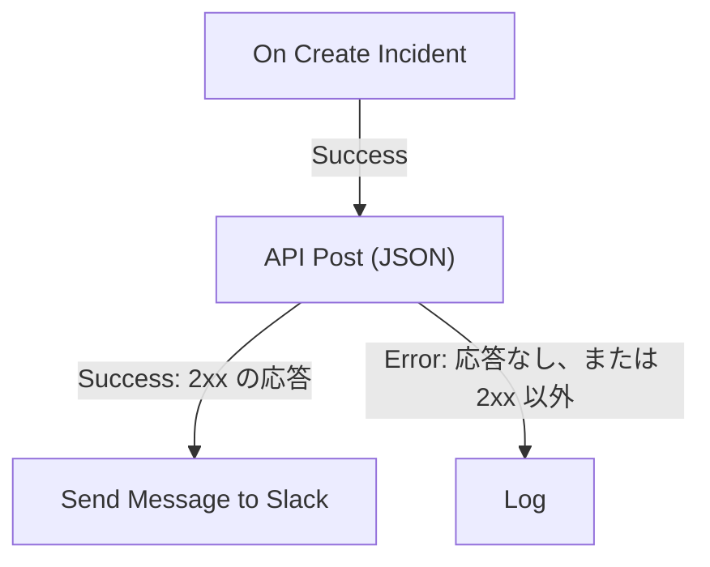

# ワークフロー コンポーネント

コンポーネントは、トリガーの後に追加するブロックです。それぞれが 1 つの仕事 — メッセージの送信、API の呼び出し、条件のチェック、OneUptime のレコードの変更 — を行い、その後、出力のどれか 1 つを選んで、そこに接続されたブロックへ進みます。このページはそのカタログです。各ブロックに何が必要か、何を返すか、どの出力をいつ選ぶかを説明します。

作業中にこのページを開いておく必要はあまりありません。各ブロックの設定の最後には **使い方** があり、ブロックが何をするか、設定手順、あなたのワークフローから組み立てた例、よくある間違いが示されます。ブロックの追加と接続については、[ワークフローを作成する](/docs/workflows/authoring) を参照してください。

:::cards
- [メッセージを送る](#slack): Slack、Microsoft Teams、Discord、Telegram、IRC、メール。
- [API を呼び出す](#api): 任意の HTTP API にリクエストを送り、応答を読みます。
- [ロジックを加える](#conditions): 値で分岐する、データを整形する、待つ、ログに残す。
- [OneUptime のレコードを扱う](#oneuptime-データコンポーネント): モニター、インシデントなどを検索、作成、更新、削除します。
:::

## どのコンポーネントを使うべきか

| やりたいこと                                                  | 使うもの                                                          |
| ------------------------------------------------------------- | ----------------------------------------------------------------- |
| チャットツールに投稿する                                      | [Slack](#slack)、[Microsoft Teams](#microsoft-teams)、[Discord](#discord)、[Telegram](#telegram)、[IRC](#irc) |
| 自前のメールサーバーからメールを送る                          | [Email](#email)                                                   |
| その他の API や自前のサービスを呼び出す                       | [API](#api)                                                       |
| テキストを要約、分類、下書きする                              | [Generate Text with AI](#generate-text-with-ai)                   |
| 値に応じて別々の経路に進む                                    | [Conditions](#conditions)                                         |
| 2 つのブロックのあいだでデータを整形する                      | [JSON](#json) または [Custom Code](#custom-code)                  |
| 次のブロックの前に待つ                                        | [Sleep](#sleep)                                                   |
| 別のワークフローを開始する                                    | [Execute Workflow](#execute-workflow)                             |
| インシデント、モニターなどのレコードを読み書きする            | [OneUptime データコンポーネント](#oneuptime-データコンポーネント)      |

専用のブロックは汎用のものに勝ります。Slack ブロックは Slack の制限を知っており、レコードのブロックはレコードのフィールドを知っているため、同じ仕事をする **API** ブロックよりも分かりやすいエラーとログが得られます。

## 各ブロックの動き

ブロックは、その前のブロックが自分に接続された出力を選んだときに実行されます。設定を読み、仕事をして、出力のどれか 1 つを選びます。次に実行されるのは、その出力に接続されたブロックだけです。



- **設定** は入力するものです。**（任意）** と表示された設定は空のままにできます。あまり使わない設定は **その他の項目** の下に折りたたまれています。
- **出力** は下端の点です。ほとんどのブロックには **Success** と **Error** があり、[Conditions](#conditions) には **Yes** と **No** があります。
- **戻り** は、API の **Response Body** のように、ブロックが後続のブロックに渡す値です。後続のブロックは `{{local.components.<block ID>.returnValues.<value ID>}}` で読みます。設定の **{ }** ボタンで挿入できます。[変数](/docs/workflows/variables#コンポーネントの出力前のブロックのデータ) を参照してください。

**Error** を選んだブロックは、実行を失敗させません。実行は **Error** の経路をたどるか、何も接続されていなければそこで終わります。一方、空のままの必須設定や、決して機能しない設定は、実行をエラーで停止させます。

## API

任意の URL に HTTP リクエストを送ります。メソッドごとにブロックがあります: **API Get (JSON)**、**API Post (JSON)**、**API Put (JSON)**、**API Patch (JSON)**、**API Delete (JSON)**。

| 設定                | 役割                                                                                                                                 |
| ------------------- | ------------------------------------------------------------------------------------------------------------------------------------ |
| **URL**             | 呼び出すアドレス。`http` または `https`。                                                                                            |
| **Request Body**    | 送信する JSON。通常、必要なのは `POST`、`PUT`、`PATCH` のリクエストだけです。                                                        |
| **Request Headers** | API キーなど、一緒に送るヘッダー。**その他の項目** の下にあります。値は実行のログでは隠されます。                                    |

| 出力        | タイミング                                                                                     |
| ----------- | ---------------------------------------------------------------------------------------------- |
| **Success** | サーバーが 2xx のステータスで応答した。                                                        |
| **Error**   | リクエストが失敗した。サーバーに到達できなかったか、別のステータスで応答した。                 |

いずれの場合も、ブロックは **Response Status**、**Response Headers**、**Response Body** を返し、失敗したときは理由を含む **Error** も返します。JSON の応答のフィールドを読むには、`{{local.components.api-get-1.returnValues.response-body.id}}` のように、その名前を参照に付け加えます。

リダイレクトはたどらないので、応答するアドレスをブロックに指定してください。リクエストは OneUptime から送信されます。プライベートネットワークのアドレスに解決される URL は、セルフホスト環境の管理者が許可しない限り拒否され、実行は理由とともに停止します。[送信ネットワークアクセス](/docs/workflows/configuration#送信ネットワークアクセス) を参照してください。

## AI

### Generate Text with AI

プロンプトと、任意の JSON コンテキストから、1 つのテキスト応答を生成します。ブロックはプロジェクトの既定の LLM プロバイダーを使い、プロジェクトにない場合はインストール全体のグローバルプロバイダーを使います。プロバイダーは **プロジェクト設定 → AI → LLM プロバイダー** で一元的に設定し、そのキーやエンドポイントがブロックの設定になることはありません。

| 設定                      | 役割                                                                                                                                                              |
| ------------------------- | ----------------------------------------------------------------------------------------------------------------------------------------------------------------- |
| **System Instructions**   | モデルの役割、口調、制約についての任意の指示。                                                                                                                   |
| **Prompt**                | タスク。書いたとおりに送られるので Markdown も使え、変数や前のブロックの値を含めることもできます。                                                              |
| **Context**               | 意図して送る任意の JSON。メッセージの終わりを示す明示的な区切りの後に付け加えられ、信頼できないデータとして扱われます。                                          |
| **Temperature**           | **その他の項目** の下にあります。`0` から `1` までのばらつき。既定値は、予測可能な自動化のための `0.2` です。現行の Claude モデル（Opus 4.7 以降とすべての Claude 5 モデル）は自分でサンプリングを決めます。OneUptime はそれらへのリクエストから **Temperature** を除くため、これらのモデルには効果がありません。 |
| **Maximum Output Tokens** | **その他の項目** の下にあります。`1` から `4096` まで。既定値は `1024` です。                                                                                   |

System Instructions、Prompt、シリアライズされた Context は、合計で 50,000 文字に制限されます。これらに base64 で埋め込まれた画像（インシデントの説明に含まれる合成モニターのスクリーンショットなど）は、計測の前に `[image omitted: PNG, 340 KB]` のような短い注記に置き換えられます。モデルが読むのはテキストであって画像ではないからです。何が省かれたかは実行のログに記録されます。プロバイダーへのリクエストは最大 60 秒で、試行は 1 回です。プロジェクトごとに同時に実行できるワークフローの AI リクエストは最大 3 つです。

返すのは、**Response**（生成されたテキスト）、**Provider** と **Model**（応答したもの）、**Total Tokens** と **Completion Tokens**（プロバイダーが報告した使用量）、**LLM Log ID**（AI ログ内のこの呼び出しのエントリー）、**Error** です。

**Success** を応答を使うブロックに、**Error** を代替処理に接続してください。検証、アクセス、プロバイダー、予算、課金、タイムアウトの失敗はすべてその経路をたどります。ブロックはツールを渡さないため、モデルが自分で OneUptime に問い合わせたり、API を呼び出したり、データを変更したりすることはできません。

> [!WARNING]
> モデルの出力は信頼できないテキストです。顧客に届く前に確認し、自由形式の AI テキストだけで破壊的な操作を決めさせないでください。プロバイダーに送られるもの、ログに残るもの、費用については [AI コンポーネント](/docs/workflows/configuration#ai-コンポーネント) を参照してください。

## Slack

受信 Webhook を通して Slack チャンネルにメッセージを投稿します。

| 設定                           | 役割                                                                                                                                                                                                         |
| ------------------------------ | ------------------------------------------------------------------------------------------------------------------------------------------------------------------------------------------------------------ |
| **Slack Incoming Webhook URL** | 投稿先チャンネルの Webhook。`https://hooks.slack.com/services/` で始まる必要があります。Slack の [作成ガイド](https://api.slack.com/messaging/webhooks) は数分で終わります。                                |
| **Message Text**               | 送信するテキスト。書いたとおりに送られるので、Slack 独自の書式を使ってください: `*bold*`、`_italic_`、`~strikethrough~`、`<https://example.com|a link>`。Slack の 1 セクション（3,000 文字）より長いテキストは複数に分けて送られます。10 セクションを超えると切り詰められ、"… (truncated — see OneUptime for the full text)" で終わります。 |

**Success** は Slack がメッセージを受け付けたとき、**Error** は Slack が拒否したときに発火し、Slack の理由が **Error** に入ります。これらのブロックは、プロジェクトの Slack 接続ではなく、設定にある Webhook を通して投稿します。

## Microsoft Teams

Microsoft Teams のチャンネルにメッセージを投稿します。ブロック名は **Send Message to Teams** です。

| 設定                           | 役割                                                                                                                                                                                                                                          |
| ------------------------------ | --------------------------------------------------------------------------------------------------------------------------------------------------------------------------------------------------------------------------------------------- |
| **Teams Incoming Webhook URL** | 投稿先チャンネルの Webhook。`office.com`、`office365.com`、`logic.azure.com`、`environment.api.powerplatform.com` 上の `https` URL です。Microsoft のガイドで [Teams Workflows を使った作成方法](https://support.microsoft.com/en-us/teams/apps-service/create-incoming-webhooks-with-workflows-for-microsoft-teams) を確認できます。 |
| **Message Text**               | 送信するテキスト。受信 Webhook が受け付けるサイズ（送信時の形で約 12,000 文字）を超えるメッセージは切り詰められ、"… (truncated — see OneUptime for the full text)" で終わります。                                                               |

## Discord

受信 Webhook を通して Discord チャンネルにメッセージを投稿します。

| 設定                             | 役割                                                                                                                                               |
| -------------------------------- | -------------------------------------------------------------------------------------------------------------------------------------------------- |
| **Discord Incoming Webhook URL** | チャンネルの Webhook。`discord.com` または `discordapp.com` 上の `https` URL です。                                                                |
| **Message Text**                 | 送信するテキスト。Discord の上限である 2,000 文字を超えるメッセージは切り詰められ、"… (truncated — see OneUptime for the full text)" で終わります。 |

## Telegram

ボットを使って Telegram のチャットにメッセージを送ります。

| 設定                   | 役割                                                                                                                                               |
| ---------------------- | -------------------------------------------------------------------------------------------------------------------------------------------------- |
| **Telegram Bot Token** | BotFather がボットに発行したトークン。例: `123456789:ABCdef…`。それ以外の形式のトークンは実行を停止させますが、トークンがログに書かれることはありません。 |
| **Chat ID**            | 投稿先のチャット。その ID か、チャンネルの `@username` です。先にボットをグループまたはチャンネルに追加してください。個人に送るには、その人が先にボットとのチャットを開始している必要があります。 |
| **Message Text**       | 送信するテキスト。Telegram の上限である 4,096 文字を超えるメッセージは切り詰められ、"… (truncated — see OneUptime for the full text)" で終わります。 |

Telegram がメッセージを拒否すると、Telegram の理由とともに **Error** が発火します。

## IRC

Libera.Chat、OFTC、自前のサーバーなど、任意の IRC ネットワークの IRC チャンネルにメッセージを投稿します。IRC には Webhook がないため、ブロックが自分でサーバーに接続し、チャンネルに入り、メッセージを送って、また退出します。

| 設定             | 役割                                                                                                                                                                                                                                               |
| ---------------- | -------------------------------------------------------------------------------------------------------------------------------------------------------------------------------------------------------------------------------------------------- |
| **IRC Server**   | サーバーのホスト名。例: `irc.libera.chat`。名前だけを指定し、`ircs://` もポートも付けません。                                                                                                                                                      |
| **Channel**      | 投稿先のチャンネル。例: `#ops`。チャンネルである必要があります。ここに入力したニックネームは、個人宛てのメッセージになるのではなく拒否されます。                                                                                                   |
| **Message Text** | 送信するテキスト。各行は個別の IRC メッセージとして送られ、長い行は収まるように分割されます。1 つのメッセージは最大 15 行の IRC 行として送られ、それより長いものは切り詰められて、最後の行にそのことが示されます。IRC には Markdown がないためテキストは書いたとおりに送られますが、太字や色など IRC 独自の書式コードは使えます。 |

**その他の項目** の下:

| 設定                                     | 役割                                                                                                                                                                                                               |
| ---------------------------------------- | ------------------------------------------------------------------------------------------------------------------------------------------------------------------------------------------------------------------ |
| **Nickname**                             | メッセージの差出人。既定値は `OneUptime` です。ニックネームが使用中の場合、ブロックはアンダースコアや数字を付け加えたもので試し、さらに長いニックネームを受け付けないサーバーに対しては末尾の文字をそれに置き換えて試します。 |
| **Port**                                 | サーバーのポート。既定値は `6697`、**Disable TLS** をオンにした場合は `6667` です。                                                                                                                                |
| **Disable TLS**                          | ブロックは TLS で接続し、サーバーの証明書を確認します。TLS を提供していないサーバーの場合だけオンにしてください。パスワードがあれば暗号化されずに送られます。自前の認証局の証明書を信頼させるには、セルフホスト環境で代わりに `NODE_EXTRA_CA_CERTS` を設定します。 |
| **Channel Key**                          | キーのあるチャンネルのキー（モード `+k`）。                                                                                                                                                                        |
| **Send Without Joining**                 | チャンネルに入らずに投稿するので、チャンネルにはブロックの出入りが見えません。外部からのメッセージを受け付けるチャンネル（モード `+n` なし）でのみ機能します。                                                     |
| **Server Password**                      | 接続時にサーバーやバウンサーが求めるパスワード。                                                                                                                                                                  |
| **SASL Username** と **SASL Password**   | SASL を使うネットワークで自分のアカウントにログインします。Libera.Chat は一部のクラウドや VPN のアドレスからの接続に SASL を要求します。両方入力するか、どちらも入力しないでください。                             |

**Success** は、サーバーがすべての行を受け付けたときに発火します。ブロックは最後の行の後にサーバーへ ping への応答を求めて、これを確認します。サーバーは順番に応答するため、メッセージの拒否があればそれが先に届きます。ZNC のようなバウンサーは自分で ping に応答するため、ブロックはその背後のネットワークからの応答をさらに 1 秒待ちます。

**Error** は、サーバーに到達できないとき、または接続、ニックネーム、パスワード、チャンネル、メッセージをサーバーが拒否したときに発火します。理由は、サーバーが示した場合はサーバー自身の言葉で渡されます。一方、**IRC Server**、**Channel**、**Message Text** の欠落や、決して機能しない設定は、実行を停止させます。

ブロックの実行はそれぞれ独立した接続で、IRC ネットワークは 1 つのアドレスからの接続頻度を制限しています。メッセージが集中すると "Reconnecting too fast" のような理由で拒否されることがあり、他の拒否と同じく **Error** をたどります。1 分間に何度も発火しうるワークフローでは、伝えたいことを 1 つのメッセージにまとめるか、自前のサーバー経由で送ってください。

パスワードは [シークレットのグローバル変数](/docs/workflows/variables#グローバル変数) に保存し、設定ではその変数を使ってください。いずれにしても実行のログでは隠されます。ループバック（`localhost`、`127.0.0.1`）、リンクローカル、クラウドメタデータのアドレスへの接続は拒否されます。OneUptime Cloud では、プライベートネットワークのアドレスにあるサーバーや、そこに解決される名前も拒否されます。セルフホスト環境では、`DATA_SOURCE_BLOCK_PRIVATE_ADDRESSES` が `true` に設定されていない限り、自分のネットワーク上の IRC サーバーに到達できます。

## Email

ブロックで指定した SMTP サーバーを通してメールを送ります。ブロック名は **Send Email** です。

| 設定                                    | 役割                                                                                                  |
| --------------------------------------- | ----------------------------------------------------------------------------------------------------- |
| **From Email**                          | 送信者。例: `Alerts <alerts@company.com>`。                                                           |
| **To Email**                            | 受信者のアドレス。複数のアドレスはカンマまたはセミコロンで区切ります。                                |
| **Subject**                             | 件名。                                                                                                |
| **Email Body**                          | HTML として送られるメッセージ。                                                                       |
| **SMTP HOST** と **SMTP Port**          | 接続するメールサーバー。                                                                              |
| **SMTP Username** と **SMTP Password**  | 任意。両方入力するか、どちらも入力しないでください。                                                  |
| **Use Implicit TLS**                    | 暗黙の TLS（通常はポート 465）ではオンにします。STARTTLS（通常はポート 587）ではオフのままにします。    |

**Success** は SMTP サーバーがメッセージを受け付けたときに発火します。**Error** は、SMTP ホストが拒否されたとき、サーバーに到達できないとき、またはサーバーがメッセージを拒否したときに発火し、エラーメッセージを渡します。一方、**To Email**、**From Email**、**SMTP HOST**、**SMTP Port** の欠落は実行を停止させます。

ブロックは設定にあるサーバーへ直接接続します。プロジェクトの [SMTP](/docs/emails/smtp) 設定や OneUptime 自身のメールサーバーは使わず、送ったメールは通知ログに表示されません。何をしたかを確認するには、ワークフローの [実行履歴](/docs/workflows/runs-and-logs) を見てください。

ループバック（`localhost`、`127.0.0.1`）、リンクローカル、クラウドメタデータのアドレスへの接続は拒否されます。OneUptime Cloud では、プライベートネットワークのアドレスにある SMTP ホストや、そこに解決される名前も拒否されます。セルフホスト環境では、`DATA_SOURCE_BLOCK_PRIVATE_ADDRESSES` が `true` に設定されていない限り、自分のネットワーク上のメールサーバーに到達できます。拒否されたホストは **Error** の出力をたどり、何も送られません。

## Custom Code

他のブロックで必要なことができないときに、数行の JavaScript を実行します。ブロック名は **Run Custom JavaScript** です。

| 設定                | 役割                                                                                                                                 |
| ------------------- | ------------------------------------------------------------------------------------------------------------------------------------ |
| **JavaScript Code** | あなたのコード。`return` で返したものがブロックの **Value** になります。`await` を使えます。                                        |
| **Arguments**       | コードに渡す値の JSON オブジェクトで、コードはそれを `args` として読みます。変数や前のブロックの値はここに入れてください。コード自体はそれらを読めません。 |

```json title="Arguments"
{ "title": "{{local.components.incident-on-create-1.returnValues.model.title}}" }
```

```javascript title="JavaScript Code"
const words = args.title.split(" ");

return {
  shortTitle: words.slice(0, 5).join(" "),
  wordCount: words.length,
};
```

後続のブロックは、短いタイトルを `{{local.components.javascript-1.returnValues.returnValue.shortTitle}}` として読みます。

コードは、`args`、`console.log`（実行のログに書き込まれます）、HTTP リクエスト用の `axios`、`crypto`、`sleep` を備えたサンドボックスで実行されます。ファイルシステムもプロセスもなく、リクエストには API ブロックと同じアドレスのルールが適用されます。既定では 5 秒で、セルフホスト環境では `WORKFLOW_SCRIPT_TIMEOUT_IN_MS` で変更できます。

**Success** は返された **Value** とともに発火し、**Error** はコードが例外を投げたか時間切れになったときに、メッセージを **Error** に入れて発火します。より重いスクリプトには、代わりに [Runbook](/docs/runbooks/index) を使ってください。

## JSON

テキストと JSON を相互に変換するか、2 つの JSON オブジェクトを結合します。

| ブロック         | 受け取るもの                             | 返すもの                                                                                                   |
| ---------------- | ---------------------------------------- | ---------------------------------------------------------------------------------------------------------- |
| **JSON to Text** | **JSON**（オブジェクト）                 | **Text**: 文字列にしたオブジェクト。次のブロックがテキストを期待するときに便利です。                       |
| **Text to JSON** | **Text**（複数行も可）                   | **JSON**: パースしたオブジェクト。フィールドを読めるようになります。テキストとして届いた JSON に使います。 |
| **Merge JSON**   | **JSON 1** と **JSON 2**                 | **JSON**: 両方のキーを持つ 1 つのオブジェクト。両方にあるキーは **JSON 2** が優先されます。                 |

**Text to JSON** は、テキストが JSON でないときに **Error** をたどります。入力の欠落や、オブジェクトではない **Merge JSON** への入力は、実行を停止させます。

## Conditions

比較で分岐します。**コンポーネントを追加** パネルでは、このブロックは **人気** の下の **If / Else** という名前です。

設定は文として読めます: **条件** *チェックする値* *比較* *比較する値*、なら **Yes** へ、そうでなければ **No** へ進みます。設定の下に条件が言葉で読み上げられるので、意図どおりかを確認できます。キャンバス上でもブロックは条件を表示します。例: *条件 environment is equal to “production”*。

| 設定               | 役割                                                                                                                                     |
| ------------------ | ---------------------------------------------------------------------------------------------------------------------------------------- |
| **Value to check** | 通常は前のブロックの値です。フィールドの **{ }** を押して選ぶか、`{{` と入力します。                                                     |
| **Comparison**     | どう比較するかを言葉で。比較の一覧は以下のとおりです。                                                                                   |
| **Compare with**   | 比較の相手。同じように入力または選択します。**が空**、**が空でない**、**is true**、**is false** では使いません。                          |
| **比較の型**       | 比較の下に折りたたまれています: **テキスト**、**数値**、**True / False**。`2026-10-01` と書いた日付を順序付けるには **テキスト** を、`200` と `200.0` を等しくするには **数値** を選びます。 |

比較:

- **is equal to** と **is not equal to**
- テキスト用: **を含む**、**を含まない**、**で始まる**、**で終わる**
- 数値用: **より大きい**、**以上**、**より小さい**、**以下**
- **が空** と **が空でない**。値がそもそもあるかどうかをチェックします
- **is true** と **is false**

数値の比較は数値を、テキストの比較はテキストを比べるので、**比較の型** が必要になることはまれです。値は次のように比較されます。

- テキストとしては大文字と小文字が区別されます: `Error` は `error` ではありません。
- 数値としては、数値でないテキストは `0` として扱われます。そのような値が入力されていると、設定が指摘します。
- 真偽値としては、`true` だけが真として扱われます。
- **が空** は、値がまったくない、空白のテキスト、空のリストや空のオブジェクト、Webhook が送らなかったフィールドのように前のブロックになかった値で満たされます。`0` と `false` は値なので空ではありません。

**Yes** は条件が満たされたとき、**No** は満たされないときに実行されます。設定がこれらの名前になる前に組まれたブロックは、以前とまったく同じように動作します。古い選択肢が 1 つ提供されなくなりました。値を **Null** や **Undefined** として比較するもので、値の中身を無視していました。それをまだ使っているブロックは開いたときにそう表示します。値がないことをチェックするには **が空** を選んでください。

## Sleep

次のブロックの前で実行を一時停止します。別のシステムが追いつくのを少し待つときや、後でフォローアップするときに使います。

**Days**、**Hours**、**Minutes**、**Seconds** は合計されます。最長の待ち時間は 30 日で、それより長い場合は 30 日に短縮され、実行のログにそのことが記録されます。

待っているあいだ、実行は **待機中** のステータスで脇に置かれ、時間になると再び取り上げられるので、長い待ちが何かを止めることはありません。その間にワークフローがオフにされたかアーカイブされた実行は、目覚めたときにキャンセルされます。

## Log

実行のログに値を書き込みます。他には何も変えないので、値に何が入っていたかを見る一番簡単な方法です。

**Value** が書き込む内容です。複数行にでき、`{{local.components.webhook-1.returnValues.request-body}}` のように前のブロックの値を含められます。ブロックは終わると **Out** をたどります。

## Execute Workflow

同じプロジェクトの別のワークフローを開始します。あなたのワークフローは、もう一方の完了を待たずに続行します。

| 設定          | 役割                                                                                                                                      |
| ------------- | ----------------------------------------------------------------------------------------------------------------------------------------- |
| **Workflow**  | 開始するワークフロー。有効になっている必要があり、引数を受け取るには **Manual** トリガーが必要です。                                       |
| **Arguments** | 渡す JSON。もう一方のワークフローの手動トリガーは、各キーを個別の値として渡します: `{"customerId": "42"}` なら `{{local.components.manual-1.returnValues.customerId}}` を読みます。 |

**Out** は、もう一方のワークフローがキューに入るとすぐに発火します。**Error** は、それができないときに発火します。存在しない、オフまたはアーカイブ済み、または開始するとループになる場合です。

共通のロジックを共有するために使ってください。「インシデントチャンネルに投稿する」ワークフローを一度作り、それを必要とするすべてのワークフローから開始します。互いを開始するワークフローの連鎖は自分自身に戻ることができず、深さは最大 10 です。[設定と安全性](/docs/workflows/configuration#他のワークフローを呼び出す際の上限) を参照してください。

## OneUptime データコンポーネント

OneUptime のレコードの種類ごと（モニター、インシデント、アラート、ステータスページ、オンコールポリシーなど多数）に、**コンポーネントを追加** パネルにはこれらのコンポーネントがあります。**OneUptime のリソース** の下でレコードの種類をクリックするか（表示されていないものは **すべてのリソースを参照** にあります）、種類の名前で検索します。各タイトルはレコードの種類から生成されるため、Monitor のセットは次のようになります。

| コンポーネント           | 役割                                                                           |
| ------------------------ | ------------------------------------------------------------------------------ |
| **Find One Monitor**     | クエリに一致するレコードを 1 件読み取ります。                                  |
| **Find Many Monitors**   | クエリに一致するレコードの一覧を読み取ります。                                 |
| **Create One Monitor**   | JSON オブジェクトからレコードを 1 件追加します。                               |
| **Create Many Monitors** | JSON 配列から複数のレコードを追加します。                                      |
| **Update One Monitor**   | 書き込むデータを一致するレコード 1 件に適用します。                            |
| **Update Many Monitors** | 書き込むデータを一致するレコードに、**Limit** まで適用します。                 |
| **Delete One Monitor**   | 一致するレコードを 1 件削除します。                                            |
| **Delete Many Monitors** | 一致するレコードを **Limit** まで削除します。                                  |

同じセットから 3 つのトリガー — **On Create Monitor**、**On Update Monitor**、**On Delete Monitor** — も得られます。[トリガー](/docs/workflows/triggers#oneuptime-のイベントトリガー) を参照してください。

種類が提供するのは、そのモデルが許可するコンポーネントだけです。読み取り専用の種類には 2 つの Find コンポーネントしかないため、パネルで **Delete One Monitor** が見つからない場合、その種類はそれを許可していません。

これが、ワークフローが OneUptime のデータを読み書きする方法です。たとえば CI ツールからの Webhook は、**Create One Incident** を使って失敗の詳細を含むインシデントを開けます。

これらのコンポーネントは、ワークフローのプロジェクトの Project Admin として動作します。Project Admin に許されないことや、プランに含まれないことは拒否され、実行のログに理由が記録されます。[ワークフローのステップができること](/docs/workflows/configuration#ワークフローのステップができること) を参照してください。

### テンプレートからインシデントを宣言する

**Create One Incident** は、[インシデントテンプレート](/docs/incidents/settings#インシデントテンプレート) の 1 つからインシデントを宣言できます。ステップの最初の設定である **Incident Template** でテンプレートを選んでください。テンプレートは、**JSON Object** が省いたすべてのフィールド — タイトル、説明、重大度、初期状態、モニターやその他のリソース、オンコールポリシー、ラベル、ステータスページ、カスタムフィールド — を埋め、その所有者がインシデントの所有者になります。**JSON Object** で設定したものは状態も含めてテンプレートより優先されるため、テンプレートを選んだ場合、**JSON Object** には違いがある部分だけを入れればよく、空のままでもかまいません。

インシデントは、宣言元のテンプレートを `createdIncidentTemplateId` に記録します。この列を設定するのは OneUptime です。**JSON Object** でこれを送るステップは拒否され、実行のログが **Incident Template** を案内します。別のプロジェクトのテンプレートや削除されたテンプレートの場合、ステップは **Error** の出力をたどり、インシデントテンプレートを含まないプランでは、必要なプランとともにステップが拒否されます。[テンプレートの適用方法](/docs/incidents/settings#テンプレートが適用されるしくみ) を参照してください。

## レコードを扱う

データコンポーネントの各フィールドは、レコード自身の **列** 名を使います。ダッシュボードのフォームのラベルではなく、API と同じ名前です。ID の列は `_id` です。列名を入力できる場所ではどこでも `id` という綴りもエイリアスとして受け付けますが、レコードが返すのは `_id` なので、取り出すときはそちらを読んでください。

```json
{ "_id": "00000000-0000-0000-0000-000000000000" }
```

**Query** は、コンポーネントがどのレコードを対象にするかを決めます。キーは列、値は一致させる内容です。

```json
{ "monitorType": "Website", "isEnabled": true }
```

クエリは常に、ワークフローが実行されているプロジェクトに限定されます。別のプロジェクトのレコードには届かず、クエリにプロジェクトを自分で加える必要もありません。

Create One の **JSON Object**、Create Many の **JSON Array**、Update コンポーネントの **Data (JSON Object)** は、同じキーで書き込むフィールドを運びます。

```json
{ "name": "Checkout API", "monitorType": "Website" }
```

列ではないキーは、拒否されるのではなく無視されます。実行のログに捨てられたものが記録されるので、フィールドが反映されないときはそこを確認してください。Find コンポーネントとトリガーの **Select Fields** は、同じ列のキーに値 `true` を付けて使います: `{"_id": true, "name": true}`。

**カスタムフィールド** は 1 つの列 `customFields` で、各カスタムフィールドの値をそのフィールド名の下に保持します。Update コンポーネントは指定したカスタムフィールドだけを変更し、それ以外は値を保ちます。

```json
{ "customFields": { "Notification Count": 1 } }
```

これは **Notification Count** を設定し、レコードの他のカスタムフィールドはそのままにします。カスタムフィールドを消すには `null` を設定し、すべて消すには `customFields` 自体を `null` にします。同じレコードの別々のカスタムフィールドを同時に更新する 2 つのワークフローは、どちらも反映されます。これは Update コンポーネントだけの動作です。OneUptime API は `customFields` を丸ごと書き込むため、API へのリクエストには残したいすべてのカスタムフィールドを含める必要があります。

これらのキーを自分で入力することはほとんどありません。コンポーネントの設定では、**フィールドを追加**（クエリでは **条件を追加**）がモデルの列を名前で、それぞれが受け取る値の種類とともに表示します。名前、列のキー、フィールドの役割で検索し、**Enter** を押すと最も一致するものが追加されます。作成時には、レコードの作成に欠かせないフィールドが先に並び、次にモデルの主要なフィールド（省略するとモデルが自分で埋めるもの）、その後に残りが続きます。

OneUptime が自分で埋めるフィールドは、レコードを書き込むときには表示されません: レコードの `_id`、**作成日時**、**更新日時**、**作成したユーザー**、スラッグ、レコード番号、通知のステータスです。誰がいつレコードを作成、アーカイブ、解決したかは、ワークフローが設定するものではありません。ワークフローが作成したレコードは誰も作成していない扱いになり、ワークフローが他のフィールドと一緒にこれらのフィールドの値を送っても無視され、それ以外に何も送らない Update はそれらの名前を挙げたメッセージで失敗します。更新では、レコードの作成後に変更できるフィールドだけが表示されます。クエリでは、絞り込みに役立つため、ID、タイムスタンプ、**作成したユーザー** が引き続き表示されます。**削除日時** はどこにも表示されません。レコードは完全に削除されるため、常に空だからです。

**Skip** と **Limit** は、Find Many、Update Many、Delete Many にある 2 つの数値フィールドで、**その他の項目** の下にあります。`Skip: 0` と `Limit: 100` で、最初の 100 件の一致を取ります。**Limit** の既定値は `10` で、Update Many と Delete Many では、返ってくる件数だけでなく実際に書き込まれるレコードの件数を制限します。つまり `Items Deleted: 10` は、10 件が一致したのではなく 10 件が削除されたという意味です。10 件を超えて変更したいときは **Limit** を上げてください。

**Success** と **Error** が示すのは、クエリが実行されたかどうかであって、何が見つかったかではありません。何にも一致しないクエリは `0` を返し、それでも **Success** から出ます。これはエラーではありません。何かが一致したかどうかで分岐するには、返された件数を **If / Else** ブロックで読みます。

## 次のステップ

:::cards
- [変数](/docs/workflows/variables): ブロック間で値を渡し、シークレットを切り離します。
- [実行履歴](/docs/workflows/runs-and-logs): 実行で各ブロックが何を受け取り、何を返したかを確認します。
- [設定と安全性](/docs/workflows/configuration): 上限、権限、ステップにできること。
:::
