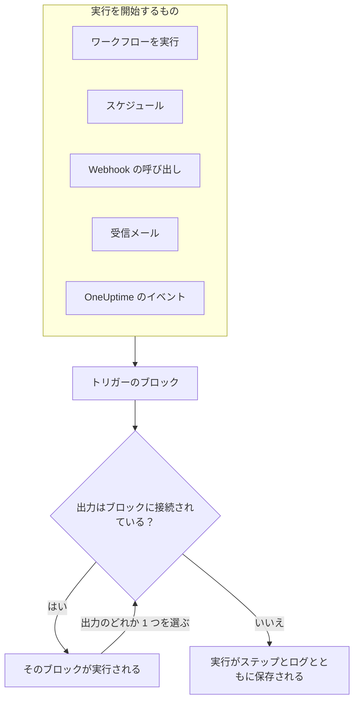
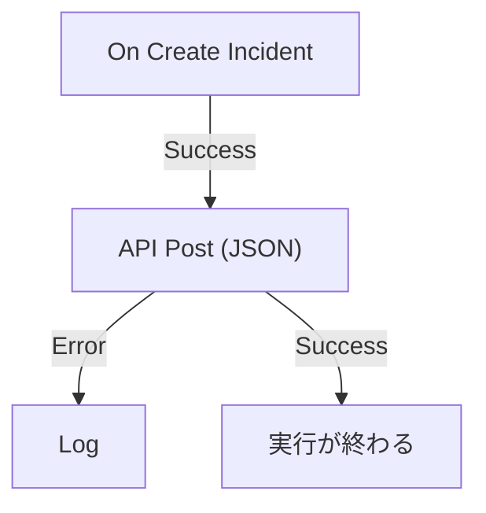

# ワークフロー 概要

ワークフローを使うと、コードを書かずに OneUptime での作業を自動化できます。キャンバスにブロックを置いて線でつなぐと、トリガーが発火するたびにワークフローが自動で実行されます。トリガーとは、インシデントの作成、スケジュールの時刻の到来、別のツールからの URL の呼び出し、メールの受信などです。OneUptime をスタックの他の部分とつなぎ、あなたが問題そのものに取り組んでいるあいだ、定型的なフォローアップを任せるために使います。

:::cards
- [ワークフローを作成する](/docs/workflows/authoring): ワークフローを作成し、キャンバス上でブロックを追加、接続、設定します。
- [トリガー](/docs/workflows/triggers): ワークフローを手動、スケジュール、Webhook、メール、OneUptime のイベントから開始します。
- [コンポーネント](/docs/workflows/components): 追加できるすべてのブロック。API 呼び出しから OneUptime のレコードまで。
- [実行履歴](/docs/workflows/runs-and-logs): 各実行が何をしたかを、ステップごとに確認します。
:::

## ワークフローの仕組み

どのワークフローも 3 つの部分でできています。

1. **トリガー** — ワークフローを開始するもの。手動実行、スケジュール、Webhook の呼び出し、受信メール、または新しいインシデントのような OneUptime 内のイベントです。どのワークフローにもちょうど 1 つあります。
2. **コンポーネント** — ワークフローが行うこと。メッセージの送信、API の呼び出し、条件のチェック、OneUptime のレコードの作成や更新です。
3. **接続** — あるブロックから次のブロックへ引く線です。何の後に何が実行されるかを決めます。

トリガーが発火すると、OneUptime は **実行** を開始します。各ブロックは最後に、**Success** や **Error**、**Yes** や **No** といった出力のどれか 1 つを選び、その出力に接続されたブロックだけが次に実行されます。ブロックが選んだ出力にどのブロックも接続されていなければ、その経路はそこで終わります。実行は、ステータス、たどった経路、各ブロックが受け取って返した内容とともに保存されます。



これらはすべてキャンバス上で視覚的に組み立てます。ほとんどのワークフローにコードはまったく要りません。必要な場合は、**Run Custom JavaScript** ブロックで数行の JavaScript を実行します。

## ワークフローでできること

- **OneUptime を他のツールにつなぐ** — Slack、Microsoft Teams、Discord、Telegram、IRC に投稿する、Jira のチケットを作成する、スタック内の任意の API にリクエストを送る。
- **OneUptime で起きたことに反応する** — インシデントが作成されたら、適切なチャンネルに知らせ、チケットを自動で起票する。
- **スケジュールでジョブを実行する** — 5 分ごと、毎晩、毎週月曜の朝。
- **外部からデータを受け取る** — 他のシステムに、ワークフローの URL の呼び出しやアドレスへのメール送信でワークフローを開始させる。
- **共通の自動化を使い回す** — 一度作れば、他のどのワークフローからでも **Execute Workflow** ブロックで開始できます。

## キー用語

| 用語                 | 意味                                                                                                   |
| -------------------- | ------------------------------------------------------------------------------------------------------ |
| **ワークフロー**     | 自動化全体。名前、ブロックを並べたキャンバス、オン/オフを切り替えるスイッチです。                      |
| **トリガー**         | 最初のブロック。ワークフローがいつ実行されるかを決めます。どのワークフローにもちょうど 1 つあります。  |
| **コンポーネント**   | それ以外のブロック。メッセージを送る、リクエストを送る、条件をチェックする、レコードを変更するなど。  |
| **出力**             | ブロックの下端にある点で、**Success** や **Error** などがあります。そこから出る線が次のブロックへつながります。 |
| **実行**             | ワークフローの 1 回の実行。ステータス、タイムスタンプ、各ブロックが行ったこととともに保存されます。    |
| **グローバル変数**   | API キーのように、一度保存すればプロジェクトのどのワークフローでも使える値です。                      |

## はじめる前に

- **ワークフローを含むプラン。** OneUptime Cloud では、ワークフローには **Growth** プラン以上が必要で、各プランで 30 日ごとに実行できる回数が決まっています。[プランの上限](/docs/workflows/configuration#プランの上限) を参照してください。課金のないセルフホスト環境には、どちらの上限もありません。
- **作成する権限。** ワークフローの作成と変更には、**Workflow Admin**、**Project Admin**、**Project Owner** のいずれか、または対応する権限を持つカスタムロールが必要です。**Workflow Member** はワークフローを開いて手動で実行できますが、変更はできません。[権限](/docs/workflows/configuration#権限) を参照してください。

## OneUptime でワークフローを見つける場所

上部バーの **製品** を開き、**ダッシュボードと自動化** の下にある **ワークフロー** を選びます。そのメニューには次の項目があります。

- **ワークフロー** — ワークフローの一覧です。新しいものを作成するか、既存のものを開きます。
- **グローバル変数** — すべてのワークフローで共有される値です。
- **ログ → 実行履歴** — プロジェクト内のすべてのワークフローの実行履歴です。
- **設定 → ラベルルール** と **所有者ルール** — 新しいワークフローにラベルを付け、所有者を自動で割り当てます。
- **詳細 → アーカイブ済み** — アーカイブしたワークフローです。これらは決して実行されず、一覧には表示されません。ここからアーカイブを解除できます。[ワークフローのアーカイブ](/docs/workflows/configuration#ワークフローのアーカイブ) を参照してください。
- **開発者** — Terraform、API、AI アシスタントでワークフローを管理する方法です。

個々のワークフローを開くと、そのワークフロー自身のメニューには次の項目があります。

- **概要** — 名前、説明、ラベル、**有効** スイッチ。
- **ビルダー** — ワークフローを設計するキャンバスで、上部に **有効** スイッチがあります。
- **ワークフロー変数** — このワークフローだけで使う値です。
- **ログ → 実行履歴** — このワークフローの各実行とその詳細です。
- **所有者** — ワークフローに責任を持つ人とチームです。
- **開発者** — Terraform、API、AI アシスタントでこのワークフローを管理する方法です。
- **設定** — 複製、エクスポート、アーカイブ。

**設定** は、メニューの **詳細** セクションに **監査ログ** と **ワークフローを削除** と一緒にあります。**詳細** と **開発者** は、このメニューでも他のすべてのメニューでも最初は折りたたまれているため、毎日使うページが先に並びます。セクション名をクリックすると、そのページが表示されます。そのいずれかのページを開いているときは、自動で展開されます。

## 最初のワークフローを作る

どのワークフローも同じ流れでできあがります。

:::steps
1. **作成** — 出発点を選び、ワークフローに名前を付けます。[ワークフローを作成する](/docs/workflows/authoring) を参照してください。
2. **トリガーを選ぶ** — 手動、スケジュール、Webhook、受信メール、または OneUptime のイベント。[トリガー](/docs/workflows/triggers) を参照してください。
3. **コンポーネントを追加** — キャンバスにアクションを置き、接続します。[コンポーネント](/docs/workflows/components) を参照してください。
4. **オンにする** — **ビルダー** の上部で **有効** をオンにします。無効なワークフローは、手動であってもまったく実行できません。
5. **テスト** — **ビルダー** で **ワークフローを実行** をクリックし、実行の様子をその場で見守ります。
:::

以下の例では、実際のワークフローでこの手順をたどります。

## 例: 新しいインシデントを Webhook に送る

このワークフローは、新しいインシデントごとに JSON の概要を、指定した URL（チケット管理システム、データウェアハウスなど、Webhook を受け付けるものなら何でも）に送り、リクエストが失敗したときは理由を実行のログに書き込みます。



> [!TIP]
> **Forward new incidents to another system** テンプレートを使うと、同じワークフローを自動で組み立てられます。ワークフローの作成時に **インシデント** の下にあります。

:::steps
### ワークフローを作成する

**ワークフロー** を開き、**ワークフローを作成** をクリックします。**ゼロから作成** をクリックし、ワークフローに `Send new incidents to a webhook` という名前を付けて、**ワークフローを作成** をクリックします。

新しいワークフローは、オフの状態で **ビルダー** に開きます。

### トリガーを追加する

点線の **このワークフローを開始するものを選択** ブロックをクリックし、**トリガーを追加** パネルの **人気** の下にある **On Create Incident** をクリックします。

トリガーが点線のブロックの位置に置かれます。そこに表示される ID `incident-on-create-1` が、後続のブロックがこのトリガーを参照するときに使うものです。

### インシデントのフィールドを選ぶ

トリガーをクリックします。**Select Fields** で、リクエストに含めるフィールド（タイトルや説明など）にチェックを入れ、**保存** をクリックします。

トリガーは新しいインシデントをこれらのフィールドとともに次へ渡します。選ばなかったフィールドは空で届きます。

### API ブロックを追加する

**コンポーネントを追加** をクリックし、**人気** の下にある **API Post (JSON)** をクリックします。トリガーの **Success** の点から、新しいブロックの上端の点までドラッグします。

### リクエストを入力する

**クリックしてセットアップ** と表示されている API ブロックをクリックします。**URL** にエンドポイントを入力します。**Request Body** に送信する JSON を書き、必要な場所で **{ }** を使ってインシデントのフィールドを挿入し、**保存** をクリックします。

```json title="Request Body"
{
  "id": "{{local.components.incident-on-create-1.returnValues.model._id}}",
  "title": "{{local.components.incident-on-create-1.returnValues.model.title}}",
  "description": "{{local.components.incident-on-create-1.returnValues.model.description}}"
}
```

ワークフローの実行時に、各 `{{…}}` 参照はインシデントの値に置き換えられます。構文については [変数](/docs/workflows/variables) を参照してください。

### 失敗を捕まえる

**コンポーネントを追加** をクリックし、**ログ** をクリックします。API ブロックの **Error** の点をそこに接続し、Log ブロックの **Value** を `Could not send the incident: {{local.components.api-post-1.returnValues.error}}` に設定します。

失敗したリクエスト（到達できない URL や 2xx 以外の応答）は、この経路をたどるようになり、実行のログに理由が記録されます。

### オンにする

**ビルダー** の上部で **有効** をオンにします。

### テストする

**ワークフローを実行** をクリックし、このプロジェクトのインシデントの **インシデント ID** を入力して、**ワークフローを手動で実行** をクリックし、**実行** で確定します。

**ワークフローの実行** パネルが開き、実行を追いかけます。**API Post (JSON)** ステップを開くと、送信した本文と受け取った応答を確認できます。
:::

これ以降、プロジェクトで新しいインシデントが起きるたびに実行が始まります。すべてワークフローの [実行履歴](/docs/workflows/runs-and-logs) で確認できます。

> [!NOTE]
> リクエストは OneUptime から送信されます。OneUptime Cloud では、URL がインターネットから到達可能である必要があります。セルフホスト環境では、管理者が許可しない限りプライベートネットワークのアドレスは拒否されます。[送信ネットワークアクセス](/docs/workflows/configuration#送信ネットワークアクセス) を参照してください。

## ワークフローと OneUptime の他の機能との関係

- **モニター** が問題を見つけます。**インシデント** と **アラート** がそれを記録します。**ワークフロー** がそれに反応します。
- **Runbook** は、インシデント、アラート、メンテナンスのときにチームが進める対応手順です。手動のステップ、承認、スクリプトがあり、人が関わります。ワークフローは無人で実行されます。途中で人が判断する必要があるときは [Runbook](/docs/runbooks/index) を、すべてのステップが自動のときはワークフローを使ってください。
- **ワークスペース接続** は、インシデントチャンネルと通知のためにプロジェクトを Slack と Microsoft Teams につなぎます。ワークフローの Slack と Microsoft Teams のブロックはこれを使いません。各ブロックは自分専用の受信 Webhook URL を通して投稿します。

## 次のステップ

:::cards
- [ワークフローを作成する](/docs/workflows/authoring): キャンバス、ブロック、その設定の扱い方。
- [変数](/docs/workflows/variables): ブロック間でデータを渡し、シークレットをワークフローから切り離します。
- [設定と安全性](/docs/workflows/configuration): 本番運用の前に、権限、上限、セキュリティを確認します。
:::
