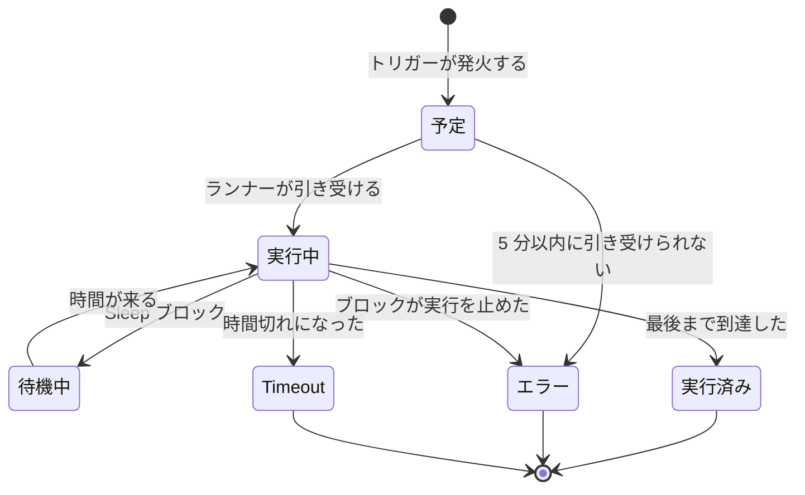

# ワークフロー 実行履歴

ワークフローが実行されるたびに、OneUptime は何が起きたかの記録を保存します。いつ実行されたか、うまくいったか、各ブロックが何を受け取って何を返したかです。この記録を **実行** と呼びます。実行を見れば、ワークフローが動いたことを確認し、動かなかったものを調査し、過去の動きを振り返れます。

:::cards
- [実行のステータス](#実行のステータス): 予定、待機中、実行済みなどのステータスの意味。
- [実行の読み方](#実行の読み方): 実行がたどった経路を、ブロックごとに追います。
- [トラブルシューティング](#トラブルシューティング): 実行されなかったワークフロー、実行されなかったブロック、空で届いた値。
:::

## 見つける場所

| ページ                                               | 表示される内容                                                                                     |
| ---------------------------------------------------- | -------------------------------------------------------------------------------------------------- |
| **ワークフロー → ログ → 実行履歴**（ワークフローのメニュー） | プロジェクト内のすべてのワークフローのすべての実行。ワークフロー名、ステータス、時間で絞り込めます。 |
| **ワークフロー → ログ → 実行履歴**（個々のワークフローのメニュー） | このワークフローの実行だけ。ここにはワークフローの絞り込みの代わりに **実行 ID** の絞り込みがあります。 |
| **個々の実行**                                       | 実行の行にある **ログを表示** ボタンで開きます。行そのものはクリックできません。                   |

**ビルダー** から実行を開始すると、同じ **ワークフローの実行** ビューが、すでにその実行を追いかけた状態で開きます。そのため、後から探しに行くのではなく、実行の様子をその場で見られます。

## 実行のステータス

| ステータス                          | 意味                                                                                                                                                                                                                                                                  |
| ----------------------------------- | --------------------------------------------------------------------------------------------------------------------------------------------------------------------------------------------------------------------------------------------------------------------- |
| **予定**                            | トリガーが発火し、実行がランナーの順番待ちをしています。通常は 1 秒もかかりません。5 分たっても予定のままの実行は失敗します。どれも引き受けなかったということです。                                                                                                 |
| **実行中**                          | ワークフローが進行中です。                                                                                                                                                                                                                                            |
| **待機中**                          | 実行が **Sleep** ブロックで止まっていて、自動で再開します。待っているあいだ、ワーカーを占有しません。                                                                                                                                                                |
| **実行済み**                        | 実行が失敗せずに最後まで到達しました。これが成功の状態です。ピルの表示は「成功」ではなく **実行済み** です。                                                                                                                                                         |
| **エラー**                          | ブロックが実行を止めました。キューに入った実行が引き受けられなかったとき、スリープ中の実行の再開が失われたとき、スケジュールの式を解決できないとき、実行が **Sleep** ブロックで待っているあいだにワークフローがオフにされたかアーカイブされたときにも使われます。 |
| **Timeout**                         | 実行が許可された時間を超えました。既定では 2 分です。[1 回の実行にかけられる時間](/docs/workflows/configuration#1-回の実行にかけられる時間) を参照してください。                                                                                                        |
| **Execution Exceeded Current Plan** | プロジェクトが直近 30 日のワークフロー実行回数を使い切ったか、サブスクリプションが未払いです。実行は記録されますが、処理されません。OneUptime Cloud のみ。                                                                                                          |

**Error** の出力を選んだブロック（たとえば 4xx の応答を受けた API ブロック）は、実行を失敗させません。**Error** に接続されたブロックが実行され、実行はそれでも **実行済み** で終わります。そのステップ自体は赤で表示されるので、見つけられます。

## 実行の読み方

実行の **ログを表示** をクリックして開きます。**ワークフローの実行** ビューには **ステップ** と **完全なログ** の 2 つのタブがあります。

### ステップタブ

実行がたどった経路で、ブロックごとに番号付きのカードが実行順に並びます。何も開かなくても、各カードには次の内容が表示されます。

- ブロックのタイトルと ID、**成功** か **失敗** か、かかった時間。
- どの出力を選んだか（キャンバスでの名前で）と、その行き先。次のステップの番号と名前か、何も接続されていないため実行またはそのブランチがそこで終わったという注記です。行き先として示されたのに実行されなかったステップには **（実行されませんでした）** と表示されます。Error の出力は赤で表示されます。Yes と No は実行が進んだ方向にすぎません。出力の名前にポインターを重ねると、その意味が表示されます。
- 失敗した場合はステップのエラー、およびそれに関する警告。たとえば、何にも解決されなかった `{{…}}` 参照です。

カードを開くと、詳細が 2 つのブロックで表示されます。

| ブロック     | 表示内容                                                                                                                                                                                                        |
| ------------ | --------------------------------------------------------------------------------------------------------------------------------------------------------------------------------------------------------------- |
| **受信済み** | すべての変数が埋められた後に、ブロックに渡された設定。名前と、設定の一覧の順で表示されます。別のステップや変数を参照する設定は、参照とそれがなった値を並べて表示し、何にもならなかった場合は **解決しませんでした** と表示します。 |
| **返却**     | 生成したもの。各値の ID（`returnValues` 参照の最後の部分）とともに表示されます。リストとオブジェクトはインデント付きで表示されます。                                                                             |

失敗したステップ、警告のあるステップ、実行の唯一のステップは、開いた状態で表示されます。**ステップ** タブの件数は、何かが失敗したときは赤、ステップに警告があるときはオレンジになります。

読み方が異なる実行もあります。

- **1 つのステップのテスト。** **このステップだけを実行** で開始した実行には、上部に **このステップのみが実行されました** と表示されます。その前のステップは実行されていないため、そこから読む値はありません（それらには **解決しませんでした** の警告が出ます）。また、その後のステップには **（このテストでは実行されません）** と表示されます。経路全体を試すには **ワークフローを実行** を使ってください。
- **ステップの間で止まった実行。** どのステップでも説明できない理由で実行が止まった場合（ステップの間で時間切れになった、最初のステップの前に失敗したなど）、経路は **実行はここで停止しました** と理由で終わります。
- **スリープ中の実行。** **Sleep** ブロックで待っている実行は、**スリープ中** と、自動で再開する時刻で終わります。Sleep の後のステップには **（まだ実行されていません）** と表示されます。

各ステップのタイトルの下にある ID は、`{{local.components.<id>.returnValues.…}}` 参照に入れるものそのものなので、参照を正しく書く一番の近道です。

表示される値は、変数が埋められた後、ブロックがそれを使って何かをする前に受け取ったものです。例外は 2 つあります。シークレットと、ブロックが機密とマークしたフィールドは伏せられ、4,000 文字を超える値は "… (truncated)" で切り詰められます。実行は直近の 100 ステップを保持します。長い実行や頻繁に再開された実行では、それより前のステップが捨てられた場所にオレンジの注記が表示されます。出力の名前が保存されるようになる前に記録された実行では、出力が ID で表示され、行き先は表示されません。

### 完全なログタブ

ランナーが書き出した生のログを 1 行ずつ表示します。**Log** ブロックの値やスクリプトの `console.log` など、ブロック自身が記録したものも含まれます。ステップタブで失敗の理由が分からないときに使います。

## 実行のコピーとダウンロード

**ワークフローの実行** ビューの上部、閉じるボタンの横にある **ログをコピー** は、**完全なログ** 全体をクリップボードに入れるので、チャットやチケットにそのまま貼り付けられます。**ダウンロード** は実行をファイルとして保存します。

| ダウンロード                            | 得られるもの                                                                                                                                                                                                                           |
| --------------------------------------- | -------------------------------------------------------------------------------------------------------------------------------------------------------------------------------------------------------------------------------------- |
| **ログをダウンロード**                  | ランナーが出力したとおりの完全なログを、長さにかかわらず収めた `.txt` ファイル。短い見出しとして、ワークフローの名前と ID、実行 ID、ステータス、予定、開始、完了の日時が付きます。                                                     |
| **実行を JSON でダウンロード**          | 同じ情報をデータとして、**ステップ** タブに表示されるステップ（各ステップが受け取ったものと返したもの、選んだ出力）と、行のリストとしてのログを収めた `.json` ファイル。ステップは API が実行の `stepTrace` を返すときと同じ形で、**ステップ** タブと同じく実行の直近 100 件です。ログは常に完全です。 |

同じ 2 つのダウンロードは、どちらの実行一覧でも各実行の **⋯** メニューにあるので、実行を開かずに保存できます。**ビルダー** から開始した実行は、まだ進行中でもコピーやダウンロードができます。その時点までに記録された内容が得られます。

ファイル名は、ワークフロー、実行、開始時刻（UTC）に基づくので、それらを入れたフォルダーはワークフロー順、次に時刻順に並びます: `nightly-sync-run-<run id>-2026-09-30T10-00-01.txt`。

ダウンロードには、実行の中ですでに読めなかったものは何も含まれません。シークレットと、ブロックが機密とマークしたフィールドは実行の記録時に伏せられるため、ファイルでも伏せられています。また、実行を開ける人なら誰でもダウンロードできます。

## トラブルシューティング

:::details ワークフローが実行されなかった
1. ワークフローが **有効** になっていることを確認してください。スイッチはその **ビルダー** の上部にあり、ワークフローがオフのときはキャンバスの上にそう表示されます。新しいワークフローは無効の状態で始まり、無効なワークフローは手動のものも含めてすべての実行を拒否します。Webhook の呼び出しには、オンにする方法を示すメッセージとともに HTTP 400 が返ります。
2. OneUptime のイベントトリガーでは、イベントが実際に起きたことを確認してください。レコードを開いて履歴を確認します。**Listen on** を設定した **On Update** トリガーは、そのフィールドのどれかが変わったときにだけ発火します。
3. Webhook トリガーでは、相手のシステムが正しい URL に送っていることを確認してください。ほとんどのツールは Webhook の送信をログに残すので、そこを確認します。
4. スケジュールトリガーでは、cron 式が期待する時刻と合っていることを確認してください。スケジュールは UTC で動作します。

実行が **Execution Exceeded Current Plan** のステータスで表示される場合、プロジェクトが直近 30 日のワークフロー実行回数をすべて使ったか、サブスクリプションが未払いです。実行のログには、回数とプランの上限が示されます。これは OneUptime Cloud にのみ当てはまります。
:::

:::details 後続のブロックが実行されなかった
実行されないブロックは、たいてい接続の問題です。**ビルダー** を開いて確認してください。

- 前のブロックの出力が、このブロックの入力に接続されていますか？
- 前のブロックが、期待と違う出力を選んでいませんか？ **Success** ではなく **Error**、**Yes** ではなく **No** などです。**ステップ** タブには、どの出力を選んでどこへ進んだか、または何も接続されていないことが表示されます。
:::

:::details 値が空、または {{…}} のテキストのまま届いた
実行を開いてステップを確認してください。解決されなかった参照は、そのステップに警告として示され、**受信済み** ブロックの該当する設定には **解決しませんでした** と印が付きます。

- `{{local.components.…}}` というテキストがそのまま見える場合は、参照が解決されていません。たいていはコンポーネント ID か戻り値の ID のタイプミスです。ブロックに表示されている名前ではなく、ブロックの **識別子** であることを思い出してください。`local.components` 自体の綴りも確認してください。`{{local.componets.api-get-1.returnValues.response-body}}` はそのままのテキストとして送られ、実行はそれでも **実行済み** と報告します。実行が **このステップだけを実行** のテストだった場合、前のブロックはまったく実行されていません。ワークフロー全体を実行してください。
- **空のテキスト** と表示される場合、前のブロックは実行されましたが、そのフィールドを生成しませんでした。

同じ警告は、**完全なログ** タブにも `Warning:` で始まる行として表示されます。
:::

:::details 手動で実行すると動くが、トリガーからだと動かない
**ビルダー** を開いて **ワークフローを実行** をクリックし、本物のトリガーが送るものに似た値でトリガーのフィールドを埋めます。次に、その実行の **受信済み** の値と本物の実行の値を並べて比べます。違いはたいてい、1 つのフィールドの名前か型です。
:::

## ワークフローを再実行する

「この実行を再試行」ボタンはありません。古い実行が自動で再実行されることはありません。その副作用 — Slack のメッセージ、API 呼び出し、チケット — を繰り返すのが安全とは限らないからです。やり直すには、ワークフローを修正して次の本物のトリガーで開始させるか、**ビルダー** を開いて同じ値で **ワークフローを実行** をクリックします。

## 実行はどれくらい保持されるか

OneUptime Cloud では、実行は **30 日** 保持された後に削除されます。どちらの実行一覧も直近 30 日分と説明しているのはそのためです。セルフホスト環境では、削除するまで実行が保持されます。ワークフローの実行頻度が高く履歴が散らかる場合は、オフにするか削除してください。

ステップのトレースが追加される前に記録された実行には **ステップ** の内容がなく、**完全なログ** だけが表示されます。

## 次のステップ

:::cards
- [設定と安全性](/docs/workflows/configuration): 時間の上限、プランの上限、記録で伏せられるもの。
- [変数](/docs/workflows/variables): ブロックが使う参照の構文。
- [コンポーネント](/docs/workflows/components): 各ブロックが返すものと、各出力を選ぶタイミング。
:::
