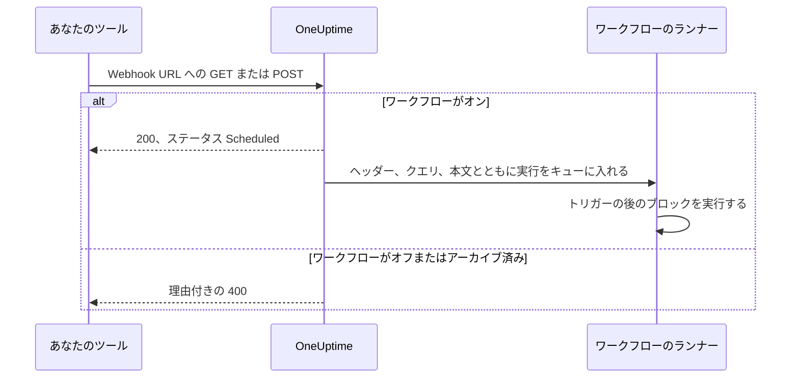
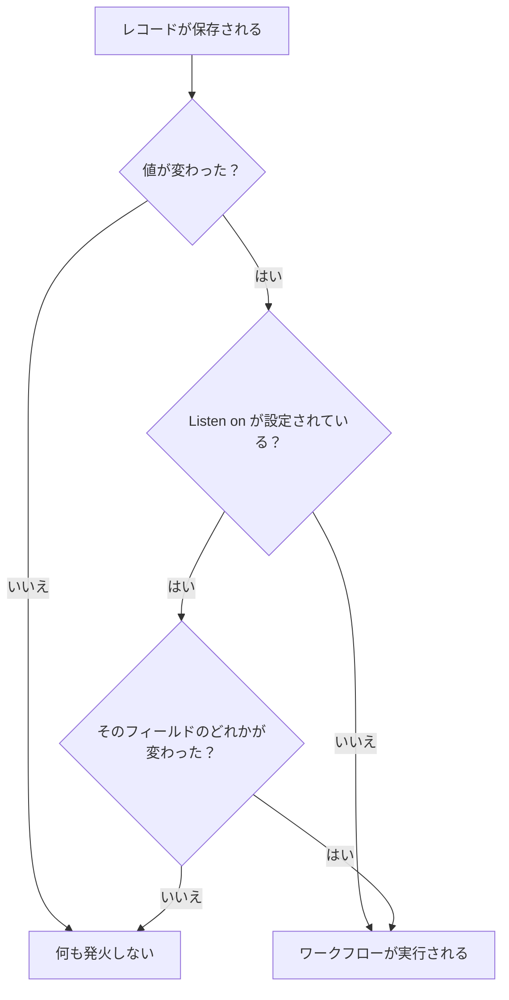

# ワークフロー トリガー

トリガーはワークフローの最初のブロックで、ワークフローがいつ実行されるかを決めます。どのワークフローにもトリガーはちょうど 1 つです。5 つの種類から選びます。

:::cards
- [手動](#manual): ビルダーまたは別のワークフローからワークフローを開始します。
- [スケジュール](#schedule): cron 式で書いた繰り返しのスケジュールで実行します。
- [Webhook](#webhook): 別のシステムに URL を呼び出させて開始します。
- [受信メール](#incoming-email): ワークフロー専用のアドレスに送られたメールごとに開始します。
- [OneUptime のイベントトリガー](#oneuptime-のイベントトリガー): レコードの作成、更新、削除に反応します。
:::

トリガーを追加するには、新しいワークフローのキャンバスにある点線の **このワークフローを開始するものを選択** ブロックをクリックします。変更するには、トリガーのブロックを削除すると、点線のブロックが戻ってきます。[ワークフローを作成する](/docs/workflows/authoring#ブロックの追加) を参照してください。

## どのトリガーを使うべきか

| やりたいこと                                   | 選ぶもの                    |
| ---------------------------------------------- | --------------------------- |
| ボタンをクリックしてワークフローを実行する     | **手動**                    |
| 繰り返しのスケジュールで実行する               | **スケジュール**            |
| 別のシステムからデータを送り込ませる           | **Webhook**                 |
| メールをきっかけに始める                       | **Incoming Email**          |
| OneUptime 内の出来事に反応する                 | **OneUptime のイベント**    |

ワークフローに置けるトリガーは 1 つだけです。同じ自動化を 2 通りの方法で開始したい場合は、共通のロジックを **手動** トリガーのワークフローに組み、2 つの薄い「ラッパー」ワークフローから **Execute Workflow** ブロックでそれを開始します。

## Manual

好きなときにワークフローを実行します。**ビルダー** ページで **ワークフローを実行** をクリックし、トリガーの **JSON** を入力して **ワークフローを手動で実行** をクリックし、**実行** で確定します。別のワークフローから **Execute Workflow** ブロックで開始することもできます。

向いている用途: 「このキーをローテーションする」「テストアラートを送る」のような、ボタンを用意したいワンクリックの自動化や、ワークフロー間で共有するロジック。

**戻り**: **JSON** — 実行の開始時に渡された内容。

- **ワークフローを実行** からの場合は、入力した JSON がテキストとして届きます。その中のフィールドを読むには、まず **Text to JSON** ブロックを通します。
- **Execute Workflow** ブロックからの場合は、ブロックの **Arguments** の各キーが個別の値になります。`{"customerId": "42"}` なら、後続のブロックは `{{local.components.manual-1.returnValues.customerId}}` を読みます。`manual-1` は手動トリガーの ID です。

## Schedule

繰り返しのスケジュールでワークフローを実行します。頻度は **Schedule at** で設定します。**よく使うスケジュール** から 1 つ選ぶか、**カスタム cron** 式を入力するか、それを含む **変数** を選びます。フィールドの下に、スケジュールが言葉で説明され、**次回の実行** が表示されます。

向いている用途: 夜間のクリーンアップ、1 時間ごとの同期、週次レポート。

時刻は UTC なので、時刻を選ぶときは自分のタイムゾーンから換算してください。cron 式の 5 つの部分は、分、時、日、月、曜日です。

| 式            | 実行タイミング                         |
| ------------- | -------------------------------------- |
| `*/5 * * * *` | 5 分ごと。                             |
| `0 * * * *`   | 毎時ちょうど。                         |
| `0 0 * * *`   | 毎日 UTC の午前 0 時。                 |
| `0 9 * * 1-5` | 平日の毎日 UTC 9:00。                  |
| `0 9 * * 1`   | 毎週月曜日 UTC 9:00。                  |

ワークフローがオフのあいだは何もスケジュールされません。**変数** を使ったスケジュールは、`{{local.variables.schedule}}` のようなワークフロー変数またはグローバル変数を読みます。それが有効な cron 式にならない場合、ワークフローはスケジュールされず、実行履歴の失敗した実行に理由が示されます。

スケジュールを待たずにワークフローをテストするには、**ビルダー** で **ワークフローを実行** をクリックします。すぐに実行が始まります。

## Webhook

OneUptime がワークフローに専用の URL を発行します。その URL を呼び出すものは何でもワークフローを開始し、リクエストのヘッダー、クエリパラメーター、本文を渡します。

向いている用途: 別のツールから OneUptime にデータを取り込むこと — CI/CD のコールバック、他の監視ツールからのアラート、CRM での登録など。

URL を取得するには、キャンバス上の Webhook トリガーをクリックします。設定の上部に URL があり、**URL をコピー** ボタン、受け付けるメソッド、試しに実行できるようターミナルに貼り付けられる `curl` コマンドが表示されます。

```bash
curl -X POST "https://oneuptime.example.com/workflow/trigger/<secret key>" \
  -H "Content-Type: application/json" \
  -d '{"message": "Hello"}'
```

URL は `GET` と `POST` の両方を受け付けます。呼び出し元にはすぐに確認応答 `{"status": "Scheduled"}` が返ります。ワークフロー自体はバックグラウンドで実行されるため、呼び出し元がその処理内容を見ることはありません。オフまたはアーカイブ済みのワークフローへの呼び出しは、HTTP 400 と理由とともに拒否されます。



**戻り**:

| 値                       | 内容                                                                                                                   |
| ------------------------ | ---------------------------------------------------------------------------------------------------------------------- |
| **Request Headers**      | リクエストのすべてのヘッダー。`content-type` のように小文字の名前で表されます。                                         |
| **Request Query Params** | URL のクエリパラメーター。名前で表されます。                                                                           |
| **Request Body**         | 呼び出し元が送った本文。`Content-Type: application/json` で送られた JSON の本文は、フィールドごとに読めます。          |

1 つのフィールドを読むには、`{{local.components.webhook-1.returnValues.request-body.message}}` のように、その名前を参照に付け加えます。

リクエストが届くと、トリガーの後の各ブロックの値ピッカーは、その中身を把握します。本文のフィールド、ヘッダー、クエリパラメーターがそれぞれの内容とともに表示されるので、パスを入力する代わりに `incident.title` を選べます。それまでは、まだリクエストが届いていないことが表示され、URL への `curl` コマンドである **Copy test request** が提示されます。フィールドは、そのリクエストが開始した実行が終わり次第表示されます。[前のブロックの値を使う](/docs/workflows/authoring#前のブロックの値を使う) を参照してください。

もう一方のツールを使わずにワークフローをテストするには、**ビルダー** で **ワークフローを実行** をクリックし、ヘッダー、クエリパラメーター、本文を入力します。

### URL を非公開に保つ

URL の最後の部分はワークフローのシークレットキーで、URL を持っている人は誰でもワークフローを開始できます。そのため、**表示** をクリックするまでキーは隠され、**URL をコピー** は URL を表示せずに全体をコピーします。

URL が漏れた場合は、同じ場所で **URL をリセット** をクリックします。ワークフローに新しい URL が発行され、古い URL はすぐに使えなくなるので、それを呼び出しているものをすべて更新してください。URL を表示またはリセットできるのは、ワークフローを編集できる人だけです。[Webhook のセキュリティ](/docs/workflows/configuration#webhook-のセキュリティ) を参照してください。

> [!WARNING]
> URL はパスワードと同じように扱ってください。URL を持っている人は誰でも、サインインせずにワークフローを開始できます。

## Incoming Email

OneUptime がワークフローに専用のメールアドレスを発行します。そのアドレスに送られたメールはそれぞれワークフローを開始し、メールの内容（送信者、宛先、件名、テキストと HTML、ヘッダー、添付ファイルがあればその名前）を渡します。

向いている用途: Webhook を呼び出せないシステムからのメールに対応すること — 古い監視ツールからのアラート、ベンダーのステータス通知、夜間ジョブがメールで送ってくるレポートなど。

アドレスを取得するには、キャンバス上の Incoming Email トリガーをクリックします。設定の上部にアドレスがあり、**アドレスをコピー** ボタンが付いています。これを、ワークフローを開始させたいものに渡します。メールしか送れないツール、ベンダーの通知設定、自分のメールボックスの転送ルールなどです。

メールはそれぞれ独自の実行を開始します。アドレスが To にあっても Cc にあっても、Bcc でも、転送ルール経由でも、メールはワークフローに届きます。アドレスを 2 回含むメールでも、開始される実行は 1 つです。

**戻り**:

| 値              | 内容                                                                                                     |
| --------------- | -------------------------------------------------------------------------------------------------------- |
| **From**        | 送信者のアドレス。                                                                                       |
| **To**          | メールの宛先すべてを 1 行で。例: `ops@example.com, oncall@example.com`。                                 |
| **CC**          | メールの CC 先すべてを 1 行で。                                                                          |
| **Subject**     | 件名。                                                                                                   |
| **Body**        | メールのプレーンテキスト。                                                                               |
| **HTML Body**   | メールの HTML（ある場合）。Body と HTML Body はそれぞれ 1 MB で切り詰められます。                         |
| **Headers**     | メールのすべてのヘッダー。`message-id` のように小文字の名前で表されます。                                 |
| **Attachments** | 各添付ファイルの名前、種類、サイズ。ファイル自体は保存されません。                                       |
| **Received At** | OneUptime がメールを受信した日時。                                                                       |

メールが届くと、トリガーの後の各ブロックの値ピッカーは、その中身を把握します。メールにあった各ヘッダーと各添付ファイルがその内容とともに表示されるので、パスを入力する代わりに `headers.message-id` を選べます。それまでは、まだアドレスにメールが届いていないことが表示されます。[前のブロックの値を使う](/docs/workflows/authoring#前のブロックの値を使う) を参照してください。

メールを送らずにワークフローを試すには、**ビルダー** ページで **ワークフローを実行** をクリックし、送信者、件名、本文を入力します。入力しなかった値は空で届きます。

メールがワークフローを開始するのは、ワークフローがオンのあいだだけです。オフのワークフローへのメールは無視され、トリガーがもう Incoming Email ではないワークフローへのメールも無視されます。

### アドレスを非公開に保つ

アドレスの `@` より前の部分にはワークフローのシークレットキーが含まれ、アドレスを持っている人は誰でもワークフローを開始できます。そのため、**表示** をクリックするまでキーは隠され、**アドレスをコピー** はアドレスを表示せずに全体をコピーします。

アドレスが漏れた場合は、同じ場所で **アドレスをリセット** をクリックします。ワークフローに新しいアドレスが発行され、それ以降古いアドレスへのメールは無視されるので、ワークフローにメールを送っているものすべてに新しいアドレスを伝えてください。アドレスを表示またはリセットできるのは、ワークフローを編集できる人だけです。[受信メールのセキュリティ](/docs/workflows/configuration#受信メールのセキュリティ) を参照してください。

> [!WARNING]
> メールの送信者は誰でも好きなように設定できるため、**From** は送信者の証明にはなりません。ステップが重要な処理を行う前に、本物の送信者だけが知っていることを確認してください。

> [!NOTE]
> セルフホスト環境では、OneUptime は管理者が設定する受信メールプロバイダーを通してメールを受け取ります。[SendGrid Inbound Email](/docs/self-hosted/sendgrid-inbound-email) を参照してください。それまではトリガーにアドレスがなく、設定にそのことが表示されます。

## OneUptime のイベントトリガー

OneUptime のほぼすべてのもの — モニター、インシデント、アラート、計画メンテナンス、ステータスページ、オンコールポリシー、チーム — がワークフローを開始できます。それぞれ最大 3 つのイベントがあります。

- **On Create** — 新しいものが追加されたときに発火します。
- **On Update** — 変更されたときに発火します。保存済みの値のままレコードを保存すること（変更せずに保存したフォームや、すでにその状態のスイッチの送信など）は変更ではないため、発火しません。
- **On Delete** — 削除されたときに発火します。

これで、ループで何かを確認し続けることなく、「OneUptime で X が起きたら Y をする」を組み立てられます。

**On Update** は **Listen on** で一部のフィールドに絞り込めます。その場合、更新がそのいずれかを何らかの値に変更したときだけ発火します。スイッチをオフにすることやフィールドを空にすることも含まれます。



**On Create** と **On Update** は、トリガーの **Select Fields** で選んだフィールドとともにレコードを次のブロックへ渡します。たとえば **Incident → On Create** トリガーは新しいインシデントを渡すので、次のブロックは `{{local.components.incident-on-create-1.returnValues.model.title}}` のように、そのタイトル、説明、重大度、または選んだ他の任意のフィールドを読めます。選ばなかったフィールドは空で届きます。

**On Delete** が渡すのは、削除されたレコードの ID だけです。ワークフローの実行時にはレコードはもうないため、他のフィールドは読めません。

イベントを待たずにイベントトリガーをテストするには、**ビルダー** で **ワークフローを実行** をクリックし、**インシデント ID** のような既存のレコードの ID を入力します。実行は、選んだフィールドとともにそのレコードを読み込みます。

### チームがよく使うイベント

| リソース                                  | チームでの使い道                                                                          |
| ----------------------------------------- | ----------------------------------------------------------------------------------------- |
| **インシデント**                          | インシデントが宣言、更新（確認済み、解決済み）、削除されたときに反応する。                |
| **アラート**                              | 同じ 3 つのイベントをアラートで。                                                         |
| **モニター**                              | モニターが追加、編集、削除されたときに反応する。                                          |
| **定期メンテナンスイベント**              | メンテナンス枠がスケジュールされたら自動で告知する。                                      |
| **ステータスページの購読者**              | ステータスページを購読した人を歓迎する。                                                  |
| **オンコールポリシー**                    | ポリシーの変更を別のオンコールシステムと同期する。                                        |

**トリガーを追加** パネルでは、これらは **OneUptime のリソース** の下にあります。リソースをクリックしてから、トリガーをクリックします。**すべてのリソースを参照** にはすべてがあり、検索ボックスでは `incident created` のように数語でトリガーを見つけられます。

## 次のステップ

:::cards
- [コンポーネント](/docs/workflows/components): トリガーの後に追加するアクション。
- [変数](/docs/workflows/variables): トリガーが渡したものを後続のブロックで読みます。
- [実行履歴](/docs/workflows/runs-and-logs): トリガーが発火したことを確認し、何を受け取ったかを見ます。
:::
