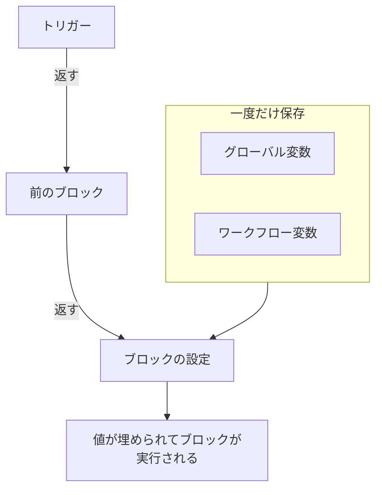
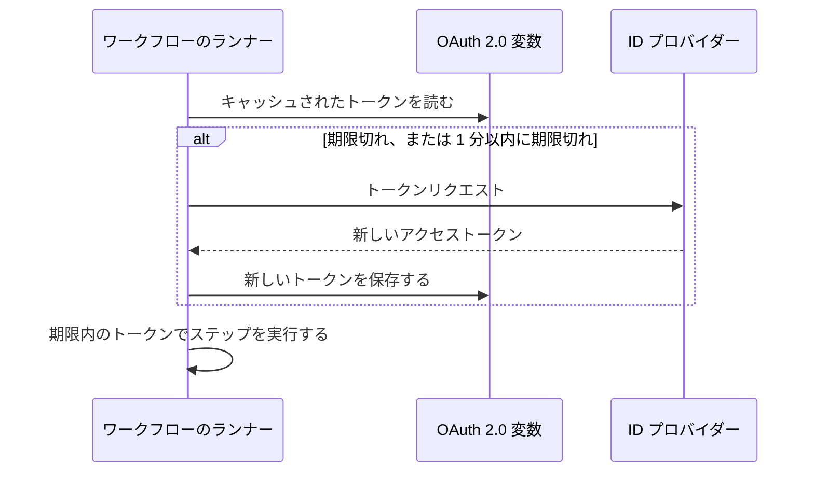

# ワークフロー 変数

変数は、データがワークフローの中を流れる仕組みです。トリガーから最初のブロックへ、あるブロックから次のブロックへ、そして一度保存した値から、それを必要とするすべてのブロックへと流れます。ブロックの設定は二重の波かっこで囲んだ参照で値を読み、ランナーはブロックが実行される直前にそれを埋めます。

| 値                             | 出どころ                                                             | ブロックからの読み方                                  |
| ------------------------------ | -------------------------------------------------------------------- | ----------------------------------------------------- |
| **グローバル変数**             | **ワークフロー → グローバル変数** に保存                             | `{{global.variables.NAME}}`                          |
| **ワークフロー変数**           | 1 つのワークフローの **ワークフロー変数** ページに保存               | `{{local.variables.NAME}}`                           |
| **前のブロックの値**           | この実行でトリガーまたは前のブロックが返したもの                     | `{{local.components.BLOCK_ID.returnValues.VALUE_ID}}` |



参照を自分で入力することはほとんどありません。設定の末尾にある **{ }** をクリックするか、設定に `{{` と入力し、一覧から値を選びます。[前のブロックの値を使う](/docs/workflows/authoring#前のブロックの値を使う) を参照してください。

## グローバル変数

一度保存してすべてのワークフローで使い回す、プロジェクト全体の値です。API キー、URL、チャンネル名など、10 個の別々のワークフローにコピーしたくないものすべてです。

:::steps
### グローバル変数を開く

**ワークフロー → グローバル変数** に移動し、**ワークフロー変数を作成** をクリックします。

### 変数に名前を付ける

**変数** ステップで次を入力します。

- **名前** — 変数を参照するときに使う名前。2 文字以上で、空白は使えず、文字、数字、ハイフン、アンダースコアだけが使えます。ブロックの中で目立つので、`UPPER_SNAKE_CASE` にする習慣がおすすめです。
- **説明** — 何のための変数かを思い出せるようにする任意の自由記述。

**次へ** をクリックします。

### 値を設定する

**値** ステップで次を入力します。

- **コンテンツ** — 値そのもの。長いテキスト用の欄なので、複数行の値も使えます。
- **シークレット** — オンにすると、値が実行のログとステップのトレースから取り除かれます。

**ワークフロー変数を作成** をクリックします。その前に名前や説明を変更するには、フォームの横にあるステップの一覧（幅の広い画面で表示）で **変数** をクリックします。どちらのステップに入力した内容も保持されます。
:::

グローバル変数は、どのワークフローでも次のように使います。

```text
{{global.variables.NAME}}
```

たとえば PagerDuty のキーを `PAGERDUTY_KEY` として保存したなら、どのブロックでも `{{global.variables.PAGERDUTY_KEY}}` として使えます。エディターは参照を保存し、ワークフローのログ記録は解決されたシークレットの値を取り除きます。

一覧には各変数の名前と説明が表示されます。行の **表示** をクリックすると、変数のページが開きます。そこには変数が静的か OAuth 2.0 かが表示され、その他の操作はすべてそこで行います。

| ボタン                                     | 役割                                                                                                                                             |
| ------------------------------------------ | ------------------------------------------------------------------------------------------------------------------------------------------------ |
| **変数を編集**                             | 名前、説明、そして（まだシークレットでない静的な変数の場合は）シークレットのフラグを変更します。一度シークレットになった変数は、シークレットのままです。 |
| **内容を更新**                             | 静的な値を置き換えます。保存された内容は読み戻せないため、新しい値を全体で入力します。                                                           |
| **ワークフローで使用**                     | ブロックに貼り付ける正確な参照を、コピーボタンとともに表示します。                                                                               |
| **ワークフロー変数を削除**                 | 確認の後に削除します。確認では変数の名前が示されるので、正しいものかを確かめられます。                                                           |

代わりに **OAuth 2.0 のアクセストークン** 用の変数を作成するには、**ワークフロー変数を作成** の横にある **その他** メニュー（**⋯**）を開き、**OAuth 2.0 変数を作成** を選びます。OAuth 2.0 変数については、下の [専用のセクション](#oauth-20-変数自動で更新されるトークン) で説明します。変数の種類は、保存後は変更できません。

変数は API でも更新できます。その方法は [このページの最後](#ワークフローから変数を更新する) で説明します。グローバル変数とワークフロー変数は Growth プランの機能です。

## ワークフロー内のローカル変数

1 つのワークフローに属する変数で、そのワークフローのメニューの **ワークフロー変数** で管理します。グローバル変数と同じように動作します。**ワークフロー変数を作成** で静的な変数を、**その他** メニュー（**⋯**）で OAuth 2.0 変数を作成し、**表示** で変数のページを開きます。次のように参照します。

```text
{{local.variables.NAME}}
```

テンプレートの Slack Webhook URL のように、そのワークフローだけが必要とする値に使います。設定を尋ねるテンプレートは、それをワークフロー変数として保存するので、後からブロックを編集せずに変更できます。

## OAuth 2.0 変数（自動で更新されるトークン）

静的な変数に貼り付けた Bearer トークンは、期限が切れるまで（通常は 1 時間以内）しか使えません。その後は、誰かが新しいトークンを貼り付けるまで、それを使う実行がすべて `401 Unauthorized` で失敗します。**OAuth 2.0 のアクセストークン** 用の変数は、トークンそのものではなく OAuth のトークン交換に必要なものを保存し、OneUptime がトークンを最新に保ちます。

使い方は他の変数とまったく同じです。

```http
Authorization: Bearer {{global.variables.CRM_API_TOKEN}}
```

### トークンが有効なまま保たれる仕組み



- ワークフローが初めて変数を使うとき、OneUptime は ID プロバイダーのトークンエンドポイントにアクセストークンを要求し、保存します。
- 変数を参照する各ステップの前に、ランナーはトークンを確認します。期限が切れているか、次の 1 分以内に切れる場合は、ステップの実行前に新しいトークンを取得します。変数がどれだけ使われずにいても、実行がどれだけ長く続いていても、コンポーネントは常に期限内のトークンを受け取ります。
- 更新を引き起こすのは、実際に変数を参照するステップだけです。変数を一度も使わない実行は、そのトークンを取得することはなく、そのプロバイダーが停止していても失敗しません。
- 多くの実行が同時に新しいトークンを必要とするときは、1 つがそれを取得し、他はそれを使います。
- プロバイダーがトークンの期限を伝えない場合（`expires_in` がなく、トークンが `exp` クレームを持つ JWT でもない場合）、OneUptime は実行ごとに 1 回新しいトークンを取得し、その実行のステップで共有します。

### グラントタイプ

| グラントタイプ                 | 用途                                                                                                                                                                                                                                                |
| ------------------------------ | --------------------------------------------------------------------------------------------------------------------------------------------------------------------------------------------------------------------------------------------------- |
| **Client Credentials**         | OneUptime があなたのアプリケーションとしてサインインします。Microsoft Graph、Auth0 や Okta の API、Keycloak の背後にある社内サービスなど、サーバー間の API での一般的な選択です。                                                                   |
| **リフレッシュトークン**       | ユーザーに代わる委任アクセス。アプリケーションを一度承認し（たとえばプロバイダーの OAuth playground や Postman で）、得られた refresh token を貼り付けます。OneUptime はそれをアクセストークンと交換し、プロバイダーが refresh token をローテーションする場合は新しいものを毎回保存します。クライアントシークレットのないパブリッククライアントも使えます。 |

### 作成する

**OAuth 2.0 変数を作成** は、ステップごとに 1 つずつ尋ねます。

1. **変数**: ワークフローが参照する名前と、説明。
2. **プロバイダー**: **ID プロバイダー** を選ぶと、OneUptime がその **トークン URL** を入力します。

   | ID プロバイダー | 入力されるトークン URL |
   |---|---|
   | Microsoft Entra ID | `https://login.microsoftonline.com/{tenant-id}/oauth2/v2.0/token` |
   | Google | `https://oauth2.googleapis.com/token` |
   | Okta | `https://{your-domain}/oauth2/default/v1/token` |
   | Auth0 | `https://{your-domain}/oauth/token` |

   波かっこの部分は、ディレクトリ（テナント）ID や Okta のドメインなど、自分の値に置き換えます。URL にそれが残っているあいだ、フォームは先に進みません。その他のプロバイダーでは、**その他のプロバイダー** を選び、トークンエンドポイントを自分で入力します。次に **グラントタイプ** を選びます。Google を選ぶと **リフレッシュトークン** が選ばれます。Google の OAuth クライアントは Client Credentials を使えないためです。プロバイダーはフォームを埋めるだけで、変数とともに保存されることはありません。
3. **認証情報**: プロバイダーに登録したアプリケーションの **クライアント ID** と **クライアントシークレット**、そして Refresh Token のグラントタイプでは **リフレッシュトークン**。Refresh Token のグラントタイプのパブリッククライアントは、クライアントシークレットを空のままにできます。
4. **詳細**（すべて任意）:
   - **スコープ**: 空白区切り。空のままにすると、プロバイダーの既定のスコープになります。Client Credentials では、Microsoft Entra ID は `/.default` で終わるスコープ（`https://graph.microsoft.com/.default` など）を必要とし、Okta はカスタムスコープを必要とします。
   - **追加パラメーター**: トークンリクエストに加えるフォームフィールド。Auth0 の `audience`（Client Credentials では必須）や Azure AD v1 の `resource` などです。変数を読める人なら誰でも読めるので、ここにシークレットを入れないでください。
   - **クライアント認証**: クライアント ID とシークレットを HTTP Basic ヘッダー（既定）で送るか、リクエスト本文で送るか。プロバイダーが `invalid_client` と応答する場合は、もう一方を試してください。

一部のフィールドの下には、選んだプロバイダー向けの補足が表示されます。たとえば Microsoft Entra ID がテナント ID をどこに表示するかや、クライアントシークレットはシークレットの **Value** であって **Secret ID** ではないことなどです。

新しい OAuth 2.0 変数を保存すると、OneUptime はすぐに最初のトークンを取得し、プロバイダーの応答を知らせます。シークレットや URL のタイプミスは、何時間も後の失敗した実行ではなく、その場で分かります。トークンの取得は変数への書き込みなので、ワークフロー変数を編集する権限が必要です。変数を作成できても編集できない場合は、その変数を使う最初のワークフローの実行がトークンを取得します。

変数のページ（行の **表示** をクリック）には **OAuth 2.0 の設定** カードがあります。**設定を編集** は、同じ **プロバイダー**（トークン URL）、**認証情報**（クライアント ID）、**詳細**（スコープ、追加パラメーター、クライアント認証）のステップをたどります。**次へ** で先に進み、**変更を保存** は最後のステップにあります。すべてのステップが入力済みなので、フォームの横のステップ一覧からどれでも開けます。設定を 1 つそのステップで変更し、最後のステップを開いて保存してください。グラントタイプは保存後は固定です。

### アクセストークンカード

OAuth 2.0 変数のページにある **アクセストークン** カードには、次のいずれかのステータスが表示されます。

| ステータス                 | 意味                                                                                                                                 |
| -------------------------- | ------------------------------------------------------------------------------------------------------------------------------------ |
| **有効**                   | キャッシュされたトークンはまだ期限切れではありません。                                                                               |
| **期限切れ**               | 最近どのワークフローも使っていない変数では普通の状態です。次にそれを使う実行が新しいトークンを取得します。                           |
| **まだ取得されていません** | 変数の作成後、または設定の変更後に、まだトークンが取得されていません。                                                               |
| **No expiry reported**     | プロバイダーがトークンの期限を伝えなかったため、実行ごとに新しいトークンを取得します。                                               |
| **更新に失敗しました**     | 直近のトークン取得が失敗しました。プロバイダーの理由が、発生日時とともにすべて表示されます。次に更新が成功すると消えます。         |

ステータスの下にある **今すぐ更新** は、すぐに新しいトークンを取得します。ワークフローを実行せずに新しい設定を確かめるのに使ってください。**OAuth 2.0 の設定** カードの **認証情報を更新** は、クライアントシークレットまたは refresh token を置き換え、それを使ってトークンを取得します。設定（トークン URL、クライアント ID、スコープなど）を変更すると、キャッシュされたトークンは破棄され、次の実行が新しい設定でトークンを取得します。

### プロバイダーが拒否したとき

トークンを必要としたステップは実行前に失敗し、実行のログには変数の名前とプロバイダーの応答が記録されます。例: `Could not get an OAuth 2.0 access token for {{global.variables.CRM_API_TOKEN}}: The token endpoint refused the request (HTTP 400): invalid_grant - Token has been expired or revoked.` 同じ理由が変数の **アクセストークン** カードにも表示されます。Refresh Token の変数での `invalid_grant` は、ほぼ必ず refresh token 自体が期限切れか取り消されたことを意味し、解決策は **認証情報を更新** です。

キャッシュされたトークンが実際にはまだ期限内（1 分の余裕の範囲内だっただけ）のときに更新が失敗した場合、ステップはキャッシュされたトークンで続行し、ログにそのことが記録されます。

### セキュリティ

- OAuth 2.0 変数は常にシークレットです。アクセストークンは、実行の途中で入れ替わったものも含め、実行のログとステップのトレースで `[REDACTED]` に置き換えられます。
- クライアントシークレット、refresh token、アクセストークンはデータベースで暗号化され、API やダッシュボードから読み戻すことはできません。**今すぐ更新** が伝えるのは新しいトークンの期限であって、トークンそのものではありません。
- トークン URL は `http` または `https` である必要があります。ループバック、リンクローカル、クラウドメタデータのアドレスへのリクエストは拒否されます。OneUptime Cloud では、プライベートネットワークのアドレスも拒否されます。セルフホスト環境では、自分のネットワーク上の ID プロバイダーに到達できます。OneUptime はトークンリクエストでリダイレクトをたどらないので、トークン URL にはエンドポイントが実際に応答するアドレスを指定してください。トークンリクエストは 20 秒であきらめます。

### 既存の静的トークンを OAuth 2.0 に切り替える

変数の種類は保存後は固定です。静的な変数を削除し、**同じ名前** で OAuth 2.0 変数を作成してください。ワークフローは変数を名前で参照するので、何も変更せずに新しい変数を使い始めます。

## コンポーネントの出力（前のブロックのデータ）

すべてのトリガーとコンポーネントは、実行中に出力を生成できます。参照は手で書かずに、設定の **{ }** ボタンか、設定に `{{` と入力して挿入してください。ランナーが期待する正確な ID が挿入され、値はブロックと値の名前を示すチップとして表示されます。

値を生成するブロックから始めることもできます。その設定では、**戻り** の下に各出力が、正確な参照とコピー用のボタンとともに表示されます。

前のブロックの出力は次のように参照します。

```text
{{local.components.COMPONENT_ID.returnValues.FIELD_ID}}
```

`COMPONENT_ID` はブロックの **識別子** です。ブロックに表示されている短い ID であって、ブロックに書かれた名前ではありません。新しいブロックには `api-get-1` のような ID が付き、ブロックの **ID** セクションで名前を変えられます。名前を変えると、すでにそれを指しているすべての参照が、変数の名前を変えたときと同じように壊れます。`FIELD_ID` は値の ID で、その後に続くパスで JSON の値の中のフィールドを読みます。

| このようなブロックの後では…                               | 読むもの                                                                               |
| --------------------------------------------------------- | -------------------------------------------------------------------------------------- |
| ID が `lookup-user` の **API** ブロック                   | ステータスコード: `{{local.components.lookup-user.returnValues.response-status}}`。本文: `{{local.components.lookup-user.returnValues.response-body}}`。 |
| ID が `transform` の **Run Custom JavaScript** ブロック   | 返したもの: `{{local.components.transform.returnValues.returnValue}}`。                |
| ID が `incident-on-create-1` の **On Create Incident** トリガー | インシデントのタイトル: `{{local.components.incident-on-create-1.returnValues.model.title}}`。レコードのトリガーは 1 つの値 `model` を返し、その中をたどります。 |

ブロックの値は、現在の実行のあいだだけ存在します。新しい実行はそれぞれ白紙から始まります。

## 変数が使える場所

ほぼすべてのテキスト欄で変数を使えます。

- API ブロックの URL。
- Slack、Teams、Discord、Telegram、IRC、Email のメッセージ本文。
- メールの件名と本文。
- ヘッダーと本文のフィールド（文字列の値の中）。
- **If / Else** ブロックの両辺。

JSON の欄 — レコードのコンポーネントの **Data (JSON Object)**、**Query**、**Select Fields**、API ブロックの **Request Body**、**Run Custom JavaScript** の **Arguments** — では、参照は置かれた場所に応じて埋められます。

- **引用符の中ではテキストです。** `{"title": "Down: {{local.components.ci-webhook.returnValues.request-body.service}}"}` は値を文字列の中に入れます。値に含まれる引用符、バックスラッシュ、改行はエスケープされるので、JSON は有効なまま、値は 1 つの文字列のままです。
- **単独では値そのものです。** `{"customFields": {{local.components.transform.returnValues.returnValue}}}` はオブジェクト全体を挿入し、リストはリストのまま、数値は数値のままです。それ自体が JSON であるテキスト — `5`、`true`、またはブロックが JSON テキストとして返したオブジェクト — は、その値として挿入されます。それ以外のテキストは文字列として挿入されます。

キーの引用符の中にある参照もテキストです。構造を動的に組み立てる必要がある場合は、**Run Custom JavaScript** ブロックで組み立て、その出力を次のブロックに渡してください。

**Run Custom JavaScript** ブロックは変数を自動では受け取りません。サンドボックスには何も注入されません。ブロックの JSON 欄 **Arguments** に `{{global.variables.NAME}}`（または任意のコンポーネント参照）を入れてください。その値はスクリプトの実行前に埋められ、`args` として届きます。

## 配列を繰り返す

テキスト欄では、`{{#each path}}…{{/each}}` でリストの各要素ごとにテキストの一部を繰り返せます。ブロックの中では、`{{property}}` が現在の要素から読み、`{{@index}}` が 0 から始まるその位置、`{{this}}` が単純な値のリストでの要素そのものです。`{{#each}}` ブロックの中の名前はトリムされるので、余分な空白があっても問題ありません。他のすべての場所とは異なります。

たとえば次の **Message Text** は、Webhook が送ってきた各アラートを一覧にします。

```text title="Message Text"
{{#each local.components.ci-webhook.returnValues.request-body.alerts}}
- {{@index}}: {{name}} is {{status}}
{{/each}}
```

## 例

### Webhook からペイロードを組み立てる

Webhook が `{ "service": "checkout", "status": "failed" }` のような本文とともに届きます。これを OneUptime のインシデントにするには:

1. ID が `ci-webhook` の **Webhook** トリガー。
2. **If / Else** ブロック: **Value to check** は Webhook の Request Body の `status` フィールド（`{{local.components.ci-webhook.returnValues.request-body.status}}`）、**Comparison** は **is equal to**、**Compare with** は `failed`。
3. **Yes** のブランチから、次の内容の **Create One Incident** ブロック:
   - タイトル: `CI build failed: {{local.components.ci-webhook.returnValues.request-body.service}}`
   - 説明: `See {{local.components.ci-webhook.returnValues.request-body.url}} for the logs.`

### API 呼び出しでシークレットを使う

PagerDuty を呼び出すワークフロー:

1. `PAGERDUTY_KEY` をシークレットのグローバル変数として保存します。
2. **API** ブロックで、`Authorization` ヘッダーを `Token token={{global.variables.PAGERDUTY_KEY}}` に設定します。

キーはワークフローにもログにも現れません。

### API 呼び出しを 2 つつなぐ

最初の呼び出しで、2 つ目が必要とする ID を得ます。

1. **API** コンポーネント `lookup-order`: その **URL** の `/orders?email=` の後で、**{ }** を使って手動トリガーの JSON をパス `email` で挿入します。
2. **API** コンポーネント `cancel-order`: `POST /orders/{{local.components.lookup-order.returnValues.response-body.id}}/cancel`。

`lookup-order` が失敗すると、**Success** ではなく **Error** の出力が発火します。失敗が見過ごされないよう、それを Email または Slack のブロックに接続してください。

## ワークフローから変数を更新する

よくあるパターンは、スケジュールで認証情報をローテーションすることです。第三者から新しいトークンを取得し、それを変数に保存し直して、次の実行で使われるようにします。これは OneUptime API を呼び出す **API** ブロックで行います。

認証情報が OAuth 2.0 のアクセストークンなら、これを自分で組む必要はありません。[OAuth 2.0 変数](#oauth-20-変数自動で更新されるトークン) が自分でトークンを取得し、更新します。

`ApiKey` ヘッダーを付けて `PUT /api/workflow-variable/<variable-id>` を送り、変更したいフィールドを — ここでつまずく人が多いのですが — **`data` オブジェクトで包んで** 送ります。

```json title="Request Body"
{
  "data": {
    "content": "{{local.components.get-token.returnValues.response-body.access_token}}"
  }
}
```

`data` で包まないフラットな本文は 400 で拒否されます。実際に変更したいフィールドだけを送ってください。`name` と `description` はペイロードに含めなくてかまいません。

API キーには **Edit Workflow Variables** が必要です。読み取り権限は不要です。更新は行を読み戻さないためです。

注意すべき点が 2 つあります。

- **参照している変数の名前を変えないでください。** `name` は `{{local.variables.NAME}}` の一部です。変更すると既存の参照がすべて解決されなくなり、解決されない参照はそのままの文字列として渡されます。[落とし穴](#落とし穴) を参照してください。
- **変数はこの方法で書き込めますが、読み戻すことはできません。** API では、シークレットかどうかに関係なく、すべての変数の `content` は書き込み専用です。だからこそ、変数はローテーションされるトークンを置いておく安全な場所になります。シークレットとしてマークすると、値は実行のログとステップのトレースにも残りません。

## 落とし穴

- **{ } を使う（または `{{` と入力する）。** ランナーが期待する正確なコンポーネント、戻り値、変数の ID が挿入され、ブロックの実行時に存在する値だけが表示されます。
- **変数名は大文字と小文字を区別します。** `{{global.variables.MyKey}}` と `{{global.variables.mykey}}` は別物です。
- **解決できない参照はそのまま残り、空にはなりません。** 存在しないものを参照してもエラーにはならず、空文字列にもなりません。波かっこはそのまま渡されるため、ステップ ID の綴りを間違えた `{{local.components.api-get-1.returnValues.body}}` は、Slack のメッセージ、URL、リクエスト本文にそのまま入り、実行はそれでも **実行済み** と報告します。実行の **ステップ** タブでは、すり抜けた参照をすべて挙げた警告がそのステップに表示され、それがあった設定に **解決しませんでした** と印が付きます。実行のログにも同じ警告の行があります。
- **問題パネルは変数名をチェックできません。** 照合できないコンポーネント参照 — 未知のステップ ID、未知の戻り値、無効なルート — は保存前に指摘しますが、変数が存在するかは分かりません。ブロックの設定なら分かります。存在しない変数への参照は、そこでオレンジのチップとして表示されます。それ以外では、名前を変えた変数は実行のログでしか見つかりません。
- **波かっこの内側の空白はトリムされません。** `{{ local.variables.NAME }}` は `{{local.variables.NAME}}` とは別の参照で、決して解決されません。唯一の例外は `{{#each}}` ブロックの中で、そこでは名前がトリムされます。

## 次のステップ

:::cards
- [コンポーネント](/docs/workflows/components): 各ブロックが必要とするものと返すもの。
- [実行履歴](/docs/workflows/runs-and-logs): 実行で各参照がどの値になったかを確認します。
- [設定と安全性](/docs/workflows/configuration#シークレット): シークレットをブロック、エクスポート、ログから切り離します。
:::
