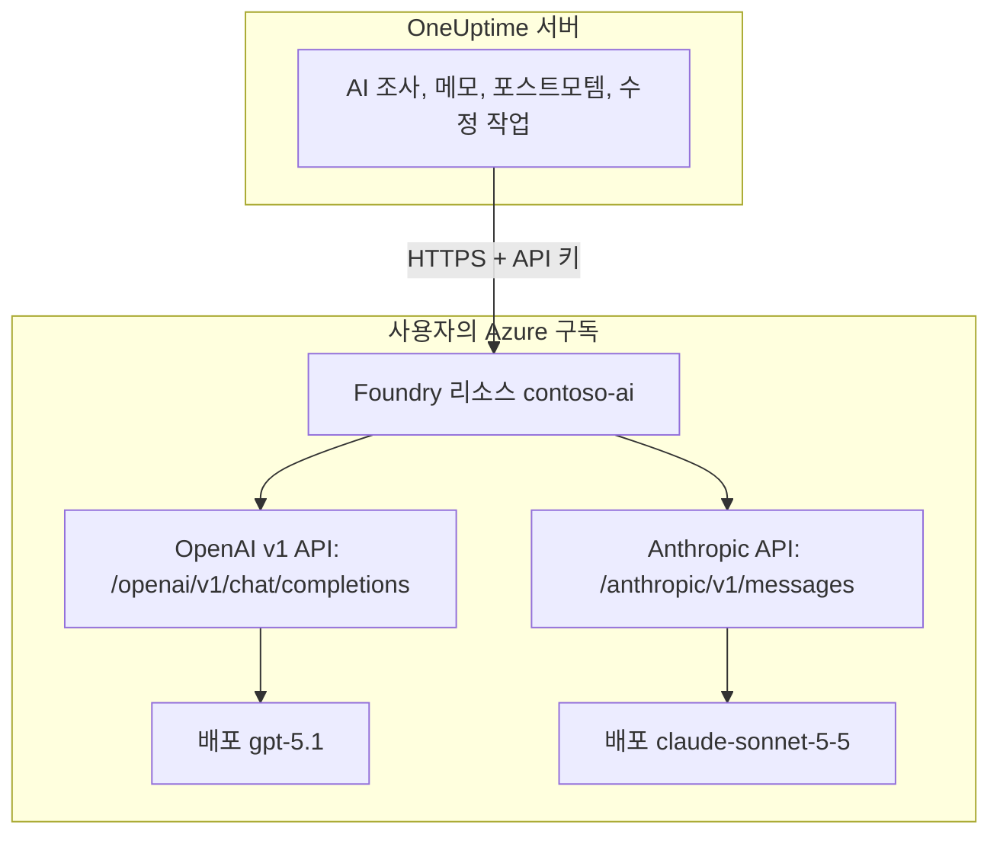

# Microsoft Foundry 및 Azure OpenAI

Microsoft Foundry(이전 이름 Azure AI Foundry)나 Azure OpenAI에 배포한 모델로 OneUptime의 AI 기능을 실행하세요. OneUptime은 모든 요청을 Azure 구독에 있는 리소스로 직접 보내므로, 프롬프트와 응답은 선택한 위치에서 선택한 배포가 처리합니다. 이 페이지는 빈 구독에서 시작해 작동하는 공급자까지 안내합니다. Azure 리소스, 모델 배포, 엔드포인트와 키, OneUptime 설정, 네트워크, 그리고 요청이 실패했을 때 할 일을 다룹니다.

:::cards
- [Azure 설정](#microsoft-foundry-설정): 리소스를 만들고 모델을 배포한 뒤 엔드포인트와 키를 복사합니다.
- [OneUptime 연결](#oneuptime-연결): 프로젝트 설정의 필드 네 개를 채우고 테스트 버튼을 누릅니다.
- [자체 호스팅](#환경-변수로-자체-호스팅-인스턴스-구성하기): 환경 변수로 모든 프로젝트용 공급자 하나를 등록합니다.
- [문제 해결](#문제-해결): 401, 403, 없는 배포, api-version.
:::

## 작동 방식

OneUptime은 사용자의 브라우저가 아니라 OneUptime 서버에서 HTTPS로 Foundry 리소스를 호출합니다. 각 요청에는 리소스의 API 키 중 하나가 담기고, 요청에 응답할 배포의 이름이 지정됩니다.



공급자 유형 하나, **Azure OpenAI / Microsoft Foundry**로 리소스의 모든 배포를 다룹니다. 어떤 API를 호출할지는 기본 URL이 OneUptime에 알려 줍니다.

| 배포하는 모델 | OneUptime이 호출하는 API | 기본 URL |
| --- | --- | --- |
| GPT-5.1, GPT-4.1 같은 OpenAI 모델 | OpenAI v1 chat completions | `https://contoso-ai.openai.azure.com/openai/v1` |
| DeepSeek, Grok처럼 chat completions를 지원하는 Foundry Models | OpenAI v1 chat completions | `https://contoso-ai.services.ai.azure.com/openai/v1` |
| Claude | Anthropic Messages | `https://contoso-ai.services.ai.azure.com/anthropic` |

> [!IMPORTANT]
> OneUptime의 AI 기능은 도구를 호출합니다. 작업하는 동안 모니터, 인시던트, 텔레메트리를 조회하기 때문입니다. 도구 호출(function calling)을 지원하는 모델을 배포하세요. 공급자의 **테스트** 버튼이 이를 확인해 줍니다.

## 시작하기 전에

Azure 구독, 리소스를 만들고 읽을 수 있는 역할, 그리고 LLM 공급자를 추가할 수 있는 OneUptime 역할이 필요합니다.

| 목적 | Azure에서 필요한 것 |
| --- | --- |
| 리소스 만들기 | 리소스 그룹의 **Owner** 또는 **Contributor**, 또는 **Foundry Account Owner** |
| 모델 배포하기 | 리소스 그룹의 **Owner** 또는 **Contributor**, 또는 리소스의 **Foundry Owner**나 **Foundry Account Owner**. Claude는 Azure Marketplace 제품을 구독할 권한도 필요합니다 |
| 리소스의 키 읽기 | `Microsoft.CognitiveServices/accounts/listKeys/action`이 있는 역할. 예: **Owner**, **Contributor**, **Cognitive Services Contributor** |

OneUptime 자체에는 Azure 역할이 필요하지 않습니다. 키 하나만으로 역할 확인 없이 리소스의 모든 배포에 접근할 수 있으므로 암호처럼 다루세요.

OneUptime에서 프로젝트에 공급자를 추가하려면 **Project Owner**, **Project Admin**, **Project Member**, **Settings Admin**, **Settings Member**, **Create LLM** 중 하나가 필요합니다. 자체 호스팅 인스턴스는 대신 환경 변수로 모든 프로젝트용 공급자 하나를 등록할 수 있으며, 여기에는 서버 접근 권한이 필요합니다.

## Microsoft Foundry 설정

:::steps
### 리소스 만들기

[Foundry 포털](https://ai.azure.com)에서 Foundry 리소스를 만들거나 이미 있는 리소스를 고릅니다. Azure OpenAI 리소스도 같은 방식으로 작동합니다. 리소스 이름을 적어 두세요. 이 이름은 엔드포인트의 첫 부분으로, `https://contoso-ai.openai.azure.com`의 `contoso-ai`에 해당합니다.

원하는 모델을 제공하는 지역을 고릅니다. 리소스의 네트워크 액세스는 우선 모든 네트워크에 열어 두세요. 언제, 어떻게 닫는지는 [네트워크 요구 사항](#네트워크-요구-사항)에서 설명합니다.

### 모델 배포하기

Foundry 포털에서 **Discover**, 이어서 **Models**를 선택하고 모델을 고릅니다. 예: `gpt-5.1` 또는 `claude-sonnet-5-5`. **Deploy**를 선택한 다음 **Custom settings**를 선택합니다.

- **Deployment name**: Foundry가 모델 이름을 채워 넣습니다. OneUptime은 이 이름으로 배포를 호출하므로 정확히 적어 두세요.
- **Deployment type**: 프롬프트를 어디서 처리할지 정합니다. [데이터가 처리되는 위치](#데이터가-처리되는-위치)를 참고하세요.

**Deploy**를 선택하고 배포 상태가 **Succeeded**가 될 때까지 기다립니다.

### 엔드포인트와 키 복사하기

[Azure Portal](https://portal.azure.com)에서 리소스를 열고 **Resource Management** > **Keys and Endpoint**로 이동합니다. **Endpoint**와 **KEY 1**을 복사합니다. **KEY 2**는 교체용으로 남겨 두세요. OneUptime을 KEY 2로 바꾼 다음 **KEY 1**을 다시 생성하면 됩니다.

Foundry 포털에서는 같은 키가 배포의 **Details** 탭에서 **Target URI** 옆에 표시됩니다.
:::

:::details 명령줄이 편하신가요?
같은 단계를 Azure CLI로 진행합니다. `--model-version`에는 모델 카탈로그가 해당 모델에 대해 보여 주는 버전을 넣습니다.

```bash
az cognitiveservices account create \
  --name contoso-ai --resource-group oneuptime-ai \
  --kind AIServices --sku S0 --location eastus2 \
  --custom-domain contoso-ai

az cognitiveservices account deployment create \
  --name contoso-ai --resource-group oneuptime-ai \
  --deployment-name gpt-5.1 \
  --model-name gpt-5.1 --model-version <version> --model-format OpenAI \
  --sku-name GlobalStandard --sku-capacity 50

# KEY 1
az cognitiveservices account keys list \
  --name contoso-ai --resource-group oneuptime-ai \
  --query key1 --output tsv
```

`--custom-domain contoso-ai`를 지정하면 리소스의 엔드포인트는 `https://contoso-ai.openai.azure.com`입니다.
:::

## OneUptime 연결

:::steps
### LLM 공급자 열기

**프로젝트 설정** > **AI** > **LLM 공급자**로 이동해 **LLM 제공자 만들기**를 클릭합니다.

### 공급자 이름 정하기

**기본 정보**에서 **이름**(예: `Azure gpt-5.1`)을 입력하고, 원하면 **설명**도 입력합니다. **다음**을 클릭합니다.

### 공급자 설정 채우기

| 필드 | 입력할 값 |
| --- | --- |
| **LLM 제공자** | **Azure OpenAI / Microsoft Foundry** |
| **API 키** | 리소스의 **KEY 1** 또는 **KEY 2** |
| **모델 이름** | Foundry에 표시된 그대로의 배포 이름. 예: `gpt-5.1` |
| **기본 URL** | 리소스 엔드포인트에 `/openai/v1`을 붙인 값. 예: `https://contoso-ai.openai.azure.com/openai/v1`. Claude의 경우: `https://contoso-ai.services.ai.azure.com/anthropic` |

**추가 필드** 아래의 **기본값으로 설정**은 켜져 있습니다. AI 기능은 프로젝트의 기본 공급자를 사용합니다. **LLM 제공자 만들기**를 클릭합니다.

### 연결 테스트하기

공급자 행에서 **테스트**를 클릭합니다. 정상 작동하는 공급자는 "Connection successful. The LLM provider responded to a test prompt and used tool calling."이라고 응답합니다. 테스트가 실패하면 메시지에 Azure가 무엇이라고 응답했는지, 무엇을 바꿔야 하는지가 나옵니다. [문제 해결](#문제-해결)을 참고하세요.
:::

완성된 공급자의 예:

```text
이름: Azure gpt-5.1
LLM 제공자: Azure OpenAI / Microsoft Foundry
API 키: <contoso-ai의 KEY 1>
모델 이름: gpt-5.1
기본 URL: https://contoso-ai.openai.azure.com/openai/v1
```

이제부터 프로젝트의 AI 기능은 이 배포를 사용합니다. OneUptime Cloud에서는 이 요청들이 프로젝트의 AI 크레딧으로 결제되지 않고, Azure가 사용자의 구독에 청구합니다.

## 기본 URL 형식

OneUptime은 Azure Portal과 Foundry 포털이 보여 주는 형식의 엔드포인트를 받아들이고, 각 요청을 오른쪽의 주소로 보냅니다. 기본 URL은 최대 100자이므로 짧은 형식을 쓰세요.

| 기본 URL | 요청이 가는 곳 |
| --- | --- |
| `https://contoso-ai.openai.azure.com` | `https://contoso-ai.openai.azure.com/openai/v1/chat/completions` |
| `https://contoso-ai.openai.azure.com/openai/v1` | `https://contoso-ai.openai.azure.com/openai/v1/chat/completions` |
| `https://contoso-ai.services.ai.azure.com/openai/v1` | `https://contoso-ai.services.ai.azure.com/openai/v1/chat/completions` |
| `https://contoso-ai.openai.azure.com/openai/deployments/gpt-4o` | `https://contoso-ai.openai.azure.com/openai/deployments/gpt-4o/chat/completions?api-version=2024-10-21` |
| `https://contoso-ai.services.ai.azure.com/anthropic` | `https://contoso-ai.services.ai.azure.com/anthropic/v1/messages` |

- **v1 API**(`/openai/v1`)는 Microsoft의 현재 API입니다. `api-version`이 필요 없고, 배포 이름을 모델로 받으며, OpenAI 모델과 다른 Foundry Models를 똑같이 처리합니다. 새 공급자에는 이 API를 쓰세요.
- **배포 URL**(`/openai/deployments/<name>`)은 그 자체로 배포를 지정하며, Azure는 **모델 이름**이 아니라 이 이름을 따릅니다. 기본 URL에 자체 `api-version`이 없으면 OneUptime이 `api-version=2024-10-21`을 붙입니다. 이 방식으로 저장한 공급자는 이전처럼 계속 작동합니다.
- **배포의 Target URI**를 Foundry 포털에서 통째로 붙여 넣어도 100자 안에 들어가면 작동합니다.
- **Claude**: Foundry는 Claude를 리소스의 `/anthropic` 경로에 있는 Anthropic Messages API로만 제공합니다. OneUptime은 같은 키로 이 API를 호출합니다. 공급자 유형 **Anthropic**도 같은 기본 URL로 여기에 닿습니다.

## 환경 변수로 자체 호스팅 인스턴스 구성하기

자체 호스팅 인스턴스에서는 `GLOBAL_LLM_PROVIDER_*` 변수가 시작할 때 전역 LLM 공급자 하나를 등록하며, 자체 공급자가 없는 모든 프로젝트가 이를 사용합니다. AI 수정 작업도 마찬가지입니다. 프로젝트 자체의 공급자가 항상 우선합니다.

```bash
GLOBAL_LLM_PROVIDER_TYPE=AzureOpenAI
GLOBAL_LLM_PROVIDER_NAME=Azure gpt-5.1
GLOBAL_LLM_PROVIDER_BASE_URL=https://contoso-ai.openai.azure.com/openai/v1
GLOBAL_LLM_PROVIDER_MODEL_NAME=gpt-5.1
GLOBAL_LLM_PROVIDER_API_KEY=<KEY 1 of contoso-ai>
```

:::tabs
@tab Docker Compose
변수를 `config.env`에 추가하고, 처음 시작했을 때와 같은 방법으로 OneUptime을 다시 시작합니다.

```bash
(export $(grep -v '^#' config.env | xargs) && docker compose up --remove-orphans -d)
```
@tab Kubernetes
키는 Secret에 보관하고, 차트 전체에 적용되는 `extraEnv`로 변수를 전달합니다.

```bash
kubectl create secret generic azure-foundry \
  --namespace oneuptime --from-literal=api-key='<KEY 1 of contoso-ai>'
```

```yaml title="values.yaml"
extraEnv:
  - name: GLOBAL_LLM_PROVIDER_TYPE
    value: AzureOpenAI
  - name: GLOBAL_LLM_PROVIDER_NAME
    value: Azure gpt-5.1
  - name: GLOBAL_LLM_PROVIDER_BASE_URL
    value: https://contoso-ai.openai.azure.com/openai/v1
  - name: GLOBAL_LLM_PROVIDER_MODEL_NAME
    value: gpt-5.1
  - name: GLOBAL_LLM_PROVIDER_API_KEY
    valueFrom:
      secretKeyRef:
        name: azure-foundry
        key: api-key
```

그런 다음 이 값으로 `helm upgrade`를 실행합니다.
:::

공급자는 변수를 따릅니다. 변수를 바꾸면 다음 시작 때 갱신되고, `GLOBAL_LLM_PROVIDER_TYPE`을 빼면 삭제됩니다. 이 유형에 키나 기본 URL이 빠져 있으면 시작 로그에 나옵니다. 모든 변수와 공급자 유형은 [LLM 공급자](/docs/ai/llm-provider)를 참고하세요.

## 네트워크 요구 사항

OneUptime 서버는 리소스의 호스트 이름(`contoso-ai.openai.azure.com`, `contoso-ai.services.ai.azure.com` 등)으로 포트 443에서 HTTPS 연결을 엽니다. 방화벽이나 프록시에서 이 아웃바운드 트래픽을 허용하세요.

- **OneUptime Cloud**는 인터넷을 통해 리소스에 연결하므로, 리소스가 공용 트래픽을 받아야 합니다. 리소스를 인터넷에서 떼어 두려면 OneUptime을 자체 호스팅하세요.
- **자체 호스팅, 프라이빗 엔드포인트**: OneUptime 서버가 닿을 수 있는 가상 네트워크의 프라이빗 엔드포인트 뒤에 리소스를 두고, 프라이빗 DNS 영역 `privatelink.openai.azure.com`, `privatelink.services.ai.azure.com`, `privatelink.cognitiveservices.azure.com`을 그 네트워크에 연결해 리소스의 평소 호스트 이름이 프라이빗 주소로 확인되게 합니다. 기본 URL은 바뀌지 않습니다.
- **프라이빗 주소**: 자체 호스팅 인스턴스는 `DATA_SOURCE_BLOCK_PRIVATE_ADDRESSES=true`가 설정되지 않은 한 프라이빗 주소에 연결합니다. 전역 LLM 공급자는 어느 경우에도 연결합니다.
- **리소스의 네트워크 규칙**: 리소스의 **Networking**에서 **Selected networks and private endpoints**를 고르면 나머지는 모두 막힙니다. 규칙이 거부한 요청은 403으로 실패합니다.

## 데이터가 처리되는 위치

모델을 배포할 때 고르는 배포 유형이 Azure가 OneUptime의 프롬프트와 모델의 응답을 어디서 처리할지 결정합니다. 저장된 데이터는 리소스의 Azure 지리 안에 머뭅니다.

| 배포 유형 | 프롬프트와 응답이 처리되는 곳 |
| --- | --- |
| Global Standard, Global Provisioned | 모든 Azure 지역 |
| Data Zone Standard, Data Zone Provisioned | 데이터 영역 안에서만: 미국, 유럽 연합 또는 아시아 태평양 |
| Standard, Regional Provisioned | 리소스의 Azure 지리 안 |

Claude 배포는 **Hosted on Azure** 또는 **Hosted on Anthropic** 중 하나입니다. 프롬프트와 응답을 Azure 안에 두려면 **Hosted on Azure**를 고르세요. 자세한 내용은 Microsoft의 [배포 유형](https://learn.microsoft.com/en-us/azure/foundry/foundry-models/concepts/deployment-types)을 참고하세요.

## 요청과 응답 예

OneUptime 밖에서 배포를 확인하려면, OneUptime이 보내는 요청을 `curl`로 보내 보세요.

:::tabs
@tab OpenAI v1 API
```bash
curl https://contoso-ai.openai.azure.com/openai/v1/chat/completions \
  -H "Content-Type: application/json" \
  -H "api-key: $AZURE_API_KEY" \
  -d '{
    "model": "gpt-5.1",
    "messages": [
      { "role": "user", "content": "Reply with the word: OK" }
    ]
  }'
```

응답(일부 생략):

```json
{
  "id": "chatcmpl-7R1nGnsXO8n4oi9UPz2f3UHdgAYMn",
  "object": "chat.completion",
  "model": "gpt-5.1",
  "choices": [
    {
      "index": 0,
      "finish_reason": "stop",
      "message": { "role": "assistant", "content": "OK" }
    }
  ],
  "usage": { "prompt_tokens": 12, "completion_tokens": 2, "total_tokens": 14 }
}
```
@tab Anthropic API
```bash
curl https://contoso-ai.services.ai.azure.com/anthropic/v1/messages \
  -H "Content-Type: application/json" \
  -H "x-api-key: $AZURE_API_KEY" \
  -H "anthropic-version: 2023-06-01" \
  -d '{
    "model": "claude-sonnet-5-5",
    "max_tokens": 1024,
    "messages": [
      { "role": "user", "content": "Reply with the word: OK" }
    ]
  }'
```

응답(일부 생략):

```json
{
  "id": "msg_01XFDUDYJgAACzvnptvVoYEL",
  "type": "message",
  "role": "assistant",
  "model": "claude-sonnet-5-5",
  "content": [{ "type": "text", "text": "OK" }],
  "stop_reason": "end_turn",
  "usage": { "input_tokens": 14, "output_tokens": 4 }
}
```
:::

OneUptime 자체의 요청에는 더 많은 내용이 담깁니다. OneUptime의 지시, 대화, 모델이 호출할 수 있는 도구, 토큰 한도입니다. 응답에서는 텍스트, 도구 호출, 모델이 멈춘 이유, 토큰 사용량을 읽으며, 사용량은 **프로젝트 설정** > **AI** > **AI 로그**에 요청마다 표시됩니다. 공급자의 **추가 매개변수**는 모든 요청에 추가됩니다.

## Microsoft Entra ID와 키 없는 리소스

OneUptime은 리소스의 API 키 중 하나로 리소스에 로그인합니다. 서비스 주체나 관리 ID로 Microsoft Entra ID 로그인을 하는 방식은 아직 지원하지 않습니다.

조직에서 AI 리소스의 키 액세스를 끄면(`disableLocalAuth`) 요청이 `AuthenticationTypeDisabled`로 실패합니다. OneUptime이 쓰는 리소스에서 키 액세스를 허용하거나, 리소스 앞에 Azure API Management를 두세요.

1. 리소스의 배포를 Azure OpenAI API로 API Management에 가져옵니다. 그러면 API Management가 자체 관리 ID로 리소스에 로그인합니다.
2. API의 구독 키 헤더 이름을 `api-key`로 설정합니다.
3. OneUptime에서 **기본 URL**을 배포에 해당하는 API Management의 API 주소(예: `https://contoso-apim.azure-api.net/aoai/openai/deployments/gpt-5.1`)로 설정하되, 다른 배포 URL과 마찬가지로 배포에 필요한 `api-version`을 붙입니다. **API 키**는 API Management 구독 키로 설정합니다.

Microsoft Entra ID만 받는 Claude 모델(Claude Mythos 등)은 아직 쓸 수 없습니다.

## 문제 해결

OneUptime은 오류의 맨 앞에 바꿔야 할 점을 적고, 그 뒤에 Azure 자체의 응답을 붙입니다. **테스트** 버튼은 오류 전체를 보여 주고, **AI 로그**는 처음 490자를 저장합니다.

:::details "Azure did not accept the API key" (401)
키가 틀렸거나, 다시 생성되었거나, 다른 리소스의 키입니다. 기본 URL이 가리키는 리소스의 **Keys and Endpoint**에서 **KEY 1**을 다시 복사해 **API 키**에 붙여 넣으세요.
:::

:::details "Key-based authentication is turned off for this resource" (403)
Azure가 `AuthenticationTypeDisabled`라고 응답했습니다. 이 리소스는 Microsoft Entra ID만 받습니다. [Microsoft Entra ID와 키 없는 리소스](#microsoft-entra-id와-키-없는-리소스)를 참고하세요.
:::

:::details "Azure refused the request" (403)
리소스의 네트워크 규칙이 요청을 막았습니다. 리소스의 **Networking** 설정을 [네트워크 요구 사항](#네트워크-요구-사항)과 비교해 보세요.
:::

:::details "This resource has no deployment named ..." (404)
Azure가 `DeploymentNotFound`라고 응답했습니다. **모델 이름**을 Foundry 포털에 표시된 그대로의 배포 이름으로 설정하세요. 몇 분 안에 만든 배포는 아직 준비되지 않았을 수 있습니다. 기본 URL이 배포 URL이라면 `/openai/deployments/` 뒤의 이름을 확인하세요.
:::

:::details "Azure found nothing at this address" (404)
기본 URL이 Azure OpenAI API로 이어지지 않습니다. `https://contoso-ai.openai.azure.com/openai/v1`처럼 리소스 엔드포인트에 `/openai/v1`을 붙여 쓰세요. 지원이 끝난 Azure AI Inference SDK의 모델 추론 엔드포인트(`/models`)는 해당하지 않습니다. 같은 리소스의 `/openai/v1`을 쓰세요.
:::

:::details "This model needs api-version ... or later" (400)
배포 URL은 다른 버전을 지정하지 않으면 `api-version=2024-10-21`을 요청하는데, o 시리즈나 GPT-5 같은 새 모델은 이렇게 오래된 버전을 거부합니다. 기본 URL을 v1 API인 `https://contoso-ai.openai.azure.com/openai/v1`로 바꾸고 배포 이름을 **모델 이름**에 넣으세요. 또는 Azure가 알려 주는 버전(예: `?api-version=2024-12-01-preview`)을 기본 URL에 붙이세요.
:::

:::details "Azure's v1 API takes no dated api-version" (400)
기본 URL이 `/openai/v1`로 끝나는데 날짜가 붙은 `api-version`도 들어 있습니다. 기본 URL에서 `api-version`을 지우세요.
:::

:::details "기본 URL은(는) 100자를 넘을 수 없습니다."
`api-version`이 붙은 Target URI는 대개 이보다 깁니다. 리소스 엔드포인트에 `/openai/v1`을 붙여 쓰고, 배포 이름을 **모델 이름**에 넣으세요.
:::

:::details "...could not be reached" 또는 "...host name could not be resolved"
OneUptime 서버가 리소스에 연결하지 못했습니다. OneUptime Cloud에서는 인터넷에서 리소스에 닿을 수 있어야 합니다. 자체 호스팅 인스턴스에서는 서버가 리소스의 호스트 이름을 확인할 수 있는지(프라이빗 엔드포인트라면 프라이빗 DNS 영역을 통해), 아웃바운드 HTTPS가 허용되는지 확인하세요.
:::

:::details 요청이 너무 많음 (429)
배포의 분당 토큰 할당량을 다 썼습니다. AI 기능은 기다렸다가 다시 시도하며, 약 5분 동안 최대 10번 시도한 뒤 실패를 보고합니다. **테스트** 버튼은 더 빨리 포기합니다. Foundry 포털에서 배포의 할당량을 늘리거나 다른 배포 유형으로 옮기세요.
:::

## 다음 단계

:::cards
- [LLM 공급자](/docs/ai/llm-provider): 모든 공급자 유형과 프로젝트가 하나를 고르는 방식.
- [AI SRE](/docs/ai/ai-sre): 이 공급자로 실행되는 조사.
- [Ask AI](/docs/ai/ask-ai): 시스템에 대한 질문에 대시보드에서 답합니다.
:::
