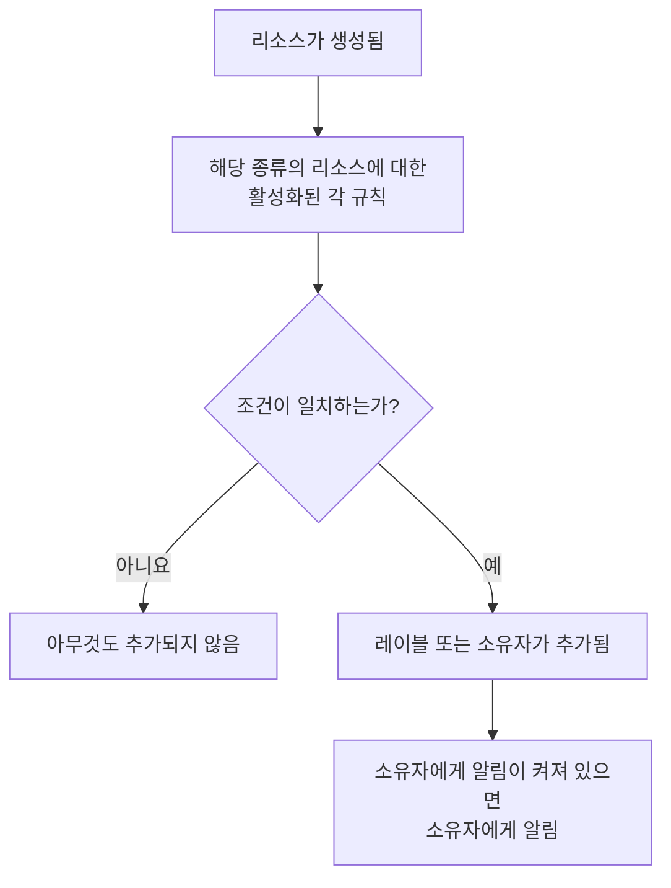

# 레이블 및 소유자 규칙

레이블 규칙과 소유자 규칙은 리소스를 대신 정리해 줍니다. **레이블 규칙** 은 일치하는 모든 새 리소스에 레이블을 붙이고, **소유자 규칙** 은 사용자와 팀을 소유자로 추가합니다. 그래서 새 데이터베이스 인시던트에 _Database_ 레이블이 붙고 데이터베이스 팀이 소유하게 되는 일을 누군가 기억할 필요가 없습니다.

:::cards
- [규칙 만들기](#규칙-만들기): 두 단계: 규칙이 무엇과 일치하는지 정한 다음, 무엇을 추가할지 정합니다.
- [레이블과 소유자 상속](#레이블과-소유자-상속): 이벤트의 모니터, 호스트, 서비스가 가진 것을 물려줍니다.
- [규칙이 실행되는 시점](#규칙이-실행되는-시점): 새 리소스에 실행되며, 이미 있는 리소스에는 **Run Now** 를 씁니다.
:::

## 작동 방식

규칙은 리소스가 생성될 때 실행됩니다. 활성화된 각 규칙이 새 리소스에 대해 조건을 확인하고, 일치하는 규칙은 각자 추가하는 것을 추가합니다.

레이블과 소유자는 리소스를 필터링하고 그룹화하는 기준이며, OneUptime이 누구에게 알릴지, 그리고 [레이블로 제한되거나 자신이 소유한 리소스로 제한된 권한](/docs/permissions/index) 이 어디까지 미치는지를 결정합니다. 규칙은 누군가 기억하지 않아도 이를 일관되게 유지합니다.

## 규칙이 있는 곳

레이블과 소유자가 있는 모든 제품의 **설정** 아래에 두 규칙이 모두 있습니다 (인시던트, 알림, 예정된 유지 관리는 **규칙** 아래). 대상은 모니터, 인시던트와 인시던트 에피소드, 알림과 알림 에피소드, 예정된 유지 관리 이벤트, 상태 페이지, 서비스, 호스트, Kubernetes 클러스터, Docker 호스트, Docker Swarm 클러스터, Podman 호스트, Proxmox 클러스터, VMware vCenter, Ceph 클러스터, 스토리지 어레이, 데이터베이스, 큐, IoT 플릿, 서버리스 함수, 클라우드 리소스, RUM 애플리케이션, 대시보드, 온콜 정책, 온콜 일정, 수신 전화 정책, 워크플로, 런북, 네트워크 장치, SLO입니다.

예를 들어 모니터 레이블 규칙은 **모니터 → 설정 → 레이블 규칙** 에, 인시던트 레이블 규칙은 **인시던트 → 규칙 → 레이블 규칙** 에 있습니다. **설정** 과 **규칙** 은 사이드 메뉴에서 처음에는 접혀 있으니, 섹션 제목을 클릭해 여세요. 인시던트와 알림 페이지에는 **Incident Rules** (또는 **Alert Rules**) 탭과 **Episode Rules** 탭이 있습니다.

## 규칙 만들기

모든 레이블 규칙과 소유자 규칙은 같은 방법으로 두 단계에 걸쳐 만듭니다.

:::steps
### 규칙 목록 열기

제품의 **레이블 규칙** 또는 **소유자 규칙** 페이지를 열고, 규칙 이름이 붙은 만들기 버튼을 클릭합니다. 예를 들면 **Monitor Label Rule 만들기** 입니다.

### 규칙이 무엇과 일치할지 고르기

**일치** 단계에서 리소스가 충족해야 하는 조건마다 **조건 추가** 를 클릭합니다. 조건이 두 개 이상이면 **모두 일치** 또는 **하나라도 일치** 를 고릅니다. 조건이 없는 규칙은 모든 새 리소스와 일치합니다.

### 규칙이 무엇을 추가할지 고르기

**레이블** 단계에서 **추가할 레이블** 을 고릅니다. 소유자 규칙에서는 이 단계가 **소유자** 이며, **소유자 추가** 를 누르면 사람과 팀이 함께 있는 목록이 열립니다.

**이름** 은 고른 항목에 따라 자동으로 채워지고 (*Production 추가*, *Platform을(를) 소유자로 추가*), 직접 이름을 입력할 때까지 선택을 따라 바뀝니다. 상속만 하는 규칙은 대신 상속 대상의 이름을 따릅니다 (아래 참조).

### 접힌 필드 확인하기

**추가 필드** 에는 선택 사항인 **설명** 과, 소유자 규칙에서는 **소유자에게 알림** 이 있으며 기본으로 켜져 있습니다. 규칙이 추가한 소유자도 직접 추가한 소유자와 똑같은 "소유자로 추가되었습니다" 알림을 받습니다. 알림 없이 소유자를 추가하려면 끄세요.

### 규칙 저장하기

마지막 단계에서 규칙 이름이 붙은 버튼 (예: **Monitor Label Rule 만들기**) 을 다시 클릭합니다. 규칙은 활성화된 상태로 만들어지며, 목록에는 초록색 **활성화됨** 표시와 함께 나타납니다.
:::

새 규칙은 무언가를 추가해야 합니다. 레이블 (또는 소유자) 이 하나 이상 있거나, 인시던트, 알림, 예정된 유지 관리 규칙이라면 상속하는 것이 있어야 합니다 (아래 참조). 규칙을 삭제하지 않고 잠시 멈추려면 편집 양식에서 **활성화됨** 을 끕니다. 그러면 목록에 빨간색 **비활성화** 표시가 나타납니다.

### 규칙을 어떤 방법으로 만들든

API, Terraform, 워크플로 또는 [레이블 규칙 가져오기](/docs/configuration/label-rule-import-export) 로 만든 규칙에도 똑같이 적용됩니다. OneUptime은 아무것도 추가하지 않는 새 규칙을 거부하고, 채워야 할 필드를 알려 주는 메시지를 반환합니다. 이 메시지는 모든 언어에서 영어로 표시됩니다.

| 규칙 | 메시지 |
| --- | --- |
| 레이블 규칙 | This label rule adds nothing. Choose at least one label in Labels to Add. |
| 인시던트, 알림, 예정된 유지 관리 레이블 규칙 | This label rule adds nothing. Choose at least one label in Labels to Add, or turn on an Inherit Labels switch. |
| 소유자 규칙 | This owner rule adds nothing. Choose at least one user or team in Owner Users or Owner Teams. |
| 인시던트, 알림, 예정된 유지 관리 소유자 규칙 | This owner rule adds nothing. Choose at least one user or team in Owner Users or Owner Teams, or turn on an Inherit Owners switch. |

- **API**: `labelsToAdd` (또는 `ownerUsers` / `ownerTeams`) 를 프로젝트의 레코드 하나 이상으로 설정하거나, 규칙의 `inheritLabelsFrom…` (`inheritOwnersFrom…`) 스위치 중 하나를 `true` (JSON 불리언) 로 설정합니다.
- **Terraform**: 추가할 것이 없는 레이블 또는 소유자 규칙 리소스는 위 메시지와 함께 `terraform apply` 에서 실패합니다. `labels_to_add` (또는 `owner_users` / `owner_teams`) 를 지정하거나 상속 스위치 중 하나를 켜세요.

이미 있는 규칙은 변경되지 않습니다. [규칙 편집하기](#규칙-편집하기) 를 참조하세요.

## 레이블과 소유자 상속

인시던트, 알림, 예정된 유지 관리 규칙은 이벤트가 영향을 주는 리소스가 가진 것도 물려줄 수 있습니다. **추가할 레이블** (또는 **소유자**) 아래의 접힌 **레이블 상속** (또는 **소유자 상속**) 섹션에는 스위치가 여섯 개 있습니다.

- **모니터에서 레이블 상속**: 인시던트 모니터의 모든 레이블이 인시던트에도 붙습니다. 알림에는 모니터가 하나뿐이므로 알림 규칙에서는 스위치 이름이 **모니터에서 레이블 상속** 이며 (알림 소유자 규칙에서는 **모니터에서 소유자 상속**), 그 하나의 모니터를 가리킵니다.
- **호스트에서 레이블 상속**, **Kubernetes 클러스터에서 레이블 상속**, **Docker 호스트에서 레이블 상속**, **Inherit Labels From Podman Hosts**, **서비스에서 레이블 상속** 은 해당 리소스에 대해 같은 일을 합니다.

소유자 규칙에도 소유자용으로 같은 여섯 개의 스위치가 있습니다 (**모니터에서 소유자 상속** 등). 켜진 스위치가 없는 동안에는 접힌 섹션이 용도를 설명하고, 상속하는 규칙에서는 저절로 열립니다. 에피소드 규칙에는 상속 스위치가 없습니다.

상속하는 규칙은 **추가할 레이블** (또는 **소유자**) 을 비워 둘 수 있으며, 그러면 상속하는 것을 추가합니다. 이런 규칙은 상속 대상의 이름을 따릅니다.

| 켜진 스위치 | 이름 |
| --- | --- |
| **모니터에서 레이블 상속** | *모니터에서 레이블 상속* |
| **모니터에서 레이블 상속** 과 **호스트에서 레이블 상속** | *모니터, 호스트에서 레이블 상속* |
| 알림 규칙의 **모니터에서 레이블 상속** | *모니터에서 레이블 상속* |

이름은 레이블을 고를 때까지 (그 뒤로는 레이블의 이름을 따릅니다), 또는 직접 이름을 입력할 때까지 스위치를 따라 바뀝니다.

## 규칙 편집하기

규칙 편집 양식에는 같은 두 단계가 있고 **활성화됨** 스위치가 추가됩니다. 편집 양식은 규칙이 무엇을 추가하는지를 요구하지 않습니다. OneUptime이 이를 묻기 전에 (API, Terraform, 가져오기 또는 이전 양식으로) 저장된 규칙은 아무것도 추가하지 않을 수 있고, 편집으로 규칙이 추가하는 것을 모두 없앨 수도 있습니다.

이런 규칙도 API와 Terraform을 포함해 이름을 바꾸거나, 끄거나, 삭제할 수 있습니다. 목록은 아무것도 추가하지 않는 규칙의 상태 옆에 **추가하는 항목 없음** 을 표시하며, 규칙 자체의 페이지도 마찬가지입니다. 규칙을 편집해 추가할 것을 고르거나, 삭제하세요.

## 규칙이 실행되는 시점

활성화된 모든 규칙은 대시보드에서든 API를 통해서든 리소스가 생성될 때 실행되며, 일치하는 규칙은 각자 추가하는 것을 추가합니다.

- 여러 규칙이 일치하면 모든 레이블과 소유자가 추가됩니다.
- 규칙은 아무것도 제거하지 않습니다. 누군가 직접 추가한 레이블이나 소유자도, 규칙 자신이 추가한 것도 제거하지 않습니다.
- 비활성화된 규칙은 아무 일도 하지 않습니다.

오늘 작성한 규칙은 이후에 생성되는 리소스에 적용됩니다. 이미 있는 리소스에 적용하려면 **Run Now** 를 사용하세요. [기존 리소스에 규칙 실행](/docs/configuration/run-rules-now) 을 참조하세요. 레이블 규칙은 프로젝트 간에 복사할 수도 있습니다. [레이블 규칙 가져오기 및 내보내기](/docs/configuration/label-rule-import-export) 를 참조하세요.

## 다음 단계

:::cards
- [기존 리소스에 규칙 실행](/docs/configuration/run-rules-now): 이미 있는 리소스에 규칙을 적용합니다.
- [레이블 규칙 가져오기 및 내보내기](/docs/configuration/label-rule-import-export): 레이블 규칙을 JSON으로 프로젝트 간에 복사합니다.
- [인시던트 설정 및 자동화](/docs/incidents/settings): 인시던트가 실행할 수 있는 다른 규칙.
- [SLO 레이블 및 소유자 규칙](/docs/slo/label-and-owner-rules): SLO 규칙이 무엇과 일치하는지.
:::
