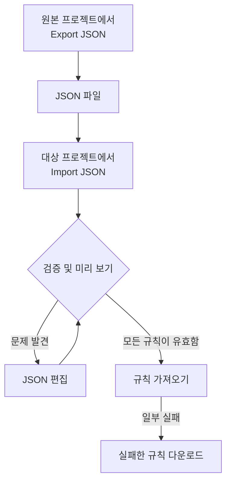

# 레이블 규칙 가져오기 및 내보내기

레이블 규칙을 JSON 파일로 프로젝트 간에 복사하거나 한꺼번에 여러 개 만들 수 있습니다. 인시던트, 알림, 모니터, 네트워크 장치를 포함해 모든 **레이블 규칙** 페이지의 **추가 옵션** (**⋯**) 메뉴에 **Export JSON** 과 **Import JSON** 동작이 있습니다. 유일한 예외는 VMware로, vCenter 레이블 규칙에는 둘 다 없습니다.



## 규칙 내보내기

**추가 옵션** 을 열고 **Export JSON** 을 선택하면 현재 프로젝트에 있는 해당 종류의 규칙이 모두 다운로드됩니다. 내보내기에는 표의 다른 페이지에 있는 규칙도 포함되며, 표 필터는 무시됩니다.

파일에는 각 규칙의 활성화 상태, 조건, 추가할 레이블, 레이블 상속 옵션이 저장됩니다. 프로젝트 ID, 규칙 ID, 감사 필드는 빠집니다.

연결된 레이블, 모니터, 심각도는 정확한 이름으로 기록됩니다. 가져오기는 이를 만들지 않으므로, 대상 프로젝트에 미리 있어야 합니다.

## 규칙 가져오기

:::steps
### Import JSON 열기

대상 프로젝트의 **레이블 규칙** 페이지를 열고 **추가 옵션 → Import JSON** 을 선택합니다.

### 파일 추가하기

JSON 내보내기 파일을 업로드하거나 그 내용을 붙여 넣습니다.

### 검증하고 미리 보기

**Validate and preview** 를 선택합니다. 규칙을 하나라도 만들기 전에 모든 규칙을 확인하며, 참조하는 리소스는 대상 프로젝트에 고유하고 일치하는 이름으로 있어야 합니다.

### 미리 보기 검토하기

규칙 이름, 상태, 레이블, 조건을 확인합니다. 큰 묶음은 한 페이지씩 표시됩니다. 수정하려면 **Edit JSON** 을 선택하고 다시 검증합니다.

### 가져오기

규칙 수가 표시된 가져오기 버튼 (예: **Import 2 rules**) 을 선택하고, 결과가 나타날 때까지 창을 열어 둡니다.
:::

가져오기는 새 규칙을 추가하고 기존 규칙은 그대로 두므로, 같은 파일을 다시 가져오면 사본이 하나 더 만들어집니다. 각 규칙에는 일반적인 생성 권한과 서버 검증이 적용됩니다.

일부 규칙이 실패하면 **Download failed rules** 를 선택해 해당 행만 저장하고, 수정한 뒤 그 파일을 다시 가져옵니다. 요청 시간이 초과되면 다시 시도하기 전에 규칙 목록을 확인하세요. 응답이 사라지기 전에 서버가 규칙을 저장했을 수 있습니다.

## JSON으로 묶음 만들기

기존 규칙을 내보내 리소스 종류에 맞는 예시를 얻은 다음, `items` 배열의 항목을 편집하거나 추가합니다. 이 예시는 모니터 레이블 규칙 두 개를 만듭니다. 레이블 `Production` 과 `Infrastructure` 는 대상 프로젝트에 미리 있어야 합니다.

```json title="monitor-label-rules.json"
{
  "fileType": "oneuptime-label-rules",
  "schemaVersion": 1,
  "resourceType": "MonitorLabelRule",
  "items": [
    {
      "name": "Production API monitors",
      "description": "Label production API monitors automatically",
      "isEnabled": true,
      "monitorNamePattern": "^api-prod-",
      "monitorLabels": [],
      "labelsToAdd": ["Production"]
    },
    {
      "name": "Database monitors",
      "isEnabled": false,
      "monitorNamePattern": "^database-",
      "labelsToAdd": ["Infrastructure"]
    }
  ]
}
```

| 필드 | 내용 |
| --- | --- |
| `fileType` | 항상 `oneuptime-label-rules`. |
| `schemaVersion` | 항상 `1`. |
| `resourceType` | 파일에 담긴 규칙의 종류. 예: `MonitorLabelRule`. |
| `items` | 규칙. 규칙마다 객체 하나. 파일에는 하나 이상 있어야 합니다. |

`isEnabled` 에는 JSON 불리언을, 패턴에는 텍스트를, 연결된 리소스에는 이름 배열을 사용합니다.

잘못된 패턴, 알 수 없는 필드, 빠진 이름, 모호한 참조가 있으면 가져오기 단계 전에 묶음 전체가 멈춥니다. 아무것도 추가하지 않는 규칙 (비어 있는 `labelsToAdd` 와, 인시던트, 알림, 예정된 유지 관리 규칙에서 `true` 인 `inheritLabelsFrom…` 스위치가 하나도 없는 경우) 도 마찬가지인데, OneUptime이 그런 규칙을 만들지 않기 때문입니다 ([레이블 및 소유자 규칙](/docs/configuration/label-and-owner-rules#규칙을-어떤-방법으로-만들든) 참조). 이 검사가 생기기 전에 저장된 규칙이라면 내보내기에 그런 규칙이 들어 있을 수 있으니, 가져오기 전에 레이블을 지정하거나 파일에서 빼세요.

> [!NOTE]
> 파일과 붙여 넣은 JSON은 10 MB로 제한됩니다.

## 리소스 종류 간 복사

파일의 원래 `resourceType` 은 그대로 두고 대상 페이지에서 **Import JSON** 을 엽니다. 호환되는 기본 이름 또는 제목 패턴, 설명 패턴, 필수 레이블은 대상의 필드에 연결되며, 미리 보기에 이 연결 목록이 표시되어 검토할 수 있습니다. 인시던트와 알림의 심각도 참조는 대상의 심각도 이름과 대조됩니다.

대상이 지원하지 않는 조건이나 동작이 있으면 가져오기가 막힙니다. 예를 들어 특정 모니터로 제한된 인시던트 규칙은 그 조건을 편집하지 않으면 네트워크 장치 규칙으로 복사할 수 없습니다.

> [!WARNING]
> 네트워크 장치와 SLO 레이블 규칙은 정규식뿐 아니라 와일드카드도 지원합니다. 이 규칙들과 다른 종류의 규칙 사이에서 옮길 때는 `*` 나 앞뒤 공백이 있는 패턴이 거부됩니다. 그쪽에서는 다르게 일치하기 때문입니다. 대상에 맞게 패턴을 편집하거나, 같은 리소스 종류 안에서 규칙을 사용하세요. 네트워크 장치와 SLO 레이블 규칙은 일치 방식이 같으므로 서로 어떤 패턴이든 주고받을 수 있습니다.

## 다음 단계

:::cards
- [레이블 및 소유자 규칙](/docs/configuration/label-and-owner-rules): 레이블 규칙이 무엇과 일치하고 무엇을 추가하는지.
- [기존 리소스에 규칙 실행](/docs/configuration/run-rules-now): 가져온 규칙을 이미 있는 리소스에 적용합니다.
:::
