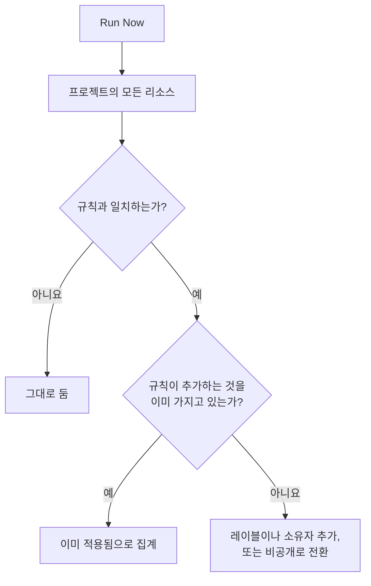

# 기존 리소스에 규칙 실행

레이블 규칙, 소유자 규칙, 개인정보 보호 규칙은 리소스가 **생성** 될 때 자동으로 실행됩니다. 그래서 오늘 작성한 규칙은 이미 있는 모니터, 인시던트, 호스트에는 아무 일도 하지 않습니다. **Run Now** 는 이 간극을 메웁니다. 규칙 하나를 프로젝트에 이미 있는 모든 리소스에 적용합니다.

## 실행할 수 있는 규칙

- **레이블 규칙** 과 **소유자 규칙**: 이 규칙이 있는 모든 리소스가 대상입니다. 모니터, 인시던트, 인시던트 에피소드, 알림, 알림 에피소드, 예정된 유지 관리 이벤트, 상태 페이지, 서비스, 호스트, Kubernetes 클러스터, Docker 호스트, Docker Swarm 클러스터, Podman 호스트, Proxmox 클러스터, VMware vCenter, Ceph 클러스터, 스토리지 어레이, 데이터베이스, 큐, IoT 플릿, 서버리스 함수, 클라우드 리소스, RUM 애플리케이션, 대시보드, 온콜 정책, 온콜 일정, 수신 전화 정책, 워크플로, 런북, 네트워크 장치, SLO입니다.
- **개인정보 보호 규칙**: 인시던트, 알림, 인시던트 에피소드, 알림 에피소드가 대상입니다.
- 상태 페이지의 **Monitor Rules**: 규칙이 저장될 때마다 이미 페이지를 다시 동기화하며, 실행하면 바로 다시 동기화합니다.
- SLO의 **Monitor Rules**: 규칙이 저장될 때마다 이미 SLO를 다시 동기화하며, 실행하면 SLO의 모니터를 바로 다시 동기화합니다. [모니터 및 모니터 규칙](/docs/slo/monitor-rules) 을 참조하세요.

리소스를 설명하는 대신 동작을 수행하는 규칙 (**온콜 규칙**, **Runbook 규칙**, **자동 해결 규칙**, **그룹화 규칙**) 은 기존 레코드에 실행할 수 없습니다. 실행하면 이미 끝난 인시던트를 두고 사람을 호출하거나, 런북을 실행하거나, 수정을 시작하거나, 에피소드를 다시 구성하게 되기 때문입니다.

## 시작하기 전에

규칙을 실행하려면 규칙을 편집할 권한 **과** 규칙이 변경하는 리소스를 편집할 권한이 모두 필요합니다. 예를 들어 모니터 레이블 규칙에는 모니터 레이블 규칙 편집 권한과 모니터 편집 권한이 둘 다 필요합니다. 소유자 규칙에는 소유자를 추가할 권한도 필요합니다. 상태 페이지나 SLO의 모니터 규칙에는 규칙을 편집할 권한만 있으면 됩니다.

> [!IMPORTANT]
> 특정 레이블이나 자신이 소유한 리소스로 제한된 권한으로는 부족합니다. 실행은 프로젝트의 모든 리소스를 바꿀 수 있기 때문입니다. 팀의 차단 목록은 다른 곳과 똑같이 적용되며, 일부 레이블로 제한된 차단도 고려됩니다. 실행은 그 레이블이 붙은 리소스도 바꾸므로, 규칙이 변경하는 리소스의 편집에 레이블이 지정된 차단이 있으면 실행이 거부됩니다.

네트워크의 규칙도 이미 있는 장치에 실행할 때 같은 것을 요구합니다. 사이트 할당 규칙이나 장치 레이블 규칙의 **Run Now** 에는 규칙을 편집할 권한과 **Edit Network Device** 가 필요합니다. 자동 가져오기 규칙의 **Dry Run** 과 **Run Rule** 에는 규칙을 편집할 권한, **Create Network Device**, 그리고 규칙에 모니터 템플릿이 있으면 **Create Monitor** 가 필요합니다. 각 권한은 프로젝트 전체에 미쳐야 합니다. [자동 가져오기 규칙으로 자동 가져오기](/docs/monitor/network-device-monitor#importing-automatically-with-auto-import-rules) 를 참조하세요.

## 규칙 하나 실행하기

:::steps
### 규칙 목록 열기

규칙 페이지를 엽니다. 예: **모니터 → 설정 → 레이블 규칙**.

### Run Now 선택하기

규칙 행 끝의 **⋯** 메뉴를 열고 **Run Now** 를 선택하거나, **보기** 를 선택한 다음 규칙 자체의 페이지에서 **Run Now** 를 선택합니다. 대화 상자에 실행이 무엇을 할지 표시됩니다.

### 새 소유자에게 알릴지 정하기

소유자 규칙에서는 **Notify the owners this run adds** 를 켤지 고릅니다. 기본으로 꺼져 있으며, 규칙 자체에서 **소유자에게 알림** 이 켜져 있을 때만 효과가 있습니다. 소유자는 추가된 리소스마다 한 번씩 알림을 받습니다.

### 규칙 실행하기

**Run Rule** 을 선택하고 대화 상자를 열어 둡니다. 큰 프로젝트에서는 대화 상자에 실행이 얼마나 진행되었는지 표시됩니다.

### 보고서 읽기

실행이 끝나면 대화 상자에 규칙과 일치한 리소스 수, 변경한 리소스 수, 규칙이 추가하는 것을 이미 가지고 있던 리소스 수가 표시됩니다.
:::

## 여러 규칙 실행하기

표에서 규칙을 선택하고 일괄 작업 메뉴를 연 뒤 **Run Now** 를 고릅니다. 선택한 규칙이 하나씩 차례로 실행됩니다.

- 일괄 실행으로 추가된 소유자에게는 알림이 가지 않습니다. 알리려면 규칙을 하나씩 실행하세요.
- 실행할 수 없는 규칙 (예: 비활성화된 규칙) 은 이유와 함께 표시되고, 다른 규칙은 그대로 실행됩니다.

## 실행이 하는 일

- **추가만 합니다.** 레이블이 붙고, 소유자가 추가되고, 리소스가 비공개가 됩니다. 아무것도 제거되거나 공개되지 않으므로 규칙을 다시 실행해도 안전합니다. 두 번째 실행은 모든 것이 이미 적용되어 있었다고 보고합니다.
- **프로젝트의 모든 리소스를 평가합니다.** 해결된 인시던트와 알림도 포함됩니다.
- **기존 소유자는 건너뜁니다.** 두 번 추가되지 않습니다.
- **프로젝트 자체의 레이블만 추가됩니다.** 규칙에 지정된 레이블이 더 이상 프로젝트의 레이블이 아니면 건너뛰고, 규칙의 다른 레이블은 그대로 추가됩니다. 새 리소스에서 규칙이 실행될 때도 마찬가지입니다.
- **규칙은 생성될 때와 같은 방식으로 적용됩니다.** 인시던트의 모니터, 호스트, 서비스에서 상속하는 레이블과 소유자도 포함됩니다. 리소스에 활동 피드가 있으면 어떤 규칙이 변경했는지 피드에 기록됩니다.
- **비활성화된 규칙은 실행되지 않습니다.** 먼저 규칙을 활성화하세요.
- **상태 페이지 모니터 규칙** 은 일치하는 모니터를 추가하고, 이전에 자신이 추가했지만 더 이상 일치하지 않는 모니터를 제거합니다. 페이지에 직접 추가한 모니터는 건드리지 않습니다.
- **한 번의 실행은 최대 100,000개의 리소스를 다룹니다.** 그보다 큰 프로젝트에서는 실행이 멈추고 그렇다고 알려 줍니다. 계속하려면 규칙을 다시 실행하세요.

## 다음 단계

:::cards
- [레이블 및 소유자 규칙](/docs/configuration/label-and-owner-rules): 실행이 적용하는 규칙을 작성합니다.
- [레이블 규칙 가져오기 및 내보내기](/docs/configuration/label-rule-import-export): 먼저 다른 프로젝트에서 레이블 규칙을 가져옵니다.
- [인시던트 설정 및 자동화](/docs/incidents/settings): 개인정보 보호 규칙을 포함한 인시던트 규칙.
:::
