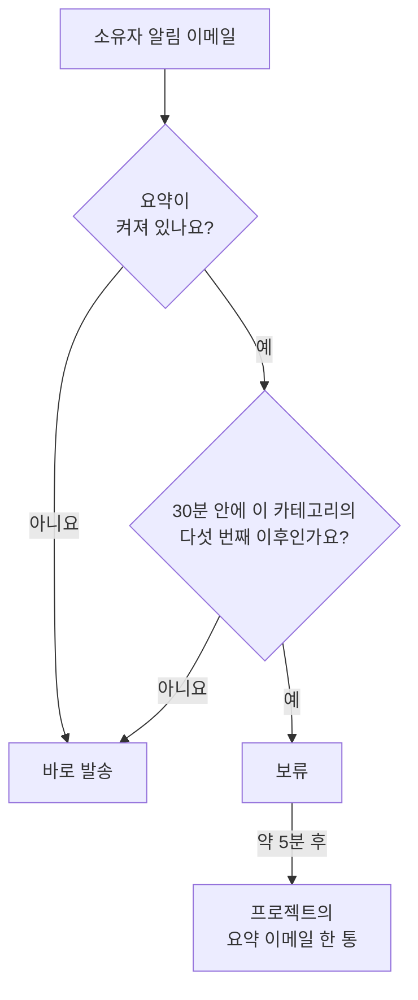

# 알림 요약

무언가 크게 잘못되면 한 번으로 끝나는 일은 드뭅니다. 불안정한 상위 링크 하나가 모니터 40개를 다운시키고, 인시던트 40건이 선언되고 확인되고 해결되며, 모든 소유자가 단계마다 이메일을 받습니다. 받은편지함 하나에 메시지가 200통 쌓이고, 결국 아무도 읽지 않게 됩니다.

OneUptime은 이런 폭주를 자동으로 이메일 한 통으로 요약합니다. 모든 사용자에게 켜져 있으며 설정할 것은 없습니다. 하지만 알림을 하나하나 별도의 이메일로 받고 싶다면 프로젝트별로 [나만 요약을 끌](#나만-요약-끄기) 수 있습니다.

:::cards
- [작동 방식](#작동-방식): 이메일 4통은 바로 나가고, 나머지는 함께 도착합니다.
- [요약되지 않는 것](#요약되지-않는-것): 온콜 호출, 보안, 결제, 구독자 이메일.
- [요약 끄기](#나만-요약-끄기): 모든 알림을 다시 각각의 이메일로 받습니다.
- [정기 이메일 줄이기](#더-줄이기): 정보성 이메일을 한 번에 끕니다.
:::

## 작동 방식

받는 모든 소유자 알림 이메일은 작은 한도에 대해 집계되며, 이 한도는 프로젝트, 수신자, 이메일 주소, 리소스 **카테고리**별로 관리됩니다. 카테고리는 인시던트, 알림, 모니터, 예약된 유지 관리, 상태 페이지, 프로브, SLO 등입니다.



- 임의의 30분 동안 한 카테고리에서 **처음 4통**의 이메일은 지금까지와 똑같이 바로 발송됩니다. 제목, 템플릿, 링크도 그대로입니다.
- 그 시간 안의 **다섯 번째 이후** 이메일은 보류됩니다.
- 약 5분 뒤, 그 프로젝트에서 보류된 모든 것이 카테고리와 관계없이 **한 통**의 이메일로 도착하며, 무슨 일이 있었는지 각 리소스로 가는 링크와 함께 보여 줍니다.

요약에는 발송 시점에 여전히 구독 중인 알림이 포함됩니다. 알림이 대기열에 있는 동안 해당 이벤트의 이메일을 끄면 그 알림은 요약에서 빠집니다. 나중에 이메일을 다시 켜도 빠진 업데이트는 다시 보내지 않습니다.

임계값 아래에서는 이 기능이 아무 일도 하지 않습니다. 하루에 소유자 이메일을 3통 보내는 프로젝트는 계속 그 3통을 각각 보냅니다.

## 요약 이메일의 모습

제목만 보아도 열기 전에 폭주의 규모 *그리고 종류*를 알 수 있습니다.

```text
[Acme Production] 112 notifications: 63 Monitors, 41 Incidents, 6 Alerts +2 more
```

본문 상단의 요약 카드에는 전체 개수, 요약이 다루는 기간, 카테고리별 분류가 나옵니다. 그 아래에는 알림이 카테고리별 섹션으로 묶여 있으며 가장 긴급한 것부터 나옵니다. 인시던트, 그다음 알림, 그다음 이를 감지한 모니터와 프로브 순서이므로, 요약 바로 아래에 있는 항목이 가장 먼저 클릭할 가치가 있는 항목입니다.

각 섹션은 이벤트마다 한 행이 아니라 리소스마다 한 행입니다.

- **행은 리소스의 최종 상태를 보여 줍니다.** 인시던트가 생성되고 확인되고 해결되었다면 최신 상태의 한 행이 되므로, 요약은 이메일 세 통을 따로 받는 것보다 *더* 최신 정보를 보여 줍니다.
- **개수가 맞아떨어집니다.** 각 행에는 마지막 업데이트 시각이 표시되고, 여러 업데이트를 합친 행에는 그 개수가 표시되므로 섹션들과 요약 카드의 합계는 항상 같습니다.
- **심각도와 상태가 표시됩니다.** 알림과 인시던트 카드에는 사용자 지정 이름을 포함해 마지막 알림의 심각도와 상태가 표시됩니다. 이 정보가 없는 오래된 대기 알림도 표시되지만, 없는 라벨은 생략됩니다.

시간은 UTC로 표시되며, 요약이 하루 이상에 걸치면 날짜도 함께 표시됩니다.


## 요약되지 않는 것

요약은 소유자와 멤버 알림, 즉 "책임지고 있는 무언가가 바뀌었다"는 종류의 알림에만 적용됩니다. 이 알림들만 지나가는 단 하나의 코드 경로 안에 있으므로 다른 것에는 영향을 줄 수 없습니다.

지연되지도, 집계되지도 않는 것:

| 카테고리 | 예 |
| ----------------------------------------- | ---------------------------------------------------------------------------------------------------- |
| 온콜 호출 | 에스컬레이션 정책에 따른 모든 호출과 모든 확인 요청 |
| 온콜 일정 | "지금 온콜입니다", "다음 온콜 담당입니다", "곧 교대가 시작됩니다", "교대가 다시 배정되었습니다" |
| 계정 보안 | 비밀번호 재설정, 이메일 인증, 비밀번호 변경, 2단계 인증 백업 코드 사용 또는 재발급 |
| 계정에 관한 관리 안내 | 관리자가 알림 방법이나 온콜 규칙을 변경함 |
| 결제 및 잔액 | 청구서, 구독 연체, "카드가 거절되어 아무도 호출하지 못했습니다" |
| 인스턴스 상태 | 인스턴스 관리자에게 보내는 Postgres, Valkey, ClickHouse 경고 |
| 상태 페이지 구독자 | 상태 페이지가 구독자에게 보내는 모든 이메일 |
| SLA 위반 | 인시던트 생성 알림 유형을 재사용하지만 바로 발송됨 |

영향을 받는 것은 이메일뿐입니다. SMS, 전화, 푸시 알림, WhatsApp, Telegram, Slack, Microsoft Teams, 웹훅은 이메일이 보류된 알림을 포함해 이전과 똑같이 바로 전달됩니다.

## 한도

| 한도 | 값 |
| --- | --- |
| 요약 이메일 한 통에 담기는 알림 | 최대 **500**건. 넘는 것은 대기열에 남아 최대 5분 뒤 다음 요약으로 발송됩니다. |
| 요약 이메일 한 통에 표시되는 행 | 최대 **100**행. 행은 리소스별로 합쳐지므로 서로 다른 리소스 100개입니다. 이를 넘으면 이메일에 전체 합계가 표시되고 프로젝트로 연결됩니다. |
| 한 프로젝트에서 한 수신자에게 가는 요약 이메일 | 시간당 최대 **12**통. |
| 보류된 알림에 더해지는 지연 | 최악의 경우 약 6분. |

시간당 상한은 타이머가 아니라 데이터베이스가 보장하므로, 몇 시간씩 이어지는 폭주에서도 지켜집니다.

## 나만 요약 끄기

묶어서 받기를 원하는 사람도 있지만, 도착하는 알림을 하나씩 정리하거나 받은편지함을 그런 처리를 하는 도구에 넘기는 사람도 있으며, 요약 이메일은 그런 흐름을 깨뜨립니다. 그래서 요약은 사람별, 프로젝트별로 끌 수 있습니다.

:::steps
### 이메일 환경설정 열기

프로젝트에서 **사용자 설정 → 이메일 환경설정**으로 이동합니다. 모든 요약 이메일 하단의 링크가 여는 페이지와 같습니다.

### Email Rollup 끄기

**Email Rollup** 카드에서 스위치를 끕니다. 변경 사항은 자동으로 저장되며, 카드에 "Off: every notification arrives as its own email, immediately."가 표시됩니다.
:::

끄면 그 프로젝트의 모든 소유자 및 멤버 알림 이메일이 다시 하나씩 바로 발송됩니다. 제목, 템플릿, 링크는 그대로이고, 임계값도 5분 대기도 없습니다. 끈 시점에 이미 대기열에 있던 것은 몇 분 뒤 마지막 요약으로 도착하고, 그 이후의 모든 것은 하나씩 도착합니다.

이 스위치는 **나에게만, 그리고 한 프로젝트에만 적용됩니다**. 꺼도 동료가 받는 것은 바뀌지 않고 다른 프로젝트로 이어지지도 않습니다. 따라서 시끄러운 프로덕션 프로젝트는 계속 묶어서 받고 조용한 내부 프로젝트는 모두 따로 받거나, 그 반대로 쓸 수 있습니다. 각자 끄기 전까지는 모두에게 켜져 있습니다.

이 스위치가 바꾸지 **않는** 것:

- **어떤 알림을 받는지.** 이는 **사용자 설정 → 알림 설정**에 있는 이벤트 유형별, 채널별 설정입니다. 요약과 이 스위치는 그 알림들을 몇 통의 이메일에 담을지만 바꿉니다.
- **온콜 호출과 교대 이메일**, **계정 보안 이메일**, **결제 이메일**, 인스턴스 상태 경고, 상태 페이지 구독자 이메일. 이것들은 처음부터 요약되지 않으므로 요약을 꺼도 바뀌는 것이 없습니다. [요약되지 않는 것](#요약되지-않는-것)을 참고하세요.
- **다른 모든 채널.** SMS, 전화, 푸시, WhatsApp, Telegram, Slack, Microsoft Teams, 웹훅은 이미 즉시 전달됩니다.

## 더 줄이기

요약은 정기 업데이트를 한데 묶습니다. 그 대부분을 아예 받지 않을 수도 있습니다.

:::steps
### 요약 이메일에서 환경설정 열기

요약 이메일 하단의 환경설정 링크를 열거나 **사용자 설정 → 이메일 환경설정**으로 이동합니다.

### Reduce routine emails 선택하기

**Fewer routine emails** 카드에서 **Reduce routine emails**를 선택합니다. 변경 사항이 저장되면 카드에 다음과 같이 표시됩니다: **정기 이메일을 껐습니다.**
:::

이렇게 하면 현재 프로젝트에서 다음 정보성 이메일이 꺼집니다.

- 인시던트, 알림, 에피소드, 예약된 유지 관리에 게시된 메모.
- 리소스 소유자로 추가되었다는 안내.
- 새 모니터와 상태 페이지.
- 기존 에피소드에 추가된 인시던트 또는 알림.
- 온콜 정책에 추가되거나 제거되는 것.

인시던트와 알림 생성, 상태 변경, 미리 알림, 인시던트 배정, 모니터 상태, 온콜 교대에 대해 기존에 선택한 설정은 유지되며, 꺼 두었던 이메일이 켜지지도 않습니다. 온콜 호출, 다른 전달 채널, 계정 이메일, 결제 이메일, 상태 페이지 구독자 이메일은 영향을 받지 않습니다.

변경 사항은 함께 저장됩니다. 특정 이메일을 다시 켜려면 **사용자 설정 → 알림 설정**에서 이벤트별 스위치를 확인하세요. 이 설정은 요약을 기다리는 알림에도 적용되며, 이미 발송된 이메일은 되돌릴 수 없습니다. 이메일 요약은 남겨 둔 이벤트를 묶는 방식을 제어하는 별도의 설정으로 그대로 남습니다.

## 문제 해결

:::details 알림 이메일이 몇 분 늦게 도착했습니다
그 이메일은 30분 안에 해당 카테고리에서 다섯 번째 이후였기 때문에 보류되었다가 약 5분 뒤 요약으로 발송되었습니다. 같은 프로젝트의 요약 이메일을 찾아보세요. 알림은 그 안의 한 행입니다. 온콜 호출과 다른 채널은 지연되지 않았습니다.
:::

:::details 요약을 껐는데도 요약 이메일을 받았습니다
끈 시점에 이미 대기열에 있던 알림은 몇 분 뒤 마지막 요약으로 도착합니다. 그 이후의 모든 것은 이메일 한 통씩 도착합니다.
:::

:::details 기대한 업데이트가 요약 이메일에 없습니다
각 행은 리소스의 최신 상태를 보여 주므로, 생성되고 확인되고 해결된 인시던트는 한 행이며 합쳐진 업데이트 수가 함께 표시됩니다. 또한 알림이 대기열에 있는 동안 **사용자 설정 → 알림 설정**에서 해당 이벤트의 이메일을 껐다면 그 알림은 빠집니다.
:::

## 다음 단계

:::cards
- [SMTP 구성](/docs/emails/smtp): OneUptime의 이메일을 자체 메일 서버를 통해 보냅니다.
- [에스컬레이션 규칙](/docs/on-call/escalation-rules): 온콜 호출이 사람에게 닿는 방식이며, 요약되지 않습니다.
:::
