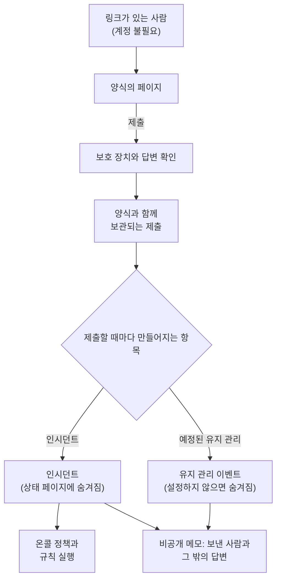

# 양식 개요

양식은 링크가 있는 사람이라면 누구나 OneUptime 계정 없이 작성할 수 있는 페이지입니다. 제출될 때마다 프로젝트에 무언가가 만들어집니다. 문제 보고라면 **인시던트**, 변경 및 유지 관리 요청이라면 **예정된 유지 관리 이벤트** 입니다. 양식의 질문은 끌어서 놓는 빌더로 만들고, 답변이 레코드가 되는 방식을 정한 다음, 양식을 써야 할 사람들에게 링크를 공유합니다.

문제를 알아차리거나 변경이 필요한 사람이 인시던트와 유지 관리를 운영하는 사람과 다를 때 양식을 사용하세요. 예를 들어 지원 상담원, 다른 부서의 동료, 매장 관리자, 고객사의 운영 팀입니다. 이들은 링크를 열고 질문에 답한 뒤 **제출** 을 누릅니다. 팀은 평범한 인시던트나 이벤트를 받게 되며, 그 필드에는 답변이 들어 있고 누가 보냈는지 기록한 비공개 메모가 붙어 있습니다.

:::cards
- [첫 양식 만들기](#첫-양식-만들기): 빈 양식에서 공유할 수 있는 링크까지.
- [양식 만들기](/docs/forms/building): 질문, 답변 유형, 숨겨진 질문, 템플릿, 브랜딩.
- [제출로 만들어지는 항목](/docs/forms/on-submit): 답변과 설정이 인시던트나 유지 관리 이벤트가 되는 과정.
- [공유 및 보안](/docs/forms/sharing-and-security): 링크, IP 허용 목록, 속도 제한, 문제 해결.
:::

## 양식의 작동 방식



모든 요청은 먼저 양식의 보호 장치를 통과합니다. 양식 자체의 페이지, 속도 제한, IP 허용 목록, 캡차입니다. 답변이 조건에 맞는 제출은 보관되고 레코드 하나를 만듭니다. 이 레코드는 답변, 양식의 **제출 시** 설정, 그리고 인시던트라면 인시던트 템플릿으로 채워집니다. 만들어진 것은 팀이 결정하기 전까지 상태 페이지에 나타나지 않습니다.

## 한눈에 보기

- **독립된 제품** — **양식** 은 제품 메뉴의 `/dashboard/{projectId}/forms` 에 있습니다. 각 양식에는 OneUptime Cloud의 `https://oneuptime.com/accounts/form/<share-key>` 같은 고유한 링크가 있습니다.
- **계정 불필요** — 링크가 있는 사람이라면 누구나 로그인하지 않고 양식을 열어 제출할 수 있습니다.
- **설정 페이지가 아닌 빌더** — 직접 만든 질문 (짧은 답변, 단락, 드롭다운, 날짜, 체크박스 등), 양식이 만드는 항목의 필드 (제목, 설명, 심각도, 모니터, 레이블, 시작과 종료), 사용자 지정 필드, 제출자의 이름과 이메일을 추가합니다. 끌어서 순서를 바꾸고, 양식을 미리 본 뒤 저장합니다.
- **모든 값의 출처를 직접 결정** — **제출 시** 페이지에는 새 인시던트나 이벤트의 모든 필드가 그 출처 (답변, 기본값, 항상 적용되는 설정, 또는 인시던트 템플릿) 와 나란히 표시됩니다.
- **누군가 게시할 때까지 숨겨짐** — 양식에서 만들어진 인시던트는 선언될 때 상태 페이지에 표시되거나 구독자에게 전송되지 않습니다. 유지 관리 이벤트도 양식에서 따로 정하지 않는 한 마찬가지입니다.
- **여러 겹의 보호** — **제출 받기** 스위치, 선택 사항인 **IP 허용 목록**, 다른 웹사이트에서 온 요청 거부, 속도 제한, 인스턴스의 캡차, 그리고 모든 답변의 크기 제한이 있습니다.
- **모든 제출 보관** — 각 양식의 **제출 내역** 페이지와 모든 양식을 모은 **양식 → 제출 내역** 에 답변이 나열되며, 각 제출이 만든 항목으로 연결됩니다.
- **자체 브랜딩** — **만들기** 페이지의 **브랜딩** 섹션에서 양식 페이지 상단에 표시할 로고와 브라우저 탭에 표시할 파비콘을 업로드합니다. 업로드하기 전까지는 OneUptime의 것이 표시됩니다.
- **흔한 사례를 위한 템플릿** — **애플리케이션 장애** 나 **계획된 유지 관리** 같은 이름 있는 답변 묶음을 저장하면, 사람들이 양식 상단에서 하나를 골라 양식을 채우거나 템플릿 자체의 링크를 열 수 있습니다. 각 템플릿은 그 사례에 맞게 질문을 필수, 선택 또는 숨김으로 만들 수도 있습니다. 양식 하나와 북마크 하나로 팀 전체를 지원합니다.
- **숨겨진 질문** — 인시던트 설명처럼 아무도 답할 필요가 없는 질문을 숨기고 각 템플릿이 대신 답하게 하거나, 필요한 사례에서만 질문하게 합니다.
- **양식 복제** — 잘 작동하는 양식에서 질문, 템플릿, 설정을 그대로 가져와 다른 팀을 위한 양식을 시작합니다.

## 양식으로 만들 수 있는 것

양식을 만들 때 **제출할 때마다 만들어지는 항목** 을 고릅니다. 나중에 양식의 **제출 시** 페이지에서 바꿀 수 있습니다.

| 제출할 때마다 만들어지는 항목 | 용도 | 일어나는 일 |
| --- | --- | --- |
| **인시던트** | 문제 보고 | 인시던트가 즉시 선언되므로 온콜 정책과 규칙이 실행되고 온콜 담당자에게 알림이 갑니다. 대응자가 게시할 때까지 상태 페이지에 표시되지 않습니다. |
| **예정된 유지 관리** | 변경 및 유지 관리 요청 | 제출자가 요청한 시간대에 유지 관리 이벤트가 예약됩니다. 양식에서 따로 정하지 않는 한 상태 페이지에 표시되지 않으며 구독자에게도 알리지 않습니다. |

양식은 이 두 가지로 시작하며, 앞으로 더 많은 종류의 레코드가 추가될 예정입니다.

## 시작하기 전에

- **양식이 포함된 요금제.** OneUptime Cloud에서 양식을 쓰려면 **Growth** 이상의 요금제가 필요합니다. [요금제](#요금제) 를 참조하세요.
- **양식을 만들 권한.** **Create Form** 은 프로젝트 소유자와 관리자, 그리고 이 권한을 준 역할에 있습니다. [권한](#권한) 을 참조하세요.
- **인시던트 양식이라면 심각도.** 모든 인시던트에는 심각도가 필요합니다. 질문, 양식의 설정 또는 인시던트 템플릿에서 정해집니다. 심각도가 없으면 모든 제출이 거부됩니다. [제출로 만들어지는 항목](/docs/forms/on-submit#how-a-submission-becomes-an-incident) 을 참조하세요.

## 첫 양식 만들기

:::steps
### 양식 생성하기

제품 메뉴에서 **양식** 을 열고 **양식 만들기** 를 클릭합니다. 양식에 이름 (공개 페이지의 제목이며 프로젝트 안에서 고유해야 합니다) 을 붙이고, **제출할 때마다 만들어지는 항목** 을 고른 다음, 필요하면 공개 페이지 상단에 표시할 설명을 Markdown으로 입력합니다.

### 질문 만들기

양식은 **만들기** 페이지에서 열리며, 이미 제목, 설명, 제출자를 묻고 있습니다. 유지 관리 양식이라면 유지 관리가 시작되고 끝나는 시각도 묻습니다. 질문을 추가하고, 제거하고, 순서를 바꾼 다음 **변경 사항 저장** 을 클릭합니다. [양식 만들기](/docs/forms/building) 를 참조하세요.

### 제출로 만들어지는 항목 정하기

**제출 시** 에서 제출이 어떻게 인시던트나 이벤트가 되는지 확인하고, **설정 편집** 을 클릭해 기본값을 지정합니다. 심각도, 인시던트 템플릿, 항상 붙일 모니터와 레이블, 알릴 소유자 등입니다. [제출로 만들어지는 항목](/docs/forms/on-submit) 을 참조하세요.

### 같은 사례가 자주 보고되면 템플릿 추가하기

**템플릿** 에서 자주 보고되는 사례마다 템플릿을 저장합니다. 양식은 질문 위에 템플릿을 나열하고, 고른 템플릿으로 스스로를 채우며, 그 템플릿이 정한 대로 질문합니다. 한 사례에 필요한 질문은 그 사례의 템플릿에서는 필수로, 다른 템플릿에서는 숨김으로 할 수 있습니다. [템플릿](/docs/forms/building#templates) 을 참조하세요.

### 링크 공유하기

**공유** 에서 링크를 복사해 양식을 써야 할 사람들에게 보냅니다. [공유 및 보안](/docs/forms/sharing-and-security) 을 참조하세요.
:::

> [!IMPORTANT]
> 새 양식은 만들어지는 즉시 **제출 받기** 상태가 되지만, 링크를 공유하기 전까지는 아무도 접근할 수 없습니다. 질문과 보호 장치를 먼저 설정하세요.

## 양식의 페이지

| 페이지 | 담고 있는 것 |
| --- | --- |
| **만들기** | 양식의 이름과 설명, 접혀 있는 **브랜딩** (로고와 파비콘), 그리고 빌더: 질문, 질문 팔레트, **미리 보기**. |
| **템플릿** | 양식을 시작할 때 고를 수 있는 이름 있는 답변 묶음, 각 템플릿이 질문하는 방식, 양식이 처음 열 때 쓰는 템플릿, 템플릿마다의 링크. |
| **제출 시** | 각 제출이 만드는 항목과 그 모든 필드가 채워지는 방식. **설정 편집** 으로 기본값과 항상 적용되는 내용을 바꿉니다. |
| **공유** | **제출 받기**, **공유 링크**, 제출 후 표시되는 메시지, **IP 허용 목록**. |
| **제출 내역** | 양식으로 이루어진 모든 제출. 최신순이며 답변과 만들어진 항목이 함께 표시됩니다. |
| **양식 복제** | **고급** 아래: 이름이 자동으로 붙는 양식의 사본으로, 질문, 템플릿, 제출 시 설정, 브랜딩, 감사 메시지, IP 허용 목록, 그리고 자체 링크를 가집니다. 사본은 꺼진 상태로 시작하며 빌더에서 열립니다. |
| **양식 삭제** | **고급** 아래에 있는 양식 삭제. 제출 내역도 함께 삭제되지만, 양식이 만든 인시던트와 이벤트는 삭제되지 않습니다. |

양식 메뉴의 **개발자** 섹션에는 다른 모든 리소스와 마찬가지로 Terraform, API, AI 어시스턴트 페이지가 있습니다.

## 양식과 인시던트 템플릿

템플릿과 양식은 모두 같은 인시던트를 두 번 입력하지 않게 해 주지만, 쓰는 사람이 다릅니다.

| | 인시던트 템플릿 | 양식 |
| --- | --- | --- |
| 쓰는 사람 | OneUptime에 로그인한 팀 | 링크가 있는 누구나 (계정 불필요) |
| 위치 | 인시던트 목록의 **템플릿에서 생성** | 양식 링크에 있는 독립된 페이지 |
| 바꿀 수 있는 것 | 선언하기 전 인시던트의 모든 필드 | 고른 질문에 대한 답변만 |
| 보이는 것 | 모니터, 정책, 소유자, 모든 필드 | 양식의 이름, 설명, 질문 — 그리고 제공하기로 고른 선택지만 |
| 상태 페이지 | 템플릿과 선언 양식이 정한 대로 | 대응자가 인시던트를 게시할 때까지 숨겨짐 |

둘은 함께 작동합니다. 인시던트 양식의 **제출 시** 페이지에서 **인시던트 템플릿** 을 지정하면, 그 양식이 선언하는 모든 인시던트가 그 템플릿으로 선언됩니다. 템플릿에는 팀이 인시던트에 필요로 하는 것을, 양식에는 제출자에게 묻고 싶은 것을 담으세요.

## 제출 내역

양식의 **제출 내역** 페이지에는 그 양식으로 이루어진 모든 제출이 최신순으로 나열되며, **제출 시각**, **제출자** (제출자가 입력한 이름과 이메일, 또는 **익명**), 그리고 만들어진 인시던트나 이벤트로 연결되는 **생성됨** 이 표시됩니다. **답변 보기** 는 제출자가 입력한 그대로 모든 답변을 보여 줍니다. **양식 → 제출 내역** 에는 프로젝트의 모든 양식에 대한 제출이 나열됩니다.

제출은 양식이 기록하며 사람이 직접 쓰지 않고, 편집할 수도 없습니다. 제출을 삭제하면 그 답변과 제출자의 이름과 이메일이 목록에서 사라집니다. 만들어진 인시던트나 이벤트는 남으며, 제출자의 정보와 답변을 다시 적어 둔 비공개 메모도 남습니다. 인시던트나 이벤트가 삭제되어도 제출은 남고, 그 **생성됨** 열에는 **이후 삭제됨** 이 표시됩니다.

> [!WARNING]
> 누군가의 개인 데이터를 제거할 때는 제출을 삭제하는 것만으로는 부족합니다. 그 제출이 만든 인시던트나 이벤트의 비공개 메모도 편집하거나 삭제하세요.

## 권한

양식을 쓰면 팀 밖의 사람이 프로젝트에 인시던트와 유지 관리 이벤트를 만들 수 있으므로, 양식은 프로젝트 소유자와 관리자, 그리고 **Form** 권한을 준 역할이 관리합니다. 이 권한들은 [권한 레퍼런스](/docs/permissions/reference) 의 **Form** 그룹에 있습니다.

| 권한 | 허용하는 것 | 기본으로 가진 역할 |
| --- | --- | --- |
| **Create Form** | 양식 만들기와 복제. | Project Owner, Project Admin |
| **Edit Form** | 양식 변경: 질문, 브랜딩, 템플릿, 제출 시 설정, **제출 받기**, 링크, **IP 허용 목록**. | Project Owner, Project Admin |
| **Delete Form** | 양식 삭제 (제출 내역도 함께 삭제됩니다). | Project Owner, Project Admin |
| **Read Form** | 양식과 그 질문, 설정, 링크 보기. | 위의 역할과 Project Member, Viewer, 인시던트 및 예정된 유지 관리 역할 |
| **Read Form Submission** | 제출과 그 답변 보기. | Project Owner, Project Admin |
| **Delete Form Submission** | 제출 삭제. | Project Owner, Project Admin |

제출에는 모르는 사람이 입력한 내용 (이름, 이메일 주소, 레코드에 들어가지 않을 수도 있는 답변) 이 담겨 있으므로, **Read Form Submission** 을 부여하지 않으면 프로젝트 소유자와 관리자만 볼 수 있습니다. 양식을 볼 수 있는 사람은 누구나 그 링크를 보고 공유할 수 있습니다. 양식을 제출하는 데에는 아무 권한도 필요 없습니다. 역할과 세분화된 권한이 어떻게 결합되는지는 [사용자, 팀 및 권한](/docs/permissions/index) 을 참조하세요.

## 요금제

OneUptime Cloud에서 양식을 쓰려면 **Growth** 이상의 요금제가 필요하고, 양식의 **IP 허용 목록** 에는 **Scale** 이 필요합니다. 양식을 만들 때 설정하든 나중에 편집하든 마찬가지입니다. **Growth** 요금제보다 낮거나 구독 요금이 미납된 프로젝트의 링크에는 사용할 수 없다는 메시지가 표시되며, 아무것도 만들어지지 않습니다.

## API로 양식 사용하기

양식은 `/api/form` 에 있는 일반적인 API 리소스이며, 제출은 `/api/form-submission` 에 있습니다. 제출은 읽고 삭제할 수는 있지만 만들거나 편집할 수는 없습니다. 요청과 응답의 전체 형식은 [API 레퍼런스](/reference) 에 있습니다.

### 질문과 설정

양식의 질문은 `fields` 열 (양식이 묻는 순서대로 된 JSON 목록) 에, 제출 시 설정은 `targetSettings` 에 있습니다.

```json
{
  "data": {
    "targetType": "Incident",
    "fields": [
      {
        "id": "what",
        "source": "TargetField",
        "targetField": "title",
        "label": "What is wrong?",
        "isRequired": true
      },
      {
        "id": "office",
        "source": "Question",
        "type": "Dropdown",
        "label": "Which office are you in?",
        "dropdownOptions": "Berlin\nLondon",
        "isRequired": false
      },
      {
        "id": "email",
        "source": "Submitter",
        "submitterField": "Email",
        "label": "Your Email",
        "isRequired": true
      }
    ],
    "targetSettings": {
      "incidentSeverityId": "<severity-id>",
      "labelIds": ["<label-id>"]
    }
  }
}
```

각 질문에는 고유한 `id` (문자, 숫자, `-`, `_`), `source`, `label`, 그리고 선택 사항인 `helpText` 와 `isRequired` 가 있습니다.

| `source` | 묻는 것 |
| --- | --- |
| `Question` | 양식 자체의 질문으로, `type` 에 따라 답합니다: `Text`, `LongText`, `Markdown`, `Number`, `Dropdown`, `MultiSelectDropdown`, `Boolean`, `Date`, `DateTime`. 드롭다운은 `dropdownOptions` 를 한 줄에 하나씩 나열합니다. |
| `TargetField` | 양식이 만드는 항목의 필드로, `targetField` 로 지정합니다: 인시던트는 `title`, `description`, `incidentSeverityId`, `monitors`, `labels`, `impactStartedAt`, 유지 관리 이벤트는 `title`, `description`, `startsAt`, `endsAt`, `monitors`, `statusPages`, `labels`. 골라서 답하는 필드는 제공하는 레코드를 `allowedOptionIds` 에 나열합니다. |
| `TargetCustomField` | 인시던트나 이벤트의 사용자 지정 필드 중 하나로, `customFieldId` 로 지정합니다. |
| `Submitter` | 제출자의 `Name` 또는 `Email` 로, `submitterField` 로 지정합니다. |

`isHidden` 이 `true` 인 질문은 공개 페이지에 표시되지 않고, 필수가 되지 않으며, 제출이 지정한 템플릿으로만 답이 채워집니다. 그 템플릿이 질문을 묻는 경우는 예외입니다. `isRequired` 와 `isHidden` 은 양식의 기본값이며, 각 템플릿은 질문을 자기 방식대로 물을 수 있습니다.

### API의 템플릿

양식의 템플릿은 `templates` 열 (양식이 나열하는 순서대로 된 JSON 목록) 에 있습니다. 각 템플릿에는 고유한 `id` (문자, 숫자, `-`, `_`), 양식 안에서 고유한 최대 100자의 `name`, 그리고 질문 ID를 키로 하는 `answers` 가 있습니다. 각 답변은 제출이 보내는 형식 그대로입니다: 텍스트, 숫자, `true` 또는 `false`, 선택지의 값, 다중 선택이라면 값의 목록입니다. `isDefault` 를 `true` 로 하면 양식이 처음 열 때 쓰는 템플릿이 됩니다. 양식에는 이런 템플릿이 최대 하나, 템플릿은 최대 50개까지 있을 수 있습니다.

`fieldSettings` 도 질문 ID를 키로 하며, 템플릿이 질문을 묻는 방식을 나타냅니다: `Required`, `Optional`, `Hidden`. 템플릿에 나열되지 않은 질문 (또는 `null` 로 나열된 질문) 은 양식이 묻는 대로 묻고, 유지 관리 이벤트의 `startsAt` 과 `endsAt` 질문은 `Required` 로만 할 수 있습니다.

```json
{
  "data": {
    "templates": [
      {
        "id": "outage",
        "name": "Application Outage",
        "isDefault": true,
        "answers": {
          "what": "The application is down",
          "office": "Berlin"
        },
        "fieldSettings": {
          "office": "Required",
          "email": "Optional"
        }
      }
    ]
  }
}
```

질문, 템플릿, 설정은 대시보드, API, Terraform, 워크플로 어디에서 저장하든 저장할 때마다 확인되며, 규칙을 어기는 목록은 무엇이 잘못되었는지 알려 주는 메시지와 함께 거부됩니다. 양식 링크에 들어가는 키인 `shareKey` 는 양식을 만들 때 OneUptime이 설정하며, 이를 바꾸는 것이 **링크 재설정** 입니다.

### API의 브랜딩

양식의 브랜딩은 `logoFileId`, `logoAltText`, `faviconFileId` 입니다. 먼저 양식의 프로젝트에서 `POST /api/file` 로 이미지를 업로드합니다. 그 프로젝트의 API 키를 쓰거나, 프로젝트 멤버로 로그인해 `tenantid` 헤더에 프로젝트 ID를 넣습니다. 이때 `name`, `image/png` 같은 `fileType`, 그리고 base64로 인코딩한 바이트를 `file` 에 담아 보낸 뒤, 반환된 `_id` 를 설정합니다. 멤버가 아닌 프로젝트에 업로드하면 "You can upload files only to a project you are a member of." 로 거부됩니다. 모든 업로드는 비공개입니다: `isPublic` 은 요청 내용과 관계없이 OneUptime이 설정합니다. 각 이미지는 양식을 저장할 때 확인됩니다. 양식의 프로젝트에서 업로드된 것이어야 하며, 로고는 512 KB 이하의 PNG, JPEG, GIF, WebP 또는 SVG 이미지, 파비콘은 그중 하나이거나 128 KB 이하의 ICO여야 합니다. ID를 `null` 로 설정하면 OneUptime의 것으로 돌아갑니다. [브랜딩](/docs/forms/building#branding) 을 참조하세요.

### 제출 내역 읽기

양식의 제출 내역을 나열하려면:

```bash
curl -X POST https://oneuptime.com/api/form-submission/get-list \
  -H "apikey: $ONEUPTIME_API_KEY" \
  -H "Content-Type: application/json" \
  -d '{
    "query": { "formId": "<form-id>" },
    "select": { "submitterName": true, "submitterEmail": true, "answers": true, "incidentId": true, "scheduledMaintenanceId": true, "createdAt": true },
    "limit": 50,
    "skip": 0
  }'
```

### 워크플로

양식에는 자동 생성된 워크플로 구성 요소 (**On Create Form**, **On Update Form** 등) 가 있습니다. 양식이 만든 항목에 작업하려면 **On Create Incident** 또는 **On Create Scheduled Maintenance** 를 사용하세요.

### 공개 페이지 전용 엔드포인트

공개 페이지는 API 키가 필요 없는 두 경로와 통신합니다. `GET /api/form/public/<shareKey>` 는 양식의 이름, 설명, 질문을 반환하며, 있으면 로고, 로고의 대체 텍스트, 파비콘 (이미지는 base64) 과, 페이지가 묻는 질문에 대한 답변이 담긴 템플릿도 반환합니다. `POST /api/form/public/<shareKey>/submit` 은 양식을 제출하며, 제출자가 시작한 템플릿을 `templateId` 로 지정합니다. 이것들은 페이지 전용 엔드포인트이지, 무언가를 만들 기반이 되는 API가 아닙니다. 모든 호출은 양식의 보호 장치를 거치며 ([공유 및 보안](/docs/forms/sharing-and-security) 참조), 페이지와 함께 바뀝니다. 자신의 코드에서 인시던트를 만들려면 API 키로 `POST /api/incident` 를 사용하세요. [인시던트 선언](/docs/incidents/declaring-incidents) 을 참조하세요.

## 인시던트 양식이 옮겨 간 곳

양식은 **인시던트 → 설정 → 양식** 아래에 있던 **Incident Forms** 를 대체합니다. 모든 인시던트 양식은 업그레이드할 때 같은 링크와 같은 제출 내역을 유지한 채 옮겨졌습니다.

- 질문은 빌더의 질문이 되었습니다: 제목, 숨겨져 있지 않았다면 설명, 제출자가 고를 수 있었다면 심각도, 묻고 있던 각 사용자 지정 필드 (사용자 지정 필드의 정렬 순서대로), 그리고 양식이 익명 보고를 허용하지 않았다면 필수인 **Your Name** 과 **Your Email** 입니다.
- 심각도와 인시던트 템플릿은 **제출 시** 의 기본값이 되었습니다.
- **활성화됨** 스위치, 성공 메시지, **IP 허용 목록** 은 그대로이며 링크도 바뀌지 않았습니다: 예전 `/accounts/incident-form/<share-key>` 링크는 새 주소의 양식을 엽니다.
- **Incident Form** 권한은 그 권한이 있던 모든 팀과 API 키에서 **Form** 권한이 되었습니다.

예전 대시보드 페이지는 새 페이지로 리디렉션됩니다.

## 다음 단계

:::cards
- [양식 만들기](/docs/forms/building): 질문, 답변 유형, 연결된 필드, 사용자 지정 필드, 미리 보기.
- [제출로 만들어지는 항목](/docs/forms/on-submit): 답변과 제출 시 설정이 인시던트나 유지 관리 이벤트가 되는 과정.
- [공유 및 보안](/docs/forms/sharing-and-security): 링크, IP 허용 목록, 속도 제한, 캡차, 문제 해결.
- [인시던트 선언](/docs/incidents/declaring-incidents): 인시던트를 선언하는 다른 방법.
:::
