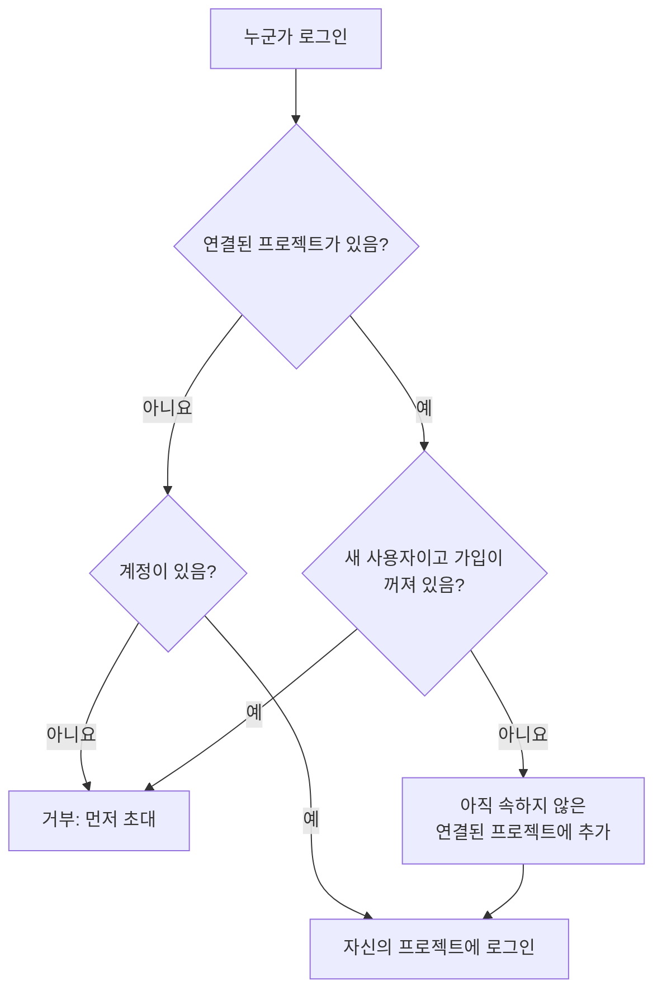

# 글로벌 SSO

글로벌 SSO를 사용하면 OneUptime **인스턴스 관리자**(마스터 관리자)가 SAML 2.0 또는 OpenID Connect(OIDC) ID 공급자를 인스턴스 수준에서 **한 번만** 구성하고, 서버의 어느 프로젝트에든 연결할 수 있습니다. 프로젝트 소유자가 저마다 자신의 ID 공급자를 구성하는 대신, 마스터 관리자가 인스턴스 전체에서 쓸 공급자 하나를 설정합니다.

> [!NOTE]
> 인스턴스 전체의 "Require SSO for Login" 스위치를 포함한 글로벌 SSO는 모든 OneUptime 에디션에 포함됩니다. Community Edition을 포함한 모든 자체 호스팅 인스턴스에서 사용할 수 있으며 라이선스가 필요하지 않습니다. 인스턴스 관리 기능이므로 OneUptime Cloud에는 적용되지 않습니다. 각 에디션에 포함된 기능은 [엔터프라이즈 에디션](/docs/self-hosted/enterprise)을 참고하세요.

:::cards
- [공급자 설정](#글로벌-sso-설정): 공급자를 만들고, OneUptime의 URL을 ID 공급자에 넘겨준 다음 테스트합니다.
- [사용자 로그인 방식](#사용자-로그인-방식): 기존 멤버만 로그인하거나, 연결한 프로젝트에 새로 온 사람을 추가합니다.
- [SSO 필수 지정](#sso-필수-지정): 프로젝트 하나 또는 인스턴스 전체에 SSO를 필수로 지정합니다.
- [공급자 끄기](#공급자-끄기-또는-삭제): 무엇이 끝나고, OneUptime이 어떤 변경을 거부하는지 알아봅니다.
:::

## 글로벌 SSO와 프로젝트 SSO 비교

|             | 프로젝트 SSO                               | 글로벌 SSO                                         |
| ----------- | ------------------------------------------ | -------------------------------------------------- |
| 구성하는 사람 | 프로젝트 소유자/관리자(프로젝트 설정)       | 인스턴스 마스터 관리자(Admin Dashboard)             |
| 범위        | 단일 프로젝트                              | 인스턴스 전체(어느 프로젝트에든 연결 가능)          |
| 로그인 결과 | 그 프로젝트 하나에 대한 액세스             | 사용자가 접근할 수 있는 모든 프로젝트에 대한 액세스 |

단일 프로젝트 자체의 공급자는 [SSO](/docs/identity/sso)를 참고하세요.

## 글로벌 SSO 설정

:::steps
### 공급자 목록 열기

:::tabs
@tab SAML
마스터 관리자로 로그인한 다음 사용자 메뉴의 **관리자 설정**으로 Admin Dashboard를 엽니다. 그런 다음 **설정** > **인증** > **Global SSO**로 이동합니다.
@tab OpenID Connect
마스터 관리자로 로그인한 다음 사용자 메뉴의 **관리자 설정**으로 Admin Dashboard를 엽니다. 그런 다음 **설정** > **인증** > **Global OIDC**로 이동합니다.
:::

### 공급자 만들기

:::tabs
@tab SAML
- **Create Global SSO**를 클릭합니다.
- **이름**, ID 공급자의 **Sign On URL**과 **Issuer**를 입력하고 **Public Certificate**를 붙여 넣습니다. 나머지는 **추가 필드**에 이미 채워져 있습니다. **Signature Method**(`RSA-SHA256`), **Digest Method**(`SHA256`), 설명(`Sign in with`와 이름)입니다. IdP에서 필요한 경우에만 변경하세요. 저장하면 공급자 페이지가 열립니다.
@tab OpenID Connect
- **Create Global OIDC**를 클릭합니다.
- **이름**, **Issuer URL**, 그리고 IdP에 등록한 앱의 **Client ID**와 **Client Secret**을 입력합니다. **Issuer URL**에 IdP의 검색 URL을 붙여 넣어도 됩니다. 나머지는 **추가 필드**에 이미 채워져 있습니다. **Discovery URL**(발급자 뒤에 `/.well-known/openid-configuration`을 붙인 값), **Scopes**(`openid email profile`), `email`과 `name` 클레임 이름, 설명(`Sign in with`와 이름)입니다. IdP에서 필요한 경우에만 변경하세요. 저장하면 공급자 페이지가 열립니다.
:::

### OneUptime의 URL을 ID 공급자에 복사

:::tabs
@tab SAML
공급자 페이지의 **Identity Provider URLs** 카드에 **ACS URL (Assertion Consumer Service / Reply URL)** 값과 **Issuer (Entity ID)** 값이 표시됩니다. 두 값을 모두 ID 공급자(Okta, Microsoft Entra ID, OneLogin, JumpCloud 등)에 붙여 넣으세요.
@tab OpenID Connect
공급자 페이지의 **Identity Provider URL** 카드에 **Redirect URI (Callback URL)** 값이 표시됩니다. 이 값을 ID 공급자의 허용된 리디렉션 URI에 추가하세요.
:::

### 공급자 켜기

새 공급자는 꺼진 상태로 시작합니다. 공급자 페이지에서 **Edit Configuration**을 클릭하고 **활성화됨**을 켭니다.

글로벌 공급자를 활성화하면 로그인 페이지에 "Sign in with SSO" 옵션이 추가될 뿐입니다. SSO를 강제하거나 누군가를 차단하지 않으므로, 안심하고 활성화하고 테스트한 뒤 필요하면 다시 비활성화할 수 있습니다.

### 공급자 테스트

**Test this SSO provider** 카드(OpenID Connect의 경우 **Test this OIDC provider**)의 링크로 ID 공급자를 거치는 전체 로그인 과정을 실행합니다. 먼저 프로젝트를 연결할 필요는 없습니다. 테스트하면 이미 속해 있는 프로젝트에 로그인됩니다. 링크가 작동하려면 공급자가 활성화되어 있어야 합니다.
:::

## 사용자 로그인 방식

글로벌 공급자의 동작은 공급자에 프로젝트를 연결했는지에 따라 달라집니다.

- **연결된 프로젝트 없음 (모든 프로젝트 / 초대 우선):** 사용자는 공급자로 로그인하여 **이미 멤버인 모든 프로젝트**에 접근할 수 있습니다. 새 사용자는 자동으로 생성되지 **않습니다**. 사용자는 먼저 프로젝트에 초대되어야 합니다. 멤버십을 다른 곳에서 관리하는 회사 전체 SSO에 사용하세요.

- **연결된 프로젝트 있음 (자동 프로비저닝):** 공급자를 열고 **Attached Projects** 테이블을 사용하여 각각 기본 팀 집합과 함께 하나 이상의 프로젝트를 연결합니다. 로그인하는 사용자는 해당 프로젝트에 **자동 프로비저닝**되며 첫 로그인 시 기본 팀에 추가됩니다. 연결한 프로젝트는 처음에 해당 프로젝트의 멤버 팀이 선택되어 있습니다. 새 사용자에게 다른 접근 권한을 주려면 다른 팀을 고르세요. 목록을 구성하려면 한 번에 하나의 프로젝트 + 팀을 추가하십시오. 연결을 변경하려면 삭제한 후 다시 추가하십시오.

연결된 프로젝트에 이미 속해 있는 사람은 그 프로젝트에서의 팀을 그대로 유지합니다.

공급자의 스위치 두 개가 이 동작을 바꿉니다. 둘 다 처음에는 꺼져 있고 **추가 필드** 안에 접혀 있습니다.

| 스위치 | 켜져 있을 때의 동작 |
| --- | --- |
| **Disable Sign Up with SSO** | 프로젝트가 연결되어 있더라도, 이 공급자로 로그인하려면 먼저 프로젝트에 초대되어 있어야 합니다. 첫 로그인 때 새 사용자가 만들어지지 않습니다. |
| **Restrict to Attached Projects** | 이 공급자로 로그인하면 이 공급자에 연결된 프로젝트에서만 SSO 요건을 충족합니다. 그래서 이미 로그인한 사람이 다른 프로젝트에 대한 액세스를 잃을 수 있습니다. 꺼져 있으면 그 사람이 속한 모든 프로젝트에서 요건을 충족하며, 연결된 프로젝트는 새로 온 사람을 어디에 추가할지만 결정합니다. |

## SSO 필수 지정

글로벌 공급자를 구성해도 누구에게 사용을 강제하지는 않으며, 비밀번호 로그인도 계속 작동합니다. SSO를 필수로 지정하려면 프로젝트나 인스턴스 전체에서 요건을 켜세요.

- **프로젝트별:** 프로젝트는 SSO를 필수로 지정할 수 있고, 선택적으로 _특정_ 공급자(프로젝트 또는 글로벌)를 필수로 지정할 수도 있습니다. [프로젝트에 SSO 필수 지정](/docs/identity/sso#프로젝트에-sso-필수-지정)을 참고하세요.
- **인스턴스 전체:** **Admin** > **설정** > **인증**에는 인스턴스의 모든 사용자에게 SSO를 강제하는 **로그인에 SSO 필수** 스위치가 있습니다. 켜기 전에 확인을 요청하고, 확인하는 즉시 저장됩니다. 마스터 관리자는 차단되지 않도록 계속 예외로 남습니다.

**로그인에 SSO 필수**를 켜려면, 아무도 차단되지 않도록 사람을 로그인시키는 SSO 공급자가 필요합니다.

- 인스턴스 전체의 경우, 자체적으로 SSO를 필수로 지정하지 않은 모든 프로젝트에 공급자가 하나 있어야 합니다. 켜져 있는 프로젝트 자체의 SAML 또는 OIDC 공급자이거나, 켜져 있고 그 프로젝트에 사람을 로그인시키는 글로벌 공급자입니다. 그런 공급자가 없는 프로젝트가 있는 동안에는 스위치를 켜는 것이 거부되며, 메시지에 그 프로젝트들(많으면 처음 몇 개와 전체 개수)이 표시됩니다. 먼저 글로벌 공급자나 그 프로젝트들의 공급자를 켜세요. 특정 공급자를 필수로 지정한 프로젝트에는 바로 그 공급자가 필요합니다. 그 공급자가 꺼져 있거나, 삭제되었거나, 그 프로젝트에 사람을 로그인시키지 않는 동안에는 메시지가 그 프로젝트를 따로 표시합니다. 먼저 그 공급자를 켜거나, 그 프로젝트에서 다른 공급자를 필수로 지정하세요.
- 프로젝트의 경우에는 그 프로젝트와, 프로젝트가 필수로 지정한 공급자가 있다면 그 공급자에게 같은 조건이 요구됩니다.
- 이미 켜져 있는 **로그인에 SSO 필수**를 켜진 상태로 보내는 저장(다른 설정과 함께 보내거나 API에서 보내는 경우)도 인스턴스든 프로젝트든 같은 방식으로 확인되며, 프로젝트가 이미 필수로 지정한 공급자를 지정하는 저장도 마찬가지입니다.
- 아직 자체 공급자가 없는 새 프로젝트의 경우: 인스턴스에서 SSO가 필수인 동안 프로젝트를 만들려면 켜져 있고 모든 프로젝트에 사람을 로그인시키는 글로벌 공급자가 필요합니다. 그렇지 않으면 만든 사람을 포함해 아무도 프로젝트를 열 수 없기 때문입니다. 없으면 프로젝트 생성이 거부되고, 메시지는 서버 관리자에게 공급자를 켜 달라고 요청합니다. 마스터 관리자는 계속 프로젝트를 만들 수 있습니다. **로그인에 SSO 필수**를 켠 상태로 만드는 프로젝트도 누가 만들든 같은 것이 필요합니다.

끄는 것은 절대 거부되지 않습니다.

## 공급자 끄기 또는 삭제

글로벌 공급자를 끄거나, 삭제하거나, 연결된 프로젝트로 제한하면 그 공급자가 더 이상 사람을 로그인시키지 않는 곳에서 그 공급자로 이루어진 로그인이 끝납니다. SSO가 필수인 곳에서는 그 공급자로 로그인한 사람이 다음 요청 때 SSO로 다시 로그인해야 하고, 열어 둔 페이지는 즉시 실시간 업데이트를 받지 않게 되며, 누군가가 그 공급자로 로그인한 뒤 연결한 MCP 클라이언트는 그 프로젝트에서 작동하지 않게 됩니다.

공급자를 다시 켜도 그 로그인은 돌아오지 않습니다. 그 공급자로 다시 로그인해야 합니다. 업그레이드할 때 이미 꺼져 있던 공급자는 업그레이드 시점에 꺼진 것으로 간주됩니다.

새 인증서나 클라이언트 시크릿, 다른 URL 또는 새 이름은 모든 사람의 로그인 상태를 유지합니다.

### SSO가 필수인 모든 프로젝트는 들어올 길을 유지합니다

프로젝트 자체가 SSO를 필수로 지정했든 인스턴스 전체가 필수로 지정했든, SSO가 필수인 프로젝트에는 사람이 로그인할 수 있는 공급자가 항상 남아 있습니다. 따라서 다음 변경으로 그런 프로젝트에 공급자가 하나도 남지 않거나 프로젝트가 필수로 지정한 공급자가 사라진다면, 그 변경은 거부됩니다.

- 글로벌 공급자를 끄거나, 삭제하거나, 연결된 프로젝트로 제한하는 것
- 연결된 프로젝트로 제한된 공급자의 경우: 첫 번째 프로젝트를 연결하는 것(그 전까지는 모든 프로젝트에 사람을 로그인시킵니다), 연결을 끄는 것, 연결을 다른 프로젝트나 다른 공급자로 옮기는 것, 연결을 제거하는 것

메시지에는 프로젝트, 또는 처음 몇 개와 전체 개수가 표시됩니다. 먼저 그 프로젝트들의 다른 공급자(프로젝트 자체의 공급자나 글로벌 공급자)를 켜거나, 그 프로젝트에서 **로그인에 SSO 필수**를 끄세요. 바로 이 공급자를 필수로 지정한 프로젝트는 따로 표시됩니다. 먼저 그 프로젝트에서 다른 공급자를 필수로 지정하거나 **로그인에 SSO 필수**를 끄세요.

공급자가 더 많은 사람을 로그인시키게 하는 변경(공급자나 연결을 켜는 것, 제한을 해제하는 것)은 절대 거부되지 않습니다. **로그인에 SSO 필수**를 끌 때와 마찬가지로 모든 앱 서버에 즉시 반영되므로, 사람들은 바로 그 공급자로 로그인할 수 있습니다. 바로 그 순간에 같은 공급자에 대한 다른 변경이 저장되는 경우에만 앱 서버가 따라오는 데 최대 1분이 걸릴 수 있습니다.

누가 로그인할 수 있는지에 대한 두 변경은 차례로 하나씩 확인됩니다. 같은 순간에 다른 변경이 저장되고 있고 그 저장이 평소보다 오래 걸리면(인스턴스 전체에 **로그인에 SSO 필수**를 켜면 모든 프로젝트를 읽습니다), 변경은 "Another change to who can sign in with SSO is being saved. Try again in a moment."로 거부됩니다. 다시 저장하세요. 그 순간에 만들어지는 프로젝트도 변경을 기다리며, 너무 오래 기다리면 "The server's SSO settings are being changed. Create the project again in a moment."로 거부됩니다.

## 문제 해결

:::details "You must be invited to a project on this OneUptime instance before you can sign in with SSO"
그 사람은 아직 OneUptime 계정이 없고, 공급자도 계정을 만들지 않습니다. 공급자에 연결된 프로젝트가 없거나 **Disable Sign Up with SSO**가 켜져 있습니다. 그 사람을 프로젝트에 초대하거나 공급자에 프로젝트를 연결하세요.
:::

:::details "This SSO provider does not grant access to any project you are a member of"
**Restrict to Attached Projects**가 켜져 있고, 그 사람은 공급자에 연결된 어떤 프로젝트의 멤버도 아닙니다. 그 사람의 프로젝트 중 하나를 연결하거나 그 사람을 연결된 프로젝트에 추가하세요.
:::

:::details "You are not a member of any project on this OneUptime instance"
그 사람은 계정이 있지만 어떤 프로젝트에도 속해 있지 않고, 공급자에도 그 사람을 추가할 곳이 없습니다. 그 사람을 프로젝트에 초대하거나 기본 팀이 있는 프로젝트를 공급자에 연결하세요.
:::

:::details "Issuer URL does not match"
SAML 공급자의 경우, ID 공급자 응답의 발급자가 공급자에 저장된 **Issuer**와 다릅니다. ID 공급자에서 다시 복사하세요. 두 값은 정확히 일치해야 합니다.
:::

## 다음 단계

:::cards
- [SSO](/docs/identity/sso): 프로젝트 자체의 SAML 또는 OIDC 공급자를 설정합니다.
- [SCIM](/docs/identity/scim): ID 공급자가 사람을 자동으로 추가하고 제거하게 합니다.
- [사용자, 팀 및 권한](/docs/permissions/index): 새로 온 사람이 합류하는 팀으로 할 수 있는 일을 알아봅니다.
:::
