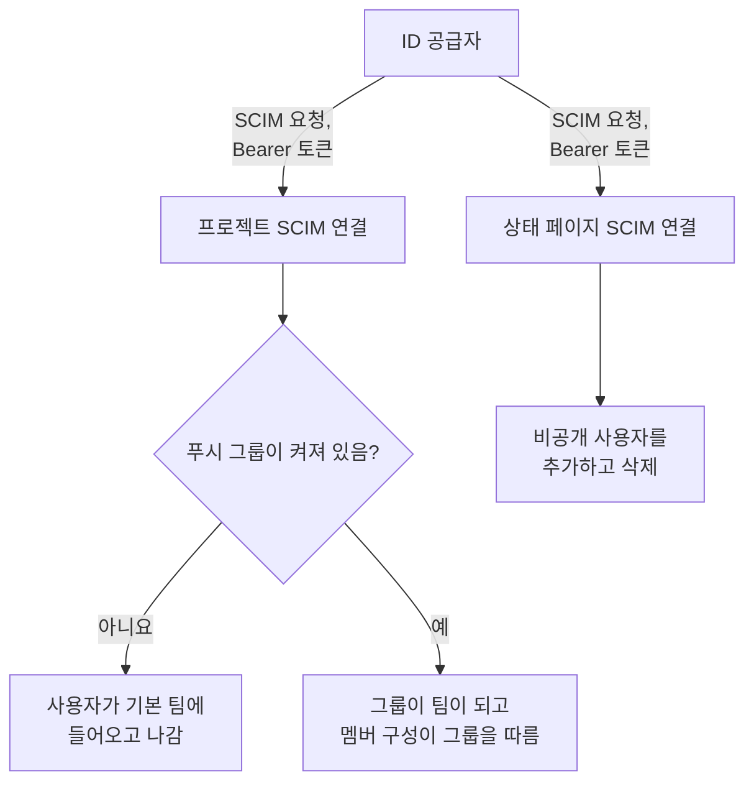
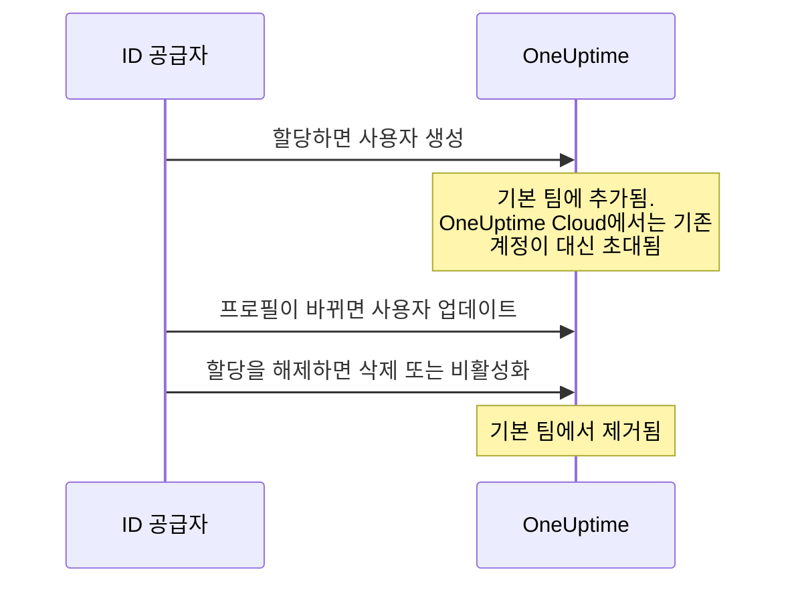
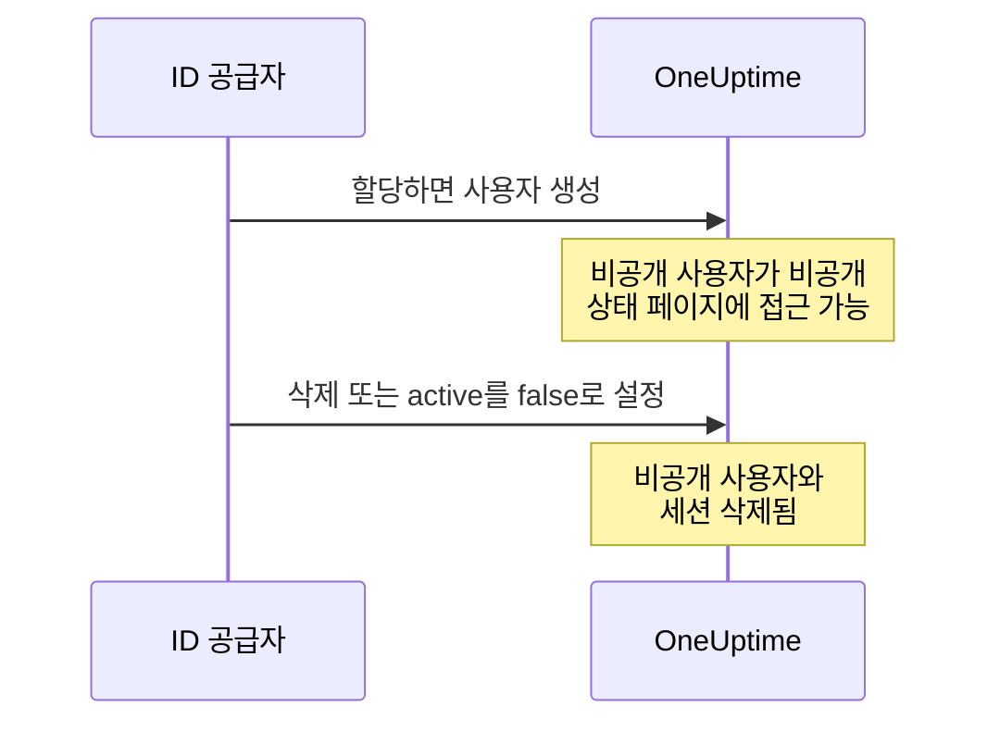

# SCIM

SCIM(System for Cross-domain Identity Management)은 사람의 프로비저닝과 프로비저닝 해제를 자동으로 처리합니다. Microsoft Entra ID, Okta 또는 다른 SCIM 2.0 시스템 같은 ID 공급자(IdP)는 사람을 할당하면 OneUptime 프로젝트와 비공개 상태 페이지에 추가하고, 할당을 해제하면 제거합니다.

> [!NOTE]
> **에디션:** SCIM은 OneUptime Enterprise Edition의 일부입니다. OneUptime Cloud에서는 **Scale** 플랜 이상에서 사용할 수 있습니다. 자체 호스팅 설치에는 Enterprise Edition 이미지와 라이선스가 필요합니다. [엔터프라이즈 에디션](/docs/self-hosted/enterprise)을 참고하세요. 유효한 라이선스가 없으면(14일 체험 기간이 끝난 뒤 또는 라이선스가 만료되고 30일 뒤) 라이선스가 활성화될 때까지 SCIM 요청이 거부됩니다.

:::cards
- [프로젝트 SCIM 설정](#프로젝트-scim-설정): 연결을 만들고 그 URL과 토큰을 IdP에 넘겨줍니다.
- [상태 페이지 SCIM 설정](#상태-페이지-scim-설정): 상태 페이지의 비공개 사용자를 프로비저닝합니다.
- [ID 공급자 연결](#id-공급자-연결): Microsoft Entra ID와 Okta를 단계별로 안내합니다.
- [자주 묻는 질문](#자주-묻는-질문): 기존 사용자, 프로비저닝 해제, 이메일 주소 변경.
:::

## 작동 방식

ID 공급자는 누군가를 할당하거나, 변경하거나, 할당을 해제할 때마다 Bearer 토큰으로 인증하여 OneUptime의 SCIM 엔드포인트를 호출합니다. 요청이 무엇을 바꾸는지는 연결이 어디에 있는지에 따라 달라집니다.



SCIM 통합은 다음과 같은 이점을 제공합니다.

- **사용자 자동 프로비저닝**: IdP에서 할당되면 OneUptime에 사용자가 생성됩니다.
- **사용자 자동 프로비저닝 해제**: IdP에서 할당이 해제되면 OneUptime에서 사용자가 제거됩니다.
- **사용자 특성 동기화**: 사용자 정보가 IdP와 OneUptime 사이에서 일치하게 유지됩니다.
- **중앙화된 액세스 관리**: 기존 ID 관리 시스템에서 OneUptime 액세스를 관리합니다.

SCIM과 [SSO](/docs/identity/sso)는 서로 독립적입니다. SCIM은 프로젝트에 누가 있는지를, SSO는 그 사람이 어떻게 로그인하는지를 결정합니다. 대부분의 조직은 둘 다 사용합니다.

## 프로젝트용 SCIM

프로젝트 SCIM을 사용하면 ID 공급자가 OneUptime 프로젝트의 팀 멤버를 관리할 수 있습니다.

### 프로젝트 SCIM 설정

프로젝트의 SCIM 연결을 추가하거나 변경하고, Bearer 토큰을 보거나 재설정할 수 있는 사람은 프로젝트 소유자뿐입니다. ID 공급자가 SCIM을 통해 프로젝트의 어느 팀에든 사람을 추가할 수 있기 때문입니다.
:::steps
1. **프로젝트 설정으로 이동**

   - OneUptime 프로젝트로 이동합니다
   - **프로젝트 설정** > **보안** > **SCIM**으로 이동합니다

2. **SCIM 설정 구성**

   - **이름**을 입력합니다. **기본 팀**은 프로젝트의 멤버 팀으로 시작하며, 새 사용자는 이 팀에 추가됩니다
   - **추가 필드**에서는 **사용자 자동 프로비저닝**(IdP에서 할당되면 사용자 추가)과 **사용자 자동 프로비저닝 해제**(IdP에서 할당이 해제되면 사용자 제거)가 켜져 있고, **푸시 그룹 활성화**는 꺼져 있습니다. 필요하면 그곳에서 변경하세요
   - 저장합니다. IdP 구성에 사용할 **SCIM Base URL**과 **Bearer Token**이 있는 대화 상자가 바로 열립니다

3. **ID 공급자 구성**

   - 대화 상자의 **SCIM Base URL**을 사용합니다. OneUptime Cloud에서는 `https://oneuptime.com/identity/scim/v2/<scim-id>`이며, 자체 호스팅 설치에서는 해당 설치의 호스트가 표시됩니다
   - 대화 상자의 **Bearer Token**으로 Bearer 토큰 인증을 구성합니다
   - 사용자 특성을 매핑합니다(이메일은 필수). Microsoft Entra ID와 Okta에 대한 자세한 내용은 [ID 공급자 연결](#id-공급자-연결)에 있습니다
:::

URL을 다시 보려면 연결 행에서 **SCIM URL 보기**를 선택하세요. **Bearer 토큰 재설정**은 토큰을 교체합니다. ID 공급자를 새 토큰으로 업데이트하세요.

### 프로젝트 사용자가 프로비저닝되는 방식



이미 OneUptime 계정이 있던 사람은 OneUptime Cloud에서 초대를 수락하면 합류합니다([자주 묻는 질문](#자주-묻는-질문) 참고). 연결의 기본 팀이 아닌 다른 팀을 통해 받은 액세스에는 영향을 주지 않습니다.

## 상태 페이지용 SCIM

상태 페이지 SCIM을 사용하면 ID 공급자가 비공개 상태 페이지에 접근할 수 있는 상태 페이지 비공개 사용자를 프로비저닝하고 프로비저닝 해제할 수 있습니다.

### 상태 페이지 SCIM 설정

:::steps
1. **상태 페이지 설정으로 이동**

   - **상태 페이지**를 열고 상태 페이지를 선택합니다
   - **보안** > **SCIM**으로 이동합니다

2. **SCIM 설정 구성**

   - **이름**을 입력합니다. **추가 필드**에서는 **사용자 자동 프로비저닝**(IdP에서 할당되면 비공개 사용자 추가)과 **사용자 자동 프로비저닝 해제**(IdP에서 할당이 해제되면 비공개 사용자 삭제)가 켜져 있습니다. 필요하면 그곳에서 변경하세요
   - 저장합니다. IdP 구성에 사용할 **SCIM Base URL**과 **Bearer Token**이 있는 대화 상자가 바로 열립니다

3. **ID 공급자 구성**

   - 대화 상자의 **SCIM Base URL**을 사용합니다. OneUptime Cloud에서는 `https://oneuptime.com/identity/status-page-scim/v2/<scim-id>`입니다
   - 표시된 토큰으로 Bearer 토큰 인증을 구성합니다
   - 사용자 특성을 매핑합니다(이메일은 필수)
:::

URL을 다시 보려면 연결 행에서 **SCIM 엔드포인트 URL 표시**를 선택하세요.

상태 페이지 SCIM은 사용자만 지원합니다. 그룹과 그룹 프로비저닝은 지원하지 않습니다.

### 비공개 사용자가 프로비저닝되는 방식



> [!WARNING]
> 프로비저닝 해제는 상태 페이지 비공개 사용자와 그 사용자가 해당 상태 페이지에서 가진 모든 세션을 영구적으로 삭제합니다. 나중에 다시 할당되면 새 비공개 사용자로 프로비저닝됩니다. **사용자 자동 프로비저닝 해제**가 꺼져 있으면 `active`를 `false`로 설정하는 업데이트는 무시되고 DELETE 요청은 거부됩니다.

## ID 공급자 연결

아래 각 공급자는 OneUptime에서 프로젝트 SCIM 연결을 만드는 것으로 시작하고, 그다음 ID 공급자를 그 연결에 연결합니다.

### Microsoft Entra ID(이전 이름 Azure AD)

Microsoft Entra ID는 SCIM 프로비저닝을 갖춘 엔터프라이즈급 ID 관리를 제공합니다. 다음이 필요합니다.

- Premium P1 또는 P2 라이선스가 있는 Microsoft Entra ID 테넌트(자동 프로비저닝에 필요).
- OneUptime Cloud에서 **Scale** 플랜 이상을 사용하는 OneUptime 프로젝트.
- Microsoft Entra ID와 OneUptime 모두에 대한 관리자 액세스.

:::steps
#### Entra ID용 SCIM 연결 만들기

1. OneUptime 대시보드에 로그인합니다
2. **프로젝트 설정** > **보안** > **SCIM**으로 이동합니다
3. **SCIM 만들기**를 클릭합니다
4. 알아보기 쉬운 이름(예: "Microsoft Entra ID Provisioning")을 입력합니다
5. 설정을 확인합니다.
   - **기본 팀**: 프로젝트의 멤버 팀으로 시작하며, 새 사용자는 이 팀에 추가됩니다
   - **사용자 자동 프로비저닝**과 **사용자 자동 프로비저닝 해제**: 켜져 있으며, **추가 필드** 안에 있습니다
   - **푸시 그룹 활성화**: **추가 필드** 안에 있습니다. Entra ID 그룹으로 팀 멤버 구성을 관리하려면 켜세요
6. 구성을 저장합니다
7. 열리는 대화 상자에서 **SCIM Base URL**과 **Bearer Token**을 복사합니다. Entra ID에서 필요합니다

#### Entra ID에서 엔터프라이즈 애플리케이션 만들기

1. [Microsoft Entra admin center](https://entra.microsoft.com)에 로그인합니다
2. **Identity** > **Applications** > **Enterprise applications**로 이동합니다
3. **+ New application**을 클릭한 다음 **+ Create your own application**을 클릭합니다
4. 이름(예: "OneUptime")을 입력합니다
5. **Integrate any other application you don't find in the gallery (Non-gallery)** 옵션을 선택하고 **Create**를 클릭합니다

#### Entra ID를 OneUptime에 연결

1. OneUptime 엔터프라이즈 애플리케이션에서 **Provisioning**으로 이동하여 **Get started**를 클릭합니다
2. **Provisioning Mode**를 **Automatic**으로 설정합니다
3. **Admin Credentials**에서 **Tenant URL**을 OneUptime의 **SCIM Base URL**(예: `https://oneuptime.com/identity/scim/v2/<scim-id>`)로, **Secret Token**을 **Bearer Token**으로 설정합니다
4. **Test Connection**을 클릭하여 구성을 확인한 다음 **Save**를 클릭합니다

#### Entra ID에서 사용자 특성 매핑

1. Provisioning 섹션에서 **Mappings**를 클릭한 다음 **Provision Azure Active Directory Users**를 클릭합니다
2. 다음 특성 매핑을 구성하고, 필요 없는 매핑은 제거한 다음 **Save**를 클릭합니다.

| Azure AD 특성                                                 | OneUptime SCIM 특성            | 필수 여부 |
| ------------------------------------------------------------- | ------------------------------ | --------- |
| `userPrincipalName`                                           | `userName`                     | 예        |
| `mail`                                                        | `emails[type eq "work"].value` | 권장      |
| `displayName`                                                 | `displayName`                  | 권장      |
| `givenName`                                                   | `name.givenName`               | 선택      |
| `surname`                                                     | `name.familyName`              | 선택      |
| `Switch([IsSoftDeleted], , "False", "True", "True", "False")` | `active`                       | 권장      |

#### Entra ID에서 그룹 매핑(선택 사항)

OneUptime에서 **푸시 그룹 활성화**를 켰다면:

1. **Mappings**로 돌아가 **Provision Azure Active Directory Groups**를 클릭합니다
2. **Enabled**를 **Yes**로 설정합니다
3. 다음 특성 매핑을 구성하고 **Save**를 클릭합니다.

| Azure AD 특성 | OneUptime SCIM 특성 |
| ------------- | ------------------- |
| `displayName` | `displayName`       |
| `members`     | `members`           |

#### Entra ID에서 사용자와 그룹 할당

1. OneUptime 엔터프라이즈 애플리케이션에서 **Users and groups**로 이동합니다
2. **+ Add user/group**을 클릭하고, OneUptime에 프로비저닝할 사용자와 그룹을 선택한 다음 **Assign**을 클릭합니다

#### Entra ID에서 프로비저닝 시작

1. **Provisioning** > **Overview**로 이동하여 **Start provisioning**을 클릭합니다
2. 첫 프로비저닝 주기가 시작됩니다. 첫 동기화는 최대 40분이 걸릴 수 있습니다
3. **Provisioning logs**에서 오류를 확인합니다. 할당한 사람이 OneUptime의 프로젝트 팀에 표시됩니다
:::

### Okta

Okta는 SCIM을 지원하는 유연한 ID 관리를 제공합니다. 다음이 필요합니다.

- 프로비저닝(Lifecycle Management 기능)이 있는 Okta 테넌트.
- OneUptime Cloud에서 **Scale** 플랜 이상을 사용하는 OneUptime 프로젝트.
- Okta와 OneUptime 모두에 대한 관리자 액세스.

:::steps
#### Okta용 SCIM 연결 만들기

1. OneUptime 대시보드에 로그인합니다
2. **프로젝트 설정** > **보안** > **SCIM**으로 이동합니다
3. **SCIM 만들기**를 클릭합니다
4. 알아보기 쉬운 이름(예: "Okta Provisioning")을 입력합니다
5. 설정을 확인합니다.
   - **기본 팀**: 프로젝트의 멤버 팀으로 시작하며, 새 사용자는 이 팀에 추가됩니다
   - **사용자 자동 프로비저닝**과 **사용자 자동 프로비저닝 해제**: 켜져 있으며, **추가 필드** 안에 있습니다
   - **푸시 그룹 활성화**: **추가 필드** 안에 있습니다. Okta 그룹으로 팀 멤버 구성을 관리하려면 켜세요
6. 구성을 저장합니다
7. 열리는 대화 상자에서 **SCIM Base URL**과 **Bearer Token**을 복사합니다. Okta에서 필요합니다

#### Okta 애플리케이션 만들기 또는 열기

Okta Admin Console에서 **Applications** > **Applications**로 이동합니다.

- 이미 OneUptime SSO에 Okta를 사용하고 있다면 그 애플리케이션을 엽니다.
- 그렇지 않다면 **Create App Integration**을 클릭하고 **SAML 2.0**을 선택한 다음, 이름을 "OneUptime"으로 지정하고 SAML 설정을 마칩니다([SSO](/docs/identity/sso) 참고).

#### Okta에서 SCIM 프로비저닝 켜기

1. OneUptime 애플리케이션의 **General** 탭으로 이동합니다
2. **App Settings** 섹션에서 **Edit**를 클릭하고, **Provisioning**에서 **SCIM**을 선택한 다음 **Save**를 클릭합니다
3. 새 **Provisioning** 탭이 나타납니다

#### Okta를 OneUptime에 연결

1. **Provisioning** 탭에서 **Integration**을 클릭한 다음 **Configure API Integration**을 클릭하고 **Enable API integration**을 선택합니다
2. 다음을 구성합니다.
   - **SCIM connector base URL**: OneUptime의 **SCIM Base URL**(예: `https://oneuptime.com/identity/scim/v2/<scim-id>`)
   - **Unique identifier field for users**: `userName`
   - **Supported provisioning actions**: Import New Users and Profile Updates, Push New Users, Push Profile Updates, 그리고 그룹 기반 프로비저닝을 사용한다면 Push Groups
   - **Authentication Mode**: **HTTP Header**
   - **Authorization**: OneUptime의 **Bearer Token**. OneUptime은 `Authorization: Bearer <token>` 헤더를 기대합니다. Okta가 필드 앞에 이미 Bearer라는 단어를 표시한다면 토큰만 입력하세요
3. **Test API Credentials**를 클릭하여 연결을 확인한 다음 **Save**를 클릭합니다

#### Okta가 프로비저닝할 항목 선택

1. **Provisioning** 탭에서 **To App**을 클릭한 다음 **Edit**를 클릭합니다
2. **Create Users**, **Update User Attributes**, **Deactivate Users**를 켜고 **Save**를 클릭합니다

#### Okta에서 사용자 특성 매핑

**Attribute Mappings**까지 스크롤하여 다음 매핑을 확인합니다. 필요 없는 매핑은 제거하세요.

| Okta 특성          | OneUptime SCIM 특성             | 방향          |
| ------------------ | ------------------------------- | ------------- |
| `userName`         | `userName`                      | Okta에서 앱으로 |
| `user.email`       | `emails[primary eq true].value` | Okta에서 앱으로 |
| `user.firstName`   | `name.givenName`                | Okta에서 앱으로 |
| `user.lastName`    | `name.familyName`               | Okta에서 앱으로 |
| `user.displayName` | `displayName`                   | Okta에서 앱으로 |

#### Okta에서 그룹 푸시(선택 사항)

OneUptime에서 **푸시 그룹 활성화**를 켰다면:

1. **Push Groups** 탭으로 이동하여 **+ Push Groups**를 클릭합니다
2. **Find groups by name** 또는 **Find groups by rule**을 선택합니다
3. 푸시할 그룹을 검색하여 선택하고 **Save**를 클릭합니다

#### Okta에서 사람 할당

1. **Assignments** 탭으로 이동합니다
2. **Assign** > **Assign to People** 또는 **Assign to Groups**를 클릭하고, 프로비저닝할 사람을 선택하여 각각 **Assign**을 클릭한 다음 **Done**을 클릭합니다

#### Okta에서 프로비저닝 확인

1. Okta Admin Console에서 **Reports** > **System Log**로 이동하여 OneUptime 애플리케이션으로 필터링합니다
2. 프로비저닝 이벤트가 성공했는지, 사람들이 OneUptime의 프로젝트 팀에 표시되는지 확인합니다
:::

### 기타 ID 공급자

OneUptime의 SCIM 구현은 SCIM v2.0 사양을 따르며 규격을 준수하는 모든 ID 공급자와 함께 작동합니다.

| 설정 | 값 |
| --- | --- |
| SCIM Base URL | OneUptime의 **SCIM Base URL**: 프로젝트는 `https://oneuptime.com/identity/scim/v2/<scim-id>`, 상태 페이지는 `https://oneuptime.com/identity/status-page-scim/v2/<scim-id>` |
| 인증 | HTTP Bearer 토큰 |
| 고유 사용자 식별자 | `userName`(유효한 이메일 주소여야 함) |
| 작업 | 프로젝트 SCIM과 상태 페이지 SCIM에서 Users에 대한 GET, POST, PUT, PATCH, DELETE. Groups는 프로젝트 SCIM에서만 지원됩니다. |

## SCIM API 참조

경로는 연결의 **SCIM Base URL**을 기준으로 한 상대 경로입니다.

| 엔드포인트               | 메서드                  | 설명                                            |
| ------------------------ | ----------------------- | ----------------------------------------------- |
| `/ServiceProviderConfig` | GET                     | SCIM 서버 기능                                  |
| `/Schemas`               | GET                     | 사용 가능한 리소스 스키마                       |
| `/ResourceTypes`         | GET                     | 사용 가능한 리소스 유형                         |
| `/Users`                 | GET, POST               | 사용자 목록 조회 및 생성                        |
| `/Users/{id}`            | GET, PUT, PATCH, DELETE | 개별 사용자 관리                                |
| `/Groups`                | GET, POST               | 그룹/팀 목록 조회 및 생성(프로젝트 SCIM 전용)   |
| `/Groups/{id}`           | GET, PUT, PATCH, DELETE | 개별 그룹 관리(프로젝트 SCIM 전용)              |
| `/Bulk`                  | POST                    | 한 번의 요청으로 여러 작업                      |

`/ServiceProviderConfig`가 보고하는 내용:

| 기능 | 지원 여부 |
| --- | --- |
| PATCH | 예 |
| Bulk | 예, 요청당 최대 1,000개 작업과 1 MB |
| Filter | 예, 최대 200개 결과 |
| 정렬 | 예 |
| 비밀번호 변경 | 아니요 |
| ETag | 아니요 |
| 인증 | HTTP Bearer 토큰 |

ID 공급자가 만든 그룹은 프로젝트에서 같은 이름의 팀이 됩니다. 그 이름의 팀이 이미 있으면 새 팀을 만들지 않고 그 팀을 사용합니다.

:::details SCIM 사용자 스키마
```json
{
  "schemas": ["urn:ietf:params:scim:schemas:core:2.0:User"],
  "userName": "user@example.com",
  "name": {
    "givenName": "John",
    "familyName": "Doe",
    "formatted": "John Doe"
  },
  "displayName": "John Doe",
  "emails": [
    {
      "value": "user@example.com",
      "type": "work",
      "primary": true
    }
  ],
  "active": true
}
```
:::

:::details SCIM 그룹 스키마
```json
{
  "schemas": ["urn:ietf:params:scim:schemas:core:2.0:Group"],
  "displayName": "Engineering Team",
  "members": [
    {
      "value": "user-id-here",
      "display": "user@example.com"
    }
  ]
}
```
:::

## 플랜과 라이선스

OneUptime Cloud에서 SCIM을 사용하려면 **Scale** 플랜이 필요합니다. 자체 호스팅 설치에는 페이지 맨 위의 참고에서 설명한 대로 Enterprise Edition과 라이선스가 필요합니다.

### Scale 플랜 미만

OneUptime Cloud에서 SCIM 프로비저닝은 프로젝트가 **Scale** 이상일 때만 완전히 작동합니다. 그 아래에서는(Scale 체험 기간이 끝났거나 플랜을 낮춘 뒤) 프로젝트의 SCIM 연결과 상태 페이지의 SCIM 연결이 사람을 제거하기만 하므로, 떠나는 사람은 여전히 액세스를 잃습니다.

- **계속 작동하는 것:** 사용자 비활성화(비활성화한 사람을 제거하도록 설정된 연결에서 `active`를 `false`로 설정), 사용자 삭제, 그룹에서 멤버 제거(멤버를 값으로 하는 `members`에 대한 Entra ID의 `Remove`, `members[value eq "..."]`에 대한 Okta의 `remove`, 또는 그룹에 이미 있는 멤버 일부로 멤버를 교체), 그룹 삭제, `DELETE`로만 이루어진 `Bulk` 요청. 조회에도 응답하지만(ID 공급자가 누군가를 제거하기 전에 하는 사용자와 그룹의 목록 조회 및 필터링), 플랜 미만에서는 조회로 누군가가 생성되지 않습니다.
- **거부되는 것:** 사용자나 그룹 생성, 사용자 재활성화(연결이 자신의 팀 중 하나에 다시 넣게 될 사람에 대해 `active`를 `true`로 설정), 속하지 않은 그룹에 누군가를 추가, 그리고 사용자의 이메일이나 이름 또는 그룹의 이름만 변경하는 것. 누군가를 추가하는 요청은 동시에 사람을 제거하더라도 전체가 거부됩니다. SCIM `PATCH`는 전부 적용되거나 전혀 적용되지 않기 때문입니다. 거부는 SCIM 형식의 오류가 담긴 `402`이며 ID 공급자에 다음과 같이 표시됩니다. `SCIM provisioning needs the Scale plan. This project's plan does not include it, so its SCIM connections can only remove people: requests that add or change people or groups are refused. The connections are kept: upgrade the project to Scale in Project Settings > Billing and they work fully again.` 각 거부는 연결의 SCIM 로그에도 기록됩니다.
- **프로필도 바꾸는 제거**(새 이메일이나 이름을 보내는 비활성화, 또는 멤버를 제거하면서 그룹 이름을 바꾸는 그룹 업데이트)는 통과하며, 이메일, 이름, 그룹 이름은 그대로 남습니다. ID 공급자는 다르다고 보는 내용을 다시 보내므로, 한 번 거부된 변경은 이후 요청과 함께 다시 오고, 제거가 플랜을 기다리는 일은 없습니다. 비활성화한 사람을 제거하지 않는 연결(자동 프로비저닝 해제가 꺼져 있거나 대신 그룹을 푸시하는 연결)에서의 비활성화는 아무도 제거하지 않으므로, 함께 보낸 새 이메일이나 이름은 별도의 변경으로 거부됩니다.
- **아무것도 바꾸지 않는 요청은 평소처럼 응답합니다**(연결의 모든 팀에 이미 속한 사람에 대해 `active`를 `true`로 한 Okta의 그대로인 `PUT`, 이미 속한 그룹에 누군가를 추가하는 것, 대소문자만 다르게 다시 보낸 이메일, 직함이나 부서처럼 OneUptime이 저장하지 않는 특성). 상태 페이지 비공개 사용자는 페이지에 있거나 아예 없거나 둘 중 하나이므로, `active`를 `true`로 설정해도 그런 사용자는 바뀌지 않습니다.

아무것도 삭제되지 않습니다. **Scale**로 업그레이드하면 연결은 그대로, 같은 Bearer 토큰으로 다시 완전히 작동하며 ID 공급자에서 다시 설정할 것도 없습니다. 플랜 변경은 1분 안에 적용됩니다. ID 공급자는 자체 일정에 따라 계속 호출합니다. Okta는 거부를 프로비저닝 오류 중에 표시하고, Entra ID는 프로비저닝 로그에 표시하며 계속 실패하는 작업을 격리할 수 있는데, 그러면 제거를 포함한 동기화가 하루 한 번 정도로 느려집니다. 업그레이드한 뒤에는 그곳에서 프로비저닝을 다시 시작하여 그사이에 추가된 사람이 프로비저닝되도록 하세요.

**Scale** 미만에서는 **프로젝트 설정** > **보안** > **SCIM**과 상태 페이지의 **SCIM** 페이지가 플랜 업그레이드 안내 아래에 연결을 표시하고(**아직 설정되어 있는 SCIM 연결**), 그 연결이 사람을 제거하기만 한다고 알려 줍니다. 연결을 없애려면 삭제하세요. 연결을 추가하거나 변경하거나 Bearer 토큰을 교체하려면 **Scale**이 필요합니다. 목록에는 Bearer 토큰이 표시되지 않으며, 어떤 플랜에서든 토큰을 읽을 수 있는 사람은 프로젝트 소유자뿐입니다.

## 문제 해결

먼저 **프로젝트 설정** > **보안** > **SCIM**(또는 상태 페이지의 **SCIM** 페이지)의 **로그** 탭을 확인하세요. ID 공급자가 보낸 SCIM 요청이 상태와 함께 나열되며, **세부 정보 보기**로 요청과 OneUptime의 응답을 볼 수 있습니다.

:::details Entra ID: Test Connection이 실패함
**Tenant URL**이 OneUptime에 표시된 **SCIM Base URL**과 정확히 같고, **Secret Token**이 현재 **Bearer Token**인지 확인하세요. **Bearer 토큰 재설정** 후에는 이전 토큰이 더 이상 작동하지 않습니다.
:::

:::details Okta: API 자격 증명 테스트가 실패하거나 요청이 401 Unauthorized를 받음
**SCIM connector base URL**과 토큰을 확인하세요. OneUptime은 `Authorization: Bearer <token>` 헤더를 읽으므로, Bearer라는 단어가 정확히 한 번만 전송되는지 확인하세요. 토큰을 잃어버렸거나 유출되었다면 OneUptime에서 **Bearer 토큰 재설정**을 선택하고 Okta를 업데이트하세요.
:::

:::details 사용자가 프로비저닝되지 않음
ID 공급자에서 사용자가 애플리케이션에 할당되어 있는지, 그곳에서 프로비저닝이 켜져 있는지, 특성 매핑이 올바른지 확인하세요. Entra ID에서는 **Provisioning logs**에, Okta에서는 **System Log**에 각 오류가 표시됩니다.
:::

:::details Okta에서 사용자가 중복됨
`userName`이 고유하고 사용자의 이메일 주소에 해당하는지 확인하세요.
:::

:::details 그룹 푸시 오류
ID 공급자에 그룹이 있고 올바른 멤버가 들어 있는지, 그리고 OneUptime에서 **푸시 그룹 활성화**가 켜져 있는지 확인하세요.
:::

:::details Entra ID의 변경이 늦게 반영됨
Entra ID는 자체 일정에 따라 프로비저닝합니다. 첫 동기화는 최대 40분이 걸릴 수 있고, 이후 동기화는 약 40분마다 실행됩니다. Entra ID가 격리한 작업은 더 드물게 동기화됩니다. **Provisioning logs**의 오류를 해결하고 작업을 다시 시작하세요.
:::

## 자주 묻는 질문

:::details 사용자가 프로비저닝 해제되면 어떻게 되나요?
프로비저닝 해제는 DELETE 요청이나 PUT/PATCH 업데이트에서 `active`를 `false`로 설정하는 방식으로 요청할 수 있습니다.

- **프로젝트 SCIM**: **사용자 자동 프로비저닝 해제**가 켜져 있으면 사용자는 SCIM 설정에 구성된 기본 팀에서 제거되지만 OneUptime 계정은 남습니다. 다른 팀을 통한 액세스에는 영향이 없습니다. 푸시 그룹이 켜져 있으면 팀 멤버 구성은 그룹 프로비저닝으로 관리됩니다.
- **상태 페이지 SCIM**: **사용자 자동 프로비저닝 해제**가 켜져 있으면 상태 페이지 비공개 사용자와 그 사용자가 해당 상태 페이지에서 가진 모든 세션이 영구적으로 삭제됩니다. 프로젝트에 있는 별도의 OneUptime 사용자 계정은 삭제되지 않습니다.
:::

:::details SSO 없이 SCIM을 사용할 수 있나요?
예, SCIM과 SSO는 독립적인 기능입니다. SCIM으로 사용자를 프로비저닝하면서, 사용자는 OneUptime 비밀번호나 다른 인증 방법으로 로그인하게 할 수 있습니다.
:::

:::details OneUptime에 이미 있는 사용자는 어떻게 처리하나요?
SCIM이 이미 있는 사용자(이메일로 일치 여부 확인)를 만들려고 하면 OneUptime은 중복 사용자를 만들지 않습니다. 그다음 동작은 OneUptime이 어디에서 실행되는지에 따라 다릅니다.

- **자체 호스팅**: 기존 사용자는 구성된 기본 팀(푸시 그룹을 사용하면 그룹의 팀)에 즉시 추가됩니다.
- **OneUptime Cloud**: OneUptime 계정은 특정 프로젝트가 아니라 그 사람에게 속하므로, SCIM이 독자적으로 누군가를 프로젝트 멤버로 만들 수 없습니다. 대신 기존 사용자는 팀에 **초대**되며 일반 초대 이메일을 받습니다. OneUptime의 **프로젝트 초대**에서 초대를 수락하거나, SSO로 처음 로그인할 때 OneUptime이 보내는 이메일에서 프로젝트의 SSO(Single Sign-On)를 확인하면 참여합니다. 그때까지는 대기 중으로 표시됩니다. 그룹이 아직 프로젝트 멤버가 아닌 기존 사용자를 추가하는 경우에도 마찬가지입니다.

SCIM이 직접 생성한 사용자와 프로젝트 멤버인 사용자는 어느 환경에서든 즉시 추가됩니다. 프로젝트의 SSO를 확인하면 멤버가 되므로 그런 사용자도 즉시 추가되지만, 그 뒤 프로젝트를 떠난 사람은 다시 초대됩니다.
:::

:::details SCIM이 사용자의 이메일 주소나 이름을 변경할 수 있나요?
OneUptime 계정의 이메일 주소는 그 사람이 속한 모든 프로젝트에 로그인할 때 쓰는 주소이자, 비밀번호 재설정 링크가 전송되는 주소입니다. 따라서:

- **OneUptime Cloud**: SCIM은 이메일 주소를 절대 변경하지 않습니다. 이메일 주소를 변경하려는 요청은 유형이 `mutability`인 SCIM `400` 오류로 거부되며, 해당 요청의 어떤 내용도 적용되지 않습니다. 거부 사유는 ID 공급자에 표시됩니다. 사용자에게 자신의 OneUptime 프로필에서 직접 주소를 변경하도록 요청하세요. 계정에 이미 있는 주소를 그대로 보내는 요청은 변경이 아니므로 성공합니다.
- **자체 호스팅**: SCIM은 이 프로젝트에 합류했고, 다른 어떤 프로젝트에도 속하지 않으며, OneUptime 관리자가 아닌 사용자의 이메일 주소만 변경합니다. 그 밖의 변경은 같은 방식으로 거부됩니다.

이름에도 어디서나 같은 규칙이 적용됩니다. SCIM은 이 프로젝트에 합류했고, 다른 어떤 프로젝트에도 속하지 않으며, OneUptime 관리자가 아닌 사용자의 이름만 업데이트합니다. 그 밖의 사용자는 이름이 그대로 유지되며, 요청의 나머지 부분은 그대로 성공합니다.
:::

:::details 기본 팀과 푸시 그룹의 차이는 무엇인가요?
- **기본 팀**: SCIM으로 프로비저닝된 모든 사용자가 미리 정한 같은 팀에 추가됩니다
- **푸시 그룹**: 팀 멤버 구성을 ID 공급자가 관리하므로, IdP 그룹에 따라 사용자마다 다른 팀에 속할 수 있습니다
:::

:::details 동기화는 얼마나 자주 실행되나요?
ID 공급자에 따라 다릅니다.

- **Microsoft Entra ID**: 첫 동기화는 최대 40분이 걸릴 수 있으며, 이후 동기화는 40분마다 실행됩니다
- **Okta**: 대부분의 작업은 거의 실시간이며, 주기적인 전체 동기화도 실행됩니다
:::

## 다음 단계

:::cards
- [SSO](/docs/identity/sso): SCIM이 프로비저닝한 사람이 ID 공급자로 로그인하게 합니다.
- [사용자, 팀 및 권한](/docs/permissions/index): 기본 팀으로 새 사용자가 할 수 있는 일을 알아봅니다.
- [글로벌 SSO](/docs/identity/global-sso): 자체 호스팅 인스턴스의 모든 프로젝트에 하나의 ID 공급자를 사용합니다.
:::
