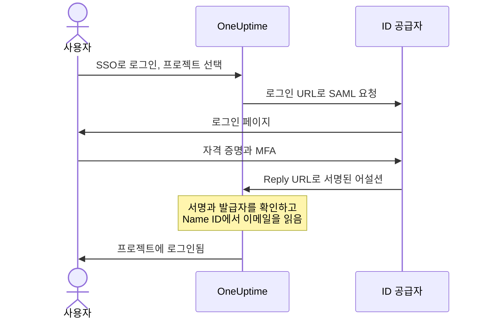

# SSO

SSO(Single Sign-On)를 사용하면 프로젝트 구성원이 조직의 ID 공급자(IdP)를 통해 SAML 2.0 또는 OpenID Connect로 OneUptime에 로그인할 수 있습니다. 액세스, 비밀번호, 다단계 인증을 한곳에서 관리하고, 프로젝트의 모든 사람에게 SSO를 필수로 지정할 수 있습니다.

> [!NOTE]
> **에디션:** "Require SSO for login"을 포함한 SSO는 모든 OneUptime 에디션에 포함됩니다. 자체 호스팅 설치에서는 Community Edition에서 라이선스 없이 사용할 수 있습니다. OneUptime Cloud에서는 **Scale** 플랜 이상에서 사용할 수 있습니다. 각 에디션에 포함된 기능은 [엔터프라이즈 에디션](/docs/self-hosted/enterprise)을 참고하세요.

:::cards
- [SAML 공급자 설정](#sso-설정): OneUptime에서 만들고 IdP에 URL 두 개를 넘겨줍니다.
- [ID 공급자별 가이드](#id-공급자별-가이드): Keycloak, Microsoft Entra ID, Okta를 단계별로 안내합니다.
- [OpenID Connect](#openid-connect-oidc): 대신 OIDC 앱으로 로그인합니다.
- [SSO 필수](#프로젝트에-sso-필수-지정): SSO를 프로젝트에 들어오는 유일한 방법으로 만듭니다.
:::

## SAML 로그인 작동 방식

SAML 공급자는 하나의 프로젝트를 ID 공급자의 애플리케이션 하나에 연결합니다. 로그인하는 사람은 OneUptime의 **SSO로 로그인** 페이지에서 프로젝트를 고르고, IdP에서 로그인한 뒤 로그인된 상태로 돌아옵니다.



OneUptime은 IdP가 보내는 어설션에서 몇 가지만 읽습니다.

| 어설션의 항목 | OneUptime이 하는 일 |
| --- | --- |
| 서명 | 공급자의 **공개 인증서**와 대조합니다. 응답은 서명되어 있어야 하며 암호화되어 있으면 안 됩니다. |
| Issuer | 공급자의 **발급자**와 정확히 일치해야 합니다. |
| Name ID | 그 사람의 이메일 주소입니다. 유효한 이메일 주소여야 합니다. |
| `http://schemas.microsoft.com/identity/claims/displayname` | 그 사람의 이름으로, OneUptime이 계정을 만들 때 사용합니다. 선택 사항입니다. |

처음 로그인하는 사람은 공급자의 **팀**에 합류하며, 이 팀이 그 사람이 할 수 있는 일을 결정합니다. [SSO 사용자의 역할과 팀](#sso-사용자의-역할과-팀)을 참고하세요.

> [!NOTE]
> OneUptime Cloud에서는 누군가가 프로젝트의 SAML 또는 OIDC 공급자로 그 프로젝트에 처음 로그인할 때, OneUptime이 바로 로그인시키는 대신 이메일로 링크를 보냅니다. 그 사람은 링크를 열어 프로젝트의 SSO(Single Sign-On)가 자신을 로그인시켜도 된다고 확인한 뒤 로그인을 계속합니다. 링크는 24시간 동안 유효합니다. 이 과정은 프로젝트마다 한 번 진행되며, 프로젝트를 떠났다가 돌아오면 다시 진행됩니다. 자체 호스팅 설치에서는 바로 로그인됩니다.

## SSO 설정

SSO 공급자를 추가할 권한(**Project Owner**, **Project Admin** 또는 **Create Project SSO**)이 필요하며, OneUptime Cloud에서는 **Scale** 플랜도 필요합니다. ID 공급자 쪽 설정은 [ID 공급자별 가이드](#id-공급자별-가이드)를 참고하세요.

:::steps
1. **프로젝트 설정으로 이동**

   - OneUptime 프로젝트로 이동합니다
   - **프로젝트 설정** > **보안** > **SSO**로 이동합니다

2. **SSO 구성 만들기**

   - **SSO 만들기**를 클릭합니다
   - SSO 구성의 **이름**을 입력합니다(예: "Keycloak SAML" 또는 "Okta SAML")
   - ID 공급자의 **로그인 URL**을 입력합니다
   - ID 공급자의 **발급자**(엔티티 ID)를 입력합니다
   - ID 공급자의 **공개 인증서**를 붙여 넣습니다
   - **로그인** 단계에서 **팀**은 프로젝트의 멤버 팀으로 시작합니다. 처음 로그인하는 사람은 이 팀에 합류합니다. 내가 다른 사람을 초대할 수 있는 팀만 허용됩니다. 내가 가진 것보다 더 많은 액세스 권한을 주는 팀은 **팀** 아래에 표시됩니다
   - 나머지는 **추가 필드**에 이미 채워져 있습니다. **서명 방법**(`RSA-SHA256`), **다이제스트 방법**(`SHA256`), 설명("Sign in with"와 이름)입니다. ID 공급자에서 필요한 경우에만 변경하세요

3. **OneUptime SSO 메타데이터 가져오기**
   - 저장하면 **SSO Configuration** 대화 상자가 열립니다. **SSO 구성 보기** 버튼으로 다시 열 수 있습니다
   - **Identifier (Entity ID)** 값을 복사합니다. 예를 들면 `https://oneuptime.com/<project-id>/<provider-id>`이며, IdP 구성에 필요합니다
   - **Reply URL (Assertion Consumer Service URL)** 값을 복사합니다. 예를 들면 `https://oneuptime.com/identity/idp-login/<project-id>/<provider-id>`이며, IdP 구성에 필요합니다
   - 새 공급자는 꺼진 상태로 시작합니다. IdP에 이 두 값을 등록한 후 공급자를 편집하여 **활성화됨**을 켜세요

4. **공급자 테스트**
   - **Test Single Sign On (SSO)** 카드의 링크를 열고, 열리는 페이지에서 공급자를 고릅니다. ID 공급자의 로그인 페이지로 이동했다가 로그인된 상태로 OneUptime에 돌아옵니다
   - 제대로 작동하면 프로젝트에 [SSO를 필수로 지정](#프로젝트에-sso-필수-지정)할 수 있습니다
:::

## ID 공급자별 가이드

사용하는 ID 공급자를 고르세요. 각 가이드는 IdP의 값을 가져와 OneUptime에서 공급자를 만든 다음, OneUptime의 **Identifier (Entity ID)** 값과 **Reply URL** 값을 IdP에 넘겨줍니다.

:::tabs
@tab Keycloak
Keycloak은 널리 쓰이는 오픈 소스 ID 및 액세스 관리 솔루션입니다. 렐름이 있는 실행 중인 Keycloak 인스턴스와 Keycloak, OneUptime 모두에 대한 관리자 액세스가 필요합니다.

:::steps
1. **렐름의 값 모으기**

   - **로그인 URL**: `https://<your-keycloak-domain>/auth/realms/<your-realm>/protocol/saml`
   - **발급자**: `https://<your-keycloak-domain>/auth/realms/<your-realm>`
   - **인증서**: 렐름의 서명 인증서입니다. `https://<your-keycloak-domain>/auth/realms/<your-realm>/protocol/saml/descriptor`를 열어 `X509Certificate` 값을 복사하거나, **Realm settings** > **Keys**를 열고 RS256 키의 **Certificate**를 클릭합니다

   Keycloak 17 이상에서는 이 URL에 `/auth` 접두사가 없습니다. 인증서는 다음과 같이 전용 줄 사이에 넣습니다.

   ```text
   -----BEGIN CERTIFICATE-----
   MIICnzCCAYcCBgFyPZ8QFzANBgkqhkiG.......
   -----END CERTIFICATE-----
   ```

2. **OneUptime에서 공급자 만들기**

   **프로젝트 설정** > **보안** > **SSO**로 이동하여 **SSO 만들기**를 클릭하고 다음을 입력합니다.
   - **이름**: 알아보기 쉬운 이름(예: `my-project-oneuptime`)
   - **로그인 URL**과 **발급자**: 위의 값
   - **공개 인증서**: 전용 `BEGIN CERTIFICATE` 줄과 `END CERTIFICATE` 줄 사이에 넣은 인증서
   - **서명 방법**과 **다이제스트 방법**: **추가 필드**에 이미 설정되어 있습니다(`RSA-SHA256`과 `SHA256`)

   저장한 다음, 열리는 대화 상자에서 **Identifier (Entity ID)** 값과 **Reply URL (Assertion Consumer Service URL)** 값을 복사합니다.

3. **Keycloak 클라이언트 만들기**

   Keycloak에서 렐름의 **Clients**를 열고 클라이언트를 만들거나 기존 클라이언트를 편집합니다.
   - **Client Protocol**(클라이언트 유형): `saml`
   - **Client ID**: OneUptime의 **Identifier (Entity ID)** 값
   - **Root URL**과 **Valid Redirect URIs**: OneUptime URL
   - **Assertion Consumer Service POST Binding URL**: OneUptime의 **Reply URL (Assertion Consumer Service URL)** 값

4. **클라이언트 설정 조정**

   - **Name ID Format**을 `email`로 설정하고 **Force Name ID Format**을 켜서 Keycloak이 항상 이메일을 Name ID로 보내도록 합니다
   - 클라이언트의 **Keys** 탭에서 **Client signature required**(**Signing keys config** 안)를 끕니다. OneUptime은 요청에 서명하지 않습니다

5. **공급자를 켜고 테스트**

   OneUptime에서 공급자를 편집하여 **활성화됨**을 켠 다음, **Test Single Sign On (SSO)** 카드의 링크를 열고 공급자를 고릅니다. Keycloak 로그인 페이지로 이동했다가 OneUptime으로 돌아와야 합니다.
:::
@tab Microsoft Entra ID
Microsoft Entra ID(이전 이름 Azure AD / Active Directory)는 Microsoft의 클라우드 ID 서비스입니다. SAML SSO를 사용하는 엔터프라이즈 애플리케이션을 지원하는 테넌트와 Entra ID, OneUptime 모두에 대한 관리자 액세스가 필요합니다.

:::steps
1. **Entra ID에서 엔터프라이즈 애플리케이션 만들기**

   - [Microsoft Entra admin center](https://entra.microsoft.com)에 로그인합니다
   - **Identity** > **Applications** > **Enterprise applications**로 이동하여 **+ New application**을 클릭한 다음 **+ Create your own application**을 클릭합니다
   - 이름(예: "OneUptime")을 입력하고 **Integrate any other application you don't find in the gallery (Non-gallery)** 옵션을 선택한 다음 **Create**를 클릭합니다

2. **Entra ID의 SAML 값 복사**

   - 애플리케이션에서 **Single sign-on**으로 이동하여 **SAML**을 선택합니다
   - **SAML Certificates**에서 **Certificate (Base64)** 파일을 다운로드하고, 텍스트 편집기로 열어 내용을 복사합니다
   - **Set up OneUptime**에서 **Login URL**과 **Microsoft Entra Identifier**(이전 테넌트에서는 **Azure AD Identifier**)를 복사합니다

3. **OneUptime에서 공급자 만들기**

   **프로젝트 설정** > **보안** > **SSO**로 이동하여 **SSO 만들기**를 클릭하고 다음을 입력합니다.
   - **이름**: 알아보기 쉬운 이름(예: `Azure AD SAML`)
   - **로그인 URL**: **Login URL**
   - **발급자**: **Microsoft Entra Identifier**
   - **공개 인증서**: `BEGIN CERTIFICATE` 줄과 `END CERTIFICATE` 줄을 포함한 Base64 인증서
   - **서명 방법**과 **다이제스트 방법**: **추가 필드**에 이미 설정되어 있습니다(`RSA-SHA256`과 `SHA256`)

   저장한 다음, 열리는 대화 상자에서 **Identifier (Entity ID)** 값과 **Reply URL (Assertion Consumer Service URL)** 값을 복사합니다.

4. **Entra ID에 OneUptime의 URL 넘겨주기**

   **Basic SAML Configuration**에서 **Edit**를 클릭하고 다음을 설정합니다.
   - **Identifier (Entity ID)**: OneUptime의 **Identifier (Entity ID)** 값
   - **Reply URL (Assertion Consumer Service URL)**: OneUptime의 **Reply URL** 값

   **Save**를 클릭합니다.

5. **이메일을 Name ID로 보내기**

   **Attributes & Claims**에서 **Edit**를 클릭합니다.
   - **Unique User Identifier (Name ID)** 항목을 사용자의 이메일 주소로 설정합니다. `user.mail`이나, 이메일 주소인 경우 `user.userprincipalname`을 사용합니다
   - **Name identifier format**을 `Email address`로 설정합니다
   - 선택적으로, 이름이 `http://schemas.microsoft.com/identity/claims/displayname`이고 원본 특성이 `user.displayname`인 클레임을 추가하면 새 계정에 그 사람의 이름이 들어갑니다. OneUptime은 다른 클레임을 무시합니다

6. **사용자와 그룹 할당**

   애플리케이션의 **Users and groups**에서 **+ Add user/group**을 클릭하고, SSO 액세스를 줄 사용자와 그룹을 선택한 다음 **Assign**을 클릭합니다.

7. **공급자를 켜고 테스트**

   OneUptime에서 공급자를 편집하여 **활성화됨**을 켠 다음, **Test Single Sign On (SSO)** 카드의 링크를 열고 공급자를 고릅니다. Microsoft 로그인 페이지로 이동했다가 OneUptime으로 돌아와야 합니다.
:::
@tab Okta
Okta는 SAML SSO를 지원하는 널리 쓰이는 ID 플랫폼입니다. 관리자 액세스가 있는 Okta 조직과 OneUptime에 대한 관리자 액세스가 필요합니다.

:::steps
1. **Okta에서 SAML 애플리케이션 만들기**

   - Okta Admin Console에서 **Applications** > **Applications**로 이동하여 **Create App Integration**을 클릭합니다
   - **SAML 2.0**을 선택하고 **Next**를 클릭한 다음, **App name**에 "OneUptime"을 입력하고 **Next**를 클릭합니다
   - Okta는 자신의 URL을 보여 주기 전에 OneUptime의 URL을 묻습니다. 우선 OneUptime 주소(예: `https://oneuptime.com`)를 **Single sign-on URL** 필드와 **Audience URI (SP Entity ID)** 필드에 입력하세요. 두 값 모두 4단계에서 바꿉니다
   - **Name ID format**을 `EmailAddress`로, **Application username**을 `Email`로 설정합니다
   - **Next**를 클릭하고 **I'm an Okta customer adding an internal app**을 선택한 다음 **Finish**를 클릭합니다

2. **Okta의 SAML 값 복사**

   애플리케이션의 **Sign On** 탭에 있는 **SAML Signing Certificates**에서 활성 인증서를 찾습니다.
   - **Actions** > **View IdP metadata**를 클릭하고 **로그인 URL**(Identity Provider Single Sign-On URL)과 **발급자**(Identity Provider Issuer)를 복사합니다
   - **Actions** > **Download certificate**를 클릭하고 `.cert` 파일을 텍스트 편집기로 열어 내용을 복사합니다

3. **OneUptime에서 공급자 만들기**

   **프로젝트 설정** > **보안** > **SSO**로 이동하여 **SSO 만들기**를 클릭하고 다음을 입력합니다.
   - **이름**: 알아보기 쉬운 이름(예: `Okta SAML`)
   - **로그인 URL**과 **발급자**: Okta의 값
   - **공개 인증서**: `BEGIN CERTIFICATE` 줄과 `END CERTIFICATE` 줄을 포함한 인증서
   - **서명 방법**과 **다이제스트 방법**: **추가 필드**에 이미 설정되어 있습니다(`RSA-SHA256`과 `SHA256`)

   저장한 다음, 열리는 대화 상자에서 **Identifier (Entity ID)** 값과 **Reply URL (Assertion Consumer Service URL)** 값을 복사합니다.

4. **Okta에 OneUptime의 URL 넘겨주기**

   애플리케이션의 **General** 탭에서 **SAML Settings**의 **Edit**와 **Next**를 클릭한 다음 다음을 설정합니다.
   - **Single sign-on URL**: OneUptime의 **Reply URL (Assertion Consumer Service URL)** 값
   - **Audience URI (SP Entity ID)**: OneUptime의 **Identifier (Entity ID)** 값

   선택적으로, 이름이 `http://schemas.microsoft.com/identity/claims/displayname`이고 값이 `user.firstName + " " + user.lastName`인 attribute statement를 추가하면 새 계정에 그 사람의 이름이 들어갑니다. **Next**를 클릭한 다음 **Finish**를 클릭합니다.

5. **사람 할당**

   **Assignments** 탭에서 **Assign** > **Assign to People** 또는 **Assign to Groups**를 클릭하고, SSO 액세스를 줄 사람을 선택하여 각각 **Assign**을 클릭한 다음 **Done**을 클릭합니다.

6. **공급자를 켜고 테스트**

   OneUptime에서 공급자를 편집하여 **활성화됨**을 켠 다음, **Test Single Sign On (SSO)** 카드의 링크를 열고 공급자를 고릅니다. Okta 로그인 페이지로 이동했다가 OneUptime으로 돌아와야 합니다.
:::
@tab 기타
OneUptime의 SSO는 SAML 2.0을 사용하며 규격을 준수하는 모든 ID 공급자와 함께 작동합니다.

:::steps
1. ID 공급자의 **로그인 URL**(SSO 엔드포인트), **발급자**(엔티티 ID), **공개 인증서**(X.509 서명 인증서)를 가져옵니다. 애플리케이션을 만들어야만 IdP가 이 값을 보여 준다면, OneUptime 주소를 임시 URL로 사용해 애플리케이션을 만드세요.
2. OneUptime에서 이 값으로 공급자를 만들고, **SSO Configuration** 대화 상자(또는 **SSO 구성 보기**)에서 **Identifier (Entity ID)** 값과 **Reply URL (Assertion Consumer Service URL)** 값을 복사합니다.
3. ID 공급자의 SAML 애플리케이션에서 **Assertion Consumer Service URL / Reply URL**과 **Entity ID / Audience URI**를 OneUptime의 값으로, **Name ID Format**을 이메일 주소로 설정합니다.
4. **서명 방법**(`RSA-SHA256`)과 **다이제스트 방법**(`SHA256`)은 **추가 필드**에 이미 설정되어 있습니다. ID 공급자가 다른 방식으로 서명하는 경우에만 변경하세요
5. 공급자의 **활성화됨**을 켜고 **Test Single Sign On (SSO)** 카드의 링크로 테스트합니다.
:::
:::

## OpenID Connect (OIDC)

프로젝트는 Google Workspace, Okta, Microsoft Entra ID, Auth0, Keycloak 같은 OpenID Connect 공급자로도 로그인할 수 있습니다. OIDC 공급자를 추가할 권한(**Project Owner**, **Project Admin** 또는 **Create Project OIDC**)이 필요하며, OneUptime Cloud에서는 **Scale** 플랜도 필요합니다.

:::steps
1. ID 공급자에 PKCE를 사용하는 인증 코드 흐름을 쓸 수 있는 앱(OIDC 클라이언트)을 등록하고, 그 앱의 **발급자 URL**, **클라이언트 ID**, **클라이언트 시크릿**을 복사합니다.
2. OneUptime에서 **프로젝트 설정** > **보안** > **OIDC**로 이동하여 **OIDC 만들기**를 클릭합니다.
3. **이름**(로그인 페이지에 표시되는 이름), **발급자 URL**, **클라이언트 ID**, **클라이언트 시크릿**을 입력합니다. **발급자 URL**에 공급자의 검색 URL을 붙여 넣어도 됩니다.
4. **로그인** 단계에서 **팀**은 프로젝트의 멤버 팀으로 시작합니다. 처음 로그인하는 사람은 이 팀에 합류합니다. 나머지는 **추가 필드**에 이미 채워져 있습니다. **검색 URL**(발급자 뒤에 `/.well-known/openid-configuration`을 붙인 값), **범위**(`openid email profile`), `email`과 `name` 클레임 이름, 설명("Sign in with"와 이름)입니다. 공급자에서 필요한 경우에만 변경하세요. 내가 다른 사람을 초대할 수 있는 팀만 허용됩니다. 내가 가진 것보다 더 많은 액세스 권한을 주는 팀은 **팀** 아래에 표시됩니다.
5. 저장합니다. **OIDC Configuration** 대화 상자가 열리고 **Redirect URI**가 표시됩니다. 이 값을 앱의 허용된 리디렉션 URI에 추가하세요. 새 공급자는 꺼진 상태로 시작하므로, 그다음 공급자를 편집하여 **활성화됨**을 켭니다.
6. 프로젝트에 SSO를 필수로 지정하기 전에 **Test OpenID Connect (OIDC)** 카드의 링크로 공급자를 통해 로그인해 보세요.
:::

## SSO 사용자의 역할과 팀

OneUptime은 ID 공급자의 역할이나 그룹을 가져오지 않습니다. 사람이 할 수 있는 일은 그 사람이 속한 팀에서 결정됩니다. 공급자는 새로 온 사람을 자신의 **팀**에 추가하고, 팀과 그 권한은 [사용자, 팀 및 권한](/docs/permissions/index)에서 설명하는 대로 OneUptime에서 관리합니다. 팀 멤버 구성을 ID 공급자와 맞춰 두려면 [SCIM](/docs/identity/scim)을 사용하세요.

공급자의 팀이 그 공급자로 로그인하는 사람이 할 수 있는 일을 결정하므로, 공급자는 저장하는 사람이 다른 사람을 초대할 수 있는 팀으로만 저장할 수 있습니다. 저장할 때마다 팀을 다시 확인합니다. 내가 가진 것보다 더 많은 액세스 권한을 주는 팀이 있는 공급자는 프로젝트 소유자처럼 그 팀을 포괄하는 액세스 권한을 가진 사람만 변경할 수 있습니다. 이 확인이 도입되기 전에 저장된 공급자는 계속 사람들을 자신의 팀으로 로그인시킵니다. 공급자를 편집할 수 있는 사람은 누구나 여전히 공급자를 끌 수 있으므로 즉시 멈출 수 있습니다.

## 프로젝트에 SSO 필수 지정

공급자를 설정해도 비밀번호로 로그인하는 것을 막지는 않습니다. SSO를 프로젝트에 들어오는 유일한 방법으로 만들려면 **프로젝트 설정** > **보안** > **SSO**의 공급자 아래에 있는 **로그인에 SSO 필수** 스위치를 사용하세요.

:::steps
1. 먼저 **Test Single Sign On (SSO)** 카드의 링크로 공급자를 테스트합니다.
2. **로그인에 SSO 필수**를 켭니다. OneUptime은 저장하기 전에 확인을 요청합니다. 이후로는 나를 포함한 프로젝트의 모든 사람이 프로젝트를 열려면 SSO로 로그인해야 하며, 비밀번호로 로그인한 사람은 SSO로 로그인할 때까지 프로젝트에서 차단됩니다.
3. **SSO 필수로 설정**을 클릭하여 확인합니다. 스위치는 바로 저장되며, 별도의 저장 버튼은 없습니다.
:::

**로그인에 SSO 필수**를 켜려면 프로젝트에 사람을 로그인시키는 공급자가 있어야 합니다. 켜져 있는 프로젝트 자체의 SAML 또는 OIDC 공급자이거나, 켜져 있고 그 프로젝트에 사람을 로그인시키는 글로벌 공급자입니다. 그런 공급자가 없으면 OneUptime은 거부하고, 먼저 프로젝트의 공급자를 켜고 테스트하라고 안내합니다. 프로젝트가 필수로 지정할 공급자를 고른다면 그중 하나여야 하며, 나중에 다른 공급자를 필수로 지정할 때도 같은 확인을 거칩니다.

이미 켜져 있는 **로그인에 SSO 필수**를 켜진 상태로 보내는 저장이나, 프로젝트가 이미 필수로 지정한 공급자를 지정하는 저장도 같은 방식으로 확인됩니다. API, Terraform 등의 도구는 저장할 때마다 모든 설정을 보내는 경우가 많기 때문입니다. 따라서 프로젝트에 사람을 로그인시키는 공급자가 없거나 필수 공급자가 그 뒤에 꺼졌다면, 그런 저장은 다른 무엇을 변경하든 같은 문구로 거부됩니다. 먼저 공급자를 켜거나, 다른 공급자를 필수로 지정하거나, **로그인에 SSO 필수**를 끄세요.

새 프로젝트에도 같은 규칙이 적용됩니다. 새 프로젝트에는 아직 자체 공급자가 없으므로, **로그인에 SSO 필수**를 켠 상태로 만들려면(마스터 관리자만 가능) 켜져 있고 모든 프로젝트에 사람을 로그인시키는 글로벌 공급자가 필요하며, 없으면 같은 문구로 거부됩니다. 프로젝트를 만들고, 그 공급자를 설정하고 테스트한 다음 스위치를 켜세요.

서버 전체에서 SSO가 필수인 동안(**Admin** > **설정** > **인증** > **로그인에 SSO 필수**)에는 어떤 프로젝트를 만들 때도 그런 글로벌 공급자가 필요합니다. 그렇지 않으면 만든 사람을 포함해 아무도 프로젝트를 열 수 없기 때문입니다. 없으면 프로젝트 생성이 거부되고, 메시지는 서버 관리자에게 공급자를 켜 달라고 요청합니다. 마스터 관리자는 계속 프로젝트를 만들 수 있습니다.

**로그인에 SSO 필수**를 끄면 스위치를 바꾸는 즉시 저장되고 멤버가 바로 비밀번호로 다시 들어올 수 있습니다. 단, 바로 그 순간에 누군가가 다시 켜면 앱 서버가 따라오는 데 최대 1분이 걸릴 수 있습니다. 프로젝트 소유자, 프로젝트 관리자, **Edit Project** 권한이 있는 멤버가 변경할 수 있습니다. 그 밖의 사람에게는 스위치가 잠긴 상태로 필요한 권한과 함께 표시됩니다.

> [!NOTE]
> OneUptime Cloud에서 SSO를 필수로 지정하려면 **Scale** 플랜이 필요하지만, 끄는 것은 모든 플랜에서 할 수 있습니다. Scale 미만에서는 **프로젝트 설정** > **보안** > **SSO**에 플랜 업그레이드 안내가 표시됩니다. Scale 체험 기간이 끝나 SSO가 필수인 채로 남은 프로젝트에서는 끌 수 있도록 안내 아래에 **로그인에 SSO 필수**도 표시됩니다. 다시 켜려면 **Scale**이 필요합니다.

## 공급자 끄기 또는 삭제

| 변경 내용 | 그 공급자로 로그인한 사람 |
| --- | --- |
| 끄거나 삭제 | SSO가 필수인 곳에서는 다음 요청 때 SSO로 다시 로그인 |
| 새 인증서나 클라이언트 시크릿, 다른 URL, 새 이름 또는 다른 팀 | 로그인 상태 유지 |
| 켜기 | 바로 그 공급자로 로그인 가능 |

SAML 또는 OIDC 공급자를 끄거나 삭제하면 그 공급자로 이루어진 로그인이 끝납니다. 프로젝트 자체가 SSO를 필수로 지정했거나 서버 전체가 필수로 지정해서 SSO가 필수인 프로젝트에서는 다음과 같습니다.

- 그 공급자로 로그인한 사람은 모두 다음 요청 때 SSO로 다시 로그인해야 하며, 열어 둔 페이지는 즉시 실시간 업데이트를 받지 않게 됩니다.
- 누군가가 그 공급자로 로그인한 뒤 연결한 MCP 클라이언트는 그 프로젝트에서 작동하지 않게 됩니다. SSO로 로그인한 뒤 다시 연결하세요.
- 공급자를 다시 켜도 그 로그인은 돌아오지 않습니다. 그 공급자로 다시 로그인해야 합니다.

공급자의 다른 부분을 변경하면 모두 로그인 상태가 유지됩니다. 새 인증서나 클라이언트 시크릿, 다른 URL, 새 이름 또는 다른 팀이 그렇습니다. 로그인은 이루어질 때 확인되었으며, 다음 로그인부터 새 설정이 사용됩니다.

프로젝트에서 SSO가 필수인 동안 OneUptime은 들어올 길을 남겨 둡니다. 사람이 프로젝트에 로그인할 수 있는 마지막 공급자(그 프로젝트에 사람을 로그인시키는 글로벌 공급자 포함)나 프로젝트가 필수로 지정한 공급자는 끄거나 삭제할 수 없습니다. 먼저 **로그인에 SSO 필수**를 끄세요.

공급자를 켜면 바로 그 공급자로 로그인할 수 있습니다.

서버 전체에서 SSO가 필수일 때(**Admin** > **설정** > **인증** > **로그인에 SSO 필수**)는 프로젝트 자체가 SSO를 필수로 지정하지 않았더라도 모든 프로젝트가 같은 방식으로 들어올 길을 유지합니다. 먼저 그 프로젝트의 다른 공급자를 켜세요.

글로벌 공급자에도 같은 규칙이 적용됩니다. 글로벌 공급자나 그 공급자에 연결된 프로젝트를 변경해 SSO가 필수인 프로젝트에 공급자가 하나도 남지 않게 된다면, 그 변경은 프로젝트를 명시하며 거부됩니다. [글로벌 SSO](/docs/identity/global-sso#공급자-끄기-또는-삭제)를 참고하세요.

프로젝트도 서버도 SSO를 필수로 지정하지 않은 곳에서는 공급자를 끄면 그 공급자로 새로 로그인하는 것만 멈춥니다. 이미 로그인한 사람은 비밀번호로 로그인한 사람과 마찬가지로 로그인 상태가 유지됩니다.

## Scale 플랜 미만에 남은 공급자

프로젝트에 남아 있는 SAML 또는 OIDC 공급자는 Scale 체험 기간이 끝나거나 플랜이 낮아진 뒤에도 계속 사람을 로그인시킵니다. 그래서 Scale 미만에서는 **SSO** 페이지와 **OIDC** 페이지의 업그레이드 안내 아래에 프로젝트의 공급자가 나열됩니다(**아직 설정되어 있는 SAML 공급자**, **아직 설정되어 있는 OIDC 공급자**).

- **끄기**는 공급자를 즉시 멈춥니다. OneUptime이 먼저 확인을 요청합니다.
- **삭제**는 공급자를 삭제합니다.

공급자를 추가하거나 변경하거나 다시 켜려면 **Scale**이 필요합니다. 각 작업을 할 수 있는 사람은 Scale에서와 같습니다. 공급자를 끄려면 편집 권한이, 삭제하려면 삭제 권한이 필요합니다.

프로젝트에서 아직 SSO가 필수인 동안에는 **SSO** 페이지와 **OIDC** 페이지에 **로그인에 SSO 필수**도 표시됩니다. 마지막 공급자를 끄기 전에 이것을 끄세요. 그때까지는 사람이 로그인할 수 있는 마지막 공급자를 끄거나 삭제할 수 없으므로, 아무도 프로젝트에서 차단되지 않습니다.

상태 페이지의 **SSO** 페이지와 **OIDC** 페이지도 같은 방식으로 상태 페이지 자체의 공급자를 나열합니다. 상태 페이지에서 아직 SSO가 필수인 동안에는 두 페이지 모두 **로그인에 SSO 필수**도 표시합니다. 공급자를 끄기 전에 이것을 끄세요. 그렇지 않으면 상태 페이지의 비공개 사용자가 아예 로그인할 수 없습니다.

## 문제 해결

:::details "SSO Config not found"
공급자가 꺼져 있거나, 링크가 더 이상 존재하지 않는 공급자를 가리킵니다. 새 공급자는 꺼진 상태로 시작합니다. 공급자를 편집하여 **활성화됨**을 켜세요.
:::

:::details "No teams added."
그 사람은 아직 프로젝트에 속해 있지 않고, 공급자에는 그 사람을 추가할 **팀**이 없습니다. 공급자를 편집하여 프로젝트의 멤버 팀 같은 팀을 하나 이상 고르세요.
:::

:::details "Issuer URL does not match"
IdP 어설션의 발급자가 공급자의 **발급자**와 다릅니다. IdP에서 다시 복사하세요(Keycloak 렐름 URL, **Microsoft Entra Identifier** 또는 Okta의 Identity Provider Issuer). 두 값이 정확히 일치해야 합니다.
:::

:::details 서명 또는 인증서 오류로 로그인에 실패함
IdP의 현재 서명 인증서를 `BEGIN CERTIFICATE` 줄과 `END CERTIFICATE` 줄을 포함해 **공개 인증서**에 붙여 넣으세요. Entra ID에서는 원시 인증서가 아니라 **Base64** 인증서를, Okta에서는 활성 서명 인증서를, Keycloak에서는 올바른 렐름의 인증서를 내려받습니다.
:::

:::details "Encrypted SAML Responses are not supported"
OneUptime은 어설션을 복호화하지 않습니다. IdP에서 애플리케이션의 어설션 암호화를 꺼서, 암호화되지 않은 서명된 어설션을 보내도록 하세요.
:::

:::details "SAML response did not include a valid email address"
OneUptime은 Name ID에서 이메일 주소를 읽습니다. Name ID를 사용자의 이메일로 설정하세요. Keycloak에서는 **Name ID Format** `email`과 **Force Name ID Format**, Entra ID에서는 **Unique User Identifier (Name ID)** 항목, Okta에서는 **Name ID format** `EmailAddress`와 **Application username** `Email`입니다. 주소는 그 사람의 OneUptime 계정과 일치해야 합니다.
:::

:::details Entra ID: AADSTS700016
Entra ID의 **Identifier (Entity ID)** 값이 OneUptime의 값과 일치하지 않습니다. **SSO 구성 보기**에서 다시 복사하세요. 두 값은 동일해야 합니다.
:::

:::details Okta: 404 또는 audience 불일치
Okta의 **Single sign-on URL**은 OneUptime의 **Reply URL**과, **Audience URI**는 OneUptime의 **Identifier (Entity ID)** 값과 정확히 같아야 합니다. 두 값 모두 임시 값을 대체했는지 확인하세요.
:::

:::details 사용자가 애플리케이션에 할당되지 않음
Entra ID와 Okta는 애플리케이션에 할당된 사람만 로그인시킵니다. 사용자나 그 사용자가 속한 그룹을 할당하세요.
:::

:::details Keycloak: 리디렉션 루프
올바른 렐름의 클라이언트에서 **Valid Redirect URIs**와 **Assertion Consumer Service POST Binding URL**이 위와 같이 설정되어 있는지 확인하세요.
:::

## 다음 단계

:::cards
- [글로벌 SSO](/docs/identity/global-sso): 자체 호스팅 인스턴스의 모든 프로젝트에 하나의 ID 공급자를 사용합니다.
- [SCIM](/docs/identity/scim): ID 공급자가 사람을 자동으로 추가하고 제거하게 합니다.
- [사용자, 팀 및 권한](/docs/permissions/index): 새로 온 사람이 합류하는 팀으로 할 수 있는 일을 알아봅니다.
:::
