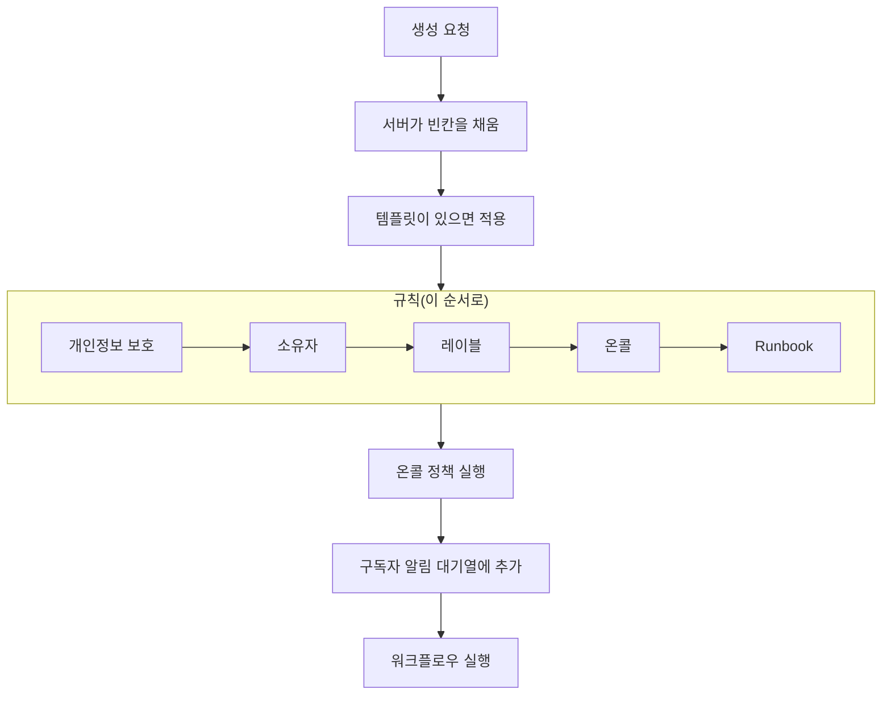
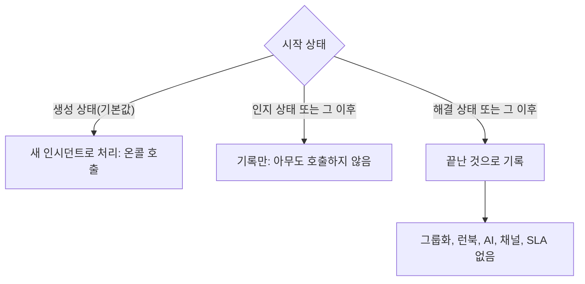

# 인시던트 선언

인시던트를 선언하면 팀이 중심에 두고 일할 기록이 만들어집니다. 번호, 심각도, 시작 상태가 붙고, 온콜 정책이 사람을 호출하며, 따로 지정하지 않는 한 상태 페이지 구독자에게도 알려집니다. 이 페이지에서는 인시던트를 선언하는 다섯 가지 방법을 항목별로 살펴보고, 인시던트가 생기는 순간 무슨 일이 일어나는지 설명합니다.

:::cards
- [직접 선언하기](#직접-선언하기): 세 단계 양식을 항목별로.
- [템플릿에서 선언하기](#템플릿에서-선언하기): 같은 종류의 인시던트를 매번 미리 채운 상태로.
- [모니터 기준에서 선언하기](#모니터-기준에서-자동으로-선언하기): 실패한 검사가 대신 열게 합니다.
- [API로 선언하기](#api로-선언하기): 직접 만든 코드, 스크립트, 다른 도구에서.
:::

## 인시던트가 선언되는 다섯 가지 방법

인시던트가 OneUptime에 들어오는 방법은 다섯 가지이며, 모두 같은 곳에 도착합니다. 심각도, 현재 상태, 영향받는 리소스 목록을 가진 `Incident` 테이블의 한 행입니다. 차이는 누가 항목을 채우느냐뿐입니다. 새벽 3시의 여러분, 저장된 템플릿, 모니터의 기준, API를 호출하는 여러분의 코드, 또는 양식을 작성하는 팀 외부의 누군가입니다.

| 하고 싶은 일                                                 | 고를 것                                                                     |
| ------------------------------------------------------------ | --------------------------------------------------------------------------- |
| 모든 것을 직접 입력해 인시던트를 열기                        | **인시던트 선언** 마법사                                                    |
| 반복되는 종류의 인시던트를 항목이 채워진 상태로 열기         | **템플릿에서 생성**                                                         |
| 모니터의 검사가 실패할 때 자동으로 열기                      | **필터가 일치하면 인시던트를 선언합니다.**를 켠 모니터 기준 필터            |
| 직접 만든 코드, 스크립트, 다른 도구에서 열기                 | `POST /api/incident`                                                        |
| 팀 외부 사람이 링크로 문제를 보고하게 하기                   | [양식](/docs/forms/index)                                                   |

다섯 가지 모두 같은 모델에 쓰기 때문에, 프로브가 연 인시던트는 대응자가 직접 연 것과 똑같아 보입니다. 다른 점은 자동으로 만든 인시던트에 서버가 설정하는 몇 가지 관리용 열뿐입니다. 통합 기능도 같은 모델에 씁니다. [Huntress](/docs/integrations/huntress)는 SOC가 보내는 인시던트 보고서마다 인시던트를 하나 엽니다.

> [!TIP]
> 알림에서 인시던트를 선언할 수도 있습니다. 알림 목록, 알림의 헤더, 또는 알림의 **연결된 인시던트** 페이지에서 **인시던트 선언**을 사용하면 알림 내용으로 채워진 같은 마법사가 열리고, 알림이 새 인시던트에 연결됩니다. 양식에 있는 기본적으로 선택된 확인란은 알림을 인지하기도 하므로 에스컬레이션이 멈춥니다. [연결된 알림](/docs/incidents/linked-alerts)을 참고하세요.

## 직접 선언하기

**새 인시던트 선언** 양식은 **인시던트 세부 정보**, **영향받는 리소스**, **온콜 및 역할**의 세 단계로 인시던트를 묻고, 마지막에 검토할 요약을 보여 줍니다. 프로젝트가 생성 시 일부 인시던트 사용자 정의 필드를 묻도록 되어 있다면, **영향받는 리소스** 바로 다음에 네 번째 단계인 **세부 정보**가 옵니다.

:::steps
1. **인시던트 → 모든 인시던트**를 열고 **인시던트** 목록 오른쪽 위의 **인시던트 선언**을 클릭합니다. 양식은 **인시던트 세부 정보**에서 시작합니다.
2. **제목**을 입력하고 **인시던트 심각도**를 고릅니다. 양식의 나머지는 선택 사항입니다.
3. **다음**을 클릭해 남은 단계를 진행하면서 지금 아는 것(모니터와 기타 리소스, 온콜 정책, 역할)을 채웁니다.
4. 요약을 읽고 **인시던트 선언**을 클릭합니다. 새 인시던트가 열리고, 그 **인시던트 피드**가 기록을 시작합니다.
:::

필수 항목이 있는 단계는 첫 단계뿐이며, 관리자가 **생성 시 필수**로 표시한 사용자 정의 필드가 있으면 **세부 정보** 단계에서 묻습니다. 요약 이전의 모든 단계에는 평범한 **다음**이 있고, **인시던트 선언**은 마지막 단계인 요약에 있습니다. 급할 때는 **인시던트 세부 정보**를 채우고 나머지 단계는 아무것도 입력하지 않은 채 **다음**으로 넘기면 됩니다. 리소스 연결, 온콜 정책 추가, 역할 할당은 인시던트 자체의 페이지에서 나중에 해도 됩니다. 항목에서 **Enter**를 눌러도 다음으로 넘어가지만, 요약 이전에 선언되는 일은 없습니다.

> [!TIP]
> 대부분의 인시던트에 필요 없는 옵션은 각 단계 끝의 **추가 필드** 머리글 아래에 접혀 있습니다. 클릭하면 열립니다. 접혀 있는 동안 머리글에는 안에 있는 것의 이름과, 설정된 각 옵션과 그 값이 표시됩니다(예를 들어 템플릿이나, 선언의 출발점인 비공개 알림이 설정한 것). 안의 무언가를 고쳐야 할 때는 저절로 열립니다. 요약에 이런 옵션이 나오는 것은 설정되었을 때뿐이지만, **상태 페이지 구독자에게 알림**만은 예외로, 누구에게 알릴지와 함께 항상 나옵니다.

**리소스 자체의 페이지에서.** 모니터, 호스트, 서비스, 클러스터 등 대부분의 리소스의 **인시던트** 탭에서 **인시던트 선언**을 사용하면, 그 리소스가 **영향받는 리소스**에서 이미 선택된 채로 같은 양식이 열립니다. 제목과 심각도만 입력하면 되고, 인시던트는 시작한 탭에 표시됩니다.

:::details 어떤 리소스 페이지에서 쓸 수 있고, 무엇이 선택되는지
모니터, 호스트, Kubernetes·Proxmox·Ceph·Docker Swarm 클러스터, Docker 또는 Podman 호스트, vCenter, 스토리지 어레이, IoT 플릿, 데이터베이스, 서비스의 **인시던트** 탭에서 **인시던트 선언**을 사용하면, 그 리소스가 **영향받는 리소스**에서 이미 선택된 채로 같은 마법사가 열립니다(모니터는 **모니터**에, 그 밖의 것은 **기타 영향받는 리소스**에). 템플릿이 추가하는 것보다 먼저 들어갑니다. 그 탭의 **템플릿에서 생성**도 리소스를 유지합니다. 이동 경로는 리소스의 탭을 거쳐 돌아가며, 선언하면 인시던트 목록에서 선언할 때처럼 새 인시던트가 열립니다.

인벤토리 항목의 **인시던트** 탭은 항목이 가리키는 호스트, 서비스 또는 Kubernetes 클러스터를 선택하며, 이동 경로는 그 리소스의 탭을 거쳐 돌아갑니다. 리소스의 **알림** 탭에 있는 **알림 생성**도 같은 방식으로 동작합니다. 모니터에서는 알림의 **모니터**를, 그 밖의 것에서는 **기타 영향받는 리소스**를 채웁니다.

리소스는 여러분 자신의 권한으로 조회됩니다. 읽을 수 없거나 삭제된 경우, 양식은 아무것도 선택되지 않은 채 열릴 뿐입니다.
:::

### 1단계 — 인시던트 세부 정보

- **제목** — 필수. 목록, Slack, 그리고 (인시던트가 표시된다면) 상태 페이지에서 모두가 보게 될 한 줄 요약입니다. 자리 표시자는 `Incident Title`입니다.
- **인시던트 심각도** — 필수. 프로젝트에 설정된 심각도 중 하나입니다. 새 프로젝트에는 **Critical Incident**, **Major Incident**, **Minor Incident**가 만들어져 있습니다.
- **설명** — 선택 사항이며 Markdown으로 씁니다. 상태 페이지에 표시되는 것이 이 항목이므로 팀이 아니라 고객을 위해 쓰세요. 여기에 넣은 이미지는 인시던트가 상태 페이지에 표시되는 동안에는 모두에게, 숨겨진 동안에는 프로젝트 구성원에게만 보입니다. 나중에 인시던트 사이드 메뉴의 **설명**에서 편집할 수 있습니다.

**추가 필드** 아래에는 다음이 있습니다.

- **선언 시각** — 페이지를 연 순간에서 시작합니다. 인시던트의 모든 기간은 이 타임스탬프부터 측정되므로, 더 일찍 시작된 일을 기록한다면 시각을 앞당기세요.
- **초기 상태** — 선택 사항이며 처음에는 비어 있습니다. 비워 두면 인시던트는 `isCreatedState` 플래그가 있는 상태(새 프로젝트에서는 **Identified**)에서 시작하고, 템플릿에서 선언하면 템플릿의 초기 상태에서 시작합니다. 더 뒤의 상태를 고르는 것은 이미 그 단계를 지난(인지되었거나 해결된) 인시던트를 기록할 때만 하세요. 그런 인시던트는 아무도 호출하지 않습니다. [이미 인지되었거나 해결된 상태로 선언된 인시던트](#이미-인지되었거나-해결된-상태로-선언된-인시던트)를 참고하세요.
- **레이블** — 선택 사항. 레이블은 관련 인시던트를 묶어 필터링할 수 있게 하며, 권한이 레이블로 제한된 팀은 자기 레이블 중 하나가 붙은 인시던트만 봅니다.
- **비공개 인시던트** — 확인란이며 기본적으로 꺼져 있습니다(`isPrivate`). 비공개 인시던트는 소유자 사용자, 소유자 팀의 구성원, 프로젝트 관리자, 프로젝트 소유자에게만 보입니다. 또한 다른 어떤 설정과도 관계없이, 제한 대상인 상태 페이지를 포함한 모든 상태 페이지에서 숨겨집니다. 인시던트 목록에서는 이런 인시던트에 빨간 **Private** 배지가 붙습니다.

> [!NOTE]
> **알림과 에피소드도 고른 상태에서 시작합니다.** **알림 생성**, 그리고 인시던트 및 알림 에피소드 목록의 **에피소드 만들기**에도 **추가 필드** 아래에 같은 **초기 상태**가 있습니다. 비워 두면 알림이나 에피소드는 프로젝트의 생성 상태에서 시작합니다. 이미 인지되었거나 해결된 것을 기록하려면 더 뒤의 상태를 고르세요. 그 상태에서 시작하고, 상태 타임라인도 그 상태로 시작하며, 해결됨으로 기록한 에피소드는 곧바로 해결된 것으로 간주됩니다. 그 첫 상태만으로 소유자에게 따로 알림이 가지는 않으며, 인시던트 에피소드의 상태 페이지 구독자는 에피소드가 생성될 때 한 번 알림을 받습니다. 이렇게 기록한 알림이나 에피소드는 인시던트처럼 아무도 호출하지 않습니다. [이미 인지되었거나 해결된 상태로 선언된 인시던트](#이미-인지되었거나-해결된-상태로-선언된-인시던트)를 참고하세요. API에서는 같은 선택을 `currentAlertStateId` 또는 `currentIncidentStateId`로 합니다. [OneUptime API 참조](/docs/api-reference/api-reference)를 참고하세요.

:::details Markdown 편집기에서 쓰기
설명은 노트, 근본 원인, 해결, 서식 있는 텍스트 사용자 정의 필드와 마찬가지로 Markdown 편집기에서 씁니다. 편집기는 서식이 적용된 텍스트를 보여 주는 Visual 모드로 열립니다. 도구 모음의 **Markdown**은 Markdown 소스를 보여 주는 Markdown 모드로 바꾸고, **Visual**은 다시 돌아갑니다. 목록 안에서는 도구 모음의 **들여쓰기**와 **내어쓰기**, 또는 Tab과 Shift+Tab으로 항목을 위 항목 아래에 넣거나 다시 밖으로 뺍니다. 넣을 곳이 없는 위치나 목록 밖에서는 Tab이 평소처럼 다음 항목으로 이동합니다. Visual 모드에서는 줄 중간이나 끝에서 **코드 블록**, **테이블**, **작업 목록**을 사용하면 커서 위치에서 줄이 나뉘고 새 블록이 독립된 줄에 들어갑니다. 굵은 단어, 링크, 인라인 코드의 가장자리에서도 마찬가지이며, 빈 서식이 남지 않습니다. 목록 항목에서 **작업 목록**을 사용하면 하위 작업이 아니라 그 항목의 목록에 작업이 추가됩니다. Markdown 모드에서는 **코드 블록**과 **테이블**이 커서 위치에 들어가므로 먼저 새 줄을 시작하세요. **작업 목록**은 커서가 있는 줄을 작업으로 바꾸고, **번호 매기기 목록**은 중첩된 목록의 각 수준을 1부터 번호를 매깁니다. 도구 모음은 한 줄에 유지됩니다. 편집기가 있는 양식은 넓은 대화 상자로 열리므로 대부분의 화면에서는 모든 버튼이 들어갑니다. 휴대폰이나 좁은 창처럼 들어가지 않는 경우에는, 들어가지 않는 버튼이 도구 모음 끝의 **추가 서식**(**⋯**) 아래에 같은 순서로 들어가며, 거기서 고른 것은 커서가 있던 위치에 들어갑니다. 가장 좁은 화면에서는 **Markdown** 전환도 그 아래로 옮겨집니다.

**실행 취소.** Visual 모드에서 Ctrl+Z(Mac에서는 Cmd+Z)는 변경을 최신 것부터 하나씩 되돌립니다. 입력한 내용과 편집기 자체의 편집(들여쓰기나 내어쓰기, 줄에 넣은 블록, 서식 있는 붙여넣기나 블록 붙여넣기)이 모두 해당합니다. Ctrl+Shift+Z(Cmd+Shift+Z) 또는 Ctrl+Y는 같은 순서로 다시 적용합니다. Markdown 모드에서 Ctrl+Z는 들여쓰기나 내어쓰기, 목록 버튼의 변경, 서식 있는 붙여넣기를 되돌리지만, **코드 블록**, **테이블**, **가로줄** 버튼이 넣은 것은 되돌리지 않습니다.

**붙여넣기.** Word, Google Docs, 또는 다른 인시던트의 설명 같은 OneUptime 페이지에서 붙여 넣으면 목록과 그 중첩, 링크, 서식이 유지되고, 붙여 넣은 `•` 글머리 기호는 진짜 목록이 됩니다. GitHub의 제목 옆 앵커처럼 아이콘뿐인 링크는 빠집니다. Visual 모드에서는 줄 안에 붙여 넣은 코드나 인용이 줄을 나누며 독립된 블록이 되고, 목록 항목에 붙여 넣은 목록은 그 안에 중첩되지 않고 그 항목의 목록에 합류합니다. Enter로 남는 빈 항목에 붙여 넣으면 그 항목을 대신합니다. 반면 항목에 붙여 넣은 코드 블록, 인용, 테이블은 그 항목 안에 머뭅니다. Markdown 모드에서는 붙여넣기로 블록이 되는 것(코드, 인용, 목록, 제목, 여러 문단)이 줄 중간에 들어가면 앞뒤에 빈 줄을 두고 독립된 줄에 들어가며, 목록 항목 줄 끝이나 `- `만 있는 뒤에 붙여 넣은 목록은 항목의 들여쓰기로 그 목록에 합류합니다. 일반 텍스트로 복사한 Markdown은 커서 위치에 그대로 들어갑니다. 코드 블록 안에 붙여 넣은 것은 복사한 그대로 유지됩니다. 여러 항목, 문단, 표 셀에 걸친 선택 영역에 붙여 넣으면 입력할 때처럼 선택 영역이 바뀝니다. Visual 모드에서는 표 셀 위에서의 붙여넣기나 **코드** 버튼도 모든 셀과 열을 유지하고, 붙여넣기로 빈 글머리 기호, 인용, 코드 블록이 남지 않으며, 선택이 코드 블록 안에서 끝나면 그 코드 줄의 나머지만 텍스트에 합류합니다.

**노트에서 복사하기.** 노트나 설명에서 복사한 코드 블록은 그 언어의 코드 블록으로 붙여 넣어집니다. Chrome, Edge, Safari에서 세 번 클릭해 복사할 때처럼 줄 바꿈과 함께 복사한 코드 블록의 한 줄도 마찬가지입니다. 코드 블록에서 복사한 단어나 줄의 일부는 인라인 코드로 붙여 넣어집니다. Chrome, Edge, Safari에서는 표로 그려진 코드 보기(Kubernetes 리소스의 YAML 탭, 예외의 스택 추적 프레임)에서 복사한 줄이 들여쓰기를 유지한 일반 텍스트로 붙여 넣어집니다.
:::

### 2단계 — 영향받는 리소스

상태 페이지는 모니터를 통해 인시던트를 보기 때문에 모니터가 따로 먼저 나오고, 모니터가 바뀔 상태가 바로 그 아래에 있습니다.

- **모니터** — 인시던트가 영향을 주는 모니터를 연결하는 검색 상자입니다. **레이블** 탭은 어떤 레이블이 붙은 모든 모니터를 한 번에 추가합니다. 상태 페이지는 인시던트의 모니터 중 하나를 나열할 때 인시던트를 보여 주고 구독자에게 알리므로, 어떤 상태 페이지에 알릴지 결정하는 것이 이 모니터들입니다(인시던트의 `monitors`).
- **모니터 상태를 다음으로 변경** — 선택 사항이며 모니터를 하나 이상 고른 뒤에만 표시됩니다. 이 인시던트에 연결된 모든 모니터에 적용할 모니터 상태를 고르므로, 인시던트 선언과 모니터를 저하 상태로 표시하는 일이 두 번이 아니라 한 번의 작업이 됩니다. 상태를 지정하는 템플릿에서 선언하면 템플릿의 상태로 시작하며, 모니터를 고르는 즉시 표시됩니다. 모니터를 고르지 않으면 템플릿의 것을 포함해 상태가 저장되지 않습니다. 마지막 모니터를 빼면 다른 모니터를 고를 때까지 이 항목이 사라지고, 다시 고르면 선택이 돌아옵니다. 모니터의 상태는 그것을 나열하는 모든 상태 페이지가 공유하므로, **추가 필드**에서 상태 페이지를 골랐다면 고르지 않은 페이지에도 변경이 보인다는 것을 양식이 알려 줍니다.
- **기타 영향받는 리소스** — 인시던트가 영향을 주는 그 밖의 모든 것을 위한 두 번째 검색 상자입니다. 호스트, Kubernetes 클러스터, Docker와 Podman 호스트, Proxmox·Ceph·Docker Swarm 클러스터, vCenter, 스토리지 어레이, IoT 플릿, 데이터베이스, 서비스 등 인시던트 자체의 **영향받는 리소스** 카드가 제공하는 것 중 모니터 외의 전부입니다. 내부적으로는 인시던트의 별개 관계(`hosts`, `kubernetesClusters`, `dockerHosts`, `podmanHosts`, `services` 등)이지만, 양식은 이를 하나의 선택기로 합칩니다.

모니터는 자신이 감시하는 것을 나타낼 수 있습니다. **모니터 → 개요 → 연결된 리소스**에서 **기타 영향받는 리소스**와 같은 종류의 리소스를 지정합니다. 그런 모니터를 고르면 연결된 것이 곧바로 **기타 영향받는 리소스**에 추가되고, 항목 아래 줄에 추가된 것이 표시됩니다. 원하지 않는 것은 선언 전에 빼세요. 양식에 머무는 동안 그 모니터 때문에 다시 추가되지 않으며, 모니터를 빼도 그것이 추가한 것은 남습니다. 모니터가 템플릿이나 선언을 시작한 페이지에서 온 경우, 그리고 **알림 생성**과 **Schedule Maintenance**에서도 마찬가지입니다.

인시던트의 **영향받는 리소스** 카드를 나중에 편집할 때도 같은 방식으로 묻습니다. **모니터**, 모니터가 있으면 **모니터 상태를 다음으로 변경**, 그다음 **기타 영향받는 리소스**입니다. 모니터가 하나도 남지 않은 채 인시던트를 저장해도 기존 상태는 유지됩니다.

**추가 필드** 아래에는 다음이 있습니다.

- **다음 상태 페이지로 제한** — 선택 사항. 비워 두면 인시던트는 그 모니터를 나열하는 모든 상태 페이지에 표시되고 그 구독자에게 알립니다. 여기서 페이지를 고르면 그중 고른 페이지만 사용됩니다. **레이블** 탭은 어떤 레이블이 붙은 모든 페이지를 한 번에 추가합니다. 고른 페이지가 인시던트의 모니터를 하나도 나열하지 않거나, 인시던트가 비공개라서 모든 상태 페이지에서 숨겨지는 경우 양식이 경고합니다. [대상별 상태 페이지](/docs/status-pages/one-status-page-per-audience)를 참고하세요.
- **상태 페이지 구독자에게 알림** — 확인란이며 기본적으로 켜져 있습니다. 인시던트 생성을 구독자에게 알릴지 결정합니다(`shouldStatusPageSubscribersBeNotifiedOnIncidentCreated`). **추가 필드** 아래에 접혀 있어도 동작은 같습니다. 처음부터 선택되어 있고 요약에는 항상 나옵니다. 그 아래와, 제출 전 요약에는 **Will notify**가 있어 알릴 상태 페이지와 채널별 "최대" 구독자 수, 그리고 알리지 않을 페이지와 그 이유를 보여 줍니다. 아무에게도 알리지 않는 경우(모니터가 없거나, 모니터를 나열하는 상태 페이지가 없거나, 페이지에 아직 구독자가 없는 경우)에는 아무것도 표시하지 않으며, 인시던트의 상태 페이지 범위가 원인일 때만 경고합니다. 요약에서는 **예** 옆의 **미리 보기**가 각 상태 페이지의 구독자가 받을 이메일을 보여 주고, **나에게 테스트 보내기**는 그것을 내 계정 이메일로 보냅니다. [구독자 및 공지](/docs/status-pages/subscribers#인시던트)를 참고하세요. 기록은 남기고 싶지만 내부적인 사소한 일이라면 끄세요. 그러면 인시던트는 기본적으로 조용히 유지됩니다. 인시던트의 새 공개 노트와 개요 페이지의 상태 변경 모달(**인지**, **해결**, 또는 다른 상태 선택)은 각자의 **상태 페이지 구독자에게 알림** 확인란이 꺼진 채로 시작합니다. **상태 타임라인** 페이지의 수동 양식과 인시던트 목록의 일괄 작업 **상태 변경**은 여전히 켜진 채로 시작합니다.

> [!IMPORTANT]
> **중복처럼 느껴져도 모니터를 연결하세요.** 인시던트와 상태 페이지의 연결은 인시던트의 모니터를 거칩니다. 상태 페이지는 리소스 중 하나가 인시던트의 모니터일 때 인시던트를 보여 주고 구독자에게 알립니다. **다음 상태 페이지로 제한**은 그 목록을 좁힐 수만 있고 늘릴 수는 없으며, **이 페이지로 제한된 인시던트만 표시**가 켜진 상태 페이지에는 그 페이지로 제한된 인시던트만 표시됩니다. 모니터가 하나도 없는 인시던트는 상태 페이지 구독자에게 전혀 알리지 않습니다. [상태 페이지 리소스 및 그룹](/docs/status-pages/resources-and-groups)을 참고하세요.

**Should be visible on status page?** 플래그(`isVisibleOnStatusPage`)는 마법사에 없으며 기본값은 true입니다. 나중에 인시던트 사이드 메뉴의 **설정**에서 바꿀 수 있으며, 그곳에서는 **상태 페이지에 표시**라는 이름입니다.

**숨긴 채 선언하고 나중에 게시하기.** 생성될 때 상태 페이지에서 숨겨진 인시던트는 구독자에게 알리지 않으며, 알림 상태는 **건너뜀: 상태 페이지에서 숨김**이 됩니다. 나중에 **상태 페이지에 표시**를 켜면 편집 양식에 **이 인시던트가 생성되었음을 구독자에게 알림**이 나타나므로, 숨긴 채 선언하고 영향 범위를 파악한 뒤 게시하는 절차에서도 구독자에게 알릴 수 있습니다. 인시던트가 해결되지 않은 동안에는 선택된 채로, 해결된 뒤에는 선택 해제된 채로 시작하므로, 기록을 위해 오래된 인시던트를 게시해도 새 인시던트로 알려지지 않습니다. 이것이 나타나는 것은 인시던트가 **상태 페이지 구독자에게 알림**을 켠 채 선언되었고 비공개가 아닐 때뿐입니다. 따라서 알림을 끈 채 숨겨져 선언되는 [양식](/docs/forms/on-submit)으로 보고된 인시던트에는 나타나지 않습니다. API에서는 `isVisibleOnStatusPage`를 `true`로 설정하는 업데이트와 함께 `"miscDataProps": {"notifySubscribersOfIncidentCreatedOnPublish": true}`를 보내거나, 직접 `subscriberNotificationStatusOnIncidentCreated`를 `Pending`으로 되돌리세요. 인시던트가 숨겨진 동안 게시한 포스트모템에는 확인란이 필요 없습니다. **상태 페이지에 표시**를 켜면 [구독자 및 공지](/docs/status-pages/subscribers#인시던트)에서 설명하는 대로 한 번 전송됩니다.

### 세부 정보 — 인시던트 사용자 정의 필드

이 단계는 **인시던트 → 설정 → 사용자 정의 필드**에서 하나 이상의 인시던트 사용자 정의 필드에 **생성 시 표시**가 켜져 있거나, 템플릿에서 선언할 때 템플릿의 **생성 시 사용자 정의 필드**가 필드를 요청할 때만 나타납니다. 그 필드들을 **순서**(그 설정 페이지에서 끌어서 정한 순서)대로, 유형에 맞는 입력 방식(드롭다운, 숫자, 날짜, 예/아니요 스위치, 긴 텍스트, Markdown 편집기의 서식 있는 텍스트)으로 묻습니다. 프로젝트의 인시던트 사용자 정의 필드를 읽을 수 없는 사람에게도 나타나지 않습니다. OneUptime Cloud에서는 **Growth** 플랜 이상과, 인시던트 사용자 정의 필드를 볼 수 있는 역할이 필요합니다.

- **생성 시 필수**로 표시된 필드는 채워야 선언할 수 있습니다. 필수인 예/아니요 필드(예를 들어 확인 동의)는 켜야 합니다.
- 0이나 꺼 둔 스위치도 답이며, 답으로 저장됩니다.
- 값을 모니터 사용자 정의 필드에서 복사하는 필드는 인시던트에 모니터가 있으면 묻지 않습니다. 인시던트가 생성될 때 모니터에서 값이 복사되기 때문입니다.
- 템플릿에서 선언하면 이 단계는 템플릿의 값으로 시작하며, 이 단계에서 묻지 않는 필드의 템플릿 값은 그대로 유지됩니다. 이 단계에서 지운 값은 지워진 채로 남습니다. 필드에 더 이상 맞지 않는 템플릿 값(그 뒤에 제거된 드롭다운 옵션 등)은 인시던트를 거부하는 대신 제외됩니다.
- 템플릿에서 선언할 때는 템플릿의 **생성 시 사용자 정의 필드**도 따릅니다. **필수** 또는 **선택 사항**으로 표시된 필드는 프로젝트가 생성 시 표시하지 않아도 묻고, **숨김**으로 표시된 필드는 묻지 않습니다(그 필드의 템플릿 값은 여전히 적용됩니다). **기본값**으로 둔 필드는 자신의 **생성 시 표시**와 **생성 시 필수**를 따릅니다. [생성 시 사용자 정의 필드](/docs/incidents/settings#생성-시-사용자-정의-필드)를 참고하세요.

**생성 시 필수**를 확인하는 것은 대시보드뿐이며, 템플릿의 **생성 시 사용자 정의 필드**도 마찬가지입니다. 모니터, API, Slack, Microsoft Teams, AI가 만든 인시던트는 필드를 비워 둘 수 있으며, 생성 후에는 인시던트의 **사용자 정의 필드** 페이지에서 모든 필드가 선택 사항으로 남으므로, 장애 도중 값 하나를 고치는 데 나머지 전부를 요구하지 않습니다. 필드 유형과 설정은 [사용자 정의 필드](/docs/incidents/settings#사용자-정의-필드)를 참고하세요.

### 3단계 — 온콜 및 역할

- **온콜 정책** — 이 인시던트가 생성될 때 실행할 온콜 정책을 여러 개 고릅니다. 인시던트의 `onCallDutyPolicies`에 대응합니다.
- **인시던트 역할 할당** — 프로젝트가 정의한 각 역할을 누가 맡을지. 역할마다 카드가 하나 있습니다. **기본** 태그가 붙은 역할을 비워 두면 여러분이 맡습니다. 인시던트가 선언될 때 여러분이 할당되고, 요약에도 그렇게 표시됩니다. 한 사람이 맡는 역할은 사람을 고르면 그렇게 표시하고, 여러 사람이 맡는 역할은 선택기가 남습니다.

인시던트에 온콜 정책을 직접 붙이는 곳은 여기뿐입니다. 심각도에는 온콜 정책이 없습니다. 심각도는 레이블이며, 호출에 영향을 주는 것은 온콜 규칙 안의 *일치 기준*으로서뿐입니다. **인시던트 → 규칙 → 온콜 규칙**에서 설정한 규칙은 여기서 고른 것 위에 자신의 정책을 더합니다. 최종적으로 실행되는 집합은 두 쪽의 합집합에서 중복을 뺀 것입니다. 더 뒤의 상태로 선언된 인시던트는 어느 것도 실행하지 않습니다. [이미 인지되었거나 해결된 상태로 선언된 인시던트](#이미-인지되었거나-해결된-상태로-선언된-인시던트)를 참고하세요.

역할 자체는 **인시던트 → 설정 → 인시던트 역할**에서 설정합니다. 새 프로젝트에는 인시던트 책임자 하나가 있으며, Responder, Communications Lead 등 프로세스에 필요한 것은 그곳에서 추가합니다. 인시던트 책임자로 아무도 고르지 않으면, 인시던트가 선언될 때 여러분이 인시던트 책임자가 됩니다.

## 템플릿에서 선언하기

같은 모양의 인시던트(같은 제목 패턴, 같은 심각도, 같은 온콜 정책)를 계속 선언한다면 한 번 템플릿으로 저장한 뒤 그것에서 선언하세요.

:::steps
1. **인시던트** 목록에서 **템플릿에서 생성**(**인시던트 선언** 옆의 외곽선 버튼)을 클릭합니다. **템플릿에서 인시던트 만들기** 모달이 열리고, **인시던트 템플릿 선택** 드롭다운이 있습니다.
2. 템플릿을 고릅니다. 생성 양식이 미리 채워진 채로 열립니다.
3. 이번에 다른 점을 바꾸고, 평소처럼 단계를 진행해 선언합니다.
:::

프로젝트에 아직 템플릿이 없으면 대신 **No Incident Templates** 모달이 나타나며, 그 **Create Template** 버튼은 **인시던트 → 설정 → 인시던트 템플릿**으로 이동합니다.

템플릿은 자체의 네 단계 마법사(**템플릿 정보**, **인시던트 세부 정보**, **영향받는 리소스**, **온콜**)로 만들며, 프로젝트에 인시던트 사용자 정의 필드가 있으면 **영향받는 리소스** 뒤에 **사용자 정의 필드**와 **생성 시 사용자 정의 필드** 단계가 더해집니다. 템플릿의 **초기 인시던트 상태**, **소유자**, **레이블**은 **인시던트 세부 정보** 끝의 **추가 필드** 아래에 있습니다. **영향받는 리소스**는 선언 양식처럼 **모니터**, **모니터 상태를 다음으로 변경**, **기타 영향받는 리소스** 순으로 묻고, **다음 상태 페이지로 제한**은 **추가 필드** 아래에 있습니다. 다만 템플릿은 항상 모니터 상태를 묻습니다. 템플릿에서 인시던트를 선언할 때 고른 모니터에도 적용되기 때문입니다. 항목은 다음과 같습니다.

| 항목                            | 용도                                                   |
| ------------------------------- | ------------------------------------------------------ |
| **템플릿 이름**                 | 선택기에서 템플릿을 구분하는 이름.                     |
| **템플릿 설명**                 | 언제 이 템플릿을 쓸지 미래의 자신에게 남기는 메모.     |
| **제목**                        | 인시던트에 미리 채워지는 제목.                         |
| **설명**                        | 인시던트에 미리 채워지는 Markdown 설명.                |
| **인시던트 심각도**             | 인시던트에 미리 채워지는 심각도.                       |
| **초기 인시던트 상태**          | 이 템플릿의 인시던트가 시작하는 상태. 비워 두면 일반적인 시작 상태입니다. 인지되었거나 해결된 상태로 시작하는 인시던트는 아무도 호출하지 않습니다. |
| **모니터**                      | 연결할 모니터.                                         |
| **모니터 상태를 다음으로 변경** | 인시던트의 모니터(선언할 때 고른 것 포함)에 적용할 모니터 상태. |
| **기타 영향받는 리소스**        | 연결할 호스트, 클러스터, 서비스.                       |
| **다음 상태 페이지로 제한**     | 인시던트를 제한할 상태 페이지.                         |
| **온콜 정책**                   | 인시던트가 생성될 때 실행할 정책.                      |
| **소유자**                      | 이 템플릿으로 만든 인시던트를 소유하는 사람과 팀. 하나의 목록에서 고릅니다. |
| **레이블**                      | 인시던트에 붙는 레이블.                                |
| **사용자 정의 필드**            | 인시던트 사용자 정의 필드의 값.                        |
| **생성 시 사용자 정의 필드**    | **세부 정보** 단계에서 어떤 사용자 정의 필드를 묻고, 어떤 것을 반드시 채워야 하는지. |

몇 가지 간단한 규칙:

- 템플릿은 템플릿 목록에서 편집할 수 없습니다. 만든 뒤 열어서 바꿉니다.
- 템플릿은 비워 둔 항목만 채웁니다. 생성 페이지에서는 템플릿이 덮어쓸 수 있는 미리 채우기로 적용됩니다. 서버에서는(템플릿에서 선언하는 양식의 경우) 요청이 그 항목을 `undefined`로 두었을 때만 템플릿에서 채웁니다. 호출자가 제공한 것이 항상 우선합니다.
- **세부 정보** 단계는 [앞에서 설명한 대로](#세부-정보-인시던트-사용자-정의-필드) 템플릿의 **생성 시 사용자 정의 필드**를 따릅니다.
- 사용자 정의 필드 값은 필드별로 병합됩니다. 템플릿의 값은 인시던트가 값 없이 선언된 사용자 정의 필드를 채우고, **세부 정보** 단계에서 설정하거나 요청의 `customFields`로 보낸 값은 `0`, `false`, `null`을 포함해 항상 우선합니다. 모니터 사용자 정의 필드에서 복사하는 필드는 여전히 모니터의 값을 가져옵니다.
- 기존 템플릿의 사용자 정의 필드 값은 다른 카드 옆의 **사용자 정의 필드** 카드에 있습니다.
- 템플릿의 **소유자**는 인시던트의 Slack과 Microsoft Teams 채널이 생긴 뒤에 추가되므로, 인시던트 소유자를 새 채널에 초대하는 알림 규칙은 이들도 초대합니다. 대시보드에서 템플릿으로 선언하면 "추가되었습니다" 알림 없이 추가되고, 템플릿이 있는 [양식](/docs/forms/on-submit)은 이들에게 알리며 이들이 추가될 때까지 인시던트의 **인시던트 생성됨** 알림을 보류하므로, 알림이 프로젝트 소유자가 아니라 이들에게 갑니다.

## 모니터 기준에서 자동으로 선언하기

대부분의 인시던트는 사람이 입력할 필요가 없어야 합니다. 모니터의 기준은 필터가 일치하는 순간 인시던트를 선언할 수 있습니다.

:::steps
1. 모니터를 열고 사이드 메뉴에서 **기준**을 고른 다음 **Edit Monitoring Criteria**를 클릭합니다. (새 모니터는 만드는 동안 같은 기준을 묻습니다.)
2. 선언할 기준 필터에서 **필터가 일치하면 인시던트를 선언합니다.**를 켭니다. **인시던트 생성** 섹션이 나타나고 **인시던트 추가** 버튼이 있습니다. 기준 필터 하나로 인시던트를 여러 개 선언할 수 있습니다.
3. 인시던트 항목(아래)을 채우고 저장합니다. 다음에 필터가 일치하면 인시던트가 선언되고 그 온콜 정책이 호출합니다.
:::

각 인시던트 항목에는 다음이 있습니다.

- **인시던트 제목** — 템플릿을 지원합니다. 자리 표시자는 `{{monitorName}} is down` 같은 예를 보여 줍니다.
- **심각도** — 필수.
- **인시던트 설명** — 역시 템플릿을 지원합니다.
- **온콜 → 온콜 정책** — 이 인시던트가 생성될 때 실행할 정책.
- **인시던트 역할** — 인시던트의 각 역할을 누가 맡을지. 선언 양식의 **인시던트 역할 할당**과 같은 카드에서 역할마다 고릅니다. 프로젝트에 인시던트 역할이 있을 때 표시됩니다.
- **소유권 및 레이블 → 소유자**(사람과 팀을 하나의 목록에서 고릅니다), **레이블**.
- **추가 필드 → 인시던트 자동 해결**(기준이 더 이상 일치하지 않으면 인시던트를 자동으로 해결합니다), **상태 페이지에 인시던트 표시**, **비공개 인시던트**, **해결 노트**.

제목, 설명, 해결 노트에 쓸 수 있는 `{{variable}}` 자리 표시자의 전체 목록은 [인시던트 및 알림 템플릿](/docs/monitor/incident-alert-templating)을 참고하세요.

이렇게 만든 인시던트에는 서버가 표시를 남깁니다. `isCreatedAutomatically`가 설정되고, `createdCriteriaId`에는 어떤 기준 필터가 발동했는지, `createdByProbe`에는 어떤 프로브가 감지했는지가 기록됩니다. 그 밖의 모든 것은 직접 선언한 인시던트와 똑같이 동작합니다.

모니터가 선언한 인시던트는 모니터가 감시하는 것에 연결됩니다. 설정에서 지정한 것(호스트 모니터의 호스트, Kubernetes 모니터의 클러스터, 로그 모니터의 서비스)과 **연결된 리소스**에 있는 모든 것입니다. 웹사이트나 API 모니터의 설정은 인프라를 지정하지 않으므로, 사이트 뒤의 클러스터, 호스트, 데이터베이스에 연결하세요. 그러면 그 인시던트가 그 리소스들의 페이지에 나타나고, OneUptime AI가 그곳에서 조사할 수 있으며, 클러스터나 리소스의 AI 수정이 그 인시던트에 작동할 수 있습니다([AI SRE](/docs/ai/ai-sre#which-incidents-a-clusters-fixes-act-on) 참고). 모니터가 만드는 알림도 같은 방식으로 연결됩니다.

## API로 선언하기

인시던트 모델은 표준 CRUD 엔드포인트를 제공하므로 `POST /api/incident`로 인시던트를 만들 수 있습니다. **프로젝트 설정 → 고급 → API 키**에서 생성한 API 키를 `apikey` 헤더로 보내 인증합니다. 키가 프로젝트를 식별하므로 프로젝트 ID를 따로 보낼 필요가 없습니다.

```bash
curl -X POST https://oneuptime.com/api/incident \
  -H "apikey: $ONEUPTIME_API_KEY" \
  -H "Content-Type: application/json" \
  -d '{
    "data": {
      "title": "Checkout latency above SLO",
      "description": "Investigating elevated p99 latency on the checkout service.",
      "incidentSeverityId": "<incident-severity-id>"
    }
  }'
```

요청 본문에서 유용한 항목:

| 항목                     | 필수   | 참고                                                                                                                                                                                                                                        |
| ------------------------ | ------ | ------------------------------------------------------------------------------------------------------------------------------------------------------------------------------------------------------------------------------------------- |
| `title`                  | 예     | 인시던트의 제목.                                                                                                                                                                                                                            |
| `incidentSeverityId`     | 예     | 프로젝트의 심각도 중 하나. 서버는 API 키와 같은 프로젝트의 것인지 확인하고, 아니면 요청을 거부합니다.                                                                                                                                      |
| `declaredAt`             | 아니요 | 양식에서는 필수지만 여기서는 선택 사항입니다. 생략하면 서버가 현재 시각을 씁니다.                                                                                                                                                           |
| `currentIncidentStateId` | 아니요 | 시작할 상태. 생략하면 생성 상태입니다. 심각도처럼 API 키의 프로젝트를 기준으로 확인합니다. **모니터 상태를 다음으로 변경** 뒤의 모니터 상태에도 같은 확인이 적용됩니다.                                                                    |
| `statusPages`            | 아니요 | 인시던트를 제한할 상태 페이지의 ID로, 모두 같은 프로젝트의 것이어야 합니다. 생략하면 인시던트의 모니터를 나열하는 모든 상태 페이지에 닿습니다. `isScopedToStatusPages`는 이것으로부터 계산되며, 그 항목에 보낸 값은 무시됩니다. [대상별 상태 페이지](/docs/status-pages/one-status-page-per-audience)를 참고하세요. |
| `customFields`           | 아니요 | 인시던트의 사용자 정의 필드 값으로, 각 필드의 이름을 키로 씁니다. 보내는 각 값은 필드에 맞아야 하며(**숫자** 필드에는 숫자, **드롭다운(단일 선택)**에는 옵션 중 하나), 맞지 않으면 필드를 지목하는 `400` 오류로 요청이 거부됩니다. 여기서는 **생성 시 필수**를 확인하지 않습니다. [API를 통한 사용자 정의 필드 값](/docs/incidents/settings#api를-통한-사용자-정의-필드-값)을 참고하세요. |

API 키는 템플릿에서 선언할 수 없습니다. `createdIncidentTemplateId`를 보내는 요청은 거부됩니다. 이 열은 [양식](/docs/forms/on-submit)으로 보고된 인시던트와 워크플로우의 **Create One Incident** 단계(**Incident Template** 설정에서 고른 템플릿으로 선언합니다)를 위해 OneUptime이 직접 설정합니다([워크플로우 구성 요소](/docs/workflows/components) 참고). API로 템플릿에서 선언하려면 `/api/incident-templates`에서 템플릿을 읽어 그 값을 요청에 담아 보내세요.

관련 엔드포인트는 `/api/incident-state`, `/api/incident-severity`, `/api/incident-state-timeline`입니다. 생성된 [API 참조](/reference)에는 모니터 같은 관계 항목을 표현하는 방법을 포함해 각각의 정확한 요청과 응답 형태가 있습니다.

## 양식으로 보고하기

다섯 번째 경로는 팀 외부 사람을 위한 것입니다. 양식은 링크로 공유하는 페이지로, 링크를 가진 사람이라면 누구나 OneUptime 계정 없이 문제를 보고할 수 있고, 제출할 때마다 인시던트가 선언됩니다. 양식이 묻는 것(제목, 설명, 심각도, 모니터, 사용자 정의 필드, 직접 만든 질문)을 구성하고, 답이 어떻게 인시던트가 될지(기본 심각도, 선언에 쓸 인시던트 템플릿, 항상 추가할 모니터, 레이블, 온콜 정책, 소유자)를 정합니다.

이 방법으로 보고된 인시던트는 상태 페이지에서 숨겨지고 **상태 페이지 구독자에게 알림**이 꺼진 채로 선언되므로, 무엇이든 공개되기 전에 대응자가 분류할 수 있으며, 비공개 노트에 보고자가 기록됩니다. 양식은 **제품** 메뉴의 **양식** 아래에 있는 별도의 제품이며, 유지 관리 이벤트를 예약할 수도 있습니다. [양식](/docs/forms/index)을 참고하세요.

## 인시던트 번호와 접두사

모든 인시던트는 프로젝트별 카운터에서 순차적인 번호를 받으며, 생성 시 서버가 할당합니다. 번호는 두 열에 저장됩니다. `incidentNumber`(정수 그대로)와 `incidentNumberWithPrefix`(실제로 보이는 것)입니다. 접두사가 설정되지 않았다면 표시 값은 `#42`입니다.

:::steps
1. **인시던트 → 설정 → 번호 접두사**로 이동해 **업데이트**를 클릭합니다.
2. **인시던트 번호 접두사**에 접두사를 입력합니다. 입력하는 동안 번호가 미리 보이며, `INC-`라면 `INC-42`가 됩니다. 기본값 `#`을 유지하려면 비워 두세요.
3. **변경 사항 저장**을 클릭합니다. 이후 선언되는 인시던트에 새 접두사가 붙고, 기존 인시던트는 번호를 유지합니다.
:::

같은 대화 상자에 에피소드 번호용 **인시던트 에피소드 번호 접두사**도 있습니다. 접두사가 따르는 규칙은 [번호 접두사](/docs/incidents/settings#번호-접두사)에 있습니다.

번호는 인시던트 목록의 첫 열에 표시되어 인시던트로 연결되며, 인시던트의 **개요**에는 **인시던트 번호**로 표시됩니다.

## 인시던트가 선언되는 순간 일어나는 일

생성 호출은 행을 쓰는 것 이상을 합니다.



순서대로 보면 다음과 같습니다.

1. **서버가 빈칸을 채웁니다.** `declaredAt`의 기본값은 현재 시각이고, 현재 상태의 기본값은 프로젝트의 `isCreatedState` 상태이며, 인시던트 번호와 접두사가 붙은 번호는 프로젝트 카운터에서 할당됩니다.
2. **템플릿이 적용됩니다**(양식이나 워크플로우의 **Create One Incident** 단계가 템플릿에서 인시던트를 선언할 때, `createdIncidentTemplateId`). 호출자가 정의하지 않은 항목만 채우며, 호출자가 지정한 상태는 템플릿의 상태보다 우선합니다. 대시보드는 대신 요청을 보내기 전에 양식에서 템플릿을 적용합니다.
3. **개인정보 보호 규칙이 실행되어**, 일치하는 규칙이 그렇게 지정하면 인시던트를 비공개로 표시합니다. 가장 먼저 실행되는 규칙 엔진이므로, 그 뒤의 모든 것이 올바른 개인정보 설정을 봅니다.
4. **소유자 규칙이 실행되어**, 일치하는 규칙이 지정한 소유자 사용자와 팀을 추가합니다.
5. **레이블 규칙이 실행되어**, 인시던트와 일치하는 레이블을 추가합니다.
6. **온콜 규칙이 실행됩니다.** **인시던트 → 규칙 → 온콜 규칙**에 있는 활성화된 규칙 중 기준이 일치하는 모든 규칙이 자신의 정책을 인시던트에 추가합니다. 우선순위도 중간 중단도 없으며, 일치하는 규칙이 모두 실행되고 정책의 중복은 제거됩니다.
7. **Runbook 규칙이 실행되어**, 일치하는 런북을 연결하고 시작합니다. [Runbook 개요](/docs/runbooks/index)를 참고하세요.
8. **온콜 정책이 실행됩니다.** 인시던트에 있는 모든 정책(마법사에서 고른 것, 템플릿에서 물려받은 것, 규칙이 추가한 것)이 이벤트 유형 `IncidentCreated`로 병렬 실행됩니다. 한 정책이 실패해도 나머지는 멈추지 않습니다. 보관된 정책은 아무도 호출하지 않습니다. 인시던트의 실행 로그에는 정책이 보관되어 실행되지 않았다고 기록됩니다. 이미 인지되었거나 해결된 상태로 선언된 인시던트는 어느 것도 실행하지 않습니다. 아래의 [이미 인지되었거나 해결된 상태로 선언된 인시던트](#이미-인지되었거나-해결된-상태로-선언된-인시던트)를 참고하세요.
9. **구독자 알림이 대기열에 들어갑니다**(**상태 페이지 구독자에게 알림**이 켜진 채로 있고 인시던트가 상태 페이지에 표시될 때). 전송은 요청과 함께가 아니라 백그라운드 작업이 처리하며, 인시던트가 닿는 상태 페이지로 갑니다. 인시던트의 모니터를 나열하는 페이지를 **다음 상태 페이지로 제한**으로 좁히고, 인시던트가 제한되지 않았다면 제한된 인시던트만 보여 주는 페이지를 뺀 것입니다. 보관된 상태 페이지는 아무것도 보내지 않습니다. 진행 상황은 인시던트 **개요**의 **구독자 알림 상태**에 표시됩니다. 각 상태 페이지에서 무엇이 전송되고 무엇이 실패했는지, 그리고 완료 후의 **다시 시도** 또는 **다시 보내기**입니다. [구독자 및 공지](/docs/status-pages/subscribers)를 참고하세요.
10. **워크플로우가 실행됩니다.** **On Create Incident** 트리거가 그것으로 만든 워크플로우를 시작합니다. [워크플로우 개요](/docs/workflows/index)를 참고하세요.

이제 인시던트는 활성 상태입니다. 인시던트 사이드 메뉴의 **활성 인시던트** 배지에 포함되고(해결 상태보다 위의 모든 상태가 활성으로 간주됩니다), 모니터 중 하나를 나열하는 상태 페이지에 나타나며(제한했다면 고른 페이지에만), **상태 타임라인**이 기록을 시작합니다.

### 이미 인지되었거나 해결된 상태로 선언된 인시던트

더 뒤의 **초기 상태**를 고르면(양식에서, 템플릿의 **초기 인시던트 상태**로, 또는 API, Terraform, 워크플로우에서 `currentIncidentStateId`로) 누군가 이미 대응하고 있거나 이미 끝난 인시던트를 기록하게 됩니다. 새로운 긴급 상황으로 다루지 않습니다.



- **인지 상태 또는 그 이후 상태** — **인지됨**, 또는 **인시던트 → 설정 → 인시던트 상태**에서 그 아래에 놓은 상태입니다. 어떤 온콜 정책도 실행되지 않으므로 아무도 호출되지 않습니다. 인시던트에는 고른 정책과 온콜 규칙이 추가한 정책이 계속 나열되며, 피드에는 이유가 한 줄로 기록됩니다: _No one was paged. This incident was created already acknowledged, so its on-call policy **Primary** was not run._ 규칙이 SLA를 부여하면 그 SLA는 이미 응답된 상태로 시작합니다. 그 밖의 모든 것은 아래와 같이 새 인시던트처럼 실행됩니다.
- **해결 상태 또는 그 이후 상태** — **해결됨**, 또는 그 아래에 놓은 상태입니다. 인시던트가 끝났으므로, 그에 더해 진행 중인 인시던트에 대응하는 것은 아무것도 실행되지 않습니다.
  - 에피소드로 그룹화되지 않습니다(그룹화되면 다시 호출이 일어날 수 있기 때문입니다).
  - Runbook 규칙도 자동 해결 규칙도 작동하지 않습니다.
  - OneUptime AI가 조사하지 않습니다. **AI Investigation** 카드에는 이미 해결된 상태로 생성되었다고 표시되며, 그 아래의 **Ask OneUptime AI**는 여전히 그 인시던트에 대한 질문에 답합니다.
  - Slack이나 Microsoft Teams 채널이 만들어지지 않습니다.
  - **모니터 상태를 다음으로 변경**에 무엇이 적혀 있든 모니터는 상태를 유지하고 계속 모니터링됩니다.
  - SLA가 시작되지 않습니다.
- **그래도 일어나는 일:** 개인정보 보호, 소유자, 레이블, 온콜 규칙이 실행되고, 소유자가 추가되어 생성 사실을 알림받으며, **인시던트 생성됨** 항목이 피드에 기록되고 규칙이 지정한 Slack과 Microsoft Teams 채널에 게시됩니다. 또 **상태 페이지 구독자에게 알림**이 켜져 있고 인시던트가 상태 페이지에 표시되면 상태 페이지 구독자에게 알려집니다. 이미 끝난 인시던트라도 구독자에게는 새 소식이기 때문입니다.

알림, 알림 에피소드, 인시던트 에피소드도 같은 규칙을 따릅니다. 이미 인지된 상태로 생성된 것은 아무도 호출하지 않으며, 해결된 상태로 생성된 것은 그룹화, 해결 조치, AI 조사의 대상도 되지 않고 자체 채널도 생기지 않습니다. 생성 상태의 인시던트나 알림(기본값의 경우와 모니터가 여는 모든 경우)은 이전처럼 모든 것을 일으킵니다.

## 문제 해결

:::details 선언이 실패하며 생성 상태의 인시던트 상태를 요구하는 경우
프로젝트에 `isCreatedState` 플래그를 가진 상태가 없으면 생성 호출이 실패하고, 설정에서 생성 상태를 추가하라고 알려 줍니다. 보통 상태를 많이 편집한 프로젝트에서만 일어납니다. [인시던트 상태 및 심각도](/docs/incidents/states-and-severities)를 참고하세요.
:::

:::details 인시던트는 선언됐지만 상태 페이지 구독자가 알림을 받지 못한 경우
다음을 순서대로 확인하세요. **상태 페이지 구독자에게 알림**이 켜져 있었는지, 인시던트에 모니터가 하나 이상 연결되어 있고 그 모니터를 나열하는 상태 페이지가 있는지, 인시던트가 상태 페이지에 표시되며 비공개가 아닌지, 그리고 그 페이지가 **다음 상태 페이지로 제한**으로 빠지지 않았는지입니다. 인시던트 **개요**의 **구독자 알림 상태**가 이 중 무엇 때문에 멈췄는지 알려 줍니다.
:::

:::details 사용자 정의 필드가 있는 세부 정보 단계가 나타나지 않는 경우
이 단계는 필드에 **생성 시 표시**가 켜져 있거나 템플릿의 **생성 시 사용자 정의 필드**가 필드를 요청할 때만, 그리고 프로젝트의 인시던트 사용자 정의 필드를 읽을 수 있는 사람에게만 나타납니다. OneUptime Cloud에서는 **Growth** 플랜 이상이 필요합니다.
:::

## 다음에 읽을 내용

:::cards
- [인시던트 상태 및 심각도](/docs/incidents/states-and-severities): 상태 플래그가 하는 일과 직접 상태를 추가하는 방법.
- [인시던트 메모, 소유자 및 피드](/docs/incidents/notes-owners-and-feed): 공개 노트, 비공개 노트, 소유자, 활동 피드.
- [인시던트 설정 및 자동화](/docs/incidents/settings): 템플릿, 사용자 정의 필드, 역할, 규칙, 워크플로우 트리거.
- [구독자 및 공지](/docs/status-pages/subscribers): 방금 선언한 인시던트를 누가 알게 되는지.
:::
