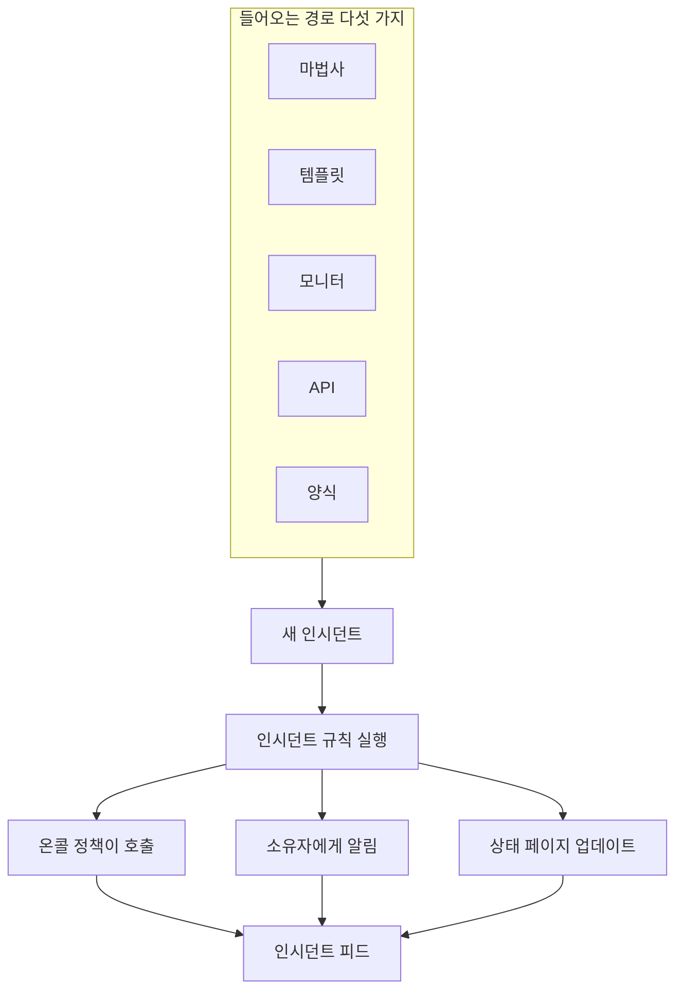
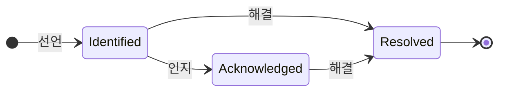

# 인시던트 개요

인시던트는 무언가 고장 났을 때 팀이 중심에 두고 일하는 기록입니다. 무엇이 영향을 받는지, 얼마나 심각한지, 대응이 어디까지 진행됐는지, 누가 맡고 있는지, 그리고 그 과정에서 기록된 모든 것이 담깁니다. 인시던트를 선언하면 알맞은 온콜 로테이션이 호출되고, 소유자에게 알려지며, 원한다면 장애가 상태 페이지에 게시되어 고객이 대응이 시작되었음을 알 수 있습니다.

:::cards
- [인시던트 선언](/docs/incidents/declaring-incidents): 직접, 템플릿에서, 모니터에서, API로, 또는 양식으로.
- [인시던트 상태 및 심각도](/docs/incidents/states-and-severities): 수명 주기, 그리고 인지와 해결이 하는 일.
- [인시던트 메모, 소유자 및 피드](/docs/incidents/notes-owners-and-feed): 고객과 팀을 위한 업데이트, 그리고 누가 그것을 받는지.
- [연결된 알림](/docs/incidents/linked-alerts): 장애로 발생한 알림을 그것을 설명하는 인시던트에 묶습니다.
- [인시던트 설정 및 자동화](/docs/incidents/settings): 템플릿, 사용자 정의 필드, 역할, 측정, 규칙.
:::

## 한눈에 보기

- **독립된 제품** — 상단 바의 **제품** 메뉴에서 **인시던트**를 엽니다. 목록은 `/dashboard/{projectId}/incidents`에 있습니다.
- **기본 제공 상태 세 가지** — **Identified**, **인지됨**, **해결됨**이 새 프로젝트마다 생성됩니다. 직접 상태를 추가할 수 있으며, 기본 제공 세 가지는 이름과 색상을 바꿀 수 있지만 삭제할 수는 없습니다.
- **기본 제공 심각도 세 가지** — **Critical Incident**, **Major Incident**, **Minor Incident**. 심각도는 색상과 순서를 가진 레이블일 뿐, 그 자체로는 아무 동작도 하지 않습니다.
- **들어오는 경로 다섯 가지** — **인시던트 선언** 마법사, **템플릿에서 생성**, 모니터 기준 규칙, `POST /api/incident`, 그리고 링크를 가진 누구나 작성할 수 있는 [양식](/docs/forms/index).
- **프로젝트별 번호** — 모든 인시던트는 프로젝트별 카운터에서 번호를 받고, 프로젝트의 접두사와 함께 표시됩니다. 새 프로젝트에서는 `INC-42`, 접두사가 없으면 `#42`입니다.
- **두 종류의 노트** — 팀을 위한 비공개 노트(내부 노트)와 상태 페이지 구독자를 위한 공개 노트.
- **알림은 인시던트에 연결됩니다** — 인시던트에 속한 알림을 연결하거나, 알림 목록이나 알림 자체의 페이지에서 알림으로부터 바로 인시던트를 선언하면서 알림을 함께 인지할 수 있습니다. [연결된 알림](/docs/incidents/linked-alerts)을 참고하세요.
- **설정은 프로젝트 설정이 아니라 인시던트 아래에 있습니다** — 상태, 심각도, 템플릿, 사용자 정의 필드, 규칙 엔진은 모두 **인시던트 → 설정**과 **인시던트 → 규칙**에 있습니다.

## 작동 방식

새벽 3시에 직접 인시던트를 선언할 수도 있고, 모니터의 기준이 일치하는 순간 모니터가 선언하게 할 수도 있습니다. 어느 쪽이든 인시던트는 같은 객체이고, 같은 수명 주기를 거치며, 마지막에 같은 기록을 남깁니다.

### 1. 선언됩니다

다섯 가지 경로가 같은 객체로 이어집니다.

- **직접** — 인시던트 목록에서 **인시던트 선언**을 클릭합니다. **새 인시던트 선언** 마법사가 열리며, **인시던트 세부 정보**, **영향받는 리소스**, **온콜 및 역할**의 세 단계로 진행됩니다. 첫 단계에서는 제목, 심각도, 설명을 묻고, 대부분의 인시던트에 필요 없는 항목은 **추가 필드** 아래에 접혀 있습니다. 반드시 답해야 하는 항목이 있는 단계는 첫 단계뿐입니다. **다음**으로 나머지 단계를 진행하고, **인시던트 선언**은 마지막 요약에 있습니다.
  - **알림에서** — 선택한 알림이나 한 알림의 헤더에서 **인시던트 선언**을 사용하면, 알림 내용으로 채워진 같은 마법사가 열리고 알림이 새 인시던트에 연결됩니다. 확인란을 해제하지 않으면 알림이 인지되어 에스컬레이션이 멈춥니다. [연결된 알림](/docs/incidents/linked-alerts)을 참고하세요.
- **템플릿에서** — **템플릿에서 생성**을 클릭하고 저장된 **인시던트 템플릿**을 고릅니다. 템플릿은 제목, 설명, 심각도, 초기 상태, 리소스, 온콜 정책, 소유자, 레이블을 미리 채웁니다.
- **모니터에서** — "인시던트 선언" 토글을 켠 모니터 기준 규칙은 필터가 일치하는 순간 자동으로 인시던트를 생성합니다. 그곳의 제목과 설명에는 `{{variable}}` 템플릿을 쓸 수 있습니다.
- **API로** — API 키로 `POST /api/incident`를 호출합니다. `declaredAt`, 생성 상태, 인시던트 번호는 서버가 채웁니다.
- **양식으로** — 팀 외부의 누군가가 링크로 공유된 양식을 OneUptime 계정 없이 작성합니다. 인시던트는 상태 페이지에서 숨겨진 채로 선언되며, 양식에 인시던트 템플릿이 있으면 그 템플릿으로 만들어집니다. [양식](/docs/forms/index)을 참고하세요.

통합 기능도 인시던트를 엽니다. [Huntress](/docs/integrations/huntress)는 SOC가 보내는 인시던트 보고서마다 인시던트 하나로 바꾸고, 선택한 온콜 정책으로 호출합니다. 항목별 자세한 설명은 [인시던트 선언](/docs/incidents/declaring-incidents)을 참고하세요.

### 2. 알맞은 사람에게 알려집니다

생성 시 OneUptime은 설정해 둔 자동화를 실행합니다. 개인정보 보호 규칙, 소유자 규칙, 레이블 규칙, 온콜 규칙, Runbook 규칙입니다. 인시던트에 붙은 온콜 정책은 직접 추가했든, 템플릿에서 왔든, 일치하는 온콜 규칙이 합쳐 넣었든 모두 병렬로 실행됩니다.

소유자는 각자 **사용자 설정 → 알림 설정**에서 켠 채널로 알림을 받습니다. 이메일, SMS, 음성 통화, 푸시, WhatsApp, Telegram, Slack, Microsoft Teams, 웹훅입니다. 인시던트에 소유자가 전혀 없으면 알림이 버려지지 않고 프로젝트 소유자에게 전달됩니다.

인시던트가 상태 페이지에 표시되고 구독자 알림이 켜져 있으면 구독자에게도 알려집니다. 대상은 인시던트의 모니터 중 하나를 나열하는 모든 상태 페이지의 구독자이거나, 인시던트를 제한한 페이지의 구독자뿐입니다. 대상마다 별도의 상태 페이지를 두는 방법은 [대상별 상태 페이지](/docs/status-pages/one-status-page-per-audience)를 참고하세요.

> [!NOTE]
> 알림은 cron으로 매분 실행되므로, 즉시 전송되기보다 최대 1분 정도 지연된다고 생각하세요.

### 3. 팀이 대응합니다

대응자는 인시던트를 인지하고, 영향받는 리소스를 추가하고, 관련 알림을 연결하고, 런북을 실행하고, 인시던트 역할을 할당하며, 알게 된 것을 기록합니다. 팀을 위해서는 비공개 노트를, 고객을 위해서는 공개 노트를 쓰고, 상황이 분명해지면 **근본 원인**과 **해결** 페이지도 작성합니다. 이들이 하는 모든 일은 **개요** 페이지의 **인시던트 피드**에 기록됩니다.

### 4. 해결됩니다

**해결**을 클릭하면 인시던트가 해결 상태로 이동하고, 상태 타임라인에 기록되고, 기간 측정이 멈추고, 인시던트가 잡고 있던 모니터를 돌려주며, 인시던트가 표시되던 모든 상태 페이지의 활성 섹션에서 빠집니다. 이를 위해 다른 것을 바꿀 필요는 없습니다. 상태 페이지는 해결 상태보다 위에 있는 상태의 인시던트만 보여 주기 때문입니다. [해결이 하는 일](/docs/incidents/states-and-severities#해결이-하는-일)을 참고하세요.

그 후 포스트모템을 작성하고, 원하면 상태 페이지에 게시할 수 있습니다.

## 주요 용어

이 섹션의 모든 페이지에 나오는 몇 가지 단어가 있습니다. 이것부터 정리하세요.

| 용어                   | 뜻                                                                                                                                                  |
| ---------------------- | --------------------------------------------------------------------------------------------------------------------------------------------------- |
| **인시던트**           | 기록 그 자체입니다. 제목, 설명, 심각도, 현재 상태, 영향받는 리소스, 그리고 대응 중에 기록된 모든 것입니다.                                           |
| **인시던트 상태**      | 인시던트가 수명 주기의 어디에 있는지입니다. 이름, 색상, `order`와 의미를 부여하는 플래그를 가진 프로젝트 범위의 행입니다.                            |
| **인시던트 심각도**    | 얼마나 심각한지입니다. 이름, 색상, `order`를 가진 프로젝트 범위의 행입니다. 순수한 분류일 뿐, 제품 어디에서도 특정 심각도를 특별 취급하지 않습니다. |
| **인시던트 번호**      | `#42`로, 또는 설정한 접두사와 함께 `INC-42`로 표시되는 프로젝트별 카운터입니다.                                                                     |
| **영향받는 리소스**    | 인시던트에 연결하는 모니터, 호스트, Kubernetes 클러스터, Docker 호스트, 서비스 및 기타 인프라입니다.                                                |
| **공개 노트**          | 상태 페이지 독자와 구독자를 위해 쓰는 업데이트입니다. 상태 페이지 타임라인에 표시됩니다.                                                            |
| **비공개 노트**        | 대응 팀을 위한 내부 노트(`IncidentInternalNote` 모델)입니다. 상태 페이지에는 절대 나가지 않습니다.                                                  |
| **소유자**             | 인시던트를 책임지는 사용자 또는 팀입니다. 인시던트가 생성될 때, 노트가 게시될 때, 상태가 바뀔 때 알림을 받습니다.                                   |
| **인시던트 피드**      | 인시던트 **개요**에 있는 추가 전용 활동 타임라인입니다. 상태 변경, 노트, 소유자 변경, 규칙 실행, 알림을 기록합니다.                                  |
| **상태 타임라인**      | 인시던트가 언제, 어떤 상태에, 얼마나 오래 있었는지의 기록입니다. 전환마다 구독자 알림 상태도 함께 남습니다.                                         |
| **연결된 알림**        | 대응의 일부로 인시던트에 연결된 알림입니다. 알림은 여러 인시던트에 연결될 수 있으며, 자신의 상태를 그대로 유지합니다.                               |

## OneUptime이 모든 프로젝트에 만들어 두는 세 가지 상태

프로젝트가 생성되면 OneUptime은 정확히 세 가지 인시던트 상태를 다음 순서로 만듭니다.

| 상태             | 순서 | 색상                 | 뜻                                                                        |
| ---------------- | ---- | -------------------- | ------------------------------------------------------------------------- |
| **Identified**   | 1    | 빨강 (`#fd625e`)     | 새로 만든 인시던트가 들어가는 상태입니다. 이것이 생성 상태입니다.         |
| **인지됨**       | 2    | 노랑 (`#ffbf53`)     | 누군가 인시던트를 맡아 작업하고 있습니다.                                 |
| **해결됨**       | 3    | 초록 (`#2ab57d`)     | 인시던트가 끝났습니다. 해결하면 상태 페이지에서 내려갑니다.               |

이름은 그저 레이블입니다. 실제로 동작을 결정하는 것은 상태 행의 세 가지 불리언 값 `isCreatedState`, `isAcknowledgedState`, `isResolvedState`입니다. 각 플래그는 프로젝트마다 한 상태만 갖는 것이 전제입니다.

이 구분은 생각보다 중요합니다.

- `isCreatedState`는 새 인시던트가 어디서 시작할지 결정합니다. 생성 시 상태를 명시적으로 고르지 않으면, OneUptime은 프로젝트의 생성 상태를 찾아 사용합니다.
- `isAcknowledgedState`와 `isResolvedState`는 인지 상태와 해결 상태를 표시합니다. 인시던트의 상태가 이들에 대해 어디에 있는지에 따라 인시던트 헤더의 **인지**와 **해결** 버튼, 인시던트 **개요**의 두 통계 타일, 사이드 메뉴의 **활성 인시던트** 개수 배지가 정해집니다. 인지 상태나 그 이후 상태에 있는 인시던트는 인지된 것으로, 해결 상태나 그 이후 상태에 있는 인시던트는 해결된 것으로 간주됩니다.
- **활성 인시던트**는 순전히 "현재 상태가 해결 상태보다 위에 있다"로 정의됩니다. 따라서 해결 상태보다 위에 추가한 사용자 상태는 활성이고, 해결 상태 뒤에 놓은 상태는 해결 상태와 마찬가지로 해결된 것으로 간주됩니다.

> [!NOTE]
> 처음 만들어지는 상태의 이름은 **Identified**이지만, 제품 안의 일부 설명은 여전히 이를 생성 상태라고 부릅니다. 프로젝트의 상태 목록에서 "Created"를 찾고 있다면, 그것은 **Identified**라는 이름의 행입니다.

**인시던트 → 설정 → 인시던트 상태**에서 직접 상태를 추가할 수 있습니다. 새 상태는 해결 상태 바로 위에 추가되며, 행을 끌어 순서를 바꿉니다. **간주** 열은 각 상태의 인시던트가 무엇으로 간주되는지(인지되지 않음, 인지됨, 해결됨)를 보여 줍니다. 플래그가 있는 세 상태에는 **기본 제공** 태그가 붙습니다. 순서가 유지되고 삭제할 수 없지만, 이름과 색상을 바꾸고 옮길 수는 있습니다. 그래서 UI는 상태 이름을 동적으로 읽습니다.

순서는 겉모습이 아니라 강제되는 규칙입니다. 인시던트는 순서상 현재 상태보다 앞에 있는 상태로 이동할 수 없습니다. 자세한 내용은 [인시던트 상태 및 심각도](/docs/incidents/states-and-severities)에 있습니다.

## OneUptime이 모든 프로젝트에 만들어 두는 세 가지 심각도

모든 새 프로젝트에는 세 가지 심각도도 만들어집니다.

| 심각도                | 순서 | 색상                   | 뜻                                                         |
| --------------------- | ---- | ---------------------- | ---------------------------------------------------------- |
| **Critical Incident** | 1    | 적갈색 (`#b70400`)     | 고객 영향이 매우 커서 즉시 대응해야 합니다.                |
| **Major Incident**    | 2    | 빨강 (`#fd625e`)       | 영향이 크며 보통 즉시 대응해야 합니다.                     |
| **Minor Incident**    | 3    | 노랑 (`#ffbf53`)       | 영향이 작으며 보통 업무 시간에 처리합니다.                 |

심각도는 `name`, `description`, `color`, `order`만 가집니다. 플래그는 없고, "Critical Incident"를 다른 행과 다르게 다루는 코드 경로도 없습니다. 심각도는 사람이 분류하는 수단이며 온콜 규칙을 작성할 때 일치 기준으로 쓸 수 있지만, 심각도를 고르는 것만으로는 아무도 호출되지 않습니다.

심각도는 **인시던트 → 설정 → 인시던트 심각도**에서 편집하거나 추가합니다. 기본 설명 전문은 [인시던트 상태 및 심각도](/docs/incidents/states-and-severities)에 있습니다.

## 대시보드에서 인시던트가 있는 곳

상단 바의 **제품** 메뉴에서 **인시던트**를 엽니다. 사이드 메뉴는 다음 섹션으로 나뉘어 있습니다.

| 섹션          | 하는 일                                                                                                                                                                    |
| ------------- | -------------------------------------------------------------------------------------------------------------------------------------------------------------------------- |
| **개요**      | **모든 인시던트**와 **활성 인시던트**. 후자에는 해결 상태보다 위에 있는 인시던트 수를 나타내는 빨간 배지가 붙습니다.                                                       |
| **에피소드**  | 인시던트 에피소드. 자체 페이지를 가진 별도의 그룹화 기능입니다.                                                                                                            |
| **AI**        | **인사이트**, **로그**, **설정**: OneUptime AI가 인시던트에서 배운 것과 인시던트를 위해 한 모든 일, 그리고 스스로 해도 되는 일(조사하고 수정할 인시던트를 정하는 규칙 포함). [AI SRE](/docs/ai/ai-sre)를 참고하세요. |
| **워크스페이스** | 이 프로젝트가 연결한 채팅 워크스페이스: **Slack**, **Microsoft Teams** 또는 둘 다이며, 각각 인시던트용 알림 규칙을 가집니다. 둘 다 연결하지 않았다면 둘 모두와 연결 방법을 보여 주는 **Slack 또는 Teams 연결** 페이지가 있습니다. |
| **연동**      | 스스로 인시던트를 여는 도구: **Huntress**. 그 인시던트 보고서는 온콜을 호출하는 인시던트가 됩니다. [Huntress](/docs/integrations/huntress)를 참고하세요.                    |
| **규칙**      | 규칙 엔진: **그룹화 규칙**, **온콜 규칙**, **소유자 규칙**, **Runbook 규칙**, **개인정보 보호 규칙**, **레이블 규칙**, **SLA 규칙**, **Reminder Rules**.                     |
| **설정**      | **인시던트 상태**, **인시던트 심각도**, **인시던트 템플릿**, **노트 템플릿**, **포스트모템 템플릿**, **사용자 정의 필드**, **인시던트 역할**, **측정**, **연결된 경고**, **번호 접두사**. |

**개요**와 **에피소드**는 열려 있고, **AI**, **워크스페이스**, **연동**, **규칙**, **설정**, **개발자**는 기본적으로 접혀 있어 메뉴가 매일 쓰는 목록부터 보여 줍니다. 섹션 제목을 클릭하면 펼쳐져 이 문서의 다른 곳에서 말하는 페이지를 찾을 수 있으며, 섹션의 페이지 중 하나에 있을 때도 자동으로 열립니다. 인시던트 설정은 프로젝트 설정에 있지 않고 모두 여기에 있습니다.

인시던트 목록 자체에는 **인시던트 번호**, **제목**, **상태**, **심각도**, **영향받는 리소스**, **선언됨**, **기간**, **레이블**, **소유자**가 표시되며, 일괄 작업 **상태 변경**으로 여러 인시던트를 한 번에 닫을 수 있습니다.

## 인시던트의 각 페이지에 표시되는 것

인시던트를 열면 인시던트 자체의 사이드 메뉴가 페이지를 다음과 같이 묶어 보여 줍니다.

| 사이드 메뉴 섹션  | 페이지                                                                                    |
| ----------------- | ----------------------------------------------------------------------------------------- |
| **개요**          | **개요**, **상태 타임라인**, **SLA**                                                      |
| **조사**          | **설명**, **근본 원인**, **해결**, **런북**, **포스트모템**, **연결된 경고**              |
| **팀**            | **역할**, **온콜 실행**, **소유자**                                                       |
| **알림**          | **알림 로그**, **AI 로그** — **알림**을 클릭할 때까지 접혀 있습니다                       |
| **노트**          | **비공개 노트**, **공개 노트**                                                            |
| **개발자**        | **Terraform**, **API**, **AI 어시스턴트** — **개발자**를 클릭할 때까지 접혀 있습니다      |
| **고급**          | **사용자 정의 필드**, **설정**, **감사 로그**, **인시던트 삭제** — **고급**을 클릭할 때까지 접혀 있습니다 |

각 페이지의 내용은 다음과 같습니다.

- **개요** — 대응 상황을 한눈에 봅니다. 헤더 아래의 통계 타일에는 인지까지 걸린 시간, 해결까지 걸린 시간, 전체 **기간**이 표시됩니다. 페이지 맨 위에는 OneUptime AI가 찾은 것이나 시작하지 않은 이유를 보여 주는 **AI Investigation** 카드가 있고, 그 아래에 **인시던트 피드**가 있습니다. 그 옆에는 **Video Call** 카드, **인시던트 세부 정보** 카드(제목, 심각도, 레이블, 인시던트 번호, 선언 시각, 선언한 사람, 온콜 정책, 그리고 아래쪽의 작은 **ID** 줄에 있는 인시던트 ID. 한 번 클릭하면 클립보드에 복사됩니다), **인시던트 역할**, **영향받는 리소스** 카드, 인시던트의 사용자 정의 필드가 있습니다. 프로젝트에 [측정](/docs/incidents/settings#측정)이 있으면 **인시던트 세부 정보** 아래의 **측정** 카드에 이 인시던트에서 각 측정이 보여 주는 값이 표시됩니다: **12분**, **5분 동안 진행 중**, **도달하지 않음**.
- **상태 타임라인** — 인시던트가 거친 모든 상태와 전환마다의 **시작**, **종료**, **기간**, 구독자 알림 상태. **원인 보기**와 **로그 보기**로 각 변경이 일어난 이유를 알 수 있습니다.
- **SLA** — 이 인시던트의 SLA 추적.
- **설명**, **근본 원인**, **해결** — 세 개의 Markdown 페이지. 상태 페이지에 표시되는 것은 설명입니다.
- **런북** — 이 인시던트에 연결된 런북 실행.
- **포스트모템** — 사후 분석 문서와 첨부 파일로, 원하면 상태 페이지에 게시할 수 있습니다. **사후 분석 노트 편집**은 노트와 첨부 파일을 묻고, 그다음 **상태 페이지에 게시**를 묻습니다. 이것이 켜져 있을 때만 **구독자에게 알림**과 **사후 분석 게시 시각**을 묻고, 게시를 켜면 현재 시각이 들어갑니다. **Generate with AI**는 노트 초안을 써 주고, **템플릿 적용**(프로젝트에 포스트모템 템플릿이 있으면 표시됩니다)은 템플릿에서 시작합니다. 구독자에게는 포스트모템이 게시될 때 한 번만 알려집니다. 즉 상태 페이지가 처음으로 그것을 보여 줄 때이며, 이를 위해서는 **상태 페이지에 게시**가 켜져 있고 노트가 작성되어 있어야 합니다. 다시 저장하거나 게시된 상태에서 편집하면 상태 페이지가 업데이트될 뿐 아무에게도 알리지 않습니다. 상태 페이지에서 내린 후 다시 게시하면 다시 알립니다. 인시던트가 숨겨진 동안 게시한 것은 인시던트가 표시될 때 전송됩니다. [포스트모템](/docs/status-pages/subscribers#인시던트)을 참고하세요.
- **연결된 경고** — 이 인시던트에 연결된 알림과 각 알림의 현재 상태, 누가 언제 연결했는지. 알림에는 짝이 되는 **연결된 인시던트** 페이지가 있습니다. [연결된 알림](/docs/incidents/linked-alerts)을 참고하세요.
- **역할**, **온콜 실행**, **소유자** — 누가 맡고 있는지, 어떤 정책이 실행됐는지, 누가 알림을 받는지.
- **알림 로그**, **AI 로그**, **감사 로그** — 무엇이 전송됐고 무엇이 바뀌었는지.
- **비공개 노트**와 **공개 노트** — 팀과 고객에게 무엇을 알렸는지. [인시던트 메모, 소유자 및 피드](/docs/incidents/notes-owners-and-feed)를 참고하세요.
- **사용자 정의 필드**, **설정**, **인시던트 삭제** — **설정** 페이지에는 **상태 페이지에 표시**와 **비공개 인시던트**, 인시던트를 일부 상태 페이지로 제한하는 **상태 페이지 범위** 카드, 그리고 **Reminders** 카드가 있습니다. 이 카드의 **리마인더 보내기** 스위치는 바꾸는 즉시 저장되며 다음 리마인더가 언제 나가는지 보여 줍니다.

## 인시던트와 OneUptime의 다른 기능

- **모니터가 문제를 발견하고, 인시던트가 그것을 기록합니다.** 모니터 기준 규칙은 제목, 심각도, 온콜 정책, 소유자, 레이블, 해결 노트를 미리 채워 자동으로 인시던트를 선언할 수 있습니다. 그곳에서 쓸 수 있는 변수는 [인시던트 및 알림 템플릿](/docs/monitor/incident-alert-templating)을 참고하세요.
- **알림은 신호이고, 인시던트는 대응입니다.** 인시던트가 설명하는 알림을 어느 쪽에서든 인시던트에 연결하세요. 새 프로젝트에서 켜져 있는 두 프로젝트 스위치가 그 알림을 인시던트와 함께 인지하고 해결합니다. [연결된 알림](/docs/incidents/linked-alerts)을 참고하세요.
- **호출은 온콜 정책이 합니다.** 선언 마법사의 **온콜 및 역할** 단계, 템플릿, 또는 **인시던트 → 규칙 → 온콜 규칙**에서 정책을 붙입니다. 일치하는 규칙은 모두 실행되며, 실행되는 집합은 모든 일치 항목과 직접 붙인 것의 합집합에서 중복을 뺀 것입니다.
- **런북은 무엇을 해야 할지 알려 줍니다.** Runbook 규칙은 일치하는 인시던트가 생성될 때 절차를 자동으로 붙이며, 대응자는 인시던트에서 직접 런북을 시작할 수도 있습니다. [Runbook 개요](/docs/runbooks/index)를 참고하세요.
- **상태 페이지는 고객에게 알립니다.** 인시던트는 상태 페이지가 인시던트의 모니터 중 하나를 나열하고, 페이지에서 인시던트가 켜져 있고, 인시던트가 상태 페이지에 표시되도록 되어 있고, 현재 상태가 해결 상태보다 위에 있을 때 상태 페이지의 활성 목록에 나타납니다. 일부 상태 페이지로 제한한 인시던트는 그 페이지에만 표시됩니다. 비공개 인시던트는 항상 모든 상태 페이지에서 숨겨집니다. [상태 페이지 개요](/docs/status-pages/index)와 [대상별 상태 페이지](/docs/status-pages/one-status-page-per-audience)를 참고하세요.
- **워크플로우가 그 주변을 자동화합니다.** **On Create Incident**, **On Update Incident**, **On Delete Incident** 트리거로 인시던트 수명 주기 위에 노코드 자동화를 만들 수 있습니다. [워크플로우 개요](/docs/workflows/index)를 참고하세요.

## 다음 단계

:::cards
- [인시던트 선언](/docs/incidents/declaring-incidents): 마법사를 항목별로 살펴보거나, 템플릿, 모니터, API에서 선언합니다.
- [인시던트 상태 및 심각도](/docs/incidents/states-and-severities): 직접 상태를 추가하고 각 상태가 정확히 무엇을 하는지 확인합니다.
- [상태 페이지 개요](/docs/status-pages/index): 인시던트가 고객에게 닿는 방식.
- [구독자 및 공지](/docs/status-pages/subscribers): 인시던트가 움직일 때 누가 알림을 받는지.
:::
