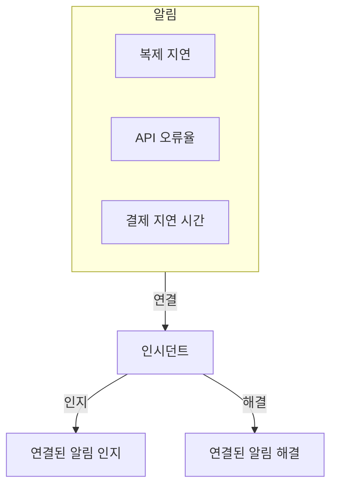
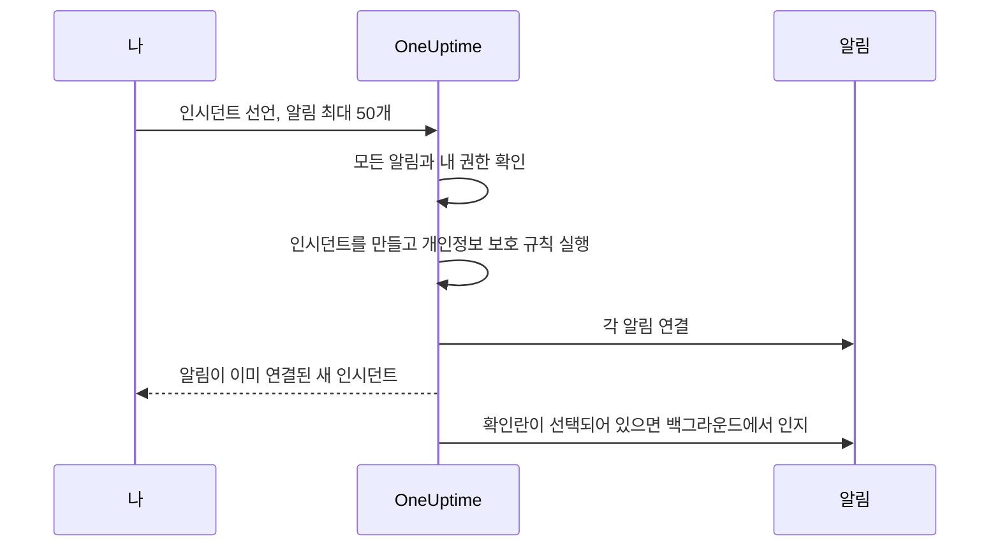

# 연결된 알림

장애가 알림을 하나만 일으키는 경우는 드뭅니다. 기본 데이터베이스가 쓰러지면 복제 지연 모니터가 발동하고, API 오류율 모니터가 발동하고, 결제 지연 시간 SLO가 예산을 소진하기 시작합니다. 알림은 셋이지만 문제는 하나입니다. 이 알림들을 인시던트에 연결하면 바로 그 사실을 나타낼 수 있습니다. 인시던트는 대응이 이루어지는 곳이고, 각 알림은 어떤 인시던트가 자신을 설명하는지 보여 줍니다.

연결은 연결일 뿐입니다. 알림은 자신의 상태, 소유자, 온콜 정책, 노트, 피드를 유지하고, 인시던트도 자신의 것을 유지합니다. 연결은 아무것도 병합하거나 복사하지 않으며, 그 자체로 알림을 인지하거나, 해결하거나, 음소거하지 않습니다. (알림에서 새 인시던트를 선언하는 것은 다릅니다. [아래에서 설명하듯](#알림에서-인시던트-선언하기) 새 인시던트는 알림 내용으로 미리 채워지며, 양식의 확인란을 해제하지 않는 한 선언과 함께 알림이 인지되어 에스컬레이션이 멈춥니다. [선언하면서 알림 인지하기](#선언하면서-알림-인지하기)를 참고하세요.) 새 프로젝트에서 켜져 있는 두 프로젝트 스위치가 인시던트가 인지되고 해결될 때 연결된 알림도 함께 옮깁니다. [아래](#알림-상태를-인시던트에-맞추기)를 참고하세요.

:::cards
- [알림을 인시던트에 연결하기](#인시던트에서-알림-연결하기): 인시던트에서, 알림에서, 또는 여러 개를 한 번에.
- [알림에서 인시던트 선언하기](#알림에서-인시던트-선언하기): 미리 채워지고 연결된 새 인시던트를 한 번에.
- [알림 상태 맞추기](#알림-상태를-인시던트에-맞추기): 인시던트와 함께 알림을 인지하고 해결합니다.
- [권한](#권한): 누가 연결할 수 있고, 연결로 무엇을 할 수 있게 되는지.
:::

> [!TIP]
> Opsgenie에서 넘어오셨다면, 이것은 알림을 인시던트에 연관시키는 기능의 OneUptime 버전입니다.

## 한눈에 보기

- **다대다** — 인시던트에는 연결된 알림이 몇 개든 있을 수 있고, 알림 하나를 여러 인시던트에 연결할 수도 있습니다.
- **연결할 수 있는 곳은 세 군데** — 인시던트의 **연결된 경고** 페이지, 알림의 **연결된 인시던트** 페이지, 그리고 주요 알림 목록의 일괄 작업 **인시던트에 연결**로, 한 번에 최대 **50**개의 알림을 다룹니다.
- **알림에서 인시던트 선언** — 알림 목록, 알림의 헤더, 또는 알림의 **연결된 인시던트** 페이지에서 **인시던트 선언**을 사용하면 알림 내용으로 새 인시던트가 미리 채워지고, 생성과 함께 알림이 연결됩니다. 양식에 있는 기본적으로 선택된 확인란은 알림을 인지하기도 하여, 알림 자체의 온콜 에스컬레이션을 멈춥니다.
- **양쪽에 기록** — 연결과 연결 해제마다 인시던트와 알림 양쪽에 피드 항목이 기록됩니다. 다만 알림에서 선언된 인시던트에는 모두를 나열하는 항목이 하나만 붙습니다. Slack과 Microsoft Teams에 게시되는 것은 인시던트의 항목뿐이며, 비공개 알림이나 인시던트의 제목은 상대편에 쓰이지 않습니다.
- **알림 상태는 인시던트를 따릅니다** — 새 프로젝트에서 둘 다 켜져 있는 두 프로젝트 스위치가 인시던트가 인지되고 해결될 때 연결된 알림을 인지하고 해결합니다. 둘 중 하나를 끄려면 **인시던트 → 설정 → 연결된 경고**를 쓰세요.
- **자동화 가능** — 연결은 평범한 API 리소스인 `/api/incident-alert`입니다.

## 작동 방식

알림은 신호입니다. 모니터의 기준이 일치했거나, SLO가 예산을 소진하기 시작했거나, 보안 규칙이 발동한 것입니다. 인시던트는 문제에 대한 조직적인 대응입니다([인시던트 개요](/docs/incidents/index) 참고). 대부분의 문제는 여러 신호를 만들어 내며, 연결이 없다면 그것들을 대응에 묶어 주는 것은 누군가의 기억뿐입니다.



알림을 연결하면 다음과 같이 됩니다.

- 인시던트의 대응자는 어떤 알림이 인시던트에 속하고 각각 어떤 상태인지 한 목록에서 봅니다.
- 그 알림 중 하나를 연 사람은 그것이 이미 어떤 인시던트에서 처리되고 있는지 알 수 있으므로, 같은 장애에 두 번째 인시던트를 선언하지 않게 됩니다.
- 인시던트의 피드에는 각 알림이 언제, 누구에 의해 연결되었는지 기록되므로, 상황이 어떻게 드러났는지 타임라인이 보여 줍니다.
- 스위치가 켜져 있으면 인시던트를 인지할 때 알림의 온콜 에스컬레이션이 멈추므로, 인시던트를 처리하는 사람이 그 증상 때문에 다시 호출되지 않습니다.

## 연결의 작동 방식

연결은 알림 하나를 인시던트 하나에 잇습니다. 연결은 양방향이어서, 같은 연결이 인시던트의 **연결된 경고** 페이지와 알림의 **연결된 인시던트** 페이지에 모두 나타납니다.

- **알림은 여러 인시던트에 연결될 수 있습니다.** 공유 의존성의 장애는 서로 다른 두 인시던트의 증상일 수 있습니다. 각 인시던트에는 그 알림이 나열되고, 알림에는 두 인시던트가 모두 나열됩니다.
- **각 쌍은 한 번만 연결됩니다.** 이미 연결된 인시던트에 알림을 연결하면, 두 사람이 같은 순간에 같은 쌍을 연결하더라도 "This alert is already linked to this incident."로 거부됩니다.
- **연결은 만들거나 지울 뿐, 편집하지 않습니다.** 연결에는 인시던트, 알림, 만든 시각, 만든 사람 외의 항목이 없습니다. 알림을 다른 인시던트로 옮기려면 새 인시던트에 연결하고 이전 인시던트에서 연결을 해제하세요.
- **연결은 프로젝트 안에 머뭅니다.** 알림과 인시던트는 같은 프로젝트에 속해야 합니다.

## 인시던트에서 알림 연결하기

:::steps
### 인시던트의 연결된 경고 페이지 열기

인시던트를 열고 사이드 메뉴의 **조사** 섹션에서 **연결된 경고**를 고릅니다. 표에는 이미 연결된 모든 알림이 나열됩니다.

### 알림 고르기

**경고 연결**을 클릭하고 **경고** 드롭다운에서 고릅니다. 드롭다운은 `ALT-63: Checkout API is offline`처럼 번호와 함께 최신 알림부터 보여 주므로, 모니터가 반복해서 내는 알림처럼 제목이 같은 알림도 구별할 수 있습니다. 오래된 알림을 찾으려면 입력하세요. 드롭다운은 모든 알림을 제목으로 검색합니다.

### 연결 저장하기

대화 상자에서 **경고 연결**을 클릭합니다. 알림이 표에 나타나고 두 피드에 연결이 기록됩니다. 예를 들어 알림이 이미 연결되어 있어서 연결이 거부되면, 대화 상자는 열린 채로 남아 이유를 알려 줍니다.
:::

| 열                  | 보여 주는 것                                     |
| ------------------- | ------------------------------------------------ |
| **경고 #**          | `#17`이나 `ALT-17` 같은 알림 번호.               |
| **제목**            | 알림의 제목. 알림으로 연결됩니다.                |
| **현재 상태**       | 알림 자체의 상태. 예를 들어 **인지됨**.          |
| **연결 시각**       | 알림이 연결된 시각.                              |
| **연결한 사람**     | 연결한 사람.                                     |

각 행에는 알림을 여는 **경고 보기**와 연결을 지우는 **연결 해제**가 있습니다.

## 알림에서 인시던트 연결하기

알림 쪽은 인시던트 쪽을 거울처럼 비춥니다. 알림을 열고 사이드 메뉴의 **기본** 섹션에서 **연결된 인시던트**를 고릅니다. 표에는 알림이 연결된 모든 인시던트가 인시던트 번호, 제목, 현재 상태, 그리고 언제 누가 연결했는지와 함께 나열됩니다.

- **인시던트 연결**은 이 알림을 기존 인시던트에 연결합니다. 드롭다운은 인시던트 쪽과 같이 동작합니다. `INC-42: Checkout is down`처럼 번호와 함께 최신 인시던트부터 보여 주고, 입력하면 모든 인시던트를 제목으로 검색합니다.
- **인시던트 보기**는 연결된 인시던트를 엽니다.
- **연결 해제**는 연결을 지웁니다.
- **인시던트 선언**은 이 알림에서 새 인시던트를 시작합니다. 같은 버튼이 알림 헤더의 **인지**와 **해결** 옆에도 있습니다. [알림에서 인시던트 선언하기](#알림에서-인시던트-선언하기)를 참고하세요.

## 여러 알림을 한 번에 연결하기

주요 알림 목록에는 이를 위한 일괄 작업이 두 가지 있습니다. 대상 목록은 **모든 알림**과 **활성 알림**, 홈 페이지의 활성 알림, 그리고 모니터, 서비스, 호스트, Kubernetes 클러스터, SLO 등 목록이 있는 모든 리소스의 **알림** 페이지입니다. 알림 에피소드의 **구성원 알림** 목록에는 없으니, 대신 주요 목록 중 하나에서 알림을 고르세요. 알림을 고른 다음 다음 중 하나를 고릅니다.

- **인시던트에 연결** — **인시던트** 드롭다운에서 인시던트를 고르고 **선택한 경고 연결**을 클릭합니다. 최신 인시던트가 번호와 함께 먼저 나오고, 입력하면 모든 인시던트를 제목으로 검색합니다. OneUptime이 고른 모든 알림을 연결하며 진행 상황을 보여 줍니다. 그 인시던트에 이미 연결된 알림은 실패가 아니라 완료로 세므로, 작업을 두 번 실행해도 해가 없습니다.
- **인시던트 선언** — 고른 알림 내용으로 미리 채워진 새 인시던트의 선언 양식을 엽니다. 다음 섹션을 참고하세요.

두 작업 모두 한 번에 최대 **50**개의 알림을 받습니다. 더 많이 고르면 비활성화되고, 툴팁이 이유를 알려 줍니다. 이 상한이 있는 이유는 연결마다 두 피드에 기록되고, **인시던트에 연결**로 만든 모든 연결이 인시던트의 Slack과 Microsoft Teams 채널에도 게시되기 때문입니다. 알림 천 개를 고르면 채널이 넘쳐 버립니다.

## 알림에서 인시던트 선언하기

쏟아진 알림이 아직 아무도 선언하지 않은 인시던트로 드러나면, 알림에서 선언하세요. 들어가는 길은 세 가지입니다.

- 주요 알림 목록 중 하나에서 알림을 고르고 **인시던트 선언**을 고릅니다.
- 알림을 열고 헤더의 **인지**와 **해결** 옆에 있는 **인시던트 선언**을 클릭합니다. 버튼은 알림이 인지되거나 해결된 뒤에도 남아 있으므로, 나중에도 알림에 대한 인시던트를 선언할 수 있습니다. 예를 들어 포스트모템을 진행하기 위해서입니다.
- 한 알림의 **연결된 인시던트** 페이지를 열고 **인시던트 선언**을 클릭합니다.

세 가지 모두 인시던트를 만들고 알림을 인시던트에 연결할 권한이 필요합니다. 권한이 없으면 버튼이 잠기고, 툴팁이 부족한 권한을 알려 줍니다.

어느 것을 쓰든 평소의 **새 인시던트 선언** 양식으로 이동하며, 알림은 연결될 것으로 나열되고 다음 항목이 미리 채워집니다.

| 항목                       | 미리 채워지는 내용                                                                                                                                                                                                                                                                     |
| -------------------------- | -------------------------------------------------------------------------------------------------------------------------------------------------------------------------------------------------------------------------------------------------------------------------------------- |
| **제목**                   | 알림이 하나면 그 제목. 여러 개면 가장 심각한 알림의 제목.                                                                                                                                                                                                                              |
| **설명**                   | 알림이 하나면 그 설명. 여러 개면 알림마다 번호와 제목을 한 줄씩 담은 목록.                                                                                                                                                                                                             |
| **인시던트 심각도**        | 가장 심각한 알림의 심각도를 인시던트 심각도로 바꾼 것. 대소문자를 무시하고 이름이 같은 인시던트 심각도가 있으면 그것이 우선합니다. 없으면 OneUptime은 심각도 순서에서 같은 위치의 인시던트 심각도를 가져오고, 인시던트 심각도가 더 적으면 마지막 것을 가져옵니다. |
| **영향받는 리소스**        | 고른 알림의 모든 모니터, 호스트, Kubernetes 클러스터, Docker 호스트, Podman 호스트, 서비스를 합친 것. 모니터는 **모니터** 아래에, 나머지는 **기타 영향받는 리소스** 아래에 들어갑니다. SLO나 VMware·Proxmox·Ceph 클러스터 같은 다른 리소스는 복사되지 않으니, 인시던트가 영향을 준다면 직접 추가하세요. |
| **레이블**                 | 고른 모든 알림의 모든 레이블.                                                                                                                                                                                                                                                          |
| **비공개 인시던트**        | 알림 중 하나라도 비공개면 켜집니다. 양식에 그렇게 표시되며, 알림의 소유자가 인시던트의 소유자가 됩니다(아래 참고).                                                                                                                                                                     |

"가장 심각한"은 알림 심각도 순서를 따릅니다. 목록의 첫 번째 알림 심각도가 가장 심각합니다. 모든 프로젝트가 처음 갖는 심각도에서는 **High** 알림이 **Critical Incident**가 되고, **Low** 알림이 **Major Incident**가 됩니다.

제출하기 전에 모두 편집할 수 있습니다. **레이블**과 **비공개 인시던트**는 양식 첫 단계의 **추가 필드** 아래에 있으며, 접힌 머리글은 둘 중 하나가 설정되어 있는 동안 그것을 보여 줍니다.

**이미 인시던트가 있는 알림에는 표시가 붙습니다.** 모든 알림 페이지에 **인시던트 선언**이 있으므로, 같은 장애로 호출된 두 대응자가 각자 선언할 수 있습니다. 그래서 알림을 나열하는 배너는 이미 인시던트에 연결된 각 알림에 "(already linked to Incident INC-42)"라는 표시를 그 인시던트로의 링크와 함께 붙이고, 연결된 알림 수에 따라 다른 문구의 메모를 덧붙입니다.

- 모든 알림이고 알림이 하나일 때: "This alert is already linked to an incident. If it is the same problem, update that incident instead of declaring another one."
- 모든 알림이고 알림이 여러 개일 때: "These alerts are already linked to incidents. If it is the same problem, update that incident instead of declaring another one."
- 일부만일 때: "Some of these alerts are already linked to an incident. If it is the same problem, link the other alerts to that incident from the alerts list instead of declaring another one."

인시던트 링크는 새 탭에서 열리므로, 양식에 채운 내용을 잃지 않고 기존 인시던트를 확인할 수 있습니다. 메모는 알림일 뿐 막는 것이 아니며, 볼 수 있도록 허용된 인시던트만 이름이 표시됩니다.

**온콜 정책은 복사되지 않습니다.** 알림은 생성될 때 자체 온콜 정책을 실행했으므로, 그것을 인시던트에 복사하면 같은 사람을 다시 호출하게 됩니다. 인시던트의 온콜 정책은 **온콜 및 역할** 단계에서 고른 것과 인시던트 온콜 규칙이 추가하는 것입니다. 다른 인시던트와 정확히 같습니다.

**알림의 모니터는 영향받는 모니터로 미리 채워집니다.** 직접 선언한 다른 인시던트처럼, 인시던트의 모니터에 대한 활성 모니터링은 인시던트가 해결될 때까지 일시 중지됩니다. 계속 검사해야 할 모니터가 있다면 제출하기 전에 **영향받는 리소스** 단계의 **모니터**에서 빼세요.

**비공개 알림은 비공개 인시던트를 만듭니다.** 알림 중 하나라도 비공개면 **비공개 인시던트**가 켜진 채로 시작하며, 알림을 나열하는 배너에 그렇게 표시됩니다. 비공개 인시던트는 소유자, Project Owners, Project Admins만 볼 수 있으므로, OneUptime은 알림을 볼 수 있던 사람이 인시던트도 볼 수 있게 합니다. 선언되면 선언에 쓰인 모든 알림의 소유자(사용자와 팀 모두)가 알림 없이 인시던트의 소유자로 추가됩니다. 인시던트의 Slack과 Microsoft Teams 채널이 만들어진 직후에 추가되므로, 다른 소유자처럼 그 채널에 초대됩니다. 선언하는 다른 모든 인시던트처럼 여러분도 소유자가 됩니다. 인시던트 개인정보 보호 규칙이 새 인시던트를 비공개로 만들 때도 같은 일이 일어납니다. 제출하기 전에 **비공개 인시던트**를 끄고 적용되는 개인정보 보호 규칙도 없다면, 인시던트는 비공개가 아니며 소유자도 복사되지 않습니다.



제출하면 서버는 무엇이든 만들기 전에 알림을 확인합니다. 최대 50개이고, 각각이 이 프로젝트의 알림으로 볼 수 있도록 허용된 것이며, 알림을 인시던트에 연결할 권한이 있어야 합니다. 확인 중 하나라도 실패하면 요청이 거부되고 인시던트는 만들어지지 않습니다. 그래서 잘못된 알림 ID 때문에 인시던트 번호가 소모되는 일은 없습니다. 인시던트가 생기고 개인정보 보호 규칙이 실행된 뒤에(연결이 인시던트가 비공개인지 알 수 있도록), 요청이 반환되기 전에 모든 알림이 연결되므로, 인시던트의 **연결된 경고** 페이지에는 이미 목록이 나옵니다. 연결 하나가 실패해도(예를 들어 직전에 알림이 삭제된 경우) 인시던트는 선언되고 다른 알림도 연결됩니다.

인시던트의 피드에는 알림마다 하나가 아니라, 알림을 나열하는 **경고 연결됨** 항목이 하나만 **인시던트 생성됨** 뒤에 기록됩니다. [피드, Slack, Microsoft Teams](#피드-slack-microsoft-teams)를 참고하세요.

### 선언하면서 알림 인지하기

인시던트를 선언하는 것만으로는 그 알림의 호출이 멈추지 않습니다. 알림의 온콜 에스컬레이션은 알림 자체가 인지되어야만 멈춥니다. 그래서 알림 중 하나라도 아직 인지되지 않았다면, 양식의 배너에 기본적으로 선택된 확인란이 있습니다. 알림이 하나면 **Acknowledge this alert to stop its escalation**, 여러 개면 **Acknowledge these 3 alerts to stop their escalation**입니다. 일부가 이미 인지되었다면 나머지만 언급하고, 인지된 것은 그대로 둔다고 알려 줍니다.

선택된 채로 두면, 인시던트가 선언되고 알림이 연결된 뒤에 다음과 같이 됩니다.

- **알림이 여러분의 이름으로 인지됩니다.** 각 알림은 여러분이 직접 그 알림의 **인지**를 클릭한 것처럼 알림 상태 **인지됨**으로 옮겨집니다. 알림의 **상태 타임라인**과 피드에 여러분의 이름이 남고, 알림의 소유자에게 알림이 가며, 변경은 다른 알림 상태 변경처럼 알림의 Slack과 Microsoft Teams 채널에 게시됩니다. 원인은 "Acknowledged because Incident INC-42 was declared from this alert."이고, 비공개 인시던트라면 "Acknowledged because a private incident was declared from this alert."이므로, 알림의 독자가 읽을 수 있는 곳에 비공개 인시던트의 이름이 나오는 일은 없습니다.
- **알림 자체의 온콜 에스컬레이션은 1분 정도 안에 멈춥니다.** 다음 에스컬레이션 단계가 인지된 알림을 보고 멈춥니다. 이미 나간 호출은 취소되지 않습니다.
- **리마인더는 리마인더 규칙이 그렇게 정했을 때만 멈춥니다.** 알림의 리마인더가 인지로 멈추는 것은 리마인더 규칙의 **Stop Reminders When**이 **인지됨**으로 설정되어 있을 때뿐이며, 그렇지 않으면 알림이 해결될 때까지 계속됩니다.
- **알림 에피소드는 에스컬레이션을 계속합니다.** 알림이 자체 온콜 정책으로 호출하는 에피소드에 속해 있다면, 에피소드는 에피소드 자체가 인지될 때까지 에스컬레이션을 계속합니다.
- **이미 인지되었거나 해결된 알림은 그대로 둡니다.** 다른 모든 곳처럼 상태는 순서로 비교되므로, **인지됨** 뒤의 사용자 상태에 있는 알림은 인지된 것으로 간주되며, 어떤 것도 뒤로 옮겨지지 않습니다.

인지하지 않고 선언하려면 확인란을 해제하세요. 알림이 인지되지 않은 채로 남게 될 때마다(확인란이 해제되었거나 잠겼을 때) 양식이 그렇게 알려 줍니다: "Declaring the incident does not acknowledge the alert: it keeps escalating until it is acknowledged." 그리고 인시던트의 온콜 정책을 고르지 않고 알림을 인지하면, **온콜 및 역할** 단계의 요약이 다음을 짚어 줍니다: "The alerts it is declared from are acknowledged too, so their own escalation stops. An alert episode they belong to keeps escalating until the episode is acknowledged, and an incident on-call rule, if any, may still page."

**알림을 인지하려면 권한이 필요합니다.** 선언하면서 인지하려면 **Create Alert State Timeline**과 **Edit Alert**가 필요합니다(알림 자체의 페이지에서 인지할 때는 앞의 것만 필요합니다. [상태 변경](/docs/permissions/index#상태-변경)을 참고하세요). Project Owner, Project Admin, Project Member, Alert Admin, Alert Member는 둘 다 가지지만, 알림에서 인시던트를 선언할 수 있는 Incident Admin과 Incident Member는 둘 다 없습니다. 알림에 대한 레이블 및 소유자 범위에도 인지될 각 알림이 포함되어야 합니다. 확인하는 것은 아직 인지되지 않은 알림뿐입니다. 이미 인지되었거나 해결된 알림에는 권한이 필요 없으며 선언을 막지도 않습니다. 권한이 없으면 확인란이 잠기고 툴팁이 부족한 권한을 알려 주며, 인시던트는 여전히 선언할 수 있습니다. 서버는 무엇이든 만들기 전에, 인지할 각 알림에 대해 다시 확인합니다. 그중 하나라도 인지할 수 없다면 인시던트는 만들어지지 않고 양식이 이유를 알려 줍니다. 확인란을 해제하고 다시 제출하세요.

**프로젝트에 인지됨 알림 상태가 있어야 합니다.** 모든 프로젝트가 처음부터 하나를 가집니다. 없다면 확인란이 제공되지 않습니다.

알림은 연결된 직후 백그라운드에서, 조금씩(동시에 최대 5개) 인지됩니다. 그래서 알림이 인지되기 조금 전에 인시던트 페이지가 열릴 수 있으며, 많은 알림에서 선언해도 마지막 알림이 다른 모든 알림 뒤에서 기다리지 않습니다. 인지할 수 없는 알림(예를 들어 그사이 삭제된 것)은 로그에 기록되며, 다른 알림이나 인시던트를 멈추지 않습니다. 그사이 다른 누군가가 인지하거나 해결한 알림은 그 사람이 남긴 대로 둡니다.

**프로젝트의 연결된 알림 스위치가 켜져 있으면, 대신 스위치가 알림을 옮길 수 있습니다.** 인시던트가 처음부터 인지되었거나 해결된 상태로 선언되고 [연결된 알림 스위치](#알림-상태를-인시던트에-맞추기) 중 하나가 그 상태에 작용한다면, 스위치가 연결과 함께 연결된 알림을 옮기고 확인란은 그 알림들을 스위치에 맡깁니다. 각 알림의 작성자를 하나로 하기 위해서입니다. 알림은 스위치의 방식으로 인지되거나 해결됩니다. 원인은 스위치의 것(예를 들어 "Acknowledged because linked Incident INC-42 was acknowledged.")으로, 인시던트가 비공개여도 번호로 인시던트를 밝힙니다. 여러분의 작업으로 기록되지 않으며, 소유자에게 알림도 가지 않습니다. 평소처럼 인시던트의 첫 상태로 선언하거나 스위치가 꺼져 있으면, 모든 알림이 확인란에 맡겨집니다.

### API로 선언하기

`POST /api/incident`는 연결할 알림 ID를 `miscDataProps`의 `alertIdsToLink`로, 그 알림을 인지할지 여부를 `acknowledgeAlertsToLink`로 받습니다.

```bash
curl -X POST https://oneuptime.com/api/incident \
  -H "apikey: $ONEUPTIME_API_KEY" \
  -H "Content-Type: application/json" \
  -d '{
    "data": {
      "title": "Primary database unavailable",
      "incidentSeverityId": "<incident-severity-id>"
    },
    "miscDataProps": {
      "alertIdsToLink": ["<alert-id>", "<another-alert-id>"],
      "acknowledgeAlertsToLink": true
    }
  }'
```

`alertIdsToLink`는 알림 ID 1~50개의 배열입니다. 중복은 무시되며, 인시던트가 만들어지기 전에 대시보드와 같은 확인이 적용됩니다. API로는 아무것도 미리 채워지지 않으니, 원하는 제목, 심각도, 리소스를 보내세요. API 키에는 인시던트를 만들고 알림을 인시던트에 연결할 권한이 필요하며, 알림을 읽을 수 있어야 합니다. API 키는 사용자가 아니므로, API 키로 만든 연결에는 **연결한 사람**이 없습니다. 요청 본문의 나머지는 [인시던트 선언](/docs/incidents/declaring-incidents)을 참고하세요.

`acknowledgeAlertsToLink`는 선택 사항이며, 보내지 않으면 꺼져 있습니다. `true`로 설정하면 양식의 확인란처럼 연결된 뒤 알림을 인지합니다. 이미 인지되었거나 해결된 알림은 그대로 두며 권한도 필요 없습니다. 인지하지 않고 선언하려면 빼거나 `false`를 보내세요. 이것은 인시던트가 만들어지기 전에 알림 ID와 함께 확인되며, 다음의 경우 요청이 400으로 거부됩니다.

- `true`나 `false`가 아닌 값일 때.
- `alertIdsToLink` 없이 보냈을 때.
- 프로젝트에 인지됨 알림 상태가 없을 때.
- API 키가 아직 인지되지 않은 모든 알림을 인지할 수 없을 때. 그러려면 **Create Alert State Timeline**과 **Edit Alert**, 그리고 그 알림들을 각각 포함하는 레이블 범위가 필요합니다.

API 키는 사용자가 아니므로, API 키로 인지한 알림은 누구의 작업으로도 기록되지 않습니다. 그 연결에 **연결한 사람**이 없는 것과 같습니다.

## API로 연결하고 연결 해제하기

연결은 `/api/incident-alert`에 있는 표준 CRUD 리소스입니다. 알림을 인시던트에 연결하려면 연결을 만드세요.

```bash
curl -X POST https://oneuptime.com/api/incident-alert \
  -H "apikey: $ONEUPTIME_API_KEY" \
  -H "Content-Type: application/json" \
  -d '{
    "data": {
      "incidentId": "<incident-id>",
      "alertId": "<alert-id>"
    }
  }'
```

인시던트의 연결된 알림을 나열하려면 `incidentId`로 조회합니다. 알림이 연결된 인시던트를 찾으려면 대신 `alertId`로 조회하세요.

```bash
curl -X POST https://oneuptime.com/api/incident-alert/get-list \
  -H "apikey: $ONEUPTIME_API_KEY" \
  -H "Content-Type: application/json" \
  -d '{
    "query": { "incidentId": "<incident-id>" },
    "select": { "_id": true, "alertId": true, "createdAt": true },
    "limit": 50,
    "skip": 0
  }'
```

연결을 해제하려면 연결 자체의 ID로 연결을 삭제합니다. 알림이나 인시던트가 아니라 연결의 `_id`입니다.

```bash
curl -X DELETE https://oneuptime.com/api/incident-alert/<link-id> \
  -H "apikey: $ONEUPTIME_API_KEY"
```

두 ID 모두 필수입니다. 알림이나 인시던트가 다른 프로젝트에 속하거나 여러분이 볼 수 없는 것일 때도 연결 요청이 거부됩니다. 오류 문구는 알림이나 인시던트가 존재하지 않을 때와 여러분에게 숨겨져 있을 뿐일 때 똑같으므로, 비공개인 것이 존재한다는 사실이 드러나지 않습니다.

같은 리소스가 생성된 워크플로우 구성 요소(알림이 연결되면 발동하는 **On Create Incident Alert**와 연결이 해제되면 발동하는 **On Delete Incident Alert**)와 MCP 서버의 Incident Alert 도구를 움직입니다. 요청과 응답의 전체 형태는 [API 참조](/reference)에 있습니다.

## 연결 해제하기

어느 쪽에서든 연결을 해제할 수 있습니다. 인시던트의 **연결된 경고** 페이지나 알림의 **연결된 인시던트** 페이지에서 행의 **연결 해제**를 고르고 확인합니다. 여러 개를 한 번에 해제하려면 행을 고르고 일괄 작업 **연결 해제**를 고르세요. 연결만 지워지며, 알림과 인시던트 자체는 삭제되지 않습니다.

연결 해제는 연결을 지울 뿐 다른 일은 하지 않습니다. 알림과 인시던트는 자신의 상태를 유지하며, 인시던트 때문에 인지되거나 해결된 알림은 그대로 남습니다. 알림 상태는 절대 뒤로 가지 않습니다. 두 피드 모두 연결 해제를 기록합니다.

## 권한

연결에는 [권한 레퍼런스](/docs/permissions/reference)의 **Incident** 그룹에 자체 세분화된 권한 네 가지가 있습니다.

| 권한                      | 허용하는 것                                                                                                            | 이 권한을 포함하는 역할                                                                                  |
| ------------------------- | ---------------------------------------------------------------------------------------------------------------------- | -------------------------------------------------------------------------------------------------------- |
| **Create Incident Alert** | 알림에서 인시던트를 선언할 때를 포함해, 알림을 인시던트에 연결하는 것. 양쪽을 모두 읽을 수 있어야 합니다.               | Project Owner, Project Admin, Project Member, Incident Admin, Incident Member, Alert Admin, Alert Member |
| **Delete Incident Alert** | 연결을 해제하는 것.                                                                                                    | Project Owner, Project Admin, Project Member, Incident Admin, Incident Member, Alert Admin, Alert Member |
| **Read Incident Alert**   | **연결된 경고**와 **연결된 인시던트** 목록을 보는 것.                                                                   | 위의 모든 역할과 Viewer, Incident Viewer, Alert Viewer                                                   |
| **Edit Incident Alert**   | 실제로는 아무것도 없습니다. 연결에는 바꿀 수 있는 항목이 없습니다.                                                     | Project Owner, Project Admin, Project Member, Incident Admin, Incident Member, Alert Admin, Alert Member |

알림 역할이 포함된 것은 알림을 다루는 사람이 알림을 연결할 수 있게 하기 위해서이고, 인시던트 역할이 포함된 것은 인시던트를 다루는 사람이 연결할 수 있게 하기 위해서입니다. 어느 쪽도 혼자서는 충분하지 않습니다. 연결은 양쪽을 모두 읽을 수 있을 때만 만들어지기 때문입니다.

- **알림 역할에는 인시던트 읽기 권한도 필요합니다** — Viewer, Incident Viewer, 또는 Read Incident를 추가하세요.
- **인시던트 역할에는 알림 읽기 권한도 필요합니다** — Viewer, Alert Viewer, 또는 Read Alert를 추가하세요.

그 위에 세 가지 규칙이 더 적용됩니다.

- **양쪽을 모두 볼 수 있어야 합니다.** 연결은 알림과 인시던트를 모두 읽을 수 있을 때만 만들어집니다. 비공개 알림과 인시던트, 레이블 제한은 평소처럼 적용됩니다.
- **연결은 인시던트에 속합니다.** 연결을 볼 수 있는지는 그 인시던트에 대한 접근을 따릅니다. 인시던트에 대한 레이블 제한과 소유자 범위가 연결에도 적용됩니다.
- **연결에는 알림의 편집 권한이 아니라 읽기 권한이 필요합니다.** 새 프로젝트처럼 프로젝트의 연결된 알림 스위치가 켜져 있으면, 그것만으로 연결이 알림을 인지하거나 해결할 수 있습니다. [연결된 알림을 누가 옮기는가](#연결된-알림을-누가-옮기는가)를 참고하세요.

알림에서 인시던트를 선언하려면 인시던트를 만들 권한도 필요하고, 선언하면서 그 알림을 인지하려면 아직 인지되지 않은 각 알림에 대해 **Create Alert State Timeline**과 **Edit Alert**가 필요합니다. [선언하면서 알림 인지하기](#선언하면서-알림-인지하기)를 참고하세요. 대시보드에서는 권한이 부족한 작업이 잠기고, 툴팁이 부족한 권한을 알려 줍니다. 상대편의 읽기 권한도 마찬가지입니다. 알림을 읽을 수 없으면 **경고 연결**이 잠기고, 인시던트를 읽을 수 없으면 **인시던트 연결**과 **인시던트에 연결**이 잠깁니다. 역할, 세분화된 권한, 레이블, 소유자 범위가 어떻게 결합되는지는 [사용자, 팀 및 권한](/docs/permissions/index)을 참고하세요.

## 피드, Slack, Microsoft Teams

모든 연결과 연결 해제는 변경한 사람의 작업으로 두 피드에 기록됩니다.

| 변경        | 인시던트 피드                                | 알림 피드                                           |
| ----------- | -------------------------------------------- | --------------------------------------------------- |
| 연결        | **경고 연결됨**(`AlertLinked`)               | **인시던트에 연결됨**(`LinkedToIncident`)           |
| 연결 해제   | **경고 연결 해제됨**(`AlertUnlinked`)        | **인시던트에서 연결 해제됨**(`UnlinkedFromIncident`) |

각 항목은 상대편을 번호로 밝히고 그곳으로 연결되므로, 인시던트 피드에서 알림으로 갔다가 돌아올 수 있습니다. 상대편이 비공개가 아니면 그 제목도 보여 줍니다.

- **비공개 알림의 제목은 인시던트의 항목에 들어가지 않으며**, 따라서 Slack이나 Microsoft Teams에도 나가지 않습니다. 항목은 예를 들어 "Linked Alert #12 (private alert) to Incident #5"가 됩니다.
- **비공개 인시던트의 제목은 알림의 항목에 들어가지 않으며**, 항목은 "Linked to Incident #5 (private incident)"가 됩니다.

양쪽 모두 비공개일 때도 마찬가지입니다. 비공개 알림과 비공개 인시던트의 소유자가 다를 수 있기 때문입니다. 연결된 알림이나 인시던트를 열 수 있는지는 평소처럼 각자의 개인정보 설정을 따릅니다.

**Slack과 Microsoft Teams에 닿는 것은 인시던트의 항목뿐입니다.** **경고 연결됨**과 **경고 연결 해제됨**은 인시던트의 다른 피드 업데이트가 가는 곳에 게시됩니다. 알림 쪽 항목은 대시보드에 머물므로, 연결 하나가 메시지 두 개가 아니라 하나를 만듭니다. 그 채널을 설정하는 방법은 [Slack](/docs/workspace-connections/slack)과 [Microsoft Teams](/docs/workspace-connections/microsoft-teams)를 참고하세요.

**알림에서 인시던트를 선언하면 알림마다가 아니라 항목 하나를 기록합니다.** 인시던트를 선언할 때 만들어지는 연결은 각자의 **경고 연결됨** 항목을 기록하지 않습니다. 대신 인시던트의 **인시던트 생성됨** 항목이 나가고 인시던트 자체의 Slack과 Microsoft Teams 채널(사용한다면)이 만들어진 뒤에, 인시던트에 **경고 연결됨** 항목 하나가 붙습니다. "Declared from 3 alerts:" 다음에 알림마다 번호와 제목(비공개 알림은 제목 없이)의 줄이 이어집니다. 이것이 Slack과 Microsoft Teams에 게시되는 유일한 메시지입니다. 각 알림은 여전히 자신의 **인시던트에 연결됨** 항목을 받습니다.

두 피드의 **⋯** 메뉴에 있는 **이벤트 유형으로 필터링** 대화 상자에 이 이벤트 유형들이 나열되므로, 다른 종류의 항목처럼 연결 활동을 보이거나 숨길 수 있습니다. 인시던트 피드에 대한 자세한 내용은 [인시던트 메모, 소유자 및 피드](/docs/incidents/notes-owners-and-feed)에 있습니다.

## 알림 상태를 인시던트에 맞추기

두 프로젝트 스위치로 인시던트가 연결된 알림을 함께 옮길 수 있습니다. 둘 다 새 프로젝트에서는 켜져 있습니다. 기본으로 켜지기 전에 만들어진 프로젝트는 원래 설정을 유지하며, 누군가 켜지 않았다면 꺼져 있습니다. 자체 설정 페이지 **인시던트 → 설정 → 연결된 경고**가 있으며, 그 **연결된 경고** 카드에서 각각이 바꾸는 즉시 저장되는 스위치입니다. 바꿀 수 있는 것은 Project Owners와 Project Admins뿐이며, 그 밖의 사람에게는 스위치가 잠기고 필요한 권한이 표시됩니다.

- **인시던트가 인지되면 연결된 경고 인지** — 인시던트가 인지 상태에 도달하면, 아직 인지되지 않은 모든 연결된 알림이 알림 상태 **인지됨**으로 옮겨집니다. 이것이 그 알림들의 온콜 에스컬레이션을 멈추는 것입니다. 다음 에스컬레이션 단계가 인지된 알림을 보고 1분 정도 안에 멈춥니다. 이미 나간 호출은 취소되지 않습니다. 알림의 리마인더 규칙에서 **Stop Reminders When**이 **인지됨**으로 설정되어 있으면 알림 리마인더도 멈추며, 그렇지 않으면 알림이 해결될 때까지 계속됩니다.
- **인시던트가 해결되면 연결된 경고 해결** — 인시던트가 해결 상태에 도달하면, 아직 해결되지 않은 모든 연결된 알림이 알림 상태 **해결됨**으로 옮겨집니다. 단, 아직 해결되지 않은 다른 인시던트에도 연결된 알림은 제외됩니다. 그 알림은 다른 인시던트를 위해 열린 채로 남으며(인지 스위치도 켜져 있다면 인지됨), 그 알림의 마지막 인시던트가 해결될 때 해결됩니다.

두 스위치가 모두 꺼져 있으면 연결은 알림의 상태를 전혀 바꾸지 않습니다. 연결된 알림은 누군가 옮길 때까지 그 자리에 머물고, 온콜 정책은 에스컬레이션을 계속하며, 리마인더도 계속 옵니다. 유일한 예외는 양식의 확인란을 선택한 채 알림에서 인시던트를 선언하는 경우로, 선언과 함께 알림이 인지됩니다. [선언하면서 알림 인지하기](#선언하면서-알림-인지하기)를 참고하세요.

### 스위치의 동작

- **이름이 아니라 순서.** "도달한다"는 것은 인시던트의 현재 상태가 상태 순서에서 인지 상태나 해결 상태에 있거나 그것을 지났다는 뜻입니다. 인지됨과 해결됨 사이의 사용자 상태(예를 들어 **모니터링** 상태)는 인지된 것으로 간주됩니다. 알림도 같은 방식으로 비교되므로, **인지됨**을 지난 사용자 상태에 있는 알림은 이미 인지된 것으로 간주됩니다.
- **뒤로 가지 않습니다.** 옮겨지는 것은 목표 상태보다 앞에 있는 알림뿐입니다. 이미 인지된 알림은 인지 스위치가 건드리지 않으며, 해결된 알림은 절대 건드리지 않습니다.
- **인지 스위치만 켠 채 해결하면** 해결이 인지보다 뒤이므로 연결된 알림이 인지됩니다.
- **이미 인지되었거나 해결된 인시던트에 연결하면** 인시던트가 방금 상태를 바꾼 것처럼 새 알림에 즉시 스위치가 적용됩니다.
- **인시던트를 다시 열어도 그 알림은 다시 열리지 않습니다.** 알림은 이전 상태로 옮겨질 수 없습니다.
- **현재 상태만 중요합니다.** 인시던트의 **상태 타임라인**에 과거 항목(**종료**가 있는 것)을 추가해도 어떤 알림도 옮겨지지 않습니다.
- **연결만으로는 알림 상태가 바뀌지 않습니다.** 두 스위치가 모두 꺼져 있으면 인시던트는 절대 알림을 옮기지 않습니다.

알림은 인시던트 직후에 백그라운드에서 상태를 바꿉니다. 각 변경은 "Acknowledged because linked Incident INC-42 was acknowledged." 같은 원인과 함께 알림 자체의 상태 타임라인을 거치므로, 알림의 **상태 타임라인**과 피드에 왜 옮겨졌는지 표시됩니다. 알림의 소유자에게는 이에 대한 상태 변경 알림이 가지 않지만, 상태 변경은 다른 알림 상태 변경처럼 Slack과 Microsoft Teams에 게시됩니다. 알림 하나를 옮기지 못해도 나머지는 멈추지 않습니다.

### 연결된 알림을 누가 옮기는가

스위치를 켜면 의도적으로 연결된 알림의 상태를 인시던트에 맡기게 됩니다. 인시던트는 대응을 진행하는 곳이므로, 인시던트를 진행하는 사람이 그 알림도 진행합니다. 그때부터는 다음과 같습니다.

- **인시던트의 상태를 바꿀 수 있는 사람이 그 연결된 알림을 옮깁니다.** 인시던트를 인지하거나 해결하면 알림도 인지되거나 해결됩니다.
- **알림을 연결할 수 있는 사람이 알림을 옮길 수 있습니다.** 이미 인지되었거나 해결된 인시던트에 알림을 연결하면 연결과 함께 알림이 옮겨집니다.

둘 다 알림을 편집할 권한이 필요 없습니다. OneUptime이 직접 알림을 옮기며, 연결에는 알림의 읽기 권한만 필요하기 때문입니다. 따라서 인지 스위치가 켜져 있으면 알림을 연결하거나 인시던트 상태를 바꿀 수 있는 사람은 누구나 볼 수 있는 알림을 인지하고 그 온콜 에스컬레이션을 멈출 수 있으며, 해결 스위치가 켜져 있으면 해결할 수도 있습니다. 그래서 스위치를 바꿀 수 있는 것은 Project Owners와 Project Admins뿐입니다. 새 프로젝트에서는 켜져 있으므로, 알림 상태를 알림을 편집할 수 있는 사람만 바꿔야 한다면 끄세요.

### 모니터에서 온 알림 해결하기

인지는 모니터의 알림에 항상 안전합니다. 인지된 알림도 열린 것으로 간주되므로, 모니터는 새 알림을 열지 않고 그 알림을 계속 씁니다.

> [!WARNING]
> 해결은 다릅니다. 알림이 해결될 때 모니터가 여전히 실패하고 있으면 모니터의 다음 검사가 새 알림을 열며, 그 새 알림은 인시던트에 연결되어 있지 않습니다. 모니터가 회복되기 전에 인시던트를 해결하는 일이 잦다면, 해결 스위치를 끄고 인지 스위치만 켜 두거나, 모니터가 정상이 된 뒤에만 인시던트를 해결하세요.

## 알림과 인시던트 삭제하기

- **알림을 삭제하면** 연결되어 있던 모든 인시던트에서 알림이 빠집니다. 인시던트는 그 밖에는 바뀌지 않습니다.
- **인시던트를 삭제하면** 그 연결이 지워집니다. 알림은 그 밖에는 바뀌지 않으며 상태를 유지합니다.
- **프로젝트를 삭제하면** 다른 모든 것과 함께 모든 연결이 지워집니다.

이 중 어느 것도 **경고 연결 해제됨**이나 **인시던트에서 연결 해제됨** 피드 항목을 기록하지 않습니다. 그것을 기록하는 것은 명시적인 연결 해제뿐입니다.

## 다음 단계

:::cards
- [인시던트 선언](/docs/incidents/declaring-incidents): 선언 양식, 템플릿, 모니터 기준, API.
- [인시던트 상태 및 심각도](/docs/incidents/states-and-severities): 스위치가 비교하는 상태 순서.
- [인시던트 설정 및 자동화](/docs/incidents/settings): 인시던트 설정 페이지들. 연결된 경고도 그중 하나입니다.
- [사용자, 팀 및 권한](/docs/permissions/index): 역할, 세분화된 권한, 범위.
:::
