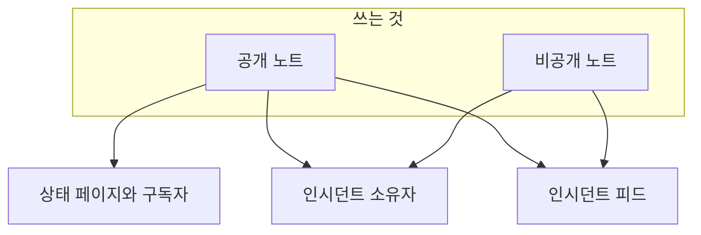
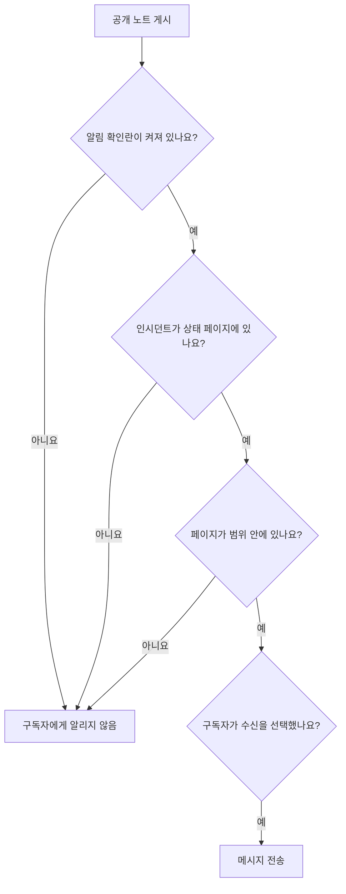

# 인시던트 메모, 소유자 및 피드

인시던트에는 대응하는 동안 글로 된 기록이 쌓입니다. 고객을 위한 업데이트, 팀을 위한 작업 노트, 그리고 일어난 모든 일의 활동 피드입니다. 이 페이지에서는 공개 노트와 비공개 노트를 쓰는 방법, 각각이 누구에게 닿는지, 인시던트 피드, 그리고 모든 변경을 알림받는 소유자를 다룹니다.

:::cards
- [공개 노트 게시하기](#공개-노트-게시하기): 아는 것을 상태 페이지와 알림으로 고객에게 전합니다.
- [구독자가 알림을 받는 때](#공개-노트가-실제로-구독자에게-닿는-때): 공개 노트가 거치는 확인과 그 배지.
- [인시던트 피드](#인시던트-피드): 일어난 모든 일의 타임라인.
- [소유자](#소유자): 누가 책임지고, 무엇을 알림받는지.
:::

## 작동 방식

여러분이 쓰는 것 중 일부는 고객을 위한 것입니다. 잘못된 배포를 찾았다고 02:14에 상태 페이지에 올리는 업데이트가 그렇습니다. 나머지는 팀을 위한 것입니다. 누군가 붙여 넣은 스택 추적, 마침내 이해된 그래프, 장애 조치를 하기로 한 결정 등입니다. OneUptime은 이 두 독자를 분리한 채 둘 다 인시던트에 기록합니다.

**공개 노트**는 상태 페이지에 게시되며 구독자에게 알릴 수 있습니다. **비공개 노트**(`IncidentInternalNote` 모델)는 대시보드 안에 머뭅니다. 둘 다의 바탕에는 인시던트에 일어난 모든 일을 기록하는 추가 전용 타임라인인 **인시던트 피드**와, 누구에게 알릴지 정하는 **소유자** 목록이 있습니다.

이 모든 것은 인시던트 사이드 메뉴에 있습니다. **노트 → 공개 노트**, **노트 → 비공개 노트**, **팀 → 소유자**입니다. 피드는 인시던트 **개요** 페이지에 있습니다.

## 공개 노트와 비공개 노트

두 종류의 노트는 대시보드에서 비슷해 보이지만 동작은 매우 다릅니다.

|                          | 공개 노트                                                           | 비공개 노트                                                     |
| ------------------------ | ------------------------------------------------------------------- | --------------------------------------------------------------- |
| 모델                     | `IncidentPublicNote`                                                | `IncidentInternalNote`                                          |
| 상태 페이지에 표시       | 예, 인시던트 타임라인의 일부로                                      | 절대 안 됨. 상태 페이지 앱의 어떤 것도 읽지 않습니다            |
| 게시 시각                | `postedAt`, 직접 설정할 수 있습니다                                 | 없음. `createdAt`으로 기록되고 정렬됩니다                       |
| 구독자에게 알림          | **Notify status page subscribers**가 켜져 있을 때                   | 절대 안 함. 구독자 관련 항목이 아예 없습니다                    |
| 첨부 파일에 접근할 수 있는 대상 | 상태 페이지 방문자(상태 페이지 경로를 통해)                  | 인증된 대시보드 API만                                           |
| 소유자에게 알림          | 예                                                                  | 예                                                              |

**"비공개"의 실제 뜻.** "상태 페이지에 게시되지 않는다"는 뜻이지 "소수의 사람에게만 제한된다"는 뜻이 아닙니다. 인시던트를 읽을 수 있는 기본 제공 역할은 두 종류의 노트를 모두 읽으므로, 인시던트를 읽을 수 있는 사람은 보통 그 비공개 노트도 읽을 수 있습니다. 사용자 지정 역할에서는 **Read Incident Status Page Note**와 **Read Incident Internal Note**라는 별개의 권한입니다. 인시던트를 볼 수 있는 사람 자체를 제한해야 한다면 인시던트의 **비공개 인시던트** 플래그(`isPrivate`)를 쓰세요. 인시던트가 모든 상태 페이지에서 숨겨지고, 인시던트의 소유자 사용자, 소유자 팀의 구성원, 프로젝트 관리자와 소유자로 제한됩니다.

**소유자는 둘 다 봅니다.** 소유자에게 알리는 작업은 공개 노트와 비공개 노트를 함께 조회합니다. 비공개 노트는 구독자에게 비공개일 뿐, 대응하는 사람에게 비공개인 것이 아닙니다.

| 하고 싶은 일                                           | 고를 것           |
| ------------------------------------------------------ | ----------------- |
| 아는 것과 다음 소식이 언제인지 고객에게 알리기         | **공개 메모**     |
| 다른 곳에 이미 보낸 업데이트를 시각을 앞당겨 기록하기  | **공개 메모**     |
| 가설, 실행한 명령, 막다른 길을 기록하기                | **비공개 메모**   |
| 힙 덤프나 내부 대시보드 스크린샷 첨부하기              | **비공개 메모**   |

## 공개 노트 게시하기

:::steps
### 공개 노트 열기

인시던트를 열고 사이드 메뉴에서 **노트 → 공개 노트**를 고릅니다. 노트 위의 작성기는 게시하기 전에 누가 노트를 읽을지 알려 줍니다: **Public · Visible on your status page**.

### 업데이트 쓰기

노트를 Markdown으로 쓰거나, **템플릿** 중 하나 또는 **Draft with AI**에서 시작합니다. 구독자가 봐야 할 파일이 있으면 **Attach**로 추가합니다.

### 누구에게 알릴지 정하기

구독자에게 알리려면 **Notify status page subscribers**를 선택한 채로 두고, 조용히 게시하려면 선택을 해제합니다. 그 아래의 **Will notify**는 노트가 닿을 상태 페이지를 보여 주고, **미리 보기**는 구독자가 받을 이메일을 보여 줍니다.

### 게시하기

**Post update**를 클릭하거나 Ctrl+Enter(Mac에서는 ⌘+Enter)를 누릅니다. 노트가 목록 맨 위에 나타나고, 알림 진행 상황을 보여 주는 배지가 붙습니다.
:::

같은 작성기는 인시던트 피드의 **작업** 메뉴에 있는 **Add Public Note**에서 대화 상자로도 열리므로([인시던트 피드](#인시던트-피드) 참고), 어느 곳에서든 노트를 같은 방식으로 씁니다.

| 컨트롤                             | 용도                                                                                                                                          |
| ---------------------------------- | --------------------------------------------------------------------------------------------------------------------------------------------- |
| 노트                               | Markdown으로 쓴 본문. 필수입니다.                                                                                                             |
| **템플릿**                         | 노트 템플릿 중 하나를 이미 입력한 내용 뒤에 넣습니다. [노트 템플릿](#노트-템플릿)을 참고하세요.                                            |
| **Draft with AI**                  | 인시던트를 바탕으로 노트 초안을 작성해 편집할 수 있게 합니다. [AI로 노트 생성하기](#ai로-노트-생성하기)를 참고하세요.                  |
| **Attach**                         | 상태 페이지에서 구독자와 공유하는 파일. 선택 사항입니다.                                                                                      |
| **Posted now**                     | 노트가 게시되었다고 표시할 시각. 여기서 더 이른 시각을 고르지 않으면 게시하는 순간이며, 현재 시간대로 표시됩니다.                             |
| **Notify status page subscribers** | 확인란. 기본적으로 켜져 있지만, 인시던트가 구독자에게 알리지 않고 선언되었다면 꺼진 채로 시작합니다. 끄면 조용히 게시합니다.                 |

**조용한 인시던트는 조용히 유지됩니다.** 인시던트가 **상태 페이지 구독자에게 알림**을 끈 채로(또는 비공개 인시던트로) 선언되었다면 구독자는 그 인시던트에 대해 아무것도 듣지 못했으므로, 공개 노트가 그들이 처음 듣는 소식이 되어서는 안 됩니다. 그런 인시던트에서는 확인란이 꺼진 채로 시작하며, 그 아래 줄에 이유가 설명됩니다. 그래도 선택하면 그 노트에 대해 구독자에게 알릴 수 있습니다. 명시적인 선택 없이 게시된 노트도 같은 규칙을 따릅니다. Slack과 Microsoft Teams의 노트, 워크플로우, 그리고 `shouldStatusPageSubscribersBeNotifiedOnNoteCreated`를 빠뜨린 API 요청입니다. 명시적인 `true` 또는 `false`는 항상 유지됩니다. [예정된 유지 관리 이벤트](/docs/status-pages/subscribers#예정된-유지-관리-이벤트)와 [인시던트 에피소드](/docs/status-pages/subscribers)의 공개 노트도, 이벤트나 에피소드 자체가 생성될 때 구독자에게 알렸는지에 따른 비슷한 규칙을 따릅니다. 에피소드를 비공개로 만들어도 영향은 없습니다.

**노트가 누구에게 닿을지 확인하세요.** **Notify status page subscribers**가 선택되어 있는 동안 그 아래의 **Will notify** 줄에는 노트가 갈 상태 페이지와 채널별 "최대" 구독자 수, 그리고 인시던트의 모니터를 나열하지만 알림을 받지 않을 페이지와 그 이유가 표시됩니다. 아무에게도 알리지 않으면 아무것도 표시하지 않지만, 인시던트가 상태 페이지에서 숨겨져 있거나 인시던트의 상태 페이지 범위가 원인이면 표시합니다. 인시던트의 상태 페이지 범위를 따르므로, 두 사이트 페이지로 제한된 인시던트의 노트는 그 둘에 닿는다고 말합니다. [대상별 상태 페이지](/docs/status-pages/one-status-page-per-audience)를 참고하세요.

**그들이 무엇을 받을지 확인하세요.** 같은 확인란 옆의 **미리 보기**는 쓰고 있는 노트에 대해 각 상태 페이지의 구독자가 받을 이메일과, 어떤 템플릿을 쓰는지와 그 이유를 보여 줍니다. 노트에 글이 들어가기 전까지는 회색으로 남습니다. **나에게 테스트 보내기**는 그 이메일을 내 계정 이메일로만 보냅니다. [구독자 및 공지](/docs/status-pages/subscribers#인시던트)를 참고하세요.

> [!TIP]
> **게시 시각이 노트의 실제 타임스탬프입니다.** 상태 페이지는 공개 노트를 입력한 시각이 아니라 `postedAt`으로 정렬하고 표시합니다. 40분 전에 보낸 업데이트로 상태 페이지를 따라잡고 있다면 **Posted now**를 고르고 실제로 일어난 시각을 설정하세요. API(`/api/incident-public-note`)로 게시 시각 없이 노트가 들어오면 OneUptime이 현재 시각을 기록합니다.

각 노트에는 작성자, 게시 시각, 첨부 파일과 함께 렌더링된 Markdown, 그리고 머리글에 구독자 알림 진행 상황이 표시됩니다. **Search notes…**는 내용으로 노트를 찾고, 피드는 최신순이나 오래된순으로 읽을 수 있습니다.

## 비공개 노트 게시하기

**노트 → 비공개 노트**는 일부러 더 단순합니다. **Private · Only your team can see this**라고 표시되는 같은 작성기이며, 노트, **템플릿**, **Draft with AI**, 그리고 인시던트 대응 팀을 위한 파일용 **Attach**가 있습니다. 인시던트 피드의 **작업** 메뉴에 있는 **비공개 노트 추가**는 이를 대화 상자로 엽니다. API에서 비공개 노트는 `/api/incident-internal-note`입니다.

게시 시각도, 구독자 확인란도 없습니다. 노트는 생성될 때 시각이 기록됩니다.

두 종류의 노트 모두 Markdown 편집기에서 씁니다. 편집기는 **들여쓰기**와 **내어쓰기**(또는 Tab과 Shift+Tab)로 목록 항목을 중첩하고, Word, Google Docs, 다른 OneUptime 페이지에서 붙여 넣은 것의 목록, 링크, 서식을 유지합니다. Ctrl+Z는 들여쓰기나 내어쓰기를 되돌리며, Visual 모드에서는 편집기가 넣은 블록과 붙여넣기도 입력과 함께 순서대로 되돌립니다. 노트에서 복사한 코드 블록은 코드 블록으로, 코드 블록에서 복사한 단어는 인라인 코드로 붙여 넣어집니다. [인시던트 선언](/docs/incidents/declaring-incidents#1단계-인시던트-세부-정보)을 참고하세요.

## 노트의 첨부 파일

두 종류의 노트 모두 작성기의 **Attach** 버튼으로 파일을 첨부할 수 있고, 둘 다 노트 본문 아래에 파일마다 **Download attachment** 링크가 있는 첨부 파일 목록을 표시합니다.

차이는 누가 파일을 가져올 수 있느냐입니다.

- **공개 노트 첨부 파일**은 노트 자체와 함께, 상태 페이지 방문자가 상태 페이지 경로를 통해 내려받을 수 있습니다.
- **비공개 노트 첨부 파일**은 인증된 대시보드 API로만 접근할 수 있습니다. 상태 페이지 경로는 없습니다.

따라서 첨부 파일도 노트 본문과 같은 공개/비공개 판단을 따릅니다. 고객을 위한 타임라인 이미지는 공개 노트에, 설정 덤프는 비공개 노트에 붙입니다.

이미지도 같은 판단을 따릅니다. 노트에 붙여 넣거나 끌어다 놓거나 **이미지 업로드**로 추가한 이미지는 인시던트의 프로젝트에 저장되어 노트 안에 표시되며, 누가 볼 수 있는지는 노트를 따릅니다.

- **비공개 노트 안의** 이미지는(또는 게시되기 전의 공개 노트 안의 이미지는) 프로젝트가 요구하는 방식으로 로그인한 프로젝트 구성원에게만 표시됩니다. 그 밖의 누군가가 주소를 열면 이미지가 없는 것처럼 아무것도 보이지 않습니다.
- **공개 노트 안의** 이미지는 노트를 볼 수 있는 모든 사람에게 표시됩니다. 상태 페이지에서도, 구독자가 받는 이메일에서도 마찬가지입니다. 공개 노트는 항상 인시던트와 함께 표시되며, 인시던트 없이 표시되는 일은 없습니다. 인시던트가 상태 페이지에서 숨겨져 있거나 비공개인 동안에는 그 노트의 이미지도 프로젝트 구성원에게만 표시됩니다.

모든 업로드는 대시보드에서든 API에서든 비공개로 시작합니다. 이미지는 상태 페이지가 보여 주는 무언가에 들어 있는 동안에만 모두가 볼 수 있습니다. 인시던트, 에피소드, 예정된 유지 관리 이벤트가 상태 페이지에 표시되는 동안의 공개 노트, 표시가 시작된 때부터의 공지, 인시던트가 **상태 페이지에 표시**이고 비공개가 아닌 동안의 인시던트 설명, 상태 페이지에도 게시된 경우의 포스트모템, 상태 페이지에 표시되는 동안의 에피소드나 예정된 유지 관리 이벤트의 설명(에피소드가 비공개인 동안은 제외), 그리고 상태 페이지 자체의 개요, 그룹, 리소스 설명입니다. 그것이 끝나면(인시던트가 숨겨지거나 비공개가 되거나, 이미지가 편집으로 빠지거나, 노트나 인시던트가 삭제되면), 상태 페이지가 보여 주는 다른 무언가에 여전히 들어 있지 않는 한 이미지는 다시 비공개가 됩니다. 양식의 설명과 감사 메시지도 양식이 제출을 받는 동안 같은 방식으로 이미지를 모두에게 보여 줍니다.

API, Terraform, 워크플로우로 노트를 읽으면 읽는 사람이 열 수 있는 첨부 파일(노트의 프로젝트 파일과 공개 파일)만 나열됩니다. 노트가 다른 프로젝트의 파일을 가리키는 첨부 파일은 노트에 없는 것처럼 목록에서 빠집니다.

## AI로 노트 생성하기

작성기에는 **Draft with AI** 버튼이 있으며, 두 노트 페이지와 피드의 **Add Public Note** 및 **비공개 노트 추가** 대화 상자에 있습니다. 인시던트를 프로젝트의 AI 제공자에게 보내고 생성된 Markdown을 노트에 넣으므로, 게시하기 전에 편집할 수 있습니다. 자동으로 게시되는 것은 없습니다.

| 대화 상자                          | 쓰는 내용                                                            | 템플릿                                                            |
| ---------------------------------- | -------------------------------------------------------------------- | ----------------------------------------------------------------- |
| **Generate Public Note with AI**   | 인시던트 데이터 분석에 기반한 고객용 노트.                           | **Status Update**, **Resolution Notice**, **Maintenance Update**  |
| **Generate Private Note with AI**  | 내부용 기술 노트.                                                    | **Investigation Update**, **Technical Analysis**, **Shift Handoff** |

버튼 뒤에서 대시보드는 고른 템플릿과 `public` 또는 `internal` 노트 유형을 붙여 `/incident/generate-note-from-ai/{incidentId}`로 보냅니다.

보내는 것은 인시던트의 텍스트입니다. 그 안에 포함된 이미지나 파일(예를 들어 설명에 붙여 넣은 스크린샷)은 `[image omitted: PNG, 340 KB]` 같은 짧은 메모로 바뀌고, 각 텍스트 항목은 16,000자로 잘리므로 큰 붙여넣기 하나가 나머지를 밀어내는 일은 없습니다. 인시던트 자체는 이미지를 그대로 유지합니다.

## 노트 템플릿

팀이 장애 때마다 같은 업데이트 세 가지를 쓴다면 한 번 저장해 두세요. 작성기의 **템플릿** 메뉴가 두 노트 페이지와 피드의 노트 대화 상자에서 그것들을 나열하며, 하나를 고르면 노트에 들어갑니다.

템플릿은 공개 노트와 비공개 노트가 함께 씁니다. 하나의 템플릿 목록이 둘 다에 쓰이며, 같은 템플릿을 어느 종류의 노트에도 넣을 수 있습니다.

템플릿의 자리 표시자(`{{incident.title}}`, `{{incident.state}}`, `{{incident.customFields.impact}}`, 그리고 [노트 템플릿](/docs/incidents/settings#노트-템플릿)에 나열된 나머지)는 노트 페이지에서도, **인지** 및 **해결** 대화 상자에서도 고르는 시점의 인시던트 값으로 채워집니다. 이미 입력한 내용은 바뀌지 않으며, 값이 없는 자리 표시자는 쓴 그대로 남습니다.

> [!IMPORTANT]
> 공개 노트를 게시하기 전에 채워진 노트를 읽으세요. `{{incident.affectedStatusPages}}`는 인시던트가 닿는 모든 상태 페이지의 이름을 나열하며, 그 모든 페이지의 구독자가 그것을 읽습니다.

템플릿은 **인시던트 → 설정 → 노트 템플릿**에서 관리합니다. 카드 제목은 **인시던트용 공개 또는 비공개 메모 템플릿**이며, 양식은 한 페이지입니다. **템플릿 이름**과 **템플릿 설명**(둘 다 필수), 그리고 본문입니다. 아직 템플릿이 없을 때는 **템플릿** 메뉴가 그렇다고 알려 주고 그곳으로 연결합니다.

## Slack이나 Microsoft Teams에서 노트 게시하기

워크스페이스를 연결했다면 대응자는 채널을 떠날 필요가 없습니다. Slack과 Microsoft Teams 모두 노트 추가 작업을 제공하며, **Note Type** 드롭다운(**Public Note**(상태 페이지에 게시) 또는 **Private Note**(팀 구성원만 볼 수 있음))과 **Note** 텍스트 상자가 있는 모달을 열고, 결과를 곧바로 인시던트에 기록합니다.

알아 둘 만한 세 가지:

- **중복 방지** — 각 노트는 원래의 Slack 메시지를 기록하므로(`postedFromSlackMessageId`, 형식은 `channel_id:message_ts`), 여러 사람이 같은 메시지에 반응해도 노트는 다섯 개가 아니라 하나만 생깁니다.
- **노트가 채널로 돌아옵니다** — 어느 종류의 노트를 게시하든 연결된 인시던트 채널에도 메시지가 갑니다. 노트의 피드 항목이 워크스페이스 알림을 켠 채로 만들어지기 때문입니다.
- **요청한 사람으로 게시됩니다** — 모달이나 반응에서 온 노트는 그 사람의 OneUptime 권한으로 게시되므로, 인시던트에 그 종류의 노트를 게시할 권한이 필요합니다. 거부되면 Slack에서는 다이렉트 메시지로, Microsoft Teams에서는 대화 안에서(반응이라면 메시지의 스레드에서) 이유가 전달되고, 아무것도 게시되지 않습니다.

## 공개 노트가 실제로 구독자에게 닿는 때

**상태 페이지 구독자에게 알림**을 켠 채 공개 노트를 만들었다고 해서 그것만으로 이메일이 나간다는 보장은 없습니다. 노트는 일련의 확인을 통과해야 하며, 실패하면 오류를 내는 대신 구체적인 이유가 기록됩니다.

1. **상태 페이지 구독자에게 알림**이 켜져 있어야 합니다. 꺼져 있으면 노트가 만들어지는 순간 건너뜀으로 기록됩니다. 구독자에게 알리지 않고 선언된 인시던트에서는 꺼진 채로 시작합니다.
2. 노트는 아직 존재하는 인시던트에 속해야 합니다.
3. 인시던트에 모니터가 하나 이상 연결되어 있어야 합니다. 모니터가 없으면 노트를 보낼 상태 페이지 리소스가 없습니다.
4. 인시던트의 **상태 페이지에 표시** 플래그(`isVisibleOnStatusPage`)가 true이고, 인시던트가 비공개(`isPrivate`)가 아니어야 합니다. 비공개 인시던트는 플래그와 관계없이 모든 상태 페이지에서 숨겨집니다. [인시던트를 상태 페이지에 내보내지 않기](/docs/incidents/states-and-severities#인시던트를-상태-페이지에-내보내지-않기)를 참고하세요.
5. 인시던트가 닿는 각 상태 페이지에서 **인시던트 표시**(`showIncidentsOnStatusPage`)가 켜져 있어야 합니다. 닿는 페이지란 모니터를 나열하는 페이지를, 인시던트가 제한되어 있다면 제한된 페이지로 좁힌 것입니다. 어떤 페이지로도 제한되지 않은 인시던트는 제한된 인시던트만 보여 주는 페이지를 건너뜁니다. [대상별 상태 페이지](/docs/status-pages/one-status-page-per-audience)를 참고하세요.
6. 각 구독자가 자신의 설정을 통과해야 합니다. 구독을 해지하지 않았고, 페이지가 구독자에게 선택을 허용한다면 이 리소스와 `Incident` 이벤트 유형을 구독하고 있어야 합니다.

> [!NOTE]
> **알림은 즉시 가지 않습니다.** 알림을 보내는 작업은 1분에 한 번 실행되므로, 노트를 저장하고 메일이 나가기까지 최대 1분 정도 걸린다고 생각하세요. 노트의 **Notifying subscribers soon**과 인시던트 자체 알림의 **Sending Soon**이 그 뜻입니다.

공개 노트의 머리글에는 전체 진행을 보여 주는 배지가 있습니다. 클릭하면 무슨 일이 있었는지 말해 주는 알림의 상태 메시지가 표시됩니다.

| 배지                           | 뜻                                                                                                                                                |
| ------------------------------ | ------------------------------------------------------------------------------------------------------------------------------------------------- |
| **Subscribers not notified**   | 아무것도 전송되지 않았습니다. 노트가 **상태 페이지 구독자에게 알림**을 해제한 채 게시되었거나, 위의 관문 중 하나에서 멈췄습니다. 이유가 기록됩니다. |
| **Notifying subscribers soon** | 대기열에 들어가 전송 작업의 다음 실행을 기다리고 있습니다.                                                                                        |
| **Notifying subscribers**      | 작업이 구독자 목록을 처리하고 있습니다.                                                                                                           |
| **Subscribers notified**       | 모든 구독자에게 메시지가 전송되었습니다. 상태 메시지에 상태 페이지별로 채널마다 몇 건이 나갔는지 나열됩니다.                                       |
| **Notification failed**        | 일부 구독자에게 전송되지 않았거나, 작업이 오류로 멈췄습니다. 상태 메시지가 어느 쪽인지 알려 줍니다.                                               |

**전송됨은 실제로 전송되었다는 뜻입니다.** 작업은 모든 메시지를 기다립니다. 이메일이나 문자 메시지는 메일 서버나 SMS 제공자가 받았을 때, Slack, Microsoft Teams, 웹훅 메시지는 상대가 응답했을 때 전송된 것으로 셉니다. 거부되거나, 오류가 나거나, 4분 안에 응답이 없는 메시지는 실패로 세며, 실패가 하나라도 있으면 배지가 **Notification failed**가 됩니다. 다른 구독자에게는 계속 전송됩니다. 이때 상태 메시지는 `Not every subscriber was sent this notification: 2 of 61 messages failed. Site 03: 41 email sent. Site 07: 16 email, 2 SMS sent; 2 email failed.`처럼 표시됩니다. "전송됨"은 OneUptime이 볼 수 있는 범위까지입니다. 메일 서버가 나중에 이메일을 반송할 수도 있습니다.

:::details 큰 페이지와 긴 전송
상태 페이지의 구독자는 모두에게 닿을 때까지 10,000명씩 읽히며, 동시에 20개의 메시지가 전송 중입니다. 알림 하나는 20분이 지나면 새 메시지를 시작하지 않습니다. 그때까지 닿지 못한 대상이 나열되고 **Notification failed**로 표시됩니다. 중간에 중단된 전송(서버가 다시 시작되었거나 응답을 멈춘 경우)도 **Notifying subscribers** 상태로 40분이 지나면 `Interrupted:`로 시작하는 메시지와 함께 **Notification failed**로 표시되므로, 영원히 그 상태로 남지 않습니다. [구독자 및 공지](/docs/status-pages/subscribers)를 참고하세요.
:::

### 노트의 알림 다시 보내기

노트의 알림 배지를 클릭하면 무슨 일이 있었는지 볼 수 있습니다. 알림이 실패한 노트에는 **알림 다시 시도**가, 알림이 나간 노트에는 **알림 다시 보내기**가 있습니다. 둘 다 먼저 확인을 묻습니다. 확인 창에는 노트가 지금 닿을 상태 페이지와 채널별 "최대" 수가 나열되거나, 아무에게도 닿지 않는다고 표시되며, 무슨 일이 일어날지 설명합니다. 둘 다 노트를 대기 상태로 되돌려 다음 실행에서 처리되게 하며, 이미 받은 구독자를 포함해 인시던트가 지금 닿는 모든 상태 페이지로 보냅니다. 노트를 게시한 뒤 인시던트를 제한한 페이지를 바꿨다면, 지금 제한된 페이지로 갑니다. **상태 페이지 구독자에게 알림**을 해제한 채 게시한 노트에는 처음부터 보낼 의도가 없었으므로 둘 다 제공되지 않으며, 알림이 아직 대기 중이거나 전송 중인 동안에도 둘 다 제공되지 않습니다. 예정된 유지 관리 이벤트와 인시던트 에피소드의 공개 노트는 실패 후의 **알림 다시 시도**만 유지합니다.

노트의 알림을 다시 보내면 게시할 때처럼 모든 구독자에게 노트 내용이 전달되므로, 구독자에게 알리는 공개 노트를 게시할 권한과 공개 노트를 편집할 권한이 모두 필요합니다. API에서는 대시보드와 같은 업데이트로 `subscriberNotificationStatusOnNoteCreated`를 `Pending`으로 되돌립니다. 이 권한이 없는 호출자, 구독자에게 알리지 않고 게시된 노트, 노트의 알림이 전송 중인 동안에는 거부됩니다.

:::details 인시던트 '생성' 알림이 재개되는 방식
멈춘 곳에서 재개하는 것은 인시던트의 '생성' 알림뿐입니다. 완전히 보낸 상태 페이지의 기록을 갖고 있어, 인시던트 **개요**의 **다시 시도**가 그 페이지를 건너뜁니다. 기록은 구독자가 아니라 상태 페이지 단위이므로, 중간에 멈춘 페이지는 그 페이지에서 이미 받은 구독자를 포함해 다시 전부 받습니다. **다시 시도** 확인 창에는 **이미 도달한 페이지를 포함해 모든 상태 페이지에 다시 보내기**가 있어, 선택하면 버튼이 **모든 페이지에 다시 보내기**로 바뀌며, 성공 후의 **다시 보내기**는 모든 페이지로 다시 보냅니다. [대상별 상태 페이지](/docs/status-pages/one-status-page-per-audience#adding-status-pages)를 참고하세요.
:::

### 공개 노트 편집하기

**공개 노트 편집은 요청하지 않는 한 조용히 이루어집니다.** 노트의 편집 양식에는 **이 업데이트를 구독자에게 알림** 확인란이 있으며, 매번 해제된 상태로 시작합니다. 구독자가 알아야 할 변경이라면 선택하세요. 구독자는 업데이트로 표시된 편집된 노트를 받습니다. 그러면 노트에는 원래 배지 옆에 업데이트용 두 번째 배지가 표시되며, 실패 시 자체 **알림 다시 시도**가 있습니다.

| 업데이트 배지               | 뜻                                                  |
| --------------------------- | --------------------------------------------------- |
| **업데이트 대기 중**        | 전송 작업의 다음 실행을 기다리고 있습니다.          |
| **업데이트 전송 중**        | 작업이 구독자 목록을 처리하고 있습니다.             |
| **업데이트 전송됨**         | 모든 구독자에게 편집된 노트가 전송되었습니다.       |
| **업데이트 실패**           | 일부 구독자에게 전송되지 않았습니다.                |
| **업데이트 전송 안 됨**     | 위의 관문 중 하나에서 멈췄습니다.                   |

전송된 업데이트는 다시 제공되지 않습니다. 최신 내용을 보내려면 확인란을 선택한 채 노트를 편집하거나, 노트 자체를 다시 보내세요. 원래 알림이 아직 전송되지 않았다면 별도의 업데이트는 나가지 않고, 원래 알림이 편집 내용을 전합니다. 바로 그때 전송 중이라면 업데이트는 그것이 끝나기를 기다렸다가 나갑니다. 확인란과 업데이트의 **알림 다시 시도**에는 노트의 알림을 다시 보낼 때와 같은 권한이 필요합니다. 권한이 없어도 아무에게도 알리지 않고 노트를 편집할 수는 있습니다. [구독자 및 공지](/docs/status-pages/subscribers)를 참고하세요.

구독자가 받는 실제 메시지는 상태 페이지별, 채널별 템플릿으로 만들어집니다. 이메일, SMS, Slack, Microsoft Teams는 각각 **Subscriber Incident Note Created** 이벤트용 템플릿을 가지며, 상태 페이지 이름과 URL, 세부 정보 링크, 영향받는 리소스, 인시던트 심각도와 제목, 노트 본문, 인시던트의 레이블, 영향받는 상태 페이지와 사용자 정의 필드, 구독자별 구독 해지 링크를 위한 변수를 씁니다. 기본 이메일, Slack, Microsoft Teams 메시지에는 **구독자 알림에 포함**으로 표시된 인시던트 사용자 정의 필드도 현재 값과 함께 나열됩니다. 그 템플릿과 채널을 설정하는 방법은 [구독자 및 공지](/docs/status-pages/subscribers)를 참고하세요.

## 인시던트 피드

**인시던트 피드** 카드는 인시던트 **개요** 페이지의 왼쪽 열 맨 아래에 있습니다. 인시던트의 이야기를 순서대로 담은 것으로, 각 항목에는 아이콘, 그 일을 일으킨 사람의 아바타와 이름, 상대적 타임스탬프(마우스를 올리면 정확한 현지 시각), Markdown 본문이 있습니다. 기본적으로 최신 항목이 위에 있습니다.

일부 항목에는 추가 세부 정보가 있습니다. 예를 들어 소유자 알림은 메일을 받은 모든 사람을 나열하고, 구독자 알림은 보낸 상태 페이지마다 채널별 전송 및 실패 건수와 이메일 제목을 나열하며, 무언가를 보냈다면 메시지에 넣은 사용자 정의 필드 값이 **Custom fields sent** 아래에 이어집니다. 그런 항목에는 **More Information** 패널을 여는 **More Information** 버튼이 있습니다.

카드 머리글에는 타임라인을 떠나지 않고 작업할 수 있는 **작업** 메뉴도 있습니다.

- **Execute Runbook** — 이 인시던트에 대해 [런북](/docs/runbooks/index)을 시작합니다.
- **온콜 정책 실행** — 필요할 때 정책으로 호출합니다. 보관된 정책은 아무도 호출하지 않습니다. 인시던트의 실행 로그에는 정책이 보관되어 실행되지 않았다고 기록됩니다.
- **Add Public Note** — **공개 노트** 페이지의 작성기를 대화 상자로 엽니다. 노트를 쓰고 **Post update**를 누릅니다. 템플릿, **Draft with AI**, 첨부 파일, 누구에게 닿을지 보여 주는 **Notify status page subscribers**, **미리 보기**가 모두 있습니다. 노트는 지금 시각으로 게시되며, 시각을 앞당기려면 **Posted now**를 고릅니다.
- **비공개 노트 추가** — **비공개 노트** 페이지의 작성기를 대화 상자로 엽니다. 노트를 쓰고 **Add note**를 누릅니다.

노트를 쓸 수 없는 사람에게는 두 노트 작업이 모두 부족한 권한을 밝히며 잠깁니다. 노트를 게시하면 대화 상자가 닫히고 피드에 노트가 표시됩니다.

그 밖의 모든 것은 옆의 **⋯** 버튼(표 카드 머리글에 있는 것과 같은 **추가 옵션** 버튼) 안에 있어, 머리글에는 가능한 한 적은 버튼만 표시됩니다.

- **최신순** / **오래된순** — 피드를 읽는 순서. 사용 중인 쪽에 체크 표시가 붙으며, 브라우저가 모든 인시던트의 피드에 대해 선택을 기억합니다.
- **이벤트 유형으로 필터링** — 피드의 이벤트 유형을 각 항목의 아이콘과 함께 나열하는 대화 상자이며, 목록이 길면 검색 상자도 있습니다. 보여 줄 것을 선택하고 **필터 적용**을 고릅니다. 아무것도 선택하지 않으면 모든 이벤트 유형이 표시됩니다. 피드가 필터링되는 동안 그 위의 상자에 표시 중인 이벤트 유형 수와 각각의 칩, **필터 편집**, **필터 지우기**가 표시됩니다. 필터는 저장되지 않습니다. 인시던트를 떠나면 피드는 다시 모든 것을 보여 줍니다.
- **새로고침** — 피드를 다시 가져옵니다.

> [!NOTE]
> **피드는 추가 전용이며 감사 로그가 아닙니다.** API로 피드 항목을 만들고 읽을 수는 있지만 수정하거나 삭제할 수는 없으므로, 아무도 인시던트의 기록을 몰래 다시 쓸 수 없습니다. 영구적이지도 않습니다. 과금되는 설치 환경에서는 3년보다 오래된 피드 행이 삭제됩니다. 누가 무엇을 바꿨는지에 대한 지속적인 기록은 인시던트 사이드 메뉴의 **고급 → 감사 로그**를 쓰세요.

## 피드가 기록하는 것

피드 항목을 쓰는 것은 인시던트 서비스 자체, 두 노트 서비스, 상태 타임라인, 소유자와 구성원 변경, 알림 연결과 연결 해제, 규칙 엔진, 온콜 실행, AI 조사 및 포스트모템 실행기, 그리고 알림 cron 작업입니다. 이벤트 유형은 다음과 같습니다.

- **인시던트 자체** — `IncidentCreated`, `IncidentUpdated`, `IncidentStateChanged`. `IncidentUpdated` 항목은 편집이 무엇을 바꿨는지 기록합니다. 제목, 설명, 근본 원인, 해결 노트, 레이블, 심각도, 모니터와 그 모니터에 설정한 상태, 그리고 인시던트의 범위에 추가되거나 빠진 상태 페이지입니다. 바뀐 값마다 한 줄이 있고 그대로 저장된 값은 줄이 없으므로, 아무것도 바꾸지 않고 카드를 저장하거나 API 클라이언트나 워크플로우가 인시던트를 그대로 다시 써도 항목이 전혀 추가되지 않습니다. 같게 읽히는 텍스트는 같은 것으로 보며(줄 끝과 앞뒤 공백은 제외), 레이블은 순서와 관계없이 같은 집합이면 같습니다. 지운 값은 제거된 것으로 읽히고, 모든 레이블을 떼면 "All labels removed."로 표시됩니다. 알림의 **Alert updated** 항목도 같은 방식으로 동작합니다.
- **노트와 문서** — `PublicNote`, `PrivateNote`, `RootCause`, `RemediationNotes`, `PostmortemNote`. `PostmortemNote` 항목은 포스트모템을 저장할 때마다가 아니라 포스트모템의 노트가 바뀔 때 기록됩니다.
- **사람** — `OwnerUserAdded`, `OwnerTeamAdded`, `OwnerUserRemoved`, `OwnerTeamRemoved`, `IncidentMemberAdded`, `IncidentMemberRemoved`.
- **연결된 알림** — `AlertLinked`와 `AlertUnlinked`로, **경고 연결됨**과 **경고 연결 해제됨**으로 표시됩니다.
- **알림** — `OwnerNotificationSent`, `SubscriberNotificationSent`, `OnCallPolicy`, `OnCallNotification`.
- **자동화** — `LabelRuleExecuted`, `OwnerRuleExecuted`, `PrivacyRuleExecuted`, `OnCallRuleExecuted`, `AutoRemediation`.
- **화상 통화** — `VideoCallStarted`와 `VideoCallFailed`. 인시던트를 위해 시작한 통화와 참여 링크, 또는 제공자가 통화를 시작하지 못한 이유입니다. [화상 통화](/docs/workspace-connections/video-calls)를 참고하세요.

유형마다 고유한 아이콘이 있어, 긴 피드를 훑어보며 잡담 속에서 상태 변경을 골라낼 수 있습니다. AI가 생성한 근본 원인 분석은 따로 표시되며 제한된 Markdown 모드로 렌더링됩니다. **인시던트 생성됨** 항목, 새 제목을 기록하는 항목, 에피소드 합류나 이탈 항목은 제목을 입력한 그대로 보여 줍니다. 제목 안의 `\`, `[`, `]`, `*`, `_`, `~`, 백틱, \<를 이스케이프하므로, 제목이 이미지, 원시 HTML, \<!here\> 같은 Slack 멘션, 링크 대상을 숨기는 텍스트의 링크, 굵은 글씨, 기울임, 코드가 되는 일은 없습니다. 제목 안의 주소는 여전히 같은 주소로의 링크로 표시됩니다.

알림을 연결하면 알림에도 기록됩니다. 알림에는 자체 피드가 있어, 같은 변경이 인시던트 이름과 함께 **인시던트에 연결됨**(`LinkedToIncident`) 또는 **인시던트에서 연결 해제됨**(`UnlinkedFromIncident`)으로 표시됩니다. Slack과 Microsoft Teams에 게시되는 것은 인시던트의 **경고 연결됨**과 **경고 연결 해제됨** 항목뿐이므로, 각 연결은 한 번만 알려집니다. 알림에서 선언된 인시던트에는 알림마다 하나가 아니라 모두를 나열하는 **경고 연결됨** 항목이 하나만 붙으며, 비공개 알림이나 인시던트의 제목은 상대편 항목에 쓰이지 않습니다. [연결된 알림](/docs/incidents/linked-alerts)을 참고하세요.

피드는 인시던트의 개인정보를 존중합니다. 비공개 인시던트에서는 피드 읽기가 인시던트와 같은 방식으로 필터링됩니다.

## 소유자

소유자는 인시던트를 책임지는 사람과 팀입니다. 인시던트에 일어나는 모든 일의 알림 대상이며, 모두가 다른 누군가가 맡고 있으리라 생각하는 사이 인시던트가 방치되지 않게 하는 이유입니다.

인시던트 사이드 메뉴에서 **팀 → 소유자**를 엽니다. **소유자** 카드에는 개수 배지가 표시되고, 소유자를 이 인시던트를 책임지며 변경을 알림받는 사람과 팀으로 설명하며, "2 people · 1 team" 같은 현재 수를 보여 줍니다. 소유자는 겹쳐진 아바타로 표시되며, 마우스를 올리면 그 사람의 이메일이나 **팀** 표시가 나타납니다.

- **소유자 추가**를 클릭하면 사람이나 팀을 검색하는 상자가 있는 선택기가 열립니다.
- 아바타의 제거 컨트롤을 클릭하면 **소유자 제거** 확인 창이 열리며, **제거**를 누릅니다.
- 아직 소유자가 없으면 카드에 그렇게 표시되고, 변경을 알림받을 수 있도록 팀원이나 팀을 추가하라고 안내합니다.

소유자 사용자와 소유자 팀은 별개의 기록입니다. 팀을 추가하면 그 팀의 모든 구성원이 하나하나 나열되지 않고도 알림 목적상 소유자가 됩니다. API에서는 `/api/incident-owner-user`와 `/api/incident-owner-team`입니다.

소유자가 될 수 있는 것은 프로젝트 자체의 팀과 구성원뿐입니다. 선택기는 그들만 보여 주며, API, Terraform, 워크플로우로 추가하는 소유자에도 같은 규칙이 적용됩니다. 다른 프로젝트의 팀이나 프로젝트 구성원이 아닌 사람은 거부됩니다.

## 소유자가 지정되는 방식

소유자 목록에 오르는 경로는 네 가지입니다.

- **인시던트 템플릿에서** — 템플릿에는 **소유자** 항목이 있습니다. 인시던트를 소유하고 생성되거나 업데이트될 때 알림을 받는 사람과 팀으로, **소유자 추가**와 같은 목록에서 고릅니다. 템플릿에서 인시던트를 만들면 미리 채워지고, 인시던트의 Slack과 Microsoft Teams 채널이 생긴 뒤에 추가되므로, 인시던트 소유자를 새 채널에 초대하는 알림 규칙은 이들도 초대합니다. 대시보드와, **Incident Template**을 고른 워크플로우의 **Create One Incident** 단계는 "추가되었습니다" 알림 없이 이들을 추가하고, 템플릿이 있는 [양식](/docs/forms/on-submit)은 이들에게 알리며 이들이 추가될 때까지 인시던트의 **인시던트 생성됨** 알림을 보류합니다. [인시던트 선언](/docs/incidents/declaring-incidents)을 참고하세요.
- **인시던트 소유자 규칙에서** — 일치하는 규칙이 생성 시 자동으로 소유자를 추가합니다.
- **API로 생성할 때** — 생성 호출과 함께 전달된 소유자 사용자와 팀도 채널이 생긴 뒤에 같은 방식으로, "추가되었습니다" 알림 없이 추가됩니다.
- **직접** — 인시던트 중 언제든 **소유자** 페이지의 **소유자 추가** 컨트롤로 추가합니다.

같은 사람을 두 번 추가해도 안전합니다. 이미 지정된 소유자는 중복되지 않습니다.

## 인시던트 소유자 규칙

**인시던트 소유자 규칙**은 일치하는 인시던트가 생성될 때 소유자 사용자와 팀을 자동으로 지정합니다. 데이터베이스 인시던트가 누구도 신경 쓰지 않아도 데이터베이스 팀에 가도록 하는 라우팅 계층입니다. **인시던트 → 규칙 → 소유자 규칙**에 있으며, 나머지 인시던트 자동화는 [인시던트 설정 및 자동화](/docs/incidents/settings)에서 다룹니다.

규칙 양식은 두 단계입니다. 인시던트가 충족해야 할 조건인 **일치**, 그다음 규칙이 추가하는 것인 **소유자**입니다.

- **소유자** — **소유자 추가**가 사람과 팀의 목록 하나를 엽니다. 추가할 것을 각각 클릭하고, 고른 것은 칩의 **×**로 뺍니다. 규칙이 일치하면 고른 모든 사람과 팀이 소유자로 추가되며, 이미 지정된 소유자는 중복되지 않습니다.
- **소유자 상속**(**소유자** 아래에 접혀 있음) — 이름을 지정하는 대신 관련된 것에서 소유자를 지정합니다. **모니터에서 소유자 상속**은 인시던트 모니터의 모든 소유자를 인시던트의 소유자로 만들고, **호스트에서 소유자 상속**, **Kubernetes 클러스터에서 소유자 상속**, **Docker 호스트에서 소유자 상속**, **Inherit Owners From Podman Hosts**, **서비스에서 소유자 상속**은 그 리소스들에 대해 같은 일을 합니다.

새 규칙은 누군가를 추가해야 합니다. 소유자를 하나 이상 고르거나 **소유자 상속** 스위치를 켜세요. API와 Terraform도 아무도 추가하지 않는 새 규칙을 거부합니다. 규칙의 **이름**은 직접 이름을 입력할 때까지 고른 소유자로부터(상속만 하는 규칙이라면 스위치로부터: _Inherit owners from monitors_) 채워집니다. 규칙을 편집할 때는 소유자를 요구하지 않으므로, 아무것도 추가하지 않는 오래된 규칙도 이름을 바꾸거나 끌 수 있으며, 목록에는 **추가하는 항목 없음**으로 표시됩니다. [레이블 및 소유자 규칙](/docs/configuration/label-and-owner-rules)을 참고하세요.

**추가 필드** 아래의 **소유자에게 알림**은 사람들에게 알릴지 결정합니다. 실제 라우팅이라면 켜 두고, 소유자를 조용히 추가하려면 끄세요. 규칙이 호출이 아니라 기록을 위한 편의일 때 유용합니다.

규칙이 실행될 때마다 인시던트 피드에 기록되므로, 사람이 규칙으로 추가되었는지 사람이 직접 추가했는지 언제든 알 수 있습니다.

## 소유자가 받는 알림

소유자에게 알리는 작업은 다섯 가지이며, 각각 1분에 한 번 실행됩니다.

| 알림                       | 시점                                                         | 이메일 제목                                                    |
| -------------------------- | ------------------------------------------------------------ | -------------------------------------------------------------- |
| **인시던트 생성됨**        | 인시던트가 선언될 때.                                        | `[New Incident {number}] - {title}`                            |
| **노트가 게시됨**          | 공개 *또는* 비공개 노트가 게시될 때.                         | `[Update Incident {number}] - {title}`                         |
| **상태가 바뀜**            | 인시던트가 다른 상태로 옮겨질 때.                            | `[{State} Incident {number}] - {title}`                        |
| **소유자로 추가됨**        | 여러분이 소유자로 추가될 때.                                 | `You have been added as the owner of Incident {number} - {title}` |
| **아직 해결되지 않음**     | 인시던트의 다음 리마인더 시각에 따른 리마인더.               | `[Reminder] Incident {number} is still {state} - {title}`      |

각 알림은 그 사람이 **사용자 설정 → 알림 설정**에서 켠 채널(이메일, SMS, 음성 통화, 푸시, WhatsApp, Telegram, Slack, Microsoft Teams, 웹훅)로 나가며, 실제로 무엇이 전송될지는 그것이 정합니다. 받는 사람은 각각을 따로 끌 수 있습니다. 사용자별 설정은 인시던트 생성, 노트 게시, 상태 변경, 소유자 추가, 구성원 할당, 아직 열려 있음 리마인더 알림을 보낼지로 표현되어 있습니다. 상태 변경 때만 전화를 받고 싶은 사람은 정확히 그렇게 할 수 있습니다. 상태 변경이 무엇을 뜻하는지는 [인시던트 상태 및 심각도](/docs/incidents/states-and-severities)를 참고하세요.

**소유자가 없는 인시던트도 조용하지 않습니다.** 인시던트에 소유자가 전혀 없으면 알림 작업은 프로젝트 소유자에게 대신 보내므로, 아무것도 놓치지 않습니다. 템플릿에 소유자가 있는 양식으로 보고된 인시던트의 **인시던트 생성됨** 알림은 대신 그 소유자를 기다립니다. 알림받은 각 사람은 해당 피드 항목에도 추가되므로, 나중에 누구에게 어떤 주소로 알렸는지 정확히 확인할 수 있습니다.

## 다음 단계

:::cards
- [인시던트 설정 및 자동화](/docs/incidents/settings): 소유자 규칙, 노트 템플릿, 그 밖의 자동화.
- [구독자 및 공지](/docs/status-pages/subscribers): 공개 노트가 어디에 도착하고 누가 받는지.
- [대상별 상태 페이지](/docs/status-pages/one-status-page-per-audience): 인시던트의 노트가 어떤 상태 페이지에 닿는지.
- [인시던트 상태 및 심각도](/docs/incidents/states-and-severities): 피드의 절반을 움직이는 상태 머신.
:::
