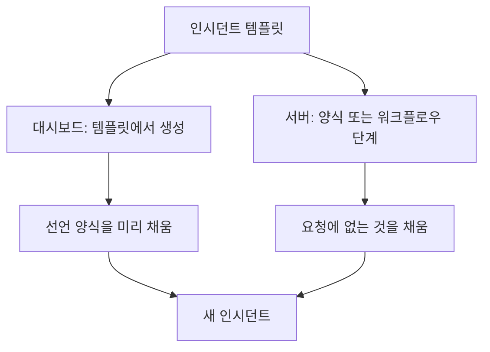
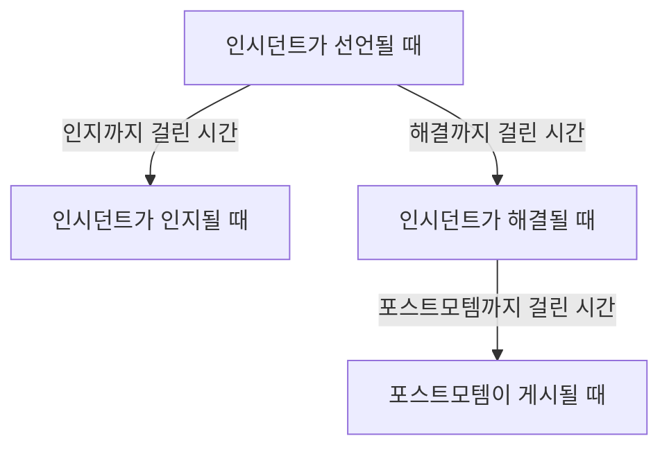
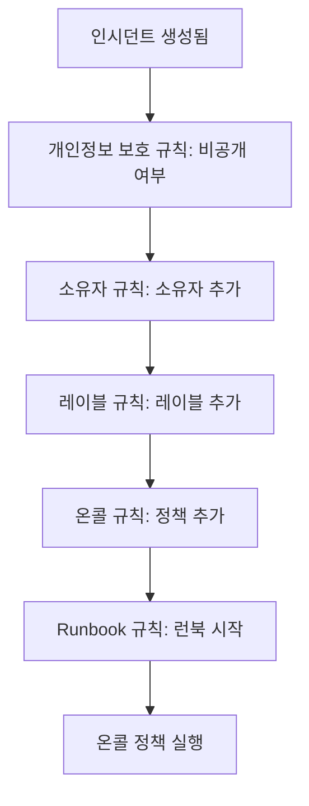

# 인시던트 설정 및 자동화

인시던트 설정은 **프로젝트 설정**이 아니라 **인시던트** 안에 있습니다. 상태와 심각도, 템플릿, 사용자 정의 필드, 역할, 측정과 번호 접두사, 그리고 모든 새 인시던트에 작용하는 규칙입니다. 이 페이지는 그 각 페이지와, 인시던트가 선언되는 순간 저절로 실행되는 것에 대한 참조입니다.

:::cards
- [인시던트 템플릿](#인시던트-템플릿): 같은 종류의 인시던트를 매번 미리 채운 상태로 선언합니다.
- [사용자 정의 필드](#사용자-정의-필드): 모든 인시던트에 자체 항목을 두고, 선언할 때 묻습니다.
- [측정](#측정): 인지, 해결, 완화까지 걸린 시간을 모든 인시던트에 대해 계산합니다.
- [규칙](#인시던트가-생성될-때-실행되는-규칙): 소유자, 레이블, 호출, 에피소드를 자동으로 설정합니다.
:::

## 인시던트 설정이 있는 곳

상단 바의 **제품** 메뉴에서 **인시던트**를 연 다음, 사이드 메뉴 맨 아래의 **설정**을 펼칩니다. **규칙**과 **설정**은 둘 다 접힌 채로 시작하므로, 아래 페이지가 나타나기 전에 펼치세요. 여기 있는 모든 것은 프로젝트 범위입니다. 템플릿, 역할, 사용자 정의 필드, 규칙은 한 프로젝트에 속하며 그 프로젝트에서 선언되는 모든 인시던트에 적용되고, 경로는 `/dashboard/{projectId}/incidents/settings/`로 시작합니다.

| 페이지                       | 하는 일                                                                                      |
| ---------------------------- | -------------------------------------------------------------------------------------------- |
| **인시던트 상태**            | 인시던트가 거치는 상태를 추가하고, 이름과 색상을 바꾸고, 순서를 정합니다.                    |
| **인시던트 심각도**          | 심각도 수준을 추가하고, 이름과 색상을 바꾸고, 순서를 정합니다.                               |
| **인시던트 템플릿**          | 인시던트 전체(제목, 설명, 리소스, 온콜 정책, 소유자, 레이블)를 미리 채웁니다.                |
| **노트 템플릿**              | 공개 노트와 비공개 노트에 다시 쓰는 텍스트.                                                  |
| **포스트모템 템플릿**        | 다시 쓰는 포스트모템 구조.                                                                   |
| **사용자 정의 필드**         | 모든 인시던트에 나타나는 추가 항목을 정의합니다.                                             |
| **인시던트 역할**            | 인시던트 책임자처럼 대응자를 지정하는 역할을 정의합니다.                                     |
| **측정**                     | 인지까지 걸린 시간이나 해결까지 걸린 시간처럼, 일이 얼마나 걸리는지 모든 인시던트에서 잽니다. |
| **연결된 경고**              | 인시던트에 연결된 알림을 인시던트와 함께 인지하고 해결할지 고릅니다. 새 프로젝트에서는 둘 다 켜져 있습니다. |
| **번호 접두사**              | 인시던트와 에피소드 번호 앞의 텍스트. 예를 들어 `INC-42`의 `INC-`.                           |

OneUptime AI가 스스로 하는 일은 여기서 설정하지 않습니다. AI에는 자체 섹션 **인시던트 → AI**가 있으며, 경로는 `/dashboard/{projectId}/incidents/ai/`로 시작합니다. 그 **설정** 페이지는 새 인시던트 조사, 인시던트 자동 수정(켜기 전까지는 꺼져 있으며, 수정의 일부인 수정용 및 누락된 텔레메트리용 풀 리퀘스트가 그 아래에 묶여 있습니다), 포스트모템 초안 작성을 켜고 끄며, 각각 바꾸는 즉시 저장됩니다. 조사하고 수정할 인시던트를 좁히는 조사 규칙과 자동 해결 규칙, 그리고 AI가 지키는 선택적 한도는 **추가 설정** 아래에 접혀 있으며, 설정하기 전에는 아무것도 적용되지 않습니다. 그 옆에는 **인사이트**와 **로그**가 있어, AI가 인시던트에서 배운 것과 AI가 한 모든 일을 볼 수 있습니다. [AI SRE](/docs/ai/ai-sre)를 참고하세요.

**인시던트 상태**와 **인시던트 심각도**는 [인시던트 상태 및 심각도](/docs/incidents/states-and-severities)에서 자세히 다루므로, 이 페이지의 나머지는 **인시던트 템플릿**부터 이어집니다. 팀 외부 사람이 인시던트를 보고할 수 있게 하는 양식은 별도의 제품입니다. [양식](/docs/forms/index)을 참고하세요. [Huntress](/docs/integrations/huntress)처럼 스스로 인시던트를 여는 도구는 **인시던트 → 연동**에서 설정합니다.

**규칙**을 펼치면 페이지가 여덟 개 더 있습니다. **그룹화 규칙**, **온콜 규칙**, **소유자 규칙**, **Runbook 규칙**, **개인정보 보호 규칙**, **레이블 규칙**, **SLA 규칙**, **Reminder Rules**입니다. 이들은 아래에서 다룹니다.

## 인시던트 템플릿

인시던트 템플릿은 저장해 둔 인시던트의 뼈대입니다. 결제 클러스터가 흔들릴 때마다 같은 제목, 같은 모니터 목록, 같은 온콜 정책을 다시 입력하는 대신, 한 번 저장해 두고 거기서 선언합니다.

:::steps
1. **인시던트 → 설정 → 인시던트 템플릿**(`/dashboard/{projectId}/incidents/settings/templates`)으로 이동합니다. 카드 제목은 **인시던트 템플릿**입니다.
2. **인시던트 템플릿 만들기**를 클릭합니다. **템플릿 정보**에서 템플릿 이름을 정하고, **인시던트 세부 정보**에서 템플릿이 선언할 인시던트의 **제목**, **인시던트 심각도**, **설명**을 채웁니다.
3. **다음**으로 선택 단계(영향을 주는 리소스, 사용자 정의 필드, 온콜 정책)를 진행하며, 이런 종류의 인시던트가 모두 공유하는 것을 채웁니다.
4. 마지막 단계에서 **인시던트 템플릿 만들기**를 클릭합니다. 이제부터 인시던트 목록의 **템플릿에서 생성**에 이 템플릿이 나옵니다.
:::

만들기는 네 단계 마법사로 진행되며, 프로젝트에 인시던트 사용자 정의 필드가 있으면 두 단계가 더해집니다. 반드시 답해야 하는 것은 처음 두 단계뿐입니다. **다음**으로 그 뒤의 선택 단계를 지나며, **인시던트 템플릿 만들기**는 마지막 단계에 있습니다.

- **템플릿 정보** — **템플릿 이름**과 **템플릿 설명**. 템플릿 자체의 이름이며, 인시던트에는 나타나지 않습니다.
- **인시던트 세부 정보** — **제목**, **설명**(Markdown), **인시던트 심각도**. **추가 필드** 아래(접힌 머리글에 세 항목의 이름과 설정된 것이 표시됩니다)에는 다음이 있습니다.
  - **초기 인시던트 상태** — 템플릿에서 선언한 인시던트가 시작하는 상태. 선언 양식처럼 처음에는 비어 있으며, 선택지는 상태 순서대로 나열됩니다. 자리 표시자가 말하듯 비워 두면 일반적인 시작 상태, 즉 모든 새 인시던트가 시작하는 프로젝트의 생성 상태에서 시작합니다. 상태와 함께 저장한 템플릿은 그 상태를 유지합니다.
  - **소유자** — 템플릿에서 선언한 인시던트를 소유하는 사람과 팀. **소유자 추가**가 둘 다 담은 목록 하나를 엽니다. 인시던트의 **소유자** 페이지와 같은 목록이며, 고른 것은 각각 뺄 수 있는 칩으로 표시됩니다. 기존 템플릿에서는 **소유자** 카드에 표시됩니다.
  - **레이블** — 템플릿에서 선언한 인시던트가 처음 갖는 레이블.
- **영향받는 리소스** — 선언 양식처럼 **모니터**, **모니터 상태를 다음으로 변경**, 그리고 호스트, 클러스터, 서비스를 위한 **기타 영향받는 리소스** 순이며, **다음 상태 페이지로 제한**은 **추가 필드** 아래에 있습니다. 템플릿은 모니터를 골랐든 안 골랐든 항상 **모니터 상태를 다음으로 변경**을 묻습니다. 템플릿에서 인시던트를 선언할 때 고른 모니터에도 적용되며, 선언 양식은 첫 모니터를 고르는 즉시 그것을 보여 주기 때문입니다. 기존 템플릿의 **영향받는 리소스** 카드도 같은 방식으로 묻고, 템플릿이 고른 상태를, 고르지 않았다면 **모니터는 현재 상태를 유지합니다.**를 보여 줍니다. **다음 상태 페이지로 제한**은 템플릿에서 선언한 인시던트를 그 모니터를 나열하는 상태 페이지 중 일부로 제한합니다. 예를 들어 `Region East outage` 템플릿은 동부 사이트 페이지를 담을 수 있습니다. 기존 템플릿에서는 **상태 페이지 범위 편집**이 있는 **상태 페이지 범위** 카드에 표시됩니다. [대상별 상태 페이지](/docs/status-pages/one-status-page-per-audience)를 참고하세요.
- **사용자 정의 필드** — 프로젝트에 인시던트 사용자 정의 필드가 있을 때만: 이 템플릿에서 선언한 인시던트가 처음 갖는 값. **세부 정보** 단계가 묻는 것뿐만 아니라 모든 필드가 제공되며, 필수인 것은 없습니다. 기존 템플릿에는 이를 바꾸는 **사용자 정의 필드** 카드가 있습니다.
- **생성 시 사용자 정의 필드** — 역시 프로젝트에 인시던트 사용자 정의 필드가 있을 때만: 이 템플릿에서 인시던트를 선언할 때 **세부 정보** 단계가 어떤 필드를 묻고, 어떤 필드를 반드시 채워야 하는지. 기존 템플릿에는 이를 바꾸는 **생성 시 사용자 정의 필드** 카드가 있습니다. [생성 시 사용자 정의 필드](#생성-시-사용자-정의-필드)를 참고하세요.
- **온콜** — **온콜 정책**. 이 템플릿으로 만든 인시던트가 선언될 때 실행할 정책입니다.

몇 가지 간단한 규칙:

- 템플릿 목록에는 **이름**과 **설명**만 표시됩니다. 목록에서 행을 편집하거나 삭제할 수 없으므로, 바꾸려면 템플릿(`/dashboard/{projectId}/incidents/settings/templates/{modelId}`)을 여세요.
- 템플릿을 편집할 수 있는 사람은 누구나 **초기 인시던트 상태**와 **모니터 상태를 다음으로 변경**을 포함해 세부 정보와 영향받는 리소스를 바꿀 수 있습니다. Project Owners, Project Admins, Project Members, Incident Admins, Incident Members, 그리고 **Edit Incident Template**을 가진 역할입니다.
- 템플릿은 JSON 가져오기와 내보내기를 지원하므로, 프로젝트 사이에서 옮길 수 있습니다.
- 템플릿이 없으면 목록에 **인시던트 템플릿을 찾을 수 없습니다**가 표시되고, 바로 아래에 **인시던트 템플릿 만들기**가 있습니다.
- 템플릿이 없으면 인시던트 목록의 **템플릿에서 생성**도 템플릿을 만드는 곳을 알려 주는 **No Incident Templates** 대화 상자를 열며, 그 **Create Template** 버튼은 **인시던트 → 설정 → 인시던트 템플릿**을 엽니다.

### 템플릿이 적용되는 방식

경로는 두 가지이며, 둘 다 같은 방식으로 병합합니다.



- **대시보드에서** — 인시던트 목록의 **템플릿에서 생성** 버튼이 **인시던트 템플릿 선택** 선택기를 열고, 선언 페이지는 쿼리 문자열 매개변수 `incidentTemplateId`에서 템플릿을 읽은 뒤 템플릿과 그 소유자 팀 및 소유자 사용자로 양식을 미리 채웁니다. 그 **세부 정보** 단계는 템플릿의 [생성 시 사용자 정의 필드](#생성-시-사용자-정의-필드)를 따릅니다. 소유자는 인시던트의 Slack과 Microsoft Teams 채널이 생기면 알림 없이 인시던트의 소유자가 되므로, 인시던트 소유자를 새 채널에 초대하는 알림 규칙은 이들도 초대합니다.
- **서버에서** — **인시던트 템플릿**이 있는 [양식](/docs/forms/on-submit#the-incident-template)과 **Incident Template**을 고른 워크플로우의 **Create One Incident** 단계는 서버에서 템플릿으로 인시던트를 선언합니다. 단계는 워크플로우 프로젝트의 Project Admin으로서 템플릿을 읽으므로, 다른 프로젝트의 템플릿이나 삭제된 템플릿은 거부되며, 인시던트 템플릿이 포함되지 않은 플랜에서는 필요한 플랜을 알리며 단계가 거부됩니다. 대시보드에서처럼 템플릿의 소유자가 인시던트의 소유자가 됩니다. [워크플로우 구성 요소](/docs/workflows/components)를 참고하세요.

서버에서 선언된 인시던트는 템플릿을 `createdIncidentTemplateId`에 기록합니다. 이 열을 설정하는 것은 OneUptime뿐이며, 템플릿을 지정한 양식이나 워크플로우 단계를 위한 것입니다. API 키나 로그인한 사용자는 설정할 수 없으며, `createdIncidentTemplateId`를 보내는 요청은 거부됩니다. API로 템플릿에서 선언하려면 `/api/incident-templates`에서 템플릿을 읽어 그 값을 요청에 담아 보내세요.

> [!IMPORTANT]
> 중요한 것은 병합 규칙입니다: **템플릿은 정의하지 않고 둔 항목만 채웁니다**. 제목, 설명, 인시던트 심각도, 초기 인시던트 상태, **모니터 상태를 다음으로 변경** 뒤의 모니터 상태, 모니터, 호스트, Kubernetes 클러스터, Docker 호스트, Podman 호스트, 서비스, 온콜 정책, 레이블, 상태 페이지는 호출자나 양식이 아무것도 제공하지 않았을 때만 템플릿에서 복사됩니다. 명시적으로 설정한 것은 상태를 포함해 항상 우선합니다. 상태를 지정한 인시던트는 대시보드에서처럼 그 상태에서 시작하고 나머지는 모두 템플릿에서 가져옵니다. 사용자 정의 필드 값은 필드별로 병합됩니다. 템플릿은 인시던트가 값 없이 선언된 필드를 채우고, 여러분이 설정한 값(`0`, `false`, `null` 포함)은 템플릿의 값보다 우선합니다.

### 생성 시 사용자 정의 필드

인시던트를 선언할 때 **세부 정보** 단계가 무엇을 묻는지는 프로젝트 설정이 정합니다. **생성 시 표시**는 필드를 묻고, **생성 시 필수**는 그것을 필수로 만듭니다. 템플릿은 그 템플릿에서 선언하는 인시던트에 대해 둘 다 바꿀 수 있습니다. 템플릿의 **생성 시 사용자 정의 필드** 카드(와 같은 이름의 마법사 단계)는 모든 인시던트 사용자 정의 필드를 **순서**대로 나열하며, 필드마다 설정이 하나 있습니다.

| 설정           | 이 템플릿에서 인시던트를 선언할 때                                                                                                 |
| -------------- | ---------------------------------------------------------------------------------------------------------------------------------- |
| **기본값**     | 필드는 자신의 **생성 시 표시**와 **생성 시 필수**를 따릅니다. 선택지가 어느 쪽인지 알려 줍니다. 예를 들어 **기본값 (필수)**.      |
| **필수**       | **세부 정보** 단계가 필드를 묻고, 반드시 채워야 합니다. 예/아니요 필드는 켜야 합니다.                                              |
| **선택 사항**  | 단계가 필드를 묻지만 비워 둘 수 있습니다. 프로젝트가 필수로 하더라도 그렇습니다.                                                  |
| **숨김**       | 프로젝트가 표시하거나 필수로 하더라도 단계가 필드를 묻지 않습니다. 그 필드에 대한 템플릿 자체의 값은 여전히 적용됩니다.           |

카드에서는 템플릿이 **필수**, **선택 사항**, **숨김**으로 설정한 필드에 유형 아래로 프로젝트가 그 필드를 어떻게 다루는지도 표시됩니다: **프로젝트 기본값: 필수**, **프로젝트 기본값: 선택 사항**, **프로젝트 기본값: 표시 안 함**. 템플릿을 볼 수 있는 사람은 누구나 볼 수 있습니다.

한 템플릿의 인시던트에만 다른 인시던트가 필요 없는 답이 필요할 때(예를 들어 `Customer data exposure` 템플릿의 고객 등급), 또는 프로젝트가 어디서나 묻는 질문을 어울리지 않는 템플릿에서 빼고 싶을 때 쓰세요.

- **템플릿 변수를 키로 씁니다.** 각 설정은 필드의 **템플릿 변수** 아래에 저장되며, 이것은 바뀌지 않으므로 필드 이름을 바꿔도 설정이 유지됩니다. 삭제한 뒤 같은 이름으로 다시 만든 필드는 설정을 되찾습니다. 필드를 ID로 가리키는 양식의 질문과는 다릅니다. 양식에서는 삭제했다가 다시 만든 필드는 다시 추가할 때까지 묻지 않습니다.
- **편집과 저장은 새로 읽습니다.** 카드의 **편집**은 그동안 대화 상자에 로딩 표시를 띄우며 필드와 템플릿의 설정을 다시 읽고, **저장**은 한 번 더 읽어 대화 상자에서 바꾼 필드만 기록합니다. 그래서 그사이 다른 관리자가 다른 필드에 한 변경(대화 상자가 열려 있는 동안 만들어진 필드에 준 설정 포함)은 유지되며, 그사이 삭제된 필드에 한 여러분의 변경은 기록되지 않습니다. 그런 다음 카드는 필드를 현재 상태대로 나열합니다. **편집**을 눌렀을 때 읽을 수 없으면 대화 상자가 이유를 알려 주고 **저장** 대신 **다시 시도**를 제공합니다. **저장**을 눌렀을 때 읽을 수 없으면 이유를 알려 주고, 아무것도 저장하지 않으며, 선택은 그대로 유지합니다.
- **적용하는 것은 대시보드뿐입니다.** **생성 시 필수**처럼 이 설정은 **인시던트 선언** 양식의 모양만 정합니다. API, 워크플로우, 모니터, Slack, Microsoft Teams, AI로 선언된 인시던트는 이에 묶이지 않으며, [양식](/docs/forms/building)은 자체 질문을 합니다. [생성 시 필수는 대시보드만 확인합니다](#생성-시-필수는-대시보드만-확인합니다)를 참고하세요.
- **모니터 사용자 정의 필드에서 복사하는 필드**는 템플릿이 무엇이라 하든 인시던트에 모니터가 있으면 여전히 묻지 않습니다.
- **인시던트 템플릿을 편집할 수 있는 사람은 누구나 바꿀 수 있습니다** — Project Members와 Incident Members를 포함해서입니다. Project Admin이 프로젝트 전체에 **생성 시 필수**로 만든 필드라도 마찬가지입니다. 프로젝트 전체 설정 자체에는 Project Owner, Project Admin, 또는 **Edit Incident Custom Field** 권한이 필요합니다.
- **템플릿과 함께 이동합니다.** 템플릿의 JSON 내보내기에는 이것이 포함되며, 가져오는 프로젝트에서는 **템플릿 변수**가 같은 필드에 적용됩니다.

API에서는 템플릿의 `customFieldSettings`입니다. 각 필드의 **템플릿 변수**를 키로 하는 객체이며, 필드마다 `Required`, `Optional`, `Hidden`, `Default` 중 하나를 씁니다.

```json title="customFieldSettings"
{
  "customFieldSettings": {
    "impact": "Required",
    "affected_location": "Optional",
    "additional_information": "Hidden"
  }
}
```

목록에 없는 필드는 `Default`처럼 자신의 설정을 따릅니다. 키가 유효한 **템플릿 변수**(소문자, 숫자, 밑줄)가 아니거나 값이 넷 중 하나가 아니면 요청이 `400` 오류로 거부됩니다. 어떤 필드와도 일치하지 않는 키는 저장되지만 무시됩니다.

## 노트 템플릿

노트 템플릿은 대응자에게 인시던트 업데이트용 정형 문구를 줍니다. 새벽 3시의 상태 페이지 업데이트를 반쯤 잠든 누군가가 처음부터 쓰지 않아도 되게 하기 위해서입니다.

:::steps
1. **인시던트 → 설정 → 노트 템플릿**(`/dashboard/{projectId}/incidents/settings/note-templates`)으로 이동합니다. 카드 제목은 **인시던트용 공개 또는 비공개 메모 템플릿**이며, 라이브러리 하나가 두 종류의 노트에 모두 쓰입니다.
2. **인시던트 노트 템플릿 만들기**를 클릭하고 한 페이지짜리 양식을 채웁니다. **템플릿 이름**과 **템플릿 설명**(둘 다 필수), 그리고 Markdown으로 쓰는 **노트** 자체(필수)입니다. 템플릿을 고르면 노트가 이 텍스트로 시작합니다.
3. 저장합니다. 템플릿은 두 노트 페이지의 **템플릿**과 **인시던트 인지** 및 **인시던트 해결** 대화 상자의 **메모 템플릿 선택**에 나타납니다.
:::

인시던트 템플릿처럼 행은 목록 안에서 편집하는 것이 아니라 만들고 봅니다. 바꾸려면 템플릿을 여세요.

**변수.** 노트 템플릿에는 템플릿을 고를 때 인시던트의 값으로 채워지는 변수를 넣을 수 있으므로, 작성자는 게시 전에 완성된 텍스트를 보고 여전히 바꿀 수 있습니다.

| 변수                                | 채워지는 값                                                        |
| ----------------------------------- | ------------------------------------------------------------------ |
| `{{incident.title}}`                | 인시던트의 제목.                                                   |
| `{{incident.number}}`               | 번호. 예를 들어 `INC-42`나 `#42`.                                  |
| `{{incident.severity}}`             | 심각도.                                                            |
| `{{incident.state}}`                | 현재 상태.                                                         |
| `{{incident.startedAt}}`            | 선언된 시각. 작성자의 시간대로, 시간대 이름과 함께.                |
| `{{incident.labels}}`               | 레이블. 쉼표로 구분됩니다.                                         |
| `{{incident.affectedStatusPages}}`  | 인시던트가 표시되고 알리는 상태 페이지 중 작성자가 볼 수 있는 것.  |
| `{{incident.customFields.<key>}}`   | 사용자 정의 필드의 값. 필드의 **템플릿 변수**로 지정하며, **노트** 편집기가 **템플릿 변수** 아래에 필드 이름으로 나열합니다. |

예전에는 사용자 정의 필드를 `{{customFields.<key>}}`로 썼습니다. 여전히 이 표기를 쓰는 템플릿도 같은 방식으로 채워집니다. 값이 없거나 목록에 없는 변수는 쓴 그대로 남아 작성자가 채울 수 있습니다. 값은 텍스트로 들어가므로, 게시된 노트에서 인시던트 제목이 이미지, HTML, 링크 대상을 숨기는 텍스트의 링크가 될 수 없습니다. 다만 제목 안의 주소는 여전히 그 주소로의 링크로 표시됩니다. **서식 있는 텍스트(Markdown)** 사용자 정의 필드는 그 Markdown 그대로 들어갑니다.

> [!IMPORTANT]
> 사용자 정의 필드, 레이블, 상태 페이지 변수는 팀 자체의 기록으로 채워집니다. **구독자 알림에 포함**으로 표시되었는지와 관계없이 모든 사용자 정의 필드입니다. 그리고 라이브러리 하나가 공개 노트에도 쓰이며, 공개 노트는 인시던트의 상태 페이지에 표시되고 그 구독자에게 이메일로 전송됩니다. 공개 노트를 게시하기 전에 채워진 텍스트를 읽으세요.

**변수 넣기.** 변수 이름을 입력할 필요는 없습니다. **노트** 편집기는 변수를 세 가지 방법으로 제공하며, 모두 커서가 있는 곳에 변수를 넣습니다.

- **템플릿 변수**는 편집기 아래에 접혀 있습니다. 열면 모든 변수와 채워지는 값(프로젝트의 인시던트 사용자 정의 필드는 이름으로)이 보이며, 하나를 클릭합니다.
- 편집기 도구 모음 끝의 **변수 삽입**: 같은 목록을 검색 상자와 함께 보여 줍니다.
- 노트에 `{{`를 입력하면 커서 아래에 목록이 열립니다. 계속 입력해 좁히고, 화살표 키로 고른 뒤 Enter나 Tab으로 변수를 넣습니다. Escape는 목록을 닫습니다.

같은 목록, 버튼, `{{`는 변수가 있는 다른 템플릿에도 있습니다. SLA 규칙의 노트 리마인더, 인시던트 또는 알림 그룹화 규칙의 에피소드 제목과 설명, 모니터 규칙의 인시던트 및 알림 설명과 해결 노트, SLO 소진율 규칙의 템플릿, 상태 페이지의 사용자 지정 구독자 알림 템플릿입니다.

노트 템플릿은 실제로 필요한 곳에 나타납니다. **인시던트 인지**와 **인시던트 해결** 확인 대화 상자 모두 **공개 메모 추가** 아래에 접힌 **공개 메모** 항목 위에 **메모 템플릿 선택**을 제공합니다. 공개 노트와 비공개 노트의 차이는 [인시던트 메모, 소유자 및 피드](/docs/incidents/notes-owners-and-feed)를 참고하세요.

## 포스트모템 템플릿

포스트모템 템플릿은 인시던트 뒤에 작성하는 사후 분석 문서의 뼈대입니다. 제목, 질문, 늘 묻는 항목을 정해 두면 프로젝트의 모든 검토가 같은 모양을 따릅니다.

:::steps
1. **인시던트 → 설정 → 포스트모템 템플릿**(`/dashboard/{projectId}/incidents/settings/postmortem-templates`)으로 이동합니다. 카드 제목은 **포스트모템 템플릿**입니다.
2. **인시던트 포스트모템 템플릿 만들기**를 클릭하고 한 페이지짜리 양식을 채웁니다. **템플릿 이름**과 **템플릿 설명**(둘 다 필수), 그리고 본문인 **사후 분석 템플릿**(Markdown, 필수)입니다.
3. 저장합니다. 이제 모든 인시던트의 **포스트모템** 페이지에 **템플릿 적용**이 나타납니다.
:::

템플릿은 설정이 아니라 인시던트에서 적용합니다. 인시던트를 열고 사이드 메뉴에서 **포스트모템**(`/dashboard/{projectId}/incidents/{incidentId}/postmortem`)을 고른 뒤 **템플릿 적용**을 씁니다. **템플릿 선택** 드롭다운이 있는 **사후 분석 템플릿 적용** 대화 상자가 열리고, 하나를 고르면 템플릿 본문이 **사후 분석 메모** 편집기에 불러와져 저장 전에 편집합니다. 인시던트 에피소드에도 같은 **포스트모템** 페이지가 있으며 같은 템플릿 라이브러리를 씁니다. **템플릿 적용**은 프로젝트에 포스트모템 템플릿이 있을 때만 표시되며, 하나뿐이면 이미 선택되어 있습니다. 편집기는 템플릿을 노트로 삼아 인시던트의 현재 포스트모템을 열므로, 상태 페이지에 있는지, 언제 게시되었는지, 첨부 파일은 그대로 유지됩니다.

## 사용자 정의 필드

사용자 정의 필드로 모든 인시던트에 내부 서비스 이름, 변경 티켓 참조, 고객 등급 같은 자체 메타데이터를 두고, 영향이나 해결 예상 시각처럼 인시던트를 선언할 때마다 같은 질문을 할 수 있습니다.

:::steps
1. **인시던트 → 설정 → 사용자 정의 필드**(`/dashboard/{projectId}/incidents/settings/custom-fields`)로 이동합니다. 페이지 제목은 **인시던트 사용자 정의 필드**이며, 필드를 **순서**대로, 각각 **필드 이름**과 **필드 유형**만으로 나열합니다.
2. **인시던트 사용자 정의 필드 만들기**를 클릭하고 **필드 이름**, **필드 설명**, **필드 유형**을 채웁니다. 드롭다운 유형이라면 유형 바로 아래에 옵션도 채웁니다.
3. 인시던트를 선언할 때마다 필드를 물으려면 **추가 필드**를 열어 **생성 시 표시**를 켜고, 반드시 답해야 한다면 **생성 시 필수**도 켭니다.
4. 저장한 뒤, 필드가 나열될 위치로 행을 손잡이로 끌어 놓습니다. 필드 행의 **편집**이 나머지 설정을 엽니다.
:::

필드를 만들 때는 **필드 이름**, **필드 설명**, **필드 유형**을 한 페이지에서 묻고, 드롭다운 유형이라면 유형 바로 아래에서 옵션도 묻습니다. 새 필드의 값은 직접 입력합니다. 그 밖의 모든 것은 **추가 필드** 아래에 있으며, 필드를 만들 때나 편집할 때나 접힌 채로 시작합니다. 접혀 있을 때 머리글에는 안에 있는 것의 이름과 설정된 것이 표시됩니다. 대신 모니터 사용자 정의 필드에서 값을 복사하는 필드를 만들려면, **인시던트 사용자 정의 필드 만들기** 옆의 **더보기** 메뉴(**⋯**)를 열고 **매핑된 사용자 정의 필드 만들기**를 고르세요. [모니터에서 복사하는 필드](#모니터에서-복사하는-필드)를 참고하세요.

각 정의에는 다음이 있습니다.

- **필드 이름** — 필수이며, 두 글자 이상. 자리 표시자는 `internal-service` 같은 슬러그 형태의 이름을 제안합니다.
- **필드 설명** — 선택 사항.
- **필드 유형** — 필수. 데이터를 입력하는 방식을 고르며, 유형은 아래에 나열되어 있습니다. 드롭다운 유형에는 옵션 목록도 필요합니다.
- **드롭다운 옵션** — 드롭다운에 나타나는 값으로, 각각 선택적인 색상을 가질 수 있습니다. 옵션 옆의 작은 버튼이 색상을 보여 주며, 다른 모든 색상 항목과 같은 이름 붙은 색상을 엽니다. 맨 앞에 **색상 없음**이, 정확한 코드를 위해 **사용자 지정 색상**이 있습니다. 옵션이 나열되는 위치를 바꾸려면 행 앞의 손잡이로 끄세요. 인시던트에 값이 생긴 뒤에도 옵션을 추가하고, 이름을 바꾸고, 뺄 수 있습니다. [드롭다운 옵션 바꾸기](#드롭다운-옵션-바꾸기)를 참고하세요.
- **순서** — 인시던트의 사용자 정의 필드 사이에서 필드가 나타나는 위치입니다. 인시던트의 **사용자 정의 필드** 페이지, **세부 정보** 단계, 구독자 메시지에서 쓰입니다. 입력할 숫자는 없습니다. 행 앞의 손잡이로 필드를 끌어 위아래로 옮기며, 새 필드는 끝에 추가됩니다. 필터나 검색으로 목록을 좁히는 동안에는 끌 수 없습니다.
- **생성 시 표시** — **추가 필드** 아래. 대시보드에서 인시던트를 선언할 때 **세부 정보** 단계에서 필드를 묻습니다([인시던트 선언](/docs/incidents/declaring-incidents) 참고). 인시던트 템플릿은 생성 시 표시 여부와 관계없이 어떤 필드에든 시작 값을 줄 수 있고, 그 템플릿에서 선언하는 인시던트에 대해 필드를 묻거나 뺄 수 있습니다. [생성 시 사용자 정의 필드](#생성-시-사용자-정의-필드)를 참고하세요. [양식](/docs/forms/building#custom-fields)은 이를 따르지 않습니다. 양식은 양식에 추가한 필드만 묻습니다.
- **생성 시 필수** — **추가 필드** 아래이며, **생성 시 표시**가 켜지면 제공됩니다. **세부 정보** 단계는 필드가 채워질 때까지 인시던트를 선언하지 못하게 하며, **불리언** 필드는 켜야 합니다. 이것을 확인하는 곳은 대시보드뿐입니다. [생성 시 필수는 대시보드만 확인합니다](#생성-시-필수는-대시보드만-확인합니다)를 참고하세요.
- **구독자 알림에 포함** — **추가 필드** 아래. 인시던트 메시지와 함께 필드와 그 값을 상태 페이지 구독자에게 보냅니다. 기본 이메일, Slack 및 Microsoft Teams 메시지와 웹훅이 대상이며, SMS는 제외입니다. 구독자는 보통 팀 외부 사람이므로, 공유해도 안전한 필드에만 켜세요. [구독자 및 공지](/docs/status-pages/subscribers#인시던트)를 참고하세요.
- **템플릿 변수** — 템플릿이 필드에 접근하는 키로, 노트 템플릿과 사용자 지정 구독자 알림 템플릿에서 `{{incident.customFields.<key>}}`로 씁니다. 필드를 만들 때 이름에서 만들어지며(소문자, 숫자, 밑줄이므로 `Expected Resolution`은 `expected_resolution`이 되고, 다른 필드가 이미 그 키를 가지면 `_2`, `_3` 등이 붙습니다), 필드 이름을 바꿔도 바뀌지 않습니다. 아무도 직접 설정하지 않습니다. API는 여기에 보낸 값을 무시합니다. 예전의 `{{customFields.<key>}}`로 쓴 템플릿도 계속 동작합니다. 찾아볼 필요도 없습니다. 이것을 넣는 편집기(노트 템플릿의 **노트**와 인시던트 이벤트용 상태 페이지의 사용자 지정 구독자 알림 템플릿)가 **템플릿 변수** 아래에 모든 필드의 변수를 필드 이름으로 나열합니다. 필드의 **편집** 양식도 **추가 필드** 맨 아래에 읽기 전용으로, 복사 버튼과 함께 보여 줍니다.

**순서**, **생성 시 표시**, **생성 시 필수**, **구독자 알림에 포함**, **템플릿 변수**는 인시던트 사용자 정의 필드에만 있습니다. 모니터, 알림, 예정된 유지 관리 이벤트, 그 밖의 리소스의 사용자 정의 필드에는 없습니다.

정의는 자체 모델에 있고, 값은 인시던트 자체의 `customFields` 열에 있습니다. 개별 인시던트에서는 인시던트 사이드 메뉴의 **사용자 정의 필드**(`/dashboard/{projectId}/incidents/{incidentId}/custom-fields`)에서 채우며, 그곳에서는 필드가 **순서**대로 나열됩니다. 인시던트 템플릿은 같은 필드의 값을 자체 `customFields`에 둡니다.

**알아 둘 만한 빈틈 하나.** 인시던트 사용자 정의 필드 정의는 인시던트 계열에서 유일하게 워크플로우 트리거가 없습니다. 아래의 워크플로우 섹션을 참고하세요.

### 필드 유형

| 필드 유형                                  | 입력 방식                                             | 쓰임새                                             |
| ------------------------------------------ | ----------------------------------------------------- | -------------------------------------------------- |
| **텍스트**                                 | 한 줄 텍스트                                          | 변경 티켓 참조, 내부 서비스 이름                   |
| **숫자**                                   | 숫자                                                  | 예상 소요 시간(분), 영향받은 사용자 수             |
| **불리언**                                 | 예/아니요 스위치                                      | 확인 동의, "고객 영향 있음"                        |
| **드롭다운(단일 선택)**                    | 목록에서 옵션 하나                                    | 영향, 지역                                         |
| **드롭다운(다중 선택)**                    | 목록에서 여러 옵션                                    | 영향받은 시스템                                    |
| **날짜**                                   | 날짜                                                  | 계약 갱신일                                        |
| **날짜 및 시간**                           | 날짜와 하루 중 시각                                   | 해결 예상                                          |
| **긴 텍스트**                              | 여러 줄의 일반 텍스트                                 | 영향받은 사용자나 시스템, 추가 정보                |
| **서식 있는 텍스트(Markdown)**             | 서식 있는 텍스트. Visual 모드가 있는 Markdown 편집기로 입력 | 링크와 목록이 있는 우회 방법                  |

**긴 텍스트**와 **서식 있는 텍스트(Markdown)**는 인시던트뿐 아니라 모든 리소스의 사용자 정의 필드에 쓸 수 있습니다. 서식 있는 텍스트 값은 쓰인 Markdown 그대로 저장됩니다. 라디오 버튼이나 확인란 그룹 유형은 없습니다. **드롭다운(단일 선택)**, **드롭다운(다중 선택)**, **불리언**을 쓰세요.

### 생성 시 필수는 대시보드만 확인합니다

**생성 시 필수**가 막는 것은 **인시던트 선언** 양식뿐입니다. 모니터, API, Slack, Microsoft Teams, AI가 여는 인시던트는 양식을 채울 수 없으므로 필드가 빈 채로 만들어집니다. 인시던트가 생긴 뒤에는 그 **사용자 정의 필드** 페이지에서 모든 필드가 선택 사항으로 남으므로, 장애 도중 값 하나를 고치는 대응자에게 나머지 전부를 요구하지 않습니다. 모든 인시던트에 값이 있다는 약속이 아니라, 인시던트를 선언하는 사람을 위한 안내로 생각하세요.

템플릿의 [생성 시 사용자 정의 필드](#생성-시-사용자-정의-필드)도 마찬가지로 **인시던트 선언** 양식의 모양만 정합니다. 예외는 [양식](/docs/forms/building#required-questions)입니다. 양식이 제출될 때 서버가 양식의 **필수** 질문을 확인하기 때문입니다.

### 모니터에서 복사하는 필드

사용자 정의 필드는 직접 입력하는 대신 인시던트 모니터의 사용자 정의 필드에서 값을 가져올 수 있습니다. 예를 들어 모니터가 이미 기록하고 있는 지역이나 고객 등급입니다. 만들려면 **인시던트 사용자 정의 필드 만들기** 옆의 **더보기** 메뉴(**⋯**)를 열고 **매핑된 사용자 정의 필드 만들기**를 고르세요. 세 가지를 묻습니다.

- **모니터 필드** — 복사할 모니터 사용자 정의 필드. 모두가 제공되며, 각각 이름 아래에 유형이 있습니다. 새 필드는 그 유형과 드롭다운 옵션을 받으므로 둘은 항상 일치합니다.
- **필드 이름** — 다른 이름을 입력할 때까지 모니터 필드의 이름으로 시작합니다.
- **필드 설명** — 선택 사항.

값은 인시던트가 모니터와 함께 생성될 때 채워지고, 모니터의 값이 바뀌면 갱신됩니다. 인시던트의 모니터 값이 서로 다르면 단일 값 필드는 그대로 두고, 다중 선택 필드는 모든 값을 받습니다. 복사가 값을 지우는 일은 없습니다. 모니터가 없는 인시던트는 입력된 값을 유지하며, 모니터의 값을 지워도 복사본은 그대로입니다. 인시던트에 모니터가 있으면 **세부 정보** 단계는 복사되는 필드를 묻지 않습니다.

기존 필드의 값을 모니터에서 복사하게 하거나, 복사할 모니터 필드를 바꾸거나, 직접 입력으로 돌아가려면 필드 행의 **편집**을 열고 **추가 필드** 아래의 **값을 가져올 위치**를 쓰세요. 알림과 예정된 유지 관리의 사용자 정의 필드도 같은 방식으로 모니터에서 복사할 수 있습니다.

### API를 통한 사용자 정의 필드 값

`POST /api/incident`와 인시던트 업데이트에서 `customFields`는 각 필드의 **필드 이름**을 키로 하는 객체입니다.

```json title="customFields"
{
  "customFields": {
    "Impact": "Major",
    "Estimated Duration": 90,
    "Acknowledgement": true,
    "Expected Resolution": "2026-10-01T14:30:00.000Z"
  }
}
```

사용자나 API 키가 인시던트를 만들거나 업데이트할 때, 요청이 설정하거나 바꾸는 각 값은 필드에 맞아야 합니다. 맞지 않으면 필드와 보낸 값을 밝히는 `400` 오류로 요청이 거부됩니다.

| 필드 유형                                                              | 받는 값                                                        |
| ---------------------------------------------------------------------- | -------------------------------------------------------------- |
| **텍스트**, **긴 텍스트**, **서식 있는 텍스트(Markdown)**              | 텍스트. 숫자, `true`, `false`는 보낸 그대로 저장됩니다.        |
| **숫자**                                                               | 숫자, 또는 `"42"`처럼 숫자인 텍스트.                           |
| **불리언**                                                             | `true`나 `false`, 또는 텍스트 `"true"`나 `"false"`.            |
| **날짜**, **날짜 및 시간**                                             | 날짜. ISO 8601 텍스트가 좋습니다.                              |
| **드롭다운(단일 선택)**                                                | 옵션 중 하나.                                                  |
| **드롭다운(다중 선택)**                                                | 옵션 목록, 또는 옵션 하나 단독.                                |

**드롭다운(다중 선택)**의 경우 거부 메시지가 옵션에 없는 처음 10개 항목과 나머지가 몇 개 더 있는지를 알려 줍니다.

기존 통합이 계속 동작하도록 다음은 확인하지 않습니다.

- **요청이 그대로 두는 값.** **사용자 정의 필드** 카드는 그중 하나를 저장할 때 모든 값을 다시 보내므로, 이 확인이 생기기 전에 저장된 값이나 그 뒤 제거된 드롭다운 옵션이 다른 값의 저장을 막지 않습니다. 다중 선택 필드는 이미 가진 항목을 유지합니다.
- **인시던트 사용자 정의 필드의 이름이 아닌 키**. 예를 들어 [Jira 통합](/docs/integrations/jira)이 쓰는 `jiraIssueKey`입니다.
- **빈 값.** `null`이나 빈 문자열은 필드를 지웁니다.
- **모니터 사용자 정의 필드에서 복사한 값**, 그리고 OneUptime 자체의 쓰기.
- **생성 시 필수.** API는 필드를 요구하지 않습니다.

양식이나 워크플로우의 **Create One Incident** 단계가 템플릿에서 선언한 인시던트(`createdIncidentTemplateId`)는 템플릿의 사용자 정의 필드 값으로 시작하며, 보낸 값 아래에 필드별로 병합됩니다([템플릿이 적용되는 방식](#템플릿이-적용되는-방식) 참고). API 키는 템플릿에서 선언할 수 없습니다. `createdIncidentTemplateId`를 보내는 요청은 거부됩니다.

### 필드 이름 바꾸기

값은 필드 이름 아래에 저장되므로, 필드 이름을 바꾸면 값을 옮겨야 합니다. 새 **필드 이름**을 저장하면 OneUptime은 프로젝트의 모든 인시던트와 모든 인시던트 템플릿에서 필드 값을 새 이름으로 옮기고, 그 필드를 보여 주거나 그것으로 필터링하는 인시던트 목록의 저장된 보기를 갱신합니다. 이 이동은 **On Update Incident** 워크플로우를 시작하지 않으며, 어떤 인시던트의 마지막 업데이트 시각도 바꾸지 않습니다. 필드의 **템플릿 변수**는 그대로이므로, 그것을 쓰는 노트 템플릿, 사용자 지정 구독자 알림 템플릿, 웹훅 통합은 계속 동작합니다.

거부되는 이름 바꾸기는 두 가지입니다. 다른 인시던트 사용자 정의 필드가 이미 가진 이름(대소문자 구분 없이 비교)으로 바꾸는 것과, 여러 필드의 이름을 한 번에 바꾸려는 API 요청입니다. 필드의 이전 이름으로 값을 읽거나 쓰는 워크플로우와 API 클라이언트는 새 이름으로 바꿔야 합니다.

이름을 바꾼 뒤 필드는 자신의 값만 갖습니다. 필드를 삭제해도 그 값은 가지고 있던 인시던트에 남으므로, 인시던트에는 삭제된 필드에서 온 값이 새 이름 아래에 남아 있을 수 있습니다. 이름 바꾸기는 그것을 지웁니다. 이 필드의 답으로 보여 주거나 구독자에게 보내지 않기 위해서입니다. 모든 인시던트와 템플릿은 함께 옮겨집니다. 이동이 실패하면 아무것도 바뀌지 않고, 필드는 이전 이름을 유지하며, 저장은 오류를 보고하므로 그냥 다시 시도하면 됩니다. 삭제된 필드의 이름으로 **새로 만든** 필드는 다릅니다. 그 필드가 남긴 값을 보여 주며, **구독자 알림에 포함**이 켜지면 구독자에게 보냅니다.

필드를 삭제해도 그것을 묻는 질문은 프로젝트의 모든 [양식](/docs/forms/building#custom-fields)에 남지만, 더 이상 묻지 않습니다. 양식 빌더가 삭제할 수 있도록 각각에 표시를 붙입니다. 같은 이름으로 다시 만든 필드는 새 필드이며, 누군가 양식에 추가할 때까지 양식에서 묻지 않습니다. 인시던트 템플릿은 그 필드에 대한 **생성 시 사용자 정의 필드** 설정을 유지합니다.

### 드롭다운 옵션 바꾸기

**드롭다운(단일 선택)**이나 **드롭다운(다중 선택)** 필드의 옵션은 언제든 바꿀 수 있습니다. 필드 행의 **편집**을 여세요. 인시던트는 받은 옵션의 텍스트를 저장하므로, 옵션을 가진 인시던트에 변경이 어떤 영향을 주는지는 변경에 따라 다릅니다.

| 옵션에 하는 일                      | 그 옵션을 가진 인시던트에 일어나는 일                                                                              |
| ----------------------------------- | ------------------------------------------------------------------------------------------------------------------ |
| 옵션 **추가**                       | 아무 일도 없습니다. 이제부터 선택지로 제공됩니다.                                                                  |
| **이름 변경**(텍스트 바꾸기)        | 새 이름으로 표시됩니다. 옵션 아래에 양식이 몇 개의 인시던트가 그렇게 될지 알려 줍니다.                             |
| **빼기**(옆의 휴지통)               | 인시던트는 값을 유지하며, _더 이상 옵션이 아님_으로 표시됩니다. **더 이상 옵션이 아닌 값**에서 다른 옵션을 고른 경우는 예외입니다. |
| 손잡이로 **끌기**                   | 아무 일도 없습니다. 옵션이 나열되는 순서만 바뀝니다.                                                               |

양식이 열리면 각 값을 가진 인시던트 수를 셉니다. **더 이상 옵션이 아닌 값**에는 뺀 옵션 중 아직 인시던트가 가진 것과, 한 번도 옵션이 아니었던 인시던트의 값(예를 들어 API로 기록된 것)이 각각 그것을 가진 인시던트 수와 함께 나열됩니다. 각각에 대해 그대로 두거나, 그 인시던트들이 대신 가질 옵션을 고르세요. **실행 취소**는 실수로 뺀 옵션을 되돌립니다.

저장하면 이름을 바꾼 옵션과 옵션을 고른 값이 옮겨집니다. 프로젝트의 모든 인시던트와 인시던트 템플릿, 그것으로 필터링하는 인시던트 목록의 저장된 보기, 그리고 [양식 템플릿](/docs/forms/building)이 그 필드에 주는 답입니다. 필드 이름 바꾸기처럼 이 이동은 **On Update Incident** 워크플로우를 시작하지 않으며 어떤 인시던트의 마지막 업데이트 시각도 바꾸지 않습니다. 실패하면 아무것도 옮겨지지 않고 필드는 이전 옵션을 유지합니다. 옵션을 이전 텍스트로 쓰는 워크플로우, API 클라이언트, Terraform 설정에는 새 텍스트가 필요합니다.

필드가 더 이상 제공하지 않는 값을 가진 인시던트는 **사용자 정의 필드** 페이지와 인시던트 목록에서 그 값을 _더 이상 옵션이 아님_ 표시와 함께 보여 줍니다. 다른 필드를 편집해도 값은 유지되며, 바꾸려면 다른 옵션을 고르세요.

다른 모든 리소스의 사용자 정의 필드도 같은 방식으로 동작합니다. 모니터, 알림, 예정된 유지 관리 이벤트, 상태 페이지, 온콜 정책, 팀, 팀 구성원, 인벤토리 항목입니다. 모니터 필드의 옵션 이름을 바꾸거나 옵션을 추가하면, 그것을 복사하는 인시던트, 알림, 예정된 유지 관리 필드에도 같은 일이 일어나므로([모니터에서 복사하는 필드](#모니터에서-복사하는-필드) 참고), 그 필드들은 복사하는 모든 값을 계속 제공합니다.

API에서는 새 목록을 `dropdownOptions`로, 이름 바꾸기를 `miscDataProps`로 보내세요.

```json
{
  "data": { "dropdownOptions": "Facility Alpha\nFacility B" },
  "miscDataProps": {
    "renamedDropdownOptions": [{ "from": "Facility A", "to": "Facility Alpha" }]
  }
}
```

각 `to`는 저장된 뒤 필드의 옵션 중 하나여야 하며, 각 `from`은 한 번만 이름을 바꿀 수 있습니다. `renamedDropdownOptions`가 없으면 목록은 바뀌고 저장된 값은 모두 그대로 남습니다. Terraform에서 `dropdown_options`를 바꿀 때도 마찬가지입니다.

### Terraform

이 설정들은 `oneuptime_incident_custom_field` 리소스의 `sort_order`, `show_on_create`, `is_required_on_create`, `include_in_subscriber_notifications`입니다. `variable_key`는 읽기 전용으로, 필드를 만들 때 OneUptime이 만든 키입니다.

`sort_order`를 빼면 새 필드는 목록 끝으로 갑니다. 다른 필드가 이미 가진 숫자를 주면 그 자리를 차지하고, 사이에 있던 필드는 한 칸씩 밀립니다. 다른 어떤 필드도 갖지 않은 숫자는 쓴 그대로 유지됩니다.

## 측정

측정은 인시던트의 두 시점 사이의 시간입니다. **인지까지 걸린 시간**은 인시던트가 선언된 때부터 누군가 인지할 때까지의 시간이고, **해결까지 걸린 시간**은 선언된 때부터 해결될 때까지입니다. 측정은 한 번 설정하면 OneUptime이 과거 인시던트를 포함한 모든 인시던트에 대해 계산하고 차트로 그려 주므로, 팀이 빨라지고 있는지 볼 수 있습니다.

**인시던트 → 설정 → 측정**(`/dashboard/{projectId}/incidents/settings/measurements`)으로 이동해 **Incident Measurement 만들기**를 고릅니다. 각 정의에는 **이름**, **시작점**, **끝점**이 있습니다. 영구적인 **키**는 입력하는 이름에서 만들어지므로(“Time to Detect”는 `time-to-detect`가 됩니다) 채울 것이 없습니다. 직접 키를 정하려면 측정을 만들기 전에 그 옆의 **편집**을 고르세요.



알림과 예정된 유지 관리 이벤트에도 같은 기능이 있으며, **알림 → 설정 → 측정**과 **예정된 유지 관리 → 설정 → 측정**에 있습니다. 아래 내용은 셋 모두에 각자의 시점으로 적용됩니다.

### 기성 측정

양식은 **무엇을 측정하시겠습니까?**에서 열립니다. 아래 중 하나를 고르면 이름, 설명, 두 시점이 채워집니다. **다음**이 시점을 보여 주며, 측정은 그 마지막 단계에서 만들어집니다.

| 위치                      | 측정                                   | 시작 시점                                         | 종료 시점                              |
| ------------------------- | -------------------------------------- | ------------------------------------------------- | -------------------------------------- |
| 인시던트                  | **인지까지 걸린 시간**                 | 인시던트가 선언될 때                              | 인시던트가 인지될 때                   |
| 인시던트                  | **해결까지 걸린 시간**                 | 인시던트가 선언될 때                              | 인시던트가 해결될 때                   |
| 인시던트                  | **포스트모템까지 걸린 시간**           | 인시던트가 해결될 때                              | 포스트모템이 게시될 때                 |
| 알림                      | **인지까지 걸린 시간**                 | 알림이 생성될 때                                  | 알림이 인지될 때                       |
| 알림                      | **해결까지 걸린 시간**                 | 알림이 생성될 때                                  | 알림이 해결될 때                       |
| 예정된 유지 관리          | **시작 지연**                          | 유지 관리가 예정대로 시작할 때                    | 유지 관리가 시작될 때                  |
| 예정된 유지 관리          | **초과 시간**                          | 유지 관리가 예정대로 끝날 때                      | 유지 관리가 끝날 때                    |
| 예정된 유지 관리          | **유지 관리 소요 시간**                | 유지 관리가 시작될 때                             | 유지 관리가 끝날 때                    |

두 시점을 직접 고르려면 **기타**를 고르세요. 입력한 이름은 이 중 하나를 골라도 유지됩니다.

### 두 시점 고르기

두 번째 단계 **시작과 끝**에는 **시작 시점**과 **종료 시점**이 있습니다. 각각 측정이 시작하거나 끝날 수 있는 시점을 쉬운 말로 나열합니다. 새 측정은 인시던트가 선언될 때 시작하므로, 대부분은 끝나는 시점만 고르면 됩니다.

| 시점                                              | 일어나는 때                                                                  | API에 저장되는 형태                                   |
| ------------------------------------------------- | ---------------------------------------------------------------------------- | ----------------------------------------------------- |
| **인시던트가 선언될 때**                          | 인시던트가 OneUptime에서 시작된 때. 누군가 더 이른 시각을 설정하지 않았다면 생성된 때입니다. | `Declared At`(`Timeline Start`는 같은 순간)           |
| **인시던트가 인지될 때**                          | 인지 상태나 그 이후 상태에 도달할 때(처음부터 바로 해결한 경우도 포함).      | `State Role Entered`, 역할 `Acknowledged`             |
| **인시던트가 해결될 때**                          | 해결 상태에 도달할 때.                                                       | `State Role Entered`, 역할 `Resolved`                 |
| **포스트모템이 게시될 때**                        | 인시던트의 포스트모템이 게시될 때.                                           | `Postmortem Posted At`                                |
| **인시던트가 선택한 상태가 될 때**                | 인시던트 상태 중 아무것이나. 양식이 어떤 상태인지 묻습니다.                  | `State Entered`, 상태와 함께                          |
| **영향이 시작됨**                                 | 고객이 처음 영향을 받은 때. 아래를 참고하세요.                               | `Impact Started At`                                   |
| **인시던트가 첫 상태가 될 때**                    | 새 인시던트가 시작하는 상태(예를 들어 Identified)에 도달할 때.              | `State Role Entered`, 역할 `Created`                  |
| **OneUptime에서 인시던트가 생성될 때**            | 보통 선언된 때와 같은 순간입니다.                                            | `Created At`                                          |

알림은 **알림이 생성될 때**에서 시작하며 포스트모템이 없습니다. 예정된 유지 관리는 계획된 시간대인 **유지 관리가 예정대로 시작할 때**와 **유지 관리가 예정대로 끝날 때**를 **유지 관리가 시작될 때**, **유지 관리가 끝날 때**, **유지 관리가 완료될 때** 옆에 더합니다.

**인지됨**이나 **해결됨**에 도달하는 것은 그 역할을 하는 상태를 따르므로, 상태의 이름을 바꾸거나 다른 상태로 바꿔도 계속 동작합니다. **선택한 상태**는 그 하나의 상태에 고정됩니다.

### 추가 필드

대부분의 측정이 바꿀 일이 없는 몇 가지 옵션은 **시작과 끝** 단계 끝의 **추가 필드** 아래에 접혀 있으며, API도 쓰는 기본값으로 설정되어 있습니다. 접혀 있을 때 머리글에는 그 이름과 바뀐 것이 표시됩니다.

- **시작이 여러 번 일어나는 경우**와 **종료가 여러 번 일어나는 경우**는 상태에 도달하는 시점에 나타납니다. 다시 연 인시던트는 같은 상태에 다시 도달할 수 있습니다. 기본값은 **첫 번째 회 사용**으로, 기본 제공 인시던트 시간 측정과 일치합니다. **마지막 회 사용**은 다시 연 인시던트의 마지막 통과를 따릅니다.
- **기간 표시 단위**는 측정의 차트가 쓰는 단위입니다. 기본값은 **자동**으로, 초로 기록하며 차트는 숫자가 커짐에 따라 초, 분, 시간, 일로 표시합니다. **분**, **시간**, **일**은 차트를 한 단위로 유지합니다. 모든 점은 고른 단위로 기록되며, 단위를 바꾸면 측정의 점이 새 단위로 다시 기록됩니다.
- **차트 요약**은 **차트 보기**가 많은 인시던트를 요약하는 방식입니다. 기본값은 **평균**이며, **중앙값**, 90·95·99번째 백분위수, **가장 긴 값**, **가장 짧은 값**을 고를 수 있습니다.
- **인시던트 페이지에 표시**는 각 인시던트 페이지의 **측정** 카드에 측정을 넣습니다(아래 참고). 기본적으로 켜져 있으며, 차트로만 보고 싶은 측정은 끄세요. 알림과 예정된 유지 관리에서는 **알림 페이지에 표시**와 **유지 관리 이벤트 페이지에 표시**라고 부릅니다.

측정을 편집하면 **활성화됨** 스위치가 더해집니다. 끄면 인시던트 측정을 멈춥니다. 이미 기록된 숫자는 유지됩니다.

### 측정이 보고하는 것

| 상태               | 뜻                                                                                        |
| ------------------ | ----------------------------------------------------------------------------------------- |
| **Recorded**       | 두 시점이 모두 일어났습니다. 기간이 인시던트에 기록되고 차트에 그려집니다.                |
| **대기 중**        | 한 시점이 아직 일어나지 않았지만 여전히 일어날 수 있습니다. 인시던트가 아직 열려 있습니다. |
| **Not Applicable** | 한 시점이 절대 일어날 수 없습니다. 상태를 건너뛰었거나 시각이 기록되지 않았습니다.        |
| **Invalid**        | 두 시점이 모두 일어났지만 끝이 시작보다 앞입니다. 기록된 시각이 서로 맞지 않습니다.       |

차트의 점이 되는 것은 **Recorded** 값뿐입니다. 건너뛴 시점은 0이 아니라 아무것도 기록하지 않으므로, 평균을 그쪽으로 끌어내리지 않습니다.

눈여겨볼 상태는 **Invalid**입니다. 측정을 계산한 타임라인이 잘못되었을 때 측정이 보여 주는 상태로, 예를 들어 시작보다 17분 앞선 끝입니다. 아무도 의심하지 않는 그럴듯한 숫자보다 일부러 더 눈에 띄게 했습니다.

### 각 인시던트 페이지에서

각 인시던트 페이지는 자신의 측정을 **인시던트 세부 정보** 바로 아래의 **측정** 카드에, 이 설정 페이지의 목록 순서대로 보여 줍니다. 각각 무엇을 측정하는지(**선언됨 → 인지됨**)와 이 인시던트에서 보여 주는 값을 표시합니다.

| 표시                                  | 때                                                                                                                               |
| ------------------------------------- | -------------------------------------------------------------------------------------------------------------------------------- |
| **4분** 같은 기간                     | 두 시점이 모두 일어났을 때(**Recorded**). 측정의 단위로 표시됩니다. **자동**은 페이지의 다른 시간처럼 **1시간 5분**으로, **시간**은 **1.5시간**으로 표시됩니다. |
| **12분 동안 진행 중**                 | 시계가 시작되었고 끝은 아직 일어나지 않았을 때. 페이지가 열려 있는 동안 올라갑니다.                                              |
| **아직 시작되지 않음**                | 시작이 아직 일어나지 않았거나, 유지 관리 이벤트의 예정된 시작처럼 아직 앞에 있는 시각일 때.                                      |
| **도달하지 않음**                     | 인시던트가 해결되었고 측정이 기다리던 시점이 끝내 오지 않았을 때. 인지되지 않고 해결된 인시던트입니다.                          |
| **측정되지 않음**                     | 한 시점이 절대 일어날 수 없을 때(**Not Applicable**). 건너뛴 상태 같은 이유와 함께 표시됩니다.                                  |
| **시작 전에 끝남**                    | 기록된 시각이 서로 맞지 않을 때(**Invalid**). 얼마나 차이 나는지와 함께 표시됩니다.                                             |
| **아직 계산되지 않음**                | 측정을 만든 직후처럼, OneUptime이 이 인시던트에 대해 아직 계산하지 않았을 때.                                                   |

시작이나 끝을 바꾼 측정은 차트처럼 OneUptime이 다시 계산할 때까지 각 인시던트에서 이전 값을 계속 보여 줍니다. 인시던트 헤더에서 상태를 바꾼 직후에는 OneUptime이 계산하는 즉시(보통 곧바로) 카드가 새 값을 보여 줍니다.

알림과 예정된 유지 관리 이벤트의 페이지에도 같은 카드가 있습니다. 유지 관리 이벤트에서는 이벤트가 끝나면 **도달하지 않음**이 됩니다. **인시던트 페이지에 표시**가 켜진 활성화된 측정이 없거나, 측정을 읽을 수 없는 사람에게는 카드가 표시되지 않습니다.

### 영향 시작 시간, 그리고 그것이 비어 있는 이유

**영향 시작 시간**은 인시던트와 알림의 항목입니다. 기본적으로 비어 있으며 OneUptime이 채우는 일은 없습니다. 영향이 언제 시작되었는지 묻는 인시던트 양식([양식](/docs/forms/index) 참고)이나 API가 기록합니다. 기록되기 전까지 **영향이 시작됨**에서 시작하거나 끝나는 측정에는 그 인시던트의 숫자가 없습니다.

그것이 핵심입니다. `Declared At`은 OneUptime이 알게 된 때를 기록하며, 모니터가 일으킨 인시던트라면 기준이 처리된 때이지 영향이 시작된 때가 아닙니다. 만약 "Time to Detect"가 기본으로 끝과 같은 타임스탬프에서 시작한다면 모든 인시던트가 0을 보고하고 차트는 "우리는 즉시 감지한다"고 말하게 됩니다. 빈 항목과 **Not Applicable** 측정은 사실을 말합니다. 이것이 언제 시작되었는지 아무도 기록하지 않았다는 것입니다.

### 잘못된 타임스탬프 바로잡기

모든 측정은 그 아래의 데이터가 바뀔 때마다 처음부터 다시 계산됩니다. 상태 타임라인 항목이 만들어지거나, 편집되거나, 삭제되거나, 인시던트의 `Impact Started At`, `Declared At`, `Postmortem Posted At`이 고쳐질 때입니다. 부분적으로 고치는 것은 없으므로, 손봐야 할 오래된 값도 없습니다.

상태 타임라인 항목의 **시작** 항목은 편집할 수 있습니다. 인시던트가 09:12에 인지되었는데 항목에는 09:29로 되어 있다면, 항목을 고치세요. 그것에서 계산된 모든 측정이 함께 움직입니다.

### 차트, API, Terraform

측정에서 **차트 보기**를 고르면 메트릭 탐색기에서 지난 한 달 동안의 차트가 그 측정의 요약 방식으로 열립니다. 활성화된 각 측정은 `oneuptime.incident.measurement.<key>`라는 이름의 메트릭을 기록하며, 이것을 어떤 대시보드에도 추가할 수 있습니다. 알림은 `oneuptime.alert.measurement.<key>`를, 예정된 유지 관리는 `oneuptime.scheduled-maintenance.measurement.<key>`를 씁니다. 목록의 **키** 열(기본적으로 숨김)이 각 측정의 키를 보여 줍니다.

정의는 평범한 API 리소스이므로 Terraform 공급자가 `oneuptime_incident_measurement`, `oneuptime_alert_measurement`, `oneuptime_scheduled_maintenance_measurement`로 관리합니다. 계산된 값은 읽기 전용이며 데이터 소스로 제공됩니다. 빼면 **추가 필드** 아래의 옵션은 대시보드와 같은 기본값을 받습니다. `unit`은 `seconds`(또는 `minutes`, `hours`, `days`), `aggregation_type`은 `Avg`(또는 `P50`, `P90`, `P95`, `P99`, `Max`, `Min`), `start_state_occurrence`와 `end_state_occurrence`는 `First`(또는 `Last`)입니다. `show_on_incident_view`(`show_on_alert_view`, `show_on_scheduled_maintenance_view`)는 `true`입니다.

**키**는 메트릭 이름의 일부이므로 영구적입니다. 바꾸면 시계열이 끊겨 버립니다. 측정 이름은 자유롭게 바꾸세요. 키는 그대로 남습니다.

API와 Terraform에서도 키를 뺄 수 있습니다. 이름에서 만들어지며, 프로젝트의 다른 측정이 이미 그 키를 가지면 `-2`, `-3` 등이 붙습니다. 보낸 키는 쓴 그대로 유지됩니다. 키는 소문자, 숫자, 하이픈으로 이루어져야 하고, 문자나 숫자로 시작해야 하며, 최대 50자이고, 프로젝트의 다른 측정이 갖고 있지 않아야 합니다.

### 다른 인시던트 플랫폼에서 옮겨 오기

선언적인 측정 정의가 있는 도구에서 옮겨 온다면, 다음과 같이 그대로 대응됩니다.

| 기존 측정               | 여기서 설정하는 방법                                                                                |
| ----------------------- | --------------------------------------------------------------------------------------------------- |
| Time to Detect          | **기타**: **영향이 시작됨** → **인시던트가 선언될 때**                                              |
| Time to Acknowledge     | 기성 **인지까지 걸린 시간**                                                                         |
| Time to Mitigate        | **기타**: **인시던트가 선언될 때** → **인시던트가 선택한 상태가 될 때**, 인지됨과 해결됨 사이에 추가하는 **Mitigated** 상태 |
| Time to Resolve         | 기성 **해결까지 걸린 시간**                                                                         |

Time to Mitigate에는 기본으로 없는 상태가 필요합니다. **인시던트 → 설정 → 인시던트 상태**에서 추가하세요. 새 상태는 해결 상태 바로 위에 추가되며, 다른 상태 사이 어디로든 끌어 놓을 수 있습니다.

> [!NOTE]
> **기록에 관해 알아 둘 것 하나.** 오늘 만든 측정은 과거 인시던트에 대해서도 백그라운드에서 계산됩니다. 각 인시던트의 값과 차트의 점입니다. 측정이 시작하거나 끝나는 곳, 또는 단위를 바꾸면 모든 인시던트에 대해 다시 계산됩니다. 이전 숫자를 유지하려면 대신 새 측정을 만드세요.

## 인시던트 역할

인시던트 역할은 대응 중에 사람을 지정하는 이름 붙은 역할입니다. **인시던트 → 설정 → 인시던트 역할**(`/dashboard/{projectId}/incidents/settings/roles`)에서 정의합니다. 표에는 각 역할의 이름과 설명이 나열됩니다.

새 프로젝트는 대응을 지휘하는 사람인 **인시던트 책임자** 역할 하나로 시작합니다. OneUptime이 이 역할을 대신 채웁니다. 대시보드에서 인시던트를 선언하면서 이 역할에 아무도 고르지 않으면 여러분이 인시던트 책임자가 되며, 아직 없는 인시던트는 상태를 처음 바꾸는 사람을 받습니다. 단, 그 사람이 이미 그 인시던트에서 다른 역할을 맡고 있으면 예외입니다. 인시던트 책임자는 이름을 바꿀 수 있지만 삭제할 수 없으며, 항상 한 사람이 맡습니다. 그 **삭제**는 잠겨 있고 이유를 알려 줍니다.

Responder, Communications Lead, Scribe 등 팀이 쓰는 다른 역할은 **인시던트 역할 만들기**로 추가합니다. 양식은 한 페이지입니다. 이름과 설명, 그리고 접힌 **추가 필드**에 **여러 사용자 허용**, 역할의 아이콘과 색상이 있습니다. 새 역할의 색상은 목록의 역할들이 아직 쓰지 않는 색상으로 이미 골라져 있고 아이콘은 선택 사항이므로, **추가 필드**는 그것을 바꿀 때만 열면 됩니다. **여러 사용자 허용**을 켜지 않으면 역할은 인시던트마다 한 사람이 맡습니다. 이전 버전의 OneUptime으로 만든 프로젝트는 Responder, Communications Lead, Observer로도 시작했습니다. 삭제할 때까지 남아 있습니다.

역할은 정의일 뿐입니다. 사람은 인시던트마다 지정합니다. 선언 마법사는 **온콜 및 역할** 단계의 **인시던트 역할 할당** 항목에서 묻고, 각 인시던트에는 사이드 메뉴에 **역할** 페이지가 있습니다. 모니터의 기준과 인시던트 그룹화 규칙도 미리 사람을 고를 수 있습니다. 이 양식들은 모두 역할마다 같은 카드로 묻습니다. **기본** 태그가 붙은 역할은 인시던트 책임자나 다른 기본 역할이며, 한 사람이 맡는 역할은 사람을 고르면 선택기가 사라집니다. 인시던트의 **역할** 카드에서는 여러 사람이 맡는 역할에 **Add More**가 있습니다.

## 번호 접두사

모든 인시던트는 프로젝트별 카운터에서 번호를 받습니다. 접두사가 없으면 `#42`로, 있으면 `INC-42`로 표시됩니다. 팀이 "INC-42"라고 소리 내어 말한다면 제품도 그렇게 말하게 하세요. 새 프로젝트는 인시던트에 `INC-`, 인시던트 에피소드에 `IE-`로 시작합니다.

**인시던트 → 설정 → 번호 접두사**(`/dashboard/{projectId}/incidents/settings/number-prefix`)로 이동합니다. **번호 접두사** 카드에는 **인시던트** 행과 **인시던트 에피소드** 행이 있습니다. 각각 접두사와 그것이 만드는 번호의 예를 보여 줍니다. `INC-` 다음에 **예:** `INC-42`입니다. 접두사가 없는 프로젝트는 **접두사 없음**과 `#42`를 보여 줍니다.

:::steps
1. **업데이트**를 클릭합니다. **번호 접두사 편집** 대화 상자가 열리며, **인시던트 번호 접두사**(자리 표시자 `INC-`)와 **인시던트 에피소드 번호 접두사**(자리 표시자 `IE-`)의 두 항목이 있습니다.
2. 접두사를 입력합니다. 각 항목 아래의 **미리 보기:**가 입력하는 대로 번호를 보여 주므로, `OPS-`를 저장하기 전에 `OPS-42`를 볼 수 있습니다. `#`으로 돌아가려면 항목을 비워 두세요.
3. **변경 사항 저장**을 클릭합니다. 이제부터 만들어지는 인시던트와 에피소드에 새 접두사가 붙습니다.
:::

접두사는 다음과 같습니다.

- 최대 20자입니다.
- 문자(어떤 문자 체계든), 숫자, `-` `_` `.` `/` `:` `#`를 씁니다. 공백은 안 되며, Markdown, Slack, HTML이 서식으로 읽을 만한 것도 안 됩니다.
- 숫자로 끝나지 않습니다. 번호와 붙어 버리기 때문입니다. `SEV1`이면 인시던트 42가 `SEV142`가 됩니다.

대화 상자는 저장하기 전에 무엇이 잘못되었는지 알려 주며, API도 같은 접두사를 거부합니다. 접두사 앞뒤의 공백은 잘립니다.

**새 접두사가 바꾸는 것.** 새 접두사가 붙는 것은 저장한 뒤에 만들어지는 인시던트와 에피소드뿐입니다. 기존의 것은 받은 번호를 유지합니다. 접두사가 붙은 값은 인시던트에 `incidentNumberWithPrefix`로 저장되며, 인시던트 목록, 인시던트 헤더, 알림, 인시던트의 Slack 및 Microsoft Teams 채널 이름이 이것을 씁니다. 카운터는 이어집니다. 마지막 인시던트가 `INC-41`이고 `OPS-`로 바꾸면 다음은 `OPS-42`입니다.

접두사를 바꿀 수 있는 것은 Project Owners, Project Admins, 그리고 **Edit Project**를 가진 사람입니다. 그 밖의 사람에게는 **업데이트** 버튼이 잠긴 채로 표시됩니다.

알림과 예정된 유지 관리 이벤트에도 같은 페이지가 있습니다. 알림과 알림 에피소드 번호용 **알림 → 설정 → 번호 접두사**(새 프로젝트에서는 `ALT-`와 `AE-`)와 이벤트 번호용 **예정된 유지 관리 → 설정 → 번호 접두사**(`SM-`)입니다. 셋 모두에서 예전 **기타 설정** 주소(`…/settings/more`)는 여전히 동작하며 **번호 접두사**를 엽니다.

## 연결된 알림 스위치

알림을 인시던트에 연결하는 것만으로는 알림의 상태가 바뀌지 않습니다. **인시던트 → 설정 → 연결된 경고**(`/dashboard/{projectId}/incidents/settings/linked-alerts`)의 **연결된 경고** 카드에 있는 두 프로젝트 스위치로 인시던트가 연결된 알림을 함께 옮길 수 있습니다.

- **인시던트가 인지되면 연결된 경고 인지** — 인시던트를 인지하면 아직 인지되지 않은 모든 연결된 알림이 인지되어, 그 알림들의 온콜 에스컬레이션이 멈춥니다.
- **인시던트가 해결되면 연결된 경고 해결** — 인시던트를 해결하면 아직 해결되지 않은 모든 연결된 알림이 해결됩니다. 단, 아직 해결되지 않은 다른 인시던트에도 연결된 알림은 제외됩니다.

둘 다 새 프로젝트에서는 켜져 있으며, 기본으로 켜지기 전에 만들어진 프로젝트는 원래 설정을 유지합니다. 각각 바꾸는 즉시 저장되는 스위치입니다. 바꿀 수 있는 것은 Project Owners와 Project Admins뿐이며, 그 밖의 사람에게는 스위치가 잠기고 필요한 권한이 표시됩니다. 상태는 순서로 비교되므로 사용자 상태도 셉니다. 알림은 절대 뒤로 가지 않고, 인시던트를 다시 열어도 그 알림은 다시 열리지 않으며, 이미 인지되었거나 해결된 인시던트에 연결한 알림은 연결과 함께 맞춰집니다. 스위치를 켜면 연결된 알림의 상태를 인시던트에 맡기게 됩니다. 인시던트의 상태를 바꿀 수 있는 사람이나, 이미 인지되었거나 해결된 인시던트에 알림을 연결할 수 있는 사람은 알림을 편집할 권한 없이도 알림도 옮깁니다. 전체 규칙은 [연결된 알림](/docs/incidents/linked-alerts)에 있으며, 모니터가 여전히 실패하는 알림을 해결하면 왜 모니터가 새 알림을 일으키는지도 설명합니다.

## 인시던트가 생성될 때 실행되는 규칙

**인시던트 → 규칙**에는 규칙 엔진이 여덟 개 있고, **인시던트 → AI → 설정**의 **추가 설정** 아래에 두 개가 더 있습니다. **자동 해결 규칙**과 **조사 규칙**입니다. 모두 같은 일을 합니다. 인시던트가 생성되는 순간 그것을 살펴보고, 일치하면 행동합니다. 다만 무엇을 하는지와, 여러 규칙이 일치할 때 어떻게 처리하는지가 다릅니다.



그룹화, SLA, 리마인더, 조사, 자동 해결 규칙도 각자 따로 새 인시던트에 작용합니다. 아래의 각 규칙을 참고하세요.

- **그룹화 규칙** — 관련 인시던트를 에피소드로 묶습니다. 규칙은 목록 위에서부터 차례로 평가되며, 위치를 바꾸려면 규칙을 끄세요. 아래에서 자세히 다룹니다.
- **온콜 규칙** — 일치하는 인시던트에 온콜 정책을 실행합니다. 아래에서 자세히 다룹니다.
- **소유자 규칙** — 소유자를 자동으로 지정합니다.
- **Runbook 규칙** — 인시던트가 일치하면 [런북](/docs/runbooks/index)을 시작합니다.
- **자동 해결 규칙**(**AI** → **설정** 아래) — **새 인시던트 자동 수정**이 켜져 있는 동안 어떤 새 인시던트를 어떻게 수정할지. OneUptime AI로 수정할지 규칙의 런북으로 수정할지, 수정 전에 물어볼지입니다. 규칙이 없으면 모든 새 인시던트가 수정됩니다. 인시던트에 대한 AI 조사가 대기 중이면, 조사가 끝난 뒤 그 분석을 손에 들고 실행됩니다.
- **조사 규칙**(**AI** → **설정** 아래) — OneUptime AI가 어떤 새 인시던트를 조사할지. 규칙이 없으면 모두 조사합니다. [AI SRE](/docs/ai/ai-sre)를 참고하세요.
- **개인정보 보호 규칙** — 일치하는 인시던트를 비공개로 할지 정합니다.
- **레이블 규칙** — 레이블을 자동으로 붙입니다.
- **SLA 규칙** — 응답 시간과 해결 시간을 추적합니다. 규칙은 목록 위에서부터 차례로 평가되며, 위치를 바꾸려면 규칙을 끄세요.
- **Reminder Rules** — 인시던트가 아직 열려 있는 동안 인시던트 소유자에게 주기적으로 리마인더를 보냅니다. 규칙은 목록 위에서부터 차례로 평가되며 처음 일치하는 규칙이 이깁니다. 위치를 바꾸려면 규칙을 끄세요. 인시던트의 심각도나 레이블이 바뀌거나 **리마인더 보내기** 스위치가 바뀌면 인시던트의 규칙이 다시 대조되고, 다음 리마인더까지의 대기가 처음부터 시작됩니다. 이미 가진 심각도와 레이블을 저장해도(**인시던트 세부 정보** 카드를 저장할 때마다 보내집니다) 다음 리마인더는 그대로입니다. 알림도 같은 방식으로 동작합니다.

> [!IMPORTANT]
> **순서의 의미는 한결같지 않습니다.** 그룹화 규칙, SLA 규칙, Reminder Rules는 순서대로 평가되며 목록은 끌어서 정렬합니다. 새 규칙은 끝에 추가됩니다. 온콜 규칙은 그렇지 않으며, 일치하는 규칙이 모두 실행됩니다. 한 모델이 열 개 모두에 적용된다고 가정하지 마세요.

**온콜 규칙**, **소유자 규칙**, **레이블 규칙**, **개인정보 보호 규칙** 페이지는 탭으로 나뉩니다. **Incident Rules** 탭과 **Episode Rules** 탭이며, 각자의 표가 있습니다. 특별히 에피소드를 뜻하는 것이 아니라면 **Incident Rules** 탭을 설정하세요. **그룹화 규칙**, **Runbook 규칙**, **자동 해결 규칙**, **조사 규칙**, **SLA 규칙**, **Reminder Rules**는 단일 표입니다.

소유자, 레이블, 개인정보 보호 규칙은 규칙이 생긴 뒤에 만들어진 인시던트와 에피소드에만 작용합니다. 이미 있는 인시던트에 그중 하나를 적용하려면 규칙의 행, 규칙 자체의 페이지, 또는 표의 일괄 작업에서 **Run Now**를 쓰세요. [기존 리소스에 규칙 실행](/docs/configuration/run-rules-now)을 참고하세요. 온콜, Runbook, 자동 해결, 조사, 그룹화, SLA, 리마인더 규칙은 기존 인시던트에 대해 실행할 수 없습니다.

**새 규칙은 켜진 채로 시작합니다.** 규칙을 만들 때 활성화할지 묻지 않습니다. API나 Terraform으로 만든 규칙과 똑같이 활성화된 채로 시작하며, 양식의 다른 모든 스위치도 API가 저장하는 대로 시작합니다. 예를 들어 소유자 규칙의 **소유자에게 알림**은 켜져 있습니다. 규칙을 삭제하지 않고 잠시 멈추려면 편집 양식에서 **활성화됨**을 끄세요. 목록에는 규칙마다 초록 **활성화됨** 또는 빨강 **비활성화** 배지가 표시됩니다. 예외는 그룹화 규칙으로, 만들기 양식에 **활성화됨** 스위치가 이미 켜진 채로 표시됩니다.

**규칙은 프로젝트의 기록만 지정합니다.** 규칙이 고르는 모니터, 레이블, 심각도, 온콜 정책, 역할, 팀은 프로젝트의 것이고, 사람은 프로젝트의 구성원입니다. 양식의 선택기는 그 밖의 것을 제공하지 않습니다. API, Terraform, 워크플로우로 저장한 규칙에도 같은 기준이 적용됩니다. 다른 프로젝트의 기록, 존재하지 않는 기록, 프로젝트 구성원이 아닌 사람을 지정한 규칙은 거부되며, 오류가 항목과 ID를 밝힙니다. 규칙을 편집할 때는 편집이 추가하는 것만 확인하므로, 그 뒤 프로젝트를 떠난 사람을 지정한 규칙도 여전히 저장할 수 있습니다. 규칙이 실행될 때 소유자로 추가하는 것은 프로젝트 자체의 팀뿐이며, 호출하는 것도 프로젝트 자체의 온콜 정책뿐입니다.

## 인시던트 레이블 및 소유자 규칙

**인시던트 → 규칙 → 레이블 규칙**은 일치하는 새 인시던트에 레이블을 붙이고, **소유자 규칙**은 소유자 사용자와 팀을 추가합니다. **알림 → 규칙**과 **예정된 유지 관리 → 규칙**에도 같은 두 페이지가 있으며 같은 방식으로 동작합니다. 규칙을 만드는 데는 두 단계가 필요합니다. 인시던트가 충족해야 할 조건인 **일치**, 그다음 규칙이 추가하는 것인 **레이블**(또는 **소유자**)입니다. 규칙의 **이름**은 직접 이름을 입력할 때까지 고른 것으로 채워지며, 선택 사항인 **설명**(과 소유자 규칙의 **소유자에게 알림**)은 **추가 필드** 아래에서 기다립니다.

**규칙은 상속할 수 있습니다.** **추가할 레이블**(또는 **소유자**) 아래의 접힌 **레이블 상속**(또는 **소유자 상속**) 섹션에는 여섯 개의 스위치가 있어, 인시던트의 모니터, 호스트, Kubernetes 클러스터, Docker 호스트, Podman 호스트, 서비스의 레이블(또는 소유자)도 물려줍니다. 상속하는 규칙은 **추가할 레이블**을 비워 둘 수 있으며, 그러면 상속하는 대상의 이름을 따서 이름이 붙습니다(_Inherit labels from monitors, hosts_). 아무것도 지정하지도 상속하지도 않는 새 규칙은 양식에서도, API나 Terraform에서도 저장할 수 없습니다. **Episode Rules** 탭의 에피소드 규칙에는 상속 스위치가 없습니다.

**아무것도 추가하지 않는 오래된 규칙**(OneUptime이 무엇을 추가하는지 묻기 전에 저장된 것)도 이름을 바꾸거나, 끄거나, 삭제할 수 있으며, 목록에는 각각 **추가하는 항목 없음**으로 표시됩니다. 양식의 단계별 설명은 [레이블 및 소유자 규칙](/docs/configuration/label-and-owner-rules)에 있습니다.

## 인시던트 그룹화 규칙

**인시던트 → 규칙 → 그룹화 규칙**(`/dashboard/{projectId}/incidents/settings/grouping-rules`)은 관련 인시던트를 에피소드 하나로 묶습니다. 데이터베이스가 내려가 모니터 20개가 5분 안에 인시던트를 열면, 규칙이 20개 모두를 팀이 함께 인지하고 해결하는 에피소드 하나로 묶을 수 있습니다. **알림 → 규칙 → 그룹화 규칙**은 알림에 대해 같은 일을 합니다.

**템플릿에서 시작하세요.** 그룹화 규칙이 없는 프로젝트에는 빈 목록 대신 기성 규칙 네 개가 보입니다. 규칙이 있으면 카드의 **템플릿에서 생성**이 같은 네 개를 엽니다. **규칙 추가**는 한 번의 클릭으로 규칙을 저장합니다. 활성화된 채로, 목록 끝에, 모든 새 인시던트에 적용되는 형태입니다. 그 뒤에는 다른 규칙처럼 편집하세요.

| 템플릿                                               | 묶는 방식                                                  | 시간 범위   |
| ---------------------------------------------------- | ---------------------------------------------------------- | ----------- |
| **같은 모니터의 인시던트 그룹화**                    | 모니터마다 에피소드 하나                                   | 30분        |
| **함께 발생한 인시던트 그룹화**                      | 모니터와 관계없이 공유 에피소드 하나                       | 10분        |
| **심각도별 인시던트 그룹화**                         | 심각도마다 에피소드 하나                                   | 30분        |
| **같은 인시던트의 반복 그룹화**                      | 인시던트 제목마다 에피소드 하나(숫자와 대소문자는 무시)    | 1시간       |

**또는 두 가지 질문에 답하세요.** **사용자 지정 규칙 만들기**나 카드의 만들기 버튼은 처음부터 동작하는 규칙으로 시작하는 양식을 엽니다.

- **그룹화** — **인시던트 그룹화 기준**: **모니터**, **모두 함께**, **심각도**, **제목**, **사용자 지정**. 사용자 지정은 답 뒤에 있는 다섯 스위치(모니터, 심각도, 인시던트 제목, 인시던트 레이블, 모니터 레이블. 레이블은 정확한 집합으로 묶습니다)가 있는 **그룹화 기준** 단계를 더합니다. **가까운 시간에 들어온 인시던트만 그룹화**는 기본적으로 켜져 있습니다. 인시던트는 에피소드의 이전 인시던트로부터 시간 범위 안에 들어올 때만 에피소드에 합류합니다. 끄면 일치하는 인시던트가 열린 에피소드가 해결될 때까지 계속 합류합니다. **이름**은 직접 입력할 때까지 답을 따르며, **활성화됨**은 켜져 있습니다.
- **대상 인시던트** — 규칙을 좁히는 조건입니다. 모든 새 인시던트를 묶으려면 비워 두세요.

규칙이 할 수 있는 그 밖의 모든 것은 **그룹화** 단계 끝의 **추가 필드** 아래에 세 그룹으로 접혀 있습니다. **온콜 및 소유권**(규칙이 에피소드를 열 때 실행할 온콜 정책, **에피소드 소유자**, 에피소드 역할 지정), **에피소드 생명주기**(최근에 해결된 에피소드 다시 열기, 에피소드를 해결하기 전에 기다리기, 조용해진 에피소드 해결하기. 각각 분 단위 값이 있는 스위치입니다), **세부 정보**(규칙의 설명, 에피소드 제목 및 설명 템플릿, 상태 페이지에 에피소드 표시, 에피소드 레이블)입니다. 접혀 있을 때 머리글은 안에 있는 것의 이름을 말하며, 규칙이 쓰는 각 설정은 값을 알려 주는 칩입니다. "On-Call Duty Policies: 2", "Reopen recently resolved episodes: 30 minutes"처럼요. 그래서 규칙을 편집할 때 규칙이 하는 일이 숨겨지지 않습니다. 열어도 단계가 늘지 않습니다. **인시던트 그룹화 규칙 만들기**는 마지막 단계인 **대상 인시던트**에 있습니다. 알림 양식에는 상태 페이지와 에피소드 역할 설정이 없습니다.

목록의 **그룹화** 열은 각 규칙이 하는 일을 말합니다("One episode per monitor", "New incidents join while they arrive within 30 minutes of the last one"). 켜진 생명주기 설정, 실행하는 온콜 정책, 상태 페이지의 에피소드 표시에는 각각 메모가 붙습니다. **일치 기준**은 어떤 인시던트에 적용되는지를, **상태**는 켜져 있는지를 보여 줍니다.

**에피소드 소유자**는 사람과 팀을 고르는 선택기 하나이며, **소유자 추가**로 엽니다. 고른 각 사람과 팀은 규칙이 여는 모든 에피소드의 소유자가 됩니다. 에피소드의 **소유자** 페이지에 나열되고 다른 소유자처럼 알림을 받습니다. 고를 수 있는 것은 프로젝트의 팀과 구성원뿐이며, API도 다른 프로젝트의 팀이나 구성원이 아닌 사람을 지정한 규칙을 거부합니다. 나중에 프로젝트를 떠난 사람은 건너뛰며, 초대가 아직 대기 중인 사람은 합류한 뒤에 열린 에피소드의 소유자가 됩니다. 소유자는 저장한 뒤 규칙이 여는 에피소드에 적용됩니다. 그전에 연 에피소드는 기존 소유자를 유지합니다.

:::details 기본 담당자와 함께 저장된 규칙
양식이 소유자를 묻기 전에 저장된 규칙에는 기본 팀과 사용자가 아직 남아 있을 수 있습니다. 양식이 예전에 Default Assign To Team과 Default Assign To User로 묻던 것입니다. OneUptime의 어디에도 그 기본 담당자가 표시되지 않았으므로, 그것은 아무도 책임지게 하지 않았습니다. 그런 규칙을 편집하면 접힌 **추가 필드** 머리글에 그렇게 표시되며(**기본 담당자** 칩과, 정리해 달라는 문장), 펼치면 **에피소드 소유자** 아래에 그들을 밝히는 **기본 담당자** 줄이 나타납니다. **소유자로 추가**는 그때부터 규칙이 여는 에피소드의 소유자로 만들고, **제거**는 예전 설정을 지웁니다. 둘 다 저장할 때 적용됩니다. 누군가 그렇게 하기 전까지 규칙은 그 설정을 유지합니다. API는 여전히 `defaultAssignToUser`와 `defaultAssignToTeam`으로 반환하고, 새 에피소드도 그것이 구성원과 프로젝트의 팀 하나를 가리키는 동안 여전히 `assignedToUser`와 `assignedToTeam`으로 지니지만, 아무도 소유자로 만들지 않고 누구에게도 알림을 보내지 않습니다.
:::

## 인시던트 온콜 규칙

**인시던트 → 규칙 → 온콜 규칙**(`/dashboard/{projectId}/incidents/settings/on-call-rules`)은 호출을 자동으로 만드는 곳입니다. 카드 **인시던트 온콜 규칙**은 일치하는 인시던트가 생성될 때 온콜 정책을 자동으로 실행하는 규칙을 설명합니다. 페이지에는 **Incident Rules**와 **Episode Rules** 두 탭이 있습니다.

만들기 양식은 세 단계입니다.

:::steps
1. **기본 정보** — **이름**(자리 표시자는 DB 인시던트라면 무엇이든 데이터베이스 팀을 호출하는 것 같은 예를 제안합니다)과 **설명**. 규칙은 활성화된 채로 시작합니다. 편집 양식에 **활성화됨** 스위치가 더해지며, 목록은 규칙마다 초록 **활성화됨** 또는 빨강 **비활성화** 배지를 표시합니다.
2. **일치 기준** — 규칙의 **조건**. 각 조건은 기준(**모니터**, **인시던트 심각도**, **인시던트 레이블**, **모니터 레이블**, **인시던트 제목**, **인시던트 설명**, **모니터 이름**, **모니터 설명**), 연산자, 값을 고르며, 문장처럼 읽힙니다. 예를 들어 "**인시던트 제목**이 `database`를 포함하면", "그리고 **모니터 레이블**이 _Production_ 중 하나를 포함하면"입니다.
3. **온콜 정책** — 이 규칙이 실행하는 정책.
:::

### 일치를 판단하는 방식

페이지 자체가 갖춘 규칙은 익혀 둘 만합니다.

- 조건이 둘 이상이면 **모두 일치**(모든 조건이 참이어야 함) 또는 **하나라도 일치**(하나면 충분)를 고릅니다. 조건이 없는 규칙은 모든 인시던트와 일치합니다.
- 목록 기준(**모니터**, **인시던트 심각도**, **인시던트 레이블**, **모니터 레이블**)은 고른 값에 대해 **다음 중 하나 포함**, **모두 포함**, **모두 포함하지 않음**을 씁니다.
- 텍스트 기준(인시던트의 제목과 설명, 그 모니터의 이름과 설명)은 대소문자를 무시하고 **포함**, **포함하지 않음**, **같음**, **같지 않음**, **다음으로 시작**, **다음으로 끝남**을 쓰거나, 대소문자를 구분하지 않는 정규식이나 `*` 와일드카드에 **패턴과 일치** / **패턴과 일치하지 않음**을 씁니다. 새 텍스트 조건은 **포함**으로 시작합니다.
- **일치하는 규칙은 모두 실행됩니다.** 우선순위도 중간 중단도 없습니다.
- 실제로 실행되는 정책 집합은 일치하는 모든 규칙의 정책과, 직접 또는 템플릿으로 인시던트에 붙은 모든 정책의 합집합에서 중복을 뺀 것이므로, 각 정책은 많아야 한 번 실행됩니다.

> [!NOTE]
> 심각도가 일치 기준이 되는 곳은 여기뿐입니다. 인시던트 심각도에는 온콜 항목이 없습니다. "Critical Incident"를 고르는 것만으로는 아무도 호출되지 않습니다. 심각도로 호출을 움직이고 싶다면, 심각도로 일치하는 온콜 규칙을 작성하세요.

## 온콜 정책 직접 붙이기

규칙만이 경로는 아닙니다. 모든 인시던트는 자체 온콜 정책 목록을 가지며, 선언 마법사의 **온콜 및 역할** 단계와 인시던트 템플릿의 **온콜** 단계에 **온콜 정책** 항목으로 나타납니다. 항목 설명이 분명히 말합니다. 이 인시던트가 생성될 때 실행할 온콜 정책이라고요.

인시던트가 생성되면 OneUptime은 레이블 규칙, 그다음 온콜 규칙(일치하는 정책을 인시던트 목록에 병합합니다), 그다음 Runbook 규칙을 실행하며, 결과 목록이 비어 있지 않으면 그 안의 모든 정책을 실행합니다. 실행은 병렬로 이루어지고 각각 독립적으로 끝나므로, 한 정책이 실패해도 나머지는 멈추지 않습니다. 각 실행에는 그것을 일으킨 인시던트와 인시던트 생성 알림 이벤트 유형이 표시됩니다.

무슨 일이 있었는지 보려면 인시던트를 열고 사이드 메뉴에서 **온콜 실행**(`/dashboard/{projectId}/incidents/{incidentId}/on-call-policy-execution-logs`)을 고르세요.

## 워크플로우로 인시던트 움직이기

인시던트용 워크플로우 트리거는 손으로 쓰지 않습니다. OneUptime이 데이터 모델에서 생성하므로, 인시던트 계열의 모든 모델이 모델의 단수형 이름을 딴 **On Create X**, **On Update X**, **On Delete X** 구성 요소를 받습니다. 핵심 세 가지는 **On Create Incident**, **On Update Incident**, **On Delete Incident**입니다. `/dashboard/{projectId}/workflows`의 **Add Trigger** 패널에서 **OneUptime resources** → **Incident** 아래에 있으며, 처음 두 개는 **Popular** 아래에도 있습니다.

같은 생성 방식이 설정 자체의 트리거도 줍니다. **On Create Incident State**, **On Update Incident Severity**, **On Create Incident Template**, **On Create Incident Note Template**, **On Create Incident State Timeline**, **On Create Incident Public Note**, **On Create Incident Internal Note**, **On Create Incident On-Call Rule**, **On Create Incident Role**, **On Create Incident Member** 등입니다. 각 모델은 대응하는 작업 구성 요소(**Find One Incident**, **Create One Incident**, **Update One Incident**, **Delete One Incident**와 그 여러 행 버전)도 받으므로, 이름이 비슷한 트리거와 작업이 같은 범주에 나란히 놓입니다. **On Create Incident**는 워크플로우를 시작하고, **Create One Incident**는 인시던트를 엽니다.

이것들을 엮을 때 중요한 몇 가지:

- **On Update X**는 선택적 인수 **Listen on**을 받아, 무엇으로 바뀌든 특정 항목을 바꾸는 업데이트로 트리거를 좁힙니다. 스위치를 끄거나 항목을 지운 것도 셉니다. 이미 가진 값으로 저장된 항목은 변경이 아니므로, 저장할 때마다 그것을 다시 보내는 편집 양식은 워크플로우를 깨우지 않습니다. 어떤 변경에든 실행되게 하려면 비워 두세요. 어떤 항목이 바뀌었는지 기록 없이 업데이트가 들어오면 필터를 건너뛰고 워크플로우는 그대로 실행됩니다.
- **On Create X**와 **On Update X**는 둘 다 필수 인수 **Select Fields**를 받습니다. **On Delete X**는 인수를 받지 않습니다.
- 세 가지 모두 출력 포트는 **Success** 하나이며, 각각 ID 인수를 받으므로 기록 하나에 대해 워크플로우를 직접 실행할 수 있습니다.
- 이름은 테이블 이름이 아니라 모델의 단수형 이름에서 오므로, 테이블 같은 이름이 아니라 **On Create Incident Team Owner**와 **On Create Incident User Owner**가 보입니다.
- 인시던트 사용자 정의 필드 정의에는 트리거가 없습니다. 그 모델은 인시던트 계열에서 유일하게 워크플로우가 비활성화되어 있습니다.

워크플로우의 나머지를 만드는 방법은 [워크플로우 작성](/docs/workflows/authoring)과 [워크플로우 변수](/docs/workflows/variables)를 참고하세요.

## 다음에 읽을 내용

:::cards
- [인시던트 선언](/docs/incidents/declaring-incidents): 선언할 때 템플릿, 사용자 정의 필드, 역할이 어디에 나타나는지.
- [인시던트 상태 및 심각도](/docs/incidents/states-and-severities): 상태와 심각도 설정 페이지, 그리고 플래그가 하는 일.
- [연결된 알림](/docs/incidents/linked-alerts): 연결된 알림 스위치가 인시던트의 알림에 하는 일.
- [워크플로우 개요](/docs/workflows/index): 인시던트 트리거 위에 자동화를 만듭니다.
:::
