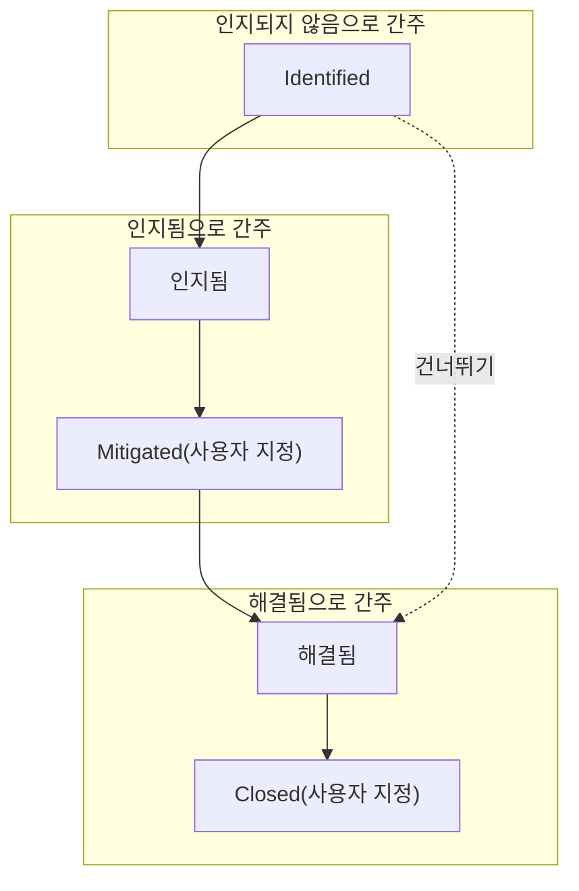
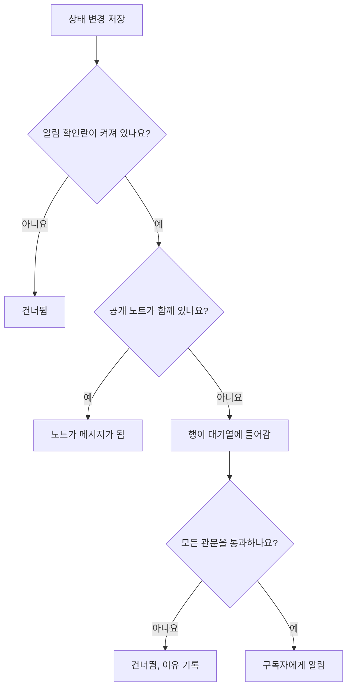

# 인시던트 상태 및 심각도

모든 인시던트는 두 가지 분류를 가집니다. 대응의 어디쯤에 있는지 나타내는 **상태**와 얼마나 아픈지 나타내는 **심각도**입니다. 이 페이지에서는 각 상태가 하는 일, 직접 상태를 추가하는 방법, 심각도의 순위를 매기는 방식을 설명합니다. 인시던트를 설정하는 사람, 또는 어떤 인시던트가 왜 호출을 했거나 하지 않았는지, 왜 해결되었거나 되지 않았는지, 왜 상태 페이지에 표시되었거나 되지 않았는지 알고 싶은 사람을 위한 페이지입니다.

:::cards
- [직접 상태 추가하기](#직접-상태-추가하기): 대응 과정을 모델링하고, 각 상태가 무엇으로 간주되는지 확인합니다.
- [인지가 하는 일](#인지가-하는-일): 호출이 멈추고 SLA가 응답됨으로 표시됩니다.
- [해결이 하는 일](#해결이-하는-일): 모니터를 돌려주고 SLA가 닫힙니다.
- [구독자에게 알리기](#상태-변경을-상태-페이지-구독자에게-알리기): 상태 변경이 상태 페이지에 닿기 전에 거치는 관문.
:::

## 작동 방식

대시보드에서 상태와 심각도는 비슷해 보입니다. 둘 다 인시던트 목록에서는 색깔 배지로, 고르는 곳에서는 이름 앞의 색깔 점으로 표시되며, 둘 다 이름과 색상을 바꿀 수 있는 프로젝트 범위의 목록입니다. 하지만 하는 일은 전혀 다릅니다.

상태는 동작을 결정합니다. 상태 행에 있는 세 가지 불리언 플래그와 상태의 순서가 어떤 인시던트를 활성으로 셀지, 인시던트 헤더에 어떤 버튼을 표시할지, SLA 시계를 언제 멈출지, 인시던트를 언제 상태 페이지에서 내릴지를 정합니다. 심각도는 그 자체로는 아무것도 결정하지 않습니다. 영향을 설명하는 레이블이며, 다른 규칙이 일치 기준으로 쓸 수 있는 것입니다.

`IncidentState` 모델은 `name`, `description`, `color`, `order`와 세 가지 불리언 `isCreatedState`, `isAcknowledgedState`, `isResolvedState`를 가집니다. 제품이 상태로 하는 모든 일은 이 불리언들과 `order`를 기준으로 하며, 상태의 이름을 기준으로 하는 일은 없습니다. 그래서 **해결됨**의 이름을 "Closed"로 바꿔도 아무것도 깨지지 않습니다. 플래그는 행과 함께 움직입니다.

`IncidentSeverity` 모델은 `name`, `description`, `color`, `order`만 가집니다. 플래그는 없습니다. OneUptime의 어떤 것도 그 자체로 **Critical Incident**를 **Minor Incident**와 다르게 다루지 않습니다. 심각도가 의미를 갖는 것은 온콜 규칙의 일치 기준 **인시던트 심각도**처럼 무언가를 심각도에 연결했을 때뿐입니다.

몇 가지 간단한 규칙:

- **영향을 전하려면 심각도를 고르세요** — 심각도는 인시던트 목록과 인시던트 **개요**에 표시되며, 인시던트를 선언할 때 필수 항목입니다.
- **프로세스를 모델링하려면 상태를 고르세요** — 실제로 거치는 대응 단계를, 거치는 순서대로 둡니다.
- **긴급도를 상태로 표현하지 마세요** — "Critical"이라는 상태를 만들어도 아무도 호출되지 않습니다. 그 일은 심각도와 온콜 규칙의 조합이 합니다.

> [!TIP]
> 두 목록 모두 프로젝트가 만들어질 때 생성되며, 둘 다 **인시던트 → 설정**에서 편집합니다. 인시던트 사이드 메뉴의 이 섹션은 기본적으로 접혀 있으므로, 찾기 전에 **설정**을 펼치세요.

## 기본 제공 상태

프로젝트와 함께 세 가지 상태가 이 순서로 만들어집니다. 생성은 멱등적이어서, 같은 이름의 상태가 아직 없을 때만 추가됩니다.

| 상태             | `order` | 플래그                | 색상      | 뜻                                                 |
| ---------------- | ------- | --------------------- | --------- | -------------------------------------------------- |
| **Identified**   | `1`     | `isCreatedState`      | `#fd625e` | 새 인시던트가 들어가는 상태.                       |
| **인지됨**       | `2`     | `isAcknowledgedState` | `#ffbf53` | 누군가 인시던트를 맡았습니다.                      |
| **해결됨**       | `3`     | `isResolvedState`     | `#2ab57d` | 인시던트가 끝나 더 이상 활성으로 세지 않습니다.   |

> [!NOTE]
> 첫 번째 상태의 이름은 **Identified**이지만, 제품 안의 일부 설명은 여전히 이를 "생성" 상태라고 부릅니다. 문서나 툴팁이 "생성 상태"라고 할 때는 `isCreatedState`를 가진 상태를 뜻하며, 새 프로젝트에서는 그것이 **Identified**입니다.

## 각 상태 플래그가 실제로 하는 일

| 플래그                | 용도                                                                                                                                                                                                 |
| --------------------- | ---------------------------------------------------------------------------------------------------------------------------------------------------------------------------------------------------- |
| `isCreatedState`      | 아무도 상태를 고르지 않았을 때 인시던트가 받는 상태. 프로젝트에 이 플래그를 가진 상태가 없으면 인시던트 생성이 실패하며, 설정에서 생성 상태를 추가하라는 오류가 표시됩니다.                         |
| `isAcknowledgedState` | 프로젝트의 인지 상태를 표시합니다. **인지**가 인시던트를 옮기는 곳이며, 인지 통계 타일의 이름이 되는 상태입니다. 이 상태나 그 이후 상태에 있거나 해결된 인시던트는 인지된 것입니다. 그 인시던트에는 더 이상 **인지**가 제공되지 않고, 온콜은 호출을 멈추며, SLA는 응답됨으로 표시됩니다. |
| `isResolvedState`     | 프로젝트의 해결 상태를 표시합니다. **해결**이 인시던트를 옮기는 곳이며, 해결 통계 타일이 보여 주는 상태입니다. 이 상태나 그 이후 상태에 있는 인시던트는 해결된 것입니다. **활성 인시던트**와 상태 페이지의 활성 섹션에서 빠지고, SLA는 해결됨으로 표시됩니다. |

각 플래그는 프로젝트마다 한 상태만 갖는 것이 전제이며, 조회는 순서상 첫 번째 것을 가져옵니다. 플래그가 있는 세 상태에는 설정 페이지에서 **기본 제공** 태그가 붙습니다. 마우스를 올리거나(Tab으로 이동해도 됩니다) OneUptime이 그 상태로 무엇을 하는지 읽을 수 있습니다. 이름과 색상을 바꾸고 끌어서 옮길 수 있지만, 다음과 같은 제약이 있습니다.

- **순서가 유지됩니다.** 생성 상태는 인지 상태보다 앞에, 인지 상태는 해결 상태보다 앞에 옵니다. 이를 깨는 끌기(예를 들어 **해결됨**을 **인지됨** 위로)는 거부되고, 행이 제자리로 돌아가며, 페이지에 이유가 표시됩니다.
- **삭제할 수 없습니다.** 행의 메뉴에 **삭제**가 남아 있지만 이유와 함께 잠겨 있습니다. 일괄 삭제는 이들을 건너뛰고 삭제되지 않은 것으로 나열합니다. API도 프로젝트의 마지막 생성, 인지, 해결 상태의 삭제를 거부합니다.

UI는 상태 이름을 동적으로 읽기 때문에, 상태 이름을 바꾸면 보이는 모든 곳이 바뀝니다. 통계 타일(기본 이름에서는 **Acknowledged in**과 **Resolved in**), 사용자 상태의 확인 창 **인시던트를 …(으)로 표시**, 인시던트 목록의 배지가 모두 행에 붙인 이름을 따릅니다.

## 직접 상태 추가하기

직접 추가하는 상태는 기본 세 가지에 이름이 없는 대응 단계입니다. 예를 들어 "Investigating", "Mitigated", "Monitoring", "Closed"입니다.

:::steps
### 상태 목록 열기

**인시던트 → 설정 → 인시던트 상태**로 이동합니다. **인시던트 상태** 카드에는 상태가 순서대로 한 행씩 표시됩니다. 끌 수 있는 손잡이, 색상과 이름, 그 상태의 인시던트가 무엇으로 **간주**되는지, 그리고 설명입니다. 제목 아래의 문장이 분명히 말하듯, 인시던트는 이 목록을 아래로만 이동합니다.

### 상태 만들기

카드 머리글의 **인시던트 상태 만들기**를 클릭하고 양식(항목은 아래 참고)을 채웁니다. 새 상태는 **해결 상태 바로 위**에 추가됩니다. 대부분의 상태가 있어야 할 곳이며, 그 아래에는 절대 추가되지 않습니다. 아래에 두면 모르는 사이에 해결된 것으로 간주되기 때문입니다.

### 끌어서 배치하기

행을 손잡이로 끌어 옮깁니다. 새 순서는 놓는 순간 저장되며, 입력할 순서 번호는 없습니다. 키보드로는 손잡이에 초점을 두고 Space를 누른 다음, 화살표 키로 옮기고 다시 Space를 누릅니다. **간주** 열은 행을 놓으면 갱신됩니다.
:::

**편집**은 만들기와 같은 양식을 엽니다. 상태의 ID는 행 메뉴의 **ID 표시**에 있습니다.

| 항목            | 필수   | 하는 일                                                                                                                                                                                                                                                            |
| --------------- | ------ | ------------------------------------------------------------------------------------------------------------------------------------------------------------------------------------------------------------------------------------------------------------------ |
| **이름**        | 예     | 두 글자 이상. 자리 표시자는 "Investigating" 같은 예를 보여 줍니다.                                                                                                                                                                                                 |
| **설명**        | 아니요 | 인시던트가 언제 이 상태에 있는지 설명하는 자유 텍스트.                                                                                                                                                                                                             |
| **색상**        | 예     | 양식이 열릴 때 이미 골라져 있습니다. 목록의 어떤 상태도 아직 쓰지 않는 색상이므로, 새 상태가 바로 위 상태와 같은 빨강이 되는 일은 없습니다. 이름이 붙은 색상 줄 (빨강, 주황, 라임, 초록, 청록, 파랑, 남색, 보라, 자홍, 분홍)에서 다른 색을 고르거나, `#fd625e` 같은 정확한 브랜드 색에는 **사용자 지정 색상**을 쓰세요. |

색상은 상태의 배지와, 모든 상태 선택기에서 이름 앞의 점에 쓰입니다. 선언 양식과 템플릿 양식, 일괄 작업 **상태 변경**, 헤더의 상태 메뉴, 규칙과 필터 조건입니다. 이 선택기들은 모두 이 페이지가 정한 순서로 상태를 나열합니다.

이 양식에서 세 가지 플래그를 설정할 수는 없습니다. 플래그는 기본 제공 행에 속합니다. 따라서 직접 추가한 상태는 플래그가 없는 상태이며, 미리 계획해 둘 만한 세 가지 결과가 있습니다.

- **위치가 무엇으로 간주될지를 정합니다.** **간주** 열이 이를 보여 주며, 끌 때마다 바뀝니다. 인지 상태보다 위에 있으면 그 상태의 인시던트는 **인지되지 않음**입니다. 인지 상태부터 아래로는 **인지됨**으로 간주되므로 온콜 정책이 에스컬레이션을 멈춥니다. 해결 상태부터 아래로는 **해결됨**으로 간주되므로 상태 페이지가 더 이상 활성으로 표시하지 않습니다.
- **해결 상태보다 위에 있으면 인시던트가 활성으로 남습니다.** **활성 인시던트**는 현재 상태가 해결 상태보다 위에 있는 인시던트를 담으므로, 그곳에 추가한 상태는 인시던트를 활성 목록과 사이드바 개수에 남겨 둡니다. 해결 상태 아래로 끌어 놓은 상태는 활성 목록, 상태 페이지, 리마인더, SLA 모든 곳에서 해결된 것으로 간주되며, **해결됨**에서 그 상태로 인시던트를 옮겨도 두 번째 해결이 되지 않습니다.
- **인시던트는 헤더의 메뉴에서 그 상태로 옮깁니다.** 헤더의 버튼은 **인지**와 **해결**뿐입니다. 사용자 상태는 그 옆의 **⋯** 메뉴에 있는 **Change state to** 아래에 있으며, 현재 상태 이후의 모든 상태가 나열됩니다. 확인 창의 제목은 **인시던트를 `<state name>`(으)로 표시**이고, 제출 버튼은 **`<state name>`(으)로 표시**입니다.

> [!TIP]
> 흔한 형태는 인지 상태와 해결 상태 사이에 완화 단계를 두는 것입니다. "Mitigated"를 만들면 **인지됨** 뒤, **해결됨** 바로 위에 들어가 인지된 것으로 간주됩니다. 아직 아무도 인지하지 않은 단계의 분류용 상태라면 **인지됨** 위로 끌어 놓으세요.

## 순서는 표시 취향이 아니라 실제 제약입니다

순서는 목록을 그릴 때만이 아니라 상태 변경을 기록할 때 강제됩니다.

- **뒤로 가는 전환은 거부됩니다.** 순서상 현재 상태보다 앞에 있는 상태로 인시던트를 옮기면, 두 상태를 모두 지목하는 오류로 실패합니다.
- **현재 상태를 다시 고르는 것은 거부됩니다.** 인시던트를 이미 있는 상태로 설정하면 "Incident state cannot be same as previous state."로 실패합니다.
- **소급해 넣은 행은 이웃과 같을 수 없습니다.** 뒤따르는 행과 같은 상태의 타임라인 행을 넣는 것도 거부됩니다.
- **헤더 버튼은 플래그가 있는 상태의 순서상 위치를 따릅니다.** **인지**와 **해결**은 순서로 정렬된 목록에서 현재 상태가 어디에 있는지에 따라 제공됩니다. 해결 상태 *뒤에* 놓은 사용자 상태에는 **해결** 버튼이 절대 나타나지 않습니다. 그 상태의 인시던트는 이미 해결된 것으로 간주되기 때문입니다.

그러니 상태를 추가할 때는 인시던트가 실제로 거쳐 갈 위치에 두세요. 순서를 잘못 두면 이상해 보이는 데서 끝나지 않고 전환이 불가능해집니다. 상태를 더 뒤로 옮기면, 그 상태에 이미 있는 인시던트가 어떻게 간주되는지가 놓는 순간 바뀝니다.

API와 Terraform에서 순서는 `order` 열입니다. 작은 번호가 먼저 옵니다. 번호 없이 만든 상태는 해결 상태 바로 위에 들어갑니다. 번호와 함께 만들거나 업데이트한 상태는 그 자리를 차지하고, 사이에 있던 상태들은 한 칸씩 내려갑니다. 다른 상태가 갖고 있지 않은 번호는 쓴 그대로 유지되므로, Terraform으로 관리하는 상태는 지정한 번호로 다시 읽힙니다.

## 기본 제공 심각도

프로젝트와 함께 세 가지 심각도가 가장 심각한 것부터 이 순서로 만들어집니다.

| 심각도                | `order` | 색상      | 기본 설명                                                                                                                                                                                 |
| --------------------- | ------- | --------- | ----------------------------------------------------------------------------------------------------------------------------------------------------------------------------------------- |
| **Critical Incident** | `1`     | `#b70400` | Issues causing very high impact to customers. Immediate response is required. Examples include a full outage, or a data breach.                                                          |
| **Major Incident**    | `2`     | `#fd625e` | Issues causing significant impact. Immediate response is usually required. We might have some workarounds that mitigate the impact on customers. Examples include an important sub-system failing. |
| **Minor Incident**    | `3`     | `#ffbf53` | Issues with low impact, which can usually be handled within working hours. Most customers are unlikely to notice any problems. Examples include a slight drop in application performance. |

심각도는 인시던트를 선언할 때 필수이고, 모니터 기준의 각 인시던트 명세에서도 필수이므로, 수동이든 자동이든 모든 인시던트는 심각도를 갖고 들어옵니다. 선언 흐름은 [인시던트 선언](/docs/incidents/declaring-incidents)을, 모니터에서 만들어지는 경로는 [인시던트 및 알림 템플릿](/docs/monitor/incident-alert-templating)을 참고하세요.

## 심각도 편집하기

**인시던트 → 설정 → 인시던트 심각도**로 이동합니다. 상태 페이지와 같은 형태로, 심각도마다 한 행씩 가장 심각한 것이 먼저 나오며, 행을 끌어 순위를 바꿉니다. **인시던트 심각도 만들기**는 맨 끝(가장 덜 심각한 위치)에 심각도를 추가하며, 양식에는 **이름**, **설명**, **색상**이 있고 색상은 상태 양식처럼 이미 골라져 있습니다.

순위는 OneUptime이 심각도를 비교하는 모든 곳에서 중요합니다. 에피소드는 가장 심각한 인시던트의 심각도를 따르고, 모니터 추천의 Critical과 Warning은 첫 번째와 두 번째 심각도에 대응됩니다.

상태와 다른 점은 두 가지입니다.

- **삭제 보호가 없습니다.** 기본 제공 세 가지를 포함해 어떤 심각도든 삭제할 수 있습니다.
- **물려받을 플래그도, "간주"도 없습니다.** 새 심각도는 기본 제공 심각도와 똑같이 동작합니다. 색상과 순위를 가진 레이블입니다.

심각도가 설명 이상의 일을 하는 곳: **인시던트 → 규칙 → 온콜 규칙**에서 규칙의 **인시던트 심각도** 항목은 일치 기준입니다. 그곳에 **Critical Incident**를 지정하는 것이 "심각한 것은 모두 데이터베이스 팀을 호출하라"를 표현하는 방법입니다. 온콜 정책은 심각도가 아니라 규칙에 있습니다.

**인시던트의 심각도 변경**(인시던트 **인시던트 세부 정보** 카드의 **편집**, API나 Terraform의 `incidentSeverityId`, 워크플로우, AI 도구)은 어떤 방법으로 보내든 같은 네 가지 일을 합니다. 인시던트 피드에 새 심각도를 밝히는 **Incident updated** 항목이 추가되고, 인시던트의 SLA 기한이 다시 계산되고, 리마인더 규칙이 다시 대조되며, 인시던트 지표가 심각도 변경 한 번을 셉니다. 인시던트가 이미 가진 심각도를 저장하면 아무것도 하지 않으므로, 인시던트의 제목만 편집해도 SLA 기한, 리마인더, 심각도 변경 횟수는 그대로입니다. 알림의 심각도도 피드 항목과 리마인더에 대해 같은 방식으로 동작합니다.

## 인시던트의 상태 진행하기

인시던트의 상태가 바뀌는 방법은 네 가지입니다.

| 방법                | 위치                                                                                        | 묻는 것                                                                                                                                                                                                      |
| ------------------- | ------------------------------------------------------------------------------------------- | ------------------------------------------------------------------------------------------------------------------------------------------------------------------------------------------------------------ |
| **헤더 버튼**       | 인시던트 헤더: **인지**와 **해결**, 그리고 **⋯** 메뉴의 **Change state to**                 | 짧은 확인 창(**인시던트 인지** 또는 **인시던트 해결**). **상태 페이지 구독자에게 알림**과, **공개 메모 추가** 아래에 접힌 선택 사항 **공개 메모**와 그 **메모 템플릿 선택** 선택기(프로젝트에 노트 템플릿이 있을 때)가 있습니다. |
| **상태 타임라인**   | 인시던트 사이드 메뉴의 **상태 타임라인**                                                    | 직접 추가하는 행. **인시던트 상태**, **시작**, **상태 페이지 구독자에게 알림**이 있습니다.                                                                                                                  |
| **일괄 변경**       | 인시던트 목록에서 선택한 것에 대한 **상태 변경**                                            | 상태, **상태 페이지 구독자에게 알림**, 그리고 같은 방식으로 접힌 **공개 메모 추가**가 있는 한 페이지.                                                                                                       |
| **자동**            | 모니터 기준, 또는 직접 만든 코드                                                            | **인시던트 자동 해결**을 켠 기준은 기준이 더 이상 충족되지 않으면 그 인시던트를 해결합니다. API는 `/api/incident-state-timeline`에 행을 만들어 상태를 바꿉니다.                                             |

현재 상태가 인지 상태보다 앞이면 헤더에 **인지**와 **해결**이, 둘 사이면 **해결**만 표시됩니다. 인지하면 그 인시던트의 온콜 에스컬레이션도 멈춥니다.

이 모든 방법은 타임라인 행을 기록합니다. 상태 변경은 요청하지 않아도 몇 가지 일을 합니다. 인시던트 피드에 항목을 게시하고, 인시던트에 아직 인시던트 책임자가 없으면 할당하며, SLA 시계를 갱신합니다. 해결된 인시던트를 다시 열면 다시 연 시각부터 새 SLA 기록이 시작됩니다.

## 인지가 하는 일

인시던트는 인지 상태로 들어가는 순간부터 인지된 것입니다. 그 이후 상태(**인지됨** 아래에 둔 **Mitigated**나 **Investigating** 상태)나 해결 상태로 들어갈 때도 마찬가지이며, 위의 네 가지 방법 중 무엇으로 옮겼는지는 상관없습니다. 상태 설정 페이지의 **간주** 열이 그것이 어떤 상태인지 보여 줍니다. 인지되면 다음과 같이 됩니다.

- **인지가 더 이상 제공되지 않습니다.** 인시던트 헤더에도, 모바일 앱(버튼과 스와이프)에도, Slack이나 Microsoft Teams에도, OneUptime MCP 서버의 `acknowledge_incident`에도 나오지 않습니다. 그래도 온콜 페이지, Slack, Teams에서 인지하려 하면 목록 위로 되돌리는 대신 "Incident is already acknowledged."(또는 "Incident is already resolved.")로 거부됩니다.
- **온콜이 그 인시던트를 위한 호출을 멈춥니다.** 동료가 인시던트를 인지하거나 다음 상태로 옮긴 뒤에 자신의 호출을 인지한 대응자는 호출이 인지됨으로 처리되고, 인시던트는 있던 자리에 그대로 남습니다.
- **SLA가 응답됨으로 표시됩니다.** 처음 그렇게 옮긴 시점입니다. 이후 상태로 계속 진행해도 그 시각은 유지됩니다.
- **인지까지 걸린 시간은 그 첫 이동까지입니다.** 인시던트 **개요**의 통계 타일, **Time to Acknowledge** 지표, **인시던트가 인지될 때**에 끝나는 측정, Slack과 Microsoft Teams 요약의 MTTA가 해당합니다. **Identified**에서 바로 **Investigating**으로 옮긴 인시던트는 그때 인지된 것이고, 곧바로 해결된 인시던트는 해결될 때 인지된 것입니다.
- **인지됨 필터**(예를 들어 대시보드의 인시던트 목록 위젯)는 인지 상태와 그 이후 상태에 있으면서 해결에 이르지 않은 인시던트를 보여 줍니다.

알림과 에피소드도 알림 상태로 같은 규칙을 따릅니다.

## 해결이 하는 일

인시던트는 해결 상태보다 위의 상태에서 해결 상태나 그 이후 상태로 옮겨질 때 해결됩니다. 위의 네 가지 방법 중 무엇으로 옮겼는지는 상관없습니다. 해결될 때마다 다음 일이 일어납니다.

- **인시던트가 잡고 있는 모니터를 돌려줍니다.** 열린 상태로 선언된 인시던트는 모니터를 잡고 있습니다. **모니터 상태를 다음으로 변경**을 지정했다면 모니터를 그 상태로 두었고, 직접 선언했다면 모니터링을 일시 중지했습니다. 열려 있는 동안의 편집(모니터 추가나 그 상태 변경)도 모니터를 잡게 만듭니다. 해결하면 다른 열린 인시던트가 여전히 그 모니터에 걸려 있지 않은 한 모니터링이 재개되고 정상으로 돌아가며, 그 뒤로 인시던트는 아무것도 잡고 있지 않습니다. 따라서 이미 해결된 상태로 선언된 인시던트는 아무것도 돌려주지 않고, 다시 연 뒤의 두 번째 해결도 마찬가지입니다. 그사이 모니터가 받은 상태(프로브, 유지 관리, 직접 설정한 것)는 그대로 남습니다.
- **SLA를 해결됨으로 표시하고**, OneUptime AI 포스트모템 초안이 켜져 있으면 포스트모템 초안을 작성합니다.

**해결됨**에서 그 이후 상태(예를 들어 **Closed**)로 넘어가는 것은 두 번째 해결이 아닙니다. 이 중 어느 것도 다시 실행되지 않고, 새 SLA도 시작되지 않습니다. OneUptime이 이것을 기록하기 전에 선언된 인시던트는 이전처럼 다음 해결 때 모니터를 돌려줍니다.

## 상태 타임라인

인시던트 사이드 메뉴의 **상태 타임라인** 페이지는 인시던트가 거친 모든 상태의 감사 기록입니다. 그 페이지의 카드 제목은 **상태 타임라인**이며, 최신순으로 정렬됩니다.

| 열                                 | 보여 주는 것                                                                                                                                                                                                                                                   |
| ---------------------------------- | -------------------------------------------------------------------------------------------------------------------------------------------------------------------------------------------------------------------------------------------------------------- |
| **인시던트 상태**                  | 상태의 이름과 색상을 담은 색깔 배지.                                                                                                                                                                                                                           |
| **시작**                           | 인시던트가 이 상태에 들어간 시각.                                                                                                                                                                                                                              |
| **종료**                           | 상태를 떠난 시각. 현재 상태에는 `Currently Active`가 표시됩니다.                                                                                                                                                                                               |
| **기간**                           | 그 상태에 머문 시간. 현재 상태는 지금까지의 시간입니다.                                                                                                                                                                                                        |
| **구독자 알림 상태**               | 이 변경에 대한 상태 페이지 알림이 전송되었는지, 건너뛰었는지, 아직 대기 중인지와 **자세히 보기** 링크, 그리고 전송에 실패했다면 **다시 시도** 작업. **다시 시도**는 이미 받은 구독자를 포함해, 인시던트가 지금 닿는 모든 상태 페이지에 상태 변경을 다시 보냅니다. |

각 행에는 두 가지 작업이 있습니다.

- **원인 보기** — 그 상태 변경과 함께 기록된 Markdown을 보여 주는 **근본 원인** 모달을 엽니다.
- **로그 보기** — 상태가 바뀐 이유를 설명하는 모달을 열고, **인시던트 상태 로그** 뷰어를 보여 줍니다.

대시보드에서 타임라인 행은 추가하고 삭제할 수 있지만 편집할 수는 없으며, 인시던트에는 항상 행이 하나 이상 남습니다. API에서는 행의 `startsAt`을 고칠 수 있고, 타임라인에서 계산되는 모든 측정이 그것을 따릅니다.

> [!WARNING]
> 잘못된 행을 삭제하면 인시던트의 기록이 다시 쓰이므로, 정리 습관이 아니라 바로잡는 도구로 다루세요.

## 활성 인시던트 목록

**인시던트 → 활성 인시던트**는 근무 중에 지켜보는 목록입니다. 정의는 정확히 하나의 조건입니다. 인시던트의 현재 상태가 해결 상태(`isResolvedState` 플래그를 가진, 순서상 첫 번째 상태)보다 위에 있다는 것입니다. 그 밖에는 아무것도 고려하지 않습니다. 심각도도, 경과 시간도, 누군가 인지했는지도 아닙니다.

사이드 메뉴 항목에는 같은 쿼리를 쓰는 빨간 개수 배지가 붙으므로, 배지와 목록은 항상 일치합니다. 볼 것이 없으면 페이지에 그렇게 표시됩니다.

실질적인 결과로, 해결 상태 위에 추가한 사용자 상태는 인시던트를 이 목록에 남겨 두고("Mitigated"는 "완료"가 아닙니다), 해결 상태 뒤에 둔 상태는 해결 상태처럼 인시던트를 목록에서 뺍니다. 알림과 에피소드도 각자의 상태로 같은 규칙을 따르며, 사이드 메뉴 개수, 리마인더, 상태 페이지, 모바일 앱이 모두 이 규칙을 읽습니다.

## 상태 변경을 상태 페이지 구독자에게 알리기

상태 변경은 상태 페이지 구독자에게 알릴 수 있지만 여러 관문을 거칩니다. 이를 이해해 두면 "왜 아무도 알림을 받지 못했는가"를 조사하는 수고를 크게 덜 수 있습니다.

알림은 타임라인 행마다 **상태 페이지 구독자에게 알림**(`shouldStatusPageSubscribersBeNotified`)으로 요청합니다. 상태 변경 모달과 수동 타임라인 양식에 있는 확인란입니다. 상태 변경 모달에서는 인시던트가 구독자에게 알리지 않고 선언되었다면 꺼진 채로 시작합니다. 같은 확인란이 모달의 공개 노트가 누군가에게 알릴지도 결정합니다. 꺼져 있으면 행은 건너뜀 상태와 설명과 함께 저장됩니다. 켜져 있으면 행이 대기열에 들어가고 백그라운드 작업이 처리합니다. 작업은 매분 실행되므로 전송은 빠르지만 즉시는 아닙니다.

**대기열의 행은 다음 중 하나라도 해당하면 건너뜁니다.**

- **새 상태가 생성 상태입니다.** 구독자는 인시던트가 선언될 때 이미 알림을 받았으므로, 첫 타임라인 행은 의도적으로 두 번째 메시지를 보내지 않습니다.
- **인시던트에 연결된 모니터가 없습니다.** 리소스가 없으면 인시던트를 대응시킬 상태 페이지가 없습니다.
- **인시던트가 상태 페이지에 표시되지 않습니다**(`isVisibleOnStatusPage`가 꺼져 있음).
- **상태 페이지에서 인시던트가 꺼져 있습니다**(`showIncidentsOnStatusPage`가 꺼져 있음). 이것은 상태 페이지별 판단이며, 같은 모니터를 보여 주는 다른 페이지는 여전히 알림을 받습니다.
- **상태 페이지가 인시던트의 범위 밖입니다.** **다음 상태 페이지로 제한**으로 일부 상태 페이지로 제한한 인시던트는 모니터를 나열하는 페이지 중 그 페이지에만 알리며, **이 페이지로 제한된 인시던트만 표시**가 켜진 페이지는 그 페이지로 제한되지 않은 인시던트에 대해 알림을 받지 않습니다. 이것도 상태 페이지별 판단입니다. [대상별 상태 페이지](/docs/status-pages/one-status-page-per-audience)를 참고하세요.

**결과를 바꾸는 한 가지가 더 있습니다.** **상태 페이지 구독자에게 알림**이 켜진 상태에서 상태 변경 모달(**공개 메모 추가** 아래)이나 일괄 작업 **상태 변경**에 **공개 메모**를 쓰면, 타임라인 행은 대기열에 들어가는 대신 이미 알린 것으로 표시되고, 상태 메시지는 노트가 알림을 전했다고 말합니다. 구독자에게 닿는 것은 노트 자체이므로 메시지는 두 개가 아니라 하나입니다. 공백만 있는 노트는 게시되지 않으며, 행은 평소처럼 대기열에 들어갑니다. 예정된 유지 관리의 상태 변경도 같은 방식으로 동작합니다. 노트 없는 일반 상태 변경 메시지의 이벤트 유형은 `Subscriber Incident State Changed`입니다.

**노트는 인시던트의 지금 상태를 알려 줍니다.** 노트가 유일한 메시지이므로, 상태 변경 메시지가 했을 것처럼 모든 채널에서 새 상태를 밝힙니다. 이메일 제목은 `[Resolved Incident] <title>`이 되고 세부 내용에는 상태 색상의 **Status** 행이 표시되며, SMS는 `Incident <title> on <status page> is Resolved.`라고 말하고, Slack과 Microsoft Teams 메시지에는 `**Status:** Resolved` 줄이 들어가며, 웹훅의 `IncidentNoteCreated` 페이로드에는 `data`에 `incidentState`가 들어갑니다. 따로 게시한 노트는 평소 메시지를 유지하며, 편집에 따른 업데이트 알림도 마찬가지입니다.

**노트 게시에는 별도의 권한이 필요합니다.** 상태 변경과 공개 노트 게시는 별개의 권한입니다(사용자 지정 역할에서는 **Create Incident State Timeline**과 **Create Incident Status Page Note**. 기본 제공 인시던트 및 프로젝트 역할은 둘 다 가집니다). 상태 변경에는 인시던트를 편집할 권한이 필요하지 않습니다. [상태 변경](/docs/permissions/index#상태-변경)을 참고하세요. 인시던트의 상태는 바꿀 수 있지만 공개 노트는 게시할 수 없는 사람에게는 모달에서도 일괄 작업 **상태 변경**에서도 **공개 메모 추가**가 제공되지 않습니다. 그런 사람이 API로 노트와 함께 보낸 상태 변경은 상태가 바뀌지 않았다는 것과 그 이유를 알리는 메시지와 함께 통째로 거부되므로, 게시되지 않은 노트로 알린 것으로 변경이 기록되는 일은 없습니다. 노트를 빼면 변경이 통과합니다. 알림, 알림 에피소드, 인시던트 에피소드는 대신 상태 변경과 함께 비공개 노트를 제공하며(**비공개 메모 추가**), 같은 방식으로 동작합니다. 게시에는 노트 자체의 권한이 필요하고(사용자 지정 역할에서는 **Create Alert Internal Note**, **Create Alert Episode Internal Note**, **Create Incident Episode Internal Note**. 기본 제공 알림, 인시던트, 프로젝트 역할은 이를 가집니다), 그 권한이 없는 사람이 비공개 노트와 함께 보낸 상태 변경은 통째로 거부되어 상태가 바뀌지 않습니다.

**전송됨은 모든 구독자에게 보냈다는 뜻입니다.** 작업은 메시지마다 기다리며 상태 페이지와 채널별로 전송 또는 실패를 세고, 행의 상태 메시지에 그 개수를 나열합니다. 메시지 하나라도 실패하거나, 전송 시간이 다 되었거나 중단되면 행은 **실패**가 됩니다. [구독자 및 공지](/docs/status-pages/subscribers)를 참고하세요.

누가 이것을 받고 템플릿이 어떻게 선택되는지는 [구독자 및 공지](/docs/status-pages/subscribers)를 참고하세요.

## 인시던트를 상태 페이지에 내보내지 않기

인시던트가 공개 페이지에 나오는지는 네 가지 별개의 요소로 정해지며, 넷 모두 참이어야 합니다.

- 상태 페이지 자체의 **인시던트 표시**(`showIncidentsOnStatusPage`).
- 인시던트의 **상태 페이지에 표시**(`isVisibleOnStatusPage`). 인시던트 **설정** 페이지의 토글입니다. 기본값은 true이고 선언 마법사에는 없습니다. 모니터 기준은 **상태 페이지에 인시던트 표시**로 설정할 수 있습니다. 숨긴 채 선언된 인시던트는 생성될 때 구독자에게 알리지 않으며, 나중에 이 토글을 켜면 편집 양식에 **이 인시던트가 생성되었음을 구독자에게 알림**이 나타납니다. [인시던트 선언](/docs/incidents/declaring-incidents)을 참고하세요.
- **페이지가 인시던트가 닿는 범위에 있습니다.** 페이지가 인시던트의 모니터 중 하나를 나열하고, 인시던트가 일부 상태 페이지로 제한되었다면 그중 하나여야 합니다. **이 페이지로 제한된 인시던트만 표시**가 켜진 페이지에는 그 페이지로 제한된 인시던트만 표시됩니다. [대상별 상태 페이지](/docs/status-pages/one-status-page-per-audience)를 참고하세요.
- **현재 상태가 해결 상태보다 위에 있습니다.** 이것이 인시던트를 활성 섹션에서 빼는 요소입니다. 상태 페이지 쿼리는 현재 상태가 해결 상태보다 위에 있는 인시던트를 가져오므로, 해결 상태와 그 이후의 모든 상태는 인시던트를 뺍니다. 무언가를 보관하거나 닫을 필요는 없습니다. 해결하면 인시던트는 기록으로 넘어갑니다.

**비공개 인시던트는 절대 나타나지 않습니다.** **비공개 인시던트**를 켜면 위의 토글과 관계없이 인시던트가 모든 상태 페이지에서 숨겨지고, 소유자와 프로젝트 관리자 및 소유자로 제한됩니다. 생성, 상태 변경, 공개 노트, 포스트모템 중 어느 것도 상태 페이지 구독자에게 닿지 않습니다. 비공개인 동안에는 설명, 포스트모템, 사용자 정의 필드, 공개 노트의 이미지를 모두가 볼 수 있지는 않습니다.

두 스위치는 맞물려 있으므로, 인시던트의 **설정** 페이지는 항상 상태 페이지가 실제로 하는 일을 보여 줍니다.

- 인시던트를 비공개로 만들면 **상태 페이지에 표시**도 함께 꺼집니다.
- 인시던트가 비공개인 채로 **상태 페이지에 표시**를 켜도 꺼진 채로 남습니다. 비공개 인시던트를 게시하려면 **비공개 인시던트**를 끄고 **상태 페이지에 표시**를 켜세요. 한 번의 저장으로 해도 되고, 차례로 해도 됩니다.

이것은 인시던트를 어디서 쓰든 마찬가지입니다. 대시보드, API, Terraform, 워크플로우, 모니터, 인시던트 템플릿, 개인정보 보호 규칙 모두입니다. `"true"`처럼 텍스트로 보낸 값도 `true`와 같이 취급됩니다. 여러 인시던트에 대해 **상태 페이지에 표시**를 켜는 한 번의 쓰기(예를 들어 워크플로우의 **Update Many**)는 비공개가 아닌 것을 표시하고 비공개인 것은 모두 숨긴 채로 둡니다. 각 인시던트는 쓰기가 닿는 시점의 상태로 판단되므로, 같은 순간에 들어온 개인정보 변경이 덮어써지는 일이 없으며, 인시던트가 비공개이면서 표시되는 상태로 저장되는 일은 없습니다. 비공개로 생성된 인시던트는 숨겨진 채로 생성되며, 생성 사실을 구독자에게 알리지 않습니다.

**에피소드도 같은 규칙을 따릅니다.** 비공개 인시던트 에피소드는 **상태 페이지에 표시** 스위치가 무엇이든 모든 상태 페이지에서 숨겨지며, 구독자는 그것에 대해 아무것도 듣지 못합니다. 에피소드 **설정** 페이지의 스위치에 그렇게 표시되며, 에피소드가 비공개인 동안 꺼진 채로 남습니다. 비공개 인시던트가 에피소드를 상태 페이지에 끌어오는 일은 없습니다. 에피소드는 비공개가 아닌 인시던트를 통해서만 페이지에 닿습니다.

:::details 이 규칙이 없는 버전에서 업그레이드하는 경우
이 규칙 이전에 **상태 페이지에 표시**가 켜진 채 비공개로 저장된 인시던트와 에피소드는 업그레이드할 때 그것이 꺼집니다. 누구에게도 아무것도 보내지 않습니다. 그런 인시던트나 에피소드가 모두에게 보이게 했던 이미지는, 상태 페이지가 보여 주는 다른 무언가에 여전히 들어 있지 않는 한 다시 비공개가 됩니다. 상태 페이지가 보여 주지 않는 인시던트, 에피소드, 예정된 유지 관리 이벤트의 공개 노트에 있는 이미지도 마찬가지이며, 이들은 이전에는 모두에게 보이는 채로 남아 있었습니다.
:::

페이지가 해결된 기록을 얼마나 남길지는 인시던트가 아니라 상태 페이지의 설정입니다. 페이지의 모니터가 애초에 어떤 인시던트를 표시할지 어떻게 정하는지는 [상태 페이지 리소스 및 그룹](/docs/status-pages/resources-and-groups)을 참고하세요.

## 다음 단계

:::cards
- [인시던트 선언](/docs/incidents/declaring-incidents): 선언할 때 시작 상태와 심각도를 고릅니다.
- [인시던트 메모, 소유자 및 피드](/docs/incidents/notes-owners-and-feed): 상태 변경과 함께 나가는 공개 노트를 게시합니다.
- [인시던트 설정 및 자동화](/docs/incidents/settings): 상태 사이의 시간을 측정하고, 규칙에서 심각도를 대조합니다.
- [구독자 및 공지](/docs/status-pages/subscribers): 상태 변경이 보내는 메시지를 누가 받는지.
:::
