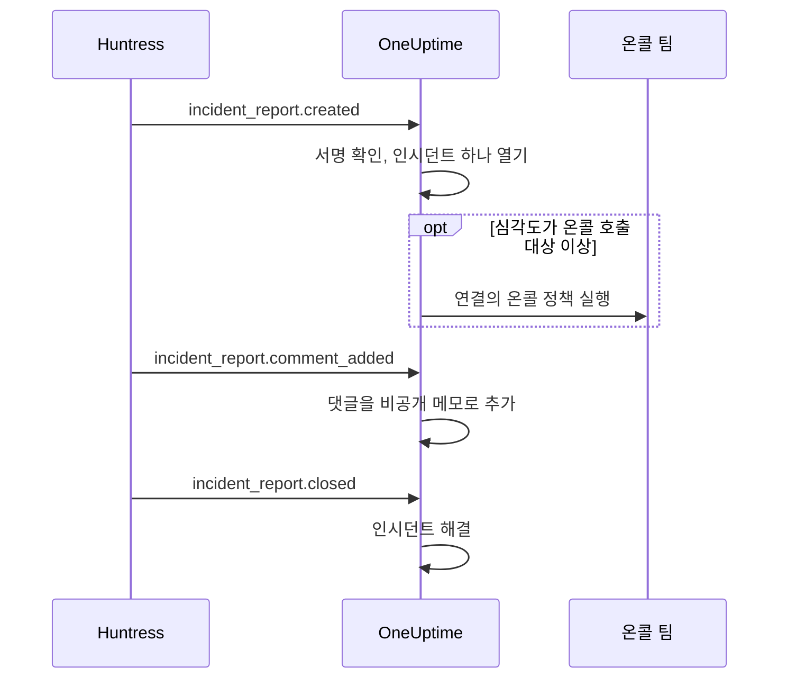

# Huntress 연동

Huntress 인시던트 보고서로 온콜 팀을 호출하세요. Huntress SOC가 엔드포인트나 계정에 대한 인시던트 보고서를 보내면, OneUptime은 보고서마다 인시던트를 하나 선택한 심각도로 열고, 선택한 온콜 정책을 호출하며, Huntress에서 보고서가 닫히면 인시던트를 해결합니다.

이 연동은 **인바운드**입니다. Huntress는 인시던트 보고서의 모든 이벤트를 OneUptime이 제공하는 웹훅 URL로 보내며, 엔드포인트의 서명 시크릿으로 서명합니다. OneUptime은 Huntress를 호출하지 않으므로 Huntress API 키가 필요 없습니다.

:::cards
- [작동 방식](#작동-방식): 보고서의 각 이벤트에 OneUptime이 하는 일.
- [설정 방법](#연동-설정하기): OneUptime에서 연결하고, Huntress에 엔드포인트를 추가하고, 서명 시크릿을 저장하고, 테스트를 보냅니다.
- [설정](#설정): 호출, 심각도, 조직, 레이블, 해결.
- [문제 해결](#문제-해결): 연결 오류의 의미와 바꿔야 할 점.
:::

## 작동 방식

Huntress는 보고서가 발송될 때, 누군가 댓글을 달 때, 보고서가 닫힐 때 인시던트 보고서 이벤트를 보냅니다. 각 이벤트에는 보고서 전체가 담겨 있습니다.

1. **확인.** 요청은 도착하기 5분 이내에 엔드포인트의 서명 시크릿으로 서명되어 있어야 합니다. 그 밖의 요청은 거부되며, 연결 페이지에 이유가 표시됩니다.
2. **인시던트 하나 열기.** 보고서의 첫 이벤트는 `Huntress: Incident on DESKTOP-01 (Acme Corp)`처럼 보고서를 딴 제목의 인시던트를 엽니다. 설명에는 보고서 요약, Huntress에서의 심각도, 조직, 영향을 받은 호스트나 계정, Huntress가 찾은 지표, Huntress 보고서 링크가 들어갑니다. 같은 보고서의 이후 이벤트와 Huntress가 다시 보내는 전달은 이 인시던트를 찾아갑니다. 보고서 하나가 인시던트를 두 개 여는 일은 없습니다.
3. **호출.** 인시던트는 연결이 보고서의 Huntress 심각도에 지정한 인시던트 심각도로 열립니다. 그 심각도가 **온콜 호출 대상** 이상이면 연결의 **온콜 정책**이 실행됩니다.
4. **보고서 따라가기.** Huntress에서 추가된 댓글은 인시던트의 비공개 메모가 됩니다. 보고서가 닫히거나 기각되면 인시던트가 해결됩니다.

이렇게 열린 인시던트는 상태 페이지에 표시되지 않습니다. 인시던트 규칙(온콜, 소유자, 레이블, 개인정보 규칙)은 다른 인시던트와 똑같이 적용됩니다.

## 시작하기 전에

- OneUptime의 **Project Owner** 또는 **Project Admin** 역할. 멤버, 뷰어, 인시던트 역할은 연결과 받은 보고서를 볼 수 있지만 변경할 수는 없습니다.
- Huntress의 **Account Admin** 역할. 웹훅은 계정 관리자만 추가할 수 있습니다.
- 호출할 온콜 정책. 정책이 없으면 보고서가 인시던트를 열어도 아무도 호출하지 않습니다. 단, 인시던트 온콜 규칙이 일치하면 예외입니다.
- 자체 호스팅 설치라면 Huntress가 인터넷에서 HTTPS로 접근할 수 있는 OneUptime. Huntress는 `https://` URL로만 웹훅을 보냅니다.

## 연동 설정하기

:::steps
### OneUptime에서 Huntress 연결하기

**인시던트 → 연동 → Huntress**(`/dashboard/{projectId}/incidents/integrations/huntress`)를 엽니다. 인시던트 사이드 메뉴의 **연동** 섹션은 기본적으로 접혀 있으니 먼저 펼치세요. **Huntress 연결**을 클릭합니다.

호출할 **온콜 정책**을 고릅니다. 그러면 **온콜 호출 대상**이 어떤 보고서로 호출할지 묻고, **높음 및 심각 보고서**로 시작합니다. 나머지는 기본값과 함께 **추가 필드**에 있습니다([설정](#설정) 참고). **Huntress 연결**을 클릭합니다. 연결 페이지가 열리고, 다음 세 단계를 안내하는 **Huntress 연결** 카드가 표시됩니다.

### Huntress에 웹훅 엔드포인트 추가하기

연결 페이지에서 **웹훅 URL 복사**를 클릭합니다. URL은 `https://oneuptime.com/api/huntress/webhook/<connection-id>` 형태이며, 자체 호스팅 설치에서는 자신의 호스트로 시작합니다.

Huntress에서 오른쪽 위 메뉴를 열고 **Integrations**를 선택합니다. **Add an Integration**을 클릭하고 **Webhooks**를 선택한 다음 **Add Endpoint**를 클릭합니다. URL을 붙여 넣고 **Incident Reports**를 켠 뒤 저장합니다. **Escalations**, **Platform Actions**, **Account Notices**는 꺼 두세요. OneUptime은 이 이벤트들을 받기만 하고 아무것도 하지 않습니다.

### 엔드포인트의 서명 시크릿 저장하기

Huntress에서 엔드포인트 메뉴(⋯)를 열고 **View Signing Secret**을 선택합니다. 전체를 복사하세요. `whsec_`로 시작합니다. 연결 페이지에서 **서명 시크릿 저장**을 클릭하고, 붙여 넣은 뒤 **서명 시크릿 저장**을 클릭합니다. 시크릿은 암호화되며 다시 표시되지 않습니다.

시크릿을 저장하기 전까지 OneUptime은 URL로 오는 모든 요청을 거부합니다. Huntress는 거부된 이벤트를 나중에 다시 보내므로, 지금 거부된 이벤트도 결국 도착합니다.

### 테스트 보내기

Huntress에서 엔드포인트 메뉴(⋯)를 열고 **Send Test**를 선택합니다. 몇 초 안에 연결 페이지의 카드가 **연결**로 바뀌고 상태가 **보고서 수신 중**이 됩니다.

> [!NOTE]
> 테스트에 무엇이 담겨 있든, 연결에는 테스트가 도착했다고 표시됩니다. 인시던트 보고서가 담긴 테스트는 다른 보고서처럼 인시던트를 열고, 충분히 심각하면 온콜을 호출합니다.
:::

## 설정

**Huntress 연결**은 누구를 호출할지와 어떤 보고서로 호출할지만 묻습니다. 나머지는 대부분의 팀에 맞는 기본값과 함께 **추가 필드**에 있습니다. 나중에 설정을 바꾸려면 연결의 **설정** 카드에서 **설정 편집**을 클릭하세요.

| 설정 | 하는 일 | 기본값 |
| --- | --- | --- |
| **온콜 정책** | 보고서가 충분히 심각할 때 실행할 정책. 비워 두면 아무도 호출하지 않고 인시던트를 엽니다. | 없음 |
| **온콜 호출 대상** | 정책을 호출하는 보고서: **심각 보고서만**, **높음 및 심각 보고서** 또는 **모든 보고서**. 어느 경우든 모든 보고서가 인시던트를 엽니다. | **높음 및 심각 보고서** |
| **이름** | OneUptime에서 연결의 이름. | `Huntress` |
| **심각 보고서의 심각도**, **높음 보고서의 심각도**, **낮음 보고서의 심각도** | 각 Huntress 심각도로 여는 인시던트 심각도. | 가장 높은 인시던트 심각도 세 가지(순서대로) |
| **이 조직만** | 보고서로 인시던트를 여는 Huntress 조직. 한 줄에 조직 이름이나 ID를 하나씩 입력합니다. 이름은 대소문자를 구분하지 않습니다. | 비어 있음: 모든 조직 |
| **레이블** | 보고서 조직 이름의 레이블 외에 모든 인시던트에 붙는 레이블. | 없음 |
| **Huntress가 보고서를 닫으면 해결** | Huntress에서 보고서가 닫히거나 기각되면 인시던트를 해결합니다. 끄면 대신 인시던트에 비공개 메모로 알립니다. | 켜짐 |

### 심각도

Huntress는 각 인시던트 보고서에 세 가지 심각도 중 하나를 붙입니다. 인시던트 심각도를 고르지 않으면, 보고서는 **인시던트 → 설정 → 인시던트 심각도**에 나열된 순서대로 열립니다.

| Huntress 심각도 | Huntress에서의 의미 | 인시던트 심각도 |
| --- | --- | --- |
| Critical | 직접 조작 중인 공격자, 위험한 악성코드, 진행 중인 침해로, 즉시 차단해야 합니다. | 가장 높은 것 |
| High | 긴급 조치가 필요한 확인된 악성코드, 또는 조치가 필요한 계정 침해. | 두 번째 |
| Low | 원치 않는 프로그램일 수 있는 항목, 악성코드 흔적, 계정에 대한 이전 탐지 결과. | 세 번째 |

심각도가 더 적은 프로젝트는 나머지에 가장 낮은 심각도를 씁니다. 심각도가 없는 보고서는 높음으로 처리합니다. 고른 심각도가 삭제되면 다시 순서로 정합니다.

### 조직

모든 인시던트에는 _Acme Corp_처럼 보고서의 Huntress 조직 이름으로 된 레이블이 붙습니다. 연결 하나가 Huntress 계정의 모든 조직에서 보고서를 받으며, **이 조직만**으로 범위를 좁힐 수 있습니다.

> [!TIP]
> 고객마다 자기 팀을 호출하려면 연결의 **온콜 정책**을 비워 두고, 조직마다 인시던트 온콜 규칙을 추가하세요. 예를 들어 "**인시던트 레이블**에 _Acme Corp_ 중 하나가 있으면" 그 고객의 정책을 실행하는 규칙입니다. [인시던트 온콜 규칙](/docs/incidents/settings#인시던트-온콜-규칙)을 참고하세요.

## 연결 페이지의 보고서

연결의 **인시던트 보고서** 목록에는 Huntress가 보낸 모든 보고서가 최신순으로 표시됩니다. 영향을 받은 호스트나 계정, Huntress에서의 심각도와 상태, **결과**를 볼 수 있습니다.

| 결과 | 일어난 일 |
| --- | --- |
| **인시던트 열림** | 보고서가 인시던트를 열었습니다. **인시던트 보기**로 열 수 있고, **온콜 호출됨**은 연결이 정책을 호출했다는 뜻입니다. |
| **인시던트 해결됨** | Huntress가 보고서를 닫았고, 해당 인시던트가 해결되었습니다. |
| **건너뜀: 대상이 아닌 조직** | 보고서의 조직이 **이 조직만**에 없습니다. |
| **건너뜀: Huntress에서 이미 닫힘** | OneUptime이 처음 받았을 때 보고서가 이미 닫혀 있었습니다. |

건너뛴 보고서는 나중에 설정을 바꿔도 건너뛴 상태로 남습니다. **Huntress가 보고서를 닫으면 해결**이 꺼져 있으면, 닫힌 보고서의 결과는 **인시던트 열림**으로 유지됩니다.

## 보안

- **서명된 요청만.** OneUptime은 Huntress가 보내는 `svix-id`, `svix-timestamp`, `svix-signature` 헤더를 도착한 그대로의 요청 본문과 대조합니다. 저장된 시크릿으로 서명되지 않았거나, 5분 넘게 앞뒤로 어긋나게 서명된 요청은 거부됩니다.
- **시크릿은 비밀로 유지됩니다.** 암호화되어 저장되고, API로 반환되지 않으며, 다시 표시되지 않습니다. 연결 페이지의 **서명 시크릿 교체**로 새 엔드포인트의 시크릿 같은 다른 시크릿을 저장할 수 있습니다.
- **URL은 주소일 뿐 비밀번호가 아닙니다.** URL은 연결을 가리키며, 엔드포인트의 시크릿으로 서명된 요청만 처리됩니다.
- **연결마다 엔드포인트 하나.** 연결마다 고유한 URL과 시크릿이 있습니다. 두 번째 Huntress 계정의 보고서를 받으려면 한 번 더 연결하세요.

## 이메일 사용하기

Huntress는 인시던트 보고서를 이메일로도 보내며, [수신 이메일 모니터](/docs/monitor/incoming-email-monitor)로 그 이메일에서 인시던트를 열 수도 있습니다. 예를 들어 제목에 `Critical Incident Report`가 있을 때입니다. 하지만 이메일은 모니터 하나의 상태로 다뤄집니다. 모니터의 인시던트가 열려 있는 동안에는 다음 보고서가 인시던트를 열지 않고, 인시던트는 Huntress가 보고서를 닫을 때가 아니라 모니터의 조건에 따라 해결됩니다. Huntress 연결은 보고서마다 인시던트를 하나 열고 각각을 보고서와 함께 해결하므로 이쪽을 권장합니다. 연결이 보고서를 받기 시작하면 모니터로 이메일을 보내는 것을 멈추세요. 그렇지 않으면 보고서마다 두 번 호출됩니다.

## 문제 해결

OneUptime이 요청을 거부하면 연결 페이지의 **마지막 요청이 거부되었습니다** 아래에 이유가 표시됩니다. Huntress에서는 엔드포인트 메뉴(⋯)의 **View Delivery Attempts**에서 각 전달과 OneUptime의 응답을 볼 수 있습니다.

:::details "A request arrived but was refused, because no signing secret is saved for this connection yet"
엔드포인트의 서명 시크릿을 저장하세요. [연동 설정하기](#연동-설정하기)를 참고하세요. 거부된 요청은 Huntress가 다시 보냅니다.
:::

:::details "The request's signature does not match the signing secret"
저장된 시크릿이 이 엔드포인트의 것이 아닙니다. 엔드포인트마다 시크릿이 따로 있습니다. Huntress에서 엔드포인트 메뉴(⋯)를 열고 **View Signing Secret**을 선택해 전체를 복사한 뒤, **서명 시크릿 교체**로 저장하세요.
:::

:::details "The request was signed more than five minutes from now"
Huntress와 OneUptime 서버의 시계가 5분 넘게 차이 나거나, 이전 요청을 재사용한 요청입니다. 자체 호스팅 설치라면 서버 시계가 정확한지 확인하세요.
:::

:::details "No Huntress connection has this address."
연결이 삭제되었거나, Huntress의 엔드포인트 URL이 이 연결의 URL이 아닙니다. 연결 페이지에서 **웹훅 URL 복사**를 클릭하고 Huntress의 엔드포인트에 URL을 다시 붙여 넣으세요.
:::

:::details "This project has no incident severities, so a Huntress report cannot open an incident"
**인시던트 → 설정 → 인시던트 심각도**에서 심각도를 추가하세요. 보고서는 Huntress가 다시 보냅니다.
:::

:::details 아무도 호출되지 않았습니다
**온콜 호출 대상**보다 낮은 보고서는 호출 없이 인시던트를 엽니다. **인시던트 보고서** 목록에서 보고서 결과 아래의 **온콜 호출됨**은 연결이 호출했다는 뜻입니다. 인시던트의 **온콜 실행** 페이지에서 각 정책이 한 일을 볼 수 있습니다.
:::

## 다음 단계

:::cards
- [인시던트 온콜 규칙](/docs/incidents/settings#인시던트-온콜-규칙): 조직마다 자기 팀을 레이블로 호출합니다.
- [인시던트 상태 및 심각도](/docs/incidents/states-and-severities): Huntress 보고서가 여는 심각도의 순서를 정합니다.
- [에스컬레이션 규칙](/docs/on-call/escalation-rules): 누구를 호출하고 언제 다음으로 넘어갈지 정합니다.
- [통합 개요](/docs/integrations/index): 연결할 수 있는 다른 도구.
:::
