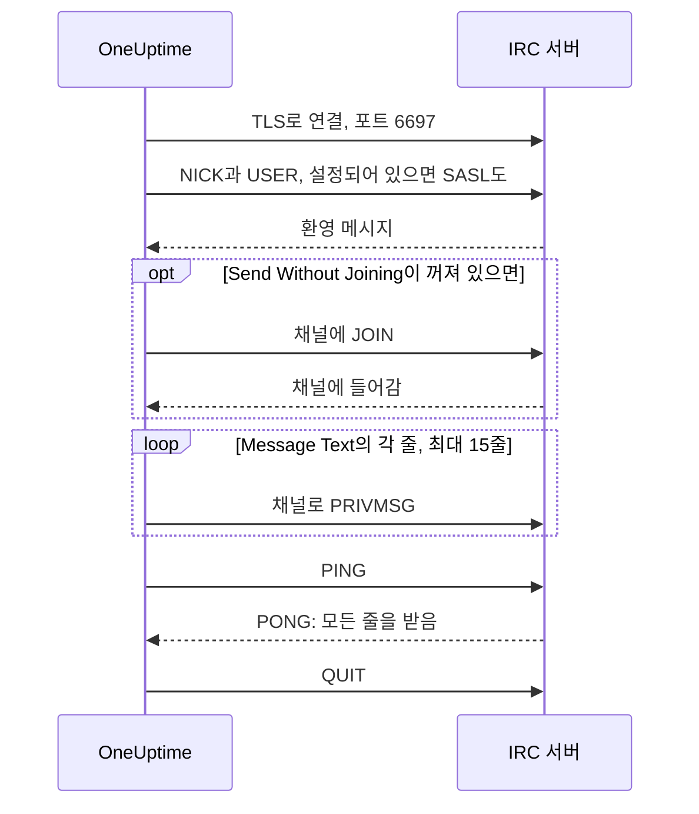

# IRC 통합

Libera.Chat, OFTC 또는 직접 운영하는 서버 등 어떤 IRC 네트워크의 채널에든 인시던트 업데이트를 게시합니다.

IRC에는 웹훅이 없으므로 OneUptime의 워크플로 단계 **Send Message to IRC**는 일반 IRC 클라이언트처럼 직접 서버에 연결합니다. 설치할 것도, 등록할 앱도 없습니다. 이 통합은 **아웃바운드**입니다: OneUptime은 채널에 게시만 하고 그곳의 대화는 읽지 않습니다.

:::cards
- [작동 방식](#작동-방식): 단계의 한 번 실행이 서버와 주고받는 내용.
- [설정](#통합-설정): 서버와 채널, 비밀번호, 그리고 워크플로. 템플릿으로 또는 처음부터.
- [팁](#팁): 채널에 들어가지 않고 게시하기, SASL, 긴 메시지와 몰리는 실행.
- [문제 해결](#문제-해결): 단계의 오류가 뜻하는 것과 고칠 곳.
:::

## 작동 방식

단계는 실행될 때마다 IRC 클라이언트처럼 IRC 서버와 짧은 대화를 나눈 뒤 연결을 끊습니다.

1. **연결.** 단계는 TLS로 포트 `6697`에 연결하고 서버의 인증서를 확인합니다.
2. **등록.** 다른 **Nickname**을 설정하지 않으면 `OneUptime`으로 등록하고, **SASL Username**과 **SASL Password**가 입력되어 있으면 SASL로 로그인합니다.
3. **입장.** **Send Without Joining**이 꺼져 있으면 채널에 들어갑니다. 채널에 키가 있으면 **Channel Key**를 사용합니다.
4. **전송.** **Message Text**의 각 줄은 각각 하나의 IRC 메시지, 즉 `PRIVMSG`로 나갑니다.
5. **확인.** IRC는 "전달됨"을 알려 주지 않으므로, 단계는 `PING`을 보내고 서버의 `PONG`을 기다립니다. 서버는 순서대로 응답하므로, 그때까지 메시지 거부가 있었다면 이미 도착해 있습니다.
6. **종료.** 서버에서 나갑니다.

서버가 모든 줄을 받으면 단계는 **성공** 출력으로 진행합니다. 서버에 연결할 수 없거나, 서버가 연결, 닉네임, 비밀번호, 채널 또는 메시지를 거부하면 **오류** 출력으로 진행하며, 서버가 이유를 밝혔다면 서버의 말 그대로 이유를 전합니다.

## 시작하기 전에

- OneUptime Cloud에서는 **Growth** 이상의 플랜: 워크플로와 그 변수는 이 플랜에 포함됩니다. 결제가 없는 셀프 호스팅 설치에는 플랜 제한이 없습니다.
- 워크플로를 만드는 역할: **Project Owner**, **Project Admin** 또는 **Workflow Admin**.
- 네트워크가 로그인을 요구한다면 그 IRC 네트워크의 계정. Libera.Chat은 일부 클라우드 및 VPN 주소에서 오는 연결에 로그인을 요구합니다.

## 통합 설정

:::steps
### 서버와 채널 고르기

메시지를 보낼 곳을 정합니다: 서버의 호스트 이름(예: `irc.libera.chat`)과 채널(예: `#your-channel`)입니다.

- **IRC Server**에는 호스트 이름만 입력합니다: `ircs://`도 포트도 붙이지 않습니다. 단계는 TLS로 포트 `6697`에 연결합니다. 서버가 다른 포트에서 TLS를 받는다면 **추가 필드**의 **Port**에 설정합니다.
- **Channel**은 채널이어야 합니다. 여기에 닉네임을 입력하면 거부되므로, 단계가 실수로 누군가에게 개인 메시지를 보내는 일은 없습니다.

서버는 OneUptime이 연결할 수 있도록 허용된 곳이어야 합니다. 루프백(`localhost`, `127.0.0.1`), 링크 로컬, 클라우드 메타데이터 주소는 항상 거부됩니다. OneUptime Cloud에서는 사설 네트워크 주소에 있는 서버도 거부됩니다. 셀프 호스팅 설치는 `DATA_SOURCE_BLOCK_PRIVATE_ADDRESSES`가 `true`로 설정되어 있지 않다면 자체 네트워크의 IRC 서버에 연결할 수 있습니다.

### 비밀번호를 시크릿 변수로 저장하기

서버, 네트워크, 채널 모두 비밀번호가 필요 없다면 이 단계는 건너뜁니다. 필요하다면 각 비밀번호를 시크릿 [전역 변수](/docs/workflows/variables#전역-변수)로 저장합니다. 그러면 워크플로에는 비밀번호 대신 변수 이름이 들어가고, 비밀번호는 한곳에서 바꿀 수 있습니다.

| 설정                | 입력해야 하는 경우                                                               | 변수 예시             |
| ------------------- | -------------------------------------------------------------------------------- | --------------------- |
| **Server Password** | 연결할 때 서버나 바운서가 비밀번호를 요구합니다.                                 | `IRC_SERVER_PASSWORD` |
| **SASL Password**   | 네트워크가 계정 로그인을 요구합니다. **SASL Username**에는 계정 이름을 넣습니다. | `IRC_SASL_PASSWORD`   |
| **Channel Key**     | 채널에 키가 있습니다(모드 `+k`).                                                 | `IRC_CHANNEL_KEY`     |

저장하려면 **워크플로 → 전역 변수**를 열고 **워크플로 변수 만들기**를 클릭합니다. **이름**에 이름을 입력하고 **다음**을 클릭합니다. **콘텐츠**에 비밀번호를 붙여 넣고 **시크릿**을 켠 다음 **워크플로 변수 만들기**를 클릭합니다. 실행 로그에는 시크릿 변수의 값 대신 `[REDACTED]`가 표시됩니다.

### 워크플로 만들기

워크플로 전체를 만들어 주는 템플릿에서 시작하거나 처음부터 만듭니다.

:::tabs
@tab 템플릿으로
1. **워크플로**를 열고 **워크플로 생성**을 클릭합니다.
2. **템플릿 검색…**에 `IRC`를 입력하고 **Tell IRC when an incident opens**를 클릭한 다음 **이 템플릿 사용**을 클릭합니다.
3. 이름 **Notify IRC on new incident**는 그대로 두거나 바꾸고, **다음**을 클릭합니다.
4. **IRC Server**와 **IRC Channel**을 입력하고 **워크플로 생성**을 클릭합니다.

워크플로가 **빌더**에서 세 단계와 함께 열립니다: **On Create Incident**, 인시던트의 번호, 제목, 심각도, 상태를 두 줄로 게시하는 **Send Message to IRC**, 그리고 그 **오류** 출력에 연결되어 메시지가 전달되지 않은 이유를 기록하는 **로그** 단계입니다. 서버와 채널은 워크플로 변수 `ircServer`와 `ircChannel`로 저장됩니다. 이전 단계에서 비밀번호를 저장했다면 **Send Message to IRC**를 클릭하고 **추가 필드**를 연 다음, 각 설정의 **{ }** 버튼으로 변수를 고릅니다.
@tab 처음부터
1. **워크플로**를 열고 **워크플로 생성**을 클릭한 다음, **처음부터 시작**을 고르고 워크플로 이름을 정한 뒤 **워크플로 생성**을 클릭합니다.
2. **빌더**에서 **Choose what starts this workflow**를 클릭하고 **Popular** 아래의 **On Create Incident**를 고릅니다. 트리거를 클릭하고 **Select Fields**에서 메시지에 보여 줄 인시던트 필드(예: 제목)를 고릅니다.
3. **구성 요소 추가**를 클릭하고 `irc`를 검색한 다음 **Send Message to IRC**를 클릭합니다. 트리거의 **성공** 출력을 이 단계에 연결합니다.
4. 새 단계를 클릭하고 **IRC Server**, **Channel**, **Message Text**를 입력합니다. **Message Text**의 **{ }** 버튼으로 인시던트 필드(예: 제목)를 넣을 수 있습니다.
5. 이전 단계에서 비밀번호를 저장했다면 **추가 필드**를 엽니다. **Server Password**, **SASL Password** 또는 **Channel Key**에서 **{ }**를 클릭하고 **Global variables** 아래에서 변수를 고릅니다. **SASL Username**에는 계정 이름을 넣습니다.
:::

### 켜고 테스트하기

**빌더** 위쪽의 **활성화됨** 스위치를 켭니다. 이제부터 새 인시던트는 모두 채널에 게시됩니다.

인시던트를 새로 열지 않고 테스트하려면 **워크플로 실행**을 클릭하고, 이미 있는 인시던트의 ID를 **인시던트 ID**에 넣습니다. 인시던트 페이지에 ID가 표시됩니다. **Run Workflow Manually**를 클릭하고 **Run**으로 확인합니다. **워크플로 실행** 패널이 실행을 따라갑니다: IRC 단계의 로그에 보낸 줄 수(예: `Sent 2 lines to #your-channel.`)가 나오고, 메시지가 채널에 나타납니다. 단계가 대신 **오류**로 진행하면 로그에 이유가 나옵니다: [문제 해결](#문제-해결)을 참고하세요.
:::

## 팁

- **채널에 들어가지 않고 게시하기.** 대부분의 채널은 멤버의 메시지만 받으므로(모드 `+n`), 단계는 게시하기 전에 채널에 들어가고 게시한 뒤 바로 나갑니다. `-n` 채널은 바깥에서 오는 메시지도 받습니다: **추가 필드**에서 **Send Without Joining**을 켜면 채널에 단계가 들어오고 나가는 모습이 보이지 않습니다.
- **SASL로 로그인하기.** Libera.Chat처럼 SASL을 쓰는 네트워크에서는 **SASL Username**과 **SASL Password**를 입력해 계정에 로그인합니다. Libera.Chat은 일부 클라우드 및 VPN 주소에서 오는 연결에 이를 요구합니다. [Libera.Chat의 SASL 안내](https://libera.chat/guides/sasl)를 참고하세요.
- **15줄 한도에 유의하기.** **Message Text**의 각 줄은 각각 하나의 IRC 메시지이고, 긴 줄은 맞게 나뉘며, 빈 줄은 빠집니다. 메시지는 최대 15줄의 IRC 메시지로 보내집니다: 더 긴 메시지는 잘리고, 마지막 줄이 그 사실을 알립니다. 처음 네 줄은 곧바로 나가고 나머지는 IRC 클라이언트처럼 1초에 한 줄씩 나가므로, 15줄은 약 11초가 걸립니다.
- **몰리는 실행은 한 메시지로 묶기.** 실행마다 연결이 따로이고, IRC 네트워크는 한 주소가 연결할 수 있는 빈도를 제한합니다. 짧은 시간에 실행이 몰리면 `Reconnecting too fast` 같은 이유로 거부될 수 있으며, 다른 거부와 마찬가지로 **오류**로 진행합니다. 1분에 여러 번 실행될 수 있는 워크플로라면 전할 내용을 한 메시지로 묶거나 직접 운영하는 서버를 통해 보냅니다.
- **IRC 고유의 코드로 서식 넣기.** IRC에는 Markdown이 없으므로 텍스트는 입력한 그대로 보내집니다. 굵게나 색상 같은 IRC 서식 코드는 작동합니다.
- **TLS가 없는 서버.** **Disable TLS**는 TLS를 제공하지 않는 서버에만 켭니다: 그러면 단계는 포트 `6667`에 연결하고, 비밀번호는 암호화되지 않은 채로 보내집니다. 자체 인증 기관이 발급한 서버 인증서를 신뢰하려면, 셀프 호스팅 설치에서 대신 `NODE_EXTRA_CA_CERTS`를 설정합니다.
- **다른 닉네임.** **Nickname**을 설정하지 않으면 메시지는 `OneUptime`에서 옵니다. 닉네임이 이미 쓰이고 있으면 단계가 밑줄이나 숫자를 덧붙입니다.

## 문제 해결

단계가 **오류**로 진행하면 실행 로그에 이유가 나오며, 그 문장은 다음 중 하나처럼 시작합니다.

:::details "The IRC server refused the connection"
서버나 바운서가 연결을 거부했으며, 메시지 끝에 그 이유가 있습니다. 서버가 비밀번호를 원하면 메시지에 그렇게 나오므로 **Server Password**를 입력하거나 확인합니다.
:::

:::details "SASL sign-in failed"
네트워크가 계정이나 비밀번호를 받아들이지 않았습니다. **SASL Username**과 **SASL Password**를 확인합니다.
:::

:::details "Could not join #your-channel"
채널이 단계를 들여보내지 않았으며, 이유는 메시지에 나옵니다. 키가 있는 채널은 그 키를 **Channel Key**에 넣어야 합니다.
:::

:::details "Could not send to #your-channel"
서버가 메시지를 거부했으며, 이유는 오류 메시지에 나옵니다. **Send Without Joining**이 켜져 있다면 채널이 멤버의 메시지만 받는 것일 수 있습니다: 꺼 주세요.
:::

:::details "The TLS certificate of the IRC server … is not trusted"
서버의 인증서는 OneUptime이 신뢰하는 인증서가 아닙니다. 셀프 호스팅 설치는 `NODE_EXTRA_CA_CERTS`로 자체 인증 기관을 신뢰하게 할 수 있습니다. **Disable TLS**는 TLS를 제공하지 않는 서버에만 켭니다.
:::

## 다음 단계

:::cards
- [컴포넌트 → IRC](/docs/workflows/components#irc): 단계의 모든 설정과 출력의 의미.
- [변수](/docs/workflows/variables#전역-변수): 시크릿 전역 변수와 단계에서 쓰는 방법.
- [실행 기록](/docs/workflows/runs-and-logs): 워크플로의 각 실행이 무엇을 했는지 확인합니다.
- [통합 개요](/docs/integrations/index): 아웃바운드 패턴과 연결할 수 있는 다른 도구.
:::
